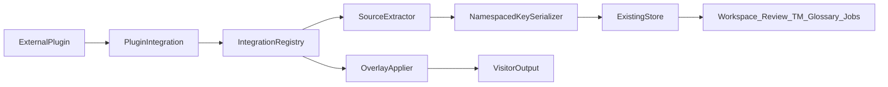

# A.1 — Plugin Integration Framework — Implementation Plan

**Status:** **Architecture Accepted** — ADR-0017 **Accepted**; A.1 implementation **authorized**; production coding **not started**
**Plan freeze:** Ownership, Integration API v1, `p:` identity, registry, lifecycle, reference fixture, and admission contracts frozen
**ADR:** [0017-plugin-integration-framework-ownership-and-identity.md](../adr/0017-plugin-integration-framework-ownership-and-identity.md) (**Accepted** 2026-08-07)
**Roadmap:** [POST_V1_PLATFORM_ROADMAP.md](POST_V1_PLATFORM_ROADMAP.md) Program A — A.1
**Planning branch (merged):** `feature/a1-plugin-integration-framework-plan`
**Implementation branch:** `feature/a1-plugin-integration-framework` (create from `main` after ADR acceptance; coding starts with A10)
**Baseline (plan authoring):** `main` @ `0d26b848f2c36e787c553a9f87579e09b079c982`
**Related:** ADR-0001 (overlay), ADR-0005/0007 (segment + hash), ADR-0013 (`b:`), ADR-0016 (Elementor ownership principles), A.2/A.3/A.4 evidence

**Operational success (after implementation):** External plugins can expose visitor-facing translatable values to AI Multilingual through a versioned Integration API without AIML owning foreign persistence, without a second translation pipeline, and without weakening Gutenberg `b:` or Elementor `e:` families.

**This plan is the frozen implementation contract for A.1.** ADR-0017 is Accepted. Create the implementation branch and begin **A10**. Do not open WooCommerce, forms, or other product integrations under A.1.

---

## 1. Purpose

Define the long-lived **Plugin Integration Framework** — the production extension contract by which first-party or third-party WordPress plugins expose **visitor-facing** translatable content to AI Multilingual.

A.1 is the **framework**. It is not WooCommerce coverage, not forms coverage, not theme chrome, and not a generic HTML translation layer. Later milestones (A.7, A.8, E.*) consume this framework.

---

## 2. Preconditions (verified at plan authoring)

| Precondition | Status |
|---|---|
| Platform v1.0.0 released; P1 complete | **Pass** |
| A.2 / A.3 Elementor complete | **Pass** |
| A.R2 / A.4 Nested Gutenberg complete (tag `a4-nested-gutenberg-complete`) | **Pass** |
| Baseline `main` @ `0d26b848f…` | **Pass** |
| Migrator `TARGET` = **6** (no schema bump in A.1) | **Pass** |
| No `IntegrationRegistry` / generic plugin bridge in `src/` | **Pass** |
| Store accepts opaque `segment_key` (`VARCHAR(191)`) without family parsing | **Pass** |
| Gutenberg `b:` and Elementor `e:` unchanged | **Pass** |
| Canonical next Program A architecture milestone is A.1 | **Pass** |

If any precondition regresses before coding: **STOP**.

---

## 3. Goals

1. Freeze Integration API **v1** as a stable extension surface with clear public vs internal boundaries.
2. Provide a code-owned central registry and fail-safe lifecycle when external plugins are missing/incompatible.
3. Provide a validated namespaced identity serializer (**Option B**) with reserved family prefix `p:`, collision-safe against `b:` and `e:`.
4. Feed all integration units into the **existing** Store → Workspace → Review → TM → Glossary → Jobs pipeline.
5. Enforce visitor-facing-only scope and non-ownership of foreign persistence.
6. Ship a **test/reference fixture** integration that proves the framework without product coupling.
7. Define an admission process for future integrations (A.8 and beyond).
8. Leave Gutenberg and Elementor first-party paths unchanged in A.1.

---

## 4. Product ownership principle (frozen)

**AI Multilingual never assumes ownership of another plugin's canonical persistence model.**

| Owner | Owns |
|---|---|
| External plugin | Source records, persistence, lifecycle semantics, which outputs are visitor-facing |
| AIML | Translation overlays, Store rows, TM, Glossary, Review state, Jobs orchestration, bounded diagnostics |

**AIML must not:**

- duplicate complete foreign records into AIML schema;
- mutate foreign persistence to establish AIML identity;
- scrape final HTML as the primary architecture;
- translate wp-admin / settings / operator UI;
- infer translatable surfaces from arbitrary string-looking values;
- use fuzzy matching as identity.

**Ambiguous ownership → source fallback.**

---

## 5. Visitor-facing boundary (frozen)

A.1 exists only for content exposed to site visitors/customers.

**Conceptually in scope (when an integration admits them):** frontend widgets/labels/notices, visitor/customer forms, customer-facing dynamic content with deterministic identity, plugin-rendered frontend fragments, outbound customer-facing content **only** when the producing plugin explicitly integrates.

**Explicitly out of scope:**

- wp-admin, settings screens, operator interfaces, diagnostic UI;
- arbitrary outgoing email interception;
- arbitrary PDF / SMS / webhook / feed interception;
- post-render page scraping.

For non-page outputs, the producing plugin must expose deterministic translation surfaces through its own integration. **AIML does not intercept arbitrary output channels globally.**

---

## 6. Architecture overview

A.1 is a thin extension layer — **not** a second translation architecture.



### Conceptual components (illustrative names; follow repo conventions at coding)

| Component | Role |
|---|---|
| `IntegrationRegistry` | Code-owned central registry |
| `PluginIntegrationInterface` | Integration contract (identity, extract, overlay, compatibility) |
| `TranslationUnitDescriptor` | Unit shape compatible with Store / SegmentAssembler |
| `NamespacedKeySerializer` | Option B validated `p:` key builder/parser |
| `SourceExtractor` | Deterministic allowlisted extraction |
| `OverlayApplier` | Request-time overlay via plugin-supported hooks |
| `CompatibilityProbe` | Version/hook/health state |
| Diagnostics counters | Bounded metrics (logger → aggregator pattern) |

**Gutenberg and Elementor remain first-party parallel paths in A.1.** Migrating them onto this framework is out of scope.

---

## 7. Integration API v1 (frozen conceptual shape)

### Public / extension contracts (stable)

Intended for first-party or third-party integrations:

- Integration registration entry point (typed objects);
- `PluginIntegrationInterface` (and narrowly related value objects that integrations must construct);
- Namespaced identity **component** types consumed by the serializer;
- Documented public WordPress hooks that AIML fires for integration wiring (if any), versioned under Integration API v1;
- Admission record schema (documentation contract).

### Internal application contracts (not public)

- Store repositories, SegmentAssembler internals, Workspace REST ViewModels internals;
- Diagnostics aggregators, Jobs repositories;
- Orchestration inside `Extractor` / `Plugin.php` composition root;
- Internal DTOs used only between AIML services.

**Do not expose internal DTOs merely for convenience.**

### Versioning governance

Breaking Integration API v1 changes require:

1. deprecation policy;
2. version bump (v2);
3. migration guidance;
4. normal architecture governance (ADR when contracts change).

Additive, backward-compatible extension within v1 is allowed when documented.

---

## 8. Central registry (frozen)

**Owner:** `IntegrationRegistry` (single central registry).

**Requirements:**

- code-owned registration (constructor / bootstrap);
- deterministic boot lifecycle;
- integration IDs validated before registration;
- duplicate registration rejected deterministically;
- **no** arbitrary PHP callbacks sourced from database settings;
- **no** integration-specific branching inside generic Store / TranslationService / Review / TM / Glossary / Jobs services;
- missing integrations have **zero** effect on AIML core.

An optional WordPress registration action (e.g. `aiml_register_integrations`) may exist for extension wiring, but registration data must still resolve to **typed, code-owned** integration objects. Untrusted serialized callback configuration is forbidden.

---

## 9. Namespaced identity — Option B (frozen)

**Decision: Option B.** The framework provides a validated serializer. Integrations supply typed components. Integrations **do not** construct arbitrary segment-key strings.

### Reserved family

Prefix: **`p:`** (distinct from Gutenberg `b:` and Elementor `e:`).

### Conceptual composition

```text
p:<integration_id>:<owner_type>:<owner_id>:<field>[:<nested_id>...]
```

Delimiter grammar above is the **default illustration**. Final exact grammar, optional nested arity, and escaping rules are confirmed in ADR-0017 + A12 serializer tests. The plan freezes invariants, not a silent production authorization of an untested string form.

### Frozen invariants

- `integration_id` immutable after release (lowercase safe token);
- owner type explicit;
- owner ID deterministic;
- field explicit;
- nested identity optional and deterministic when present;
- **no source text in identity**;
- source hash = freshness only (ADR-0007);
- no fuzzy identity;
- no structural-path identity unless independently proven and ADR-accepted;
- collision-safe against `b:` and `e:`.

### Integration namespace rules

| Rule | Requirement |
|---|---|
| Uniqueness | Globally unique among registered integrations |
| Format | Lowercase safe token (`[a-z0-9_-]+` — exact class frozen in A12/ADR) |
| Immutability | Must not change after first release of that integration |
| Localization | Not localized; not user-facing |
| Collision | Must not equal or reinterpret `b` / `e` family prefixes |

---

## 10. Serializer length / validation contract (frozen)

Store `segment_key` is **`VARCHAR(191)`**. A.1 **must not** bump schema.

The future serializer (A12, after ADR-0017) **must** define and test:

| Constraint | Requirement |
|---|---|
| Token character class | Explicit allowlist (ASCII-safe preferred for keys) |
| Max component lengths | Per-token ceilings |
| Overall serialized-key maximum | **≤ 191** characters |
| Escaping / encoding | Deterministic; reversible for public parse if parse is public |
| Invalid component | Deterministic rejection |
| Truncation | **Forbidden** — no silent truncation |
| Collision tests | Distinct component tuples → distinct keys; no cross-family collisions |
| Unicode policy | Explicit (prefer reject non-ASCII in identity tokens) |
| Versioned behavior | Parser/serializer behavior versioned with Integration API v1 |

**Do not hash the entire identity merely to hide an invalid design** unless ADR-0017 explicitly chooses such a representation with full collision and diagnostics analysis.

If realistic integration identities cannot fit safely in 191 characters: **STOP and escalate** before implementation — do not invent a schema bump inside A.1.

---

## 11. Ownership classifications (frozen)

| Class | Meaning |
|---|---|
| `record-owned` | Stable external record is the owner |
| `document-owned` | WordPress/document scope owns the surface |
| `shared-definition-owned` | Shared/global definition with stable canonical ID (explicit only) |
| `runtime/dynamic` | Generated at runtime |
| `unsupported/ambiguous` | Must not be admitted |

Every admitted surface declares: canonical persistence owner, owner identifier, field identifier, source retrieval contract, overlay application contract, copy semantics, delete semantics, compatibility/version assumptions.

Shared-definition ownership is allowed **only** when the external plugin provides a stable canonical definition identity. Otherwise → source.

---

## 12. Extraction contract (frozen)

Each integration must **explicitly allowlist** visitor-facing source fields.

**Require:**

- deterministic identity via framework serializer;
- typed source values;
- source hash;
- bounded extraction;
- safe missing/empty handling;
- sanitization on read/write paths as applicable;
- no arbitrary recursive string scanning;
- no HTML scraping;
- no wp-admin extraction.

Units enter the existing platform pipeline (Store sync / Workspace assembly). **No second Store. No integration-specific translation pipeline.**

---

## 13. Overlay / output contract (frozen)

**Allowed:** official plugin filters; documented rendering hooks; data/view-model filters; explicit template integration points; plugin-supported APIs.

**Forbidden:** final-page HTML replacement; DOM scraping as primary mechanism; unscoped output buffering; source-record mutation to persist translated text.

**Local failure (frozen):**

```text
one integration value fails
  → render source for that value
  → continue remaining output
```

An integration failure must **never** take down the site.

---

## 14. Dynamic content policy (frozen)

| Class | Default disposition |
|---|---|
| Deterministic persisted source | Eligible for admission evidence |
| Deterministic generated source | Integration-specific evidence required |
| Runtime dynamic with stable identity | Possible future admission |
| Runtime dynamic without stable identity | Unsupported |
| Opaque rendered output | Unsupported |

Framework existence does **not** imply universal plugin translation.

---

## 15. External email / non-HTML output (frozen)

AIML does **not** automatically translate another plugin's emails, PDFs, feeds, notifications, SMS, or webhooks.

If a plugin owns such output, it may integrate only by exposing deterministic translation surfaces. A.1 may reserve extension points but **must not implement these channels**.

---

## 16. Lifecycle semantics (frozen)

| External state | AIML behavior |
|---|---|
| Plugin not installed | Integration unavailable; AIML core healthy |
| Installed but inactive | No extract/overlay; Store history retained |
| Incompatible version | Fail-safe; no overlay apply |
| Compatible / active | Normal operation |
| Integration disabled | No overlay; history retained |
| Degraded | Bounded diagnostics; source fallback where unsafe |
| Plugin removed | No apply; history retained (no auto-delete) |
| Plugin reactivated | Resume only after compatibility succeeds |

Overlays must not apply if the integration cannot safely resolve its owner. **No automatic deletion of translation history** merely because the external plugin is disabled.

---

## 17. Compatibility states (frozen)

Bounded states:

- `available`
- `unavailable`
- `compatible`
- `unsupported_version`
- `missing_required_hook`
- `disabled`
- `degraded`

Compatibility checks live **inside** integration boundaries. Do not scatter plugin-version checks through AIML core.

Each integration declares: plugin slug/package ID, supported version family/range, required hooks/APIs, health state, compatibility reason.

---

## 18. Workspace / Review / TM / Glossary / Jobs (frozen)

**Reuse existing platform contracts.** No new REST/CLI required for A.1 by default (PluginGuard REST allowlist unchanged unless a later ADR justifies a public surface).

### Additive Workspace context (only)

- integration ID;
- external object type;
- external object ID;
- human-readable field label;
- optional parent context.

Do **not** expose arbitrary foreign payloads.

| Subsystem | A.1 change |
|---|---|
| Review | Unchanged |
| TM | Unchanged |
| Glossary | Unchanged |
| Jobs | Unchanged — may process integration units only via existing orchestration |
| Crawling | No unrestricted site crawl; bounded enumeration is a future consuming-integration concern |

---

## 19. Capabilities / security (frozen)

- Reuse existing translation / Workspace capabilities; avoid per-plugin capability sprawl.
- Sanitize source and translated overlay output.
- Capability checks for editing through Workspace.
- No secrets in diagnostics.
- No arbitrary PHP callback execution from untrusted registration data.
- Integration registration is **code-owned**, not arbitrary database config.
- Public APIs remain additive under Integration API v1.

---

## 20. Diagnostics (frozen)

Bounded counters / status only (logger → aggregator pattern, akin to block extraction metrics):

- `integration_registered`
- `integration_available`
- `integration_incompatible`
- `unit_extracted`
- `unit_skipped`
- `overlay_applied`
- `source_fallback`
- `identity_error`
- `compatibility_error`

**Forbidden:** source/translation bodies; secrets; unbounded object IDs in persistent metrics. Low-cardinality integration-id dimensions are allowed where the metrics architecture supports them.

---

## 21. Reference integration (frozen)

**Approach:** test / acceptance **fixture integration only**.

Must **not** be WooCommerce, Fluent Forms, or any customer-facing product feature.

Must prove:

- registration; compatibility; namespaced identity; extraction; Store persistence;
- Workspace visibility; Review; TM; Glossary; Jobs compatibility where applicable;
- visitor overlay; local failure; plugin disabled behavior; reactivation; diagnostics.

Prefer a deterministic fixture plugin that exists only in test/acceptance environments. **Do not ship the fixture as a production customer integration.**

---

## 22. Admission process (frozen)

Every future integration requires a **canonical admission record** with:

- integration ID; plugin/package ID; ownership model; supported version range;
- exact visitor-facing surfaces; identity evidence; extraction evidence; overlay-hook evidence;
- sanitization; lifecycle behavior; copy/delete semantics; cache safety; performance;
- browser/output validation; limitations; disposition.

**Dispositions:** Supported | Experimental | Deferred | Unsupported.

No undocumented integration admission. Mirrors A.3 admission discipline (gate + record + matrix).

---

## 23. ADR requirement — hard gate

**ADR-0017 is Accepted** (2026-08-07). See [0017-plugin-integration-framework-ownership-and-identity.md](../adr/0017-plugin-integration-framework-ownership-and-identity.md).

**Reasons this ADR was required:**

1. third-party integration ownership vocabulary as a public platform contract;
2. Integration API v1 as a long-lived extension surface;
3. namespaced `p:` identity family + serializer validation rules.

### Implementation gate

| Work package | Gate |
|---|---|
| **A10** | Authorized — documentation / baseline / inventory |
| **A11+** | **Authorized** — ADR-0017 Accepted |

A.1 production implementation may proceed on `feature/a1-plugin-integration-framework`.

---

## 24. Work packages

### A10 — Baseline + integration contract inventory

| | |
|---|---|
| **Objective** | Inventory current Extractor / Store / Workspace / Elementor / Gutenberg touchpoints; confirm no framework exists; open validation log |
| **Scope** | Docs + inventory only; no production classes |
| **Deps** | This plan merged; ADR-0017 Accepted |
| **Likely files** | Validation log; inventory notes under `docs/plans/` or `research/` |
| **Public/internal** | N/A |
| **Tests** | None required beyond link/doc checks |
| **Acceptance** | Inventory complete; TARGET=6 confirmed; `b:`/`e:` unchanged |
| **Rollback** | Delete inventory docs |
| **Stop** | Unexpected existing bridge or schema drift |
| **Commit** | `docs(integrations): inventory A.1 baseline` |

### A11 — Integration registry + API v1

| | |
|---|---|
| **Objective** | Implement `IntegrationRegistry` + public Integration API v1 interfaces |
| **Scope** | Registry, interface stubs, boot wiring; no product integrations |
| **Deps** | **ADR-0017 Accepted**; A10 |
| **Likely files** | `src/Integration/*`; `src/Plugin.php` composition |
| **Public/internal** | Public: registry registration + `PluginIntegrationInterface`; Internal: wiring |
| **Tests** | Unit: duplicate reject, ID validation, missing plugin no-op |
| **Acceptance** | Registry deterministic; no DB callbacks |
| **Rollback** | Revert package |
| **Stop** | Integration-specific logic leaking into Store/TranslationService |
| **Commit** | `feat(integrations): add IntegrationRegistry and API v1` |

### A12 — Namespaced identity serializer

| | |
|---|---|
| **Objective** | Implement Option B `p:` serializer with length/validation contract |
| **Scope** | Serializer/parser; collision and ≤191 tests |
| **Deps** | ADR-0017; A11 |
| **Likely files** | `src/Integration/Identity/*` |
| **Public/internal** | Public: component types + serializer API; Internal: parse helpers |
| **Tests** | Unit: validation, length, collision, no truncation, cross-family isolation |
| **Acceptance** | Keys ≤191; invalid rejected; no silent truncation |
| **Rollback** | Revert serializer |
| **Stop** | Cannot fit realistic keys in 191 without unsafe design |
| **Commit** | `feat(integrations): add namespaced p: identity serializer` |

### A13 — Extraction + overlay contracts

| | |
|---|---|
| **Objective** | Wire extraction into existing Extractor pipeline; overlay appliers with local failure |
| **Scope** | Extract/overlay interfaces + orchestration hooks; no product plugins |
| **Deps** | A11, A12 |
| **Likely files** | `src/Integration/*`; `src/Translation/Extractor.php` (additive branch via registry) |
| **Public/internal** | Public: extract/overlay interfaces; Internal: Extractor merge |
| **Tests** | Unit/integration: extract → Store; overlay source fallback |
| **Acceptance** | Units in Store; local failure continues |
| **Rollback** | Disable registry branch |
| **Stop** | Second pipeline or HTML scrape |
| **Commit** | `feat(integrations): add extract and overlay contracts` |

### A14 — Compatibility / lifecycle / security

| | |
|---|---|
| **Objective** | CompatibilityProbe states + lifecycle fail-safes + sanitization hooks |
| **Scope** | States from §17; deactivate/reactivate; capability reuse |
| **Deps** | A11–A13 |
| **Likely files** | `src/Integration/Compatibility/*` |
| **Public/internal** | Public: compatibility status enum/API; Internal: probes |
| **Tests** | Missing/inactive/incompatible/degraded |
| **Acceptance** | AIML core healthy in all states; no auto-delete Store rows |
| **Rollback** | Revert package |
| **Stop** | Untrusted callbacks or capability sprawl |
| **Commit** | `feat(integrations): add compatibility and lifecycle guards` |

### A15 — Workspace / diagnostics / Jobs integration

| | |
|---|---|
| **Objective** | Additive Workspace metadata; diagnostics counters; Jobs path reuse |
| **Scope** | Assembler metadata fields; metrics; no new Jobs pipeline |
| **Deps** | A13, A14 |
| **Likely files** | `src/Workspace/SegmentAssembler.php` (additive); diagnostics |
| **Public/internal** | Internal Workspace metadata; public diagnostics events if documented |
| **Tests** | Workspace shows integration context; counters; Jobs can list units |
| **Acceptance** | Review/TM/Glossary/Jobs unchanged in behavior |
| **Rollback** | Hide metadata |
| **Stop** | New REST without ADR justification |
| **Commit** | `feat(integrations): wire Workspace diagnostics and Jobs reuse` |

### A16 — Reference fixture integration

| | |
|---|---|
| **Objective** | Test/acceptance-only fixture proving end-to-end framework |
| **Scope** | Fixture plugin under `tests/` or `acceptance/` only |
| **Deps** | A11–A15 |
| **Likely files** | `tests/fixtures/aiml-integration-reference/` (illustrative) |
| **Public/internal** | Internal test fixture — **not** a shipped product integration |
| **Tests** | Full matrix in §21 reference list |
| **Acceptance** | All prove items PASS; not loaded in production |
| **Rollback** | Remove fixture |
| **Stop** | Fixture becoming a customer feature |
| **Commit** | `test(integrations): add A.1 reference fixture` |

### A17 — Admission + performance validation

| | |
|---|---|
| **Objective** | Admission checklist templates + performance evidence for fixture |
| **Scope** | Docs + fixture perf measurements; no invented hard budgets unless measured |
| **Deps** | A16 |
| **Likely files** | Admission template under `docs/plans/`; evidence JSON |
| **Public/internal** | Documentation contract |
| **Tests** | Perf observation; admission record for fixture |
| **Acceptance** | Admission template usable by A.8; fixture evidence recorded |
| **Rollback** | Docs-only revert |
| **Stop** | Unrestricted crawl introduced for “perf” |
| **Commit** | `docs(integrations): add admission template and A.1 evidence` |

### A18 — Tier 0 / API docs / closure

| | |
|---|---|
| **Objective** | Full Tier 0; HOOKS/API docs; validation log PASS; merge readiness |
| **Scope** | Unit/integration/PluginGuard/PHPCS; docs; closure |
| **Deps** | A10–A17; ADR-0017 Accepted |
| **Likely files** | `docs/HOOKS.md`; validation log; roadmap pointers |
| **Public/internal** | Document public Integration API v1 |
| **Tests** | Full suites green; Gutenberg/Elementor regression |
| **Acceptance** | All ACs; FP=0 on fixture; merge + tag per repo convention |
| **Rollback** | Do not merge |
| **Stop** | Any AC fail |
| **Commit** | `docs(integrations): close A.1 Plugin Integration Framework` |

---

## 25. Acceptance criteria (~43)

1. AIML never owns foreign persistence for integration surfaces.
2. Visitor-facing boundary enforced; wp-admin excluded.
3. No arbitrary email/PDF/SMS/webhook interception.
4. Deterministic identity via Option B serializer only.
5. Reserved family `p:` does not collide with `b:` or `e:`.
6. Serializer enforces overall key length ≤ 191.
7. No silent truncation of identity components or full keys.
8. Invalid components rejected deterministically.
9. Source hash is freshness only — not identity.
10. No fuzzy identity; no unproven structural-path identity.
11. Integration IDs unique, immutable, lowercase-safe, non-localized.
12. Central registry is code-owned; duplicate registration rejected.
13. No DB-config / untrusted serialized callbacks for registration.
14. Missing external plugin → AIML core unaffected.
15. Incompatible version → fail-safe; no overlay apply.
16. Deactivation safe; reactivation requires compatibility success.
17. Store history retained across disable/remove (no auto-delete).
18. Extraction uses explicit allowlists only.
19. No HTML scraping; no arbitrary string scanning.
20. Overlay uses plugin-supported hooks/APIs only.
21. Local failure → source for that value; site continues.
22. Ambiguous ownership → source fallback.
23. Dynamic without stable identity / opaque output → unsupported.
24. Store reused — no second Store / second pipeline.
25. Workspace reused with additive metadata only.
26. Review unchanged.
27. TM unchanged.
28. Glossary unchanged.
29. Jobs unchanged — no plugin-specific job pipeline.
30. No unrestricted site crawl in A.1.
31. Source and overlay sanitization applied.
32. Diagnostics carry no bodies/secrets/unbounded IDs.
33. Integration API v1 versioning/deprecation policy documented.
34. Internal DTOs not accidentally published as extension API.
35. Reference fixture proves registration → extract → Store → Workspace → overlay matrix.
36. Disabled-fixture behavior verified.
37. Admission record template exists; undocumented admission forbidden.
38. Gutenberg behaviour unaffected.
39. Elementor behaviour unaffected.
40. Migrator TARGET remains 6 through A.1.
41. Unit suite green.
42. Integration suite green; PluginGuard green; PHPCS green (`git diff --check` clean).
43. Targeted acceptance PASS; rendered FP = 0 on fixture path.

---

## 26. Stop conditions

Stop future implementation if it requires:

- Store schema redesign or TARGET bump to “make keys fit”;
- unsafe segment-key truncation;
- second translation pipeline;
- foreign persistence mutation;
- fuzzy identity;
- generic HTML scraping;
- wp-admin translation;
- arbitrary/untrusted callback execution;
- integration-specific logic inside generic translation services;
- plugin-specific Jobs pipeline;
- unrestricted crawling;
- breaking existing Gutenberg/Elementor identity;
- exposing internal DTOs as accidental public API.

A future **product** integration (e.g. Woo) may need its own ADR without reopening ADR-0017’s framework contracts.

---

## 27. Out of scope (A.1)

- WooCommerce full coverage (A.7 family);
- Fluent Forms / forms product integrations;
- Elementor or Gutenberg expansion;
- WordPress/theme visitor chrome (A.6);
- Media Library translation;
- Navigation/shared Gutenberg ownership;
- email / PDF / SMS / webhook interception implementations;
- public plugin marketplace;
- full SDK packaging beyond the minimal framework contract (Program E);
- external certification program;
- wp-admin translation;
- product integrations beyond the reference fixture (A.7 / A.8 / etc.).

---

## 28. Risks

| Risk | Mitigation |
|---|---|
| Serializer cannot fit realistic keys in VARCHAR(191) | Length contract + STOP/escalate; no silent hash-hide without ADR |
| Framework becomes theoretical without a consumer | Reference fixture mandatory (A16) |
| Integrations leak into Store/TranslationService | Explicit stop condition; PluginGuard-class review |
| Premature public API freeze without ADR | Hard gate: A11+ blocked on ADR-0017 |
| Accidental Elementor/Gutenberg rewrite | Out of scope; regression ACs |
| Third parties register unsafe callbacks | Code-owned typed registration only |

---

## 29. Fast-track / architecture assessment

A.1 is **architecture-sensitive**. ADR-0017 is **Accepted**.

**Disposition:** Implementation authorized per A10–A18. No further architecture review required unless a stop condition is discovered during coding.

---

## 30. Branch / commit governance

| Stage | Branch |
|---|---|
| Planning (merged) | `feature/a1-plugin-integration-framework-plan` |
| ADR-0017 | Accepted on `main` |
| Implementation | `feature/a1-plugin-integration-framework` from updated `main` |
| A10–A18 | Implementation branch only |
| Closure | Merge + tag per repo convention (e.g. `a1-plugin-integration-framework-complete`) |

Do not implement product integrations (Woo/forms/etc.) on the A.1 framework branch beyond the reference fixture.

---

## 31. Exact next step

Begin **A10** on `feature/a1-plugin-integration-framework`: baseline inventory + validation log. Then A11 registry / API v1.

---

## Document control

| Item | Value |
|---|---|
| Canonical path | `docs/plans/A1_PLUGIN_INTEGRATION_FRAMEWORK_IMPLEMENTATION_PLAN.md` |
| Milestone | A.1 Plugin Integration Framework |
| Type | Architecture |
| Planning status | Merged; ADR-0017 Accepted |
| Implementation authorized | **Yes** (coding not started) |
