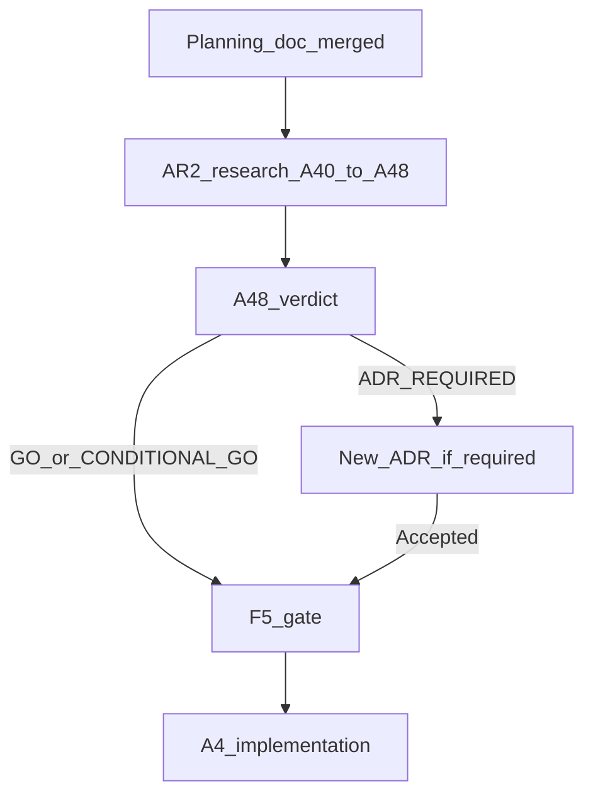
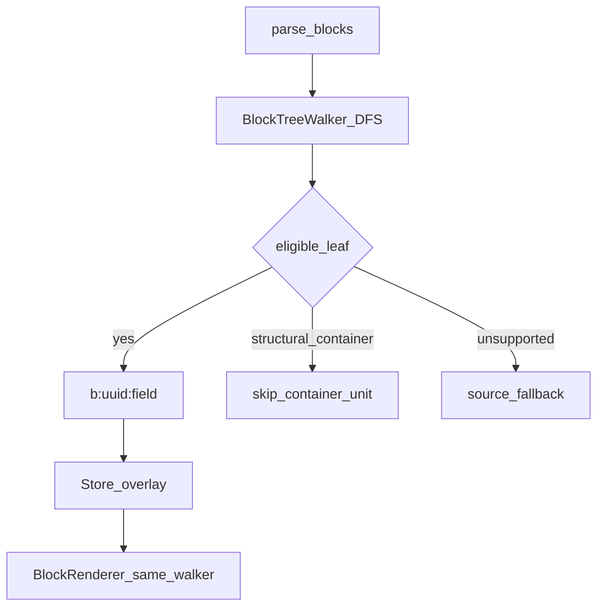

# A.R2 / A.4 — Nested Gutenberg Identity Research & Architecture Plan

**Status:** **Planning Frozen** — A.R2 research authorized **only after this document is merged**; A.4 production implementation **blocked** pending A48 verdict + F5 gate  
**Roadmap parent:** [POST_V1_PLATFORM_ROADMAP.md](POST_V1_PLATFORM_ROADMAP.md) — milestones **A.R2** (Research Spike) then **A.4** (Architecture / implementation post–identity decision)  
**Baseline:** `main` @ `5672938a8060a07687e201dd6cb1ebf330d5c891` (A.3 complete; tag `a3-elementor-widget-coverage-complete`)  
**Planning branch:** `feature/a4-nested-gutenberg-identity-plan`  
**Research branch (create after planning merge):** `feature/ar2-nested-gutenberg-identity`  
**ADR (leaf identity):** [0013-gutenberg-segment-identity.md](../adr/0013-gutenberg-segment-identity.md) — **Accepted** (Strategy F; `b:<uuid>:<field>`)  
**Prior coverage:** F14 leaf expansion — [STRATEGY_F_F14_BLOCK_EXPANSION.md](STRATEGY_F_F14_BLOCK_EXPANSION.md); [F14_IMPLEMENTATION_SUMMARY.md](F14_IMPLEMENTATION_SUMMARY.md)  
**A.3:** [A3_ELEMENTOR_WIDGET_COVERAGE_VALIDATION_LOG.md](A3_ELEMENTOR_WIDGET_COVERAGE_VALIDATION_LOG.md) (**Complete / merged / tagged**) — Elementor contracts must **not** leak into Gutenberg design  
**Research log (reserved):** `docs/plans/A4_NESTED_GUTENBERG_IDENTITY_RESEARCH_LOG.md` — create when **A40** begins on the research branch  

**Document role:** Combined strategic charter for **Phase 1 — A.R2 evidence/research** and **Phase 2 — A.4 implementation readiness decision**.  

**This document is NOT an A.4 production implementation plan.** Completing A40–A48 does **not** authorize nested Gutenberg production coding.

---

## 1. Purpose

Determine how nested / container Gutenberg content can be translated while preserving:

- existing Gutenberg UUID grammar `b:<uuid>:<field>`;
- document-local ownership;
- deterministic identity for every translated visitor-facing value;
- overlay-only Store persistence;
- stable identity across normal editing operations;
- safe copy/duplicate behavior;
- no fuzzy rematching;
- no rendered-HTML scraping;
- no source mutation beyond already accepted UUID ownership rules (ADR-0013);
- deterministic source fallback;
- no Store / TM / Review / Glossary / Jobs redesign;
- zero rendered false positives.

The charter must distinguish:

1. container identity;
2. child-block identity;
3. translatable leaf identity inside containers;
4. structured nested item identity where block attributes themselves contain repeated values;
5. recursion / traversal behavior;
6. shared / reusable block ownership where applicable.

---

## 2. Frozen A.R2 → F5 → A.4 milestone boundary

Canonical Post-v1 sequence (do not collapse):

```text
A.R2 — Nested Gutenberg Identity Spike
        ↓
A48 architectural verdict
        ↓
F5 architecture gate
        ↓
A.4 Nested / Container Gutenberg implementation planning → coding
```

| Rule | Frozen meaning |
|---|---|
| **A40–A48** | Execute **A.R2 research only** |
| Terminology | Prefer “A.R2 research”; do not call A40–A48 “A.4 research” |
| A.R2 exit | Explicit verdict: **GO — FAST TRACK** \| **CONDITIONAL GO** \| **ADR REQUIRED / NO-GO** |
| F5 | Roadmap freeze: nested identity accepted before A.4 coding |
| A.4 start | Only after A48 verdict satisfies F5 |
| Completing A40–A48 | Does **not** automatically authorize production coding |



---

## 3. Preconditions (verified at planning freeze)

| Precondition | Status |
|---|---|
| A.3 complete, merged, tagged `a3-elementor-widget-coverage-complete` | **Pass** |
| ADR-0013 Accepted (Strategy F leaf identity) | **Pass** |
| Production surface = seven F14 leaves; no container adapters | **Pass** |
| `BlockRegistry::is_eligible` requires empty `innerBlocks` | **Pass** |
| Baseline `main` @ `5672938a8…` | **Pass** |
| No A.4 / A.R2 production nested implementation in `src/` | **Pass** |

If any precondition regresses before A.R2 starts: **STOP**.

---

## 4. Existing-architecture hypothesis (to prove — not an implementation conclusion)

### Primary hypothesis

[`BlockTreeWalker`](../../src/Block/BlockTreeWalker.php) already DFS-recurses `innerBlocks`. Extraction and rendering already visit nested leaves inside unsupported containers ([`BlockExtractor`](../../src/Translation/BlockExtractor.php), [`BlockRenderer`](../../src/Translation/BlockRenderer.php)).

### Likely remaining gap (hypothesis)

1. **Eligibility policy** — adapters / registry reject non-empty `innerBlocks` (e.g. nested `core/list-item`).
2. **Container classification** — structural vs attr-owning containers.
3. **Field admission** — citation, caption-like attrs, etc.
4. **Shared / dynamic ownership exclusions** — Navigation, Query, reusable / synced patterns.

If proven, A.4 should remain an incremental [`BlockRegistry`](../../src/Block/BlockRegistry.php) / [`AdapterRegistry`](../../src/Block/AdapterRegistry.php) admission milestone — **not** a new nested-rendering architecture.

### Identity hypothesis (to verify under nesting)

| Claim | Status until A.R2 |
|---|---|
| Grammar remains `b:<uuid>:<field>` (initial field: `content`) | Hypothesis — preserve unless disproven |
| Nesting / structural path is **traversal context only**, never persistent identity | Hypothesis (ADR-0013 rejected Candidate C) |
| Parent UUID is **not** part of child identity | Hypothesis |
| Reorder / move between containers must not change child keys when UUID retained | Hypothesis to prove (A41) |

Do **not** promote these into frozen A.4 implementation contracts until labelled **Proven by experiment** or **Supported by evidence**.



---

## 5. Frozen principle — containers are not automatic translation units

A container block is **not** a translatable unit merely because it owns child blocks.

Distinguish:

| Kind | Meaning |
|---|---|
| Structural container | Owns layout/children only; no visitor-facing text of its own |
| Container with visitor-facing attributes | May need adapter / field admission (e.g. citation) |
| Nested leaf content | Child blocks with their own UUIDs |
| Repeated structured attributes | Attribute-level repeaters (if any) — separate identity proof |
| Dynamic / server-rendered content | Conservative deny until ownership proven |

Do **not** recursively translate arbitrary string-looking attributes.

Admission remains **block/field specific** via BlockRegistry + AdapterRegistry (F14 discipline).

---

## 6. Current production baseline (Gutenberg leaves)

Supported today ([`BlockRegistry::SUPPORTED_BLOCKS`](../../src/Block/BlockRegistry.php)):

| Block | Notes |
|---|---|
| `core/paragraph` | Leaf |
| `core/heading` | Leaf |
| `core/button` | Leaf |
| `core/list-item` | Leaf only — nested list-item with `innerBlocks` currently rejected |
| `core/preformatted` | Leaf |
| `core/verse` | Leaf |
| `core/code` | Leaf |

`core/list`, `core/quote`, `core/group`, `core/columns`, and other containers have **no** adapters. Dynamic names such as `core/navigation`, `core/query`, `core/block` appear in `DYNAMIC_BLOCK_NAMES`.

Segment grammar ([`Contract::SEGMENT_KEY_GRAMMAR`](../../src/Block/Contract.php)):

```text
b:<uuid>:<field>
```

---

## 7. Candidate family taxonomy (initial research dispositions)

No family is production-authorized by this document. Dispositions are **starting hypotheses** for A.R2.

### Structural containers

| Family | Initial disposition |
|---|---|
| `core/group` | Structural only — existing child traversal |
| `core/columns` | Structural only — existing child traversal |
| `core/column` | Structural only — existing child traversal |

### Textual / nested

| Family | Initial disposition |
|---|---|
| `core/list` | Structural wrapper — text via `core/list-item`; **no duplicate units** |
| `core/list-item` | Existing leaf support; **nested** list-item = eligibility / identity research |
| `core/quote` | Child traversal + possible citation attribute admission |
| `core/pullquote` | Child traversal + possible citation attribute admission |
| `core/details` | Child traversal + possible summary attribute admission |

### Media / layout

| Family | Initial disposition |
|---|---|
| `core/cover` | Nested text vs Media Library ownership gate |
| `core/media-text` | Nested text vs Media Library ownership gate |
| `core/gallery` | Nested captions vs Media Library ownership gate |

### Shared / dynamic

| Family | Initial disposition |
|---|---|
| `core/navigation` | Shared / dynamic — default **deferred** until ownership proven |
| `core/query` | Dynamic — default **unsupported / deferred** |
| `core/post-template` | Dynamic — default **unsupported / deferred** |
| Synced / reusable patterns | Shared-definition — default **deferred**; may require separate ADR |

Disposition vocabulary for A.R2 records:

- existing child traversal
- structural only
- adapter / field admission
- identity extension needed
- shared-definition ownership
- dynamic unsupported
- deferred

---

## 8. List / list-item hard gate

`core/list-item` is already a supported leaf; `core/list` is not.

A.R2 **must** prove:

1. `core/list` does **not** create duplicate units for text already represented by `core/list-item`;
2. nested list-items retain deterministic UUID identity;
3. reorder / move does not require path identity;
4. duplicate / copy behavior is safe (collision / first-wins repair per ADR-0013);
5. legacy list markup shapes are either deterministic or **explicitly denied**.

**Duplicate extraction is a stop condition for list admission.**

---

## 9. Nesting / recursion policy (research freeze)

Evaluate and then freeze under A42 / A48:

- Depth-first traversal (matches current walker).
- Maximum practical / declarative depth and malformed recursion protection.
- Empty `innerBlocks`; unsupported parent + supported child; supported parent + unsupported child; nested supported containers.
- Dynamic and server-rendered blocks remain conservative.

**Preferred safety rules (hypotheses):**

1. Unsupported parent does **not** automatically suppress a deterministically supported child unless rendering semantics make independent overlay unsafe.
2. Supported parent must **not** cause arbitrary descendants to become translatable.
3. Admission remains registry-driven; traversal may recurse.

---

## 10. Identity stability test matrix (A41)

| Experiment | Record |
|---|---|
| Edit nested child text | UUID before/after; key; hash; retention |
| Reorder siblings | |
| Move child between containers | |
| Move container | |
| Duplicate child / container | |
| Duplicate page | owner isolation |
| Copy/paste within / across documents | |
| Wrap / unwrap Group | |
| Convert paragraph ↔ heading (where relevant) | |
| List item reorder / duplicate / nest | |
| Column reorder | |
| Reusable / synced pattern insert / detach | |
| Revision restore; block recovery; invalid markup recovery | |

For each: UUID, block type, parent/container UUID (context only), translation key, source hash, expected retention/reset, collision behavior, ambiguity.

---

## 11. Quote / pullquote / details

Research where visitor-facing citation / summary text lives.

- Inner paragraph text → existing child identities (no double extract).
- Citation / summary as parent attributes → adapter admission only if document-owned and deterministic.
- Markup variants that break determinism → deny.

---

## 12. Cover / media-text / gallery

Distinguish nested child text, Media Library attachment metadata, block-owned caption/alt-like values, and dynamic media.

**Ownership rule:** AI Multilingual does **not** assume ownership of WordPress Media Library persistence. Reuse A.3/Image Outcome C discipline: admit only Elementor-owned / block-owned values proven in document storage — Gutenberg equivalent.

---

## 13. Navigation / shared / dynamic

Treat as architecture-sensitive. Determine whether they require:

- shared-definition ownership;
- consuming-document ownership;
- separate identity family;
- separate ADR;
- later Program A milestone.

**Candidate-local deferral is acceptable.** Do not force Navigation into A.4 if ownership is not document-local and deterministic.

---

## 14. Extraction model

Preserve existing extraction architecture.

A42 must evaluate whether current extract:

- sees nested `innerBlocks`;
- preserves UUIDs;
- avoids duplicate extraction;
- respects BlockRegistry allowlist;
- handles nested depth safely;
- treats dynamic / server-rendered blocks conservatively.

**Frozen principle:** Traversal may become recursive; admission remains registry-driven.  
Do **not** create a generic “translate every string attribute” walker.

---

## 15. Rendering model

Preserve the existing Gutenberg render path. Do **not** introduce a second renderer.

Require (to prove):

- supported child overlays render correctly inside unsupported containers;
- unsupported descendants remain source;
- no final HTML scraping / regex replacement over complete rendered blocks;
- no duplicate translation application;
- source fallback remains local;
- recursive failure never breaks the whole page.

If nested rendering requires architectural replacement of the existing renderer: **STOP** → ADR REQUIRED / NO-GO.

---

## 16. Adapter / registry model

Reuse F14 admission architecture. For each family define:

- structural only;
- direct existing-child traversal;
- adapter required;
- new field admission;
- unsupported / deferred.

Do **not** create a second nested-block registry.  
Any new adapter must remain block-specific and deterministic.  
Do **not** create a general external Adapter SDK (Program E).

---

## 17. Deny / fallback matrix (seed)

| Reason | Examples (seed) |
|---|---|
| Dynamic runtime | `core/query`, `core/post-template`, many `DYNAMIC_BLOCK_NAMES` |
| Shared-definition ownership | synced patterns, some Navigation |
| Unstable identity | path-only; unregistered UUID stripping without repair |
| Server-rendered uncertainty | dynamic blocks with non-authoritative saved HTML |
| Media ownership | attachment alt/caption not in block storage |
| Recursive ambiguity | nested-of-nested attribute structures unproven |
| Unsupported markup variant | legacy list shapes |
| Performance risk | pathological depth (measure first) |

Unsupported → **source**. No fuzzy rematch.

---

## 18. Performance / recursion safety (A47)

Measure (do not invent budgets before data):

- shallow nested page; deeply nested page; many siblings; repeated lists; columns with many children;
- mixed supported/unsupported; source-only; translated page.

Record: extraction time; unit count; Store lookups; render overhead; recursion depth; duplicate traversal.

Require guardrails against pathological recursion or malformed structures.

---

## 19. Workspace / Review / TM / Glossary / Jobs

Nested Gutenberg units must continue using existing platform contracts.

Confirm under A.R2 (and later A.4 acceptance):

- Workspace shows child units sensibly;
- parent / container context may be **additive metadata only**;
- Review / TM / Glossary / Jobs / stale / source hash / suggestions **unchanged** in ownership.

Do **not** introduce parent/container workflow state.

---

## 20. Evidence confidence model

Every important A.R2 conclusion must be labelled:

| Label | Meaning |
|---|---|
| **Proven by experiment** | Direct fixture / browser / unit evidence |
| **Supported by evidence** | Strong indirect evidence |
| **Inferred** | Reasonable but not measured |
| **Remaining assumption** | Explicitly not yet proven |

Fast-track architectural claims may rely only on the first two.  
Do **not** silently promote assumptions into A.4 contracts.

---

## 21. Research work packages (A.R2 only)

### A40 — Baseline nested-block inventory + fixture corpus

- **Objective:** Inventory real nested shapes on corpus + seed fixtures (group/columns/list/quote/cover/…).
- **Questions:** Which families appear; depth; legacy shapes; presence of aimlBlockId on nested leaves.
- **Fixtures:** Extend authored fixtures (`list-nested.html`, `nested-group-columns.html`, …).
- **Evidence:** Inventory JSON + fixture index.
- **Validation:** Corpus covers taxonomy §7.
- **Stop:** Cannot obtain representative nested content.
- **Impl boundary:** Docs/fixtures only — no production eligibility changes.

### A41 — Existing UUID stability under nesting / move / duplicate

- **Objective:** Prove or disprove UUID retention under the §10 matrix.
- **Questions:** Does move between containers preserve keys? Duplicate collision repair?
- **Evidence:** Before/after UUID tables; confidence labels.
- **Stop:** Child UUIDs unstable under normal nesting/move; path identity required.
- **Impl boundary:** Research only.

### A42 — Recursive extraction / traversal model

- **Objective:** Confirm walker recursion; duplicate extraction; unsupported parent + supported child.
- **Evidence:** Unit/integration against fixtures; no generic string walker.
- **Stop:** Traversal cannot fail safely; duplicate units unavoidable for list.
- **Impl boundary:** Research only.

### A43 — Structural container classification

- **Objective:** Confirm group/columns/column are structural-only.
- **Evidence:** No visitor-facing attrs requiring admission (or list any exceptions).
- **Stop:** Structural containers unexpectedly own critical visitor text without child blocks.
- **Impl boundary:** Research only.

### A44 — Textual container admission (List / Quote / Pullquote / Details)

- **Objective:** List hard gate + citation/summary ownership.
- **Evidence:** Dual-extract proofs; adapter necessity matrix.
- **Stop:** Duplicate list units; citation ownership ambiguous.
- **Impl boundary:** Research only — no adapters merged.

### A45 — Media / layout ownership (Cover / Media-text / Gallery)

- **Objective:** Block-owned vs Media Library vs dynamic.
- **Evidence:** Ownership table per control; Outcome A/B/C style decisions.
- **Stop:** Cannot separate Media Library from block storage safely.
- **Impl boundary:** Research only.

### A46 — Navigation / shared / dynamic ownership

- **Objective:** Document-local vs shared-definition vs dynamic.
- **Evidence:** Ownership experiments; ADR-needed flag.
- **Stop:** Minimum useful A.4 scope requires shared-definition ownership without ADR path.
- **Impl boundary:** Research only; deferral OK.

### A47 — Rendering / cache / performance

- **Objective:** Child overlays inside unsupported parents; FP=0; measure costs.
- **Evidence:** Browser matrix; timing table; no second renderer.
- **Stop:** Renderer replacement required; FP > 0; pathological recursion.
- **Impl boundary:** Research only.

### A48 — Evidence synthesis + implementation recommendation + ADR decision

- **Objective:** Produce GO / CONDITIONAL GO / ADR REQUIRED; recommend minimum A.4 surface; F5 readiness.
- **Evidence:** Full confidence-labelled synthesis + deny list updates (docs).
- **Validation:** All ACs §23 addressed or explicitly deferred with reason.
- **Stop:** See §22.
- **Impl boundary:** Verdict docs only — does **not** start A.4 coding.

---

## 22. A48 verdict model

### GO — FAST TRACK

Use when evidence proves:

- existing `b:<uuid>:<field>` is sufficient;
- child UUIDs remain deterministic under nesting / move / reorder;
- no parent / path identity required;
- no new ownership model required;
- recursive extraction / rendering can reuse existing architecture;
- no Store / schema change required;
- no renderer replacement required.

**Result:** No new ADR required. A.R2 may close. A.4 implementation planning may be fast-tracked after F5.

### CONDITIONAL GO

Use when:

- existing UUID identity works for a **bounded** family set;
- Navigation / shared / dynamic remain deferred;
- minimum useful A.4 scope remains document-local and deterministic.

**Result:** A.4 may proceed with an explicit allowlist. Deferred families remain blocked. A new ADR is required **only if** the admitted scope introduces a genuinely new architectural contract.

### ADR REQUIRED / NO-GO

Use when minimum useful nested support requires any of:

- new identity grammar;
- parent-dependent identity;
- shared-definition ownership;
- structural-path identity;
- Store / schema redesign;
- renderer replacement;
- source mutation beyond existing UUID mechanics.

**Result:** Do **not** begin A.4 implementation. Draft and Accept the required ADR first, or stop the initiative if unsafe.

---

## 23. Minimum A.4 surface recommendation (A48 duty)

A48 must recommend the **smallest safe** first production surface (advisory until F5). Classify:

- structural-only containers;
- child-traversal-safe families;
- adapter / field admissions;
- denied / deferred families.

Must explicitly disposition:

`core/group`, `core/columns`, `core/column`, `core/list`, nested `core/list-item`, `core/quote`, `core/pullquote`, `core/details`, `core/cover`, `core/media-text`, `core/gallery`.

Separately disposition:

`core/navigation`, `core/query`, `core/post-template`, synced / reusable patterns.

---

## 24. Branch governance

| Stage | Branch |
|---|---|
| Planning (this doc) | `feature/a4-nested-gutenberg-identity-plan` |
| After planning merge | Create `feature/ar2-nested-gutenberg-identity` from updated `main` |
| A40 start | Create `docs/plans/A4_NESTED_GUTENBERG_IDENTITY_RESEARCH_LOG.md` |
| A40–A48 execution | **Only** on the research branch |
| After A48 GO / CONDITIONAL GO + F5 | Create A.4 implementation-plan / implementation branch per normal governance |
| After A48 ADR REQUIRED | A.4 remains blocked until ADR Accepted |

Do **not** execute research on the planning branch.

---

## 25. ADR decision framework

| Outcome | ADR action |
|---|---|
| GO — FAST TRACK | No new ADR |
| CONDITIONAL GO | ADR only if admitted scope adds a new architectural contract |
| ADR REQUIRED / NO-GO | Draft + Accept before any A.4 coding |

Do **not** create an ADR in this planning task.

---

## 26. Acceptance criteria (research / planning)

1. Existing `b:<uuid>:<field>` grammar preserved as default hypothesis.  
2. No structural-path identity proposed without ADR REQUIRED.  
3. Recursive traversal model documented against current walker.  
4. Reorder stability experiments defined.  
5. Move-between-container stability experiments defined.  
6. Duplicate isolation experiments defined.  
7. Page-duplicate isolation experiments defined.  
8. List / list-item no double extraction is a hard gate.  
9. Nested list stability experiments defined.  
10. Quote citation ownership research defined.  
11. Pullquote / details attribute research defined.  
12. Media ownership gate mirrors document-owned-only discipline.  
13. Unsupported parent + supported child behavior specified.  
14. Supported parent + unsupported child behavior specified.  
15. Malformed recursion safety required.  
16. Dynamic blocks conservative by default.  
17. Navigation ownership disposition required at A48.  
18. Reusable / synced pattern disposition required at A48.  
19. No Store redesign in scope.  
20. No TM / Review / Glossary / Jobs redesign in scope.  
21. No HTML scraping.  
22. Local source fallback preserved.  
23. Performance evidence required before budgets.  
24. Clear minimum A.4 surface recommendation at A48.  
25. Explicit ADR decision at A48.  
26. Evidence confidence labels mandatory.  
27. A.R2 vs A.4 milestone boundary documented.  
28. F5 remains the coding gate.  
29. Completing A40–A48 does not authorize production coding.  
30. Elementor identity contracts do not leak into Gutenberg design.  
31. BlockRegistry / AdapterRegistry remain sole admission surfaces.  
32. No second nested registry.  
33. No generic “translate every string” walker.  
34. Workspace parent context is metadata-only if present.  
35. Candidate-local deferral allowed without failing A.R2.  
36. Research log created only at A40 on research branch.  
37. Planning branch remains docs-only.  
38. Stop conditions §27 enforced.  
39. Out of scope §28 enforced.  
40. Fast-track uses only Proven / Supported claims for architecture.

---

## 27. Stop conditions (A.R2 → block A.4)

Stop progression toward A.4 implementation if:

- nested identity requires structural paths;
- child UUIDs are not stable enough;
- duplicate / copy creates unresolvable collisions;
- nested translation requires rewriting canonical content beyond accepted UUID mechanics;
- renderer architecture must be replaced;
- Store schema must change;
- shared-definition ownership is mandatory for the minimum useful scope without an Accepted ADR;
- recursive traversal cannot fail safely;
- existing Gutenberg leaf behavior regresses;
- list admission would double-extract `list-item` text.

A candidate family may be deferred without failing the entire A.R2 spike.

---

## 28. Explicitly out of scope

- Elementor work (A.2 / A.3 closed; do not import `e:` grammar)
- WooCommerce site-wide coverage
- WordPress visitor chrome
- Theme Builder
- External plugin SDK
- Media Library translation system
- AIML render-cache activation
- wp-admin translation
- Dynamic Query / Post Template translation unless research proves deterministic ownership
- General Navigation implementation if ownership requires separate architecture
- A.4 production adapters, eligibility changes, migrations, REST, UI, schema
- Executing A40–A48 on the planning branch

---

## 29. Status and exact next step

**Status after this planning document:**

```text
Planning frozen / A.R2 research authorized after merge
A.4 production implementation still blocked
```

**Exact next step:**

1. Review / merge this planning document to `main`.  
2. Create `feature/ar2-nested-gutenberg-identity` from updated `main`.  
3. Begin **A40**.  
4. Create the research log at A40.  
5. Execute A40–A48.  
6. Use the A48 verdict to decide whether A.4 may fast-track or requires an ADR; pass F5 before A.4 coding.

---

## 30. Non-changes

Do not change:

- `b:<uuid>:<field>`;
- document-local UUID ownership;
- overlay storage;
- Store / TM / Review / Glossary / Jobs ownership;
- BlockRegistry / AdapterRegistry architectural ownership;
- no-scrape / no-fuzzy-rematch policies;
- A40–A48 ordering;
- candidate family set;
- roadmap program ordering;
- A.3 closure status.
