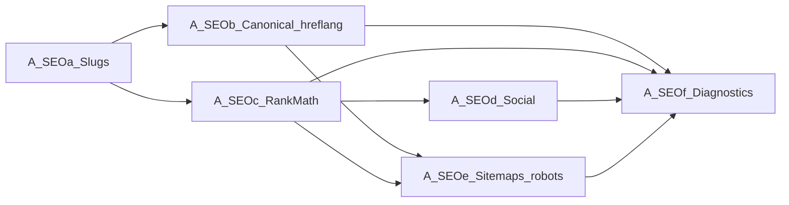

# A.SEO — Dependency Matrix

**Status:** Canonical dependency document for the A.SEO program  
**Parent plan:** [ASEO_PARENT_IMPLEMENTATION_PLAN.md](ASEO_PARENT_IMPLEMENTATION_PLAN.md)  
**Baseline:** `main` @ `48985be3395c8e9baa99260d80395e044584a18d`  
**Planning branch:** `feature/aseo-parent-plan`

This matrix is authoritative for **implementation order**, **shared contracts**, **ownership**, **regression**, and **validation order**. Child wave plans may refine surface allowlists; they must not invert these dependencies.

---

## 1. Implementation order (frozen)

| Order | Wave | May start coding only after |
|---|---|---|
| 1 | **A.SEOa** | Parent plan frozen on `main`; A.SEOa wave plan frozen |
| 2 | **A.SEOb** | A.SEOa URL identity contracts frozen (plan) / Supported surfaces for URLs available when claiming browser URL ACs |
| 3 | **A.SEOc** | A.SEOa URL identity frozen; Integration API v1 available |
| 4 | **A.SEOd** | A.SEOc Rank Math ownership path known when Rank Math owns social tags |
| 5 | **A.SEOe** | A.SEOa + A.SEOb; Rank Math sitemap ownership path from A.SEOc when Rank Math owns sitemaps |
| 6 | **A.SEOf** | Prior waves’ contracts exist; family closure after A.SEOa–e Supported surfaces |

**Hard rule:** No later wave may redefine URL ownership, slug identity, permalink rules, or redirect behavior from A.SEOa.

---

## 2. Milestone dependencies

| Wave | Hard deps | Soft / recommended deps | Provides to later waves |
|---|---|---|---|
| A.SEOa | Parent plan; ADR-0001/0002/0007/0008; Store; LanguageContext; TARGET 6 | — | Language-aware URLs; slug overlays; redirect policy |
| A.SEOb | A.SEOa; ADR-0008 | — | Canonical URLs; hreflang graph; language relationships |
| A.SEOc | A.1; ADR-0017; A.SEOa | A.SEOb before SERP-complete claims | Rank Math title/meta/schema cooperation |
| A.SEOd | A.SEOa; A.SEOc (when Rank Math owns OG/Twitter) | A.SEOb for absolute URL correctness | Social metadata overlays |
| A.SEOe | A.SEOa; A.SEOb; ADR-0008 | A.SEOc when Rank Math owns sitemaps | Sitemap/robots/indexability/discovery |
| A.SEOf | A.SEOa–A.SEOe contracts | Incremental checks allowed during earlier waves | Diagnostics / verification / health |

External program deps (not SEO-internal): P1, A.1, published-language routing already shipped. Product priority may delay coding until after A.6 — that is sequencing guidance, not an architecture dependency inversion.

---

## 3. Shared contracts

| Contract | Owner doc | Inherited by |
|---|---|---|
| Overlay-not-duplication | ADR-0001 | All waves |
| Prefix-strip routing | ADR-0002 | A.SEOa (primary), all URL consumers |
| Hash ≠ identity | ADR-0007 | All Store-backed SEO units |
| Preview exclusion / no fallback chains | ADR-0008 | A.SEOb, A.SEOe (primary), all indexability |
| `b:` / `e:` / `p:` identity families | ADR-0013 / 0016 / 0017 | All admissions |
| Integration API v1 | `INTEGRATION_API_V1.md` | A.SEOc+ plugin fields |
| TARGET = 6 | Migrator | All waves |
| Platform reuse chain | Parent plan §6 | All waves |
| Fail closed → source | Parent plan | All waves |
| No HTML scrape | ADR-0017 / parent | All waves |

---

## 4. Ownership matrix

| Surface | Canonical owner | AIML role | Primary wave |
|---|---|---|---|
| `post_name` / term slug persistence | WordPress | Overlay translated values | A.SEOa |
| Rewrite rules / rewrite bases | WordPress | No ownership; translated rewrite bases Deferred | A.SEOa |
| Permalink generation | WordPress | Language-aware URL generation | A.SEOa |
| `redirect_canonical` baseline | WordPress | Policy cooperation / replace blind suppress | A.SEOa / A.SEOb |
| Product permalink structure | WooCommerce | Respect structure; overlay slugs where admitted | A.SEOa |
| Product taxonomy rewrite structure | WooCommerce | Respect structure | A.SEOa |
| Shop page / WC endpoints | WooCommerce | Language prefix via Router; no endpoint redesign | A.SEOa |
| Language URL prefix | AIML Router (ADR-0002) | Strip/prefix | A.SEOa |
| Translated slug redirect policy | AIML | Own policy; no chains | A.SEOa |
| Canonical URL emission | AIML policy ± Rank Math | Cooperate; no duplicate conflicting policy | A.SEOb |
| hreflang / language relationships | AIML | Emit / coordinate | A.SEOb |
| SEO title / meta description | Rank Math (when active) | Overlay via official filters / Integration API | A.SEOc |
| Schema.org cooperation | Rank Math (when active) | Cooperate; do not annex | A.SEOc |
| OpenGraph / Twitter | Rank Math / WP emitter | Overlay admitted fields | A.SEOd |
| XML sitemap generation | Rank Math / WP | Language URL + indexability inputs | A.SEOe |
| robots / indexability | WP / Rank Math / AIML policy | Preview noindex; published crawlable | A.SEOe |
| SEO diagnostics | AIML Diagnostics | Bounded health/verification | A.SEOf |
| Elementor document body | Elementor (`e:`) | Not SEO ownership | — |
| Theme / Blocksy SEO chrome | Theme (if any) | Unsupported unless proven | defer |

---

## 5. Regression matrix

| After shipping… | Must not regress |
|---|---|
| A.SEOa | Prefix-strip routing; existing unprefixed default language; Woo product URLs; no redirect loops |
| A.SEOb | A.SEOa URLs; preview hidden from hreflang; switcher language links |
| A.SEOc | A.8 Fluent Forms; A.7 visitor overlays; Rank Math inactive → safe core path |
| A.SEOd | A.SEOc titles/meta; no scrape-based social tags |
| A.SEOe | A.SEOb hreflang reciprocity; preview absent from sitemaps |
| A.SEOf | Prior emitters unchanged; diagnostics add-only |

Cross-program regressions: Gutenberg `b:`, Elementor `e:`, Woo `p:woocommerce:…`, Fluent Forms bridge, Store/Workspace/Review/TM/Glossary/Jobs.

---

## 6. Validation order

1. **Preconditions** — TARGET 6; ADRs Accepted; Rank Math / Woo active state recorded  
2. **A.SEOa** — slug/permalink/redirect/404/collision  
3. **A.SEOb** — canonical + hreflang reciprocity + preview exclusion  
4. **A.SEOc** — Rank Math title/meta/schema cooperation; inactive fallback  
5. **A.SEOd** — OG/Twitter language correctness  
6. **A.SEOe** — sitemap validity; robots; crawlability  
7. **A.SEOf** — duplicate detection; leakage; FP control; GSC/Rich Results advisories  
8. **Family closure** — EN/SV end-to-end on admitted surfaces; no `src/` architecture violations

---

## 7. Child-plan authority

| Document | Authority |
|---|---|
| `ASEO_PARENT_IMPLEMENTATION_PLAN.md` | Family architecture + wave boundaries |
| **This matrix** | Order, deps, ownership, regression, validation order |
| `ASEOA_*` … `ASEOF_*` plans | Wave allowlists, work packages, implementation ACs |
| `docs/PRODUCT_PRIORITIES.md` | When to schedule coding vs other Program A work |

Conflict rule: child plan loses to parent + this matrix on ownership, URL identity, and order.

---

## Document control

| Item | Value |
|---|---|
| Canonical path | `docs/plans/A_SEO_DEPENDENCY_MATRIX.md` |
| Kind | Dependency / ownership / sequencing authority |
| Parent | `docs/plans/ASEO_PARENT_IMPLEMENTATION_PLAN.md` |
