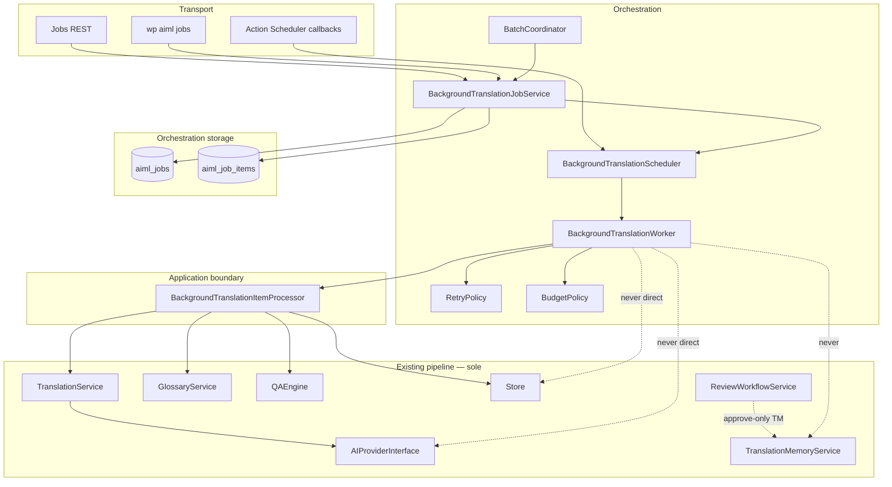
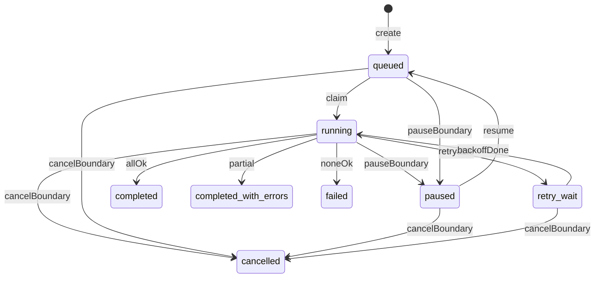

# Background Translation Jobs — Implementation Plan

**Status:** Architecture **frozen for review**; ADR-0011 amendment **Proposed** (2026-08-06) — **J1+ blocked** until Gate A or Gate B  
**Branch:** `feature/background-translation-jobs-plan`  
**Baseline:** `main` @ `adf38640f71b99ec027f7fef8d9131233e366618` (after Review Workflow closure)  
**ADR:** [0011-resumable-job-pipeline.md](../adr/0011-resumable-job-pipeline.md) — Accepted baseline; **amendment Proposed** (implementation gate)  
**Product parent:** [POST_V1_PRODUCT_ROADMAP.md](POST_V1_PRODUCT_ROADMAP.md) §11.3  
**Prior freezes:** [F11_FROZEN_API.md](F11_FROZEN_API.md), [GLOSSARY_MVP_IMPLEMENTATION_PLAN.md](GLOSSARY_MVP_IMPLEMENTATION_PLAN.md), [REVIEW_WORKFLOW_IMPLEMENTATION_PLAN.md](REVIEW_WORKFLOW_IMPLEMENTATION_PLAN.md), [ADR-0015](../adr/0015-review-workflow-and-tm-approval-policy.md)

**J0 gate:** **OPEN** — plan written; amended ADR-0011 disposition required before J1.  
**Implementation scope / WP order:** J0–J8 (unchanged). **No production code in this planning commit.**

---

## 1. Purpose

Deliver **safe asynchronous bulk translation** that orchestrates the **existing** translation pipeline — `TranslationService`, providers, Glossary, QA, Store, Review Workflow — with resumable jobs, leases, retries, budgets, and operator visibility.

Background Jobs must **not** create a second translation pipeline, auto-approve translations, or write TM before Review approval.

---

## 2. Success definition

Background Translation Jobs MVP succeeds when:

1. Operators can create bounded jobs for the four MVP job types.
2. Action Scheduler wakes workers; job tables own orchestration state.
3. Every item is processed only through `BackgroundTranslationItemProcessor` → existing platform services.
4. Job status, item status, and `requested_action` are separate and legally transitioned.
5. MariaDB-safe `active_lock_key` uniqueness prevents concurrent active jobs for the same object+language.
6. Duplicate AS callbacks and retries are idempotent.
7. Source/translation conflicts produce stable item results without silent overwrite.
8. Machine output lands as `machine_translated` + `review_status=not_submitted`; never auto-approved; never TM-written by workers.
9. Glossary intended/actual versions are recorded; fragments resolved via `GlossaryService`.
10. Budgets stop claiming new items without discarding successful persists.
11. Pause/cancel honor safe item boundaries.
12. Partial success and reconciled counters are correct.
13. REST/CLI/UI share services; secrets/prompts/bodies never enter job storage.
14. Frontend render path is unaffected by job failures or AS outages.
15. Amended ADR-0011 Gate A or Gate B is satisfied before schema/code (J1).

---

## 3. Architecture overview



**Frozen ownership:**

| Asset | Owner | May not |
|---|---|---|
| Orchestration state | `aiml_jobs` / `aiml_job_items` | Hold canonical translation bodies |
| Translation content | Store | Be written by workers bypassing TranslationService/Store semantics |
| Approval lifecycle | ReviewWorkflowService | Be auto-advanced by jobs |
| TM | TranslationMemoryService | Be written by job workers |
| Glossary data | GlossaryService | Be copied wholesale into job rows |
| AI generation | AIProviderInterface via TranslationService | Be called from Worker/AS/CLI directly |
| Wake-up | Action Scheduler | Become progress SoT or a second domain queue |
| Leases / retries / budgets | Job services | Bypass ItemProcessor for domain work |

---

## 4. ADR-0011 revalidation record

| ADR-0011 claim | Current platform | Disposition |
|---|---|---|
| Job table SoT; AS trigger-only | Still correct; AS not yet wired | **Keep** |
| Checkpoint without content; 16 KB soft cap | Still correct | **Keep** |
| Nullable unique lock for object+language | Partial unique index not portable on MariaDB | **Amend** → `active_lock_key` UNIQUE |
| “Implemented in Milestone 3” | False | **Amend** → Not implemented |
| Pipeline includes “update memory” | Conflicts with ADR-0015 | **Amend** → TM consult only; write-back on approve |
| Ten-stage opaque job | Sync path collapses stages into TranslationService | Compatible if Worker orchestrates + ItemProcessor delegates |
| Cost history on job rows | `ai_usage` table still absent | Job budget counters on job row for MVP; usage table deferred |

**Compatibility result:** ADR-0011 remains the architectural baseline. Material amendments are required and form the **J1 implementation gate**. See [ADR-0011](../adr/0011-resumable-job-pipeline.md).

---

## 5. Job types (MVP)

| Type | Code | Behavior |
|---|---|---|
| Translate selected segments | `translate_selected` | Materialize selected segment keys at create |
| Translate all missing for post/language | `translate_missing` | Resolve missing at create; materialize those items |
| Retranslate stale segments | `retranslate_stale` | Resolve stale at create; materialize; retranslate only when policy allows |
| Bulk translate posts/languages | `bulk_translate` | Create **N independent jobs** (one per post+language) sharing `batch_id`; each materializes its items |

All types share the same ItemProcessor pipeline. **Out of MVP:** automatic approval, automatic publishing, review assignments, glossary import jobs, WooCommerce crawling, site-wide unrestricted fan-out.

**Bounds (defaults, configurable):**

| Limit | Default |
|---|---|
| Max posts per bulk request | 50 |
| Max items per job | 500 |
| Max segments per `translate_selected` | 50 |
| Max concurrent **running** jobs (site) | 20 |

---

## 6. Job state, item state, and operator intent

### 6.1 Job aggregate `status`

`queued` | `running` | `paused` | `retry_wait` | `completed` | `completed_with_errors` | `failed` | `cancelled`

### 6.2 Item `status`

`queued` | `running` | `retry_wait` | `completed` | `failed` | `stale_source` | `skipped_conflict` | `cancelled`

### 6.3 Job `requested_action`

`none` | `pause` | `cancel`

### 6.4 Rules

- An in-flight provider call is **not** forcibly interrupted.
- Pause/cancel is observed at **safe item boundaries** (before claiming the next item; after current item records outcome).
- After pause/cancel request: **no new item is claimed**.
- Current item finishes or records its bounded outcome.
- Paused jobs retain resumable checkpoints; resume clears `requested_action` and returns to `queued`/`running`.
- Cancelled jobs **do not resume**; a new job is required.
- Terminal job/item states are **immutable**.

### 6.5 Job transitions (legal)

| From | To | Trigger |
|---|---|---|
| — | `queued` | create |
| `queued` | `running` | worker claim |
| `running` | `retry_wait` | retryable item failure with attempts remaining |
| `retry_wait` | `running` | backoff elapsed + claim |
| `running` / `queued` / `retry_wait` | `paused` | `requested_action=pause` observed at boundary |
| `paused` | `queued` | resume (operator) |
| `running` / `queued` / `retry_wait` / `paused` | `cancelled` | `requested_action=cancel` observed at boundary |
| `running` | `completed` | all items `completed` |
| `running` | `completed_with_errors` | ≥1 completed and ≥1 non-success terminal |
| `running` | `failed` | 0 completed and ≥1 terminal failure (or create-time empty failure) |
| any terminal | — | **forbidden** |



---

## 7. Lock and lease model (Option B — frozen)

Job table remains SoT. **No dedicated lock table.**

| Column | Role |
|---|---|
| `lock_key` | Stable `{source_type}:{source_id}:{language_id}` |
| `active_lock_key` | Equals `lock_key` while job is non-terminal; **NULL** when finished/cancelled; **UNIQUE** |
| `lease_owner` | Opaque worker token |
| `lease_expires_at` | Claim expiry |
| `lease_heartbeat_at` | Last heartbeat |

**Acquisition:** In a transaction, insert/update with `active_lock_key = lock_key`. Duplicate-key → another active job for that identity (reject or conflict).

**Claim:** Atomic `UPDATE` where status is claimable and lease is free/expired/same owner; set owner + expiry.

**Heartbeat:** Extend `lease_expires_at` while processing.

**Stale recovery:** Sweep expired leases; reset orphaned `running` items to `queued`/`retry_wait`; never allow two workers on the same item.

**Release:** Clear lease fields. On terminal job: `active_lock_key = NULL`.

**Forbidden:** read-then-insert without atomic protection; application-only uniqueness; transient-only locks; MySQL-only partial indexes.

Default lease TTL: **5 minutes**; heartbeat every **60 seconds** of item work.

---

## 8. Idempotency keys

| Key | Canonical inputs | Behavior |
|---|---|---|
| **Job creation** | SHA-256 over: job type, normalized post/lang scope, sorted segment keys, provider ID, prompt profile + version, requesting user ID, optional client token | Unique among active + retained completed; `force_new` bypass; cancel allows recreate; same client token with different params → **409** |
| **Item identity** | `(job_id, segment_key)` UNIQUE | Fixed at materialization |
| **AS callback** | Hook + `job_id` + attempt token; plus lease/state checks | Duplicate → **no-op** |
| **Store persist** | Existing Store upsert by segment identity + hash checks via TranslationService | Retry must not duplicate rows |

No secrets or unstable timestamps in deterministic keys. Completed jobs may be recreated after retention expiry or with `force_new`.

---

## 9. Batch semantics (lightweight grouping)

- `batch_id` is a UUID/ULID string grouping independent post/language jobs.
- **No** persisted parent job or parent state machine.
- Aggregate progress = query over jobs with the same `batch_id`.
- Cancel may target one `job_id` or all jobs sharing `batch_id`.
- Permission checks run **per child job** at creation.
- Cleanup/retention is per job/item; `batch_id` is a column only.
- UI shows a derived batch summary.

---

## 10. Item materialization

| Job type | When items are created |
|---|---|
| `translate_selected` | At job creation for selected keys |
| `translate_missing` | Resolve eligible missing at creation; materialize those |
| `retranslate_stale` | Resolve stale at creation; materialize those |
| `bulk_translate` | Per child job: materialize that job’s items at that job’s creation |

At execution: revalidate source hash, eligibility, object existence. **Do not** add newly discovered segments to an existing job. New work requires a new job (refresh outside MVP).

Empty materialization after create-time resolution → job `failed` with stable error code `empty_workload`.

---

## 11. Overwrite and conflict policy

| Condition at execution | Item result |
|---|---|
| Missing target | Translate and persist |
| `machine_translated`, hashes match snapshot, job type allows retranslate | Retranslate and persist |
| `machine_translated`, job type does not allow retranslate | `skipped_conflict` |
| Human-edited / `reviewed` / pending / approved / rejected | `skipped_conflict` |
| Source hash ≠ captured | `stale_source` |
| Translation hash ≠ captured (unexpected drift) | `skipped_conflict` |

Persisted machine output (via existing services only):

- translation `status` = `machine_translated` (existing semantics)
- `review_status` = `not_submitted` (existing invalidation/defaulting)
- **no** approval
- **no** worker TM write-back

Stable item result / status codes: `completed`, `failed`, `stale_source`, `skipped_conflict`, `cancelled`, plus transient `retry_wait` before terminal failure.

---

## 12. Glossary and execution-context consistency

**At creation record:**

- intended glossary version (`aiml_glossary_version` snapshot)
- provider ID
- prompt profile ID / version
- provider configuration fingerprint **without secrets**
- source hash per item
- translation hash / Store snapshot fields needed for conflict checks

**At execution:**

- resolve active glossary data through `GlossaryService`
- record **actual** glossary version used (job + item)
- use provider/profile only if compatible with the recorded contract
- if provider/profile unavailable → **pause** job with clear error; operator requeue
- **do not** store complete glossary fragment or prompt

**Glossary drift (MVP):** **allowed**; current glossary is used; intended and actual versions recorded; source/translation conflicts remain hard stops.

Prefer stamping Store `glossary_version` on persist when existing columns support it (additive improvement inside ItemProcessor/TranslationService call path — no second writer).

---

## 13. Provider and cost / budget controls

### Preflight

- Max items; estimated request/token budget when available
- Provider availability and capability check
- Daily configured limits; per-job configured limits

### Runtime

- Check remaining budget **before claiming the next item**
- Record actual provider usage after each response
- On hard limit: stop/pause before next claim (`budget_exceeded`)
- **Never discard** a successfully generated/persisted item solely because actual usage exceeded the estimate

| Control | Rule |
|---|---|
| Warning threshold | Default 80% → diagnostic event; continue |
| Hard limit | Pause + budget-exceeded result class |
| Counters | Atomic integer request/token counters; **no float currency** in MVP |
| Missing usage from provider | Count as 1 request unit; fail-safe |
| Policy failure | Fail closed — no unrestricted execution |

No provider-specific job service. No billing analytics platform.

---

## 14. Retry policy

| Class | Examples |
|---|---|
| **Retryable** | Provider rate limit; transient network; provider 5xx; temporary DB/lease contention |
| **Terminal** | Invalid language; unsupported provider capability; deterministic validation; source/translation conflict; creation permission/scope invalid; malformed item; cancelled |

| Parameter | Value |
|---|---|
| Max attempts per item | 5 |
| Backoff | Exponential, base 30s, max delay 15 minutes |
| Jitter | `wp_rand` |
| Retry-After | Honor when present; capped at max delay |
| Exhaustion | Item `failed`; job outcome via §16 |
| Operator `retry-failed` | Reset eligible failed items to `queued`; preserve prior error evidence; new attempts |

Do not retry deterministic validation or permission failures indefinitely.

---

## 15. Action Scheduler dependency and health

| Topic | Policy |
|---|---|
| Dependency | Action Scheduler required for Jobs (WooCommerce-bundled AS preferred; detect at activation) |
| Unavailable | **Reject job creation** with clear health error; frontend unaffected |
| Fallback queue | **None** |
| Hooks | `aiml_run_job`, `aiml_jobs_sweep` |
| Duplicate callback | No-op via lease/state |
| Uninstall / deactivate | Unschedule hooks |
| Diagnostics | Queue age, pending AS actions, stuck leases, AS availability flag |
| CLI `jobs run` | Enqueue/wake via Scheduler |
| CLI `--sync` | Optional **diagnostic** mode only; still Worker → ItemProcessor; not normal ops path |

---

## 16. Progress and partial-success semantics

**Counters (on job row, reconciled from items):**

`total_items`, `queued_items`, `running_items`, `completed_items`, `failed_items`, `skipped_items` (includes `skipped_conflict`), `stale_items`, `cancelled_items`

**Item rows are canonical.** Counters must be derivable/reconcilable from item state; counter drift must not become sole truth.

| Terminal job status | Rule |
|---|---|
| `completed` | Every item `completed` |
| `completed_with_errors` | ≥1 `completed` and ≥1 non-success terminal (`failed`, `stale_source`, `skipped_conflict`, `cancelled` as applicable) |
| `failed` | 0 successful completions and ≥1 terminal failure (or empty workload) |
| `cancelled` | Operator cancellation before normal completion |

---

## 17. Persistence and schema (target 6)

**Migrator `TARGET = 6`.** Additive `CREATE TABLE` only. No Store column changes required for Jobs MVP. Language IDs validated in PHP — **no SQL FOREIGN KEY** (plugin convention). Charset/collate via `Schema::charset_collate()`. Engine `InnoDB ROW_FORMAT=DYNAMIC`.

### 17.1 `aiml_jobs`

```sql
CREATE TABLE IF NOT EXISTS {prefix}aiml_jobs (
  job_id BIGINT UNSIGNED NOT NULL AUTO_INCREMENT,
  job_type VARCHAR(32) NOT NULL,
  status VARCHAR(32) NOT NULL DEFAULT 'queued',
  requested_action VARCHAR(16) NOT NULL DEFAULT 'none',
  batch_id VARCHAR(36) NULL,
  idempotency_key VARCHAR(64) NOT NULL,
  source_type VARCHAR(20) NOT NULL DEFAULT '',
  source_id BIGINT UNSIGNED NOT NULL DEFAULT 0,
  language_id BIGINT UNSIGNED NOT NULL DEFAULT 0,
  lock_key VARCHAR(191) NOT NULL DEFAULT '',
  active_lock_key VARCHAR(191) NULL,
  lease_owner VARCHAR(64) NOT NULL DEFAULT '',
  lease_expires_at DATETIME NULL,
  lease_heartbeat_at DATETIME NULL,
  stage VARCHAR(32) NOT NULL DEFAULT '',
  checkpoint TEXT NULL,
  provider_id VARCHAR(32) NOT NULL DEFAULT '',
  prompt_profile VARCHAR(32) NOT NULL DEFAULT '',
  prompt_version VARCHAR(16) NOT NULL DEFAULT '',
  provider_config_fp VARCHAR(64) NOT NULL DEFAULT '',
  glossary_version_intended INT UNSIGNED NOT NULL DEFAULT 0,
  glossary_version_actual INT UNSIGNED NOT NULL DEFAULT 0,
  total_items BIGINT UNSIGNED NOT NULL DEFAULT 0,
  queued_items BIGINT UNSIGNED NOT NULL DEFAULT 0,
  running_items BIGINT UNSIGNED NOT NULL DEFAULT 0,
  completed_items BIGINT UNSIGNED NOT NULL DEFAULT 0,
  failed_items BIGINT UNSIGNED NOT NULL DEFAULT 0,
  skipped_items BIGINT UNSIGNED NOT NULL DEFAULT 0,
  stale_items BIGINT UNSIGNED NOT NULL DEFAULT 0,
  cancelled_items BIGINT UNSIGNED NOT NULL DEFAULT 0,
  budget_max_requests BIGINT UNSIGNED NOT NULL DEFAULT 0,
  budget_max_tokens BIGINT UNSIGNED NOT NULL DEFAULT 0,
  budget_used_requests BIGINT UNSIGNED NOT NULL DEFAULT 0,
  budget_used_tokens BIGINT UNSIGNED NOT NULL DEFAULT 0,
  budget_warning_pct TINYINT UNSIGNED NOT NULL DEFAULT 80,
  attempt_count INT UNSIGNED NOT NULL DEFAULT 0,
  last_error_code VARCHAR(32) NOT NULL DEFAULT '',
  last_error_class VARCHAR(24) NOT NULL DEFAULT '',
  last_error_message VARCHAR(500) NOT NULL DEFAULT '',
  created_by BIGINT UNSIGNED NOT NULL DEFAULT 0,
  created_at DATETIME NOT NULL,
  updated_at DATETIME NOT NULL,
  started_at DATETIME NULL,
  finished_at DATETIME NULL,
  PRIMARY KEY (job_id),
  UNIQUE KEY idempotency_key (idempotency_key),
  UNIQUE KEY active_lock_key (active_lock_key),
  KEY status_updated (status, updated_at),
  KEY batch_id (batch_id),
  KEY object_lang (source_type, source_id, language_id),
  KEY lease_expires (lease_expires_at)
) ENGINE=InnoDB ROW_FORMAT=DYNAMIC ...charset_collate...;
```

Index-length note: `active_lock_key` / `lock_key` / `idempotency_key` stay ≤191 under `utf8mb4` for safe unique indexes.

### 17.2 `aiml_job_items`

```sql
CREATE TABLE IF NOT EXISTS {prefix}aiml_job_items (
  item_id BIGINT UNSIGNED NOT NULL AUTO_INCREMENT,
  job_id BIGINT UNSIGNED NOT NULL,
  segment_key VARCHAR(191) NOT NULL,
  status VARCHAR(32) NOT NULL DEFAULT 'queued',
  result_code VARCHAR(32) NOT NULL DEFAULT '',
  attempt_count INT UNSIGNED NOT NULL DEFAULT 0,
  source_hash_captured VARCHAR(64) NOT NULL DEFAULT '',
  translation_hash_captured VARCHAR(64) NOT NULL DEFAULT '',
  glossary_version_actual INT UNSIGNED NOT NULL DEFAULT 0,
  last_error_code VARCHAR(32) NOT NULL DEFAULT '',
  last_error_class VARCHAR(24) NOT NULL DEFAULT '',
  last_error_message VARCHAR(500) NOT NULL DEFAULT '',
  created_at DATETIME NOT NULL,
  updated_at DATETIME NOT NULL,
  started_at DATETIME NULL,
  finished_at DATETIME NULL,
  PRIMARY KEY (item_id),
  UNIQUE KEY job_segment (job_id, segment_key),
  KEY job_status (job_id, status),
  KEY status_updated (status, updated_at)
) ENGINE=InnoDB ROW_FORMAT=DYNAMIC ...charset_collate...;
```

**Lease scope:** job-level lease; item status transitions under that lease (no separate item lease columns in MVP).

### 17.3 Checkpoint / JSON policy

- `checkpoint` TEXT; soft cap **16 KB**
- Allowed keys only (stage markers, batch indexes, segment IDs, `checkpoint_schema_version`)
- Sanitize; **no** bodies, prompts, secrets
- Exceed soft cap → coarser granularity + log; never silent truncate of semantic markers
- Compact to NULL on success

### 17.4 Uninstall

Drop `aiml_jobs` / `aiml_job_items` with other plugin tables; unschedule `aiml_run_job` / `aiml_jobs_sweep`.

---

## 18. Retention and cleanup

| Class | Default retention |
|---|---|
| Completed jobs + items | 30 days |
| Failed / cancelled jobs + items | 90 days |
| Item error fields | With parent job |
| Audit events | ≥90 days / existing audit policy |

Cleanup (`aiml_jobs_sweep`):

- Never delete active or leased jobs
- Bounded per run; idempotent
- No Store / TM / Glossary mutations
- Record cleanup metrics
- Orphaned items (missing parent job) deleted in sweep

---

## 19. Service architecture

| Service | Responsibility |
|---|---|
| `BackgroundTranslationJobService` | Create, inspect, pause/resume/cancel, retry-failed, authorization |
| `BackgroundTranslationJobRepository` | Job persistence |
| `BackgroundTranslationItemRepository` | Item persistence + counter reconcile helpers |
| `BackgroundTranslationWorker` | Claim/lease, lifecycle, checkpoint, retry, budget gate, result recording |
| `BackgroundTranslationItemProcessor` | **Sole per-item domain boundary** → existing services |
| `BackgroundTranslationScheduler` | AS schedule/unschedule/wake; health detection |
| `BackgroundTranslationRetryPolicy` | Taxonomy, backoff, jitter |
| `BackgroundTranslationBudgetPolicy` | Preflight + runtime limits |
| `BackgroundTranslationDiagnostics` | Bounded counters and health |
| `BackgroundTranslationBatchCoordinator` | Bulk create under `batch_id`; cancel-by-batch |

Controllers, CLI, and AS callbacks remain thin.

---

## 20. REST, CLI, and Workspace UI

### REST (additive under `aiml/v1`)

- `POST /jobs` — create
- `GET /jobs` — list (filters: status, batch_id, language)
- `GET /jobs/{id}` — inspect + progress
- `POST /jobs/{id}/pause|resume|cancel|retry-failed`
- Bounded error summaries on inspect (codes/messages only)

### CLI

```
wp aiml jobs list
wp aiml jobs show <id>
wp aiml jobs run <id> [--sync]
wp aiml jobs pause <id>
wp aiml jobs resume <id>
wp aiml jobs cancel <id>
wp aiml jobs retry-failed <id>
wp aiml jobs cleanup
```

UI and CLI share services. Do not expose provider secrets or full prompts.

### Workspace UI (J6)

Job list, progress, pause/resume/cancel, retry-failed, batch summary, bounded errors — extend existing Workspace shell; no second app.

---

## 21. Permissions

| Capability | Intent | Initial roles |
|---|---|---|
| `aiml_view_translation_jobs` | Inspect jobs/progress | administrator, editor |
| `aiml_manage_translation_jobs` | Create jobs | administrator, editor |
| `aiml_run_translation_jobs` | Run/wake/retry | administrator |
| `aiml_cancel_translation_jobs` | Pause/cancel | administrator, editor |

**Create requires:** manage cap + `edit_post` for **every** requested post + valid language access + provider availability.

**Execution:** system orchestration retains `created_by` and authorization scope snapshot; revalidate object existence/eligibility at execution; **do not** fail solely because the creator’s role later changed; cancel/retry require **current** operator capability.

**Multisite:** out of scope; assume single-site; no cross-site fan-out.

---

## 22. Audit and diagnostics

### Audit events (`aiml_translation_job_audit` or equivalent)

`translation_job_created`, `translation_job_started`, `translation_job_paused`, `translation_job_resumed`, `translation_job_cancelled`, `translation_job_completed`, `translation_job_failed`, `translation_job_item_failed`, `translation_job_budget_exceeded`, `translation_job_stale_source`

**Safe payloads only:** job ID, job type, counts, language IDs/codes, provider ID, prompt profile ID, attempts, result class, user ID, timestamp.

**Never:** translation body, source body, prompt, API key, full provider error body.

### Error storage (job/item rows)

Persist: error code, class, retryability, safe HTTP status, ≤500 char sanitized message, timestamp.

Never: prompt, bodies, API keys, auth headers, full stack traces in operational rows.

### Diagnostics (bounded cardinality)

Queued/running/retry/failed counts; throughput; p50/p95 item duration; retry rate; provider error rate; stale-source conflicts; budget stops; queue age; cleanup backlog; AS availability.

---

## 23. Operational runbook (plan outline)

- Worker health / AS availability checks
- Queue backlog monitoring
- Stuck lease recovery (`aiml_jobs_sweep`)
- Provider outage → pause/fail items; **frontend unaffected**
- Budget breach → pause before next item
- Safe pause / emergency cancel
- Resume after outage
- Cleanup / retention
- Schema migration v5→v6
- Rollback: leave tables unused / disable scheduling; additive-forward in prod
- Operator sign-off checklist before enabling broadly

---

## 24. Work packages (J0–J8)

### J0 — ADR-0011 amendment / revalidation and plan freeze

| | |
|---|---|
| **Objective** | Freeze architecture; open Gate A/B |
| **Scope** | This plan; ADR-0011 amendment; roadmap pointers |
| **Deps** | Review Workflow on `main` |
| **Files** | `docs/plans/BACKGROUND_TRANSLATION_JOBS_IMPLEMENTATION_PLAN.md`, `docs/adr/0011-resumable-job-pipeline.md`, ROADMAP/POST_V1 |
| **Tests** | Markdown link validation |
| **Rollback** | Revert docs |
| **Stop** | Coding J1 without Gate A/B |
| **Commit** | `docs(jobs): create Background Translation Jobs implementation plan` |

### J1 — Schema and repositories

| | |
|---|---|
| **Objective** | Migrator TARGET=6; job/item tables; repositories |
| **Scope** | Schema DDL; Migrator step; repository CRUD; uninstall notes |
| **Deps** | **Amended ADR-0011 Gate A or complete Gate B** |
| **Files** | `Schema.php`, `Migrator.php`, `src/Jobs/*Repository*`, uninstall |
| **Tests** | Migration idempotence; unique `active_lock_key`; item uniqueness |
| **Rollback** | Dev-only down; prod additive-forward |
| **Stop** | SQL FKs; bodies in job rows; TARGET≠6 |
| **Commit** | `feat(jobs): add aiml_jobs schema v6` |

### J2 — Lifecycle, leases, idempotency, batches

| | |
|---|---|
| **Objective** | Deterministic state machine + MariaDB locks |
| **Scope** | Job/item/`requested_action` transitions; lease claim/heartbeat/recovery; creation idempotency; `batch_id` grouping |
| **Deps** | J1 |
| **Files** | `BackgroundTranslationJobService`, repositories, lock helpers |
| **Tests** | Transition matrix; duplicate create 409; lease contention; cancel/pause boundaries |
| **Rollback** | Leave unused |
| **Stop** | Parent job aggregate; partial unique indexes |
| **Commit** | `feat(jobs): add job lifecycle and leases` |

### J3 — Worker and existing-service pipeline

| | |
|---|---|
| **Objective** | Process items only through ItemProcessor |
| **Scope** | Worker; ItemProcessor; materialization consumers; conflict policy; AS schedule wake |
| **Deps** | J2 |
| **Files** | `BackgroundTranslationWorker`, `BackgroundTranslationItemProcessor`, Scheduler |
| **Tests** | No direct provider/Store from Worker; machine_translated + not_submitted; no TM write; stale/skip |
| **Rollback** | Unschedule AS |
| **Stop** | Second translation pipeline; worker→provider calls |
| **Commit** | `feat(jobs): add worker and item processor` |

### J4 — Retry, budgets, provider controls

| | |
|---|---|
| **Objective** | Safe retries and realistic budgets |
| **Scope** | RetryPolicy; BudgetPolicy; AS health reject-on-missing; rate-limit handling |
| **Deps** | J3 |
| **Files** | Retry/Budget services; diagnostics hooks |
| **Tests** | Taxonomy; backoff; budget pause; AS unavailable create reject |
| **Rollback** | Disable budgeting (fail closed preferred) |
| **Stop** | Second queue; float currency billing |
| **Commit** | `feat(jobs): add retry and budget controls` |

### J5 — REST, CLI, capabilities, ViewModels

| | |
|---|---|
| **Objective** | Operator API surfaces |
| **Scope** | Caps; routes; CLI; ViewModels; post-level auth |
| **Deps** | J2–J4 |
| **Files** | Controllers, CLI, `Plugin.php` caps |
| **Tests** | Permission matrix; 403/409; create scope validation |
| **Rollback** | Disable routes |
| **Stop** | Controller bulk domain loops |
| **Commit** | `feat(jobs): add jobs REST CLI and capabilities` |

### J6 — Workspace jobs UI

| | |
|---|---|
| **Objective** | Operator visibility in Workspace |
| **Scope** | Job list/progress/actions/batch summary/bounded errors |
| **Deps** | J5 |
| **Files** | `assets/translator-workspace/*` |
| **Tests** | Targeted UI smoke; no F9 35-suite |
| **Rollback** | Hide UI |
| **Stop** | Second workspace app |
| **Commit** | `feat(jobs): add Workspace jobs UI` |

### J7 — Audit, diagnostics, retention, runbook

| | |
|---|---|
| **Objective** | Ops safety |
| **Scope** | Audit events; diagnostics; sweep/retention; runbook doc |
| **Deps** | J3–J6 |
| **Files** | Audit/diagnostics, sweep, docs/runbook |
| **Tests** | Privacy; cleanup bounds; no active delete |
| **Rollback** | Disable sweep |
| **Stop** | Bodies in audit |
| **Commit** | `feat(jobs): add audit diagnostics and retention` |

### J8 — Full validation and closure

| | |
|---|---|
| **Objective** | Ship-ready validation |
| **Scope** | Validation log; Tier 0; ADR amendment Accepted if not already; merge readiness |
| **Deps** | J1–J7 |
| **Files** | `BACKGROUND_TRANSLATION_JOBS_VALIDATION_LOG.md` |
| **Tests** | Full acceptance criteria; concurrency; AS duplicate; provider outage |
| **Rollback** | Hold merge |
| **Stop** | Render regressions; second pipeline |
| **Commit** | `test(jobs): complete Background Translation Jobs validation` |

---

## 25. Acceptance criteria

1. Amended ADR-0011 Gate A Accepted **or** complete Gate B provisional recorded before J1.
2. Action Scheduler health detected; create rejected when AS unavailable; frontend unaffected.
3. No second translation pipeline — only existing services via ItemProcessor.
4. Job status, item status, and `requested_action` are separate concepts.
5. Only legal transitions are permitted; terminal states immutable.
6. Atomic `active_lock_key` / lease behavior prevents concurrent active jobs and dual workers.
7. Duplicate AS callbacks are idempotent no-ops.
8. Job creation idempotency keys behave per §8 (including 409 on param mismatch).
9. Items are materialized at creation within frozen bounds.
10. No dynamic fan-out of newly discovered segments into an existing job.
11. Source hash mismatch → `stale_source` (no overwrite).
12. Translation hash / human / pending / approved / rejected protection → `skipped_conflict`.
13. No automatic approval from jobs.
14. No worker TM write-back.
15. Glossary intended and actual versions recorded; fragment via GlossaryService.
16. Provider/profile incompatibility pauses with clear error (no silent provider swap).
17. Bounded concurrency (site-wide running cap).
18. Realistic budget enforcement (preflight + before-next-item; never discard successful persist).
19. Retry taxonomy with max attempts, backoff, jitter, Retry-After cap.
20. Pause/cancel observed only at safe item boundaries; no forced provider abort.
21. Partial success → `completed_with_errors` when applicable.
22. Progress counters reconciled from item rows.
23. Create validates manage cap + per-post `edit_post` + language + provider.
24. `batch_id` is lightweight grouping only (no parent state machine).
25. Audit/errors contain no prompts, bodies, or secrets.
26. Retention/cleanup never deletes active/leased jobs; bounded; idempotent.
27. Frontend render path independent of job/AS failures.
28. Schema v6 migration additive and uninstall-safe.
29. REST/CLI additive-compatible with F10/F11 contracts (existing `job_id` reservation honored).
30. No prompts/bodies/secrets in job storage / checkpoints.
31. Validation log **PASS** at J8 closure.

**Acceptance-criteria count: 31.**

---

## 26. Testing strategy

- **Unit:** lifecycle, `requested_action`, retry, budget, idempotency, leases, conflict matrix.
- **Integration:** repositories, worker execution, source conflicts, review state preserved, AS duplicate callback, provider outage, budget breach, cancellation, REST/CLI permissions, migrator v6.
- **Failure injection:** provider 5xx/429; DB contention; lease expiry mid-run.
- **Concurrency:** two workers / duplicate callbacks / overlapping create with same lock identity.
- **Browser:** targeted Workspace jobs smoke only — **not** F9 35-suite.
- **PHPCS** on all new PHP.

---

## 27. Risks

| Risk | Mitigation |
|---|---|
| Second pipeline creep | ItemProcessor-only boundary + tests |
| ADR gate skipped | J1 stop condition |
| MariaDB lock races | `active_lock_key` UNIQUE + transactional claim |
| Cost overrun on in-flight item | Documented; pause before next item |
| Glossary drift mid-job | Allowed + recorded; hard stops on source conflicts |
| AS latency on DISABLE_WP_CRON | Measure; document; health diagnostics |
| Silent overwrite of approved text | Conflict policy + tests |
| Counter drift | Reconcile from items |

---

## 28. Out of scope

- Review Workflow redesign
- Glossary redesign
- New AI providers
- WooCommerce-specific jobs
- Elementor
- Nested block identity
- Translation version history
- Import/export
- Automatic approval / automatic publishing
- Site-wide unrestricted automation
- Render-cache work
- Dedicated lock table (unless future ADR)
- Persisted parent batch aggregate
- `ai_usage` billing table (deferred; job counters sufficient for MVP)
- Multisite

---

## 29. Definition of Done

All §25 ACs green; J0–J8 complete; validation log PASS; amended ADR-0011 Accepted (or Gate B then Accepted at closure); no architecture boundary violations; uninstall/migration safe; frontend FP unaffected.

---

## 30. Exact next step

1. Review this plan and the [ADR-0011 amendment](../adr/0011-resumable-job-pipeline.md).
2. Record **Gate A** (Accept amendment) or complete **Gate B** provisional approval.
3. Open a dedicated **implementation** branch from updated `main` and begin **J1** only after the gate.

---

## 31. Confirmation

- Planning documents only on `feature/background-translation-jobs-plan`.
- **No** `src/`, `assets/`, `tests/`, migrations, REST, schema PHP, releases, or tags in this planning delivery.
- Background Translation Jobs architecture is ready for final review.
- Implementation may begin only after the amended ADR-0011 receives the required explicit disposition.
