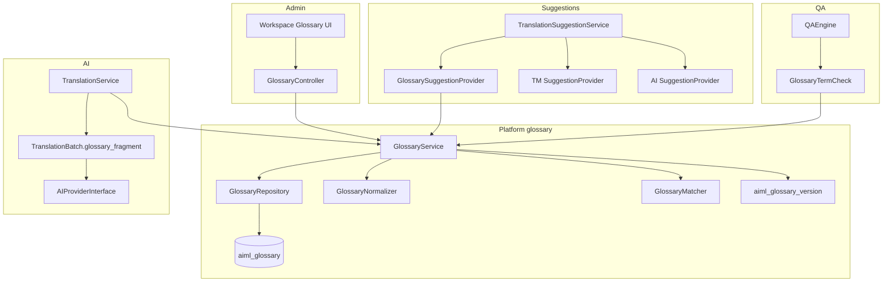

# Glossary MVP — Implementation Plan

**Status:** Architecture ready for final review (ADR-0014 **Proposed**)  
**Branch:** `feature/glossary-mvp-plan`  
**Baseline:** `main` after post-v1 roadmap merge  
**ADR:** [0014-glossary-platform-lexicon.md](../adr/0014-glossary-platform-lexicon.md)  
**Product parent:** [POST_V1_PRODUCT_ROADMAP.md](POST_V1_PRODUCT_ROADMAP.md)  
**F11 contracts:** [F11_FROZEN_API.md](F11_FROZEN_API.md), [STRATEGY_F_F11_TRANSLATION_MEMORY_AND_AI_ASSISTANCE.md](STRATEGY_F_F11_TRANSLATION_MEMORY_AND_AI_ASSISTANCE.md)

**Code changes in this planning commit:** None.

---

## 1. Purpose

Deliver a **platform-owned curated glossary** so Biopentra translators and merchants get consistent terminology across Swedish (`sv`) and future language pairs, without reopening UUID identity, Store, TM lifecycle, rollout, or AI provider architecture.

Glossary is **not** an AI-provider feature. Providers consume glossary data only through existing abstraction layers (`TranslationBatch::$glossary_fragment`, suggestion orchestration).

---

## 2. Success definition

Glossary MVP succeeds when:

1. Operators can CRUD active terminology for language pairs under `aiml_manage_glossary`.
2. Exact-segment glossary hits appear as ranked segment suggestions.
3. Embedded glossary hits never appear as incomplete segment suggestions.
4. AI translate/suggest receives a deterministic, bounded, provider-neutral glossary fragment for matched terms.
5. QA emits warning-only `glossary_term_missing` issues.
6. F11 frozen APIs remain compatible except for the **explicit** ranking-tier amendment in ADR-0014.
7. No second suggestion, AI, or translation-storage pipeline exists.
8. ADR-0014 has an explicit disposition before schema code lands.

---

## 3. Architecture overview

---

## 4. Layered architecture

| Layer | Components | Responsibility |
|---|---|---|
| Presentation | Workspace glossary admin page | CRUD UX |
| REST | `GlossaryController` | Auth, validation, ViewModels |
| Application | `GlossaryService` | Mutations, versioning, fragment, match API |
| Matching | `GlossaryNormalizer`, `GlossaryMatcher` | Canonical normalize + whole-word match |
| Persistence | `GlossaryRepository`, `aiml_glossary` | DDL-backed storage |
| Suggestions | `GlossarySuggestionProvider` | Exact-segment `NormalizedSuggestion` only |
| AI | `TranslationService` + providers | Consume fragment; no glossary I/O |
| QA | `GlossaryTermCheck` | Warning issues |
| Audit / metrics | bounded events + low-cardinality counters | Ops visibility |

**Not introduced:** `GlossaryProviderInterface` (single source; see §7).

---

## 5. Domain model

### 5.1 Ownership domains (binding)

| Asset | Ownership | May not |
|---|---|---|
| Glossary | Curated linguistic asset | Be written by TM, AI providers, or Store |
| TM | Observed reuse asset | Auto-create glossary terms |
| Store | Segment persistence | Hold glossary lexicon rows |

**Prohibitions (frozen):**

- TM never creates glossary terms automatically.
- Glossary mutations never rewrite TM entries.
- Glossary mutations never change Store translations.
- AI providers never own glossary persistence.
- Workspace/REST never bypass `GlossaryService`.
- Any future TM↔glossary synchronization is an explicit operator action under a later plan.

### 5.2 Term entity

| Field | Meaning |
|---|---|
| `source_term` | Operator-facing source spelling (preserved) |
| `source_term_normalized` | Canonical form for uniqueness + matching |
| `target_term` | Approved translation (not destructively normalized) |
| `source_lang_id` / `target_lang_id` | Language pair |
| `context` | Optional domain/context string |
| `description` | Optional operator note |
| `is_active` | Participation in match/suggest/fragment/QA |
| timestamps | `created_at`, `updated_at` |

### 5.3 Internal DTO: `GlossaryTermMatch`

Not a `NormalizedSuggestion`. Fields (conceptual):

- `glossary_id`
- `source_term` / `target_term`
- `source_term_normalized`
- `match_kind`: `exact_segment` | `embedded`
- `byte_offset` / `char_offset` (occurrence start)
- `length`
- optional `context`

Used by fragment builder, QA, and optional additive Workspace metadata. Never passed to ranking as a segment candidate unless `match_kind=exact_segment` is promoted through `GlossarySuggestionProvider`.

### 5.4 Complete schema (`aiml_glossary`)

Migrator **target version 4**. DDL style matches existing plugin (explicit `CREATE TABLE`, InnoDB, `$wpdb->get_charset_collate()`, **no SQL FOREIGN KEY** — language IDs validated in PHP like TM).

| Column | Type | Notes |
|---|---|---|
| `glossary_id` | `BIGINT UNSIGNED NOT NULL AUTO_INCREMENT` | PK |
| `source_lang_id` | `SMALLINT UNSIGNED NOT NULL` | PHP-validated against `aiml_languages` |
| `target_lang_id` | `SMALLINT UNSIGNED NOT NULL` | Same |
| `source_term` | `VARCHAR(255) NOT NULL` | Original spelling |
| `source_term_normalized` | `VARCHAR(191) NOT NULL` | Canonical; **191** for utf8mb4 unique-index safety |
| `target_term` | `VARCHAR(512) NOT NULL` | Approved target; not uniqueness key |
| `context` | `VARCHAR(64) NOT NULL DEFAULT ''` | Optional domain; empty string = none |
| `description` | `VARCHAR(512) NOT NULL DEFAULT ''` | Operator note |
| `is_active` | `TINYINT(1) NOT NULL DEFAULT 1` | |
| `created_at` | `DATETIME NOT NULL` | UTC |
| `updated_at` | `DATETIME NOT NULL` | UTC |

**Indexes:**

- `PRIMARY KEY (glossary_id)`
- `UNIQUE KEY glossary_identity (source_lang_id, target_lang_id, source_term_normalized)`
- `KEY glossary_pair_active (source_lang_id, target_lang_id, is_active)`
- `KEY glossary_updated (updated_at)`

**Collation:** table uses site `charset_collate`. Semantic equality uses **PHP normalization**, not collation folding alone.

**Duplicate handling:** insert/update that collides on unique key → rejected with typed error (`glossary_duplicate_term`); no silent overwrite.

**Uninstall:** drop `aiml_glossary`; delete option `aiml_glossary_version`; do not touch TM/Store content.

**Option:** `aiml_glossary_version` — `INT UNSIGNED`, default `0`.

---

## 6. Term normalization contract

Canonical service: **`GlossaryNormalizer`** (single implementation used by repository writes, uniqueness, exact match, whole-word match, future imports, tests).

### MVP algorithm (`normalize_source`)

1. Reject non-string / empty after trim → invalid term.
2. Unicode NFC normalize if available (`Normalizer::normalize`); if extension missing, document fallback and test on CI image that has it **or** skip NFC with explicit note — **lock: require `intl` Normalizer NFC** in Glossary MVP environment; fail closed in service if unavailable during write.
3. Trim leading/trailing whitespace (Unicode-aware).
4. Replace any Unicode whitespace run with a single ASCII space `0x20`.
5. Case-fold with `mb_strtolower( $s, 'UTF-8' )` — **never** `strtolower()`.
6. **Preserve accents and diacritics** (å/ä/ö remain distinct from a/o).
7. Do **not** strip punctuation from the stored normalized form of the full term string; punctuation inside the term is significant for literal match.
8. Length after normalize must be ≥ 1 and ≤ 191 characters; else reject.

**Target text:** store as submitted after trim of ends only; no case-fold; max 512 chars.

**Determinism:** same UTF-8 input → same normalized output in PHP 8.3 + intl across environments.

---

## 7. Whole-word matching contract

Service: **`GlossaryMatcher`** operating on **plain text extracted for matching**. For HTML `text_format`, matching runs on text with tags stripped for boundary purposes (MVP: `wp_strip_all_tags` then normalize whitespace for scan text; offsets reported against scan text; document limitation).

### Rules (MVP — literal, deterministic)

| Topic | Rule |
|---|---|
| Stemming / morphology / fuzzy | **None** |
| Plurals / inflections | No special handling — literal only |
| Case | Compare using normalized forms |
| Accents | Preserved (see normalizer) |
| Boundaries | Unicode letter/number runs: a match must not be adjacent to another `\p{L}` or `\p{N}` character (PCRE `u`) |
| Hyphens | Inside a glossary term, hyphen is literal. `anti-aging` does not match `anti aging`. A hyphenated word in source is one token for boundary purposes |
| Apostrophes | Literal inside term (`Parkinson's`); curly vs straight apostrophe are **not** folded in MVP (document; adversarial test) |
| Punctuation outside term | Allowed at edges (comma, period) — boundary still holds |
| Overlaps | **Longest** `source_term_normalized` wins; tie → lexical ascending normalized term; then lower `glossary_id` |
| Duplicates | Same `glossary_id` once per scan for fragment/QA set; occurrences may list multiple offsets if exposed |
| Order | Document occurrence order by first ascending offset |
| Inactive terms | Ignored |
| Wrong language pair | Ignored |

**Adversarial tests (required):** overlapping terms; term inside larger word (must not match); hyphen variants; apostrophe variants; HTML tags splitting visually; empty; emoji adjacent; Swedish å/ä/ö; multiple occurrences; exact-segment equality path.

---

## 8. REST surface

Namespace `aiml/v1`. Additive only.

| Method | Route | Cap | Purpose |
|---|---|---|---|
| GET | `/glossary` | `aiml_manage_glossary` | List/search/filter (`lang`, `active`, `q`, paging) |
| GET | `/glossary/{id}` | `aiml_manage_glossary` | Read one |
| POST | `/glossary` | `aiml_manage_glossary` | Create |
| PUT/PATCH | `/glossary/{id}` | `aiml_manage_glossary` | Update |
| POST | `/glossary/{id}/activate` | `aiml_manage_glossary` | Activate |
| POST | `/glossary/{id}/deactivate` | `aiml_manage_glossary` | Deactivate |
| DELETE | `/glossary/{id}` | `aiml_manage_glossary` | Delete |

- Permission callbacks + REST nonces as per existing plugin REST patterns.
- ViewModels only — no raw `$wpdb` rows.
- Translators with only `aiml_translate` do **not** receive list endpoints; suggestion/QA/AI load terms **internally** via `GlossaryService`.

Header: reuse workspace versioning approach or document `X-AIML-Glossary-Api-Version: 1` if introduced — **lock: set `X-AIML-Glossary-Api-Version: 1` on glossary routes**.

---

## 9. Workspace integration

- Admin glossary management page under existing Translator Workspace / settings IA (exact menu placement in G6 UI design).
- Features: CRUD, search, language-pair filter, active/inactive toggle, validation errors for duplicates.
- Segment Workspace may show additive `meta.glossary_matches[]` (serialized from `GlossaryTermMatch`) — optional AC; if shipped, additive only and must not reuse `meta.suggestions` for embedded targets.

---

## 10. Suggestion integration

### Exact-segment glossary suggestion

`GlossarySuggestionProvider`:

- `get_id(): glossary`
- `is_available` when glossary service has active terms for pair (or always true with empty results)
- Emits `NormalizedSuggestion` **only if** `normalize_source(segment.source_text) === term.source_term_normalized` for an active term on the pair
- `target_text` = `target_term`
- `confidence` = `95.0`
- `rank_tier` = `5` (`TIER_GLOSSARY_EXACT`)
- `metadata`: `{ "glossary_id": N, "match_kind": "exact_segment" }`

### Embedded matches

- Matcher returns `GlossaryTermMatch` with `match_kind=embedded`
- **Must not** call `NormalizedSuggestion` with the isolated target term
- Feed fragment + QA (+ optional meta)

### Ranking (F11 amendment)

**Before Glossary (F11 frozen):**

1 Exact TM · 2 Reviewed human TM · 3 Human TM · 4 Imported TM · 5 Fuzzy TM · 6 AI

**After Glossary (ADR-0014):**

1–4 unchanged · **5 Exact-segment Glossary** · **6 Fuzzy TM** · **7 AI**

Sort keys unchanged. Compatibility: any client assuming AI=`6` or fuzzy=`5` must be updated — treated as intentional public amendment with tests.

Wire in `Plugin.php`: register glossary provider alongside TM and AI. TM provider constants for fuzzy updated to 6; AI to 7.

---

## 11. AI integration

1. `GlossaryService::build_fragment( source_text, source_lang, target_lang ): string`
2. Select **active** terms for pair that **match** the segment (exact or embedded).
3. Deduplicate by `glossary_id`.
4. Order: longest normalized term DESC → first occurrence offset ASC → normalized term ASC → glossary_id ASC.
5. Format (deterministic): one line per term  
   `source_term => target_term`  
   using **original** (non-normalized) `source_term` / `target_term` strings; escape so lines cannot break structure (replace newlines in terms with space).
6. **Bounds:** max **40** terms **and** max **4000** characters. If exceeded: keep order, truncate with trailing marker line `# glossary_truncated`, increment diagnostic counter.
7. Assign into `TranslationBatch::$glossary_fragment` in `TranslationService` translate/suggest paths (replace `''`).
8. Providers append fragment to prompts when non-empty. **OpenAI provider may only read the string** — no glossary queries inside provider classes.

Do **not** inject the entire glossary into every request.

---

## 12. QA integration

`GlossaryTermCheck` implements `QACheck`:

| Item | Value |
|---|---|
| `get_id()` | `glossary_term` |
| Default severity | `warning` |
| Issue code | `glossary_term_missing` |
| Save behavior | **Never blocks** in MVP |

**Algorithm:** find embedded+exact matches in source; for each, check whether normalized target contains the approved `target_term` as a whole-word match (same matcher rules on target side). If missing → issue with payload `{ glossary_id, source_term, expected_target_term }` — no DB row dumps.

Inactive terms ignored. Multiple approved terms → one issue per missing expectation. Context/domain mismatch: MVP ignores context for QA (context reserved). HTML: strip tags for comparison scan.

---

## 13. Permissions

| Action | Capability |
|---|---|
| Glossary CRUD / list REST | `aiml_manage_glossary` |
| Internal reads (suggest/AI/QA) | Via services; no public unrestricted list |
| Segment translate (unchanged) | `aiml_translate` |

- Grant `aiml_manage_glossary` to Administrator on activation/upgrade (G6).
- Translators do **not** automatically receive it.
- Prefer this over `manage_options` as the permanent public contract.
- CLI (if added later): same capability check; not required in MVP UI path.

---

## 14. Audit

Bounded audit events (structured log / existing diagnostics channel — pick one consistent with plugin audit approach in G6):

- `glossary_term_created`
- `glossary_term_updated`
- `glossary_term_activated`
- `glossary_term_deactivated`
- `glossary_term_deleted`
- `glossary_bulk_changed`

**Safe fields:** `glossary_id`, language ids/codes, active-state transition, `glossary_version` after bump, `user_id`, timestamp, `source_surface` (`rest`|`cli`|…).

**Do not** log full source/target term strings in general operational logs.

---

## 15. Diagnostics

Low-cardinality metrics / status fields:

- Active term count by language pair
- Current `aiml_glossary_version`
- Duplicate/rejected write count
- Fragment truncation count
- QA `glossary_term_missing` warning count
- Exact-segment suggestion hit count

Avoid per-term high-cardinality series.

---

## 16. Glossary version semantics

| Rule | Behavior |
|---|---|
| Type | Monotonic `INT UNSIGNED` |
| Increment | After every **successful** mutation: create, update (material change), activate, deactivate, delete, successful bulk |
| No increment | Failed validation, duplicate reject, no-op update (bit-identical) |
| Ordering | Mutate row(s) in DB → on success bump version (same request); bulk = one bump after all successful ops in the batch |
| Cache | Any glossary read caches must key or bust on version |
| TM field | On TM write-back, stamp current glossary version into `aiml_tm.glossary_version` |
| Auto-stale | **None** in MVP — version skew does not delete/invalidate TM or change render |

Aligns with ADR-0009: glossary change does not invalidate memory wholesale.

---

## 17. Acceptance criteria

1. Glossary / TM / Store remain separate ownership domains; prohibitions in §5.1 hold.
2. Schema includes all columns in §5.4 including `source_term_normalized`.
3. Uniqueness enforced on `(source_lang_id, target_lang_id, source_term_normalized)`.
4. Normalization uses Unicode-safe folding; accents preserved; no `strtolower()`.
5. Exact-segment match emits `NormalizedSuggestion` with full approved target only.
6. Embedded match **never** emits isolated target as `NormalizedSuggestion.target_text`.
7. Embedded matches feed fragment + QA (+ optional meta DTO).
8. Ranking uses ADR-0014 tiers; deterministic order tests pass (incl. glossary vs fuzzy vs AI).
9. AI fragment deterministic, bounded, matched-terms-only; truncation marker + counter.
10. Providers consume `glossary_fragment` only; no provider glossary I/O.
11. QA code `glossary_term_missing` is warning-only; saves succeed.
12. CRUD requires `aiml_manage_glossary`.
13. Audit events omit full term text in general logs.
14. Version increments per §16; no-op/fail does not bump.
15. TM `glossary_version` stamp does not auto-invalidate TM/render.
16. F11 APIs compatible except documented tier renumber.
17. No render-path / UUID / rollout changes.
18. Uninstall drops glossary table + version option.
19. No second suggestion pipeline; TSS remains sole orchestrator.
20. ADR-0014 disposition recorded before G1 merges to an implementation branch.

---

## 18. Work packages

### G0 — Plan + ADR-0014 proposal and approval gate

| | |
|---|---|
| **Objective** | Freeze architecture docs; obtain ADR disposition before schema |
| **Scope** | This plan; ADR-0014 Proposed; roadmap pointers |
| **Deps** | Post-v1 roadmap on `main` |
| **Files** | `docs/plans/GLOSSARY_MVP_IMPLEMENTATION_PLAN.md`, `docs/adr/0014-…`, ROADMAP/POST_V1 pointers |
| **Tests** | Link validation |
| **Rollback** | Revert docs commit |
| **Stop** | Proceeding to G1 without Accepted or dated proceed-despite-Proposed |
| **Commit** | `docs(glossary): create Glossary MVP implementation plan` |

### G1 — Schema v4, uninstall, migration, version option

| | |
|---|---|
| **Objective** | Persist lexicon |
| **Scope** | `Schema::create_glossary()`, Migrator TARGET=4, uninstall, option bootstrap |
| **Deps** | **ADR-0014 Accepted or proceed-despite-Proposed** |
| **Files** | `src/Database/Schema.php`, `Migrator.php`, `uninstall.php`, activation hooks |
| **Tests** | Migration up; unique constraint; uninstall |
| **Rollback** | Migrator down / drop table (dev only) |
| **Stop** | Silent G1 without ADR gate; SQL FKs; dbDelta misuse |
| **Commit** | `feat(glossary): add aiml_glossary schema v4` |

### G2 — Repository + GlossaryService + normalization/matching

| | |
|---|---|
| **Objective** | Domain core |
| **Scope** | Repo CRUD; Normalizer; Matcher; version bump rules; match API returning `GlossaryTermMatch` |
| **Deps** | G1 |
| **Files** | `src/Glossary/*` |
| **Tests** | Normalization; uniqueness; adversarial matcher; version bump/no-op |
| **Rollback** | Feature flag unused until wired |
| **Stop** | ASCII `strtolower`; collation-only equality; writing TM/Store |
| **Commit** | `feat(glossary): add service, normalizer, and matcher` |

### G3 — Exact-segment GlossarySuggestionProvider + terminology-match DTO

| | |
|---|---|
| **Objective** | Safe suggestions |
| **Scope** | Provider; TSS wire; tier constants 5/6/7; DTO; forbid embedded→NormalizedSuggestion |
| **Deps** | G2 |
| **Files** | `Suggestion/GlossarySuggestionProvider.php`, TM/AI tier constants, `Plugin.php`, tests |
| **Tests** | Exact emits; embedded does not; ranking order |
| **Rollback** | Unregister provider |
| **Stop** | Partial targets as suggestions; silent tier change without tests |
| **Commit** | `feat(glossary): add exact-segment suggestion provider` |

### G4 — Deterministic bounded AI glossary fragment

| | |
|---|---|
| **Objective** | Provider-neutral AI enrichment |
| **Scope** | `build_fragment`; TranslationService fill; OpenAI prompt consume string only |
| **Deps** | G2 |
| **Files** | `GlossaryService`, `TranslationService`, `OpenAIProvider` prompt builder |
| **Tests** | Order; bounds; truncation; empty |
| **Rollback** | Pass `''` fragment |
| **Stop** | Full-glossary inject; lookup inside OpenAI provider |
| **Commit** | `feat(glossary): wire bounded glossary_fragment into AI batch` |

### G5 — GlossaryTermCheck QA warning

| | |
|---|---|
| **Objective** | Terminology QA |
| **Scope** | Check class; register; issue payload |
| **Deps** | G2 |
| **Files** | `src/Workspace/QA/GlossaryTermCheck.php` |
| **Tests** | Missing/present; inactive; HTML strip |
| **Rollback** | Unregister check |
| **Stop** | Save-blocking severity |
| **Commit** | `feat(glossary): add glossary_term_missing QA warning` |

### G6 — REST + admin UI + capability + audit

| | |
|---|---|
| **Objective** | Operator management surface |
| **Scope** | Controller routes; `aiml_manage_glossary`; admin UI; audit events |
| **Deps** | G2 |
| **Files** | `src/Rest/GlossaryController.php`, assets, `Plugin.php` caps |
| **Tests** | Permission matrix; CRUD; audit field privacy |
| **Rollback** | Disable routes/UI |
| **Stop** | Using `manage_options` as permanent contract; logging full terms |
| **Commit** | `feat(glossary): add glossary REST, capability, and admin UI` |

### G7 — Full compatibility validation + closure

| | |
|---|---|
| **Objective** | Ship-ready validation |
| **Scope** | Full Tier 0; F11 compat; docs status Accepted if not already; closure note |
| **Deps** | G1–G6 |
| **Files** | Docs/validation log |
| **Tests** | Unit/integration/PHPCS; targeted UI smoke |
| **Rollback** | Hold merge |
| **Stop** | Render/UUID regressions; second pipeline detected |
| **Commit** | `test(glossary): complete Glossary MVP validation` |

---

## 19. Testing strategy

- **Unit:** Normalizer, Matcher (adversarial), version bump, fragment builder, provider exact vs embedded, QA check, ranking sort with new tiers.
- **Integration:** Migrator v4, REST permissions, suggest endpoint exact-segment, translate path fragment non-empty, uninstall.
- **PHPCS** on all new PHP.
- **No** F9 35-suite; targeted UI smoke for glossary admin only.
- **Compat:** F11 frozen DTO field names unchanged; workspace routes additive.

---

## 20. Risks

| Risk | Mitigation |
|---|---|
| Partial suggestion misuse | Exact-segment rule + tests |
| Unicode / Swedish edge cases | NFC + mb + adversarial suite |
| Unique index length | `VARCHAR(191)` normalized |
| Tier renumber breaks clients | ADR-0014 + explicit tests + release note |
| Fragment token blowups | Hard caps + truncation |
| ADR stays Proposed while coding | G0/G1 gate |

---

## 21. Out of scope

- Review workflow
- Background jobs / ADR-0011 implementation
- Translation version history
- Nested block identity
- Elementor
- WooCommerce expansion
- Additional AI providers
- Render-cache activation
- Stemming / morphology / fuzzy glossary match
- Forced/never_translate rule engine beyond MVP warn
- Auto TM invalidation on glossary bump
- `GlossaryProviderInterface`
- Multi-site

---

## 22. Definition of Ready (implementation branch)

1. This plan reviewed.
2. ADR-0014 **Accepted** **or** dated proceed-despite-Proposed with decision-maker + residual risk.
3. Implementation branch created from updated `main`.
4. No production code on the planning branch beyond docs.

---

## 23. Definition of Done

All ACs §17 green; G1–G7 complete; validation log PASS; uninstall clean; F11 amendment documented; no architecture boundary violations.

---

## 24. Closure gates

| Gate | Requirement |
|---|---|
| Docs | Plan + ADR present |
| ADR disposition | Accepted or proceed-despite-Proposed before G1 |
| Schema | v4 migrated; uninstall OK |
| Semantics | Exact vs embedded proven by tests |
| Ranking | Deterministic suite PASS |
| Provider neutrality | No glossary I/O in providers |
| Permissions | `aiml_manage_glossary` enforced |
| Merge | Separate implementation PR; planning branch is not the ship vehicle |

---

## 25. Architecture review answers

| Question | Answer |
|---|---|
| New persistent storage? | **Yes** — `aiml_glossary` + version option |
| New ADR? | **Yes** — ADR-0014 (gate before G1) |
| Reuse Store? | **No** |
| TM vs Glossary? | Observed reuse vs curated lexicon |
| TSS merge? | Ranked `NormalizedSuggestion` list; glossary only for exact-segment |
| Conflicts? | Higher tier wins; glossary below human/imported TM, above fuzzy/AI |
| Deterministic order? | Existing sort keys + explicit tiers + tests |
| Versions? | Monotonic option; TM stamp only |
| Backward compatibility? | Additive REST; explicit tier renumber amendment |

---

## 26. Exact next step

1. Final review of this plan and ADR-0014.  
2. Record ADR-0014 **Accepted** (or proceed-despite-Proposed).  
3. Create `feature/glossary-mvp` (implementation) from updated `main`.  
4. Execute G1 only after the ADR gate passes.
