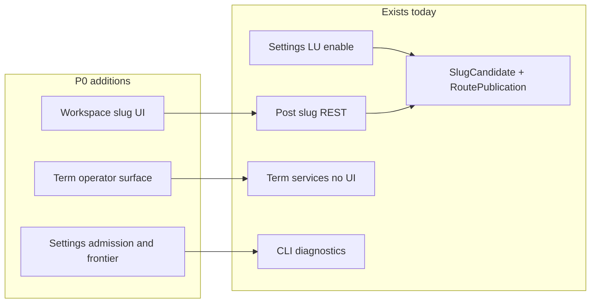

# Localized URL Operator Completion — Definitive Implementation Plan

**Status:** **FROZEN** (A1–A10) — authoritative P0 specification
**Frozen:** 2026-08-15
**Freeze baseline:** `d2baec66c44bac1d0d9cd30b1ab5aba20e66311d`  
**Milestone:** P0 post-v1.5.1 (redefined Program B) — **one coherent implementation milestone**  
**Baseline:** AI Multilingual **1.5.1** · TARGET **8** · migration **NONE** · tag `6298df08b` · V151AC22 PASS  
**Prioritization authority:** post-v1.5.1 roadmap prioritization (Program B REDEFINE → bounded P0)  
**Version during P0:** remains **1.5.1** (no bump) · **After P0 COMPLETE:** execution auth ends; **no release authorized**; expected next is **P1 G4 characterization** (separate auth)

---

## 1. Problem / goal

**Problem:** Supported Localized URL runtime is correct, but a normal WordPress administrator cannot complete the already-shipped slug/route lifecycle without specialized REST/CLI knowledge.

**Goal:** A normal WordPress administrator can operate every **already-supported** Localized URL lifecycle without REST/CLI expertise.

**Hard rule:** **No new URL capability.** P0 exposes and completes operation of capabilities already shipped; it does not broaden routing capability or redesign the MSEO route lifecycle.

---

## 2. Frozen outcomes (acceptance contracts)

| ID | Outcome |
|---|---|
| **OC1** | Admin can prepare / edit / clear localized slug candidates for supported **posts / pages / products** |
| **OC2** | Admin can publish and inspect **effective localized routes** for those objects |
| **OC3** | Admin receives **understandable collision feedback** and can recover (edit candidate / clear / retry) |
| **OC4** | A normal WordPress administrator can perform the existing localized slug **candidate → publication → inspection → clear/recovery** lifecycle for **every currently admitted term/archive shape that exposes that lifecycle**, without requiring raw REST or CLI expertise |
| **OC5** | Admin can see whether Localized URLs are **ON / OFF** (and activating/failed as today) |
| **OC6** | Admin can understand **capability admission** (which shapes are admitted vs implemented/not admitted) |
| **OC7** | Admin can understand whether **reindex/frontier** work is pending, complete, degraded, or blocked |
| **OC8** | Admin can distinguish **not yet processed** vs **unsupported** vs **genuine failure** |

**Non-AC (explicit):**

- CLI parity for enable / slug / publish / term  
- Bulk CLI  
- Sitemap / Rank Math / Model A changes (**P1 / G4 — out of P0**)  
- Jobs/stale UX (**P2 — out of P0**); Strategy F redesign  
- New routing shapes; TARGET/migration; route lifecycle redesign  

---

## 3. Inventory — consume, do not reinvent

### Already merchant-complete

- LU enable / disable / retry — [SettingsPage.php](docs/../src/Admin/SettingsPage.php) + [LocalizedUrlsActivationService.php](docs/../src/Routing/LocalizedUrlsActivationService.php)

### Already server-complete (posts/pages/products)

| Layer | Surface |
|---|---|
| REST | [WorkspaceController.php](docs/../src/Rest/WorkspaceController.php): `GET/POST/DELETE .../slug`, `POST .../slug/generate`, `POST .../slug/publish-route` |
| Facade | [WorkspaceService.php](docs/../src/Workspace/WorkspaceService.php) slug methods |
| Lifecycle | [SlugCandidateService.php](docs/../src/Routing/SlugCandidateService.php), [RoutePublicationService.php](docs/../src/Routing/RoutePublicationService.php) (`publish_route`, `sync_view`) |
| Collision | [CanonicalPathCollisionChecker](docs/../src/Routing/) + REST **409** codes (`aiml_slug_route_collision`, history collision, exhausted) |
| Eligibility | [ObjectLanguagePublicEligibility](docs/../src/Routing/) |

### Already server-complete (terms) — **no operator surface**

- [SlugCandidateService](docs/../src/Routing/SlugCandidateService.php): `generate_for_term` / `save_manual_for_term` / `clear_for_term`  
- [RoutePublicationService::publish_term_route](docs/../src/Routing/RoutePublicationService.php)  
- Proven in [Mseo3HierarchyTermsTest.php](docs/../tests/integration/Mseo3HierarchyTermsTest.php)  
- **No** term REST; **no** term admin UI — thin application/REST seam **allowed** under §4.1

### Diagnostics that exist but are not merchant-facing

- CLI only: `aiml localized-urls status|capabilities|reindex-status` ([Cli.php](docs/../src/Cli.php))  
- Admission: [RoutingCapabilityAdmission](docs/../src/Routing/) + settings `localized_urls_admitted_capabilities`  
- Frontier: [ReindexFrontierRepository::list_recent](docs/../src/Routing/)

### Missing merchant UI

- Translator Workspace (`assets/translator-workspace`): **zero** slug UI / API client methods  
- Settings: state only — **no** admitted-capabilities panel, **no** frontier/reindex honesty  



---

## 4. Design principle (v1.5.1 lesson)

**Freeze contracts/outcomes; do not freeze mechanisms beyond “smallest addition that reuses proven services.”**

Especially for **OC4 (terms):**

1. Reuse `SlugCandidateService` + `publish_term_route` unchanged  
2. Add the thinnest application layer needed for the chosen UI host  
3. Prefer any thinner architecture-consistent seam; add REST **only if** that UI host needs it — **do not preselect REST**

Do **not** redesign route tables, collision rules, EffectiveUrl, or admission jobs.

### 4.1 Thin application / REST seam rule (A2)

Implementation **MAY** add the smallest application-layer or REST seam necessary to expose an already-existing supported capability to administrator UI.

Example: term operation may need a thin controller/application seam because term services exist but no merchant-facing endpoint exists.

**This does NOT itself trigger a STOP.**

A seam is permitted when **all** remain true:

- exposes an already-supported capability  
- delegates to existing domain/lifecycle services  
- does **not** create a second route publication authority  
- does **not** change candidate, collision, history, EffectiveUrl, or capability-admission semantics  
- does **not** require schema/TARGET changes  
- does **not** introduce a new routing shape  

**STOP** only if the required change expands or redesigns one of those contracts.

---

## 5. Work packages (internal sequencing only — A1)

**WP0–WP5 are implementation sequencing packages. They are NOT separate user authorization boundaries.**

After plan freeze and **one** full-P0 authorization, execution covers the complete milestone through merge and closure (see §9). Do **not** stop after WP1–WP5 to re-request authorization. Do **not** split P0 into separately released mini-milestones. Internal commits are encouraged; they remain part of the same P0 milestone.

### WP0 — Plan freeze + boundaries (part of authorized P0 when freeze is included)

- Materialize this plan under `docs/plans/`  
- Update [PRODUCT_PRIORITIES.md](docs/PRODUCT_PRIORITIES.md) / [ROADMAP.md](docs/ROADMAP.md) to point at P0 (docs-only)  
- Guardrails: TARGET 8; migration NONE; no new capability shapes; G4 STOP documented  

### WP1 — Workspace post/page/product slug operator UI (OC1–OC3)

**Consume:** existing Workspace slug REST + `sync_view` flags.

**Add:** Translator Workspace UI (and API client) for generate / edit / clear / publish / inspect + plain-language collision recovery. Reflect existing LU ON/OFF semantics; do not invent new ones.

**Out of WP1:** term UI; Settings admission; CLI; P1/P2.

### WP2 — Admitted term/archive operator completion (OC4)

**Contract:** OC4 as frozen in §2 — every currently admitted term/archive shape that exposes the lifecycle is admin-operable.

**Mechanism:** chosen during implementation under §4 / §4.1 — not preselected.

**Out of WP2:** admitting new taxonomies; changing `AdmittedTaxonomies`; new URL shapes.

### WP3 — Settings honesty: admission + frontier (OC5–OC8)

**Extend** Localized URLs Settings panel: state (existing), admitted vs implemented labels, epoch/fingerprint warnings from existing fields, frontier summary (pending/complete/degraded/blocked), copy for not-yet-processed · unsupported · failure.

**Out of WP3:** CapabilityVerificationJob redesign; forcing reindex; sitemap.

### WP4 — Tests + evidence map + operator docs

- Post slug UI / integration coverage (reuse [Mseo1SlugLifecycleTest](docs/../tests/integration/Mseo1SlugLifecycleTest.php) contracts)  
- Term coverage per **AC2** (families + material differences — §7)  
- Evidence map: admitted shape → operator surface → implementation family → acceptance evidence  
- Settings status tests; operator runbook; PluginGuard (no TARGET bump; no new routing capability constants)

### WP5 — Independent review + remediation (A4)

- Review against OC1–OC8, AC1–AC8, exclusions  
- If bounded in-scope defects: **fix → revalidate → re-review as needed → continue** toward PR/merge  
- Do **not** stop for ordinary review remediation authorization  
- STOP only if a finding hits §6  
- Closure must record: defects found, fixes, final reviewed feature HEAD, post-remediation validation, final independent verdict  

---

## 6. STOP conditions

Stop and escalate (do not absorb into P0) if work would require:

1. New routing capability / URL authority / EffectiveUrl redesign  
2. TARGET / migration / schema change  
3. Model A sitemap primary `/sv` `<loc>` redesign or Rank Math fork  
4. **G4 / SEO correctness (A8):** credible evidence that an existing **Supported Model A SEO contract is actually violated** → characterize enough to establish a real Supported-contract defect → record evidence → **do not silently fix or absorb into P0** → **STOP for corrective reprioritization**. A newly proven public SEO correctness defect outranks operator convenience. Do **not** stop merely because an unproven evidence gap remains.  
5. Route lifecycle redesign (candidate/publish/history/collision semantics change)  
6. Absorbing **P1** (G4 characterization) or **P2** (Jobs/stale literacy) into P0  
7. Jobs/stale or Strategy F program scope  
8. Making CLI parity an acceptance gate  

A STOP is justified only by a frozen STOP condition or a genuine inability to continue safely/correctly — **not** by finishing an individual WP.

---

## 7. Acceptance criteria (milestone-level)

| AC | Requirement |
|---|---|
| AC1 | OC1–OC3 demonstrable in admin UI (or automated + UI smoke) without raw REST/CLI |
| **AC2** | **Every currently admitted term/archive shape exposing the localized-slug lifecycle is administrator-operable.** Automated/integration acceptance must exercise **at least one representative from each implementation-equivalent family**, **plus explicit coverage for every admitted shape whose behavior, path construction, eligibility, publication, hierarchy, or collision behavior is materially different.** Evidence doc must map: admitted shape → operator surface → implementation family → acceptance evidence. Testing need **not** mechanically duplicate identical tests for every taxonomy when shapes share the exact same implementation path. |
| AC3 | OC5–OC8 visible in Settings without CLI |
| AC4 | Collision path shows recoverable merchant messaging (not raw engineer-only codes alone) |
| AC5 | No new URL capability / TARGET remains **8** / migration **NONE** / no route lifecycle redesign |
| AC6 | CLI unchanged or only incidental; **not** required for AC |
| AC7 | G4 / sitemap / Rank Math development untouched; Supported SEO break discovery triggers §6.4 STOP |
| AC8 | Independent review **PASS** (after any in-scope remediation) before calling feature ready to merge |

---

## 8. Likely size / risk / release character

| | |
|---|---|
| Size | **MEDIUM** (UI-heavy; services mostly exist) |
| Arch risk | **LOW–MEDIUM** (application/UI layer + permitted thin seams on frozen lifecycle) |
| Regression risk | **MEDIUM** on Workspace UX; **LOW** on routing if services reused |
| Informational release character | **MINOR** when a **future** release-prep is authorized — **not** part of P0 |

---

## 9. Execution model (A1 / A9)

### Planning phase (current)

```text
review definitive plan
  → approve (this amendment)
  → freeze/materialize authoritative repository plan
```

### Execution phase — **one** separate authorization covers the complete P0

```text
freeze/materialization (if not already done under same auth)
  → implementation WP1–WP5 (internal sequencing; internal commits OK)
  → complete automated validation
  → independent implementation review
  → remediation of in-scope review findings
  → revalidation (+ re-review as needed)
  → feature PR
  → green feature CI
  → merge
  → fresh main CI
  → documentation/evidence/closure
  → P0 COMPLETE on main
  → P0 execution authorization ends
  → NO RELEASE AUTHORIZED
  → NEXT (separate auth): P1 G4 CHARACTERIZATION
```

**Do not** sequence as: authorize WP1 → authorize WP2 → …

**Do not** treat P0 COMPLETE as a release boundary (see §11).

---

## 10. Definition of P0 COMPLETE (A5)

Do **not** call P0 complete merely because implementation code exists.

Require **all** of:

- OC1–OC8 PASS  
- AC1–AC8 PASS  
- All in-scope admitted operator lifecycle coverage PASS (per AC2 evidence map)  
- PHPCS PASS  
- Unit PASS  
- Integration PASS  
- Relevant UI/admin tests PASS  
- PluginGuard PASS  
- Repository quality/baseline gates PASS  
- Independent review PASS  
- Review defects remediated (with evidence)  
- Feature PR CI green  
- Reviewed feature merged  
- Fresh main CI green  
- Closure/evidence documentation committed  
- `main` == `origin/main`  
- Working tree clean  

Only then:

**LOCALIZED URL OPERATOR COMPLETION P0: COMPLETE**

---

## 11. Milestone closure ≠ release closure (A6 + A10)

### 11.1 P0 authorization ends at milestone closure

The large execution authorization **ends** after P0 is merged, validated, and closed on main.

Interpret completion as:

```text
P0 COMPLETE.
P0 execution authorization ends.
NO RELEASE AUTHORIZED.
NEXT: P1 G4 CHARACTERIZATION under separate authorization.
```

This does **not** authorize P1 now.

P0 authorization does **NOT** authorize:

- version bump  
- release preparation  
- tag / GitHub Release  
- artifact, DEV, or production deployment  
- automatic start of release work because the milestone reached COMPLETE  

During P0 and at P0 COMPLETE: version remains **1.5.1**; TARGET remains **8** unless a later separately approved milestone genuinely requires otherwise; migration remains **NONE**.

### 11.2 Why (accumulated feature-train policy)

**P0 is an implementation milestone, not a release boundary.**

**Frozen program rule:** `MILESTONE CLOSURE != RELEASE CLOSURE`

Prefer coherent **accumulated feature-train** releases over unnecessary micro-releases. Create an intermediate release only for an **explicit** reason, such as:

- urgent corrective delivery  
- compatibility / security requirement  
- deployment need  
- independently valuable release boundary  
- another explicitly approved release reason  

Do **not** release merely because a milestone reached COMPLETE. Do **not** create an intermediate release merely because P0 is complete.

### 11.3 Expected post-P0 sequence

```text
v1.5.1 released baseline
  → P0 implementation / review / merge / closure
  → P1 G4 characterization   (against accumulated unreleased main containing P0)
  → evidence-driven decision
  → potentially P2 or another approved coherent milestone
  → release-boundary decision
  → release preparation only when explicitly authorized
```

- **P1** runs on the accumulated unreleased `main` that already contains P0.  
- If P1 proves a Supported-contract SEO defect: prioritize required corrective work under the existing correctness-first policy; still do **not** invent an intermediate release solely because P0 finished.  
- If P1 finds no defect: fresh prioritization of P2 and the remaining backlog.  
- A later release **may** contain multiple completed milestones.

---

## 12. Explicit non-goals / out of P0 (A7)

**Do not absorb:**

- **P1:** G4 sitemap / Rank Math / Model A characterization  
- **P2:** Jobs / stale operator literacy  

**Also excluded:** translated bases · endpoints · variations · layered-nav · Ext API 1.1 · Strategy F redesign · bulk CLI · CLI parity · sitemap/Rank Math **development** · new routing shapes · route lifecycle redesign · TARGET/migration · production deploy · version bump inside P0.

One substantial coherent operator-completion milestone ≠ combining unrelated roadmap programs.

---

## 13. Exact next step

1. **Freeze** this plan into `docs/plans/` (docs-only) as part of, or immediately before, full P0 authorization  
2. **Authorize once:** full P0 implementation → review → remediate → PR → merge → closure  
3. **No implementation** until that authorization  
4. After P0 COMPLETE: **P0 auth ends · NO RELEASE AUTHORIZED · NEXT = P1 G4 characterization (separate auth)**
