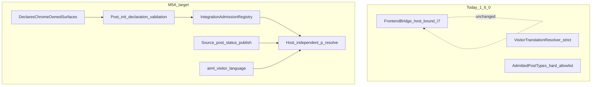

# M5-A — Private CPT Chrome Integration

**Status:** FROZEN — PO APPROVED  
**Repository:** [magpern/ai-multilingual](https://github.com/magpern/ai-multilingual)  
**Plugin:** AI Multilingual (`ai-multilingual`)  
**Namespace:** `AIMultilingual\`  
**Related public docs:** [INTEGRATION_API_V1.md](../INTEGRATION_API_V1.md), [EXTENSION_API_V1.md](../EXTENSION_API_V1.md), [ADR-0022](../adr/0022-public-extension-boundary-and-registration-lifecycle.md), [ADR-0024](../adr/0024-anonymous-language-cache-contract.md)  
**Planning baseline `main` SHA:** `740ccd93a7634d1dcb77a735a39e9f06181df001`  
**Baseline version:** 1.6.0  
**Recommended implementation release:** **1.7.0**  
**Drafted:** 2026-08-23  
**Frozen:** 2026-08-23

---

## 1. Objective

Add a **generic public Integration / Extension capability** so a vetted third-party integration may own an administrative/private WordPress CPT whose **selected field** is visitor-visible only through **site-wide chrome** (announcement bar, promotion banner, or similar), rendered independently of the queried page.

M5-A must support that pattern without:

- admitting every public or private CPT;
- making the CPT’s REST endpoint, archive, permalink, title, or undeclared fields public;
- binding visitor resolution to the currently queried page/post host;
- requiring consumers to access internal Store/Jobs classes;
- requiring consumers to reproduce AIML’s URL/host language mapping;
- duplicating identical translation units under every page host.

**Evidence consumer:** Universal Site Announcements (USA) M5-B is a future optional adapter. M5-A must remain **generic** — no USA-specific code, symbols, or product names in AIML APIs.

### Explicit non-goals

- Implementing any USA plugin code.
- Changing existing host-bound `IntegrationFrontendBridge` overlay behaviour (including I7 stale overlays).
- Introducing slug-only public `aiml_admitted_post_types` / taxonomy filters (still forbidden).
- Public Store read/write APIs.
- Cookie, geo, or `Accept-Language` language decision paths.
- Custom post-status visitor policies beyond `publish` (deferred).
- Production release, tag, ZIP, or deployment from this planning task.

---

## 2. Locked decisions (PO-approved)

| # | Decision | Lock |
|---|----------|------|
| 1 | Chrome resolution uses **Extension-strict** eligibility: **stale → `null`** | Approved |
| 2 | Admission via **additive companion interface** (do not break existing `PluginIntegrationInterface` implementors) | Approved |
| 3 | Future additive public API release target **1.7.0** | Approved |
| 4 | **Declaration-validation lifecycle** after CPTs exist (normally post-`init`) | Approved |
| 5 | **Source visitor-eligibility gate:** require source `post_status=publish` for chrome resolve | Approved |
| 6 | **Invalid declaration rule:** disable **that individual chrome-surface declaration** only; authorized diagnostic; continue all other valid declarations/integrations | Approved |

These are **not** open PO questions.

---

## 3. Baseline audit (1.6.0)

| Area | Current behaviour | Gap |
|------|-------------------|-----|
| CPT admission | `AdmittedPostTypes` hard allowlist (`post`, `page`, `product`; `nav_menu_item` workspace-only). No public filter. | Cannot admit integration-owned private CPT |
| Integration API | `PluginIntegrationInterface`: id, compatibility, `extract_for_post`, `register_output_hooks`. Identity via `PluginIdentity` (`p:…`). | No CPT/field declaration metadata |
| Host-bound overlays | `IntegrationFrontendBridge` closes resolve over **queried** host; I7 allows stale if publication-eligible | Unusable for site-wide chrome |
| Extension resolver | `VisitorTranslationResolver::resolve(SourceSegmentReference, LanguageReference)` is source-id-explicit; rejects stale; requires renderable statuses + publication eligibility | Blocks non-admitted CPTs; no source `publish` gate documented for private CPT chrome |
| Language | Router → `LanguageContext` (URL/host, ADR-0024) | No public consumer API |
| Dirty | `aiml_mark_source_dirty( $source_type, $source_id )` | Only admitted post/term types |

**Verdict:** CASE B — small generic public API gap. Do not work around with Store internals or per-page duplication.



---

## 4. Public API design

### 4.1 Companion interface — integration-owned private-CPT admission

**Shape (additive):**

- Interface: `AIMultilingual\Integration\DeclaresChromeOwnedSurfaces`
- Value object: `AIMultilingual\Integration\ChromeOwnedSurfaceDeclaration` (name finalizable at implementation)

**Declaration contents:**

| Field | Meaning |
|-------|---------|
| `post_type` | Private/admin CPT slug owned by the integration |
| `owner_types` | Allowed `p:` owner-type tokens |
| `fields` | Allowlisted field path tokens after `owner_id` (e.g. `body`) |
| Extraction mode | **`integration_units_only`** — skip native title/slug/excerpt/content, blocks, and Elementor for this CPT |

**Registration:**

1. Consumer implements `PluginIntegrationInterface` **and** `DeclaresChromeOwnedSurfaces`.
2. Registers on `aiml_register_integrations` via `IntegrationRegistry::register()` (unchanged entry hook).
3. AIML collects companion declarations into an internal `IntegrationAdmissionRegistry`.
4. **No** WordPress filter `aiml_admitted_post_types`.

Existing integrations that do not implement the companion interface are **unaffected**.

### 4.2 Declaration-validation lifecycle

Integrations commonly register CPTs on `init`. AIML must **not** seal admission assumptions before those CPTs exist.

**Required lifecycle:**

1. **Collect** declarations when integrations register (existing integration registration phase).
2. **Validate / activate** declarations only after the declared CPT is registered with WordPress — **normally after `init`** (or an equivalent post-CPT-registration checkpoint AIML already uses for surface bootstrap).
3. Validation checks at minimum:
   - `post_type` is a registered post type string;
   - owner-type tokens match identity grammar constraints;
   - field allowlist is non-empty and grammatically valid;
   - declaration does not claim another integration’s `integration_id` / surfaces.
4. **Invalid declaration → deterministic disable (single rule):** disable **that individual chrome-surface declaration**, record an **authorized diagnostic**, and **continue** registering all other valid declarations and integrations. It must **not** fail the overall AIML registry or block unrelated integrations. Do not partially admit undeclared fields from the disabled declaration.
5. A disabled/invalid declaration must not participate in Workspace extract, dirty admission, or visitor resolve.
6. Re-validation rules for request lifecycle: once activated for the request/bootstrap, treat as sealed for that request; do not silently revive invalid declarations.

**Anti-pattern:** Treating “integration registered at `plugins_loaded`” as proof that `post_type_exists( $cpt )` is already true.

### 4.3 What admission does and does not change

| Surface | Effect of a **valid, activated** declaration |
|---------|-----------------------------------------------|
| Workspace / Jobs | May discover/open posts of the declared type when the operator has `edit_post` (existing WP capabilities). Extract **declared `p:` fields only**. |
| `VisitorTranslationResolver` | May resolve declared `p:` keys for those source post IDs (with eligibility gates below). |
| `aiml_mark_source_dirty` | Accepts declared chrome CPT source IDs. |
| CPT REST / archives / permalinks / singles | **Unchanged.** AIML never sets `public`, `publicly_queryable`, `show_in_rest`, or rewrite for the consumer CPT. |
| Undeclared natives (title, etc.) | **Not** extracted or resolvable as chrome overlays. |

### 4.4 `p:` ownership verification

Before extract contribution or visitor resolve for a chrome `p:` key:

1. Parse via `PluginIdentity::parse()` (reject malformed keys).
2. `integration_id` matches a registered integration with an **activated** declaration covering the post’s `post_type`.
3. `owner_type` ∈ declared owner types.
4. `owner_id` equals `source_id` (post ID).
5. `field` (+ nested path) ∈ declared fields.
6. Integration compatibility allows the operation (`allows_overlay()` for visitor resolve; extract rules as today).
7. Fail closed → unresolved (`null` / no unit).

### 4.5 Host-independent public `p:` resolve

**Chosen path:** Extend `VisitorTranslationResolver` (already source-id-explicit). Chrome consumers **must not** use `IntegrationFrontendBridge` / `register_output_hooks` resolve for site-wide chrome.

**Consumer call shape:**

```php
$lang = aiml_visitor_language();
$resolver = \AIMultilingual\Extension\ExtensionServices::resolver();
// null checks omitted — see §4.6 and eligibility table
$resolved = $resolver->resolve(
	new \AIMultilingual\Extension\SourceSegmentReference( 'post', $post_id, $segment_key ),
	new \AIMultilingual\Extension\LanguageReference( $lang->code )
);
```

**Do not** create per-page duplicate Store rows. **Do not** expose Store internals.

### 4.6 Public eligibility contract (chrome)

Single documented public contract for host-independent chrome resolve. Resolves the historical FrontendBridge (I7) vs Extension inconsistency **for chrome consumers only** by selecting Extension-strict rules plus a source gate.

| Condition | Public result |
|-----------|---------------|
| Eligible: source `post_status=publish`, translation publication-eligible, non-stale, renderable provenance status, identity/admission valid, non-default language | `ResolvedTranslation` |
| Missing translation | `null` |
| Unpublished / not publication-eligible | `null` |
| Stale | `null` (Extension-strict; **not** I7) |
| Source draft, trash, private, or otherwise not `publish` | `null` |
| Source missing / no longer admitted / invalid identity / unsupported or overlay-disallowed integration | `null` |
| Default-language request or target language is default | `null` (unchanged) |

Miss reasons remain **opaque `null`** in M5-A (consistent with current Extension resolver). Consumers treat all `null` as source fallback.

**FrontendBridge / I7:** unchanged for existing host-bound integrations. Document the dual path honestly in public docs.

### 4.7 Source visitor-eligibility gate

A published translation must **not** overlay if its private-CPT **source record** is not visitor-eligible.

**M5-A rule:** require `get_post_status( $source_id ) === 'publish'`.

- Draft, pending, private, trash, auto-draft, and other non-`publish` statuses → `null`.
- Custom status policies are **out of scope** for M5-A (future extension if needed).
- This gate is evaluated on the **source post**, independent of the queried page.

### 4.8 Public visitor language context

```php
aiml_visitor_language(): ?\AIMultilingual\Extension\VisitorLanguageContext
```

| DTO field | Meaning |
|-----------|---------|
| `code` | Current request language code from AIML URL/host resolution |
| `is_default` | Whether that language is the site default |

Returns `null` when context is unavailable (AIML inactive, too early in bootstrap, routing not established).

**Lifecycle:** Valid only after AIML has set request language context (same window as visitor overlays — document as after request routing / equivalent bootstrap; not during early `plugins_loaded`).

**Authority:** Existing ADR-0024 URL/host policy only. Consumers must not implement host, URL-prefix, cookie, geo, or `Accept-Language` mapping.

### 4.9 Dirty, hash, Workspace, Jobs

- Extend `aiml_mark_source_dirty( 'post', $id )` to accept activated chrome-admitted CPT sources.
- Source hash / sync / stale materialization remain Store-internal and unchanged in semantics.
- Extract for chrome-admitted CPT: only the declaring integration’s `extract_for_post` units for declared fields (`integration_units_only`).
- Operators translate/review/publish via existing AIML Workspace/Jobs UI.
- **No** second translation UI in the consumer plugin.

---

## 5. Security and compatibility

### 5.1 Threat analysis

| Threat | Mitigation |
|--------|------------|
| Malicious/buggy integration resolves arbitrary private posts | Identity parse + activated declaration + `owner_id === source_id` + registered `integration_id` + field allowlist |
| Undeclared title/meta leakage | `integration_units_only` + field allowlist; natives not extracted |
| Broad CPT admission via filter | Forbidden; companion declaration only |
| Premature admission before CPT exists | Declaration-validation lifecycle (post-`init`) |
| Invalid declaration fails whole registry | Forbidden — disable only that declaration; continue others |
| Overlay on draft/trash source | Source `post_status=publish` gate |
| Store abuse | No public Store API; chrome uses Extension resolver only |

### 5.2 Capability checks

Workspace/Jobs continue to require existing AIML operator capabilities and WordPress `edit_post` (or equivalent) on the source post. No anonymous write surface. Visitor resolve is read-only overlay lookup.

### 5.3 Backwards compatibility

- Existing Integration API v1 implementors unchanged if they omit the companion interface.
- `IntegrationFrontendBridge` behaviour unchanged.
- Optional consumer with no chrome declaration: unaffected.
- PluginGuard continues to forbid public slug-only admission filters.

### 5.4 Anti-patterns and stop conditions

Stop implementation if the approach would:

1. Add `aiml_admitted_post_types` (or similar) public filters.
2. Flip consumer CPT `public` / REST / rewrite flags from AIML.
3. Require chrome consumers to use FrontendBridge host-bound resolve.
4. Allow stale chrome overlays (I7) on the Extension chrome path.
5. Seal CPT admission before the CPT is registered.
6. Overlay translations for non-`publish` source posts.
7. Expose Store/Jobs internals as public API.
8. Embed USA-specific names or code in AIML core.
9. Add cookie/geo/`Accept-Language` language selection.
10. Ship production release/deploy from a planning-only change set.

---

## 6. Work packages (future implementation)

| WP | Scope |
|----|--------|
| **M5A.0** | ADR (or ADR amendment) + public contract docs (`INTEGRATION_API_V1`, `EXTENSION_API_V1`, HOOKS) |
| **M5A.1** | Companion interface + declaration DTO + `IntegrationAdmissionRegistry` collection |
| **M5A.2** | Post-`init` declaration validation; invalid → disable that declaration + diagnostic; continue others |
| **M5A.3** | Extractor + Workspace/Jobs discovery for activated chrome CPTs (`integration_units_only`) |
| **M5A.4** | `VisitorTranslationResolver` admission + ownership checks + source `publish` gate + eligibility docs |
| **M5A.5** | `aiml_visitor_language()` + `VisitorLanguageContext` |
| **M5A.6** | Dirty-helper admission extension |
| **M5A.7** | Automated + manual tests; generic reference fixture integration (not USA) |
| **M5A.8** | Closure documentation; recommend **1.7.0** release as a **separate** authorized task |

Suggested WP order may merge M5A.1–M5A.2 and M5A.4–M5A.6 during implementation as long as acceptance criteria remain intact.

---

## 7. Test and acceptance matrix (implementation)

| ID | Expectation |
|----|-------------|
| T1 | Legitimate registered integration exposes one declared private-CPT body field to Workspace/Jobs |
| T2 | Published translation resolves on a front page **unrelated** to the CPT source ID |
| T3 | Resolver cannot access undeclared fields, another integration’s source, arbitrary private posts, titles, meta |
| T4 | AIML does not create public REST/archives/permalinks for the CPT as a side effect of admission |
| T5 | Missing / stale / unpublished / invalid-identity / no-longer-admitted / disabled declaration → `null` |
| T6 | Source draft or trash → `null` even if a translation row exists |
| T7 | Existing host-bound FrontendBridge consumers unchanged (including I7 stale behaviour) |
| T8 | `aiml_visitor_language()` reflects URL/host configuration; default and unavailable contexts documented |
| T9 | No cookie / geo / `Accept-Language` language decision introduced |
| T10 | Dirty invalidation updates freshness for the declared source |
| T11 | Degraded / inactive / unsupported integration remains safe (source fallback / no fatal) |
| T12 | Invalid declaration disables only that chrome-surface declaration (authorized diagnostic); other declarations/integrations continue; activates after valid CPT registration path |
| T13 | Compatibility scenarios remain fail-closed for overlay when compatibility disallows overlay |

Black-box tests against public APIs only. Include a generic fixture integration in AIML tests — not a USA dependency.

---

## 8. Release sequencing

1. **This PR:** draft plan only — unmerged until PO freezes.
2. Freeze M5-A plan (separate approval).
3. Implement M5A.0–M5A.8; test; document.
4. Release AIML **1.7.0** (separate authorized release task).
5. Deploy to the USA target environment (separate authorized deploy task).
6. **Only then** freeze/implement USA M5-B.

**Hard gate:** M5-A must be frozen, implemented, tested, documented, released, and deployed to the USA target environment **before** USA M5-B is frozen or implemented.

**USA is evidence only.** No USA code belongs in M5-A.

**This planning task does not authorize** production release or deployment.

---

## 9. Key symbols (implementation touchpoints)

Plain references (paths relative to repository root):

- `src/Integration/PluginIntegrationInterface.php`
- `src/Integration/IntegrationRegistry.php`
- `src/Integration/Identity/PluginIdentity.php`
- `src/Integration/IntegrationFrontendBridge.php` (unchanged behaviour)
- `src/Surface/AdmittedPostTypes.php`
- `src/Extension/VisitorTranslationResolver.php`
- `src/Extension/ExtensionServices.php`
- `src/Extension/functions.php` (`aiml_mark_source_dirty`; add `aiml_visitor_language`)
- `src/Language/LanguageContext.php` (internal; read by public helper only)
- `tests/Fixtures/ReferenceIntegration/` (extend or add chrome fixture)

From this document under `docs/plans/`, code links use `../../src/...` when linked.

---

## 10. Documentation requirements at implementation

Update:

- [INTEGRATION_API_V1.md](../INTEGRATION_API_V1.md) — companion interface, declaration lifecycle, ownership rules
- [EXTENSION_API_V1.md](../EXTENSION_API_V1.md) — chrome resolve eligibility table, `aiml_visitor_language()`, source `publish` gate
- [HOOKS.md](../HOOKS.md) — any new public symbols
- New or amended ADR under `docs/adr/` capturing admission boundary and dual-path eligibility (Extension-strict chrome vs FrontendBridge I7)

No `file://` links, local filesystem paths, credentials, or consumer-site branding in committed docs.

---

## 11. Exact next steps after this draft PR

1. PO reviews this draft and freezes M5-A (status → `FROZEN — PO APPROVED`) in a follow-up docs commit/PR if needed.
2. Authorize implementation against the frozen plan.
3. Do **not** start USA M5-B until AIML **1.7.0** (or the released M5-A train) is deployed to the USA target environment.
