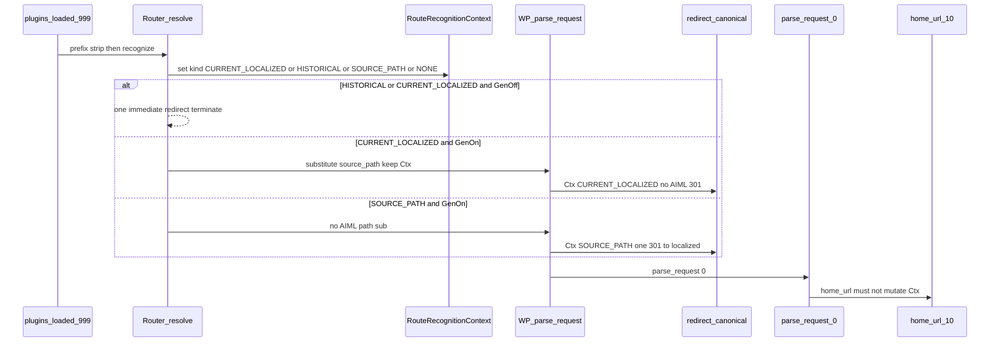

# MSEO.2 — Public Localized URL Routing & SEO Graph Activation — Implementation Plan

**Status:** **Architecture Frozen** — authoritative specification for MSEO.2 implementation  
**Milestone:** MSEO.2 — Public Localized URL Routing & SEO Graph Activation  
**Parent:** [MSEO_PARENT_IMPLEMENTATION_PLAN.md](MSEO_PARENT_IMPLEMENTATION_PLAN.md)  
**ADR:** [0023-localized-url-overlay-architecture.md](../adr/0023-localized-url-overlay-architecture.md) (**Accepted**)  
**External review:** **FREEZE** (A1–A6 + B1–B7)  
**STATE:** B · **TARGET 8** (no migration) · **Version:** 1.4.0  
**Planning materialization:** docs-only on `main`  
**Implementation branch:** `feature/mseo2-public-localized-url-routing` (create after freeze push)  
**Baseline:** `main` @ `88ac74cc3b1320af5359b190b32cacaf79f92bff`  
**Depends on:** MSEO.0 COMPLETE; MSEO.1 COMPLETE; ADR-0023 Accepted  

**This document is the authoritative implementation specification for MSEO.2.** Do not start MSEO.3.

---

## 1. Repository baseline

| Item | Value |
|---|---|
| HEAD | `88ac74cc3b1320af5359b190b32cacaf79f92bff` |
| Version | 1.4.0 |
| TARGET | 8 |
| Schema | routes + history + frontier + `slug_origin`; UNIQUE `localized_identity (language_id, localized_path_hash)` covers **all** route rows including inactive |
| Public routing | OFF — EffectiveUrl unwired; `is_discoverable()` always false |
| Settings keys | `localized_urls_state` / `_activation_checkpoint` / `_activation_error` exist (default `off`) |

### MSEO.1 lifecycle evidence (A1)

| Event | Persistence |
|---|---|
| `publish_route` | UPSERT current row `route_status=active`; prior distinct path → **history insert** |
| Trash | `deactivate_for_source` → `route_status=inactive` (**no** history invent) |
| Untrash | Does **not** reactivate; explicit re-publish required |
| Permanent delete | `purge_for_source` deletes routes + history (frees UNIQUE) |
| Same-object history reclaim | Delete own history row then activate |

**No second history mechanism.** Inactive rows remain stored for editorial reactivation / uniqueness reservation; they are **not** a PathRecognition authority.

---

## 2. Current routing ownership (frozen from code)



| Seam | Current reality |
|---|---|
| [Router.php](src/Routing/Router.php) | `plugins_loaded:999` strip; `redirect_canonical` language-preserve only; `parse_request:0` → `home_url` prefix; skips admin/REST/login paths |
| EffectiveUrl / SB11 / SEO | SA7 source-slug; EffectiveUrl unwired |
| Preview | Source permalink + temporary prefix — forever |
| Guards | Forbid EffectiveUrl wiring + Router route lookup today |

---

## 3. Exact MSEO.2 objective

Administrator-activatable visitor-facing localized URLs for capability-supported objects with **already-active prepared routes**, coherent across inbound recognition, outbound admission, switcher, canonical, hreflang, sitemap Model A, one-hop redirects, OFF fallback, verification activation, failure/retry — without WP slug mutation, rewrite rules, provider slugs, or MSEO.3/4 scope.

---

## 4. Supported public route shapes

| Shape | MSEO.2 public? |
|---|---|
| `post_flat` | Supported |
| `page_top_level` | Supported |
| `product_plain_permalink` | Supported **only if** Woo product base has no `%product_cat%` (detect permalink options); else unsupported → source-slug |
| Hierarchy / terms / product-cat URLs / rewrite bases / machine endpoints | Blocked |

---

## 5. Activation state machine

Persisted: `localized_urls_state` ∈ `{off,activating,on,failed}` + checkpoint + error (Settings accessors only; no migration).

| State | GenerationEnablement | PathRecognition |
|---|---|---|
| off / activating / failed | false | always on (**active** routes + history only) |
| on | true | always on |

During `activating`: recognize active routes inbound; outbound still source-slug until `on`.

---

## 6. Enable / disable UX

Settings Localized URLs control (Off / Activating / On / Failed); O(1) enable→activating; O(1) disable→off; Retry on failed; confirm on enable; no CLI required. **UI live only after MSEO2.5 boundary.**

---

## 7–8. Activation job + result taxonomy (A2 + A6)

**Prepared-routes-only verification.** Job `SlugRouteActivationJob` paginates `aiml_slug_routes WHERE route_status='active'` by `route_id` cursor.

### A6 — Non-mutation invariant (PluginGuard)

Job **may:** read, validate, checkpoint, classify, report.  
Job **must not:** call `RoutePublicationService`; activate inactive routes; generate candidates; change `slug_origin`; insert history; rewrite `source_path`; mutate translation publication. Activation changes **global feature state only**.

### Result taxonomy (every examined active route)

| Outcome | Meaning | Advance checkpoint | Diagnostics | Block ON | Set FAILED |
|---|---|---|---|---|---|
| **ADMITTED** | Active; hash/path valid; source exists; language valid; capability supported; no invariant break | Yes | admitted++ | No | No |
| **SKIPPED_UNSUPPORTED** | Valid route; shape not MSEO.2 public-capable (hierarchy / non-plain Woo) | Yes | skipped_unsupported++ | **No** | No |
| **SKIPPED_NOT_PUBLIC** | Object/language not currently public (e.g. private/draft/lang unpublished); route may remain | Yes | skipped_not_public++ | **No** | No |
| **INVALID_DATA** | Hash/path/source identity corruption or impossible invariant | Yes (mark examined) | invalid++ | **Yes** | **Yes** |
| **CONFLICT** | Uniqueness/ownership contradiction | Yes | conflict++ | **Yes** | **Yes** |
| **SYSTEM_ERROR** | DB/runtime failure mid-batch | No (or resume cursor) | error recorded | **Yes** | **Yes** (resumable) |

**ON** only after entire frontier processed with **zero** INVALID_DATA / CONFLICT / SYSTEM_ERROR. Unsupported/non-public skips never block global ON.

---

## 9. First-activation boundary

MSEO2.0→2.4: no Settings toggle. **End of MSEO2.5:** toggle goes live. MSEO2.6: guards/browser/evidence.

---

## 10–12. Inbound recognition + request identity (A1 + B1–B6)

### Ownership model

| Persistence | PathRecognition authority? |
|---|---|
| Current route `route_status=active` | **Yes** — sole current-path recognition |
| Current route `route_status=inactive` | **No** |
| `aiml_route_history` | **Yes** — replaced historical paths only |
| Feature OFF | Does **not** deactivate routes; active rows remain recognizable |

### B1 — `RouteRecognitionContext` (request-local)

Owned by `Router` for the current PHP request. Simplest repository-consistent form: immutable value object held on the Router instance (already one per request via Plugin bootstrap). **Not** a DB row, option, transient, or global session subsystem.

**Kind (required):**

| Kind | Meaning |
|---|---|
| `NONE` | No AIML route recognition |
| `CURRENT_LOCALIZED` | Visitor requested an **active** current localized path |
| `HISTORICAL_LOCALIZED` | Visitor requested history (normally redirected immediately; request terminates) |
| `SOURCE_PATH` | Visitor arrived on the normal source-slug translated URL (no localized/history hit) |

**Immutable facts recorded when recognized (as needed):** original prefixed path; original unprefixed path; `source_type` / `source_id` / `language_id`; `route_id` or history id; original query string.

### B6 — Non-reentrant rules

- New/empty context at start of `resolve()`; set once after recognition; never overwritten by `home_url`, switcher, SB11, or SEO builders  
- No cross-request or cross-language leakage  
- Outbound URL generation **must not** mutate inbound recognition state  

### Deterministic recognition / redirect pipeline

1. Prefix strip (existing).  
2. Canonicalize unprefixed path; preserve **query** (B7: no inbound fragment — server never receives `#…`).  
3. Lookup **active** current by localized path (+ full-path verify).  
   - Hit → kind=`CURRENT_LOCALIZED`.  
   - If GenerationEnablement **false** (off/activating/failed) → **one immediate 302** to source-slug language URL (+ query) → **terminate** (B4). Do **not** substitute into WP.  
   - If GenerationEnablement **true** → substitute `REQUEST_URI` with `source_path` (+ home + query) for WP parse; **keep** kind=`CURRENT_LOCALIZED` (B2).  
4. Else history lookup.  
   - Hit → kind=`HISTORICAL_LOCALIZED`; **one immediate** redirect (ON: **301** EffectiveUrl; OFF/activating/failed: **302** source-slug) → **terminate** (B5). Do **not** continue into WP.  
5. Else kind=`SOURCE_PATH` (or `NONE` if non-routable context); no AIML path substitution; WP natural parse.  
6. Inactive current row: ignore (A1); fall through.

UNIQUE inactive reservation remains collision-only, not PathRecognition (A1 unchanged).

---

## 13–15. Redirect ownership / one-hop (A5 + B2–B5)

### Historical (early terminal) — B5

At `plugins_loaded:999`: history hit → redirect → terminate. Context may record the hit for tests; **no** later canonical stage.

### Current localized + GenerationEnablement false — B4

At recognition: **one 302** → source-slug language URL. Never: localized → internal source sub → WP → second redirect.

### Current localized + ON — B2

Internal substitution to `source_path` is for WP parsing only. `filter_redirect_canonical` **must read context kind**:

- If `CURRENT_LOCALIZED` → **do not** emit source→localized 301 (visitor already on canonical localized URL). Allow only legitimate WP corrections that neither undo AIML localization nor self-loop.  
- Proof: `GET /sv/roda-skor/` → resolve source object → **HTTP 200** → **zero AIML redirect** → **zero self-redirect** → canonical `/sv/roda-skor/`.

### Source-slug + ON — B3

Context kind=`SOURCE_PATH` (classified **before** any substitution; **never** inferred solely from post-substitution `REQUEST_URI`).

`filter_redirect_canonical`: if `SOURCE_PATH` ∧ state=`on` ∧ active route ∧ request unprefixed path ≠ effective localized → return **final** language-prefixed EffectiveUrl (+ query) as sole redirect target → **exactly one 301**. No intermediate unprefixed redirect; no WP+AIML two-hop chain.

### Language-preserve (existing)

When neither AIML 301 nor early 302 applies, keep existing policy blocking unprefixed language strip.

Exclusions unchanged: preview, admin, REST, cron/CLI, non-public, unsupported, inactive.

Temporary reversible: **302**. Deliberate replace / source→localized when ON: **301**.

---

## 17b. Query / fragment semantics (B7)

| Surface | Query | Fragment (`#…`) |
|---|---|---|
| **Inbound** HTTP request / redirects | **Preserve** | **No claim** — browsers do not send fragments to the server |
| **Outbound** URL building (`home_url` / SB11) | Preserve when present on input URL | Preserve when the URL-building API receives a fragment |

**M2AC17** must not imply server-side preservation of an *incoming* fragment.

---

## 16. EffectiveUrlService

```text
effective_unprefixed_path(source_path, language_id):
  default language → source_path
  state !== on → source_path
  no active route for (language, source_path) → source_path
  unsupported capability → source_path
  else → active route.localized_path
```

Routable active route may keep localized EffectiveUrl even when SEO discoverability is false (URL stability). SEO consumers use discoverability separately (§22).

---

## 17. Outbound `home_url` admission boundary (A3)

Localization in `filter_home_url` is **not** “any same-site path”.

### Admission algorithm

1. Existing early exits: not translated context; no host; REST prefix; `/wp-admin`; `/wp-login.php`; already language-prefixed → return unchanged.  
2. Strip home path → unprefixed path; preserve **query**; preserve **fragment only if present on the input URL string** (outbound API reality — B7).  
3. **Deny / no-localize** (prefix-only or unchanged per existing policy) for: homepage/root `/`; feeds; search; pagination-only; uploads/content URLs; cron/AJAX endpoints; Woo cart/checkout/my-account/endpoints; add-to-cart query URLs; arbitrary unknown paths.  
4. **Admit localize only if** `find_by_source_path(current_language, canonicalize(unprefixed))` returns **active** route for a capability-supported source object (exact source-path authority — no URL-shape guessing).  
5. Replace path with `localized_path`; then apply language prefix; reattach query then fragment.  
6. **Anti-recursion:** if unprefixed path already matches an **active localized_path** for this language → do **not** localize again; only ensure single language prefix (existing already-prefixed guard). Never localize→prefix→localize.

SB11 builds via EffectiveUrl with known object/source path — not via guessing `home_url` on arbitrary strings.

### Outbound ownership / admission matrix

| URL class | Localize? | Prefix? |
|---|---|---|
| Post/page/product permalink whose source_path has active route | Yes when ON | Yes when translated |
| Same without active route | No | Yes |
| Homepage / root | No | Yes (language root) |
| wp-admin / wp-login / REST | No | No |
| Feeds / search / pagination chrome | No | Yes if front context (no localize) |
| uploads / static assets | No | No / unchanged |
| Woo cart / checkout / my-account / endpoints / add-to-cart | No | Yes if front (no localize) |
| Arbitrary plugin / unknown path | No | Yes if front (no localize) |
| Already-localized active path | No (idempotent) | Idempotent single prefix |
| Preview URLs | No localize | Temporary prefix only |

---

## 18–21. Switcher / canonical / hreflang / sitemap / Rank Math

All SEO advertisement of **localized** URLs goes through SB11 after consulting **one** discoverability authority (§22). Model A sitemap unchanged structurally. Rank Math present/absent preserved. Preview never localized.

---

## 22. Object-language SEO discoverability authority (A4)

**ONE authority:** `ObjectLanguagePublicEligibility::is_discoverable( WP_Post $post, int $language_id ): bool`  
(ADR-0023 §14–15; replace always-false stub.)

Consumers (**must not** re-infer): Switcher, SB11, DocumentSeoHead, RankMathSitemapOverlay.  
EffectiveUrl does **not** call discoverability for path choice (stability); SEO consumers do.

### Exact answers

1. **“Publicly translated version in L”** = language `published` ∧ source publicly viewable ∧ capability supported ∧ `localized_urls_state=on` ∧ **active** prepared route ∧ **overlay bundle present** (below).  
2. **Must every segment be published?** **No.**  
3. **One published primary segment enough?** **Yes** — ≥1 non-slug admitted segment that passes `Store::is_publicly_overlay_eligible` (publication-gate aware: when gate ON requires `publish_status=published`; when OFF, non-empty non-ignored/missing). Matches ADR “any admitted field, not title-only” and existing `has_overlay_bundle` used by `is_route_publishable`.  
4. **Partial translation:** discoverable if bundle ≥1 eligible non-slug segment; remaining source-language segments OK.  
5. **Stale:** `is_publicly_overlay_eligible` does **not** exclude `is_stale` (Store I7). Stale eligible segments **count** toward the bundle; object remains discoverable if other conjuncts hold. Routability unchanged.  
6. **FORMAT_SLUG:** **excluded** from content-bundle evidence (route eligibility separate). Slug candidate publish_status alone never grants discoverability.  
7. **Active route, bundle not discoverable:** EffectiveUrl may still return localized path (ON+active+capability); **hreflang/sitemap omit** that language alternate; switcher href uses **SA7 source-slug** (not localized advertisement). Canonical on a request already serving that language page uses EffectiveUrl (may be localized) for self-canonical stability — alternates still gated.  
8. **Shared result:** Switcher / hreflang / sitemap **must** consume the same `is_discoverable` boolean. Branching only on **how** to render when false (omit vs SA7 switcher link) — never disagree on the boolean.

### Matrix

| Scenario | is_discoverable | EffectiveUrl | Hreflang/sitemap | Switcher href |
|---|---|---|---|---|
| Fully published + active route + ON | true | localized | localized | localized |
| Partial (≥1 eligible) + active + ON | true | localized | localized | localized |
| Stale eligible segments + active + ON | true | localized | localized | localized |
| No eligible non-slug content | false | localized if active+ON else SA7 | omit | SA7 |
| Active route, not discoverable bundle | false | localized (stability) | omit | SA7 |
| Discoverable content, no active route | false | SA7 | omit localized | SA7 |
| Language unpublished | false | SA7 | omit | omit / non-public |
| Source not public | false | SA7 | omit | omit |

---

## 23–28. Unpublish / disable / re-enable / failure / diagnostics

- Inactive: no PathRecognition; EffectiveUrl SA7; SEO de-advertise; **no** 302 via inactive; **no** history invent.  
- OFF / activating / failed + **CURRENT_LOCALIZED**: one early **302** from recognition (B4); GenerationEnablement off.  
- OFF + active routes still in DB: PathRecognition valid; SOURCE_PATH requests need no AIML redirect.  
- Re-enable: verification only (A2/A6).  
- Failed: no On lie; retry resumes; no infinite loop.  
- CLI optional diagnostics.

---

## 29–34. Cache / preview / security / performance

Unchanged in spirit: invalidate on state/route events; preview bypass; same-site redirects; request-local route cache `(language_id, source_path_hash)`; no persistent cache required.

---

## 35–36. Browser + integration (amended)

Add cases: inactive **not** PathRecognized; activation outcome taxonomy; home_url negative fixtures; anti-recursion; shared discoverability; activation non-mutation; **B1–B7 request-identity proofs:**

1. CURRENT_LOCALIZED ON → 200, no AIML redirect, canonical localized  
2. SOURCE_PATH ON → one 301 → localized  
3. CURRENT_LOCALIZED OFF → one 302 → source-slug  
4. CURRENT_LOCALIZED ACTIVATING → one 302  
5. CURRENT_LOCALIZED FAILED → one 302  
6. History ON → one 301  
7. History OFF → one 302  
8. Query survives applicable redirects  
9. Internal source_path substitution cannot self-redirect  
10. Context unchanged by home_url / switcher / SEO generation  
11. No cross-language/request-context leakage  
12. Incoming fragment preservation **not** claimed

---

## 37. PluginGuard (amended)

**Positive:** A1–A6 + B1–B7 (`RouteRecognitionContext`; CURRENT_LOCALIZED no self-301; SOURCE_PATH one 301; early OFF 302; history early terminal; context non-reentrant; fragment honesty); EffectiveUrl sole localize authority; capability gate; no On before frontier complete.

**Forbid:** post_name/term slug mutation; rewrite rules; provider FORMAT_SLUG; term/hierarchy public routing; activation calling RoutePublicationService / generate / history insert / reactivate inactive / mutate publication; TARGET 9.

---

## 38. Requirements matrix (M2R1–M2R54)

| ID | Requirement | Class |
|---|---|---|
| M2R1 | State machine + checkpoint/error | Supported |
| M2R2 | Admin enable/disable UX | Supported |
| M2R3 | O(1) save; batched activation | Supported |
| M2R4 | Prepared active routes only for verification frontier | Supported |
| M2R5 | Activation never publishes/generates/reactivates routes | Supported |
| M2R6 | PathRecognition always on for **active** + history | Supported |
| M2R7 | OFF/activating/failed CURRENT_LOCALIZED → one early 302 | Supported |
| M2R8 | Inbound: active current → history → WP; inactive ignored | Supported |
| M2R9 | SOURCE_PATH ON → one 301 via redirect_canonical + context | Supported |
| M2R10 | History → one early terminal redirect | Supported |
| M2R11 | No redirect chains; no stored destinations | Supported |
| M2R12 | EffectiveUrl single localize authority | Supported |
| M2R13 | home_url: admit source_path only → localize → prefix → query/(outbound fragment) | Supported |
| M2R14 | Ordinary eligible permalinks localize; denylist does not | Supported |
| M2R15 | Switcher consumes shared is_discoverable | Supported |
| M2R16 | Canonical via EffectiveUrl | Supported |
| M2R17 | Hreflang omits when !is_discoverable | Supported |
| M2R18 | Sitemap Model A | Supported |
| M2R19 | Rank Math present/absent | Supported |
| M2R20 | Routability ≠ discoverability | Supported |
| M2R21 | Discoverability = ≥1 eligible non-slug; stale counts; slug excluded | Supported |
| M2R22 | Inactive: no PathRecognition; no SEO advertise | Supported |
| M2R23 | Disable/re-enable O(1) + verify | Supported |
| M2R24 | Failed + retry; no On lie | Supported |
| M2R25 | Activation outcomes ADMITTED/SKIPPED_*/INVALID/CONFLICT/SYSTEM_ERROR | Supported |
| M2R26 | SKIPPED_UNSUPPORTED/NOT_PUBLIC do not block ON | Supported |
| M2R27 | INVALID/CONFLICT/SYSTEM_ERROR → FAILED; block ON | Supported |
| M2R28 | ON only after full frontier without blocking failures | Supported |
| M2R29 | Diagnostics/CLI optional | Supported |
| M2R30 | Cache invalidation | Supported |
| M2R31 | Preview source-slug | Supported |
| M2R32 | Redirect security | Supported |
| M2R33 | Performance + request-local cache | Supported |
| M2R34 | Capability gate + Woo plain detection | Supported |
| M2R35 | No post_name/term mutation | Supported |
| M2R36 | No rewrite rules | Supported |
| M2R37 | No provider slug generation | Supported |
| M2R38 | Anti-recursion outbound | Supported |
| M2R39 | Browser suite | Supported |
| M2R40 | PluginGuard | Supported |
| M2R41 | TARGET 8; version 1.4.0 | Supported |
| M2R42 | Inactive UNIQUE reservation ≠ PathRecognition | Supported |
| M2R43 | Outbound may preserve fragment when present on input URL | Supported |
| M2R44 | Active route + !discoverable → SEO omit; EffectiveUrl may localize | Supported |
| M2R45 | Request-local RouteRecognitionContext kinds NONE/CURRENT/HISTORICAL/SOURCE | Supported |
| M2R46 | CURRENT_LOCALIZED ON → 200; no AIML self-redirect | Supported |
| M2R47 | Context not inferred solely from post-substitution REQUEST_URI | Supported |
| M2R48 | Context immutable to home_url/SEO/outbound | Supported |
| M2R49 | Inbound query preserved; inbound fragment not claimed | Supported |
| M2R50 | Hierarchical pages | Deferred MSEO.3 |
| M2R51 | Term archives | Deferred MSEO.3 |
| M2R52 | Product category permalinks | Deferred MSEO.4 |
| M2R53 | Activation mutates editorial route state | Unsupported (forbidden) |
| M2R54 | Persist recognition context to DB/options | Unsupported (forbidden) |

**Count: M2R1–M2R54** (49 Supported, 3 Deferred, 2 Unsupported/forbidden).

---

## 39. Acceptance criteria (M2AC1–M2AC55)

| ID | Criterion |
|---|---|
| M2AC1 | Default state off |
| M2AC2 | Admin enable after boundary |
| M2AC3 | Enable → activating O(1) |
| M2AC4 | No catalog scan on save |
| M2AC5 | Batched checkpointed resumable activation |
| M2AC6 | ON only after full frontier w/o blocking failures |
| M2AC7 | Failed recoverable |
| M2AC8 | Active supported route resolves when on |
| M2AC9 | Unsupported capability → source-slug |
| M2AC10 | Active current precedes history; inactive ignored |
| M2AC11 | SOURCE_PATH ON → exactly one 301 to localized |
| M2AC12 | History ON → exactly one early 301 |
| M2AC13 | CURRENT_LOCALIZED OFF → exactly one early 302 |
| M2AC14 | Inactive not PathRecognized; no history invent on deactivate |
| M2AC15 | No redirect chains (incl. redirect_canonical) |
| M2AC16 | Query preserved on applicable inbound redirects |
| M2AC17 | Inbound fragment preservation is **not** claimed; outbound preserves fragment only when present on input URL |
| M2AC18 | Switcher/hreflang/sitemap share is_discoverable |
| M2AC19 | Canonical EffectiveUrl |
| M2AC20 | Hreflang omits !discoverable |
| M2AC21 | Sitemap Model A localized xhtml when discoverable |
| M2AC22 | Rank Math absent valid |
| M2AC23 | Partial translation discoverable with ≥1 eligible non-slug |
| M2AC24 | Stale eligible segments still count |
| M2AC25 | FORMAT_SLUG excluded from content bundle |
| M2AC26 | Active route + empty bundle → !discoverable; SEO omit |
| M2AC27 | Discoverable content without active route → !discoverable localized |
| M2AC28 | Preview source-slug |
| M2AC29 | No post_name mutation |
| M2AC30 | No term slug mutation |
| M2AC31 | No rewrite rules |
| M2AC32 | No provider slug generation |
| M2AC33 | Activation non-mutation |
| M2AC34 | Request-local route cache no cross-language |
| M2AC35 | TARGET 8 |
| M2AC36 | Version 1.4.0 |
| M2AC37 | activating outbound still source-slug |
| M2AC38 | PathRecognition uses **active** routes only |
| M2AC39 | Woo category-base products not localized |
| M2AC40 | Enable UI absent before MSEO2.5 |
| M2AC41 | home_url does not localize Woo endpoints/admin/REST/uploads/unknown |
| M2AC42 | home_url localize only on active source_path hit |
| M2AC43 | No double localize / double prefix |
| M2AC44 | SKIPPED_UNSUPPORTED does not fail activation |
| M2AC45 | SKIPPED_NOT_PUBLIC does not fail activation |
| M2AC46 | INVALID_DATA / CONFLICT → FAILED |
| M2AC47 | SYSTEM_ERROR → FAILED resumable |
| M2AC48 | Unpublished language/source → !discoverable |
| M2AC49 | CURRENT_LOCALIZED ON → HTTP 200; zero AIML redirect; canonical localized |
| M2AC50 | CURRENT_LOCALIZED ACTIVATING → one 302 |
| M2AC51 | CURRENT_LOCALIZED FAILED → one 302 |
| M2AC52 | History OFF → one early 302 |
| M2AC53 | Internal source_path substitution does not trigger self-redirect |
| M2AC54 | RouteRecognitionContext unchanged by home_url/switcher/SEO generation |
| M2AC55 | No cross-request/cross-language context leakage; no DB persistence of context |

**Count: M2AC1–M2AC55.**

---

## 40. Work package ladder (unchanged order)

| WP | Scope | Enable UI? |
|---|---|---|
| MSEO2.0 | Characterization; accessors; Woo plain detection; discoverability contract; guards prep | No |
| MSEO2.1 | Inbound active/history; RouteRecognitionContext; inactive ignore; early OFF 302; history terminal; redirect_canonical uses context | No |
| MSEO2.2 | EffectiveUrl; home_url admission matrix; SB11; switcher; anti-recursion; request-local cache | No |
| MSEO2.3 | Canonical/hreflang/sitemap via shared is_discoverable; Rank Math | No |
| MSEO2.4 | Activation job + taxonomy + non-mutation + CLI (no toggle) | No |
| MSEO2.5 | Stale/unpublish/disable/re-enable; cache; security; **Settings toggle** | Yes |
| MSEO2.6 | PluginGuard; performance; browser; evidence | Yes |

---

## 41–45. STATE / TARGET / schema / ADR / deferred

| Item | Verdict |
|---|---|
| STATE | **B** |
| TARGET | **8** — no migration |
| Schema | Sufficient (inactive UNIQUE reservation reused; recognition policy is code-level) |
| ADR | **ADR-0023 sufficient** — redirect ownership via existing `redirect_canonical` filter fulfills post-resolution canonical semantic without ADR amend |
| Deferred | Hierarchy, terms, Woo category permalinks, rewrite-base translation, Extension API URLs, provider slugs, release |

---

## 46. Self-review (A1–A6 + B1–B7 falsification)

| # | Attack | Verdict |
|---|---|---|
| 1 | Inactive permanently PathRecognized squat? | **No** — recognition ignores inactive |
| 2 | Unsupported prepared route block ON? | **No** — SKIPPED_UNSUPPORTED |
| 3 | Corrupt data silently pass? | **No** — INVALID_DATA/CONFLICT → FAILED |
| 4 | home_url localize Woo endpoint? | **No** — denylist + source_path admission |
| 5 | Transform recurse/double-prefix? | **No** — anti-recursion guards |
| 6 | Switcher vs hreflang disagree discoverability? | **No** — single `is_discoverable` |
| 7 | Active slug make untranslated SEO-discoverable? | **No** — slug excluded from bundle |
| 8 | redirect_canonical two-hop / self-redirect after sub? | **No** — context distinguishes CURRENT vs SOURCE |
| 9 | Activation publish/reactivate? | **No** — A6 |
| 10 | ON despite unprocessed frontier? | **No** |
| 11 | CURRENT_LOCALIZED ON self-301 because REQUEST_URI is source_path? | **No** — B2 uses context kind |
| 12 | SOURCE_PATH misclassified after substitution? | **No** — kind set before sub; never from post-sub URI alone |
| 13 | OFF CURRENT_LOCALIZED two-hop via WP? | **No** — B4 early 302 terminate |
| 14 | History continues into WP? | **No** — B5 early terminal |
| 15 | home_url mutates recognition context? | **No** — B6 immutable |
| 16 | Claim inbound fragment preserve? | **No** — B7 honesty |

A1–A6 remain intact. No new persistence. TARGET 8. ADR-0023 sufficient.

---

## 47. Final verdict

**MSEO.2 PLAN REVIEW: FREEZE** (materialized)

---

## 48. Exact next step

Materialized to this path. Implementation proceeds on `feature/mseo2-public-localized-url-routing`. **Do not start MSEO.3.**

---

## Amendment disposition summary

| ID | Disposition |
|---|---|
| **A1** | Inactive **not** PathRecognized; active current + history only |
| **A2** | Activation outcome taxonomy; skips don’t block ON |
| **A3** | home_url localize only on active `source_path` hit + denylist |
| **A4** | Single `is_discoverable` authority |
| **A5** | One-hop redirects; refined by B1–B5 context |
| **A6** | Activation read/validate/classify only |
| **B1** | Request-local `RouteRecognitionContext` on Router |
| **B2** | CURRENT_LOCALIZED ON → 200; no source→localized 301 |
| **B3** | SOURCE_PATH ON → exactly one 301; kind not from post-sub URI |
| **B4** | CURRENT_LOCALIZED off/activating/failed → one early 302 |
| **B5** | History early terminal; no second canonical stage |
| **B6** | Context request-local, immutable to outbound |
| **B7** | Inbound query yes; inbound fragment not claimed; outbound fragment if present on input |
