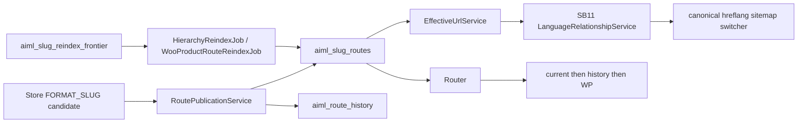

# MSEO.5 — Program Hardening, Acceptance, Release & Dogfood — Implementation Plan

**Status:** **Architecture Frozen** — authoritative specification for MSEO.5 implementation  
**Milestone:** MSEO.5 — Program Hardening, Acceptance, Release & Dogfood  
**Parent:** [MSEO_PARENT_IMPLEMENTATION_PLAN.md](MSEO_PARENT_IMPLEMENTATION_PLAN.md)  
**ADR:** [0023-localized-url-overlay-architecture.md](../adr/0023-localized-url-overlay-architecture.md) (**Accepted**)  
**External review:** **FREEZE** (A1–A12)  
**STATE:** B · **TARGET 8** (no migration) · **Release version target:** 1.5.0  
**Planning materialization:** docs-only on `main`  
**Implementation branch:** `feature/mseo5-program-hardening-acceptance` (create after freeze push)  
**Baseline:** `main` @ `667f3d1c31c3037ffdf99765198a2672f63855e4`  
**Depends on:** MSEO.0–MSEO.4 COMPLETE; ADR-0023 Accepted  

**This document is the authoritative implementation specification for MSEO.5.**  
There is no formal MSEO.6 milestone. MSEO.5 closes the MSEO program.  
PRODUCTION DEPLOYMENT is not authorized by this plan.

**Matrices:** M5R1–M5R36 · M5AC1–M5AC42 · MSEO5.0–MSEO5.6  
**Gates:** A (implementation) · B (release prep) · C (tag+GH Release) · D (DEV DOGFOOD)

---

---

## Amendment report (A1–A12)

| ID | Result | Notes |
|---|---|---|
| **A1** | **Incorporated** | Removed all `MSEO.6` / alias language. Formal: ladder ends at MSEO.5; backlog = POST-MSEO DEFERRED / UNSUPPORTED BACKLOG |
| **A2** | **Incorporated** | Gates A–D frozen; implementation auth alone cannot tag or dogfood |
| **A3** | **Incorporated** | Removed MSEO5.2 SEO-seam escape hatch; A/B/C consumer classification; Case C → STOP/re-plan |
| **A4** | **Incorporated** | M5R27 → characterization outcomes `VERIFIED_EXISTING` \| `DEFECT_REQUIRES_PLAN_AMENDMENT` |
| **A5** | **Incorporated** | Deterministic release/tag/main-CI sequence (feature → prep → tag → dogfood) |
| **A6** | **Incorporated** | Published-asset dogfood identity (SHA-256, size, entry count, audit); git/local ZIP rejected |
| **A7** | **Incorporated** | Strategy F preflight (`aiml_rollout_config` fields) before Gutenberg overlay judgments |
| **A8** | **Incorporated** | Mandatory restore of `/opt/biopentra/dev/ai-multilingual` mount after dogfood |
| **A9** | **Incorporated** | `DEV DOGFOOD DEPLOYMENT` vs `PRODUCTION DEPLOYMENT` terminology |
| **A10** | **Incorporated** | PluginGuard = architecture/code only; retire MSEO.4 ROADMAP/`MSEO5_CLOSURE` workflow asserts at closeout |
| **A11** | **Incorporated — verdict A** | Hierarchical parent-path localization already Supported by MSEO.3 (`HierarchyPathBuilder` OPTION B / ancestor leaves). Removed obsolete parent §9 “Translated parent path components” from Post-MSEO backlog |
| **A12** | **Incorporated** | Precise COMPLETE terminology: functional hardened ≠ MSEO.5 complete ≠ program complete until Gate D + closure |

---

## Starting repository HEAD

| Check | Result |
|---|---|
| Repo | `/opt/biopentra/dev/ai-multilingual` (`magpern/ai-multilingual`) |
| `main` / `origin/main` | `667f3d1c31c3037ffdf99765198a2672f63855e4` |
| Working tree | Clean |
| Version | **1.4.0** |
| `Migrator::TARGET` | **8** |
| STATE | **B** |
| ADR-0023 | **Accepted** |
| MSEO.0–MSEO.4 | **COMPLETE** |
| MSEO.5 | **NOT STARTED** |

**Frozen statement (A1):** There is no formal MSEO.6 milestone in the authoritative MSEO roadmap. MSEO.5 closes the MSEO program. Any future work selected from the backlog requires a new separately planned program or milestone.

---

## MSEO.5 SCOPE RECONCILIATION

### 1. Parent-plan definition

[MSEO_PARENT_IMPLEMENTATION_PLAN.md](docs/plans/MSEO_PARENT_IMPLEMENTATION_PLAN.md) §6:

| Milestone | Delivers |
|---|---|
| **MSEO.5** | PluginGuard, browser acceptance, release, dogfood |

**Exact title:** **MSEO.5 — Program Hardening, Acceptance, Release & Dogfood**

**Objective:** Close the MSEO program by consolidating architectural guards and acceptance evidence, shipping **v1.5.0** under explicit release gates, and performing **DEV DOGFOOD DEPLOYMENT** of the published release asset — without new routing/SEO capabilities.

### 2. Repository reality

- Functional stack complete on main (MSEO.0–4).
- Per-milestone PluginGuard exists; program-level closeout guard does not.
- `test_mseo4_*` still asserts ROADMAP “MSEO.5 NOT STARTED” and absence of `MSEO5_CLOSURE.md` (doc-workflow brittle — retire at Gate A closeout hardening per A10).
- Version **1.4.0**; TARGET **8**; no MSEO release tag yet.
- Parent MSEO1–74 / MAC1–34 row archive never materialized (count stubs only).

### 3. Already delivered — do not redo

All admitted URL/routing/SEO/hierarchy/Woo `%product_cat%` authorities from MSEO.0–4.

### 4. Remaining MSEO.5 work

1. Characterization (consumers A/B/C; debt dispositions)  
2. Program PluginGuard (architecture invariants; retire brittle doc asserts)  
3. Regression hardening (**tests/docs only** unless Case B fix already mechanically specified — none are)  
4. Browser acceptance harness/checklist (local/non-CI)  
5. Release preparation → tag → published ZIP (Gates B–C)  
6. Published-asset DEV DOGFOOD DEPLOYMENT + mount restore + program closure (Gate D)

### 5. POST-MSEO DEFERRED / UNSUPPORTED BACKLOG

See dedicated section below. Not part of MSEO.5. Not a milestone.

### 6–7. Obsolete assumptions / evidence-driven scope

- MSEO.5 is program closeout, not first PluginGuard/browser appearance.  
- Version bumps only under Gate B.  
- Parent §9 “Translated parent path components” **obsolete** — superseded by MSEO.3 Supported hierarchy (A11 verdict A).  
- No conditional production SEO seams in closeout (A3).

---

## Authorization gates (A2) — frozen

A later prompt may authorize several or all gates together by **explicit wording**. Absent such wording, each gate stops independently.

| Gate | Covers | Requires | Must NOT imply |
|---|---|---|---|
| **A — IMPLEMENTATION** | MSEO5.0–MSEO5.3 | Plan frozen + explicit implementation authorization | Tag, GH Release, DEV DOGFOOD, PRODUCTION DEPLOYMENT, version bump |
| **B — RELEASE PREPARATION** | MSEO5.4 | Explicit release-preparation authorization (or a prompt that explicitly grants Gate B) | Tag, GH Release, dogfood |
| **C — TAG + GITHUB RELEASE** | MSEO5.5 | Explicit release authorization | DEV DOGFOOD, PRODUCTION DEPLOYMENT |
| **D — DEV DOGFOOD** | MSEO5.6 | Explicit DEV DOGFOOD DEPLOYMENT authorization | PRODUCTION DEPLOYMENT |

**PRODUCTION DEPLOYMENT** (production biopentra.eu) is **never** authorized by any MSEO.5 gate. It requires a completely separate production-deployment authorization outside this program.

---

## Program COMPLETE vs milestone COMPLETE (A12)

| After | Status |
|---|---|
| MSEO5.0–5.3 accepted + feature merged | **MSEO FUNCTIONAL IMPLEMENTATION HARDENED / ACCEPTED**. MSEO.5 **NOT COMPLETE**. MSEO program **NOT** formally closed. |
| Authorized MSEO5.4–5.5 (v1.5.0 published) | **v1.5.0 RELEASED**. MSEO.5 remains **open** until Gate D + closure if parent scope requires dogfood (it does). |
| Authorized MSEO5.6 PASS + closure docs | **MSEO.5 COMPLETE** and **MSEO PROGRAM COMPLETE**. |
| Dogfood finds blocking Supported-contract defect | Do **not** mark program COMPLETE; classify; remediate / re-review / re-freeze as needed. |

---

## Release ordering (A5) — deterministic

Equivalent to v1.4.0 convention (feature merge → separate release preparation → tag on main):

1. MSEO5.0–5.3 on implementation branch (Gate A)  
2. Full validation (unit / integration / PHPCS / ZIP build)  
3. Independent implementation review  
4. Feature PR  
5. Feature CI green  
6. Merge feature to `main`  
7. Fresh `main` CI green  
8. Release preparation branch from **current `main`** (Gate B)  
9. Version **1.4.0 → 1.5.0** + release docs  
10. Release-preparation review  
11. Release PR + CI green  
12. Merge release preparation to `main`  
13. Fresh `main` CI green  
14. Identify **exact release commit** on `main`  
15. Create **annotated** tag `v1.5.0` on that exact commit (Gate C)  
16. Push tag  
17. Release workflow green  
18. GitHub Release published  
19. Independently verify published ZIP (SHA-256, size, entry count, audit)  
20. Only then begin authorized Gate D dogfood  

**Never tag:** a feature branch, an unmerged SHA, or a commit lacking required green CI.

---

## Current MSEO architecture (extend, do not fork)

Authorities retained (invariants 1–19 from parent/MSEO.0–4). Invariant 20 amended: **MSEO.5 must not absorb POST-MSEO DEFERRED / UNSUPPORTED BACKLOG.**

---

## Design verdicts

| Topic | Verdict |
|---|---|
| URL / recognition / generation / history / collision / eligibility / admission / invalidation / performance / concurrency / failure taxonomy / admin | **Unchanged** — retain MSEO.0–4; no new surface |
| Route state / TARGET | **TARGET 8 sufficient**; no migration |
| SEO consumers (A3/A4) | MSEO5.0 classifies each investigated consumer **A / B / C**. Case A: regression only. Case B: STOP unless fix already mechanically frozen (none are). Case C: STOP MSEO.5; report; amend/re-freeze. **No speculative hooks. No MSEO5.2 production seams.** |
| ADR | **0023 sufficient** |
| Release version | **1.5.0** (Gate B only) |

### Hierarchy parent-path (A11) — exact verdict

**Verdict A.** Parent-path localization for hierarchical pages/terms is **already Supported by MSEO.3**:

- Plan: OPTION B full localized hierarchy; `HierarchyPathBuilder` sole authority (M3R1, M3R38).  
- Evidence: `localized_path_for_post` / ancestor leaves; `substitute_term_ancestor_leaves`; M3AC9 PASS.  
- Closure: HierarchyPathBuilder sole authority.

**Remove** obsolete parent §9 bullet “Translated parent path components” from Post-MSEO backlog (it duplicates shipped MSEO.3 capability and confuses rewrite-base deferrals).

Remaining distinct deferrals that must **not** be confused with this: **translated rewrite bases** (e.g. `/produkt/`, `/product-category/` machine bases) — still Deferred.

---

## SEO consumer investigation contract (A3/A4)

For breadcrumb, Schema Product/BreadcrumbList, and any other independent URL consumer:

| Case | Meaning | MSEO.5 action |
|---|---|---|
| **A** | Existing architecture correct (EffectiveUrl/SB11/home_url/term_link) | Characterization + regression evidence only |
| **B** | Supported-contract defect fixable without new URL ownership/capability/state | Propose fix; **STOP** before implementing unless frozen plan already mechanically specifies the fix (**none specified**) |
| **C** | Needs new URL surface, hook authority, persistence, routing capability, or material architecture change | **STOP** MSEO.5 implementation; report; amend/re-review/re-freeze |

**Expected M5R27 closure values:** `VERIFIED_EXISTING` or `DEFECT_REQUIRES_PLAN_AMENDMENT` (not Partial→Supported).

---

## Schema / ADR

| Item | Verdict |
|---|---|
| STATE | **B** |
| Starting TARGET | **8** |
| Required TARGET | **8** |
| Migration | **None** |
| ADR | **ADR-0023 sufficient — no new ADR** |
| Release version | **1.5.0** under Gate B |

---

## M5R requirement matrix (M5R1–M5R36)

| ID | Statement | Class | Authority | Validation |
|---|---|---|---|---|
| M5R1 | No new routing/SEO URL capability beyond MSEO.0–4 admitted set | Supported | Plan boundary | Diff review + PluginGuard |
| M5R2 | EffectiveUrlService sole outbound effective-URL authority | Supported | EffectiveUrlService | PluginGuard + SEO tests |
| M5R3 | Router sole inbound localized recognition authority | Supported | Router | Integration regression |
| M5R4 | Candidate ≠ active route | Supported | Store / RoutePublicationService | Mseo1/2 regression |
| M5R5 | FORMAT_SLUG excluded from Jobs/provider auto-translate | Supported | Jobs / PublicationService | PluginGuard |
| M5R6 | No `post_name` / term `slug` mutation | Supported | RoutePublicationService | PluginGuard |
| M5R7 | No rewrite registration/flush | Supported | Plugin / Router | PluginGuard |
| M5R8 | No unbounded frontend Store/catalog/history scans | Supported | Router / jobs | PluginGuard |
| M5R9 | History direct-to-current; no chains/loops | Supported | Router / history | Routing tests |
| M5R10 | Capability implemented ≠ admitted; epoch atomic | Supported | RoutingCapabilityAdmission | Capability tests |
| M5R11 | ObjectLanguagePublicEligibility remains discoverability gate | Supported | Eligibility + SB11 | SEO tests |
| M5R12 | Endpoint denylist intact | Supported | Router | Integration |
| M5R13 | Sitemap Model A only | Supported | RankMathSitemapOverlay | SEO tests |
| M5R14 | Preview remains source-slug | Supported | PreviewService | Regression |
| M5R15 | TARGET remains 8; no `step_9_` | Supported | Migrator | PluginGuard |
| M5R16 | Version bumps to 1.5.0 only under Gate B | Supported | Version sources | Release audit |
| M5R17 | Program PluginGuard positive architecture invariants | Supported | PluginGuardTest | `test_mseo5_program_boundaries` |
| M5R18 | PluginGuard negatives for Deferred/Unsupported production leakage | Supported | PluginGuardTest | Forbidden symbols/hooks/migrations |
| M5R19 | PluginGuard does not depend on ROADMAP prose / closure-file workflow | Supported | PluginGuardTest | A10 retire/replace |
| M5R20 | Authoritative browser acceptance local/non-CI | Supported | `acceptance/mseo-browser/` | Checklist |
| M5R21 | CI remains PHPUnit/PHPCS/ZIP authoritative | Supported | CI | Green CI |
| M5R22 | Release docs under Gate B | Supported | `docs/releases/` | Review |
| M5R23 | Annotated `v1.5.0` on exact green main commit under Gate C | Supported | git + release.yml | A5 sequence |
| M5R24 | Published ZIP independently verified before dogfood | Supported | audit-zip + SHA-256 | A6 |
| M5R25 | DEV DOGFOOD DEPLOYMENT uses only published GH Release asset | Supported | Gate D ops | Dogfood report |
| M5R26 | Strategy F preflight recorded before Gutenberg overlay judgments | Supported | Dogfood procedure | A7 |
| M5R27 | Breadcrumb/schema/other consumers characterized; closure `VERIFIED_EXISTING` or `DEFECT_REQUIRES_PLAN_AMENDMENT` | Supported | MSEO5.0 log | A4 |
| M5R28 | No Case C / unspecified Case B production implementation in MSEO.5 | Supported | Plan boundary | Diff review |
| M5R29 | Canonical dev mount restored after dogfood | Supported | compose mounts | A8 |
| M5R30 | PRODUCTION DEPLOYMENT prohibited under MSEO.5 | Supported | Boundary | Closure statement |
| M5R31 | Authorization gates A–D independent unless explicitly combined | Supported | Plan / prompts | Gate audit |
| M5R32 | POST-MSEO backlog carried forward; no backlog production code | Supported | Closure docs | Evidence |
| M5R33 | Hierarchical ancestor-leaf localization treated as already Supported (MSEO.3) | Supported | HierarchyPathBuilder | A11 |
| M5R34 | After 5.0–5.3 only: functional hardened — not program COMPLETE | Supported | A12 | Status docs |
| M5R35 | Program COMPLETE only after Gate D PASS + closure | Supported | A12 | Closure |
| M5R36 | Blocking Supported-contract dogfood defect blocks COMPLETE | Supported | A12 | Dogfood triage |

---

## M5AC acceptance criteria (M5AC1–M5AC42)

| ID | Criterion |
|---|---|
| M5AC1 | Feature branch from reconciled main; clean start |
| M5AC2 | Gate A changes limited to tests/docs/acceptance harness (+ PluginGuard); no new URL capability |
| M5AC3 | Unit green |
| M5AC4 | Integration green including Mseo* + PluginGuard |
| M5AC5 | PHPCS green |
| M5AC6 | Build/ZIP audit green on feature CI |
| M5AC7 | `Migrator::TARGET === 8`; no new migration |
| M5AC8 | `test_mseo5_program_boundaries` PASS (architecture positives) |
| M5AC9 | PluginGuard forbids rewrite, slug mutation, provider slug gen, `step_9_`, competing URL authorities |
| M5AC10 | PluginGuard forbids production symbols for translated bases / endpoint localization / variation routes / layered-nav |
| M5AC11 | Brittle MSEO.4 ROADMAP/`MSEO5_CLOSURE` workflow asserts retired or replaced (A10) |
| M5AC12 | Cross-milestone regression pack PASS |
| M5AC13 | Activation state machine regression PASS |
| M5AC14 | CURRENT_LOCALIZED / history / source-slug redirect regressions PASS |
| M5AC15 | EffectiveUrl fail-closed regressions PASS |
| M5AC16 | Canonical/hreflang/switcher/sitemap SB11 agreement PASS |
| M5AC17 | Woo `%product_cat%` admitted-path regression PASS (or documented harness skip as test debt) |
| M5AC18 | Frontier ≤100/tick + typed isolation PASS |
| M5AC19 | No unpublished/stale/private/draft leakage via EffectiveUrl/SEO |
| M5AC20 | Admin mutations retain caps/nonces |
| M5AC21 | Browser checklist recorded (local/non-CI) |
| M5AC22 | MSEO5.0 consumer log exists; each consumer A/B/C; M5R27 closed with allowed outcome only |
| M5AC23 | No new SEO hook/URL seam landed under Gate A without prior plan amendment FREEZE |
| M5AC24 | Feature merged; fresh main CI green before Gate B |
| M5AC25 | Gate B: version decision 1.5.0 + all version sources consistent |
| M5AC26 | Gate B: release scope/notes/prep review PASS; release PR CI green; merge; fresh main CI green |
| M5AC27 | Gate C: annotated `v1.5.0` on exact main release commit only (not feature/unmerged/no-CI) |
| M5AC28 | Gate C: release workflow green; GH Release published |
| M5AC29 | Published asset identity recorded: SHA-256, byte size, archive entry count, audit PASS |
| M5AC30 | Gate D begins only after M5AC29 |
| M5AC31 | Dogfood installs **only** published `ai-multilingual-1.5.0.zip` (not git/feature/local ZIP) |
| M5AC32 | Installed plugin reports 1.5.0; `aiml_db_version` remains 8; no migration |
| M5AC33 | Strategy F preflight fields recorded; overlay failures classified product vs rollout denial |
| M5AC34 | After dogfood: restore mount `/opt/biopentra/dev/ai-multilingual`; HTTP 200; plugin active; expected version; db_version 8; no AIML fatal |
| M5AC35 | Dogfood report preserves checksum/size/entries + dogfood mount + restored mount evidence |
| M5AC36 | PRODUCTION DEPLOYMENT not performed |
| M5AC37 | Status language matches A12 at each phase |
| M5AC38 | ROADMAP + PRODUCT_PRIORITIES mark MSEO PROGRAM COMPLETE only after Gate D PASS |
| M5AC39 | `MSEO5_CLOSURE.md` + evidence committed |
| M5AC40 | POST-MSEO DEFERRED / UNSUPPORTED BACKLOG listed without inventing MSEO.6 |
| M5AC41 | Hierarchy parent-path not listed as Deferred (A11 verdict A) |
| M5AC42 | “Implement MSEO.5” without Gate B/C/D wording did not tag, release, or dogfood |

---

## Work-package ladder (MSEO5.0–MSEO5.6)

### MSEO5.0 — Characterization (Gate A)

- **Objective:** Baseline SHA; authority inventory; SEO consumer A/B/C classification; debt dispositions; confirm TARGET/ADR.  
- **Allowed:** Characterization notes / baseline docs (after materialization); test discovery.  
- **Forbidden:** Production code; version bump; SEO hooks; backlog features; tag/dogfood.  
- **Validation:** Consumer log with A/B/C + M5R27 provisional outcomes.  
- **Stop:** Any Case C (or unspecified Case B needing a fix) → STOP for plan amendment.

### MSEO5.1 — Program PluginGuard (Gate A)

- **Objective:** Architecture positive/negative invariants; retire brittle doc-workflow asserts in `test_mseo4_*`.  
- **Allowed:** `PluginGuardTest.php` (+ related test-only allowlists).  
- **Forbidden:** Production feature code; ROADMAP-dependent architecture truth; version bump.  
- **Validation:** PluginGuard green.  
- **Stop:** Guards that encode temporary planning prose.

### MSEO5.2 — Regression hardening (Gate A)

- **Objective:** Automated regression pack for MSEO.0–4 critical paths; document harness/1k test debt.  
- **Allowed:** Tests; non-behavioral docs; characterization evidence.  
- **Forbidden:** New product architecture; new SEO hooks; Case B/C production fixes; backlog features; version bump.  
- **Validation:** M5AC12–M5AC20.  
- **Stop:** Discovery of Case B/C defect → report; do not silently fix.

### MSEO5.3 — Browser acceptance harness (Gate A)

- **Objective:** `acceptance/mseo-browser/` checklist (+ optional local Playwright).  
- **Allowed:** Acceptance harness/README/checklist under acceptance/.  
- **Forbidden:** Making Playwright a CI gate; production code; version bump.  
- **Validation:** Checklist executed/recorded.  
- **Stop:** End of Gate A — merge feature only after review/CI; **MSEO.5 not complete**.

### MSEO5.4 — Release preparation (Gate B)

- **Objective:** 1.4.0 → 1.5.0; release scope/notes/prep docs; prep PR from current main.  
- **Allowed:** Version sources; `docs/releases/*`; roadmap status drafts that do **not** claim PROGRAM COMPLETE early.  
- **Forbidden:** Tag; GH Release; dogfood; PRODUCTION DEPLOYMENT; backlog features.  
- **Validation:** Prep review + CI; merge; fresh main CI.  
- **Stop:** No tag without Gate C.

### MSEO5.5 — Tag + GitHub Release (Gate C)

- **Objective:** Annotated `v1.5.0` on exact green main commit; publish audited ZIP.  
- **Allowed:** Tag push; release workflow; independent ZIP verify.  
- **Forbidden:** Tagging feature/unmerged SHA; dogfood before asset verify; PRODUCTION DEPLOYMENT.  
- **Validation:** M5AC27–M5AC29.  
- **Stop:** **v1.5.0 RELEASED**; MSEO.5 still open pending Gate D.

### MSEO5.6 — DEV DOGFOOD + program closure (Gate D)

- **Objective:** Published-asset dogfood; Strategy F preflight; mount restore; closure docs; PROGRAM COMPLETE.  
- **Allowed:** Temporary DEV DOGFOOD DEPLOYMENT of published ZIP; validation report; closure docs after PASS.  
- **Forbidden:** Dogfood from git/feature/local ZIP; leaving accept extract mounted; PRODUCTION DEPLOYMENT; marking COMPLETE on blocking defect.  
- **Validation:** M5AC30–M5AC41.  
- **Stop:** **MSEO.5 COMPLETE** + **MSEO PROGRAM COMPLETE**.

---

## PluginGuard plan (A10)

**Enforce (code/architecture):** EffectiveUrl/Router/PathCanonicalizer ownership; eligibility; admission epoch/fingerprint; frontier bounds; Model A; history one-hop; FORMAT_SLUG exclusion; no rewrite; no source-slug mutation; no provider slug gen; no `step_9_`; no competing route authorities; no production backlog feature symbols.

**Do not enforce as architecture truth:** ROADMAP “NOT STARTED” prose; existence/absence of `MSEO5_CLOSURE.md`; absence of a documentation heading named MSEO.6.

**Closeout action:** In MSEO5.1, remove from `test_mseo4_woo_product_permalink_boundaries` the block asserting `MSEO5_CLOSURE.md` absence and ROADMAP NOT STARTED. Replace program-status verification with **closure/release audit** (docs review), not PluginGuard.

Documentation/status verification belongs in MSEO5.4–5.6 audits.

---

## Published-asset dogfood identity (A6) + Strategy F (A7) + mount restore (A8)

**Dogfood must:**

1. Obtain exact `ai-multilingual-1.5.0.zip` from published GitHub Release  
2. Independently compute SHA-256  
3. Record asset size  
4. Record archive entry count  
5. Run ZIP/release audit  
6. Install/extract that exact asset on dev  
7. Verify plugin reports 1.5.0  
8. Verify `aiml_db_version` remains 8  
9. Verify no migration  
10. Preserve checksum/evidence in dogfood report  

**Reject as dogfood identity:** git checkout, feature branch, locally built ZIP.

**Strategy F preflight (before Gutenberg overlay judgments):** record `aiml_rollout_config`, `rollout_render_enabled`, `general_rollout_enabled`, `allowed_post_ids`, `rollout_stage`. Distinguish product defect vs expected rollout denial. Do not alter rollout policy merely to pass a test without recording the change.

**Mount restore (mandatory before closure):**

- Canonical path: `/opt/biopentra/dev/ai-multilingual`  
- After dogfood: restore canonical mount; verify HTTP 200; plugin active; expected version; `aiml_db_version = 8`; no AIML fatal; keep acceptance ZIP/evidence separate  
- Document both dogfood mount and restored canonical mount  

---

## Deployment terminology (A9)

| Term | Meaning |
|---|---|
| **DEV DOGFOOD DEPLOYMENT** | Temporary/controlled deployment to **dev.biopentra.eu** using published release asset; Gate D only |
| **PRODUCTION DEPLOYMENT** | Deployment to production **biopentra.eu**; **NOT part of MSEO.5** |

Do not say “deployment out of scope” without distinguishing these.

---

## POST-MSEO DEFERRED / UNSUPPORTED BACKLOG

**Deferred (remain Deferred):**

- Translated rewrite bases (`/sv/produkt/`, `/sv/product-category/`, etc.)  
- Woo endpoint names (cart, checkout, my-account)  
- Attachment slugs; author/date/search archives  
- Product variations as distinct routes; `nav_menu_item` slugs  
- Custom CPTs / taxonomies; multisite; headless  
- Localized-slug preview URLs  
- SE11 `SitemapDiscovery`; Extension API v1.1 URL observation  
- Path reservation release admin tool  
- Pretty layered-nav (MSEO.4 shape J)

**Unsupported (remain Unsupported):**

- Mutating `post_name` / term `slug`  
- Runtime rewrite registration / flush  
- Store full-table scans on frontend requests  
- Fuzzy URL matching; provider slug generation  
- Competing sitemap XML generator  
- Per-language localized URL policy matrix (v1)

**Removed from backlog (A11):** “Translated parent path components” — already Supported by MSEO.3 hierarchical ancestor-leaf localization.

**Test debt (not product backlog):** pretty `%product_cat%` harness skip; full 1k CI fixture (algorithmic proof already accepted).

**Proof MSEO.5 needs none of the above:** Parent §6 assigns only hardening/release/dogfood; functional admitted set already on main; TARGET 8 / ADR-0023 sufficient.

---

## MSEO.4 carry-forward debt

| Debt | Disposition |
|---|---|
| Pretty `%product_cat%` harness | Test debt — document; non-blocking |
| 1k scale structural proof | Already satisfied |
| Translated Woo bases | Deferred (Post-MSEO) |
| Variation routes | Unsupported as distinct routes |
| Pretty layered-nav | Deferred (Post-MSEO) |

---

## Failure / race matrix (closeout-relevant)

Unchanged operational matrix from prior plan for activation/rematerialize/fingerprint/collision/disable/per-object/systemic failures, plus:

| Trigger | Expected | Persist | Visitor | Operator | Retry |
|---|---|---|---|---|---|
| Dogfood ZIP checksum mismatch | Abort Gate D | n/a | n/a | FAIL | Re-fetch published asset |
| Strategy F deny on fixture | Classify as rollout denial | unchanged | source blocks | preflight evidence | Admit fixture or document |
| Dev left on accept extract | Closure blocked | mount wrong | may serve ZIP build | restore required | Restore + re-verify |
| Gate A prompt used to tag | Reject / do not tag | n/a | n/a | Gate C required | Explicit Gate C auth |

---

## Security / privacy

Unchanged: no leakage of unpublished/stale/private/draft/restricted Woo; no secrets in dogfood report; caps/nonces retained.

---

## STOP / freeze audit (re-run)

| # | Question | Answer |
|---|---|---|
| 1 | Unresolved OR/TBD? | **No** |
| 2 | Unknown ownership? | **No** |
| 3 | Speculative upstream hook? | **No** — Case C/B stop rules |
| 4 | Unexplained persistent state? | **No** — TARGET 8 |
| 5 | Unbounded operation? | **No** |
| 6–7 | Ambiguous collision/redirect? | **No** |
| 8 | Unclear admission boundary? | **No** |
| 9 | SEO independent builders? | Characterized A/B/C; no silent seams |
| 10 | Post-MSEO leakage into MSEO.5? | Explicitly excluded |
| 11 | TARGET 8 insufficient? | **No** |
| 12 | ADR-0023 insufficient? | **No** |
| **A1** | Can “implement MSEO.5” authorize a tag? | **No** — Gate C required |
| **A2** | Can “implement MSEO.5” authorize DEV DOGFOOD? | **No** — Gate D required |
| **A3** | Can MSEO5.2 silently add SEO hook? | **No** — forbidden; Case C/B stop |
| **A4** | Can rollout-denied Gutenberg be misclassified? | **No** — Strategy F preflight required |
| **A5** | Can dogfood test local build? | **No** — published asset identity only |
| **A6** | Can dev remain on release extract? | **No** — mandatory restore before closure |
| **A7** | Backlog duplicates MSEO.3 hierarchy? | **No** — removed (verdict A) |
| **A8** | PluginGuard depends on temp docs wording? | **No** — A10 retires those asserts |
| **A9** | Release/tag/main-CI sequence deterministic? | **Yes** — A5 |
| **A10** | PRODUCTION DEPLOYMENT prohibited? | **Yes** — explicit |

---

## Final summary

| Field | Value |
|---|---|
| Starting HEAD | `667f3d1c31c3037ffdf99765198a2672f63855e4` |
| Title | Program Hardening, Acceptance, Release & Dogfood |
| M5R count | **36** |
| M5AC count | **42** |
| WP ladder | **MSEO5.0–MSEO5.6** |
| STATE | **B** |
| TARGET | **8** |
| Schema | **No migration** |
| ADR | **0023 sufficient** |
| Release version | **1.5.0** (Gate B) |
| Authorization gates | **A/B/C/D frozen** |
| Post-MSEO backlog | Deferred/Unsupported list; **no MSEO.6** |
| Hierarchy parent-path | **Verdict A — already Supported (MSEO.3)** |
| STOP audit | **PASS** |

**Exact next step:** Create `feature/mseo5-program-hardening-acceptance` from freeze SHA and implement MSEO5.0–MSEO5.3 (Gate A). Gates B–D require explicit authorization (this implementation task may grant them when authorized). Do not perform PRODUCTION DEPLOYMENT.

---

## Plan verdict

**MSEO.5 PLAN REVIEW: FREEZE** (materialized)
