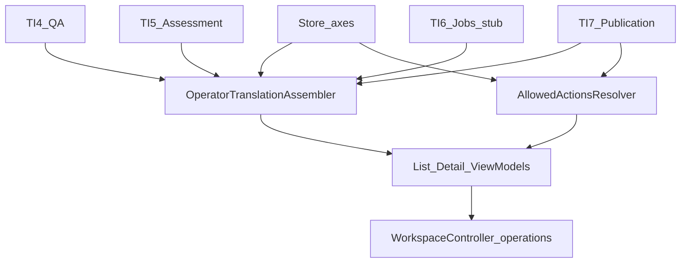

# OTL.0 — Foundations — Implementation Plan

**Status:** **Complete** on `main` (merge `13e68f9d51ca5a4a0a8704ed048cf51e3eec3d3a`; independent review PASS)
**Milestone:** OTL.0 — Foundations (Operator Translation Lifecycle program)
**Kind:** Milestone implementation plan (authoritative on `main`)
**Parent:** [OTL_PARENT_IMPLEMENTATION_PLAN.md](OTL_PARENT_IMPLEMENTATION_PLAN.md)
**Prerequisites:** OTL parent **Architecture Frozen** on `main`; TIQ **Complete** (TQ.0–TI.7); AI Multilingual **v1.2.0**; `Migrator::TARGET` **7**
**Schema:** Migrator `TARGET` = **7** (unchanged — no migration)
**ADR:** **No new ADR.** STOP if implementation requires durable composite operator state, new role/permission architecture, public Integration API change, schema/index migration, or TIQ ownership change.
**Planning branch:** `docs/otl0-foundations-planning-freeze` (merged)
**Freeze merge:** `main` @ `9b922222564da4f3294e36188de992c1384c630c` (`merge: freeze OTL.0 Foundations implementation plan`)
**Independent review (planning):** **PASS**
**Implementation branch:** `feature/otl0-foundations` (merged)
**Independent review (implementation):** **PASS**
**Validation:** [OTL0_FOUNDATIONS_VALIDATION_LOG.md](OTL0_FOUNDATIONS_VALIDATION_LOG.md)
**Next:** OTL.2 Unified Detail + Edit/Review — **planning only**. Do **not** implement OTL.2 until its plan is independently reviewed and frozen on `main`. Do **not** start TSC under OTL.
**Related (unchanged ownership):** [ADR-0015](../adr/0015-review-workflow-and-tm-approval-policy.md); [ADR-0019](../adr/0019-evidence-based-risk-assessment.md); [ADR-0020](../adr/0020-controlled-auto-publication-and-frontend-gate.md); TI.4 QA; TI.5 Assessment; TI.6 Jobs; TI.7 Publication

**Operational success:** Later OTL UI milestones can consume one computed operator read model, server-computed `allowed_actions`, and additive list/detail admin REST without inventing a second translator, Store, QA engine, assessment policy, publication policy, or Jobs engine — and without schema change.

**Hard boundary:** OTL.0 is **backend/application foundation only**. It does **not** ship Operations UI, unified detail UI, bulk workflows, attention UX, Playwright product acceptance, rich Jobs linkage, or Translation Surface Coverage.

---

## 1. Executive summary

OTL.0 establishes the foundation for the Operator Translation Lifecycle:

1. One **computed, non-persisted** operator translation read model
2. Capability-aware server-computed **`allowed_actions`** (UI admission only — not mutation authority)
3. Additive language-scoped paginated **Operations list** REST
4. Additive **translation detail** REST
5. Store **query/filter primitives** for OTL.1
6. Stable list/detail **ViewModel** contracts

```text
Store / review state
TI.4 QA
TI.5 Assessment
TI.7 PublicationPolicy / PublicationService
TI.6 Jobs (stub only in OTL.0)
        ↓
OperatorTranslationAssembler
AllowedActionsResolver   (read-only UI admission)
        ↓
Operator list/detail ViewModels
        ↓
additive Workspace admin REST (aiml/v1)
```



---

## 2. Authoritative parent contract (OTL.0)

| Axis | Frozen meaning |
|---|---|
| **Official name** | OTL.0 — Foundations |
| **Objective** | Computed read model + `allowed_actions` + list/detail REST contracts |
| **Dependencies** | OTL parent frozen; TIQ Complete; TARGET 7 |
| **Outputs** | Application assemblers, Store queries, ViewModels, additive GET routes, tests |
| **Does not** | Operations UI; unified detail UI; bulk; attention UX; Playwright product suite; rich Jobs linkage; TSC |
| **→ OTL.1** | List query + list ViewModel + axis filter/count primitives |
| **→ OTL.2** | Detail ViewModel + full actions/assessment/explain |
| **STOP** | Persisted composite state; new permissions; Integration API; schema without review; ownership violation |

---

## 3. Preconditions (verified at plan authoring)

| Precondition | Status |
|---|---|
| `main == origin/main` @ `068a5a29183fb59d0b967eff95f27d908c21a9cf` | **Pass** |
| Working tree clean at branch creation | **Pass** |
| Plugin version **1.2.0** | **Pass** |
| `Migrator::TARGET` = **7** | **Pass** |
| TIQ Complete; OTL parent Architecture Frozen | **Pass** |
| No `docs/plans/OTL0_FOUNDATIONS_IMPLEMENTATION_PLAN.md` yet | **Pass** |
| No `feature/otl0-foundations` | **Pass** |
| Latest main CI green | **Pass** |

If any precondition regresses before coding: **STOP**.

---

## 4. Current foundation facts (evidence)

| Fact | Evidence |
|---|---|
| No Operations list / translation-by-id GET | `WorkspaceController` — posts, review-queue, post-scoped segments only |
| Segment VMs already have publish/stale/QA/assessment | `WorkspaceSegmentViewModel` + `WorkspaceService::attach_meta` |
| Review-queue omits publish/stale/assessment | `ReviewQueueItemSerializer` |
| Existing VMs intentionally omit `translation_id` | Workspace REST tests lock omission |
| Language-leading indexes exist | `lang_status`, `lang_review_queue`, `lang_publish_status`, `stale_sweep` |
| Only `query_review_queue` paginated Store list today | `Store::REVIEW_QUEUE_MAX_PER_PAGE = 50` |
| Assessment always runs DeterministicQA | `AssessmentAssembler::assess` |
| `attach_meta` duplicates DeterministicQA | QAEngine + AssessmentAssembler per segment |
| Publication explain always assesses | `PublicationService::evaluate_row` |
| Jobs items lack `translation_id` reverse lookup | `Schema::create_job_items` |

---

## 5. Milestone objective

Establish the **backend/application foundation** for later OTL operator UX through the six deliverables in §1.

**Out of scope:** Operations UI; unified detail UI; bulk; final attention queue UX; Playwright product acceptance; rich Jobs linkage; Settings publication form UI; TSC; Integration API; version/TARGET bump.

---

## 6. Architecture ownership

### OTL.0 may

- Compose Store rows into operator read models
- Resolve **UI admission** `allowed_actions` from observed state ∩ capabilities (read-only)
- Call TI.4 / TI.5 / TI.7 / ReviewWorkflowService for **detail presentation**
- Add Store query methods and PK lookup
- Add thin Workspace REST GET routes + ViewModels

### OTL.0 must NOT create

- Second TranslationService / QA engine / Assessment policy / Publication policy / Store / Jobs engine
- Persisted composite `operator_status`
- Generic action command bus
- Mutation endpoints that trust client `allowed_actions`
- Integration API v2

---

## 7. Operator read model

One **computed, non-persisted** model aggregating existing truth.

Conceptual fields:

- `translation_id`
- composite identity (`source_type`, `source_id`, `language_id`, `segment_key`, `field_key`)
- source object/type
- source/target language
- source/target preview (list) or full authorized text (detail)
- provenance `status`
- `review_status`
- `publish_status`
- `is_stale`
- QA / TI.5 / TI.7 evidence (**detail**; not default list)
- timestamps / on-row actors
- bounded provenance/TM (Partial on detail)
- Jobs stub (`null` until OTL.4)
- navigation links
- `allowed_actions`

**Forbidden:** durable or canonical `operator_status` collapsing axes.

Application owner (repository-consistent names frozen):

- `AIMultilingual\Workspace\Operator\OperatorTranslationAssembler`
- `AIMultilingual\Workspace\Operator\AllowedActionsResolver`

---

## 8. Translation identity

| Rule | Decision |
|---|---|
| New OTL ViewModels | May expose stable `translation_id` |
| Composite identity | Always included for existing mutation routes |
| `WorkspaceSegmentViewModel` | **Unchanged** (continues to omit `translation_id`) |
| Store | Add `get_by_translation_id( int $id ): ?object` via PRIMARY key |
| `source_hash` / identity grammar | Unchanged |

---

## 9. List contract (cheap default)

**Include:** identity; source type/id; language; `status`; `review_status`; `publish_status`; `is_stale`; bounded source/target preview (**200** characters); timestamps; row provenance; list-safe `allowed_actions`; cheap navigation when available.

**MUST NOT compute (default):** full TI.4 QA; TI.5 assessment; TI.7 eligibility/explain; TM suggestions; Jobs history.

**Hard:** no hidden N+1 AssessmentAssembler or `PublicationService::explain` per list row.

---

## 10. Detail contract

May compose: authorized full source/target; all axes; QA; TI.5 assessment; TI.7 publication explain; provenance; bounded TM if cheap; full `allowed_actions` (including `publish`); navigation; `jobs: null` stub.

### Mandatory refinement A — QA pass reuse is evidence-gated

**Performance goal:** avoid redundant expensive deterministic detection when unnecessary.

**Ownership preserved:**

1. TI.4 remains detector owner.
2. TI.5 `AssessmentAssembler` remains assessment owner.
3. OTL must not copy either policy.
4. If existing repository APIs **cleanly** allow one raw-finding pass to feed both QA representation and assessment **without** changing TI.4/TI.5 ownership/contracts, OTL.0 **may** use that path.
5. If not, OTL.0 implementation **must**: keep TI.5 unchanged; measure bounded detail-path cost; invoke existing authoritative services independently; record shared-detection optimization as **later debt** if worthwhile.

A performance optimization **must not** widen OTL.0 into a TI.4/TI.5 API redesign.

**List path unchanged:** no default list-row QA/assessment execution.

---

## 11. `allowed_actions` architecture

### Descriptor shape

```json
{ "id": "approve", "allowed": true, "reason_code": null }
```

Snake_case JSON array on list/detail ViewModels. Denied actions include stable `reason_code`. No endpoint URLs in the domain/application model. No generic command bus.

### Effective for current operator

`allowed_actions` = **state eligibility ∩ current operator capability**.

Resolver keeps state-policy checks and capability checks **conceptually separable**. Do **not** globally cache user-specific actions.

### Mandatory refinement B — UI admission, not mutation authority

`allowed_actions` is **server-computed EFFECTIVE ACTION AVAILABILITY** for the current operator and current observed state.

It is used by UI consumers to decide what controls to display/enable.

It is **NOT** authorization to mutate later.

Every eventual mutation **MUST** revalidate through its authoritative service at execution time:

| Mutation | Revalidation owner |
|---|---|
| approve / reject | `ReviewWorkflowService` + ADR-0015 + current capability |
| publish / unpublish | TI.7 `PublicationService` + current policy + capability |
| retry | TI.6 Jobs + current state + capability |
| retranslate | authoritative translation/Jobs path + current stale/source state |

Hard requirements:

- no trust in a stale `allowed_actions` response
- no mutation endpoint accepts client `allowed=true` as authority
- current state/capability rechecked at mutation time
- race/concurrent state changes remain safe
- `AllowedActionsResolver` does **not** become a second mutation-policy engine

OTL.0 adds **no** new mutation facade; existing POSTs remain authoritative.

---

## 12. Action matrix (frozen)

| Action id | List | Detail | Presentation authority |
|---|---|---|---|
| `edit` | Yes | Yes | caps + row/editability |
| `submit_for_review` | Yes | Yes | ADR-0015 / ReviewWorkflowService + `aiml_translate` |
| `approve` | Yes | Yes | pending + `aiml_review_translations` |
| `reject` | Yes | Yes | pending + review cap |
| `unpublish` | Yes | Yes | `publish_status=published` + translate+`edit_post` (execution = TI.7) |
| `explain_publication` | Yes | Yes | translate+`edit_post` — opens explain; **no** OTL eligibility claim |
| `publish` | **No** | **Yes** | **TI.7 only** after evaluate/explain |
| `open_source` | Yes | Yes | link generation |
| `open_frontend` | Yes | Yes | `PreviewService` / router |
| `retranslate_stale` | Partial metadata | Partial | `is_stale` signal only; orchestration later |
| `retry_failed` | Deferred OTL.4 | stub | Jobs |
| `open_job` | Deferred OTL.4 | stub | Jobs |

Do not widen this matrix in OTL.0.

---

## 13. Publication eligibility

**TI.7 is exclusive owner.**

| Surface | Expose |
|---|---|
| List | `publish_status` only — **no** eligibility computation |
| Detail | TI.7 explain/evaluate only |

**Never** implement `structurally_clean ⇒ eligible` (or any assessment-category heuristic) inside OTL.

Later attention queues needing eligibility **must** call TI.7.

---

## 14. QA / assessment

| Surface | Behavior |
|---|---|
| List | No default QA; no default `AssessmentAssembler` |
| Detail | Authoritative TI.4/TI.5 output (subject to Refinement A) |

No duplicated assessment policy. No persisted assessment. No opaque quality/risk score.

---

## 15. Review / publication / stale

- **ADR-0015** unchanged — expose `not_submitted` \| `pending` \| `approved` \| `rejected`; merchant labels in VM only; **approved ≠ published**
- **ADR-0020** unchanged — `publish_status` is publication truth
- **Staleness** — expose `is_stale` + timestamps; no `source_hash` redesign; no auto-unpublish
- Axes remain separate; no new states

---

## 16. Jobs (OTL.0)

Rich Jobs linkage remains **OTL.4**.

OTL.0 may expose only:

- cheap on-row failure fields (`error_code` / `error_message`) if present, and/or
- `jobs: null`

No reverse Jobs history lookups. No Jobs schema. No retry. No Action Scheduler work.

---

## 17. Store query primitives

### `Store::query_operations( array $args ): array`

| Arg | Rule |
|---|---|
| `language_id` | **Required** |
| Filters | `status`, `review_status`, `publish_status`, `is_stale`, `source_type`, optional `source_id` |
| Pagination | default **20**, maximum **50** |
| Ordering | Deterministic — preferred `updated_at DESC, translation_id DESC` (finalize to index-compatible order with evidence) |
| Return | `{ items, total, page, per_page }` |

Also: `Store::get_by_translation_id( int $id ): ?object`.

Optional axis count helpers for cheap attention primitives (stale / rejected / unpublished / failed) are in-scope if index-backed.

**Forbidden:** full-table PHP load; FULLTEXT; TI.5/TI.7 policy in SQL.

---

## 18. Index / performance / TARGET

**TARGET remains 7.** Existing indexes were assessed sufficient for admitted axis filters. Implementation **must prove** with scale/query evidence.

New index/schema requirement = **STOP** / architecture review. Do not silently migrate. No denormalized operator status for performance.

### List performance model

- Store query only + cheap mapping + list-safe actions
- **Zero** AssessmentAssembler / PublicationService::explain invocations per default list row

### Detail performance model

- One translation PK load
- Authoritative TI.4/TI.5/TI.7 calls bounded to **one** translation
- Prefer evidence-gated shared detect (Refinement A); otherwise independent service calls + measured cost

### Scale evidence

Hundreds; thousands; **10k** if harness reasonably supports. Measure query count, list/detail time, memory, response size, assessment/explain invocation counts. No invented universal latency SLO without evidence.

---

## 19. Attention-queue foundation

OTL.0 supplies **primitives only** (no attention UX endpoint required).

| Bucket class | OTL.0 |
|---|---|
| Cheap indexed | stale, rejected, unpublished, `status=failed` — filters/counts |
| Computed (TI.5/TI.7) | blocked, needs_review, publication eligible/ineligible — **not** SQL policy |

OTL.1 owns attention UX and bounded evaluation strategy after Store prefilter.

---

## 20. REST contract

Namespace `aiml/v1`, Workspace family, header `X-AIML-Workspace-Api-Version: 1`.

| Method | Path | Permission |
|---|---|---|
| GET | `/workspace/operations` | `aiml_translate` **OR** `aiml_review_translations` |
| GET | `/workspace/operations/(?P<translation_id>\d+)` | Same + `edit_post` on source when post-backed (match current Workspace post-scoped pattern) |

No public Integration API change. No mutation facade in OTL.0. Register on existing `WorkspaceController` (PluginGuard allowlist).

---

## 21. ViewModel contract

| Class | Role |
|---|---|
| `OperatorTranslationListItemViewModel` (+ serializer) | Bounded list row |
| `OperatorTranslationDetailViewModel` (+ serializer) | Rich detail |

Requirements: stable snake_case; null/unavailable explicit (`jobs`); merchant-neutral labels; technical codes only where useful; existing `WorkspaceSegmentViewModel` unchanged.

List preview cap: **200** characters (UTF-8 safe truncation).

Navigation: `get_edit_post_link` / `PreviewService` / router — **no** hard-coded hosts or Biopentra domains.

---

## 22. Permissions / privacy

- `allowed_actions` incorporates state ∩ capability
- No new roles/capability architecture
- No global user-specific action cache
- List/detail must not leak content operators cannot access
- No prompts, API keys, Authorization headers, unrelated order/customer data

---

## 23. Public / SaaS neutrality

**Hard milestone invariant.**

Production code, merchant UI, defaults, API terminology, and generic product tests must not contain Biopentra branding, `biopentra.eu`, peptide-specific workflow, site IDs/slugs, or site-specific defaults. Neutral fixtures only. Ops logs may mention environments; product behavior must not.

---

## 24. OF1–OF30 dispositions (frozen)

| ID | Candidate | Disposition |
|---|---|---|
| OF1 | Computed OperatorTranslation read model | **Supported** |
| OF2 | List representation | **Supported** |
| OF3 | Detail representation | **Supported** |
| OF4 | Server-computed allowed_actions | **Supported** |
| OF5 | Capability-aware actions | **Supported** |
| OF6 | QA list summary | **Deferred** |
| OF7 | Assessment list summary | **Deferred** |
| OF8 | Full assessment in detail | **Supported** |
| OF9 | Publication eligibility list summary | **Unsupported** as default list |
| OF10 | Publication explain in detail | **Supported** |
| OF11 | Review state exposure | **Supported** |
| OF12 | Publish state exposure | **Supported** |
| OF13 | Stale state exposure | **Supported** |
| OF14 | Provenance exposure | **Supported** |
| OF15 | TM evidence exposure | **Partial** |
| OF16 | Jobs linkage | **Deferred** (OTL.4) |
| OF17 | Failure summary | **Partial** |
| OF18 | Source/frontend links | **Supported** |
| OF19 | Language-scoped pagination | **Supported** |
| OF20 | Status filter | **Supported** |
| OF21 | Review filter | **Supported** |
| OF22 | Publish filter | **Supported** |
| OF23 | Stale filter | **Supported** |
| OF24 | Source-type filter | **Supported** |
| OF25 | Cross-axis text search | **Unsupported** |
| OF26 | Attention-bucket endpoint | **Deferred** (OTL.1) |
| OF27 | Persisted composite operator state | **Unsupported** |
| OF28 | Integration API exposure | **Unsupported** |
| OF29 | Generic action command bus | **Unsupported** |
| OF30 | Public/SaaS-neutral contract tests | **Supported** |

Do not widen during implementation without amending this plan.

---

## 25. Work packages (OTL0.0–OTL0.8)

Dependencies: `0 → 1 → 2`; `1 + 2 → 3`; `3 → 4`; `1 + 2 → 5`; `4 + 5 → 6 → 7 → 8`.

### OTL0.0 — Baseline / factual contract lock

| | |
|---|---|
| **Objective** | Lock this plan on `main`; cite parent; AC inventory |
| **Dependencies** | None |
| **Code scope** | Docs only (this freeze) |
| **Tests** | N/A |
| **Evidence** | Plan on main; pointers updated |
| **STOP** | Drift from OTL parent |
| **Completion** | Architecture Frozen on main |

### OTL0.1 — Read-model application contract

| | |
|---|---|
| **Objective** | `OperatorTranslationAssembler` list/detail DTOs; previews; distinct axes |
| **Dependencies** | OTL0.0 |
| **Code scope** | `src/Workspace/Operator/` (assembler + DTO types) |
| **Tests** | Unit mapping; preview truncation; null Jobs |
| **Evidence** | Unit PASS |
| **STOP** | Persisted composite state; axis collapse |
| **Completion** | Assembler produces list/detail structures without REST yet |

### OTL0.2 — AllowedActionsResolver

| | |
|---|---|
| **Objective** | Read-only UI admission; state∩cap; list vs detail sets; reason codes |
| **Dependencies** | OTL0.1 |
| **Code scope** | `AllowedActionsResolver`; reason-code catalog |
| **Tests** | Unit matrices (role × state); publish detail-only; no mutation side effects |
| **Evidence** | Unit PASS documenting admission ≠ mutation authority |
| **STOP** | Second mutation policy; TI.7 heuristics; JS policy |
| **Completion** | Resolver returns descriptors only |

### OTL0.3 — Store query primitives

| | |
|---|---|
| **Objective** | `query_operations`, `get_by_translation_id`, optional axis counts |
| **Dependencies** | OTL0.1 + OTL0.2 (contracts known) |
| **Code scope** | `Store.php` only (no Migrator) |
| **Tests** | Integration pagination/filters; scale fixture |
| **Evidence** | EXPLAIN/index use notes; query counts |
| **STOP** | New indexes without architecture review |
| **Completion** | Language-scoped ≤50 page queries stable |

### OTL0.4 — List ViewModel + REST

| | |
|---|---|
| **Objective** | GET `/workspace/operations` |
| **Dependencies** | OTL0.3 |
| **Code scope** | List ViewModel/serializer; `WorkspaceController` route; permissions |
| **Tests** | Integration list/filters/permissions; assert **zero** assess/explain calls |
| **Evidence** | Integration PASS + invocation counters |
| **STOP** | Default list assessment/eligibility |
| **Completion** | Paginated list contract live |

### OTL0.5 — Detail ViewModel + REST

| | |
|---|---|
| **Objective** | GET `/workspace/operations/{translation_id}` with TI.5 + TI.7 |
| **Dependencies** | OTL0.1 + OTL0.2 |
| **Code scope** | Detail ViewModel; controller; PublicationService::explain; AssessmentAssembler; Refinement A gate |
| **Tests** | Integration detail; TI.5/TI.7 delegation; publish in actions; caps |
| **Evidence** | Integration PASS; detail cost note; reuse decision recorded |
| **STOP** | TI.4/TI.5 redesign; eligibility heuristics |
| **Completion** | Detail contract live |

### OTL0.6 — Performance / security hardening

| | |
|---|---|
| **Objective** | Prove list cheap; detail bounded; privacy; payload bounds |
| **Dependencies** | OTL0.4 + OTL0.5 |
| **Code scope** | Hardening only |
| **Tests** | Scale integration; response size; secret absence |
| **Evidence** | Perf notes in validation log |
| **STOP** | Schema for speed |
| **Completion** | Performance ACs green |

### OTL0.7 — Regression / PluginGuard / neutrality

| | |
|---|---|
| **Objective** | TIQ smoke; PluginGuard; neutral fixtures |
| **Dependencies** | OTL0.6 |
| **Code scope** | Tests / PluginGuard allowlist assertions |
| **Tests** | PluginGuard; neutrality; CI network-free |
| **Evidence** | CI green |
| **STOP** | Integration API leakage |
| **Completion** | Guardrails locked |

### OTL0.8 — Docs / closure

| | |
|---|---|
| **Objective** | Mark plan Complete; HOOKS.md; parent pointer; validation log |
| **Dependencies** | OTL0.7 |
| **Code scope** | Docs only |
| **Tests** | N/A |
| **Evidence** | Closure commit |
| **STOP** | Version/TARGET bump in closure |
| **Completion** | Milestone closed on main |

---

## 26. Acceptance criteria (72)

### Parent / boundary

1. OTL.0 remains subordinate to the OTL parent Architecture Freeze.
2. OTL.0 delivers foundation contracts only — no Operations UI.
3. OTL.0 does not implement unified detail UI.
4. OTL.0 does not implement bulk workflows, attention UX, or TSC.
5. OTL.0 does not require Playwright product acceptance.

### Read model

6. One computed operator translation read model exists for list and detail.
7. The read model is **not** persisted as composite state.
8. No `operator_status` column or durable composite status is introduced.
9. Provenance `status`, `review_status`, `publish_status`, `is_stale`, and assessment remain distinct axes.
10. New OTL ViewModels may expose `translation_id`.
11. Existing `WorkspaceSegmentViewModel` continues to omit `translation_id`.
12. Composite identity fields remain available for current mutation routes.

### allowed_actions

13. `allowed_actions` is server-computed for the current authenticated operator.
14. `allowed_actions` reflects state eligibility ∩ capability.
15. Descriptor shape includes `id`, `allowed`, and `reason_code` (nullable when allowed).
16. List and detail may expose different action sets; `publish` is detail-only.
17. `allowed_actions` is **UI admission only** — not mutation authority.
18. No mutation endpoint accepts client `allowed=true` as authorization.
19. Eventual mutations must revalidate via authoritative services at execution time.
20. `AllowedActionsResolver` has no side effects and is not a second mutation-policy engine.
21. User-specific actions are not globally cached across requests.

### TI.7 / TI.4 / TI.5

22. Publication eligibility is owned exclusively by TI.7.
23. Default list does not compute TI.7 eligibility or call `PublicationService::explain` per row.
24. Detail publication eligibility/reasons come only from TI.7 explain/evaluate.
25. OTL never implements `structurally_clean ⇒ eligible` (or equivalent heuristics).
26. TI.4 remains detector owner; OTL does not copy QA policy.
27. TI.5 remains assessment owner; OTL does not copy assessment policy.
28. Default list does not invoke `AssessmentAssembler` or full QA evaluation per row.
29. Detail exposes authoritative TI.5 assessment.
30. Detail may expose TI.4 QA representation.
31. Shared DeterministicQA reuse is **evidence-gated** and must not force TI.4/TI.5 redesign (Refinement A).
32. No persisted assessment or opaque quality/risk score is introduced.

### Axes / copy

33. Review states remain ADR-0015 vocabulary.
34. UI/docs/tests preserve **approved ≠ published**.
35. `publish_status` remains ADR-0020 publication truth.
36. `is_stale` / `source_hash` semantics are unchanged; no auto-unpublish.
37. Row provenance fields are exposed without inventing new provenance policy.

### Jobs / nav / previews

38. Rich Jobs linkage is deferred to OTL.4 (`jobs` may be `null`).
39. No expensive reverse Jobs history lookup is added in OTL.0.
40. Source edit and frontend links use WordPress/router helpers — no hard-coded hosts.
41. List source/target use bounded previews (200-character cap).
42. Detail may return authorized full source/target text.
43. Unauthorized operators do not receive protected source/target content.

### Store / query

44. `Store::query_operations` requires `language_id`.
45. Supported filters include status, review_status, publish_status, is_stale, source_type, optional source_id.
46. Pagination default is 20; maximum is 50.
47. Ordering is deterministic and documented.
48. List responses include `items`, `total`, `page`, `per_page`.
49. Queries do not load all translations into PHP.
50. No FULLTEXT / cross-axis text search is admitted.
51. SQL does not embed TI.5 or TI.7 policy.
52. `Store::get_by_translation_id` uses PRIMARY key lookup.

### Attention foundation

53. Cheap axis buckets (stale/rejected/unpublished/failed) are available as filter/count primitives.
54. Computed attention buckets remain service-derived; no giant SQL policy query.
55. No attention-bucket UX endpoint is required in OTL.0 (Deferred OTL.1).

### REST / ViewModels

56. Additive routes exist: `GET /aiml/v1/workspace/operations` and `GET /aiml/v1/workspace/operations/{translation_id}`.
57. Responses include `X-AIML-Workspace-Api-Version: 1` on success paths using `respond()`.
58. List access requires `aiml_translate` OR `aiml_review_translations`.
59. Detail enforces source-object access (`edit_post`) where architecture requires.
60. Integration API v1 is unchanged; no operator lifecycle exposure there.
61. No OTL.0 mutation command bus / action-execution facade is added.
62. List/detail ViewModels serialize stable snake_case fields.

### Performance

63. Default list performs **zero** AssessmentAssembler invocations across returned rows.
64. Default list performs **zero** PublicationService::explain invocations across returned rows.
65. Scale evidence covers hundreds and thousands of rows (10k if harness allows).
66. Detail path assessment/explain invocation counts are measured and bounded to one translation.

### Schema / ADR / neutrality / CI

67. Runtime `Migrator::TARGET` remains **7**; no migration ships in OTL.0.
68. New index/schema needs **STOP** for architecture review (not silent add).
69. No new ADR is required for ordinary REST/ViewModel work.
70. Product code and generic tests contain no Biopentra/site-specific product behavior.
71. No prompts, API keys, or auth headers appear in OTL payloads.
72. Normal CI remains network-free; TIQ regressions covered; docs closed on success.

**Verified AC count: 72.**

---

## 27. Test strategy

### Unit

- Assembler mapping (list/detail)
- AllowedActionsResolver matrices (state × capability; list vs detail)
- Admission ≠ mutation (resolver purity)
- Serializers; preview truncation; filter/query objects

### Integration

- List/detail REST; pagination; filters; permissions
- Review/publish/stale combinations
- TI.5 detail delegation; TI.7 detail delegation
- Invocation counters proving no list assess/explain
- Scale/query behavior

### PluginGuard

- No persisted OTL composite state
- No Integration API leakage
- No policy duplication / no force-publish bypass
- `WorkspaceController` remains allowlisted registrar

### Browser

**None required** for OTL.0. OTL.1+ owns substantive UI Playwright.

### Manual

Minimal authenticated list/detail smoke only.

---

## 28. Schema / TARGET / ADR

| Decision | Value |
|---|---|
| TARGET | **7** unchanged |
| Migration | **None** |
| New ADR | **None** |
| STOP triggers | Persistent composite state; new roles; Integration API; schema/index migration; TIQ ownership change |

---

## 29. Documentation / roadmap updates (this freeze)

- This file: `docs/plans/OTL0_FOUNDATIONS_IMPLEMENTATION_PLAN.md`
- Point OTL parent **Next** to OTL.0 Architecture Frozen (planning)
- Point PRODUCT_PRIORITIES / ROADMAP next implementation to this plan
- Do not rewrite Program C; do not plan OTL.1; do not expand TSC

---

## 30. Exact next action after this plan freezes on main

Create `feature/otl0-foundations` from the frozen main baseline and implement **OTL0.0–OTL0.8** strictly according to this document.

Do **not** create that branch during the planning-freeze task.

---

## Appendix A — Baseline snapshot

| Field | Value |
|---|---|
| Authoring main | `068a5a29183fb59d0b967eff95f27d908c21a9cf` |
| Plugin | 1.2.0 |
| TARGET | 7 |
| Parent freeze merge | `9a31176f0147d726b251315259cd6d6ca84ea432` |
