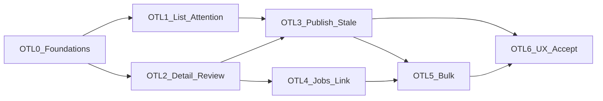

# Operator Translation Lifecycle (OTL) — Parent Program Architecture Plan

**Status:** Architecture Frozen — program roadmap (on `main`)
**Program:** Operator Translation Lifecycle (OTL)
**Plan freeze:** Canonical program architecture for milestones **OTL.0–OTL.6**; orchestration and presentation over frozen TIQ services; public/SaaS neutrality; Deferred boundaries
**ADR assessment:** **No new ADR required** for this program freeze. A future milestone must **STOP** for ADR review if it proposes durable composite operator state, new permissions/role architecture, new public Integration API contract, new persistent query architecture, or changed review/publication ownership.
**Roadmap parent:** [POST_V1_PLATFORM_ROADMAP.md](POST_V1_PLATFORM_ROADMAP.md) — Historical Program C catalog (C.1–C.7) retained for roadmap history; **operator translation lifecycle work is governed by this OTL parent**. Program C must not be independently resumed in parallel with OTL.
**Implementation priority:** [PRODUCT_PRIORITIES.md](../PRODUCT_PRIORITIES.md)
**Planning branch:** `docs/otl-program-roadmap-freeze` (merged)
**Freeze merge:** `main` @ `9a31176f0147d726b251315259cd6d6ca84ea432` (`merge: freeze Operator Translation Lifecycle program roadmap`)
**Depends on:** AI Multilingual **v1.2.0** released; **TIQ Complete** (TQ.0–TI.7); `Migrator::TARGET` **7**; Integration API v1 unchanged
**Related:** [adr/0015-review-workflow-and-tm-approval-policy.md](../adr/0015-review-workflow-and-tm-approval-policy.md); [adr/0019-evidence-based-risk-assessment.md](../adr/0019-evidence-based-risk-assessment.md); [adr/0020-controlled-auto-publication-and-frontend-gate.md](../adr/0020-controlled-auto-publication-and-frontend-gate.md); [TIQ_PARENT_IMPLEMENTATION_PLAN.md](TIQ_PARENT_IMPLEMENTATION_PLAN.md); [STRATEGY_F_F10_TRANSLATOR_WORKSPACE.md](STRATEGY_F_F10_TRANSLATOR_WORKSPACE.md); [REVIEW_WORKFLOW_IMPLEMENTATION_PLAN.md](REVIEW_WORKFLOW_IMPLEMENTATION_PLAN.md); [INTEGRATION_API_V1.md](../INTEGRATION_API_V1.md); [TEST_STRATEGY.md](../TEST_STRATEGY.md)

**Operational success:** Operators can complete find → understand state/risk → review/edit → approve/reject → publish/unpublish → verify using one coherent lifecycle, without inventing a second translator, Store, QA engine, assessment policy, publication policy, or Jobs engine.

**This plan is the program architecture contract for OTL (OTL.0–OTL.6).** Do not implement production code under OTL until the relevant milestone plan is Architecture Frozen on `main`. Each milestone receives its own definitive planning freeze before implementation. This document freezes program boundaries, invariants, gates, and Deferred items — not detailed OTL.0 work packages.

**Production implementation status:** **OTL.0 Complete** on `main` (merge `13e68f9d51ca5a4a0a8704ed048cf51e3eec3d3a`). **OTL.1 Complete** on `main` (merge `466eb6a470b2ea48b949bc05e0717afbc6600fc3`). **OTL.2 Complete** on `main` (merge `060649d9a8cf20c3698f9ed145d29c8d20d67143`). **OTL.3 Complete** on `main` (merge `77fc39da5d9b30d204e5a0c04e318a463ad39484`). **OTL.4 Complete** on `main` (merge `6e77687f6ebbb000372f68d699fba33c71489704`). **OTL.5 Complete** on `main` (merge `ed8dbd8f095cf17e2d3031777f763012f65f5663`). **OTL.6** Architecture Frozen planning lifecycle (see [OTL6_FINAL_OPERATOR_LIFECYCLE_POLISH_IMPLEMENTATION_PLAN.md](OTL6_FINAL_OPERATOR_LIFECYCLE_POLISH_IMPLEMENTATION_PLAN.md)); production implementation **not started**. TSC remains not started.

**Next:** After OTL.6 planning freeze + closure on `main`, run the combined **OTL.6 Final Operator Lifecycle Polish implementation** + independent implementation review + merge + milestone/program closure from the frozen OTL.6 plan. Do not start Translation Surface Coverage (TSC) under OTL.

---

## 1. Executive summary

AI Multilingual **v1.2.0** shipped **TIQ Complete** (TQ.0–TI.7): structural safety, context, TM, deterministic QA, evidence-based assessment, hardened Jobs, and controlled publication. The backend axes and services exist. The operator experience does not yet present one coherent lifecycle.

**OTL** is the next active product program. It makes existing translation capabilities **operationally coherent** through orchestration and presentation — not new translation intelligence.

Frozen ladder: **OTL.0 → OTL.1 / OTL.2 → OTL.3 / OTL.4 → OTL.5 → OTL.6**.

Hard invariants include: public/SaaS neutrality; TI.7 owns publication eligibility; ADR-0015 review ≠ ADR-0020 publication; computed (non-persisted) read models; `TARGET` remains **7**; no Biopentra-specific product behavior.

---

## 2. Repository baseline

Verified at program Architecture Freeze authoring:

| Field | Value |
|---|---|
| Branch baseline | `main` == `origin/main` @ `043211ae69d233e3bac747eb004e4d3f3be7a342` |
| Working tree | Clean at branch creation |
| Plugin version | **1.2.0** |
| Latest release tag | `v1.2.0` @ `b67fc296e2b2170dea84228b1acda502e518f07a` |
| Note | HEAD is one docs-closure commit after the release tag (unreleased docs only) |
| `Migrator::TARGET` | **7** |
| TIQ | **Complete** (TQ.0–TI.7) |
| Prior next milestone | Undecided (post-v1.2.0 decision pending) — **resolved by this freeze: OTL** |
| OTL artifacts before this freeze | None |
| Planning branch | `docs/otl-program-roadmap-freeze` |

If any precondition regresses before a milestone starts coding: **STOP**.

---

## 3. Product problem

The plugin has strong translation, QA, assessment, Jobs, and publication architecture, but operators must mentally combine several backend concepts to act.

**Problem statement:** There is no single operator workflow to find a translation, understand its state and risk, edit/review, publish or unpublish, and verify the resulting state.

OTL solves that coherence gap. It must **not** create new translation intelligence unless an unavoidable gap is proven (none identified for this program).

---

## 4. Program objective

Deliver an **Operator Translation Lifecycle** that:

1. Presents existing Store / review / QA / assessment / publication / Jobs truth in merchant-friendly terms
2. Makes allowed actions explicit and **server-computed** from authoritative services
3. Provides a cross-object Operations list and actionable attention queue
4. Unifies translation detail for edit, review, publication explain, and Jobs context
5. Preserves TIQ ownership boundaries and public/SaaS neutrality

Target journey:

```text
find translation
  → understand state/risk
  → review/edit
  → approve/reject
  → publish/unpublish
  → verify resulting state
```

---

## 5. Public / SaaS neutrality invariant

**HARD program invariant.**

AI Multilingual production code, merchant-facing UI, defaults, API terminology, and generic product test contracts must remain **site-neutral** and suitable for future public/SaaS distribution.

**Forbidden as product behavior:**

- Biopentra branding
- `biopentra.eu` (or any site-specific domain) in product contracts
- peptide-specific assumptions
- site-specific product/category names
- site-specific IDs/slugs
- site-specific workflow rules
- site-specific defaults
- a “Biopentra mode”

Site-specific environments may appear **only** in:

- operational validation logs
- external/manual acceptance evidence
- deployment-specific documentation that is clearly not product behavior

Future generic coverage work is named **Translation Surface Coverage (TSC)** — not BCC. TSC is a separate later program (see §38).

---

## 6. Existing operator / admin architecture

### Admin surfaces

| Surface | Role |
|---|---|
| Multilingual → Languages / Settings | PHP settings; publication gate/mode currently **diagnostics-only** (not form controls) |
| Multilingual → Translate | Legacy PHP field editor |
| Multilingual → Workspace | Primary React operator app: Translate / Review queue / Jobs tabs |
| Multilingual → Glossary | Glossary admin |
| Multilingual → Limited Rollout | Rollout admin (Strategy F) |
| Multilingual → SEO Diagnostics | SEO diagnostics |
| CLI | Jobs + publication explain/publish/unpublish (ops) |

### Ownership layers (current)

```text
React UI (assets/translator-workspace/)
  → REST (WorkspaceController; JobsController under src/Jobs/)
    → ViewModels / serializers
      → WorkspaceService / Jobs / PublicationService
        → Store, QA, AssessmentAssembler, ReviewWorkflow, TM, TranslationService
```

### Orthogonal Store axes (must remain separate in UX)

| Axis | Owner | Values (illustrative) |
|---|---|---|
| `status` (provenance) | Store / TranslationService | missing, machine_translated, manually_edited, reviewed, failed, … |
| `review_status` | ADR-0015 | not_submitted, pending, approved, rejected |
| `publish_status` | ADR-0020 / TI.7 | unpublished, published |
| Assessment (derived) | TI.5 | blocked, needs_review, review_recommended, structurally_clean |
| QA findings (derived) | TI.4 | policy-applied issues |

**Hard equalities UI must teach:**

- `approved ≠ published`
- `structurally_clean ≠ published` / ≠ auto-publish authority
- Workspace footer `is_published` today means **WP post publish**, not segment `publish_status`

---

## 7. Current lifecycle fragmentation

Verified gaps (backend capability vs operator UI):

| Gap | Evidence |
|---|---|
| TI.5 assessment not rendered | `meta.assessment` attached in WorkspaceService; no React consumer |
| TI.7 publish/unpublish/explain unused by UI | REST routes exist; `workspace-api.ts` has no publish helpers |
| No cross-object Operations list | Only review-queue (review axis) + per-post segments + Jobs |
| Publication settings not editable in admin form | Settings shows Saved/Effective diagnostics only |
| Jobs ↔ translation detail weak | Item assessment REST unused; no lifecycle deep-links |
| “Why isn’t this public?” | Explain endpoint/CLI only |
| Dual editors | Legacy Translate PHP + Workspace |

Highest-friction workflows: understand risk; publish/unpublish; find actionable work across objects; distinguish review vs publication vs WP post publish.

---

## 8. Architecture ownership model

### Dependency direction (frozen)

```text
Store / review state
TI.4 QA
TI.5 Assessment
TI.7 PublicationPolicy / PublicationService
TI.6 Jobs
        ↓
OTL application / read-model layer
        ↓
Workspace / admin UI
```

### What OTL owns

- Computed operator read models and list/detail ViewModels
- Server-computed `allowed_actions` derived from existing service contracts + state
- Operations list / attention presentation
- Unified detail composition
- Thin UI wiring (including Settings form controls for existing publication keys)

### What OTL must NOT create

- `OTLTranslationService`
- OTL QA engine
- OTL assessment policy
- OTL publication policy / eligibility heuristics
- second review-state model
- second Store
- second Jobs engine
- persisted composite “operator status”
- Integration API v2 for operator lifecycle

UI must not become a policy owner.

---

## 9. OTL invariants

1. One shared `TranslationService` path for generation (TIQ).
2. TI.1–TI.7 ownership unchanged.
3. **Review ≠ publication** (ADR-0015 / ADR-0020).
4. **Publication eligibility is exclusively TI.7** — OTL aggregates/displays only.
5. No LLM confidence authority; no quality/health score authority.
6. No OTL composite-state persistence.
7. `source_hash` / staleness semantics unchanged; no auto-unpublish.
8. Store identity grammar unchanged.
9. Action Scheduler remains the Jobs queue.
10. Public/SaaS neutrality (§5).
11. Admin REST is not automatically a public integration contract.
12. Parent freeze does **not** authorize implementing all milestones (§40).

---

## 10. Canonical operator read-model concept

**Decision:** One **computed, non-persisted** operator-facing read model.

Conceptually aggregates:

- translation identity
- source/target preview
- provenance `status`
- `review_status`
- `publish_status`
- stale/current
- TI.4 QA summary
- TI.5 assessment category / reasons
- **TI.7 publication eligibility / reason codes** (from PublicationPolicy / explain — **not** OTL heuristics)
- source object/type
- language pair
- timestamps / actors where already on-row
- bounded TM/provenance evidence
- bounded Jobs linkage / last failure
- **server-computed `allowed_actions`**

Display labels may be derived for UI. **No** composite status column. **No** opaque score.

Exact DTO/class names follow repository ViewModel conventions at OTL.0 planning (do not invent parallel naming systems here).

---

## 11. Operations list

**Decision:** **Supported** (OT1) — canonical cross-object Translation Operations list in **OTL.1**.

Frozen properties:

- language-scoped
- paginated (default page size bounded, **≤50**)
- Store/query backed
- no load-all-into-PHP
- prefer existing indexes (`lang_review_queue`, `lang_publish_status`, `lang_status`, `stale_sweep`)

Not a replacement for Jobs UI. Not a full-text search product in foundation milestones.

---

## 12. Attention queue

**Decision:** **Supported** (OT2) — primary “what needs my attention?” entry using actionable buckets, not opaque scoring.

Potential buckets (frozen as concepts, not as OTL-owned policy):

- blocked (TI.5 category)
- needs review (review axis and/or TI.5)
- stale (`is_stale`)
- rejected (`review_status`)
- **unpublished but TI.7-eligible**
- failed Job
- publication ineligible (TI.7 explain)

### Mandatory refinement — publication eligibility ownership

OTL does **not** compute publication eligibility itself.

Any bucket such as “unpublished but eligible” **must** derive from:

- current `publish_status`, and
- **TI.7 `PublicationPolicy` / explain result**

OTL may aggregate and display that result. OTL must **not** introduce heuristics such as:

- `if assessment == structurally_clean then eligible`
- duplicated TI.7 rules in SQL, PHP ViewModels, REST controllers, or JavaScript

The read model may expose publication eligibility, TI.7 reason codes, and allowed publication actions **only** from the authoritative TI.7 service/policy.

---

## 13. Unified detail

**Decision:** **Supported** (OT3) — one detail experience composing:

- source
- target editor
- status summary (all axes, clearly labeled)
- TI.4 QA
- TI.5 assessment
- review controls
- publication status + explain
- Jobs context
- navigation links (edit source, preview frontend)

No duplicate QA or risk computation.

---

## 14. Editing boundary

**Decision:** **Partially Supported** (OT4).

Improve within Workspace segment editor:

- side-by-side clarity
- dirty/save feedback
- stale warning
- publish-invalidation visibility after edit

**Out of scope:** full CAT tool, translation memories as a second editor, assignment workflows.

---

## 15. Review controls

**Decision:** **Supported** (OT7) — ADR-0015 **unchanged**.

States remain: `not_submitted` | `pending` | `approved` | `rejected`.

UI must explicitly preserve: **approved ≠ published**.

Existing batch submit/approve/reject remain Supported (OT16/OT17).

---

## 16. Publication controls

**Decision:** **Supported** (OT8/OT9) — TI.7 remains authoritative.

OTL surfaces:

- `publish_status`
- explain result / reason codes
- manual publish / unpublish
- Settings form controls for gate/mode where admitted (safe defaults preserved: gate OFF, mode `manual`)

**Forbidden:**

- force-publish of hard blockers
- policy in JavaScript
- `structurally_clean = published`
- `approved = published`

---

## 17. Stale / retranslation workflow

**Decision:** **Supported** (OT10).

Frozen operator flow:

```text
source changes
  → stale visible
  → operator finds stale item (Operations / attention)
  → retranslate/edit via existing TranslationService / Jobs paths
  → review (ADR-0015)
  → publish/republish via TI.7
```

No `source_hash` redesign. No automatic unpublish.

---

## 18. Jobs linkage

**Decision:** **Supported** (OT11/OT12) — TI.6 remains Jobs owner.

OTL may:

- link translation ↔ Job / job item
- expose bounded last failure
- delegate retry to Jobs service
- open Jobs detail
- provide lifecycle context

OTL must **not** recreate: retry state machine, scheduling, Action Scheduler logic, provider usage logic, concurrency policy.

---

## 19. Bulk-operation boundary

**Decision:** **Partially Supported**.

Already Supported: batch save/translate/QA/TM accept; batch review submit/approve/reject (OT16/OT17).

Later milestone (**OTL.5**) may admit bounded:

- bulk publish/unpublish (OT18 Partial)
- bulk stale retranslation (OT19 Partial)
- bulk failed retry (OT20 Partial)

Every item must still execute authoritative service policy individually (TI.7 / ADR-0015 / Jobs). **No** force-all. **No** generic workflow automation engine.

---

## 20. Audit / history boundary

**Decision:** OT15 **Deferred** as an event-store product.

Detail may show **current-state timestamps/actors** already on the Store row. Existing audit hooks remain extension points. Do not create a general event-sourcing platform (ADR-0020).

---

## 21. Metrics boundary

**Decision:** Simple actionable counts **Supported** as part of Operations/Attention (stale, needs review, blocked, unpublished, failed).

OT26 metrics **dashboard platform** = **Unsupported**. No quality percentage. No opaque health score.

---

## 22. Permissions boundary

**Decision:** Keep existing capabilities for OTL v1 program:

- `aiml_translate` / `aiml_review_translations` / Jobs caps as shipped
- Publication mutate REST today uses translator edit path (`aiml_translate` + `edit_post`) — do not invent a new publish capability in the parent freeze

Separate publish capability / SaaS translator–reviewer–publisher roles = **Deferred** unless a milestone STOP proves necessity (then ADR review).

---

## 23. OT1–OT30 dispositions (frozen)

| ID | Candidate | Disposition |
|---|---|---|
| OT1 | Operations list | **Supported** |
| OT2 | Attention queue | **Supported** |
| OT3 | Unified detail | **Supported** |
| OT4 | Editor improvements | **Partial** |
| OT5 | TI.4 QA surfacing | **Supported** |
| OT6 | TI.5 assessment surfacing | **Supported** |
| OT7 | Review controls | **Supported** |
| OT8 | Publication controls | **Supported** |
| OT9 | Publication explain | **Supported** |
| OT10 | Stale/retranslate | **Supported** |
| OT11 | Jobs linkage | **Supported** |
| OT12 | Failure detail | **Supported** |
| OT13 | Source/frontend navigation | **Supported** |
| OT14 | Provenance/TM visibility | **Partial** |
| OT15 | Audit/history timeline | **Deferred** |
| OT16 | Bulk submit for review | **Supported** |
| OT17 | Bulk approve/reject | **Supported** |
| OT18 | Bulk publish/unpublish | **Partial** |
| OT19 | Bulk stale retranslation | **Partial** |
| OT20 | Bulk failed retry | **Partial** |
| OT21 | Advanced filters | **Partial** |
| OT22 | Saved views | **Deferred** |
| OT23 | Assignment/reviewer ownership | **Deferred** |
| OT24 | Comments/discussion | **Deferred** |
| OT25 | Notifications | **Deferred** |
| OT26 | Metrics dashboard | **Unsupported** as platform; simple counts only |
| OT27 | Mobile-admin optimization | **Deferred** |
| OT28 | Integration API exposure | **Unsupported** for OTL |
| OT29 | Site-specific workflow rules | **Unsupported** |
| OT30 | Generic extension hooks | **Partial** |

Do not widen this matrix without amending the parent freeze.

---

## 24. Performance / query strategy

- Prefer language-leading existing indexes.
- New Store query methods (mirroring `query_review_queue`) are in-scope without schema change.
- Multi-axis / FULLTEXT / unscoped cross-post scans are not foundation defaults.
- New indexes or schema require a later **explicit architecture decision** if measured evidence proves need.
- Do not add persistence solely for UI convenience.

---

## 25. REST / ViewModel strategy

- Additive admin REST under `aiml/v1` (Workspace family)
- Prefer: paginated list endpoint, detail endpoint, action endpoints that **delegate** to existing services
- Server-computed `allowed_actions` — do not implement permissions/policy in JavaScript
- Controllers remain thin; ViewModels only
- **Not** Integration API v1/v2 expansion
- Capability checks preserved

---

## 26. Admin information architecture

Prefer enhancing Workspace over new top-level menus:

```text
Multilingual
  Languages / Settings
  Workspace
    Operations (attention + list)   ← OTL
    Translate (per-object editor)
    Review queue (may fold into Operations over time)
    Jobs
  Glossary / SEO Diagnostics / …
```

Exact tab labels are OTL.1/OTL.2 UX details; structure must remain coherent and minimal.

Settings gains real publication gate/mode controls when OTL.3 admits them (keys already exist).

---

## 27. Accessibility / responsive requirements

OTL is an admin product surface. Plan for:

- keyboard accessibility
- semantic controls
- clear status text (not color-only meaning)
- usable at typical laptop widths

Reuse the existing admin design system. Do not over-design. Mobile-first optimization remains Deferred (OT27).

Merchant-facing terminology: Needs review, Blocked, Stale, Unpublished, Published, Approved, Translation failed. Internal codes (R1.0, TI.*, RawFinding, TM8) stay behind expandable diagnostics.

---

## 28. Playwright / browser-test strategy

Aligned with [TEST_STRATEGY.md](../TEST_STRATEGY.md):

| Layer | Role |
|---|---|
| PHPUnit unit + integration | **Mandatory** normal gates |
| Playwright | **Targeted** Tier-1/Tier-2 OTL UI smoke |
| CI placement | Evaluate milestone-by-milestone; not every browser scenario on default main CI |

Neutral fixtures only. No site-specific URLs in product test contracts.

---

## 29. Privacy / security

Authorized operators may see source/target text. Still avoid exposing:

- provider prompts
- API keys / auth headers
- customer/order/private data outside authorized context

Preserve source-object access semantics. No analytics leakage.

Action confirmations by risk: Low (explain/open/filter); Moderate (submit/approve/reject/retry); Higher (publish/unpublish/bulk). No silent destructive operations.

---

## 30. Schema / TARGET decision

**Freeze:** `Migrator::TARGET` remains **7**.

No migration for OTL program foundation. New indexes/schema only via later explicit architecture decision with measured evidence.

---

## 31. ADR assessment

**No new ADR required** for this parent freeze.

STOP for ADR review if a milestone proposes:

- durable composite operator state
- new permissions/role architecture
- new public Integration API contract
- new persistent query architecture
- changed review/publication ownership

Preserve ADR-0015, ADR-0019, ADR-0020 unchanged unless an explicit ADR amendment is opened.

---

## 32. Milestone ladder (OTL.0–OTL.6)

| Milestone | Concept | Independently useful outcome |
|---|---|---|
| **OTL.0** Foundations | Computed operator read model + `allowed_actions` + list/detail REST contracts | Backend contract for lifecycle UI; PHPUnit locks no policy duplication |
| **OTL.1** Operations list + attention | Cross-object list, actionable buckets, filters, counts | Operators can find work without knowing every axis |
| **OTL.2** Unified detail + edit/review | Risk/QA/assessment/editor/review in one surface | Operators can understand and act on one translation |
| **OTL.3** Publication + stale | Publish/unpublish/explain UI; Settings gate/mode controls; stale→retranslate→republish | Publication and staleness are operable in UI |
| **OTL.4** Jobs linkage + recovery | Translation↔Jobs navigation; failure detail; delegated retry | Recovery without leaving lifecycle context |
| **OTL.5** Bounded bulk | Per-item-authoritative bulk publish/retranslate/retry | Safe throughput for eligible actions |
| **OTL.6** UX polish + acceptance | A11y, terminology, responsive laptop UX, targeted Playwright, focused manual acceptance | Release-ready operator lifecycle UX |

---

## 33. Dependency graph

```text
OTL.0 → OTL.1
OTL.0 → OTL.2
OTL.1 + OTL.2 → OTL.3
OTL.2 → OTL.4
OTL.3 + OTL.4 → OTL.5
OTL.3 + OTL.5 → OTL.6
```



---

## 34. Program quality gates

Each milestone must:

1. Introduce one major concept
2. Be independently useful
3. Preserve TIQ contracts and ownership boundaries
4. Have clear acceptance criteria + automated tests
5. Avoid schema changes unless an explicit architecture decision admits them
6. Avoid giant mixed UI/backend rewrites
7. Pass public/SaaS neutrality check
8. Include focused manual acceptance of its own UI slice before close

Parent freeze does not replace per-milestone freezes (§40).

---

## 35. Deferred / out-of-scope

**Deferred:** OT15 audit timeline product; OT22 saved views; OT23 assignment; OT24 comments; OT25 notifications; OT27 mobile-first admin; separate publish capability / SaaS roles; auto-unpublish; multi-axis/FULLTEXT indexes without evidence.

**Out of scope / Unsupported:** OT26 analytics dashboard platform; OT28 Integration API operator exposure; OT29 site-specific workflow rules; Elementor/theme/plugin string discovery (**TSC**); force-publish hard blockers; LLM confidence; quality scores; second diagnostics product; CAT platform redesign; generic workflow automation engine.

---

## 36. Architecture guardrails

At minimum preserve:

- one `TranslationService`
- TI.1 structural safety
- TI.2 context
- TI.3 TM
- TI.4 QA detector ownership
- TI.5 assessment ownership
- TI.6 Jobs ownership
- TI.7 publication policy/service ownership
- review ≠ publication
- no LLM confidence authority
- no quality score authority
- no OTL composite-state persistence
- no OTL publication eligibility heuristics
- `source_hash` / staleness unchanged
- Store identity unchanged
- Action Scheduler remains Jobs queue
- public/SaaS neutrality
- no site-specific behavior

---

## 37. Program C authority relationship

Historical **Program C — Translator Experience** (C.1–C.7) in [POST_V1_PLATFORM_ROADMAP.md](POST_V1_PLATFORM_ROADMAP.md) remains preserved for roadmap history.

**Where Program C items overlap operator translation lifecycle concerns, OTL supersedes them as the active authoritative program.**

Program C must **not** be independently resumed in parallel with OTL.

Do not erase or casually rewrite historical Program C tables. Use minimal pointers from roadmap/priority docs to this parent.

---

## 38. Translation Surface Coverage boundary

Future generic program name: **Translation Surface Coverage (TSC)**.

Potential later scope (illustrative, not planned here):

- Elementor surfaces beyond current admissions
- theme chrome
- modal/age-gate-style plugin strings
- menus/widgets
- generic third-party surfaces

**OTL does not discover or translate those missing surfaces.** OTL may display/manage translations that already exist.

TSC must remain: generic, site-neutral, plugin/theme-adapter based where necessary. **No BCC product concept. No Biopentra-specific implementation.**

---

## 39. Versioning implication

OTL ladder likely accumulates toward a future **v1.3.0** when a coherent operator-lifecycle slice is release-ready. Multiple unreleased milestones on `main` before that release are expected.

This program freeze does **not** bump version, tag, or release.

---

## 40. Per-milestone planning-freeze requirement

The OTL parent Architecture Freeze does **not** authorize implementation of all milestones.

Before each **OTL.x** implementation:

1. Definitive milestone planning
2. Materialize standalone implementation plan
3. Independent planning review
4. Merge/freeze plan on `main`
5. Only then create implementation branch
6. Independent implementation review
7. Merge/closure

The repository plan on `main` is authoritative.

---

## 41. Exact next action

This parent is Architecture Frozen on `main` (freeze merge `9a31176f0147d726b251315259cd6d6ca84ea432`).

**OTL.0 Foundations** is **Complete** on `main` (merge `13e68f9d51ca5a4a0a8704ed048cf51e3eec3d3a`; plan freeze `9b922222564da4f3294e36188de992c1384c630c`). See [OTL0_FOUNDATIONS_VALIDATION_LOG.md](OTL0_FOUNDATIONS_VALIDATION_LOG.md).

Exact next step: after OTL.6 Architecture Frozen + planning closure on `main`, run the combined **OTL.6 Final Operator Lifecycle Polish implementation** + independent implementation review + merge + milestone/program closure from the frozen plan ([OTL6_FINAL_OPERATOR_LIFECYCLE_POLISH_IMPLEMENTATION_PLAN.md](OTL6_FINAL_OPERATOR_LIFECYCLE_POLISH_IMPLEMENTATION_PLAN.md)). Do not start TSC under OTL. Do not create the OTL.6 implementation branch until planning freeze/closure is complete.

---

## Appendix A — Manual acceptance themes (program-level)

Focused OTL acceptance (not full v1.2 product validation):

- find translation
- inspect problem (assessment/QA/publication explain)
- edit
- approve/reject
- publish/unpublish
- stale/retranslate
- failed Job link/retry
- filters
- pagination

Detailed checklists belong in milestone plans.

---

## Appendix B — Preconditions checklist (authoring)

| Precondition | Status |
|---|---|
| `main == origin/main` @ `043211ae69d233e3bac747eb004e4d3f3be7a342` | Pass |
| Working tree clean at branch creation | Pass |
| Plugin version 1.2.0 | Pass |
| Tag `v1.2.0` exists | Pass |
| `Migrator::TARGET` = 7 | Pass |
| TIQ Complete | Pass |
| No prior OTL parent / feature branch | Pass |
| Integration API v1 unchanged (not modified by this freeze) | Pass |
