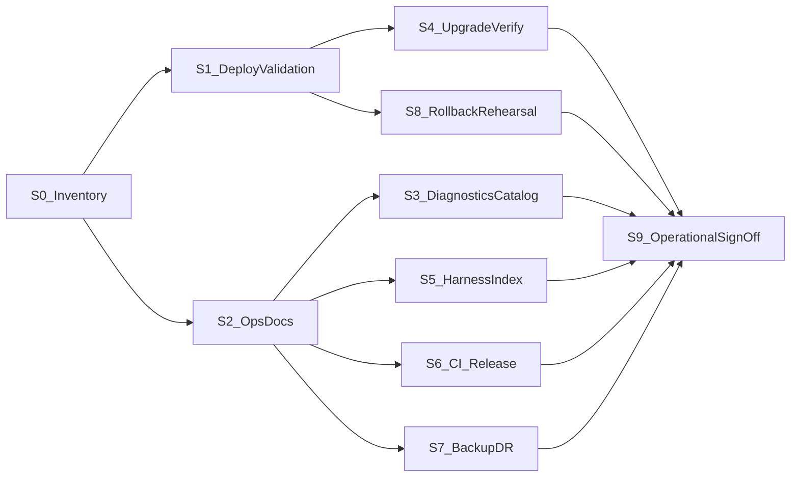

# P1 — Platform Stabilization — Implementation Plan

**Status:** Architecture frozen — implementation authorized  
**Roadmap parent:** [POST_V1_PLATFORM_ROADMAP.md](POST_V1_PLATFORM_ROADMAP.md) — Program **P1** (milestones P1.1–P1.3); Roadmap **v1.0**  
**Baseline:** AI Multilingual Platform **v1.0.0** (`main`)  
**Branch (when implementation starts):** `feature/p1-platform-stabilization` (recommended)  
**ADR:** **None required** for planned work. Open an ADR only if a frozen platform contract must change — that is a **stop condition**, not a P1 deliverable.  
**Validation log (to create during implementation):** `docs/plans/P1_PLATFORM_STABILIZATION_VALIDATION_LOG.md`

**Primary deliverables:** Runnable verification under `acceptance/p1/` + executed operational evidence. Documentation is **supporting evidence**, not the product of P1.

---

## 1. Purpose

Make the released **v1.0.0** platform **operationally mature** before significant new product surface area begins (Program A and later).

P1 is intentionally different from the feature milestones that built v1. It hardens deployment confidence, observability, release discipline, and standing maintenance — **without** introducing major new translation capabilities and **without** changing frozen architectural contracts.

P1 prepares the project for A.R1 / A.R2 / A.1 and subsequent roadmap work by ensuring operators and engineers can **deploy, verify, observe, roll back, and sign off** what already shipped—using automation-first engineering verification.

---

## 2. Goals

1. **Production deployment confidence** — repeatable, scripted verification that a v1.0.0 (or v1.0.x) install is healthy: schema, flags, providers, jobs/AS, rollout, and visitor-facing capability probes.
2. **Ops/docs alignment** — runbooks, HOOKS, and deployment docs match shipped surfaces and are validated against live probes (docs support ops; they are not the primary gate).
3. **Upgrade safety** — activation / drift migration to schema target **6** verified by a required engineering harness; rollback posture rehearsed.
4. **Operational diagnostics clarity** — operators can answer the core “is X functioning?” questions using existing diagnostics/CLI alone.
5. **Provider validation baseline** — OpenAI RC path frozen as the canonical v1.x provider validation baseline; future providers must meet equivalent behavioural outcomes.
6. **Release discipline** — CI Tier 0 + release checklist with formal provider-validation gate when AI behaviour changes.
7. **Disaster recovery confidence** — backup/restore posture documented plus one recorded restore rehearsal/tabletop.
8. **Operational readiness sign-off** — explicit DoD confirming deploy, upgrade, rollback, diagnostics, provider validation, and release checklist.
9. **Standing maintenance cadence** — P1.3 supporting policy for how v1.0.x fixes enter without roadmap churn.
10. **Contract preservation** — every work package remains additive relative to frozen principles in the platform roadmap §3.

---

## 3. Scope

### In scope

| Area | Primary engineering deliverable | Supporting docs |
|---|---|---|
| **Operational** | `acceptance/p1/deploy-verify.php`, schema/diagnostics probes, rollback rehearsal evidence | DEPLOYMENT, ops index, checklists |
| **Quality** | Harness index; OpenAI RC baseline freeze; release gate referencing RC | `P1_RELEASE_VALIDATION_CHECKLIST.md` |
| **Developer experience** | Local/staging recipes to run `acceptance/p1/*` and RC | Architecture/onboarding pointers |
| **Operations** | Diagnostics Q&A mapped to existing endpoints; restore rehearsal evidence | `docs/ops/*` |
| **Maintenance** | Operational readiness sign-off | `V1_0_X_MAINTENANCE.md` |

**Default for surfaces:** use **existing** REST/CLI/diagnostics only. Do **not** add new REST endpoints unless an existing documented diagnostics gap absolutely blocks an operator Q&A item (default answer: no new endpoints).

### Roadmap mapping

| Roadmap ID | Plan coverage |
|---|---|
| **P1.1** | Work packages **S1**, **S4**, **S8** (deploy verification, upgrade verify, rollback rehearsal) |
| **P1.2** | Work packages **S2**, **S3**, **S5**, **S6**, **S7** (ops/docs alignment, diagnostics, harness/RC freeze, release gate, DR) |
| **P1.3** | Work package **S9** (operational readiness sign-off + maintenance cadence support) |

---

## 4. Out of scope

Explicitly excluded (belong to later roadmap milestones):

- Elementor identity or widgets (**A.R1 / A.2 / A.3**)
- Nested Gutenberg identity (**A.R2 / A.4**)
- WooCommerce visitor coverage (**A.7** family)
- Plugin Integration Framework / SDKs (**A.1 / E.***)
- Translation Intelligence enhancements (**B.***) — except freezing provider-validation *philosophy* in this plan
- Workspace productivity / dashboards (**C.***)
- Unified diagnostics *product* dashboard as a new admin app (**D.1** may consume P1 catalogs later)
- Export/import tooling (**D.7**), render-cache enablement (**D.9**)
- New AI providers, F10/F11-breaking REST shapes, schema steps beyond target 6, new identity families
- Redesigning `acceptance/rc/v1-openai-rc.php`
- Translating wp-admin or operator UIs; HTML scraping; billing platforms

**Also out of scope:** redesigning UUID/Store/TM/Glossary/Review/Jobs/rollout architecture; enabling render cache in production without a measured GO.

---

## 5. Architecture impact assessment

| Concern | Impact |
|---|---|
| Frozen platform principles (roadmap §3) | **None intentional.** |
| Database schema | **No new Migrator TARGET.** Verify target **6** only. |
| REST / CLI | **Existing surfaces only** by default. Acceptance scripts under `acceptance/p1/` call shipped APIs/CLI. |
| ADR | **No new ADR planned.** Contract change → **stop**. |
| PluginGuard / overlay rules | Must remain green in Tier 0 if any code lands. |
| Render cache | Remains **default-off**. |

**Verdict:** Architecturally conservative. Primary deliverables are **verification harnesses + operational evidence**; docs support operators.

---

## 6. Work package breakdown

### Sequence

**Parallel after S0:** S1 ∥ S2. After S2: S3 ∥ S5 ∥ S6 ∥ S7. S4 and S8 follow S1. S9 closes after S1–S8 acceptance evidence.

**Ordering confirmation:** S0–S9 IDs, edges, and parallelism are **unchanged** from the prior plan revision; only emphasis and artifacts inside each WP are strengthened.

---

### S0 — Baseline inventory and health-endpoint probe

| Field | Content |
|---|---|
| **Objective** | Inventory shipped ops surfaces and **probe** that documented health endpoints respond; confirm P1 will not touch frozen contracts. |
| **Scope** | List REST/CLI/diagnostics/runbooks/acceptance harnesses as of v1.0.0; contract checklist (roadmap §3 + F11 freeze + PluginGuard). **Engineering:** lightweight probe (inline in validation log commands or `acceptance/p1/` helper) that hits existing health/diagnostics surfaces and records PASS/FAIL—**no new diagnostics subsystem**. |
| **Deps** | Plan freeze (this document). |
| **Files expected** | `docs/plans/P1_PLATFORM_STABILIZATION_VALIDATION_LOG.md`; probe evidence; optional thin `docs/ops/README.md` stub. |
| **Validation** | Inventory complete; probe results recorded; no secrets in outputs. |
| **Rollback** | Delete validation log draft / probe helper if aborted. |
| **Stop** | Production relies on undocumented contract breaks; proposal to invent a new diagnostics product. |
| **Commit boundary** | `test(p1): probe health endpoints for stabilization inventory` / `docs(p1): record S0 inventory evidence` |

---

### S1 — Production deployment verification (P1.1)

| Field | Content |
|---|---|
| **Objective** | Automation-first verification that Platform v1.0.0 / v1.0.x is correctly deployed and operationally ready on the target environment. |
| **Scope** | **Primary artifact (frozen):** `acceptance/p1/deploy-verify.php` — deterministic, idempotent, non-destructive, safe to re-run on development, staging, or production. Using **existing services only**, verify: plugin version (`AIML_VERSION`); schema target **6**; capability sanity; rollout / GA configuration readable; encrypted provider configuration present (**never** print secrets); Background Jobs health; Workspace availability; provider readiness. Manual checklists and DEPLOYMENT notes are **supporting evidence**. Full AI behavioural path uses the canonical OpenAI RC baseline when provider validation is in scope (§6.1). |
| **Deps** | S0; access to target environment. |
| **Files expected** | `acceptance/p1/deploy-verify.php` (**required**); validation log evidence; supporting updates to `docs/DEPLOYMENT.md` may complete in S2. |
| **Validation** | `deploy-verify.php` exits PASS; evidence attached; RC PASS or recorded waiver when AI path required. |
| **Rollback** | Documented deactivate / prior ZIP restore per retention rules. |
| **Stop** | Schema ≠ 6; render false-positive; secrets leaked; harness becomes destructive. |
| **Commit boundary** | `test(p1): add deploy-verify harness` + `docs(p1): record deploy verification evidence` |

---

### S2 — Ops and documentation alignment (P1.2)

| Field | Content |
|---|---|
| **Objective** | Align operator docs with shipped surfaces; **validate docs against live probes** from S0/S1. |
| **Scope** | Update `docs/HOOKS.md` for Jobs REST; refresh `docs/DEPLOYMENT.md` for v1.0.0 / schema 6 / AS; `docs/ops/README.md` indexing runbooks. Docs are supporting; gate is “docs match what probes already called.” |
| **Deps** | S0. |
| **Files expected** | `docs/HOOKS.md`, `docs/DEPLOYMENT.md`, `docs/ops/README.md`. |
| **Validation** | Every catalogued route family matches inventory/probe; deploy steps reproduce S1 harness usage. |
| **Rollback** | Revert docs commits. |
| **Stop** | Docs invent undocumented APIs. |
| **Commit boundary** | `docs(p1): align HOOKS deployment and ops index with v1.0.0` |

---

### S3 — Operational diagnostics checklist (P1.2)

| Field | Content |
|---|---|
| **Objective** | Operators can answer core health questions using **existing** diagnostics and CLI alone. |
| **Scope** | Publish operational Q&A mapping (commands/endpoints already shipped): **Is AI functioning?** · **Are Background Jobs functioning?** · **Is Review functioning?** · **Is Translation Memory functioning?** · **Is Glossary functioning?** · **Is Rollout functioning?** · **Are providers healthy?** Include secret-redaction rules and AS/`DISABLE_WP_CRON` notes. **Optional but recommended engineering artifact:** `acceptance/p1/diagnostics-smoke.php` — non-destructive PASS/FAIL probes over existing endpoints only (**no** new diagnostics subsystem). |
| **Deps** | S2. |
| **Files expected** | `docs/ops/DIAGNOSTICS_AND_HEALTH.md`; optional `acceptance/p1/diagnostics-smoke.php`; validation log results. |
| **Validation** | Each Q&A item answered with a concrete command; smoke PASS or manual equivalent recorded; no secrets in outputs. |
| **Rollback** | Remove catalog/smoke. |
| **Stop** | Logging raw prompts/bodies; new REST diagnostics product. |
| **Commit boundary** | `docs(p1): add operational diagnostics Q&A` / `test(p1): add diagnostics-smoke harness` |

---

### S4 — Upgrade and schema verification (P1.1)

| Field | Content |
|---|---|
| **Objective** | Prove clean and drift paths reach Migrator **TARGET = 6** via a **required** engineering harness. |
| **Scope** | **Required:** `acceptance/p1/schema-verify.php` (deterministic, idempotent, non-destructive). Cover fresh activate → 6 and behind-version → `maybe_migrate`; assert Store/TM/glossary/review/jobs tables/options as applicable. Supporting upgrade section in DEPLOYMENT. **No** schema TARGET change. |
| **Deps** | S1 (or parallel on staging clone). |
| **Files expected** | `acceptance/p1/schema-verify.php` (**required**); validation log; DEPLOYMENT upgrade notes. |
| **Validation** | Harness PASS on fresh and upgrade paths; PluginGuard green if any production code touched. |
| **Rollback** | Delete flawed harness; no DB redesign. |
| **Stop** | Proposal for Migrator step 7. |
| **Commit boundary** | `test(p1): add required schema-verify harness` |

---

### S5 — Acceptance harness index and OpenAI RC baseline freeze (P1.2)

| Field | Content |
|---|---|
| **Objective** | Make acceptance assets discoverable; **freeze** the OpenAI RC as the canonical provider validation baseline for Platform v1.x. |
| **Scope** | `acceptance/README.md` indexing harnesses (including `acceptance/p1/` and `acceptance/rc/`). **Freeze (do not redesign):** `acceptance/rc/v1-openai-rc.php` together with [V1_RC_OPENAI_VALIDATION.md](V1_RC_OPENAI_VALIDATION.md) is the **canonical provider validation baseline** for Platform **v1.x**. Future release validation **must reference this baseline** whenever AI behaviour changes. Document provider-dependent vs independent tests; no Playwright-in-CI by default. See also §6.1–§6.2. |
| **Deps** | S2. |
| **Files expected** | `acceptance/README.md`; release checklist cross-links (S6). |
| **Validation** | Engineers can locate deploy-verify, schema-verify, RC; baseline freeze language present. |
| **Rollback** | Revert README. |
| **Stop** | Redesigning RC; embedding secrets. |
| **Commit boundary** | `docs(p1): freeze OpenAI RC as v1.x provider validation baseline` |

---

### S6 — CI and release validation discipline (P1.2)

| Field | Content |
|---|---|
| **Objective** | Release checklist embeds the canonical RC baseline as a **formal gate** when AI functionality changes. |
| **Scope** | Review CI/release workflows; document Tier 0 greens before tag; `bin/build-zip.sh` no-dev rule. **Embed:** provider validation via OpenAI RC baseline (or recorded equivalent) whenever AI behaviour changes. Dry-run the checklist once without requiring a new production tag unless product asks. |
| **Deps** | S2, S5. |
| **Files expected** | `docs/plans/P1_RELEASE_VALIDATION_CHECKLIST.md`. |
| **Validation** | Checklist lists RC baseline gate; exercised once. |
| **Rollback** | Revert docs. |
| **Stop** | Mandating live OpenAI in every CI PR. |
| **Commit boundary** | `docs(p1): add release validation checklist with RC gate` |

---

### S7 — Backup / restore posture and restore rehearsal (P1.2)

| Field | Content |
|---|---|
| **Objective** | Operational confidence in backup/restore—**not** new backup tooling. |
| **Scope** | Document what to back up (`aiml_*` tables/options), uninstall retention, restore order, forbidden partial deletes (ADR-0004). **Additionally required:** one documented **restore rehearsal or tabletop** with named owner, recorded in the validation log. |
| **Deps** | S2. |
| **Files expected** | `docs/ops/BACKUP_AND_RESTORE.md`; validation log rehearsal section. |
| **Validation** | Doc peer review + rehearsal evidence recorded. |
| **Rollback** | Remove doc; rehearsal note remains historical. |
| **Stop** | Implementing a second SoT or backup daemon in P1. |
| **Commit boundary** | `docs(p1): document backup posture and restore rehearsal` |

---

### S8 — Kill-switch and rollback rehearsal (P1.1)

| Field | Content |
|---|---|
| **Objective** | Rehearse and record render/rollout/jobs kill paths and ZIP rollback. |
| **Scope** | Execute F12/F13 rollback checklists (or condensed P1 checklist) on staging/target; record timings and owners; confirm primary kill switch remains frontend render / rollout flags. |
| **Deps** | S1. |
| **Files expected** | Validation log evidence; optional `docs/ops/ROLLBACK_REHEARSAL.md`. |
| **Validation** | Documented successful rehearsal; safe visitor behaviour restored. |
| **Rollback** | Re-enable flags per runbook. |
| **Stop** | Rehearsal requires changing frozen rollout model. |
| **Commit boundary** | `docs(p1): record kill-switch and rollback rehearsal` |

---

### S9 — Operational readiness sign-off (P1.3)

| Field | Content |
|---|---|
| **Objective** | **Operational Readiness Sign-off** — the operational Definition of Done for Platform Stabilization. Maintenance cadence remains **supporting** documentation. |
| **Scope** | Finalize validation log with explicit sign-off confirming: **deployment verified** · **upgrade verified** · **rollback verified** · **diagnostics verified** · **provider validation complete** · **release checklist complete**. Supporting: short `docs/ops/V1_0_X_MAINTENANCE.md` (security, provider quirks, AS/cron). No feature work. |
| **Deps** | S1–S8 acceptance evidence. |
| **Files expected** | Completed validation log with sign-off table; maintenance doc. |
| **Validation** | Sign-off table complete; §10 and §13 satisfied. |
| **Rollback** | N/A (closure). |
| **Stop** | Open Severity-1 production defect unresolved. |
| **Commit boundary** | `docs(p1): record operational readiness sign-off` |

---

## 6.1 Canonical OpenAI RC baseline (frozen for Platform v1.x)

| Item | Value |
|---|---|
| Harness | `acceptance/rc/v1-openai-rc.php` |
| Evidence | [V1_RC_OPENAI_VALIDATION.md](V1_RC_OPENAI_VALIDATION.md) |
| Role | **Canonical provider validation baseline** for Platform **v1.x** |
| Release rule | Reference this baseline whenever AI behaviour changes; scoped re-runs allowed with recorded waivers |
| Non-goal | Do **not** redesign the RC harness in P1 |

---

## 6.2 Future provider validation philosophy (frozen)

Without adding provider implementations in P1:

- Every future AI provider must satisfy the **same provider-independent behavioural outcomes** demonstrated by the OpenAI RC (connection/readiness, translate/suggest path, jobs path where applicable, failure isolation, no secrets in diagnostics).
- **Transport may differ**; **acceptance expectations must remain equivalent**.
- Implementations belong to Program **B**; P1 only freezes the validation philosophy.

---

## 7. Dependencies

| Dependency | Nature |
|---|---|
| Platform **v1.0.0** on `main` | Hard |
| Frozen [POST_V1_PLATFORM_ROADMAP.md](POST_V1_PLATFORM_ROADMAP.md) | Hard |
| Existing Jobs / F12 / F13 runbooks | Soft (reuse) |
| Target environment access | Hard for S1/S8 |
| Action Scheduler / host cron | Operational reality for Jobs |
| OpenAI key (encrypted) | Required for full RC; deploy-verify can assert readiness without printing secrets |

**Does not depend on:** A.R1, A.R2, A.1, B.* implementations, C.*, D.1 product UI, E.*.

---

## 8. Validation strategy

| Layer | Role in P1 |
|---|---|
| **`acceptance/p1/deploy-verify.php`** | Primary deploy/health gate (S1) |
| **`acceptance/p1/schema-verify.php`** | Required schema gate (S4) |
| **`acceptance/p1/diagnostics-smoke.php`** | Recommended diagnostics gate (S3) |
| **OpenAI RC baseline** | Provider behavioural gate when AI changes (S5/S6/S9) |
| **Tier 0** | Required before merge of any production code |
| **Manual / tabletop** | Supporting evidence; restore rehearsal (S7); rollback rehearsal (S8) |

Evidence accumulates in `P1_PLATFORM_STABILIZATION_VALIDATION_LOG.md`.

---

## 9. Rollback strategy

| Situation | Action |
|---|---|
| Harness false positive/negative | Fix harness; re-run (idempotent) |
| Docs WP fails review | Revert docs |
| Deploy verification fails | Do not proceed to Coverage; fix via v1.0.x / S9 cadence |
| Production incident during rehearsal | F12/F13 kill switches; deactivate if needed |
| Contract-breaking “fix” proposed | **Stop** — not in P1 |

---

## 10. Acceptance criteria

P1 is accepted when all of the following are true:

1. **S1** — `acceptance/p1/deploy-verify.php` recorded **PASS** on the designated environment.
2. **S4** — `acceptance/p1/schema-verify.php` recorded **PASS** on fresh and upgrade paths.
3. **S8** — kill-switch / rollback rehearsal recorded **PASS**.
4. **S2** — HOOKS + DEPLOYMENT + ops index match shipped surfaces and live probes.
5. **S3** — operational diagnostics Q&A published; each core question answerable; smoke or equivalent **PASS**.
6. **S5** — harness index exists; OpenAI RC baseline freeze documented.
7. **S6** — release checklist exists with RC baseline gate when AI changes.
8. **S7** — backup/restore posture documented **and** restore rehearsal/tabletop recorded.
9. **S9** — **Operational Readiness Sign-off** complete (deploy, upgrade, rollback, diagnostics, provider validation, release checklist).
10. Tier 0 green for any production code merged under P1.
11. **No** new identity families, schema TARGET bump, or frozen-contract breaks.
12. Render cache remains default-off unless a separate measured GO (out of P1) is approved.

---

## 11. Risks

| Risk | Mitigation |
|---|---|
| P1 becomes a docs-only milestone | Automation-first S1/S3/S4; sign-off requires harness PASS |
| Feature dump (Coverage/Intelligence) | Hard OOS; stop conditions |
| Live OpenAI cost/latency | deploy-verify without paid calls; RC when AI gate required |
| AS / cron false Jobs failures | Document in S3; probe jobs/health |
| Backup doc encouraging partial deletes | Forbidden actions in S7 |
| New diagnostics subsystem creep | Existing endpoints only |
| RC redesign pressure | Explicit freeze in §6.1 |

---

## 12. Stop conditions

Stop and escalate if:

1. A WP requires changing a **frozen platform principle** or F10/F11 breaking REST change.
2. Schema **TARGET > 6** is proposed for “stabilization.”
3. Production verification reveals **render false positives** on allowlisted content.
4. Secrets appear in diagnostics, harness output, or fixtures.
5. Scope expands into Elementor, nested identity, Woo coverage, Workspace UX programs, or SDKs.
6. An ADR is required to proceed — pause for ADR track.
7. A new REST diagnostics product is proposed instead of using existing surfaces.

---

## 13. Definition of Done (operational)

Platform Stabilization is done when the validation log contains an **Operational Readiness Sign-off** with all items PASS:

| Sign-off item | Evidence |
|---|---|
| Deployment verified | S1 `deploy-verify.php` |
| Upgrade verified | S4 `schema-verify.php` |
| Rollback verified | S8 rehearsal |
| Diagnostics verified | S3 Q&A + smoke/equivalent |
| Provider validation complete | OpenAI RC baseline (§6.1) |
| Release checklist complete | S6 checklist exercised |

Plus: S0–S8 complete or explicitly waived; Tier 0 green for any code; contracts preserved; ready for **A.R1 / A.R2 / A.1** only after **S1 PASS**.

---

## 14. Release boundary

| Item | Policy |
|---|---|
| **Semver** | Harnesses + docs on `main`; **v1.0.x** only if code fixes required |
| **Not** a v1.1 feature release solely for P1 |
| **Tags** | Optional `p1-platform-stabilization-complete` after sign-off (product decision) |
| **Packaging** | Existing GitHub Release ZIP path |
| **After P1** | Coverage spikes may begin; P1.3 maintenance cadence continues |

---

## 15. Testing matrix (summary)

| WP | Engineering artifact | Supporting |
|---|---|---|
| S0 | Health-endpoint probe | Inventory docs |
| S1 | `deploy-verify.php` (**required**) | Manual checklist |
| S2 | Live doc↔probe verification | HOOKS/DEPLOYMENT |
| S3 | `diagnostics-smoke.php` (recommended) | DIAGNOSTICS_AND_HEALTH.md |
| S4 | `schema-verify.php` (**required**) | Upgrade notes |
| S5–S6 | RC baseline freeze + release gate | README / checklist |
| S7 | Restore rehearsal evidence | BACKUP_AND_RESTORE.md |
| S8 | Rollback rehearsal | F12/F13 checklists |
| S9 | Operational readiness sign-off | Maintenance cadence doc |
| Any `src/` fix | Tier 0 unit + integration | Targeted smoke |

---

## 16. Exact next step

1. Open `feature/p1-platform-stabilization` (or equivalent process).  
2. Execute **S0 → S1** first (`deploy-verify.php`); do not start A.R1 until **S1 PASS**.  
3. Parallelize S2+ after S0.  
4. Close with **S9 Operational Readiness Sign-off**.

---

## 17. Implementation readiness

| Question | Answer |
|---|---|
| Technically conservative? | Yes |
| Feature creep controlled? | Yes |
| Ops-first (automation over docs)? | Yes |
| Preserves platform contracts? | Yes |
| S0–S9 ordering unchanged? | Yes |
| Scope / roadmap mapping unchanged? | Yes |
| ADR required? | No |
| Schema TARGET change? | No |
| Architecture frozen / implementation authorized? | **Yes** |

---

## 18. Scope preservation statement

This refinement confirms:

- **S0–S9 ordering** is unchanged  
- **Roadmap mapping** (P1.1–P1.3) is unchanged  
- **Implementation scope** is unchanged (no new product capabilities)  
- **Frozen contracts** are unchanged  
- **No ADR** is required  
- **No schema TARGET** changes  
- **No production code** is modified by this planning refinement (plan document only)

---

## Document control

| Item | Value |
|---|---|
| Canonical plan | `docs/plans/P1_PLATFORM_STABILIZATION_IMPLEMENTATION_PLAN.md` |
| Roadmap milestone | P1 (P1.1, P1.2, P1.3) |
| Plan revision | Operational engineering rebalance (automation-first S1/S4; RC baseline freeze; operational sign-off) |
| Supersedes | Prior draft of this same file (docs-first emphasis) |
