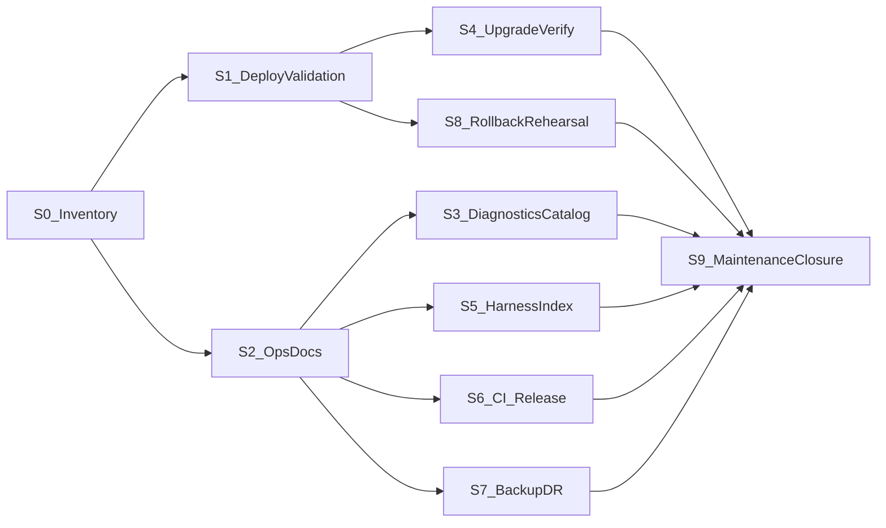

# P1 — Platform Stabilization — Implementation Plan

**Status:** Planning — awaiting architecture review and freeze before implementation  
**Roadmap parent:** [POST_V1_PLATFORM_ROADMAP.md](POST_V1_PLATFORM_ROADMAP.md) — Program **P1** (milestones P1.1–P1.3); Roadmap **v1.0**  
**Baseline:** AI Multilingual Platform **v1.0.0** (`main`)  
**Branch (when implementation starts):** `feature/p1-platform-stabilization` (recommended)  
**ADR:** **None required** for planned work. Open an ADR only if a frozen platform contract must change — that is a **stop condition**, not a P1 deliverable.  
**Validation log (to create during implementation):** `docs/plans/P1_PLATFORM_STABILIZATION_VALIDATION_LOG.md`

---

## 1. Purpose

Make the released **v1.0.0** platform **operationally mature** before significant new product surface area begins (Program A and later).

P1 is intentionally different from the feature milestones that built v1. It hardens deployment confidence, observability, documentation, test/release discipline, and standing maintenance — **without** introducing major new translation capabilities and **without** changing frozen architectural contracts.

P1 prepares the project for A.R1 / A.R2 / A.1 and subsequent roadmap work by ensuring operators and engineers can deploy, verify, observe, roll back, and maintain what already shipped.

---

## 2. Goals

1. **Production deployment confidence** — repeatable verification that a v1.0.0 (or v1.0.x) install is healthy: schema, flags, providers, jobs/AS, rollout, and visitor render safety.
2. **Ops/docs alignment** — runbooks, HOOKS, deployment, and diagnostics docs match the shipped surface (including Jobs REST omitted from HOOKS today).
3. **Upgrade safety** — activation / drift migration to schema target **6** is verified and documented; rollback posture is rehearsed.
4. **Observability clarity** — operators know which health/diagnostics endpoints and CLI commands to use; no secrets in diagnostics.
5. **Quality harness maturity** — acceptance/RC harnesses are indexed, reusable, and CI/release validation expectations are explicit (Tier 0 remains merge default).
6. **Disaster recovery documentation** — backup/restore posture for plugin-owned data without inventing a second source of truth.
7. **Standing maintenance cadence** — P1.3 defines how v1.0.x fixes (security, provider quirks, AS/cron) enter without roadmap churn.
8. **Contract preservation** — every work package is additive/docs/ops-oriented relative to frozen principles in the platform roadmap §3.

---

## 3. Scope

### In scope

| Area | Examples |
|---|---|
| **Operational** | Deployment verification checklist; upgrade/schema verification; health/diagnostics catalog; support/maintenance CLI documentation; recovery tooling *documentation*; kill-switch / rollback rehearsal |
| **Quality** | Acceptance harness index; RC reuse guidance; provider-independent fixture notes; CI Tier 0 reliability; release validation checklist; lightweight performance regression *checks* (document thresholds; no new product features) |
| **Developer experience** | Architecture/onboarding pointers; troubleshooting guides; debugging runbooks; local WP-CLI / Docker verification recipes |
| **Operations** | Centralize or cross-link runbooks under `docs/ops/`; monitoring/observability operator workflows; backup/restore / DR documentation |
| **Maintenance** | P1.3 cadence for v1.0.x patches; provider compatibility patches that do not change public contracts |

### Roadmap mapping

| Roadmap ID | Plan coverage |
|---|---|
| **P1.1** | Work packages **S1**, **S4**, **S8** (deploy validation, upgrade verify, rollback rehearsal) |
| **P1.2** | Work packages **S2**, **S3**, **S5**, **S6**, **S7** (ops/docs, diagnostics catalog, harness index, CI/release docs, DR docs) |
| **P1.3** | Work package **S9** (standing maintenance + closure) |

---

## 4. Out of scope

Explicitly excluded (belong to later roadmap milestones):

- Elementor identity or widgets (**A.R1 / A.2 / A.3**)
- Nested Gutenberg identity (**A.R2 / A.4**)
- WooCommerce visitor coverage (**A.7** family)
- Plugin Integration Framework / SDKs (**A.1 / E.***)
- Translation Intelligence enhancements (**B.***)
- Workspace productivity / dashboards (**C.***)
- Unified diagnostics *product* dashboard as a new admin app (**D.1** may consume P1 catalogs later)
- Export/import tooling (**D.7**), render-cache enablement (**D.9**)
- New AI providers, REST shapes that break F10/F11, schema steps beyond target 6, new identity families
- Translating wp-admin or operator UIs
- HTML scraping approaches
- Billing / usage analytics platforms

**Also out of scope for P1:** redesigning UUID/Store/TM/Glossary/Review/Jobs/rollout architecture; enabling render cache in production without a measured GO (document the gate only).

---

## 5. Architecture impact assessment

| Concern | Impact |
|---|---|
| Frozen platform principles (roadmap §3) | **None intentional.** P1 must not break overlays, identity, Store/TM/glossary/review/jobs boundaries, suggestion path, provider interface, render gate, or REST ViewModel contracts. |
| Database schema | **No new Migrator TARGET.** Verify target **6** only. |
| REST / CLI | **Documentation and allowlist accuracy first.** Additive diagnostics fields only if strictly necessary and non-breaking; prefer docs over new endpoints. |
| ADR | **No new ADR planned.** If a change would require amending a frozen contract → **stop** and escalate (not a P1 feature). |
| PluginGuard / I2 overlay rules | Must remain green in Tier 0 integration. |
| Render cache | Remains **default-off**; P1 documents the enablement gate, does not flip it. |

**Verdict:** Architecturally conservative. Primary deliverables are process, docs, harnesses, and verification — not product surface expansion.

---

## 6. Work package breakdown

### Sequence

**Parallel after S0:** S1 ∥ S2. After S2: S3 ∥ S5 ∥ S6 ∥ S7. S4 and S8 follow S1. S9 closes after S1–S8 acceptance evidence.

---

### S0 — Baseline inventory and contract checklist

| Field | Content |
|---|---|
| **Objective** | Inventory shipped ops surfaces and confirm P1 will not touch frozen contracts. |
| **Scope** | List REST/CLI/diagnostics/runbooks/acceptance harnesses as of v1.0.0; produce a one-page contract checklist (roadmap §3 + F11 freeze + PluginGuard). |
| **Deps** | Plan freeze. |
| **Files expected** | `docs/plans/P1_PLATFORM_STABILIZATION_VALIDATION_LOG.md` (created); optional `docs/ops/README.md` stub. |
| **Validation** | Inventory complete; no unexplained production-only secrets in repo docs. |
| **Rollback** | Delete validation log draft if aborted. |
| **Stop** | Discovery that production relies on undocumented contract breaks. |
| **Commit boundary** | `docs(p1): inventory baseline for platform stabilization` |

---

### S1 — Production deployment validation (P1.1)

| Field | Content |
|---|---|
| **Objective** | Execute and record controlled deployment/upgrade validation for Platform v1.0.0 (or current v1.0.x) on the target environment. |
| **Scope** | Checklist covering: Release ZIP or approved artifact install; `AIML_VERSION`; `aiml_db_version = 6`; languages; rollout/GA flags; OpenAI credentials encrypted (ciphertext only in evidence); Jobs AS group reachable; sample Workspace translate/review path smoke; visitor render smoke on allowlisted content; no secrets in logs. Prefer reusing `acceptance/rc/v1-openai-rc.php` and jobs/review smokes where safe. |
| **Deps** | S0; access to target environment. |
| **Files expected** | Evidence in validation log; updates to `docs/DEPLOYMENT.md` (v1.0.0 procedures — may complete in S2 if split). |
| **Validation** | Written PASS/FAIL with environment, versions, schema, and smoke results; RC or equivalent smoke green or justified waivers. |
| **Rollback** | Documented uninstall/deactivate / prior ZIP restore per existing retention rules. |
| **Stop** | Schema ≠ 6 after migrate; render false-positive; secrets leaked into diagnostics. |
| **Commit boundary** | `docs(p1): record production deployment validation evidence` |

---

### S2 — Ops and documentation alignment (P1.2 core)

| Field | Content |
|---|---|
| **Objective** | Make documentation match shipped surfaces. |
| **Scope** | Update `docs/HOOKS.md` for Jobs REST (`/jobs`, health, diagnostics, lifecycle); refresh `docs/DEPLOYMENT.md` for v1.0.0 / schema 6 / AS; add `docs/ops/README.md` indexing Jobs runbook + F12/F13 runbook links; cross-link Glossary/Review diagnostics; fix stale “next: Glossary” style references if any remain. |
| **Deps** | S0. |
| **Files expected** | `docs/HOOKS.md`, `docs/DEPLOYMENT.md`, `docs/ops/README.md`, possibly thin pointers in `docs/ARCHITECTURE.md`. |
| **Validation** | Doc review: every public REST controller route family is listed; deploy steps reproduce S1. |
| **Rollback** | Revert docs commits. |
| **Stop** | Docs would require inventing undocumented APIs — fix inventory first. |
| **Commit boundary** | `docs(p1): align HOOKS deployment and ops index with v1.0.0` |

---

### S3 — Diagnostics and operator workflow catalog

| Field | Content |
|---|---|
| **Objective** | Single operator-facing catalog of health/diagnostics/CLI without building a new admin dashboard (D.1). |
| **Scope** | Document jobs/glossary/review/block/provider diagnostics; secret redaction rules; “when to run what”; AS under `DISABLE_WP_CRON` operational note. |
| **Deps** | S2. |
| **Files expected** | `docs/ops/DIAGNOSTICS_AND_HEALTH.md` (new). |
| **Validation** | Catalog matches live routes via wp-cli/`wp eval` spot checks; no ciphertext/API keys in sample outputs. |
| **Rollback** | Remove catalog doc. |
| **Stop** | Proposal to log raw prompts/bodies in diagnostics. |
| **Commit boundary** | `docs(p1): add diagnostics and health operator catalog` |

---

### S4 — Upgrade and schema verification

| Field | Content |
|---|---|
| **Objective** | Prove clean and drift paths reach Migrator **TARGET = 6** safely. |
| **Scope** | Document and execute: fresh activate → 6; simulated behind version → `maybe_migrate`; verify tables/options for Store/TM/glossary/review/jobs; record commands. Optional small **dev-only** acceptance script under `acceptance/p1/` that asserts schema/options — no production schema change. |
| **Deps** | S1 (or parallel on staging clone). |
| **Files expected** | Validation log section; optional `acceptance/p1/schema-verify.php`; `docs/DEPLOYMENT.md` upgrade section. |
| **Validation** | Schema 6 on fresh and upgrade paths; PluginGuard still green. |
| **Rollback** | N/A for docs; delete acceptance script if flawed. |
| **Stop** | Need for Migrator step 7 → out of scope / new milestone. |
| **Commit boundary** | `docs(p1): document schema 6 upgrade verification` or `test(p1): add schema verify acceptance harness` |

---

### S5 — Acceptance harness index and RC reuse

| Field | Content |
|---|---|
| **Objective** | Make existing acceptance/RC assets discoverable and reusable for release validation. |
| **Scope** | `acceptance/README.md` indexing rc/jobs/review/f9–f14 harnesses; document Tier 0 vs Tier 3; note provider-dependent vs independent tests; deterministic fixture guidance (no live keys in fixtures). **Do not** expand Playwright into CI by default. |
| **Deps** | S2. |
| **Files expected** | `acceptance/README.md`; optional short `docs/plans/P1_RELEASE_VALIDATION_CHECKLIST.md`. |
| **Validation** | New engineer can find and run Tier 0 + one smoke from docs alone. |
| **Rollback** | Revert README. |
| **Stop** | Harness that embeds secrets. |
| **Commit boundary** | `docs(p1): index acceptance harnesses for release validation` |

---

### S6 — CI and release validation discipline

| Field | Content |
|---|---|
| **Objective** | Confirm CI/release gates match stabilization goals; document operator release checklist. |
| **Scope** | Review `.github/workflows/ci.yml` and `release.yml`; document required green checks before tag; document `bin/build-zip.sh` / no-dev vendor rule; optional CI doc fix if workflows drift from `TEST_STRATEGY.md`. **No** mandatory Playwright in CI in P1. |
| **Deps** | S2, S5. |
| **Files expected** | `docs/plans/P1_RELEASE_VALIDATION_CHECKLIST.md` (or section in validation log); minor `docs/TEST_STRATEGY.md` cross-links if needed. |
| **Validation** | Checklist exercised once against a dry-run tag recipe (without publishing a new production tag unless product asks). |
| **Rollback** | Revert docs. |
| **Stop** | Changing release to require unpaid live OpenAI in CI. |
| **Commit boundary** | `docs(p1): add release validation checklist` |

---

### S7 — Backup / restore and disaster recovery documentation

| Field | Content |
|---|---|
| **Objective** | Document backup/restore posture for plugin-owned data (roadmap D.8 precursor — **docs only**). |
| **Scope** | What to back up (`aiml_*` tables/options); uninstall retention behavior; restore order; what not to do (partial schema delete); link ADR-0004 lifecycle. No new backup plugin. |
| **Deps** | S2. |
| **Files expected** | `docs/ops/BACKUP_AND_RESTORE.md`. |
| **Validation** | Peer review against uninstall.php behavior and Settings `remove_data_on_uninstall`. |
| **Rollback** | Remove doc. |
| **Stop** | Implementing a second SoT or automated backup daemon in P1. |
| **Commit boundary** | `docs(p1): document backup and restore posture` |

---

### S8 — Kill-switch and rollback rehearsal (P1.1)

| Field | Content |
|---|---|
| **Objective** | Rehearse and record render/rollout/jobs kill paths and ZIP rollback. |
| **Scope** | Execute F12/F13 rollback checklists (or condensed P1 checklist) on staging/target; record timings and owners; confirm primary kill switch remains frontend render / rollout flags as documented. |
| **Deps** | S1. |
| **Files expected** | Validation log evidence; optional `docs/ops/ROLLBACK_REHEARSAL.md` summarizing results + pointers to F12/F13 checklists. |
| **Validation** | Documented successful rehearsal; site returns to safe visitor behavior. |
| **Rollback** | Re-enable flags per runbook. |
| **Stop** | Rehearsal requires code change to frozen rollout model → escalate. |
| **Commit boundary** | `docs(p1): record kill-switch and rollback rehearsal` |

---

### S9 — Standing maintenance cadence and P1 closure (P1.3)

| Field | Content |
|---|---|
| **Objective** | Define how v1.0.x maintenance enters; close P1 with validation log PASS. |
| **Scope** | Short `docs/ops/V1_0_X_MAINTENANCE.md` (security, provider quirks, AS/cron, dependency pins); finalize validation log; update roadmap Now/Next if P1 complete; no feature work. |
| **Deps** | S1–S8 acceptance evidence. |
| **Files expected** | Maintenance doc; completed validation log; roadmap editorial pointer. |
| **Validation** | All acceptance criteria (§10) checked; DoD (§13) met. |
| **Rollback** | N/A (closure). |
| **Stop** | Open Severity-1 production defect unresolved. |
| **Commit boundary** | `docs(p1): close platform stabilization validation` |

---

## 7. Dependencies

| Dependency | Nature |
|---|---|
| Platform **v1.0.0** on `main` | Hard |
| Frozen [POST_V1_PLATFORM_ROADMAP.md](POST_V1_PLATFORM_ROADMAP.md) | Hard (P1 parent) |
| Existing Jobs / F12 / F13 runbooks | Soft (reuse, don’t rewrite architecture) |
| Target environment access (dev/stage/prod as designated) | Hard for S1/S8 |
| Action Scheduler / host cron (`DISABLE_WP_CRON`) | Operational reality for Jobs |
| OpenAI key (encrypted) | Soft for full RC; schema/deploy checks can proceed without paid calls |

**Does not depend on:** A.R1, A.R2, A.1, B.*, C.*, D.1 product UI, E.*.

---

## 8. Validation strategy

| Layer | Role in P1 |
|---|---|
| **Tier 0** (PHPCS, unit, integration, PluginGuard) | Must stay green on any code touch; required before merge of code WPs |
| **WP-CLI / eval-file smokes** | Schema verify; jobs/review smokes; optional RC subset |
| **RC harness** | Full or scoped re-run for S1 when AI path in scope |
| **Manual checklists** | Deploy, rollback, backup docs peer review |
| **Browser Tier 3** | **Not** required to close P1; optional smoke only if render regression suspected |

Evidence accumulates in `P1_PLATFORM_STABILIZATION_VALIDATION_LOG.md`.

---

## 9. Rollback strategy

| Situation | Action |
|---|---|
| Docs-only WP fails review | Revert git commits |
| Acceptance script misbehaves | Remove script; no schema change |
| Deploy validation fails | Do not proceed to Coverage; fix via v1.0.x / S9 cadence |
| Production incident during rehearsal | Follow F12/F13 kill switches; deactivate plugin if necessary; retention rules unchanged |
| Contract-breaking “fix” proposed | **Stop** — not in P1 |

P1 does not introduce a new data migration that needs DB rollback beyond existing Migrator discipline.

---

## 10. Acceptance criteria

P1 is accepted when all of the following are true:

1. **S1** production (or designated production-like) deployment validation recorded **PASS**.
2. `aiml_db_version` / Migrator target **6** verified on fresh and upgrade paths (**S4**).
3. **S8** kill-switch / rollback rehearsal recorded **PASS**.
4. **S2** HOOKS + DEPLOYMENT + ops index match shipped Jobs/Workspace/Glossary/Review/Provider surfaces.
5. **S3** diagnostics catalog published; sample outputs redact secrets.
6. **S5** acceptance harness index exists; release engineers can locate RC/smokes.
7. **S6** release validation checklist exists and is consistent with CI/release workflows.
8. **S7** backup/restore posture documented and consistent with uninstall/retention.
9. **S9** maintenance cadence documented; validation log closed **PASS**.
10. Tier 0 green for any code changes merged under P1.
11. **No** new identity families, schema TARGET bump, or frozen-contract breaks.
12. Render cache remains default-off unless a separate measured GO (out of P1) is explicitly approved.

---

## 11. Risks

| Risk | Mitigation |
|---|---|
| Treating P1 as a dumping ground for Coverage/Intelligence | Hard out-of-scope list; stop conditions |
| Docs drift again after S2 | Ops README + HOOKS as checklist items in S9 |
| Live OpenAI cost/latency during validation | Prefer schema/deploy checks; scoped RC; existing timeout guidance |
| AS / cron misunderstanding causes false Jobs failures | Document `DISABLE_WP_CRON` + `wp-cron.sh` / AS run in S3 |
| Backup doc encouraging partial table deletes | Explicit forbidden actions in S7 |
| “Just one” Elementor spike sneaking into P1 | Redirect to A.R1 after P1.1 |
| CI expansion scope creep (Playwright in every PR) | Keep Tier 0 default; Tier 3 milestone-only |

---

## 12. Stop conditions

Stop P1 implementation and escalate if:

1. A work package requires changing a **frozen platform principle** or F10/F11 breaking REST change.
2. Schema **TARGET > 6** is proposed as “needed for stabilization.”
3. Production validation reveals **render false positives** on allowlisted content.
4. Secrets (API keys, raw prompts, PII) appear in diagnostics or committed fixtures.
5. Scope expands into Elementor, nested identity, Woo coverage, Workspace UX programs, or SDKs.
6. An ADR is required to proceed — pause for ADR track; do not hide architecture change inside P1 docs.

---

## 13. Definition of Done

- All work packages S0–S9 complete or explicitly waived with product/engineering sign-off in the validation log.
- Acceptance criteria (§10) checked off with evidence links.
- Validation log status **PASS**.
- Cross-links from roadmap P1 section point to this plan and the validation log.
- `main` contains only contract-preserving changes (prefer docs/acceptance; minimal code).
- Ready to start **A.R1 / A.R2 / A.1** (and early B/C/D) per roadmap Now/Next — **not** before S1 PASS.

---

## 14. Release boundary

| Item | Policy |
|---|---|
| **Semver** | P1 ships as **docs + optional harnesses** on `main`, and as **v1.0.x** only if code fixes are required. |
| **Not a minor feature release** | No v1.1.x solely for P1 docs. |
| **Tags** | No new platform milestone tag required; optional `p1-platform-stabilization-complete` annotated tag after validation PASS (product decision). |
| **Production package** | Continue using GitHub Release ZIP for v1.0.x; P1 does not invent a second packaging path. |
| **After P1** | Coverage research spikes may begin; P1.3 maintenance cadence continues in parallel indefinitely. |

---

## 15. Testing matrix (summary)

| WP | Unit | Integration | Acceptance / manual |
|---|---|---|---|
| S0–S3, S5–S7, S9 | — | — | Doc review |
| S1, S8 | — | — | Deploy + rollback checklists; optional RC |
| S4 | — | PluginGuard if code | Schema verify script / wp eval |
| Any code fix under P1.3 | Yes | Yes | Targeted smoke |

---

## 16. Exact next step after plan freeze

1. Architecture review and **freeze** this plan.  
2. Open `feature/p1-platform-stabilization` (or implement as docs commits on `main` if process allows).  
3. Execute **S0 → S1** first; do not start A.R1 until **S1 PASS**.  
4. Parallelize S2+ after S0.  
5. Close with **S9** and validation log PASS.

---

## 17. Implementation readiness

| Question | Answer |
|---|---|
| Technically conservative? | Yes |
| Feature creep controlled? | Yes — hard OOS list |
| Improves production readiness? | Yes — P1.1–P1.3 |
| Preserves platform contracts? | Yes |
| Work packages sequenced? | Yes — S0–S9 |
| Ready for architecture review/freeze? | **Yes** |

---

## Document control

| Item | Value |
|---|---|
| Canonical plan | `docs/plans/P1_PLATFORM_STABILIZATION_IMPLEMENTATION_PLAN.md` |
| Roadmap milestone | P1 (P1.1, P1.2, P1.3) |
| Supersedes | None (first P1 plan) |
