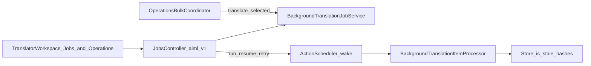

# P2 Jobs / Stale Operator Literacy — Definitive Implementation Plan

**Status:** **FROZEN** (A1–A4) — authoritative P2 specification  
**Frozen:** 2026-08-15  
**Freeze baseline / reconciled main:** `e79ca3e73b809269b45020db307b5ef97286943f`  
**Version during P2:** **1.5.1** (unchanged)  
**TARGET:** **8**  
**Migration:** **NONE**  
**P0:** COMPLETE  
**P1:** COMPLETE — **NO SUPPORTED-CONTRACT DEFECT** ([report](P1_G4_RANK_MATH_MODEL_A_CHARACTERIZATION.md))  
**P2:** NOT STARTED at freeze — this plan authorizes one coherent milestone  
**Release:** **`MILESTONE CLOSURE != RELEASE CLOSURE`** — no automatic release after P2  

**Review verdict applied:** APPROVE WITH AMENDMENTS A1–A4.

---

## 1. Goal

A normal WordPress administrator can **create, monitor, understand, and recover** from ordinary background translation Jobs and stale/conflict situations **without** raw REST, CLI, DB inspection, or internal outcome-code literacy — without weakening concurrency, stale, or conflict fail-safes.

## 2. Baseline identity (reconciled)

| Item | Value |
|---|---|
| HEAD / origin/main at freeze auth | `e79ca3e73b809269b45020db307b5ef97286943f` |
| Version | **1.5.1** |
| TARGET (`Migrator::TARGET`) | **8** |
| P0 Localized URL Operator Completion | COMPLETE |
| P1 G4 Rank Math Model A Characterization | COMPLETE — no supported-contract defect |
| P2 | **NOT STARTED** before this freeze |
| Correctness gate | P1 does **not** defer P2 |

## 3. Frozen amendments A1–A4

### A1 — Multi-post create: outcome not mechanism

**Frozen outcome:** Multi-post ordinary translation must be creatable from the Workspace **without manually supplying segment keys**.

Implementation must:

1. characterize existing `bulk_translate`, `translate_missing`, and Operations bulk flows;
2. choose the **smallest architecture-consistent path**;
3. reuse existing Job/domain authorities;
4. **not** introduce a new Job type.

Do **not** preselect a single mechanism in the freeze. If characterizing the chosen path shows Job semantic/architecture change is required → **STOP for re-review**.

### A2 — Stale copy is state-derived

Do not reduce stale to one universal “visitor shows source” sentence.

Operator copy must derive from the **actual publication/runtime state** of that object/language (e.g. published+stale vs unpublished+stale vs Jobs `stale_source` vs overlay-eligible vs not). Acceptance must exercise **materially different** stale/publication cases that exist in the current lifecycle — not generic source-fallback wording where it is not true.

### A3 — Recovery actions are state- and capability-derived

**Invariant:** Operator actions are derived from **current object/job state and current-user capability**. A control must not appear actionable when the underlying lifecycle authority would reject it.

Applies to Run, Retry, Retranslate, Edit, Publish, Review, and conflict recovery. Acceptance must include **positive and negative** cases.

### A4 — Compact DEV operator acceptance

DEV-only on `https://dev.biopentra.eu` (never production). Operator journeys, not backend-only:

1. create → run → monitor → completion  
2. stale → explanation → appropriate next action  
3. conflict → explanation → safe recovery path  
4. partial completion → understandable counts/status  

Not a large acceptance program.

---

## 4. Current architecture (preserve)



- Host: Translator Workspace Jobs tab + Operations (no new top-level admin).
- Types: `translate_missing`, `retranslate_stale`, `translate_selected`, `bulk_translate`.
- Caps: view/manage/cancel (admin+editor); **run = administrator only** (unchanged).
- Create does **not** auto-wake; **Run now** remains the wake path (clear CTA; no silent always-on wake for all roles).
- Store `is_stale` ≠ Jobs item `stale_source` ≠ `skipped_conflict`.

Key surfaces:

- [`assets/translator-workspace/src/components/JobsPanel.tsx`](../../assets/translator-workspace/src/components/JobsPanel.tsx)
- [`assets/translator-workspace/src/components/CreateJobDialog.tsx`](../../assets/translator-workspace/src/components/CreateJobDialog.tsx)
- [`assets/translator-workspace/src/components/OperationsInspector.tsx`](../../assets/translator-workspace/src/components/OperationsInspector.tsx)
- [`src/Jobs/BackgroundTranslationJobService.php`](../../src/Jobs/BackgroundTranslationJobService.php)
- [`src/Jobs/JobTypes.php`](../../src/Jobs/JobTypes.php)
- [`src/Jobs/JobsCapabilities.php`](../../src/Jobs/JobsCapabilities.php)

## 5. Journey matrix (planning inventory)

| Journey | Classification |
|---|---|
| Create missing/stale (single) | USABLE BUT FRICTION |
| Create multi-post via Jobs UI | ENGINEER-DEPENDENT today → P2 must make merchant-complete (**A1 outcome**) |
| Create `translate_selected` | USABLE BUT FRICTION |
| Monitor | USABLE BUT FRICTION |
| Understand outcomes | ENGINEER-DEPENDENT |
| Recover | USABLE BUT FRICTION (admin) / ENGINEER-DEPENDENT (editor) |
| Stale frontend literacy | MISSING / imprecise → **A2** |
| Bulk ↔ Jobs | USABLE BUT FRICTION |

## 6. Operator outcome taxonomy

| Operator concept | Maps from | Severity | Action required? |
|---|---|---|---|
| Waiting | `queued` | info | Run (if allowed) or wait |
| Running | `running`, `retry_wait` | info | Wait / pause |
| Completed | `completed` | success | Optional review/publish |
| Completed with skips | `completed_with_errors` + skipped/stale item buckets | attention | Inspect items |
| Needs attention — Conflict | item `skipped_conflict` | attention | Safe recovery (no silent overwrite) |
| Needs attention — Source moved | item `stale_source` **or** Store `is_stale` | attention | Distinguish job-mid-flight vs content stale |
| Failed | job/item `failed` | error | Retry failed / inspect provider |
| Cancelled / Paused | `cancelled`, `paused` | info | Resume or leave |

**Hard rule:** never rename/hide `skipped_conflict` truth; map to readable labels + reason + next actions.

## 7. Next-action model (**A3**)

| Situation | Candidate actions (show only if state+cap admit) |
|---|---|
| Queued | Run (admin); Pause/Cancel per caps |
| Store stale + published | Edit / sync Retranslate / enqueue — copy from **published+stale** truth |
| Store stale + unpublished | Edit / retranslate before publish — copy from **unpublished+stale** truth |
| `skipped_conflict` (manual/review) | Workspace detail edit or confirmed sync Retranslate — **no** Jobs overwrite |
| `skipped_conflict` (type/disallow) | Eligible `retranslate_stale` / Operations path only if admitted |
| `stale_source` (job item) | Fresh job after source sync |
| Provider `failed` | Retry failed items (if admitted) |
| Partial job | Inspect skipped/failed counts; deep-link |

## 8. Work packages (one authorization)

WP1–WP5 are **internal packages**. Do not stop between them for separate authorization.

1. **WP1 — Create/monitor:** Achieve A1 multi-post outcome via smallest consistent path after characterization; post-create Run CTA; skipped/stale counts; refresh/poll light; human labels.
2. **WP2 — Stale/conflict:** A2 state-derived explanations; conflict reason + safe recovery; A3 action gating.
3. **WP3 — Cross-link taxonomy:** Shared labels; Job ↔ Operations/Workspace deep-links where architecture-consistent (respect existing PluginGuard constraints on Jobs→Ops enrichment).
4. **WP4 — Tests/docs/PluginGuard:** permissions, no secrets, bounded list queries, runbook update, PluginGuard (no TARGET/schema; no silent overwrite; no new Job engine).
5. **WP5 — Review/remediation/merge/closure** including **A4 DEV acceptance**.

## 9. Thin seams (permitted)

Smallest seam to expose existing authorities for A1 and presentation/action gating. **Not** a STOP by itself.

A thin seam is allowed only if it:

- delegates to existing service/domain authority
- does not introduce a new Job type
- does not change execution / stale / concurrency / provider / publication semantics
- does not create silent overwrite
- does not require schema/TARGET change
- does not expand public API

**STOP** if A1 requires Job semantic redesign, new Job type as product expansion, concurrency change, or silent overwrite.

## 10. Permissions / performance (frozen)

- Editors do **not** gain `aiml_run_translation_jobs`.
- No provider secrets in Job details/UI.
- Keep existing pagination; no unbounded stale warehouse queries for list views.
- Progress counts from already-persisted job summary columns — surface them; do not rescan Store for list views.

## 11. Outcomes (P2OC)

| ID | Outcome |
|---|---|
| P2OC1 | Ordinary Job types creatable from Workspace without REST/CLI |
| P2OC1b | **A1:** Multi-post ordinary translation creatable without manual segment keys |
| P2OC2 | Clear Job state/progress including skipped/stale counts |
| P2OC3 | Outcome codes → operator language without hiding truth |
| P2OC4 | **A2:** Stale explains why + **actual** frontend/publication consequence for that state + safe next actions |
| P2OC5 | Conflict/`skipped_conflict` explains protection + available actions |
| P2OC6 | **A3:** Recovery actions shown only when state+capability admit |
| P2OC7 | Partial completion ≠ total failure |
| P2OC8 | CLI not required for ordinary AC |
| P2OC9 | No guard/concurrency/stale/publication semantic weakened |
| P2OC10 | Docs match UI terminology |

## 12. Acceptance (P2AC)

- P2AC1: Create missing/stale end-to-end (create + Run for admin).
- P2AC2: **A1** multi-post path without manual segment keys (mechanism not prescribed at freeze).
- P2AC3: Progress shows completed/failed/skipped/stale counts.
- P2AC4: `skipped_conflict` human label + reason + next action; fail-safe tests green.
- P2AC5: **A2** stale notices for materially different publication/runtime cases (at least published+stale and unpublished+stale); no false universal source-fallback claim.
- P2AC6: Jobs ↔ Operations deep-link (Ops→Jobs Supported; reverse only if architecture-consistent).
- P2AC7: Consistent terminology.
- P2AC8: Caps unchanged (editors cannot Run).
- P2AC9: **A3** positive+negative action visibility (e.g. Run hidden without cap; Retranslate/Publish hidden when ineligible).
- P2AC10: No secrets; bounded pagination.
- P2AC11: CLI not required for P2AC1–P2AC7, P2AC9.
- P2AC12: Engine/AS/Store hash semantics unchanged (PluginGuard).
- P2AC13: TARGET 8; migration NONE; version 1.5.1 during P2.
- P2AC14: Automated validation + independent review PASS.
- P2AC15: **A4** compact DEV operator acceptance (four journeys) documented.

## 13. Explicit exclusions

P1/SEO/G4 implementation, Strategy F redesign, P0 LU lifecycle redesign, new Job/queue engine, provider redesign, TM redesign, concurrency/stale semantic redesign, silent overwrite, new Job types without product decision, bulk CLI create parity, public API expansion, schema/TARGET/version bump, release, deploy, production mutation.

## 14. Architecture STOP conditions

STOP and request re-review if P2 requires:

1. new Job execution architecture  
2. new queue system  
3. new Job type  
4. concurrency semantic redesign  
5. stale semantic redesign  
6. publication-policy redesign  
7. provider execution redesign  
8. new DB schema / TARGET change  
9. major new admin architecture  
10. absorbing P1/SEO/G4, Strategy F, or LU redesign  
11. public API expansion  
12. silent conflict overwrite  
13. A1 characterization proving Job semantic/architecture change is required  

## 15. Size / risk / release

| Dimension | Verdict |
|---|---|
| Size | **Medium** (presentation + workflow; at most thin seam) |
| Risk | **Medium-low**; highest residual risk = A1 path choice |
| STATE / TARGET / Migration | unchanged / **8** / **NONE** |
| Release | Accumulate with P0/P1 on unreleased main; release only when separately justified |

## 16. Test / DEV strategy

- Extend Workspace JS unit tests for labels/next-actions/A2/A3; integration for multi-post create resolve + conflict fail-safe regressions.
- PluginGuard: no TARGET bump; no silent overwrite; Jobs create still domain-owned.
- **A4** DEV browser smoke on **dev.biopentra.eu only** after identity verification (`siteurl` / `home` / `WP_HOME`).

## 17. Authorized execution sequence

```
reconcile
→ materialize/freeze this plan
→ feature branch
→ WP1–WP5
→ validate
→ A4 DEV acceptance
→ independent review + in-scope remediation
→ PR → merge → fresh main CI
→ closure docs
→ STOP
```

No separate authorization between WP1–WP5.

## 18. Exact next step after freeze merge

Create `feature/p2-jobs-stale-operator-literacy` from post-freeze main and implement WP1–WP5 through closure under the one P2 authorization. Do not bump version, tag, release, or touch production.
