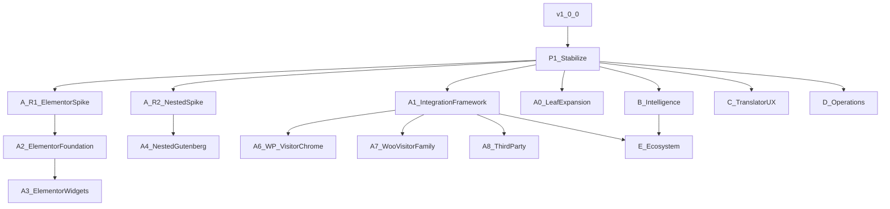

# Post-v1 Platform Roadmap — AI Multilingual

**Roadmap version:** **v1.0** (frozen strategic baseline)
**Status:** Canonical long-term product roadmap — **frozen**
**Baseline:** AI Multilingual Platform **v1.0.0**
**Supersedes:** [POST_V1_PRODUCT_ROADMAP.md](POST_V1_PRODUCT_ROADMAP.md) (historical — v1 platform-track planning only)
**Planning model:** Durable programs (P1, A–E). Strategy F / F15+ numbering is retired. Classic M4–M7 themes are absorbed into programs.
**Scope of this document:** Product strategy, program boundaries, milestone ordering, dependencies, freezes, governance.
**Out of scope here:** Implementation plans, ADRs, schemas, APIs, code.

---

## 1. Executive summary

v1.0.0 delivered a scoped, production-ready platform: Gutenberg leaf translation, Translator Workspace, Translation Memory, Glossary, Review Workflow, Background Translation Jobs, Rollout/GA, REST/CLI/diagnostics, and OpenAI via a provider-neutral framework.

Long-term evolution is **not** an automatic feature chain. It is **P1 Platform Stabilization**, then five programs:

| ID | Program | Expands |
|---|---|---|
| **P1** | Platform Stabilization | Reliability of what shipped |
| **A** | Translation Coverage | *What* visitor-facing surfaces can be translated |
| **B** | Translation Intelligence | *How* AI, assets, and quality signals improve |
| **C** | Translator Experience | *How* operators work in Workspace/review |
| **D** | Operations | *How* the platform is run safely at scale |
| **E** | Platform Ecosystem | *Who else* can extend the platform safely |

**First milestone after v1.0.0:** P1 Platform Stabilization — **complete** (merged).
**Coverage research:** A.R1 Elementor identity spike — **complete**; ADR-0016 **Accepted**. **A.2 Elementor Foundation** — **complete** (merged + tagged `a2-elementor-foundation-complete`). **A.3 Elementor Widget Coverage** — [plan](A3_ELEMENTOR_WIDGET_COVERAGE_IMPLEMENTATION_PLAN.md) (**Complete / merged / tagged** `a3-elementor-widget-coverage-complete`). [validation log PASS](A3_ELEMENTOR_WIDGET_COVERAGE_VALIDATION_LOG.md). **A.R2 Nested Gutenberg Identity** — [research log](A4_NESTED_GUTENBERG_IDENTITY_RESEARCH_LOG.md) (**CONDITIONAL GO**; tag `ar2-nested-gutenberg-identity-research-complete`); **F5 PASS** for bounded surface. **A.4 Nested Gutenberg** — [implementation plan](A4_NESTED_GUTENBERG_IMPLEMENTATION_PLAN.md); [validation log PASS](A4_NESTED_GUTENBERG_VALIDATION_LOG.md) (**Complete / merged / tagged** `a4-nested-gutenberg-complete`). **A.1 Plugin Integration Framework** — [implementation plan](A1_PLUGIN_INTEGRATION_FRAMEWORK_IMPLEMENTATION_PLAN.md); [ADR-0017](../adr/0017-plugin-integration-framework-ownership-and-identity.md) (**Accepted**); implementation **authorized**, **not started**. Parallel as prioritized: **A.0**.

---

## 2. Now / Next / Later

Navigation aid only. Does not replace the detailed programs below.

### NOW

- Platform **v1.0.0** released; **P1 Platform Stabilization complete** on `main`
- **A.R1** Elementor Identity Research Spike **complete**; [ADR-0016](../adr/0016-elementor-identity-and-ownership.md) **Accepted**
- **A.3** — [validation log PASS](A3_ELEMENTOR_WIDGET_COVERAGE_VALIDATION_LOG.md) (**complete / merged / tagged**). **A.2** — [validation log PASS](A2_ELEMENTOR_FOUNDATION_VALIDATION_LOG.md) (**complete / merged**)
- **A.R2** — [research log](A4_NESTED_GUTENBERG_IDENTITY_RESEARCH_LOG.md) (**CONDITIONAL GO**; complete; tag `ar2-nested-gutenberg-identity-research-complete`); **F5 PASS** for bounded surface
- **A.4** — [implementation plan](A4_NESTED_GUTENBERG_IMPLEMENTATION_PLAN.md); [validation log PASS](A4_NESTED_GUTENBERG_VALIDATION_LOG.md) (**complete / merged / tagged** `a4-nested-gutenberg-complete`); Navigation/shared/dynamic remain deferred
- **A.1** — [implementation plan](A1_PLUGIN_INTEGRATION_FRAMEWORK_IMPLEMENTATION_PLAN.md); [ADR-0017](../adr/0017-plugin-integration-framework-ownership-and-identity.md) (**Accepted**); implementation **authorized**, **not started**

### NEXT

- Implement **A.1** (A10–A18); **A.0** additional Gutenberg leaf blocks and fields (as prioritized)
- Early **B.1** additional providers
- Early **C.1–C.3** Workspace productivity
- Early **D.1** unified health/diagnostics

### LATER

- Nested Gutenberg deferred admissions (citation/summary/pullquote/gallery; parent list-item+innerBlocks)
- Navigation / Query / reusable (require separate ADR if pursued)
- Elementor widget coverage beyond first A.3 surface
- WordPress visitor chrome (navigation, theme/widgets, declared residual strings)
- WooCommerce visitor-facing coverage family
- Deeper Intelligence, Translator Experience, Operations, and Ecosystem milestones through **v1.1.x → v1.3.x**
- Breaking changes only under an explicit **v2.0** gate

---

## 3. Architectural vision

AI Multilingual should become a complete **visitor-facing** translation platform for WordPress: capable of translating every public surface visitors see, while preserving deterministic extraction, stable identities, provider-neutral AI integration, reusable translation assets (Store, Translation Memory, Glossary), and clear ownership boundaries between the platform and external plugins.

### Hard scope boundaries

- **Only visitor-facing output** is in scope
- **wp-admin is not translated**
- **Internal operator interfaces are not translated** (Workspace, Settings, diagnostics remain operator tooling—not localization targets—unless a future major product decision reopens this)
- Prefer **deterministic adapters and registered integration contracts** over scraping arbitrary HTML
- Preserve **overlay-not-duplication**: translations are presentation overlays; canonical WordPress / WooCommerce persistence is never rewritten for translation storage

### Frozen platform principles

These are permanent architectural principles. Breaking them requires an explicit major-version decision (typically **v2.0**) and ADR-level acceptance—not routine roadmap work.

1. **Overlay storage** — No translation writes to `wp_posts`, `wp_postmeta`, or WooCommerce tables as a translation mechanism.
2. **Store as source of truth** for translation segments (including the review axis).
3. **UUID / segment identity grammar** and document-local ownership; no fuzzy rematch as identity recovery.
4. **Deterministic identity (invariant)** — Every visitor-facing translation must originate from a **deterministic identity**. This principle underpins extraction, Storage, Translation Memory, Glossary, Review Workflow, Background Jobs, rendering, and all future integrations. Surfaces without a stable, deterministic identity are out of scope until an identity model exists.
5. **Non-ownership of foreign persistence** — AI Multilingual **never assumes ownership of another plugin’s persistence model**. Integrations adapt to external content; they do not replace, duplicate, or silently rewrite another plugin’s storage.
6. **TM separate** from Store; approval-gated write-back.
7. **Glossary as platform lexicon**; providers consume fragments only.
8. **Sole suggestion path** via `TranslationSuggestionService`.
9. **Provider-agnostic domain interface**; vendor shapes stay inside providers.
10. **Jobs own orchestration**; Store owns content; workers do not write TM.
11. **Render-safety gate**; uncertainty falls back to source; no second render pipeline.
12. **Rollout/GA policy model** and F10/F11 REST ViewModel contracts (breaking changes → `/aiml/v2/` or v2.0).
13. **Prefix-strip routing**; three-state languages; no fallback chains.
14. **PluginGuard-class invariants** (no competing i18n plugins; confined data access).

---

## 4. Milestone type legend

Every milestone is classified as exactly one of:

| Type | Meaning |
|---|---|
| **Research Spike** | Timeboxed investigation; may recommend a future ADR; no product behavior commitment |
| **Architecture Milestone** | Establishes or freezes an identity/integration/contract model |
| **Product Milestone** | Ships operator- or visitor-visible capability within frozen contracts |
| **Operational Milestone** | Improves deployability, observability, maintenance, or data mobility |

Types aid planning. They do not change ordering.

---

## 5. Program overview

### P1 — Platform Stabilization

**Purpose:** Make v1.0.0 reliable in production before expanding surface area.
**Why:** A just-released platform needs deploy evidence and ops discipline more than new extractors.
**Success:** Controlled production validation; schema target 6 confirmed; rollback/kill-switch rehearsal current; docs match shipped surfaces; render cache remains off until a measured GO.
**Boundaries:** Fixes, docs, packaging, diagnostics clarity, provider compatibility—no new identity families.
**Size / risk:** Small / Low.
**Implementation plan:** [P1_PLATFORM_STABILIZATION_IMPLEMENTATION_PLAN.md](P1_PLATFORM_STABILIZATION_IMPLEMENTATION_PLAN.md) — **Complete / merged**.
**Validation log:** [P1_PLATFORM_STABILIZATION_VALIDATION_LOG.md](P1_PLATFORM_STABILIZATION_VALIDATION_LOG.md) **PASS**.

| ID | Milestone | Type |
|---|---|---|
| P1.1 | Production deployment validation | Operational |
| P1.2 | Ops and documentation alignment | Operational |
| P1.3 | Standing v1.0.x maintenance cadence | Operational |

### Program A — Translation Coverage

**Purpose:** Expand deterministic visitor-facing coverage.
**Why:** v1 covers seven Gutenberg leaves; Elementor, nested blocks, WP chrome, WooCommerce, and third-party surfaces remain the multi-year value.
**Size / risk:** Largest program / High (especially Elementor and nested identity).

**Long-term completion statement:**
Program A is considered **complete** when AI Multilingual can translate **essentially every visitor-facing surface** of a modern WordPress installation through **deterministic integrations** rather than HTML scraping—while respecting plugin ownership and the frozen identity/overlay principles above. Completion is a strategic end-state, not a single release.

**Architectural boundaries:** Visitor-facing only; adapters/integrations only; no wp-admin; no scrape-first approaches; Elementor/nested product work only after their research spikes (and subsequent ADR acceptance outside this document).

| ID | Milestone | Type |
|---|---|---|
| A.R1 | Elementor Identity Research Spike | Research Spike — **Complete**; [plan](AR1_ELEMENTOR_IDENTITY_RESEARCH_SPIKE.md); [research log](AR1_ELEMENTOR_IDENTITY_RESEARCH_LOG.md) (**CONDITIONAL GO**); [ADR-0016](../adr/0016-elementor-identity-and-ownership.md) **Accepted**; A.2 planning authorized; Elementor production implementation not started |
| A.R2 | Nested Gutenberg Identity Research Spike | Research Spike — **Complete**; [charter](A4_NESTED_GUTENBERG_IDENTITY_PLAN.md); [research log](A4_NESTED_GUTENBERG_IDENTITY_RESEARCH_LOG.md) (**CONDITIONAL GO**); tag `ar2-nested-gutenberg-identity-research-complete`; **F5 PASS** for bounded surface |
| A.1 | Plugin Integration Framework | Architecture — [implementation plan](A1_PLUGIN_INTEGRATION_FRAMEWORK_IMPLEMENTATION_PLAN.md); [ADR-0017](../adr/0017-plugin-integration-framework-ownership-and-identity.md) (**Accepted**); implementation authorized, not started |
| A.0 | Additional Gutenberg leaf blocks and fields | Product |
| A.2 | Elementor Foundation (post–identity decision) | Architecture — **Complete** — [plan](A2_ELEMENTOR_FOUNDATION_IMPLEMENTATION_PLAN.md); [validation log PASS](A2_ELEMENTOR_FOUNDATION_VALIDATION_LOG.md); tag `a2-elementor-foundation-complete` |
| A.3 | Elementor Widget Coverage (incremental allowlist) | Product — [plan](A3_ELEMENTOR_WIDGET_COVERAGE_IMPLEMENTATION_PLAN.md) (**Complete / merged / tagged** `a3-elementor-widget-coverage-complete`) |
| A.4 | Nested / container Gutenberg identity (post–identity decision) | Architecture — **Complete** — [implementation plan](A4_NESTED_GUTENBERG_IMPLEMENTATION_PLAN.md); [validation log PASS](A4_NESTED_GUTENBERG_VALIDATION_LOG.md); tag `a4-nested-gutenberg-complete`; no new ADR |
| A.6 | WordPress visitor chrome family (see §6.1) | Product |
| A.7 | WooCommerce visitor-facing coverage family (see §6.2) | Product |
| A.8 | Third-party plugin bridges (via A.1) | Product |
| A.SEO | Visitor SEO adapters (hreflang/title/alternates) | Product |

### Program B — Translation Intelligence

**Purpose:** Improve provider choice, quality signals, terminology use, resilience, and AI cost/effectiveness.
**Why:** v1 ships OpenAI-first with a frozen provider framework; quality loop exists but intelligence depth is thin.
**Naming:** **Translation Intelligence** is retained. Alternatives considered:

- *Translation Quality* — too narrow (omits providers, health, optimisation, retranslation policy)
- *AI & Translation Quality* — redundant and still under-represents the provider ecosystem

“Intelligence” correctly spans providers, prompts, terminology, confidence, benchmarking, assisted review, and optimisation without broadening into Workspace UX (Program C) or Coverage (Program A).

**Boundaries:** All providers behind the domain interface; suggestions only via the sole suggestion path; no visitor-triggered AI; confidence is advisory unless a future major decision changes publish policy.

| ID | Milestone | Type |
|---|---|---|
| B.1 | Additional AI providers | Product |
| B.2 | Provider health, capabilities, and resilience | Operational |
| B.3 | Prompt profiles and style guides | Product |
| B.4 | Terminology intelligence (glossary depth) | Product |
| B.5 | Confidence / quality scoring and AI-assisted review (advisory) | Product |
| B.6 | Provider quality benchmarking | Operational |
| B.7 | Automatic retranslation policies (human/review gates preserved) | Product |
| B.8 | AI optimisation (batching, identical-segment reuse, cost controls) | Product |

### Program C — Translator Experience

**Purpose:** Make Workspace and review the fastest path from source to approved target.
**Why:** v1 Workspace is capable but MVP; Coverage gains multiply with operator speed.
**Boundaries:** Operator UI only; no second editor; no assignment/collaboration platform unless product reopen; REST remains ViewModels.

| ID | Milestone | Type |
|---|---|---|
| C.1 | Workspace UX polish (including accessibility) | Product |
| C.2 | Filtering and segment triage at scale | Product |
| C.3 | Keyboard shortcuts and batch productivity | Product |
| C.4 | Reviewer dashboard / queue UX | Product |
| C.5 | Translator dashboard (workload/progress; not billing) | Product |
| C.6 | Terminology assistance UX | Product |
| C.7 | Conflict / stale resolution UX | Product |

### Program D — Operations

**Purpose:** Run the platform safely as coverage and volume grow.
**Why:** Diagnostics exist but are siloed; import/export and deep analytics remain open.
**Boundaries:** No secrets in diagnostics; export/import must preserve overlay invariants; not a billing product.

| ID | Milestone | Type |
|---|---|---|
| D.1 | Unified health, diagnostics, and health reporting | Operational |
| D.2 | Monitoring and observability | Operational |
| D.3 | Cost analytics | Operational |
| D.4 | Performance analytics (after performance research as needed) | Operational |
| D.5 | Self-tests / soak harnesses | Operational |
| D.6 | Maintenance and safe repair tooling | Operational |
| D.7 | Export / import of translation assets | Operational |
| D.8 | Backup / restore posture (procedures and integrity checks; not a second SoT) | Operational |
| D.9 | Render-cache enablement gate (measured + product GO) | Operational |

### Program E — Platform Ecosystem

**Purpose:** Let third parties extend Coverage and Intelligence without forking core.
**Why:** Long-term Coverage depends on external adapters and providers.
**Boundaries:** Public contracts only; samples obey PluginGuard-class rules; no scraping SDK.

| ID | Milestone | Type |
|---|---|---|
| E.0 | Public contract catalog (frozen vs extensible) | Architecture |
| E.1 | Developer documentation | Product |
| E.2 | Adapter SDK | Product |
| E.3 | Provider SDK | Product |
| E.4 | Integration SDK | Product |
| E.5 | Sample plugins | Product |
| E.6 | Testing toolkit and certification bar | Operational |

---

## 6. Program A detail — visitor-facing coverage families

Ownership reminder: **plugins remain responsible for content they own.** AI Multilingual integrates through deterministic adapters. It does not scrape arbitrary HTML and does not take over foreign persistence (principle 5).

### 6.1 WordPress visitor chrome (A.6 family)

Logical product surfaces (not an implementation design):

- Navigation / menus
- Visitor-visible widgets and theme chrome
- Declared residual visitor strings (gettext / shortcode bridges **only** where an owner-declared deterministic identity exists)

These may ship as sequential slices under A.6; they are one family for planning.

### 6.2 WooCommerce visitor-facing coverage (A.7 family)

WooCommerce is **not** a single milestone. It is a **family of visitor-facing surfaces**. AI Multilingual translates **visitor-facing WooCommerce content**. It does **not** translate WooCommerce administration.

Illustrative visitor-facing surfaces (admit via deterministic integrations):

- Product pages
- Product archives
- Attributes (visitor display)
- Variations (visitor display)
- Cart
- Mini-cart
- Checkout (display)
- Customer account (visitor/customer views)
- Order views (customer-facing)
- Customer-facing emails
- Search (visitor results/labels in scope)
- Storefront notices

**Suggested planning waves (ordering unchanged in spirit—catalog before highly dynamic commerce chrome):**

| Wave | Focus | Type |
|---|---|---|
| A.7a | Product pages, archives, attributes, variations (visitor) | Product |
| A.7b | Cart, mini-cart, checkout display, storefront notices | Product |
| A.7c | Customer account, order views, customer-facing emails | Product |
| A.7d | Search and remaining visitor chrome | Product |

Waves may slip across minors; the family definition is stable.

### 6.3 Third-party and SEO

- **A.8** — One third-party bridge at a time via A.1
- **A.SEO** — Late, low coupling to editor identity work

---

## 7. Dependencies and parallel work

| Must serialize | May run in parallel after P1.1 |
|---|---|
| A.R1 → A.2 → A.3 | A.R1 ∥ A.R2 ∥ A.1 ∥ A.0 |
| A.R2 → A.4 | Early B, C, D |
| A.1 → A.6 / A.7 / A.8 / E | Elementor path ∥ Nested path |

**Safely deferred:** media translation, multi-site, collaboration/assignments, billing platforms, percentage visitor cohorts, translating operator UI, HTML scraping approaches, early export/import (prefer after major identity families exist).

### Research spikes (named only; no ADRs here)

| Topic | Classification |
|---|---|
| Elementor identity | Research Spike → future ADR → A.2 |
| Nested Gutenberg identity | A.R2 **complete** → **F5 PASS** → A.4 [implementation](A4_NESTED_GUTENBERG_IMPLEMENTATION_PLAN.md) + [validation PASS](A4_NESTED_GUTENBERG_VALIDATION_LOG.md) (**complete / merged / tagged** `a4-nested-gutenberg-complete`) |
| Large-scale performance | Research Spike before deep D.4 / D.9 |
| Provider transport evolution (e.g. Responses API) | Optional Research Spike; default remains current Chat Completions integration until proven |

---

## 8. Release strategy

| Lane | Contains | Guardrail |
|---|---|---|
| **v1.0.x** | P1; security; provider quirks; thin ops/docs | No new identity families |
| **v1.1.x** | A.1, A.0, A.R1/A.R2 as research; B.1–B.2; C.1–C.3; D.1–D.3, D.5; E.0–E.2 | A.2 code only after Elementor identity decision |
| **v1.2.x** | A.2–A.4; A.6 slices; A.7a (+ optional A.7b); B.3–B.6; C.4–C.7; D.4, D.6; E.3–E.5 | Coverage maturity *starts*, not finishes |
| **v1.3.x** | Remaining A.7 waves, A.8, A.SEO; B.7–B.8; D.7–D.9; E.6 | Avoid stuffing all Coverage into 1.2 |
| **v2.0** | Breaking frozen principles/contracts only | Explicit major-version gate |

Minor versions remain **additive** to frozen contracts.

---

## 9. Architecture freeze points

| Freeze | Why | Frozen | Flexible |
|---|---|---|---|
| **F0 — v1 contracts** | Protect the shipped platform | Principles in §3 | Additive allowlists, providers, UX, diagnostics |
| **F1 — after P1** | Production baseline | Deploy/rollback discipline | Bugfix lane |
| **F2 — after A.1 + E.0** | Integration vocabulary | Ownership rules; no-scrape; non-ownership of foreign persistence | Which bridges ship |
| **F3 — Elementor identity accepted** | Before A.2 coding | Elementor identity model | Widget allowlist |
| **F4 — after A.2** | Before widget sprawl | Foundation contracts | A.3 growth |
| **F5 — Nested identity accepted** | Before A.4 coding | Container identity rules for bounded surface (**PASS**) | Which deferred families admit later |
| **F6 — after meaningful A.3 + A.4** | Mid-term Coverage | Editor coverage architecture | Woo/chrome waves |
| **F7 — before D.7** | Data mobility | Export integrity principles | Tooling UX |
| **F8 — before v2.0** | Major gate | Decision to break F0 | Entire v2 program |

---

## 10. Risks

- Elementor identity cost versus merchant urgency
- Nested recursion and render false-positive risk
- WooCommerce surface sprawl (especially cart/checkout/email)
- Temptation to scrape gettext/shortcode HTML
- Public SDK permanence mistakes
- Early export/import corrupting overlays
- Premature render-cache enablement
- Scope creep into wp-admin or operator UI translation
- Provider and prompt drift

---

## 11. Roadmap end-state

At maturity, AI Multilingual is a translation platform that can cover **virtually every visitor-facing experience** in a WordPress installation—editor content, theme chrome, commerce display, customer communications, and declared third-party surfaces—while remaining:

- **deterministic** in identity and extraction,
- **provider-neutral** in AI integration,
- **plugin-friendly** in ownership (adapt, do not annex persistence),
- **operationally safe** under rollout, jobs, diagnostics, and repair discipline.

That end-state is approached through programs A–E after P1; it is not a single milestone and not a license to scrape or to translate administration screens.

---

## 12. First milestone and stopping guidance

**Start:** P1.1 Production deployment validation — see [P1_PLATFORM_STABILIZATION_IMPLEMENTATION_PLAN.md](P1_PLATFORM_STABILIZATION_IMPLEMENTATION_PLAN.md).
**Then:** A.R1 + A.R2 + A.1 + A.0 in parallel with early B/C/D.
**Stop and freeze** at the points in §9 before opening the next identity family or data-mobility surface.

---

## 13. Governance

This document is the **sole canonical long-term product roadmap** for AI Multilingual after Platform v1.0.0. Earlier post-v1 planning documents are historical archives and must not be extended as competing strategy.

### Evolution rules (frozen)

- **Programs are intended to remain stable.** P1 and Programs A–E are the durable planning structure. Do not invent parallel program taxonomies for routine work.
- **Milestone ordering may change only with explicit architectural or product justification.** Reordering is exceptional; document the justification in the revision history.
- **New milestones should normally be additive** rather than restructuring existing programs. Prefer appending or inserting within a program over renaming or splitting programs.
- **Future implementation plans must reference the roadmap milestone they implement** (for example `A.2`, `B.1`, `P1.1`). Plans that cannot name a milestone are out of process.
- **Research spikes should precede architecture-heavy implementation** where this roadmap identifies a Research Spike (notably Elementor identity and nested Gutenberg identity).
- **Architecture freezes (this roadmap §9) and ADRs remain the mechanism for locking technical decisions.** The roadmap does not replace ADRs; ADRs do not replace this roadmap.

### What this roadmap does not govern

Day-to-day bugfixes, security patches, and v1.0.x maintenance under P1.3 do not require roadmap revision. They must still respect frozen platform principles (§3).

---

## 14. Maintenance policy

- **Minor editorial improvements** (clarity, typos, cross-links, Now/Next/Later refresh) may occur **without** changing roadmap intent and without bumping the major roadmap version.
- **Product priorities may evolve** within the existing program structure (for example which additive milestone is scheduled next). Reflect priority shifts in Now/Next/Later and the revision history.
- **Major structural changes** (new programs, removal of a program, wholesale reordering, redefinition of frozen principles) require an **explicit roadmap revision** and a roadmap version bump (for example v1.0 → v1.1 or v2.0 for structural breaks).
- **Historical milestone records remain valid** even if future priorities change. Completed spikes, freezes, and shipped milestones are not rewritten out of history; supersession is additive commentary only.

---

## 15. Revision history

| Roadmap version | Date | Summary |
|---|---|---|
| **v1.0** | 2026-08-06 | Initial frozen canonical long-term roadmap (programs P1, A–E; governance and maintenance policy). |
| v1.0 (editorial) | 2026-08-06 | Linked P1 implementation plan under Program P1 / Now (no structural change). |
| v1.0 (editorial) | 2026-08-06 | P1 marked complete/merged; Now/Next advances to A.R1 planning (no structural change). |
| v1.0 (editorial) | 2026-08-07 | A.4 Nested Gutenberg marked complete/merged/tagged `a4-nested-gutenberg-complete`; Now/Next advances to A.1 / A.0 (no structural change). |
| v1.0 (editorial) | 2026-08-07 | A.1 Plugin Integration Framework plan linked; implementation not started; ADR-0017 required before A11+ (no structural change). |
| v1.0 (editorial) | 2026-08-07 | ADR-0017 Accepted; A.1 implementation authorized; coding not started (no structural change). |

---

## Document control

| Item | Value |
|---|---|
| Canonical path | `docs/plans/POST_V1_PLATFORM_ROADMAP.md` |
| Roadmap version | **v1.0** |
| Governance | §13–§14 |
| Replaces | Milestone-by-milestone / F15-style planning for post-v1 work |
| Historical companion | `docs/plans/POST_V1_PRODUCT_ROADMAP.md` (v1 platform-track archive) |
| Classic milestone table | `docs/ROADMAP.md` (historical M0–M7 + Strategy F status; points here for long-term planning) |
