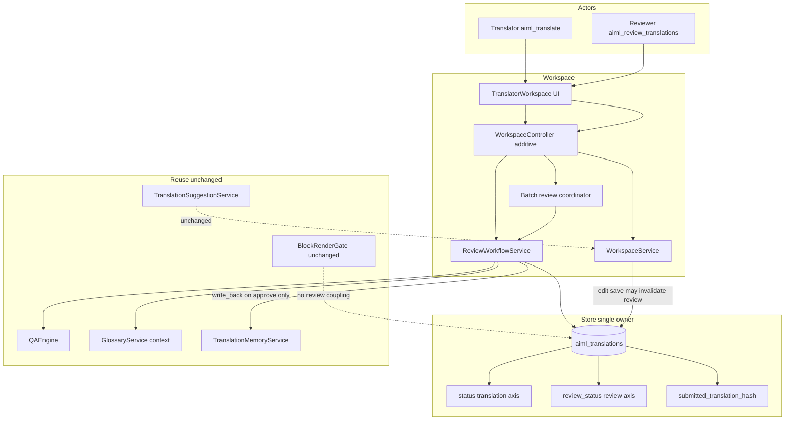
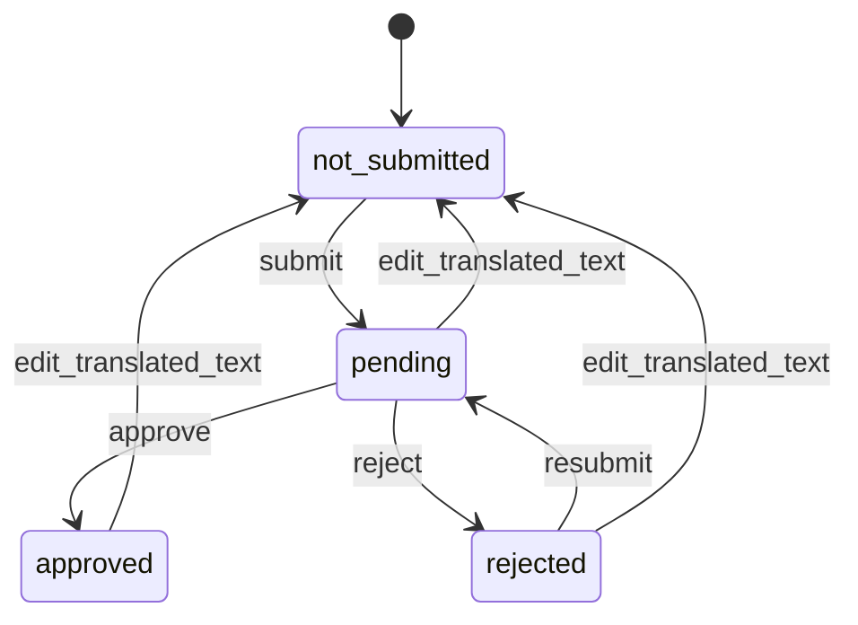

# Review Workflow — Implementation Plan

**Status:** Architecture **frozen**; **ADR-0015 Accepted** (2026-08-05) — **R1 implementation authorized**  
**Branch:** `feature/review-workflow`  
**Baseline:** `main` after Review planning merge  
**ADR:** [0015-review-workflow-and-tm-approval-policy.md](../adr/0015-review-workflow-and-tm-approval-policy.md) — **Accepted**  
**Product parent:** [POST_V1_PRODUCT_ROADMAP.md](POST_V1_PRODUCT_ROADMAP.md) §11.2  
**Prior freezes:** [F11_FROZEN_API.md](F11_FROZEN_API.md), [GLOSSARY_MVP_IMPLEMENTATION_PLAN.md](GLOSSARY_MVP_IMPLEMENTATION_PLAN.md)

**R0 gate:** **PASS** — ADR-0015 Accepted — R1 implementation authorized.  
**R1 status:** **PASS** — Migrator `TARGET=5`; additive review columns + `lang_review_queue`.
**R2 status:** **PASS** — Store review metadata, invalidate-on-edit, no-op preserve.
**R3 status:** **PASS** — ReviewWorkflowService submit/approve/reject transitions, hash conflicts, reason validation.
**R4 status:** **PASS** — `aiml_review_translations` capability; submit/approve/reject/batch-review/review-queue REST routes; additive ViewModel fields; Store-derived paginated queue; `ReviewBatchCoordinator`; QA-gated approval reusing the Workspace QA path.
**Implementation scope / WP order (R0–R7):** Unchanged.

---

## 1. Purpose

Deliver a **human approval layer** on the existing Translator Workspace so merchants can require review before translations become TM-eligible under policy — without building a second editor, second Store, second suggestion pipeline, or changing frontend rendering.

Review never replaces translation. Translators create and correct text; reviewers approve or reject with a required reason.

---

## 2. Success definition

Review Workflow MVP succeeds when:

1. Translators can **submit** eligible translations for review.
2. Reviewers with `aiml_review_translations` can **approve** or **reject** (required reason) pending items.
3. Store remains the **single owner** of translation rows and review metadata (no review/queue/comment tables).
4. Translation `status` and review `review_status` are **independent axes**.
5. The review queue is a **filtered Store view**, not an assignment system.
6. Approval/rejection never rewrite source/translated text.
7. Successful translated-text edits **invalidate** prior review decisions.
8. Approve/reject use **submitted_translation_hash** concurrency (HTTP 409 on drift).
9. TM write-back for new eligible content occurs **only after approval** (F11 amendment).
10. Historical TM entries are **not** deleted on reject.
11. Frontend render eligibility is **unchanged** by review state.
12. QA/Glossary appear as **read-only context** during review; no second QA/glossary pipeline.
13. Audit and bounded diagnostics exist with privacy rules.
14. F10/F11 REST contracts remain additive-compatible.
15. ADR-0015 gate is satisfied before schema/code (R1).

---

## 3. Architecture overview

**Frozen ownership:**

| Asset | Owner | May not |
|---|---|---|
| Translation text + `status` | Store | Be rewritten by approve/reject |
| Review lifecycle + rejection reason | Store (additive columns) | Live in a second review table |
| Review queue | Query over Store | Be a persisted assignment queue |
| TM | TranslationMemoryService | Be written for pending/rejected; be deleted on reject |
| Suggestions | TranslationSuggestionService | Gain a parallel review suggestion path |
| Render | BlockRenderGate / FrontendRenderer | Gain Review Workflow branches in MVP |

---

## 4. Review lifecycle

### 4.1 Legal transitions (`review_status`)

| From | To | Operation | Actor |
|---|---|---|---|
| `not_submitted` | `pending` | submit | translator |
| `rejected` | `pending` | resubmit | translator |
| `pending` | `approved` | approve | reviewer |
| `pending` | `rejected` | reject (reason required) | reviewer |
| `approved` / `rejected` / `pending` | `not_submitted` | successful translated-text change | translator save path |
| `approved` | `pending` | only after invalidate → `not_submitted`, then submit | translator |

### 4.2 Illegal transitions (stable errors)

| Case | Error code (additive) | HTTP |
|---|---|---|
| Approve when not `pending` | `aiml_review_not_pending` | 422 |
| Reject when not `pending` | `aiml_review_not_pending` | 422 |
| Submit when already `pending` and text unchanged | `aiml_review_already_pending` | 422 |
| Submit without eligible translated text | `aiml_review_invalid_translation` | 422 |
| Translator approve/reject | `aiml_forbidden` | 403 |
| Reviewer changing text via review action | `aiml_review_read_only` | 403 |
| Submitted hash mismatch | `aiml_review_conflict` | 409 |
| Expected `review_status` mismatch | `aiml_review_conflict` | 409 |
| Missing/blank rejection reason | `aiml_review_reason_required` | 422 |
| QA errors block approve (when policy on) | `aiml_qa_blocked` | 422 |
| QA service failure on approve | `aiml_review_qa_unavailable` | 503 |

### 4.3 Idempotency

- **Duplicate approve** on already `approved` with matching hash → **200** no-op (no second TM write-back).
- **Duplicate reject** on already `rejected` with same reason + matching hash → **200** no-op.
- Approve/reject against wrong expected status → **409/422**, not silent coerce.

### 4.4 Operations are separate

- Edit/save ≠ submit ≠ approve ≠ reject.
- Approve/reject **must not** rewrite `source_text`, `translated_text`, `source_hash`, provider/origin fields, or translation `status`.
- Reject **preserves** submitted translation text for correction.

---

## 5. State model (two-axis)

### 5.1 Translation axis (`status`) — unchanged

Existing catalog and meanings remain:

`missing` | `machine_translated` | `manually_edited` | `reviewed` | `failed` | `ignored`

`status=reviewed` continues to mean **legacy translation-content provenance** (translator sign-off enum from F10). It is **not** formal Review Workflow approval. Migration must not treat it as `review_status=approved` without reliable evidence (ADR-0015: fail closed).

### 5.2 Review axis (`review_status`) — additive

| Value | Meaning |
|---|---|
| `not_submitted` | Default; not in review queue |
| `pending` | Submitted; awaiting reviewer decision |
| `approved` | Formally approved |
| `rejected` | Formally rejected; reason required |

### 5.3 Example combinations

| `status` | `review_status` | Meaning |
|---|---|---|
| `machine_translated` | `not_submitted` | AI persist, not submitted |
| `manually_edited` | `pending` | Human text awaiting review |
| `manually_edited` | `approved` | Approved human text |
| `manually_edited` | `rejected` | Rejected; text preserved |
| `reviewed` | `not_submitted` | Legacy content status; not formal approval |

### 5.4 Edit invalidation rule (frozen)

On **successful** save where `translated_text` materially changes (new `translation_hash` ≠ previous):

1. Set `review_status = not_submitted`
2. Clear `reviewed_by`, `reviewed_at`, `rejection_reason`, `rejected_by`, `rejected_at`, `review_submitted_*`, `submitted_translation_hash`
3. Emit audit `review_invalidated_by_edit`

**No-op save** (identical translated text / same hash) **must not** reset review state.

---

## 6. Permissions

| Capability | Initial grant | Actions |
|---|---|---|
| `aiml_translate` (existing) | administrator, editor | edit, save, submit, correct rejected, resubmit |
| **`aiml_review_translations`** (new) | administrator | review-queue view, inspect QA/Glossary context, approve, reject |
| `edit_post` | unchanged | post-scoped REST |

**Separation:**

- Reviewer **without** `aiml_translate`: may approve/reject only; **cannot** change translated text; must not invoke normal save as part of review.
- Translator **without** review cap: cannot approve/reject.
- Administrator may hold both; UI actions remain separate.

REST: existing nonce/cookie auth; permission callbacks enforce caps + `edit_post`. CLI (if added later): same caps — not required in MVP UI path.

---

## 7. Workspace integration

- Additive UI: submit / approve / reject actions; dual badges (translation status + review status).
- **Review queue** = Workspace/REST filter `review_status=pending` (+ language, post, paging) — **Store view**, not assignment UI.
- Filters/summaries: counts by `review_status` for current post/language.
- Show QA summary and glossary warnings as **context** (existing `meta.qa` / glossary checks).
- No second Workspace app; extend existing Translator Workspace shell.

---

## 8. QA integration

Reuse `QAEngine` only.

| Rule | Freeze |
|---|---|
| Freshness | Approve re-evaluates QA (or validates evidence against current `translation_hash` / source hash) so stale QA cannot silently approve changed content |
| Errors | Block approval **only** when existing `qa_block_on_error` policy is enabled |
| Warnings | Never block approval (`glossary_term_missing` remains warning-only) |
| Reject | Does **not** require QA pass |
| QA failure | Safe error `aiml_review_qa_unavailable`; **no** state transition |
| Pipeline | No second QA engine |

---

## 9. Glossary integration

- Read-only terminology context during review (existing GlossaryService match / QA warnings).
- Review actions never mutate glossary.
- No glossary redesign.

---

## 10. Translation Memory interaction

### 10.1 Policy amendment (F11)

| Before Review | After Review enabled |
|---|---|
| Eligible origins write TM on save | Eligible origins write TM **on approve** only |
| Pending/rejected N/A | Pending/rejected **never** write TM |
| Reject N/A | Reject **does not delete** historical TM |

Approval uses existing `TranslationMemoryService` write-back policy and provenance (`human` / `ai_accepted` / `import`; format exclusions unchanged). Machine-origin remains excluded unless AI-accepted under existing policy.

### 10.2 Idempotency

- Duplicate approve → no second write-back / no usage inflation.
- Changing `review_status` alone never rewrites Store content.

### 10.3 Migration of existing data

| Asset | Rule |
|---|---|
| Existing translation rows | `review_status = not_submitted` |
| Existing TM entries | Remain valid; **no** retroactive removal |
| Legacy `status=reviewed` | **Fail closed** → leave `review_status=not_submitted` (not auto-approved) |
| Existing `reviewed_by`/`reviewed_at` if somehow populated | Do not invent approval; leave review_status not_submitted unless a future proven migration is approved |

---

## 11. REST surface

Namespace `aiml/v1`, additive under `workspace`.

| Method | Route | Cap |
|---|---|---|
| POST | `/{post_id}/segments/{segment_key}/submit-review` | `aiml_translate` + `edit_post` |
| POST | `/{post_id}/segments/{segment_key}/approve` | `aiml_review_translations` + `edit_post` |
| POST | `/{post_id}/segments/{segment_key}/reject` | `aiml_review_translations` + `edit_post` |
| POST | `/{post_id}/segments/batch-review` | review cap + `edit_post` |
| GET | `/{post_id}/review-queue` **or** `/review-queue` with post/language filters | review cap |

**Optimistic fields** (request body where applicable):

- `source_hash`
- `submitted_translation_hash` (approve/reject; or server compares stored submitted hash to current)
- `expected_review_status`

**Reject body:** `{ "reason": "..." }` — required after trim; length 1–512; plain-text sanitized.

**Queue query:** pagination, sort (e.g. `review_submitted_at` ASC), filters (`language`, `review_status`, post), never persisted queue rows.

**Responses:** dedicated ViewModels/serializers (additive fields: `review_status`, `submitted_translation_hash`, `rejection_reason` for authorized users, `reviewed_by`/`reviewed_at`, etc.). Never raw `$wpdb` rows.

**Header:** reuse workspace API versioning; document additive review fields under existing `X-AIML-Workspace-Api-Version` or note additive-only — **lock: keep workspace header; do not invent a second public API version for MVP**.

### 11.1 Batch review safety

Use existing `BatchOperationCoordinator` pattern or a focused `ReviewBatchCoordinator` — **not** bulk loops in `WorkspaceController`.

| Rule | Freeze |
|---|---|
| Max batch size | e.g. 50 (document constant) |
| Order | Deterministic by request order |
| Checks | Per-item capability, `edit_post`, hash validation, legal transition |
| Success | Partial success allowed; per-item result DTO |
| Transactions | No all-or-nothing across unrelated segments |
| Reject reasons | Per-item reason **or** one explicitly applied shared reason |
| Skipping | No silent skip — every item returns success/error |

No background jobs.

---

## 12. Audit

Hook: `aiml_review_audit` (Glossary/Rollout pattern).

| Event |
|---|
| `review_submitted` |
| `review_approved` |
| `review_rejected` |
| `review_resubmitted` |
| `review_invalidated_by_edit` |
| `review_batch_completed` |

**Safe payload:** post ID, segment key, language id/code, old/new `review_status`, user ID, timestamp, `source_surface`, optional submitted-hash fingerprint, rejection reason **present/length** (not full text).

**No** translation body in general operational logs.

Active rejection reason may appear in authorized Workspace ViewModels only.

---

## 13. Diagnostics

Low-cardinality counters (no high-cardinality persistent metrics):

- pending / approved / rejected counts (scoped)
- bounded average pending age (optional)
- stale-decision conflict count (409s)
- approval failures
- QA-blocked approvals
- TM write-back success/failure on approve

---

## 14. Acceptance criteria

1. Store is sole owner of translation + review metadata; no review/queue/comment tables.
2. Translation `status` catalog unchanged in meaning; additive `review_status` only.
3. Migration defaults all rows to `review_status=not_submitted`.
4. Legal transition matrix enforced; illegal transitions return stable error codes.
5. Rejected content preserved (`translated_text` unchanged by reject).
6. Approve/reject do not rewrite text, source hashes, or origin fields.
7. Successful translated-text edit invalidates review → `not_submitted` + cleared metadata.
8. No-op save does not reset review state.
9. Submitted-hash mismatch → HTTP 409; no transition.
10. Rejection reason required (trimmed, 1–512, plain text).
11. Review queue is filtered Store view only.
12. Capability separation: translator vs reviewer actions.
13. QA errors block approve only when block policy on; warnings never block; reject ignores QA pass.
14. Glossary context read-only during review.
15. TM write-back only after approve for new eligible content.
16. Duplicate approve is safe (no TM duplication / usage inflation).
17. Historical TM preserved on reject.
18. Additive REST; existing F10/F11 routes remain compatible.
19. Batch review: bounded, partial success, no silent skips.
20. Audit privacy (no body; reason length only in logs).
21. Diagnostics bounded/low-cardinality.
22. No Review code in render gate/frontend renderer; render FP attributed to Review = **0**.
23. No second editor/store/suggestion pipeline.
24. Schema v5 additive, idempotent; uninstall/cleanup documented.
25. ADR-0015 gate satisfied before R1.

---

## 15. Work packages

### R0 — Plan + ADR-0015 proposal and acceptance gate

| | |
|---|---|
| **Objective** | Freeze architecture; open disposition gate |
| **Scope** | This plan; ADR-0015 Proposed; roadmap pointers |
| **Deps** | Glossary MVP on `main` |
| **Files** | `docs/plans/REVIEW_WORKFLOW_IMPLEMENTATION_PLAN.md`, `docs/adr/0015-…`, ROADMAP/POST_V1 |
| **Tests** | Markdown link validation |
| **Rollback** | Revert docs |
| **Stop** | Coding R1 without gate A/B |
| **Commit** | `docs(review): create Review Workflow implementation plan` |

### R1 — Schema v5 and migration

| | |
|---|---|
| **Objective** | Additive Store columns |
| **Scope** | Migrator `TARGET=5`; defaults; indexes; uninstall notes |
| **Deps** | **ADR-0015 Accepted or complete provisional** |
| **Files** | `Schema.php`, `Migrator.php`, uninstall |
| **Tests** | Migration idempotence; defaults; interrupt safety |
| **Rollback** | Dev-only down; prod additive-forward |
| **Stop** | New review tables; SQL FKs; rewriting `status` meanings |
| **Commit** | `feat(review): add review_status schema v5` |

### R2 — Store support for review fields + submitted hash

| | |
|---|---|
| **Objective** | Persistence API for review axis |
| **Scope** | Read/write review columns; hash helpers; invalidate-on-edit hooks in save path |
| **Deps** | R1 |
| **Files** | `Store.php`, related tests |
| **Tests** | Default; clear on edit; no-op save preserves review |
| **Rollback** | Leave columns unused |
| **Stop** | Overloading `status` for pending/rejected |
| **Commit** | `feat(review): persist review axis on Store` |

### R3 — ReviewWorkflowService + transition policy

| | |
|---|---|
| **Objective** | Domain transitions |
| **Scope** | submit/approve/reject/resubmit; legal matrix; conflict checks |
| **Deps** | R2 |
| **Files** | `src/Workspace/Review/*` (or equivalent) |
| **Tests** | Transition matrix; 409; reason required |
| **Rollback** | Unwire service |
| **Stop** | Approve rewriting text |
| **Commit** | `feat(review): add ReviewWorkflowService transitions` |

### R4 — Capabilities, REST, ViewModels, queue, batch coordinator

| | |
|---|---|
| **Objective** | Operator/reviewer API |
| **Scope** | Cap grant; routes; serializers; queue query; batch coordinator |
| **Deps** | R3 |
| **Files** | `Plugin.php`, `WorkspaceController`, ViewModels, coordinator |
| **Tests** | Permission matrix; 403/409/422; partial batch |
| **Rollback** | Disable routes |
| **Stop** | Controller bulk loops; persisted queue |
| **Commit** | `feat(review): add review REST and capability` |

### R5 — Approval-gated TM write-back

| | |
|---|---|
| **Objective** | F11 policy amendment |
| **Scope** | Remove/disable save-time write-back for paths superseded; write on approve; idempotent |
| **Deps** | R3 |
| **Files** | `WorkspaceService`, `TranslationMemoryService` call sites |
| **Tests** | Pending/rejected no write; approve once; reject preserves TM |
| **Rollback** | Feature flag / revert policy (document carefully) |
| **Stop** | Deleting TM on reject; silent dual write-back |
| **Commit** | `feat(review): gate TM write-back on approval` |

### R6 — Workspace UI actions, filters, QA/Glossary context

| | |
|---|---|
| **Objective** | Translator/reviewer UX |
| **Scope** | Badges, submit/approve/reject, queue filter, show QA/glossary context |
| **Deps** | R4 |
| **Files** | `assets/translator-workspace/*`, admin enqueue |
| **Tests** | Targeted UI smoke; no F9 35-suite |
| **Rollback** | Hide actions |
| **Stop** | Second workspace app; assignment UI |
| **Commit** | `feat(review): add Workspace review actions` |

### R7 — Audit, diagnostics, full validation, closure

| | |
|---|---|
| **Objective** | Ship-ready validation |
| **Scope** | Audit events; diagnostics; validation log; ADR Accepted if not already |
| **Deps** | R1–R6 |
| **Files** | Audit logger, docs/validation log |
| **Tests** | Full Tier 0; privacy tests |
| **Rollback** | Hold merge |
| **Stop** | Render regressions; second pipeline |
| **Commit** | `test(review): complete Review Workflow validation` |

---

## 16. Testing strategy

- **Unit:** transition matrix; hash conflict; invalidate-on-edit; no-op save; reason validation; TM gate helpers.
- **Integration:** REST permission matrix; submit/approve/reject; 409 after edit; batch partial success; migrator v5; uninstall.
- **Compat:** F10/F11 route field names; render FP=0.
- **Browser:** targeted Workspace smoke only — **not** F9 35-suite.
- **PHPCS** on all new PHP.

---

## 17. Risks

| Risk | Mitigation |
|---|---|
| Mixing translation and review status | Two-axis model + ADR-0015 |
| Save-time TM clients break | Explicit F11 amendment + tests + release note |
| Approve stale text | `submitted_translation_hash` + 409 |
| Accidental render gating | Explicit non-coupling; no render-path code |
| Legacy `status=reviewed` confusion | Fail-closed migration; docs |
| Rejection PII in logs | Length-only audit |
| Batch silent skips | Per-item result DTO |

---

## 18. Out of scope

- Reviewer assignments / assignment queues
- Collaboration comments or discussion threads
- Optional free-form reviewer notes (beyond required rejection reason)
- Notifications
- Reporting dashboards beyond audit/diagnostics summaries
- Multi-stage / enterprise approval workflows
- Full translation version history
- Background translation jobs
- Nested blocks, Elementor, WooCommerce expansion
- Additional AI providers
- Render-cache work
- **Approval-gated frontend rendering** (requires separate architecture decision)

---

## 19. Definition of Done

All §14 ACs green; R0–R7 complete; validation log PASS; ADR-0015 Accepted (or complete provisional recorded then Accepted at closure); F11 amendment documented; no architecture boundary violations; uninstall/migration safe.

---

## 20. Closure gates

| Gate | Requirement |
|---|---|
| Docs | Plan + ADR-0015 present; contracts frozen |
| ADR implementation gate | Gate **A** (Accepted) or complete gate **B** before R1 |
| Schema | v5 migrated; defaults; indexes |
| Two-axis semantics | Proven by tests |
| TM policy | Approval-gated; historical TM preserved |
| Render | No Review coupling; FP=0 |
| Permissions | `aiml_review_translations` enforced |
| Merge | Separate implementation PR from planning branch |

---

## 21. Schema target and migration (detail)

**Migrator `TARGET = 5`** (Glossary completed target 4).

Additive columns on `aiml_translations` (illustrative; exact SQL in R1):

| Column | Type | Default / notes |
|---|---|---|
| `review_status` | `VARCHAR(24) NOT NULL` | `'not_submitted'` |
| `review_submitted_by` | `BIGINT UNSIGNED NULL` | |
| `review_submitted_at` | `DATETIME NULL` | |
| `submitted_translation_hash` | `CHAR(40) NOT NULL DEFAULT ''` | `Store::translation_hash` of submitted text |
| `reviewed_by` | existing | activate on approve |
| `reviewed_at` | existing | activate on approve |
| `rejection_reason` | `VARCHAR(512) NOT NULL DEFAULT ''` | |
| `rejected_by` | `BIGINT UNSIGNED NULL` | |
| `rejected_at` | `DATETIME NULL` | |

**Indexes (evaluate in R1):** `(language_id, review_status, review_submitted_at)`, plus existing object-lang keys reused for post-scoped queue.

**Rules:** additive; idempotent; safe if interrupted; no SQL FKs; compatible with v4; uninstall drops table with other plugin tables when removal enabled (columns need no special option).

**Submitted hash:** prefer reusing `Store::translation_hash()`; do not store full text copy.

---

## 22. Concurrency / snapshot contract

1. **Submit:** set `review_status=pending`; set `submitted_translation_hash = translation_hash(current translated_text)`; set submitter timestamps.
2. **Approve/reject:** require current `translation_hash === submitted_translation_hash` and `review_status=pending` (and optional client `expected_review_status`); else **409**.
3. **Edit after submit:** invalidates to `not_submitted`; prior pending decisions cannot succeed without resubmit.
4. **Tests required:** edit after submit; concurrent reviewer decision; duplicate approve/reject; stale browser state; no-op save; resubmit after correction.

---

## 23. Rendering policy (frozen)

| Question | Answer |
|---|---|
| Does approval gate frontend rendering? | **No** in MVP |
| May pending/rejected render? | **Yes**, if already renderable under existing Store/`RENDERABLE_STATUSES` rules |
| What does approval gate? | TM write-back + formal `review_status=approved` workflow only |
| Code in BlockRenderGate / FrontendRenderer? | **Forbidden** in this milestone |
| Approved = published? | **No** |

If product later requires approval-gated rendering, stop and open a separate ADR — that changes the frozen render contract.

---

## 24. Rejection metadata contract

| Field | Rule |
|---|---|
| `rejection_reason` | Required after trim; length **1–512**; plain-text sanitized |
| `rejected_by` / `rejected_at` | Set on reject; cleared on invalidate/edit |
| Discussion thread | **None** |
| Optional reviewer notes | **None** |
| On resubmit | Clear active rejection fields; prior reason may exist only in audit history |
| Audit | Record occurrence + reason length; not full text |
| Workspace ViewModel | Authorized users may see full reason |

---

## 25. Exact next step

1. Product Owner reviews this plan and [ADR-0015](../adr/0015-review-workflow-and-tm-approval-policy.md).  
2. Set ADR-0015 to **Accepted** (or complete provisional approval with all six fields).  
3. Create implementation branch from updated `main`.  
4. Execute **R1** only after the ADR gate. Work package order R0–R7 is unchanged.
