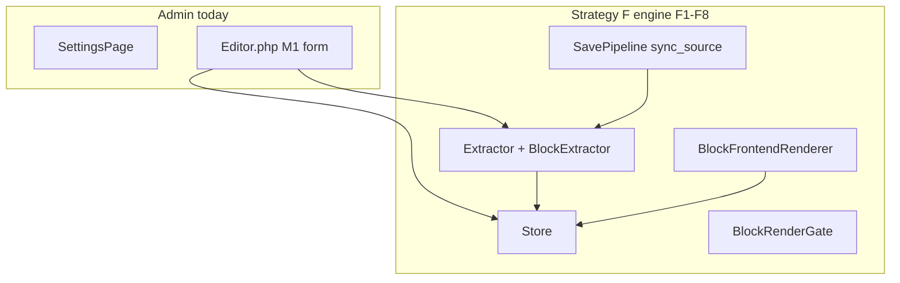
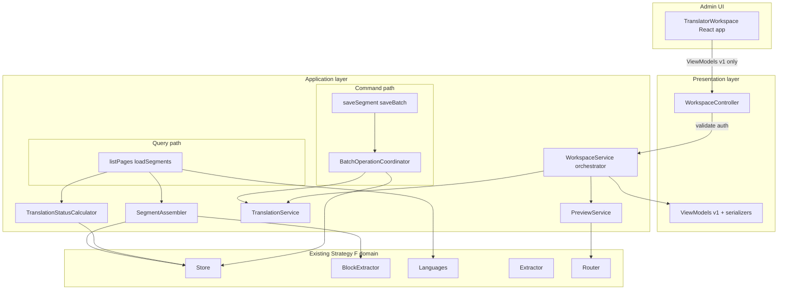
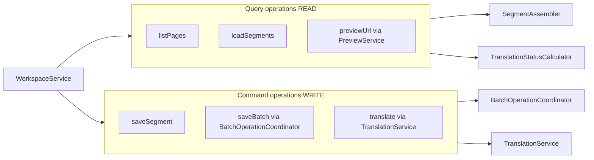
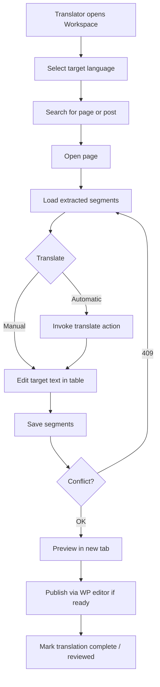
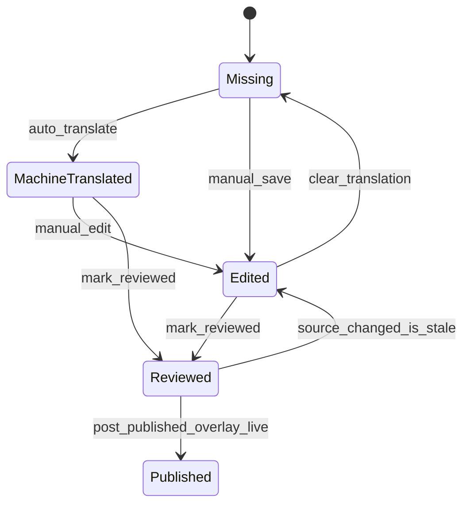
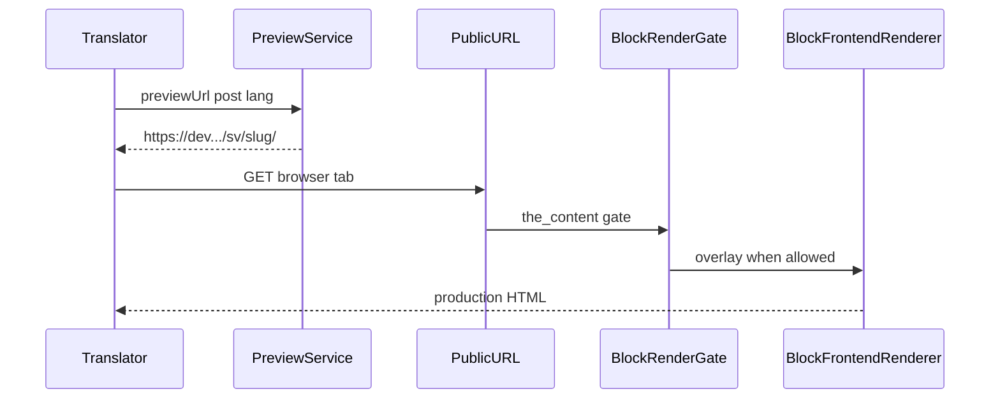
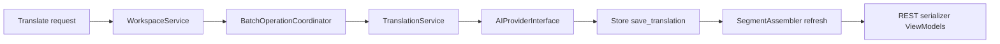

# F10 — Translator Workspace MVP Plan

**Status:** Canonical implementation plan — WP0–WP3 complete on `feature/f10-translator-workspace`
**Architecture:** Includes the approved pre-implementation architecture refinement pass (collaborators, query/command split, REST v1 contract, reserved hooks and signed preview — documentation only; no F10 code started).  
**Depends on:** F1–F9 complete; F9 engineering closure @ `91785cd` on `feature/f9-browser-acceptance`  
**ADR-0013:** Proposed (unchanged; F10 does not promote ADR)  
**ADR-0010:** Accepted — AI provider interface deferred to Roadmap M3; F10.6 stubs only  
**Canonical doc:** This file. Master plan cross-ref: [STRATEGY_F_PRODUCTION_IMPLEMENTATION.md](STRATEGY_F_PRODUCTION_IMPLEMENTATION.md) §19 (renumber note below)  
**Operational baseline:** [F8_CLI_VALIDATION_LOG.md](F8_CLI_VALIDATION_LOG.md) (PASS), F9 engineering closure evidence  
**Prior UI:** [`src/Admin/Editor.php`](../../src/Admin/Editor.php) (M1 form — superseded for block content)  
**Validation log (reserved):** [F10_TRANSLATOR_VALIDATION_LOG.md](F10_TRANSLATOR_VALIDATION_LOG.md) — created during F10 execution; not part of this plan

---

### Milestone renumbering (master plan)

| Master plan (pre-F10 doc) | After this plan |
|---|---|
| F10 Limited rollout | **F11** Limited rollout |
| F11 General rollout | **F12** General rollout |
| *(new)* | **F10 Translator Workspace MVP** (this document) |

F10 aligns with [ROADMAP.md](../ROADMAP.md) Milestone 2 “side-by-side segment editor + REST API” while building exclusively on Strategy F infrastructure (F1–F9). F10 does **not** redesign Strategy F, replace Store, replace UUID identity, or introduce a new rendering pipeline.

---

## Evidence taxonomy (read first)

F10 is **not** a repeat of F9 browser acceptance. It delivers the first **translator-facing workflow** on production Strategy F code already merged through F9.

| Layer | What it proved | What it did **not** prove |
|---|---|---|
| **F1–F8 engine** | UUID identity, extraction, Store, render gate, migration, flags, CLI ops | Translator workspace, REST API, bulk UX, AI actions |
| **F9 browser** | Production Gutenberg + frontend on adapter allowlist (engineering closure @ `91785cd`; Playwright harness debt documented separately) | REST workspace, human translation workflow, review states |
| **F10 (this plan)** | First translator workflow on Strategy F block segments via Workspace + REST | CPT, Elementor, full AI pipeline, cohort rollout (F11), ADR promotion |

**Reuse mandate:** F10 calls existing [`Store`](../../src/Translation/Store.php), [`BlockExtractor`](../../src/Translation/BlockExtractor.php), [`Extractor`](../../src/Translation/Extractor.php), [`BlockRenderGate`](../../src/Translation/BlockRenderGate.php), [`BlockFrontendRenderer`](../../src/Translation/BlockFrontendRenderer.php), [`Router`](../../src/Routing/Router.php), and SavePipeline reconciliation paths. **No** new storage layer, UUID system, or rendering pipeline.

---

## Current and target architecture

### Today (pre-F10)



### F10 target (layered)



**Layering rules:**

1. REST controllers contain **almost no business logic** — validate, authorize, delegate, serialize.
2. [`WorkspaceService`](../../src/Workspace/WorkspaceService.php) is the **orchestration entry point** — not a god service. It delegates to focused collaborators (§4.1).
3. **Queries** (reads) and **commands** (writes) are conceptually separated (§4.2) without full CQRS.
4. **ViewModels** live in the **presentation layer** only (§4.3) — domain logic never depends on them.
5. Store rows are **never** exposed to the frontend.

**Key code facts (today):**

- [`src/Admin/Editor.php`](../../src/Admin/Editor.php) — M1 form; refuses block bodies via Extractor; side-by-side segment editor deferred to F10.
- [`src/Translation/Store.php`](../../src/Translation/Store.php) — `load_object`, `save_translation`, `sync_source`, `summary_for_object`, `source_hash`, stale counts.
- [`src/Translation/BlockExtractor.php`](../../src/Translation/BlockExtractor.php) — `extract_post`; segment keys `b:<uuid>:<field>`; order from [`BlockTreeWalker`](../../src/Block/BlockTreeWalker.php).
- [`tests/integration/PluginGuardTest.php`](../../tests/integration/PluginGuardTest.php) — `test_no_rest_routes_are_registered` updated in F10.1 to allow `aiml/v1` only.
- [`src/Plugin.php`](../../src/Plugin.php) — `CAPABILITY = aiml_translate`; composition root wires REST + WorkspaceService.

---

## 1. Purpose and scope

### 1.1 Purpose

F10 delivers the **Translator Workspace MVP**: the first workflow an actual translator uses to work with Strategy F block segments without WP-CLI or the Gutenberg editor.

Goals:

1. Select content (post/page) and target language.
2. Load extracted segments in deterministic document order.
3. Edit translations manually (and invoke automatic translation when configured).
4. Save with concurrency safety.
5. Preview using the **production** rendering pipeline.
6. Understand translation status, staleness, and publish context.

### 1.2 In scope

| Requirement | Implementation layer | Reuse |
|---|---|---|
| Content/page selector | WorkspaceService + REST | `WP_Query`, Store summaries |
| Language selector | WorkspaceService | `Languages::routable()` |
| Load segments | WorkspaceService | `BlockExtractor::extract_post`, `Store::sync_source`, `Store::load_object` |
| Source/target display | ViewModels | Adapter-extracted source; Store `translated_text` mapped internally |
| Manual edit/save | WorkspaceService | `Store::save_translation` + optimistic locking |
| Automatic translation | TranslationService (stub) | ADR-0010 boundary; sync in F10, async-ready API |
| Preview | PreviewService | Production HTTP render path only |
| Status/stale | ViewModels | Store status + `is_stale` + `summary_for_object` |
| Retranslate/bulk | BatchOperationCoordinator + TranslationService | Batch REST; provider stub until M3 |

### 1.3 Out of scope

See §24. F10 does **not** implement: new schema, new UUID/render systems, Elementor, CPT, translated slugs, Action Scheduler jobs (M3), cohort rollout (F11), ADR promotion, or Tier 3 Playwright for ordinary F10 merges.

### 1.4 Target environment

Primary development/staging: **`https://dev.biopentra.eu`**. Strategy F flags per [F8 §1.5](STRATEGY_F_F8_OPERATIONS_AND_OBSERVABILITY.md) for workspace QA (registration + injection + extraction on; rendering enabled only when preview validation requires it).

---

## 2. F10 acceptance criteria

F10 **PASS** requires **all** of the following:

| ID | Criterion | Evidence type |
|---|---|---|
| AC-1 | Translator with `aiml_translate` can load and save block segments for post/page on allowlist | REST integration tests + manual QA |
| AC-2 | Segment keys match `b:<uuid>:<field>` from BlockExtractor | Export/compare tests |
| AC-3 | `sync_source` on workspace load marks stale; manual save clears stale | Integration tests |
| AC-4 | Preview uses production render path (BlockRenderGate → BlockFrontendRenderer); kill switch respected | HTTP smoke + architectural test |
| AC-5 | No cross-post segment leakage | Negative REST test |
| AC-6 | REST routes under `aiml/v1`; thin controllers; business logic in WorkspaceService | Code review + unit tests |
| AC-7 | REST returns ViewModels only — no raw Store rows | Schema tests |
| AC-8 | Optimistic locking: stale `source_hash` → HTTP 409 | Integration test |
| AC-9 | Segment order matches BlockTreeWalker traversal | Order assertion tests |
| AC-10 | M1 Editor defers block posts to workspace | Admin UX test |
| AC-11 | PHPUnit + PHPCS green | CI |
| AC-12 | Tier 1 Playwright smoke optional — not Tier 3 | Targeted run log if used |
| AC-13 | `F10_TRANSLATOR_VALIDATION_LOG.md` committed with PASS | Validation log |

**Hard stop:** Wrong-language render on supported block → FAIL until root-caused. REST write without capability → 403.

---

## 3. Supported content and blocks

Inherit F9 boundaries ([STRATEGY_F_F9_BROWSER_ACCEPTANCE.md](STRATEGY_F_F9_BROWSER_ACCEPTANCE.md) §6, §22):

| Dimension | Supported in F10 |
|---|---|
| Post types | `post`, `page` |
| Blocks | `core/paragraph`, `core/heading`, `core/button` |
| Classic fields | Title, excerpt via existing `Extractor` (optional F10.3+) |

Unsupported blocks: omitted or shown as read-only “not translatable” with count — never silently translated.

---

## 4. Layered architecture

### 4.1 WorkspaceService (orchestration entry point)

**Planned:** [`src/Workspace/WorkspaceService.php`](../../src/Workspace/WorkspaceService.php)

WorkspaceService is the **facade** REST controllers call. It coordinates collaborators but does **not** accumulate all business logic inline. The objective is to avoid a future “god service” without over-engineering.

**Orchestration responsibilities only:**

- Route each REST operation to the correct query or command path (§4.2).
- Invoke reserved extension points in documented order (§4.7).
- Enforce post-type and adapter allowlist policy at the boundary.
- Delegate preview to `PreviewService`; auto-translate to `TranslationService`.

**Must not:** contain HTTP concerns, JSON serialization, ViewModel construction, or direct React coupling.

**Injected collaborators:**

| Collaborator | Role |
|---|---|
| `SegmentAssembler` | Extract → sync → load → merge into application DTOs |
| `TranslationStatusCalculator` | Page/segment status aggregation from Store summaries |
| `BatchOperationCoordinator` | Bulk save and bulk translate iteration, caps, partial results |
| `TranslationService` | Auto-translate provider boundary |
| `PreviewService` | Production preview URL construction |
| `Store`, `BlockExtractor`, `Extractor`, `Languages` | Existing Strategy F domain (unchanged) |

#### 4.1.1 SegmentAssembler

**Planned:** [`src/Workspace/SegmentAssembler.php`](../../src/Workspace/SegmentAssembler.php)

**Responsibilities:**

- Call `BlockExtractor::extract_post` and `Store::sync_source` / `Store::load_object`.
- Merge extracted segments with Store rows into **application DTOs** (internal arrays or small value objects — not ViewModels).
- Enforce BlockTreeWalker ordering contract (§10) — sort by `segment_order`.
- Compute current `source_hash` per segment for optimistic locking.

**Owns:** extract → sync → load → merge → order → source hash assembly.

**Justification:** Isolates the most complex read path (extract/sync/merge/order) so WorkspaceService stays thin and tests can target assembly logic directly.

#### 4.1.2 TranslationStatusCalculator

**Planned:** [`src/Workspace/TranslationStatusCalculator.php`](../../src/Workspace/TranslationStatusCalculator.php)

**Responsibilities:**

- Wrap `Store::summary_for_object()` and derive page-level states (§6.2).
- Map Store constants to workflow labels for presentation serializers.
- Compute derived **Published** indicator from post status + flags (presentation-neutral data).

**Justification:** Keeps status derivation out of SegmentAssembler and REST serializers; single place for summary rules as review workflow grows.

#### 4.1.3 BatchOperationCoordinator

**Planned:** [`src/Workspace/BatchOperationCoordinator.php`](../../src/Workspace/BatchOperationCoordinator.php)

**Responsibilities:**

- Own all bulk iteration — `WorkspaceService` does **not** contain inline bulk loops.
- Iterate bulk save requests with per-segment optimistic locking (§11).
- Iterate bulk translate requests, delegating each segment to `TranslationService`.
- Enforce batch size caps (e.g. 50 segments per request).
- Execute per-item operations; collect partial success/failure into structured results.
- Return job-shaped responses that clearly distinguish succeeded and failed items (§7.2, §9).
- Invoke reserved before/after save hooks per item (§4.7).

**Non-goals:** Atomic all-or-nothing rollback across an entire batch is **not** required in F10 unless a specific acceptance criterion states otherwise; partial success with per-item errors is the expected bulk contract.

**Justification:** Bulk loops, caps, partial-result aggregation, and per-item hook invocation are distinct from single-segment save; isolating them prevents WorkspaceService and TranslationService from growing batch-specific branches.

### 4.2 Query vs command separation (lightweight)

F10 does **not** adopt full CQRS (separate stores, event sourcing, or duplicate models). Instead, WorkspaceService methods are **conceptually grouped** into query and command paths, implemented as distinct private collaborators or method namespaces on the same service class.



| Path | Operations | Collaborators | Side effects |
|---|---|---|---|
| **Query** | `listPages()`, `loadSegments()` | SegmentAssembler, TranslationStatusCalculator | May call `sync_source` (reconciliation read) |
| **Query** | `previewUrl()` | PreviewService | None — URL only |
| **Command** | `saveSegment()` | SegmentAssembler (hash check), Store | Writes Store |
| **Command** | `saveBatch()` | BatchOperationCoordinator | Writes Store |
| **Command** | `translate()` | TranslationService, BatchOperationCoordinator | May write Store |

**Rules:**

- Query methods return application DTOs; never mutate except `sync_source` reconciliation explicitly documented in SegmentAssembler.
- Command methods return updated DTOs or command results; serializers map to ViewModels at the REST boundary.
- REST controllers map HTTP verbs intuitively: GET → queries; POST → commands.

**Justification:** Clarifies read/write boundaries for future caching, auditing, and async jobs without introducing separate bus infrastructure, command buses, repositories, or additional application layers in F10.

**Scope note:** Query and command paths share the same `WorkspaceService` facade and collaborators. F10 does **not** introduce separate query/command services or milestone scope for a CQRS split.

### 4.3 Presentation layer — ViewModels and REST v1 contract

Store entities are **internal persistence models**. Application DTOs are **internal to the Workspace layer**. **ViewModels** are **presentation contracts** owned by the REST layer.

| Layer | Artifact | Location |
|---|---|---|
| Persistence | Store rows / objects | `src/Translation/Store.php` |
| Application | Segment DTOs, command results | `src/Workspace/` (internal) |
| Presentation | ViewModels + serializers | `src/Rest/ViewModel/` |

| ViewModel | Purpose |
|---|---|
| `WorkspaceSegmentViewModel` | One translatable segment row in the workspace table |
| `WorkspacePageSummaryViewModel` | Post list entry with per-language progress |
| `WorkspaceTranslationStatusViewModel` | Page-level aggregate status for footer/toolbar |

**Planned files:**

- [`src/Rest/ViewModel/WorkspaceSegmentViewModel.php`](../../src/Rest/ViewModel/WorkspaceSegmentViewModel.php) (and siblings)
- [`src/Rest/ViewModel/WorkspaceSegmentSerializer.php`](../../src/Rest/ViewModel/WorkspaceSegmentSerializer.php) — maps application DTO → ViewModel → JSON

**Mapping flow:**

```
Store + BlockExtractor
    → SegmentAssembler (application DTO)
    → REST serializer (presentation)
    → ViewModel v1
    → JSON
    → React
```

The application and domain layers **must not import** classes under `src/Rest/ViewModel/`. Store columns and internal persistence objects remain private to `src/Translation/`.

#### 4.3.1 REST API Version 1 — stable contract

The ViewModel JSON schema exposed at `/wp-json/aiml/v1/workspace/*` is the **REST API Version 1** contract.

| Rule | Detail |
|---|---|
| **Stability** | Existing field names and semantics in §4.3.2 are stable for React and external consumers |
| **Additive changes only** | New optional fields may be added; removing or changing the meaning of existing fields requires a future API version (`/aiml/v2/workspace`) |
| **Unknown fields** | React TypeScript interfaces and serializers ignore unknown JSON keys (forward compatibility) |
| **Frontend dependency** | React depends only on the documented ViewModel schema — not on Store columns or internal DTO shapes |
| **Version header** | Optional response header `X-AIML-Workspace-Api-Version: 1` may be documented; implementation in F10.1 is **not** required |
| **Breaking changes** | Require `/aiml/v2/workspace` — out of scope for F10 |

#### 4.3.2 WorkspaceSegmentViewModel v1 fields (stable)

| Field | Type | Notes |
|---|---|---|
| `segment_key` | string | e.g. `b:<uuid>:content` |
| `field_key` | string | Adapter field name |
| `block_name` | string | e.g. `core/paragraph` |
| `uuid` | string | Block UUID when block segment |
| `segment_order` | int | BlockTreeWalker order (§10) |
| `source_text` | string | Current canonical source |
| `source_hash` | string | Optimistic lock token (§11) |
| `translated_text` | string | Target text or empty |
| `status` | string | Workflow state (§6) |
| `is_stale` | bool | Source drift flag |
| `text_format` | string | `plain`, `html`, etc. |
| `can_edit` | bool | Allowlist eligibility |
| `meta` | object (optional) | Reserved bag for future extensions (§25) — empty object in F10 |

**Justification:** Explicit v1 contract lets Store and application DTOs evolve while the React frontend depends on a documented, versioned surface.

### 4.4 REST controllers (transport layer)

**Planned:** [`src/Rest/WorkspaceController.php`](../../src/Rest/WorkspaceController.php)

**Responsibilities only:**

1. Request validation (params, types, caps).
2. Authorization (`aiml_translate`, `edit_post`).
3. Call `WorkspaceService` query or command methods.
4. Map application DTOs to ViewModels via serializers.

**Must not:** call `Store`, `BlockExtractor`, or collaborators directly.

### 4.5 TranslationService (auto-translate boundary)

**Planned:** [`src/Workspace/TranslationService.php`](../../src/Workspace/TranslationService.php)

Conceptual flow (async-ready API; synchronous execution in F10 MVP):

```
Translate request → TranslationService → Provider → Store → Workspace refresh
```

F10 implements synchronous execution inside the service. REST contract uses **job-oriented response shape** (see §9) so Action Scheduler / queue can be added in M3 without route redesign.

**Bulk translate:** Multi-segment translate requests are **not** iterated inside `WorkspaceService` or `TranslationService` directly. `BatchOperationCoordinator` owns bulk iteration; `TranslationService` handles one segment (or a bounded unit) per coordinator call.

### 4.6 PreviewService (production render only)

**Planned:** [`src/Workspace/PreviewService.php`](../../src/Workspace/PreviewService.php)

**Architectural rule (non-negotiable):** Preview **never** introduces a second rendering engine.

```
Preview link → normal frontend HTTP request → Router → BlockRenderGate → BlockFrontendRenderer → rendered HTML
```

PreviewService returns a **URL** to the public frontend route (`/sv/{slug}/` or equivalent). It does not assemble HTML in admin, does not call BlockRenderer directly for preview, and does not bypass BlockRenderGate.

#### 4.6.1 Signed preview URLs (reserved — not implemented in F10)

**F10 behavior (unchanged):** `PreviewService` returns a public routed preview URL. Opening it performs a normal frontend HTTP request through the existing `Router` → `BlockRenderGate` → `BlockFrontendRenderer` pipeline. Admin session/capability applies when the translator opens the link from the workspace; no signed token is issued in F10.

The architecture **reserves** future signed-preview support for unauthenticated or time-limited access:

| Future capability | Purpose | F10 |
|---|---|---|
| **Expiring token** | Time-bound preview access without admin cookies | Not implemented |
| **Scoped post and language** | Token bound to `(post_id, language_id)` | Document only |
| **Signature verification** | HMAC or equivalent validated on frontend route | Future milestone |
| **External reviewer access** | Share preview link outside WordPress admin | Future milestone |
| **Signed URL** | `PreviewService::previewUrl()` may append token via `beforePreview` hook (§4.7) | Document only |

**Justification:** Review workflows, external reviewer access, and screenshot capture may need preview without admin cookies — reserving the concept avoids bolting auth onto public URLs later without a planned extension point. Signed preview is **not** in F10 implementation scope.

### 4.7 Reserved extension hooks (not implemented in F10)

F10 does **not** register WordPress actions/filters or implement these extension points. The architecture **reserves** named hook points so future milestones (TM, glossary, review) integrate without bypassing WorkspaceService.

| Hook point | When invoked | Typical future consumer |
|---|---|---|
| Before save segment | After validation, before `Store::save_translation` | Glossary enforcement, TM write-back |
| After save segment | After successful save | Audit log, cache invalidation |
| Before translate | Before provider call | Glossary injection, TM pre-fill |
| After translate | After provider returns, before Store write | Quality scoring, TM persist |
| Before preview | Before URL construction | Signed token injection (§4.6.1) |
| After preview | After URL returned | Analytics, screenshot queue |

**Invocation order:**

```
before save segment → Store write → after save segment
before translate → Provider → Store write → after translate
before preview → URL build → after preview
```

**Rules:**

- Hook payloads use stable application DTOs or identifiers (e.g. `segment_key`, `post_id`, `language_id`) — **never** raw Store rows or ViewModels.
- Failures on *before* hooks abort the operation; *after* hook failures are logged, not fatal (policy documented here; F10 does not implement hooks).
- Exact WordPress hook names and a `WorkspaceExtensionRegistry` are deferred to a future milestone — **not** defined or implemented in F10.

**Justification:** Documents where cross-cutting concerns attach without scattering filter calls across collaborators prematurely or implementing unused hook infrastructure in F10.

---

## 5. Canonical translator workflow

This section is the **canonical UX reference** for F10 and future milestones. Implementation must support this flow; extensions add steps rather than replacing it.



| Step | Actor | System behaviour |
|---|---|---|
| Open Workspace | Translator | Admin menu `aiml-translator`; capability `aiml_translate` |
| Select language | Translator | Target language from routable set; persists in session/URL |
| Search page | Translator | Paginated post list with translation summary ViewModels |
| Open page | Translator | GET segments → WorkspaceService extract/sync/load |
| Load segments | System | BlockTreeWalker order; ViewModels returned |
| Translate manually | Translator | Inline edit target column |
| Translate automatically | Translator | POST translate → TranslationService (stub OK in F10) |
| Save | Translator | POST save with `source_hash`; 409 on drift |
| Preview | Translator | Opens PreviewService URL — production render path |
| Publish | Translator | Link to WP block editor; workspace does not replace publish |
| Complete | Translator | Set segment/page status to Reviewed when satisfied |

Future milestones (review workflow, assignment, TM suggestions) **extend** this flow with additional steps and panels — they do not replace the core load → edit → save → preview sequence.

---

## 6. Translation workflow state progression

### 6.1 Segment-level state machine

F10 documents the intended lifecycle. Store constants map to UI labels; future review workflows **extend** this model rather than replacing it.



| UI label | Store constant | Meaning |
|---|---|---|
| **Missing** | `STATUS_MISSING` | No translation text |
| **Machine translated** | `STATUS_MACHINE_TRANSLATED` | Provider-filled; not human-edited |
| **Edited** | `STATUS_MANUALLY_EDITED` | Human edited (includes manual-first save) |
| **Reviewed** | `STATUS_REVIEWED` | Translator sign-off on segment |
| **Published** | *(derived)* | Post `publish` + frontend flag on + segment reviewed/translated — page-level indicator, not a separate Store enum in F10 |

**Stale** is orthogonal (`is_stale=1`): source hash drift after sync; clears on successful save with matching `source_hash`.

**Failed** / **Ignored** (`STATUS_FAILED`, `STATUS_IGNORED`) remain available for M3 AI pipeline; F10 UI may show but need not expose actions.

### 6.2 Page-level aggregation

`WorkspaceTranslationStatusViewModel` derives from `Store::summary_for_object()`:

- Counts: missing, stale, translated, reviewed.
- Overall page state: **Not started** | **In progress** | **Complete** | **Stale** (any stale segment).

---

## 7. REST API design

**Namespace:** `aiml/v1`  
**Base:** `/wp-json/aiml/v1/workspace`

Controllers delegate to services; responses are ViewModels only.

| Method | Route | HTTP | Path | Service method |
|---|---|---|---|---|
| GET | `/posts` | Query | `listPages()` | SegmentAssembler + TranslationStatusCalculator |
| GET | `/{post_id}/segments?language={code}` | Query | `loadSegments()` | SegmentAssembler |
| GET | `/{post_id}/preview-url?language={code}` | Query | `previewUrl()` | PreviewService |
| POST | `/{post_id}/segments/{segment_key}` | Command | `saveSegment()` | WorkspaceService → Store |
| POST | `/{post_id}/segments/batch` | Command | `saveBatch()` | BatchOperationCoordinator |
| POST | `/{post_id}/translate` | Command | `translate()` | TranslationService + BatchOperationCoordinator |

### 7.1 Save request body (optimistic locking)

```json
{
  "translated_text": "...",
  "source_hash": "sha256:...",
  "status": "manually_edited"
}
```

Server compares `source_hash` to current Store/computed hash. Mismatch → **409 Conflict** with refreshed `WorkspaceSegmentViewModel` in body.

### 7.2 Translate request body (async-ready shape)

F10 executes synchronously; response shape anticipates jobs:

```json
{
  "segment_keys": ["b:..."],
  "mode": "sync"
}
```

Response (F10):

```json
{
  "status": "completed",
  "segments": [ "...WorkspaceSegmentViewModel..." ],
  "errors": []
}
```

Future (M3) may return `{ "status": "queued", "job_id": "..." }` without route changes.

### 7.3 REST API Version 1 compatibility

See §4.3.1. All F10 REST responses conform to **Workspace API v1**. React TypeScript interfaces must match v1 field names exactly. Additive server fields use optional typing (`meta?`, index signatures for forward compatibility).

---

## 8. Preview architecture (production path only)

| Rule | Detail |
|---|---|
| **No second renderer** | Admin never calls `BlockRenderer` directly for preview HTML |
| **URL only** | PreviewService returns routed public URL |
| **Same gates** | `BlockRenderGate` deny/suppress/stale rules apply identically |
| **Kill switch** | Disabling `block_frontend_rendering_enabled` shows source on preview HTTP request — same as F8/F9 |
| **Verification** | AC-4 HTTP smoke compares preview HTML to direct `curl` of same URL |
| **Signed preview** | Reserved §4.6.1 — F10 uses standard public URL only |



---

## 9. Automatic translation architecture

### 9.1 Conceptual pipeline (async-ready)



Single-segment translate may bypass the coordinator when invoked directly; bulk translate always routes through `BatchOperationCoordinator` (§4.1.3).

### 9.2 F10 scope vs future

| Aspect | F10 MVP | Future M3+ |
|---|---|---|
| Execution | Synchronous in request | Action Scheduler / queue |
| Provider | `NullAIProvider` → `aiml_ai_not_configured` | OpenAI first per ADR-0010 |
| REST contract | Job-shaped response; `mode=sync` | `mode=async`, poll/webhook |
| Store writes | Same `save_translation` path | Unchanged |

**Rule:** TranslationService is the **only** entry point for auto-translate from workspace. Controllers never call providers directly. Bulk translate iteration is delegated to `BatchOperationCoordinator` (§4.1.3).

---

## 10. Segment ordering contract

**Canonical rule:** Segment order comes from [`BlockTreeWalker`](../../src/Block/BlockTreeWalker.php) depth-first pre-order traversal during extraction.

| Source | Used for order? |
|---|---|
| BlockTreeWalker traversal | **Yes — sole authority** |
| Database row insertion order | **No** |
| Store `segment_order` column | **Mirror only** — must match walker at extract time |
| Alphabetical segment_key | **No** |

**Determinism requirement:** The same `post_content` byte sequence yields the same segment order in extraction, workspace display, preview, and frontend rendering.

**Implementation:** `BlockExtractor` assigns `segment_order` incrementally during walk; `SegmentAssembler` sorts application DTOs by `segment_order`; serializers preserve order in ViewModels. Tests assert order matches walker collect on fixture posts.

---

## 11. Optimistic locking (concurrency)

Prevent silent overwrites when multiple translators edit the same page.

### 11.1 Mechanism

Uses existing Store `source_hash` ([`Store::source_hash()`](../../src/Translation/Store.php)) as immutable source revision identifier for the segment.

```
Client sends source_hash with save
    → WorkspaceService / BatchOperationCoordinator compares to current hash via SegmentAssembler
    → Match: save proceeds, return updated DTO → serializer → ViewModel
    → Mismatch: HTTP 409 Conflict + refreshed ViewModel(s)
    → Translator reloads segment table
```

### 11.2 HTTP semantics

| Code | Meaning |
|---|---|
| 200 | Save succeeded |
| 409 | Source changed since load; body includes current segment ViewModel |
| 403 | Capability failure |
| 422 | Validation failure |

F10 does not implement row-level locking or assignment workflow (future extension §25).

---

## 12. Workspace UI design

**Menu:** `aiml-translator` under AIML admin parent  
**Stack:** `@wordpress/scripts` + `@wordpress/components`  
**Data:** ViewModels from REST only — no Store knowledge in React.

| UI region | Content |
|---|---|
| Toolbar | Post search/select, language select, refresh, preview link |
| Table | Source \| Target (editable) \| Status \| Stale \| Actions |
| Footer | `WorkspaceTranslationStatusViewModel` summary |
| Bulk bar | Save selected / Translate selected |

**M1 Editor:** Block posts with extraction enabled → notice + link to workspace ([`Editor.php`](../../src/Admin/Editor.php) remains for classic-only until expanded).

---

## 13. Security and privacy

- REST cookie auth + `wp_rest` nonce in admin context.
- Capability: `aiml_translate` + `edit_post` on target post.
- No segment body text in structured logs (F8 §9 parity).
- Sanitization via [`BlockTranslationSanitizer`](../../src/Translation/BlockTranslationSanitizer.php) on HTML saves.
- Translate batch rate limit (constant, e.g. 50 segments/request).

---

## 14. Performance budget

| Operation | Budget |
|---|---|
| GET segments (&lt;20 blocks) | &lt;500ms server |
| Batch save 20 segments | &lt;1s |
| Post search | Paginated 20/page |
| Preview | Client-side navigation; no extra server render in admin |

No assembled-field cache in F10 (Roadmap M2).

---

## 15. Known limitations

Inherit F9 §22 plus:

| Limitation | F10 handling |
|---|---|
| 3-block allowlist | Document; read-only or omit others |
| post/page only | No CPT selector |
| LWW concurrency | Optimistic locking only; no assignment locks |
| AI not configured | Clear UX message from TranslationService |
| Sync translate only | Document; async in M3 |

---

## 16. Testing strategy

| Tier | When | F10 |
|---|---|---|
| **Tier 0 (default)** | Every commit | PHPUnit unit + integration, PHPCS |
| **Tier 1** | Service/REST change | `WorkspaceServiceTest`, `WorkspaceRestTest`, 409 tests |
| **Tier 2** | Preview/render smoke | Optional HTTP or single Playwright grep |
| **Tier 3** | Milestone release only | Not required per F10 sub-milestone |

**Planned test files:**

- `tests/unit/Workspace/WorkspaceServiceTest.php`
- `tests/integration/WorkspaceRestTest.php`
- `tests/integration/WorkspacePermissionsTest.php`
- `tests/integration/WorkspaceStaleTest.php`
- `tests/integration/WorkspaceConflictTest.php`
- `tests/integration/WorkspaceSegmentOrderTest.php`
- `tests/integration/PreviewProductionPathTest.php`
- Update `PluginGuardTest` for `aiml/v1` routes

---

## 17. F10 entry gate

| Gate | Required state |
|---|---|
| F9 merged to `main` | Engineering closure @ `91785cd` documented |
| PHPUnit / PHPCS | Green on `main` |
| Strategy F flags | Staging config documented for workspace QA |
| ADR-0013 | May remain Proposed |

---

## 18. F10.1 — REST Workspace API + WorkspaceService

### Purpose

Establish transport layer, application layer, and ViewModel contract without UI.

### Architecture

```
WorkspaceController
    → WorkspaceService (thin facade)
    → SegmentAssembler / TranslationStatusCalculator / BatchOperationCoordinator / TranslationService / PreviewService
    → Store / BlockExtractor / Languages / Router
```

Serializers in `src/Rest/ViewModel/` map application DTOs to ViewModels. Controllers contain **no** business rules.

### Implementation sequence

1. Add `SegmentAssembler`, `TranslationStatusCalculator`, and `BatchOperationCoordinator` under `src/Workspace/`.
2. Add `WorkspaceService` as the thin application facade (query/command routing per §4.2).
3. Add REST ViewModels under `src/Rest/ViewModel/` (`WorkspaceSegmentViewModel`, `WorkspacePageSummaryViewModel`, `WorkspaceTranslationStatusViewModel`).
4. Add serializers and `src/Rest/WorkspaceController.php` — thin delegate only.
5. Wire services in [`Plugin.php`](../../src/Plugin.php); register routes on `rest_api_init`.
6. Implement optimistic locking in the command path (hash check via `SegmentAssembler`; batch via `BatchOperationCoordinator`).
7. Enforce segment ordering in `SegmentAssembler` (§10).
8. Add unit/integration tests; update `PluginGuardTest`; document REST surfaces in [HOOKS.md](../HOOKS.md).

### Risks

| Risk | L | I | Mitigation |
|---|---|---|---|
| Logic leaks into controller | M | M | Code review checklist; no Store imports in Rest/ |
| ViewModel drift from Store | L | M | Serializer unit tests; single mapping layer |
| 409 UX confusion | M | L | Document reload workflow §5 |

### Acceptance criteria

- [ ] All routes return ViewModels only
- [ ] WorkspaceService has unit tests with mocked Store
- [ ] 409 on hash mismatch
- [ ] Segment order matches BlockTreeWalker on fixtures
- [ ] AC-5, AC-6, AC-7, AC-8, AC-9 satisfied

### Testing strategy

Tier 0 + Tier 1 integration tests only.

### Definition of done

REST API callable via curl/Postman; integration tests green; PHPCS clean; no React code.

---

## 19. F10.2 — Workspace shell

### Purpose

Read-only admin UI: post picker, language picker, segment table from ViewModels.

### Architecture

React → REST → WorkspaceService (unchanged from F10.1).

### Implementation sequence

1. Scaffold `assets/translator-workspace/` with `@wordpress/scripts`.
2. Add `src/Admin/TranslatorWorkspace.php` — menu, enqueue, REST nonce.
3. Components: `PostSelect`, `LanguageSelect`, `SegmentTable` (read-only).
4. Preview button calls preview-url endpoint; opens tab.

### Risks

| Risk | L | I | Mitigation |
|---|---|---|---|
| React bypasses ViewModels | L | H | TypeScript interfaces mirror ViewModel schema |
| Admin bundle size | L | L | Code-split; minimal deps |

### Acceptance criteria

- [ ] Translator can browse posts and view segments
- [ ] No save actions yet
- [ ] Preview opens production URL

### Testing strategy

Tier 0; manual QA checklist.

### Definition of done

Shell deployed on dev; loads segments for fixture post.

---

## 20. F10.3 — Manual edit + save

### Purpose

First translator-visible value: edit target, save with optimistic locking.

### Implementation sequence

1. Editable target cells + dirty tracking.
2. Wire POST save single/batch with `source_hash`.
3. Handle 409 → reload table UX.
4. Stale badge from ViewModel `is_stale`.
5. M1 Editor deferral notice for block posts.

### Risks

| Risk | L | I | Mitigation |
|---|---|---|---|
| Lost edits on 409 | M | M | Preserve dirty state in UI where safe; prompt reload |
| Double save | L | L | Disable save while in-flight |

### Acceptance criteria

- [x] AC-1, AC-3, AC-8 satisfied (WP3 @ `feature/f10-translator-workspace`)
- [x] Manual save sets `STATUS_MANUALLY_EDITED`
- [x] Empty translation reverts to `STATUS_MISSING` (Store semantics)
- [x] HTTP 409 conflict preserves local draft; explicit reload required
- [x] M1 Editor deferral notice + workspace deep link for block posts

### WP3 implementation record (2026-08-03)

| Item | Detail |
|---|---|
| **Completed** | Inline target editing, dirty tracking, single/batch save, 409 UX, stale badges, M1 deferral |
| **Save semantics** | POST single/batch with `translated_text`, `source_hash`, `status=manually_edited`; empty → `missing` |
| **409 UX** | Row `conflict` state; preserved draft; refreshed ViewModel in `conflictServer`; reload action |
| **Legacy editor** | Block posts show warning + link to `aiml-translator?post_id=&language=`; title/excerpt unchanged |
| **Tests** | `WorkspaceRestTest`, `WorkspaceBatchTest`, `WorkspaceConflictTest`, `WorkspaceStaleTest`, `WorkspacePermissionsTest`, `EditorWorkspaceDeferralTest`, `segment-rows.test.ts` |
| **Validation** | Tier 0: PHPUnit unit + integration, PHPCS, TypeScript build + Jest, `git diff --check` |

### Testing strategy

Tier 0 + WorkspaceConflictTest + manual QA.

### Definition of done

**MVP tag candidate:** `strategy-f-f10-translator-mvp` after WP3.

---

## 21. F10.4 — Status + publish affordances

### Purpose

Translation progress visibility; publish context.

### Implementation sequence

1. Footer `WorkspaceTranslationStatusViewModel`.
2. Status badges per §6 state machine.
3. Post status + link to WP editor.
4. Filters: stale only / missing only.

### Risks

| Risk | L | I | Mitigation |
|---|---|---|---|
| Published vs reviewed confusion | M | L | Clear copy; Published = derived page state |

### Acceptance criteria

- [ ] Summary counts match Store
- [ ] State machine labels consistent with Store constants

### Definition of done

Translator understands page completion without WP-CLI.

### WP4 implementation record (2026-08-03)

| Item | Detail |
|---|---|
| **Completed** | Status footer, publish context, segment filters, canonical status badges |
| **Status aggregation** | `TranslationStatusCalculator` + `WorkspaceTranslationStatusViewModel`; sync before aggregate |
| **Filters** | Client-side: all, missing, stale, translated, reviewed |
| **Publish context** | Post title/type/status, Edit in WordPress link, preview action |
| **Tests** | `TranslationStatusCalculatorTest`, `WorkspaceStatusTest`, `segment-status.test.ts` |
| **Validation** | Tier 0 gates |

---

## 22. F10.5 — Retranslate + bulk actions

### Purpose

Bulk save and translate selected segments via `BatchOperationCoordinator` and `TranslationService` stub.

### Architecture

Bulk POST routes delegate to `WorkspaceService`, which forwards iteration to `BatchOperationCoordinator`. The coordinator enforces caps, runs per-item save/translate, aggregates partial results, and returns structured succeeded/failed lists. `WorkspaceService` contains no inline bulk loops.

### Implementation sequence

1. Row selection + bulk toolbar.
2. POST translate with job-shaped response.
3. Batch save selected dirty rows.
4. Progress UI for bulk operations.

### Risks

| Risk | L | I | Mitigation |
|---|---|---|---|
| Long sync bulk translate | M | M | Cap segment count; document M3 async |

### Acceptance criteria

- [ ] Bulk translate returns structured not-configured when no provider
- [ ] Bulk save works

### Definition of done

Bulk paths tested; no provider required.

### WP5 implementation record (2026-08-03)

| Item | Detail |
|---|---|
| **Completed** | Row selection, bulk toolbar, save selected, translate selected, per-item batch translate |
| **Selection** | Visible editable rows only; hidden selections preserved across filters |
| **Batch translate** | Per-item `aiml_ai_not_configured` errors; reserved `job_id` in response |
| **Tests** | `WorkspaceTranslateTest`, `row-selection.test.ts`, batch save reuse via `applyBatchSaveResults` |

---

## 23. F10.6 — Auto-translate provider hook

### Purpose

Wire ADR-0010 interface; M3 swaps implementation without REST changes.

### Implementation sequence

1. `src/Translation/AIProviderInterface.php` (or `src/AI/`) per ADR-0010.
2. `NullAIProvider` implementation.
3. TranslationService delegates to provider.
4. Settings placeholder copy for M3.

### WP6 implementation record (2026-08-03)

| Item | Detail |
|---|---|
| **Completed** | `AIProviderInterface`, `TranslationBatch`, `ProviderResult`, `NullAIProvider` |
| **Delegation** | `TranslationService` builds batches and persists machine translations via Store |
| **REST** | Unchanged translate contract; stable `aiml_ai_not_configured` per item |
| **Tests** | `WorkspaceProviderTest` |

### Acceptance criteria

- [x] Provider injectable in tests
- [x] REST translate contract unchanged when provider added

### Definition of done

Full F10 complete; tag `strategy-f-f10-translator-complete`.

---

## 24. Out-of-scope items

F10 explicitly excludes:

- New block adapters or expanded allowlist
- Schema migrations
- Elementor / Site Editor templates
- CPT / multisite matrix
- Cohort rollout and persistent metrics (F11)
- Action Scheduler / async translate execution (M3)
- ADR-0013 promotion
- Tier 3 Playwright for ordinary F10 PRs
- Second rendering engine for preview
- Translation Memory, Glossary, comments, screenshots (future §25)

---

## 25. Future extension points

The following are **future consumers** of the F10 architecture. They influence API boundaries today (ViewModels, TranslationService, job-shaped responses) but remain **out of scope** for F10 implementation.

| Extension | Consumes | F10 prepares |
|---|---|---|
| **Translation Memory** | TranslationService, segment keys | Stable `segment_key` + source_hash |
| **Glossary** | TranslationService pre/post processing | Provider pipeline hook |
| **AI Providers** (OpenAI, etc.) | AIProviderInterface | TranslationService delegation |
| **Human review workflow** | Status state machine §6 | `Reviewed` state + extension hooks §4.7 |
| **Comments** | ViewModel + REST | Optional `meta` bag on ViewModels |
| **Screenshots** | Preview URL | Production preview path §8 |
| **Rich-text diff** | ViewModel source/target fields | `text_format` preserved |
| **Segment locking** | WorkspaceService save | 409 locking precedent |
| **Assignment workflow** | listPages filter | Page summary ViewModel extensibility |

**Rule:** Extensions add ViewModel fields or service methods — they do not bypass WorkspaceService or expose Store directly.

---

## 26. Reserved validation log

Mirror F8/F9 milestone practice.

**File (reserved):** [F10_TRANSLATOR_VALIDATION_LOG.md](F10_TRANSLATOR_VALIDATION_LOG.md)

**Created during:** F10 execution (not at planning time).

**Will contain:**

| Section | Content |
|---|---|
| Environment | Host, branch, commit, WP/PHP versions |
| Entry gate | F10 §17 checklist |
| REST smoke | Route list + sample curl results |
| Workspace QA | Manual translator workflow walkthrough §5 |
| Optimistic locking | 409 conflict reproduction + resolution |
| Preview verification | Production path confirmation §8 |
| Segment order | Fixture order assertion output |
| Quality gates | PHPUnit, PHPCS exit codes |
| Tier 1 smoke | Playwright grep results if run |
| Acceptance criteria | §2 AC-1–AC-13 mapping |
| Operator sign-off | Reviewer, date |
| Final result | PASS/FAIL @ commit |

---

## 27. F11 entry gate (deferred rollout)

Former master-plan F10 scope moves here:

- Cohort flags
- Persistent metrics / dashboards
- Render result caching (F8 deferred item)
- `block_diagnostics_enabled` admin toggle

F11 planning begins after F10 PASS + stakeholder review of §15 limitations.

---

## 28. F10 milestone closure gates

F10 closes when **all** are true:

| Gate | Requirement |
|---|---|
| G1 | §2 acceptance criteria satisfied |
| G2 | `F10_TRANSLATOR_VALIDATION_LOG.md` committed with **PASS** |
| G3 | PHPUnit + PHPCS green on merge commit |
| G4 | WorkspaceService owns business logic; controllers thin |
| G5 | ViewModel-only REST contract verified |
| G6 | Preview production-path rule verified (AC-4) |
| G7 | Tag `strategy-f-f10-translator-complete` on merge (execution step) |

**Minimum MVP (WP3):** G1 partial (AC-1,3,8), G4, G5 — tag `strategy-f-f10-translator-mvp` optional.

---

## Work packages (execution outline)

| WP | Phase | Deliverable | Depends |
|---|---|---|---|
| WP0 | — | This plan committed | F9 merge |
| WP1 | F10.1 | WorkspaceService + REST + ViewModels + tests | WP0 |
| WP2 | F10.2 | Workspace shell UI | WP1 |
| WP3 | F10.3 | Manual save + 409 handling | WP2 | **Complete** |
| WP4 | F10.4 | Status + publish UX | WP3 | **Complete** |
| WP5 | F10.5 | Bulk actions | WP4 | **Complete** |
| WP6 | F10.6 | AI provider stub | WP5 | **Complete** |
| WP7 | — | `F10_TRANSLATOR_VALIDATION_LOG.md` + tags | WP3 min / WP6 full |

---

## Related documents

| Document | Path |
|---|---|
| Master implementation plan | [STRATEGY_F_PRODUCTION_IMPLEMENTATION.md](STRATEGY_F_PRODUCTION_IMPLEMENTATION.md) |
| F8 operations plan | [STRATEGY_F_F8_OPERATIONS_AND_OBSERVABILITY.md](STRATEGY_F_F8_OPERATIONS_AND_OBSERVABILITY.md) |
| F8 CLI validation (PASS) | [F8_CLI_VALIDATION_LOG.md](F8_CLI_VALIDATION_LOG.md) |
| F9 browser acceptance | [STRATEGY_F_F9_BROWSER_ACCEPTANCE.md](STRATEGY_F_F9_BROWSER_ACCEPTANCE.md) |
| ADR-0013 | [0013-gutenberg-segment-identity.md](../adr/0013-gutenberg-segment-identity.md) |
| ADR-0010 AI provider | [0010-provider-agnostic-interface.md](../adr/0010-provider-agnostic-interface.md) |
| Roadmap M2 | [ROADMAP.md](../ROADMAP.md) |
| Hooks | [HOOKS.md](../HOOKS.md) |

**Planned implementation files (F10):**

```
src/Workspace/WorkspaceService.php
src/Workspace/SegmentAssembler.php
src/Workspace/TranslationStatusCalculator.php
src/Workspace/BatchOperationCoordinator.php
src/Workspace/TranslationService.php
src/Workspace/PreviewService.php
src/Rest/WorkspaceController.php
src/Rest/ViewModel/*.php
src/Rest/ViewModel/*Serializer.php
src/Admin/TranslatorWorkspace.php
assets/translator-workspace/
```

**Existing production code reused (read-only during F10 planning):**

- `src/Translation/Store.php`
- `src/Translation/BlockExtractor.php`
- `src/Translation/BlockRenderGate.php`
- `src/Translation/BlockFrontendRenderer.php`
- `src/Block/BlockTreeWalker.php`
- `src/Routing/Router.php`

---

## Documentation/code discrepancies to record

1. Master plan §19 F10/F11 renumber required when this doc merges.
2. `PluginGuardTest::test_no_rest_routes_are_registered` intentionally updated in F10.1.
3. F9 plan “After F9 PASS: F10 limited rollout” superseded by this doc’s scope split (rollout → F11).
4. F8 deferred “render caching to F10” → F11 in renumber table.
5. [`SettingsPage.php`](../../src/Admin/SettingsPage.php) “REST arrives with segment editor” → F10 delivers REST; M1 Settings copy updated at implementation.

---

## Architectural refinements summary

This section summarizes the **approved pre-implementation refinement pass**. None of these items imply F10 code exists yet.

| Refinement | Maintainability benefit |
|---|---|
| **Focused collaborators** | `SegmentAssembler`, `TranslationStatusCalculator`, and `BatchOperationCoordinator` isolate extract/merge, status derivation, and bulk iteration — prevents `WorkspaceService` becoming a god service |
| **WorkspaceService facade** | Single orchestration entry for REST (and future CLI/cron); delegates to collaborators; no HTTP or ViewModel concerns |
| **Lightweight query/command split** | `listPages`, `loadSegments`, `previewUrl` vs `saveSegment`, `saveBatch`, `translate` clarifies read/write boundaries without CQRS, command buses, or extra layers |
| **ViewModels in presentation layer** | `src/Rest/ViewModel/` keeps JSON contracts separate from domain logic; application layer never imports ViewModels |
| **Stable REST API v1 contract** | Documented ViewModel schema with additive-only evolution; React depends on v1 fields, not Store columns |
| **BatchOperationCoordinator** | Bulk save/translate caps, per-item execution, and partial-result aggregation live in one place; no inline bulk loops in `WorkspaceService` |
| **Reserved extension hooks §4.7** | Before/after save, translate, and preview hook points documented for TM/glossary/review — not implemented in F10 |
| **Future signed preview §4.6.1** | Expiring scoped tokens for external reviewers reserved; F10 uses standard public routed URL only |
| **Canonical workflow §5** | Shared UX reference for design, QA, and future milestones |
| **State machine §6** | Review/AI features extend states instead of reinventing status |
| **Production preview only §8** | Eliminates preview/render divergence class of bugs |
| **Async-ready translate API §9** | M3 queues plug in via `BatchOperationCoordinator` + `TranslationService` without REST redesign |
| **BlockTreeWalker order §10** | Deterministic UX matches rendered page order |
| **Optimistic locking §11** | Safe multi-translator editing without new storage |
| **Validation log reserved §26** | Consistent milestone evidence pattern (F8/F9/F10) |
| **Future extension points §25** | TM, glossary, review, and assignment consume documented boundaries — no Store bypass |
