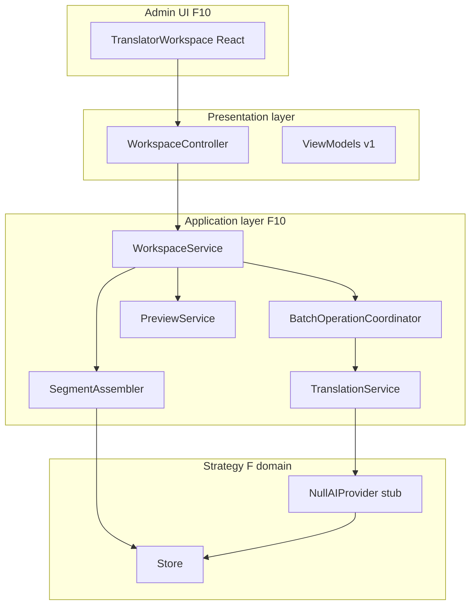
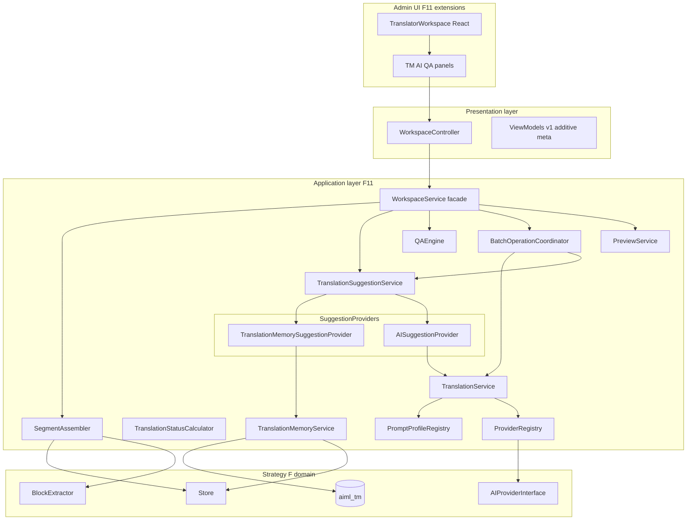
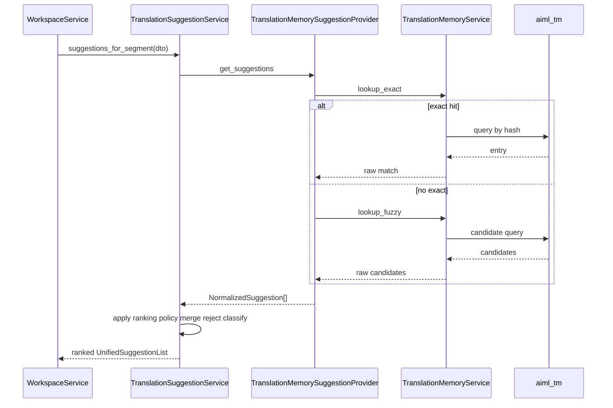
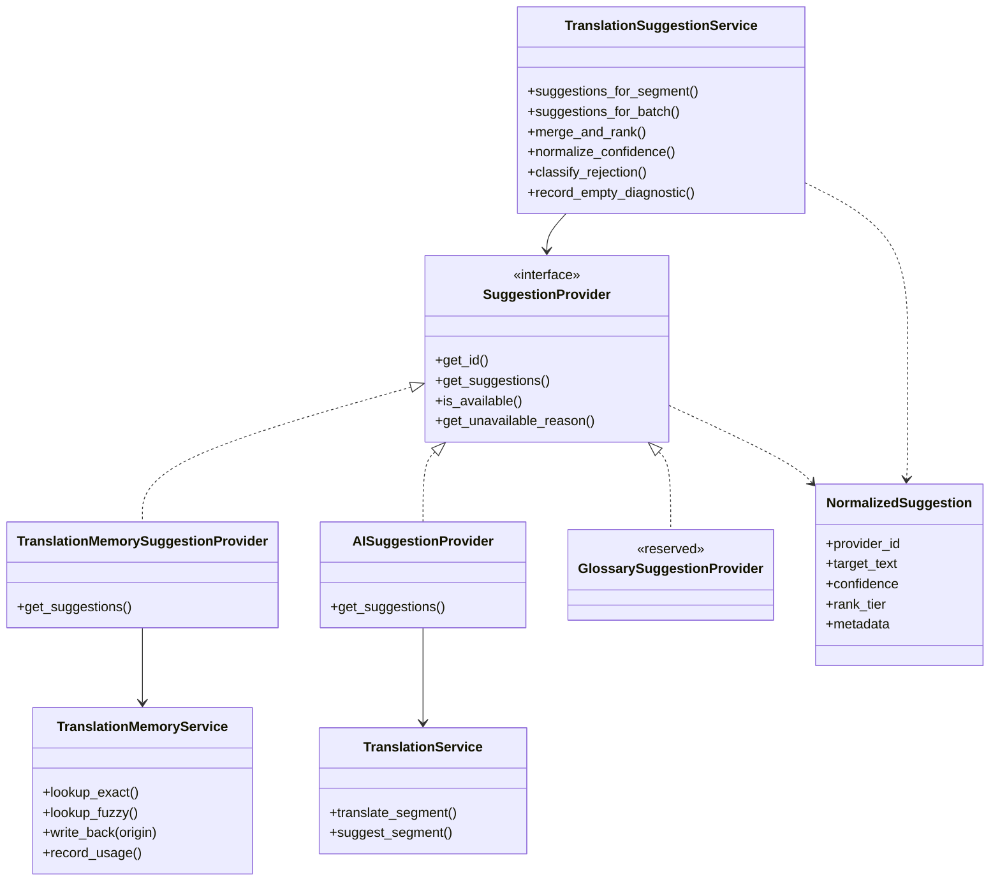
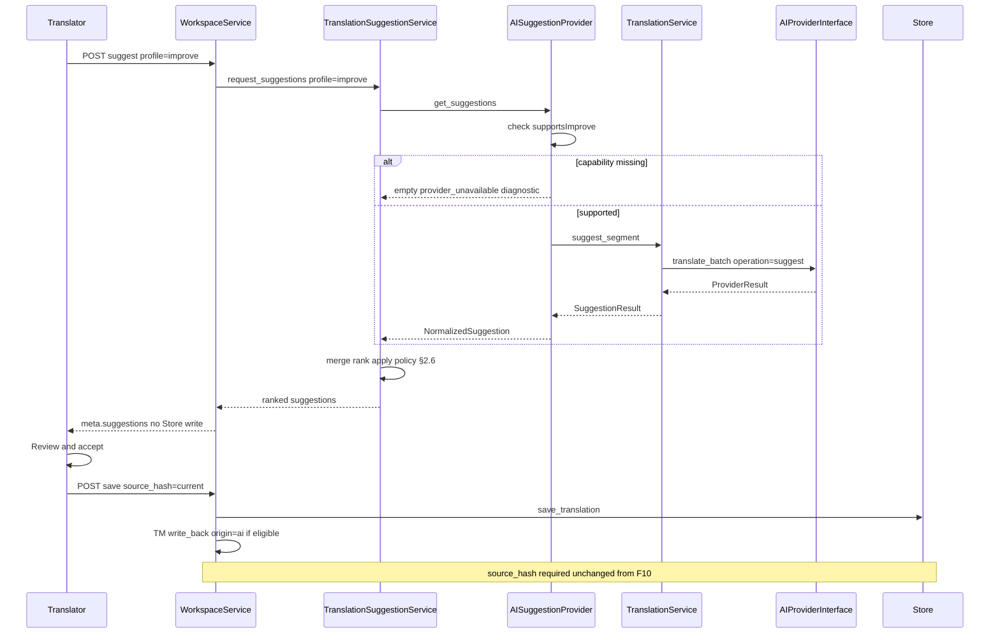
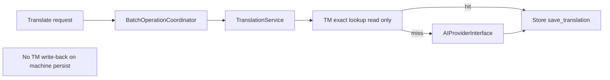
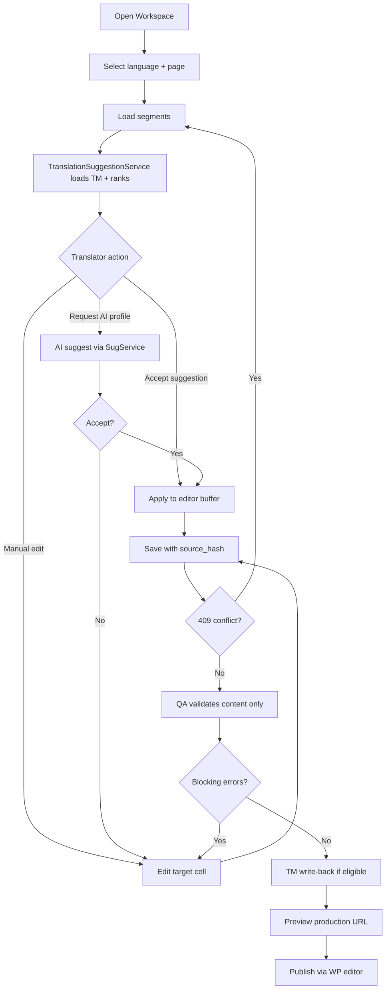
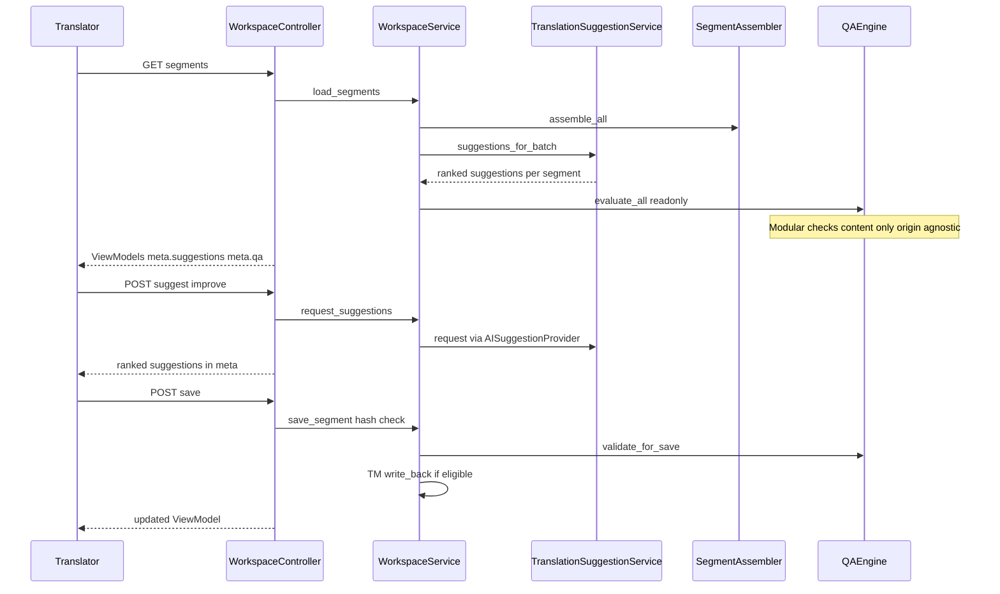
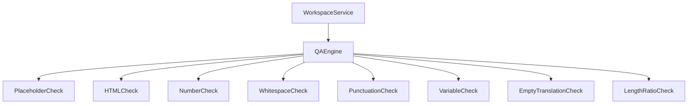

# F11 — Translation Memory & AI Assistance Plan

**Status:** Canonical implementation plan — **architecture frozen** for implementation on `feature/f11-translation-memory-ai`
**Architecture:** Includes approved refinement pass: `SuggestionProvider` abstraction, `TranslationSuggestionService` orchestration, deterministic ranking, modular `QAEngine`, provider capability discovery, human-approved TM write-back, source-independent QA, TM provenance, productivity metrics (diagnostics only)
**Governance:** Changes that affect architecture, public APIs, milestone scope, service boundaries, or workflows require an ADR or an explicit architecture revision. Implementation details, bug fixes, tests, and internal refactoring may proceed without modifying the architecture.
**Depends on:** F1–F9 complete; F10 Translator Workspace complete (`strategy-f-f10-translator-complete`)
**ADR-0010:** Accepted — F11 introduces first production provider via `AIProviderInterface`; architecture remains vendor-neutral
**ADR-0009:** Accepted — TM in separate `aiml_tm` table
**Canonical doc:** This file. Master plan cross-ref: [STRATEGY_F_PRODUCTION_IMPLEMENTATION.md](STRATEGY_F_PRODUCTION_IMPLEMENTATION.md)
**Prior milestone:** [STRATEGY_F_F10_TRANSLATOR_WORKSPACE.md](STRATEGY_F_F10_TRANSLATOR_WORKSPACE.md)
**Validation log (reserved):** [F11_TRANSLATOR_VALIDATION_LOG.md](F11_TRANSLATOR_VALIDATION_LOG.md) — created during F11 execution; not part of this plan

---

### Milestone renumbering (master plan)

F10 inserted the Translator Workspace and renumbered rollout milestones. **This document defines F11 as translator productivity (TM + AI + QA).**

| Master plan (pre-F10 doc) | After F10 plan | After this plan |
|---|---|---|
| F10 Limited rollout | F11 Limited rollout | **F12** Limited rollout |
| F11 General rollout | F12 General rollout | **F13** General rollout |
| *(new)* | F10 Translator Workspace | **F10** (unchanged) |
| *(new)* | — | **F11 Translation Memory & AI Assistance** (this document) |

F11 absorbs the **translator-productivity** subset of Roadmap M3 (TM, AI assistance, QA) into the Strategy F milestone track. It does **not** absorb M3 job pipeline (ADR-0011), glossary tables, usage tracking, or operational rollout (F12/F13).

---

## Evidence taxonomy (read first)

F11 is **not** infrastructure for its own sake. It is the first milestone where translators become significantly more productive on Strategy F block segments.

| Layer | What it proved | What it did **not** prove |
|---|---|---|
| **F1–F8 engine** | UUID identity, extraction, Store, render gate, migration, flags, CLI ops | TM, AI suggestions, QA automation |
| **F9 browser** | Production Gutenberg + frontend on adapter allowlist | Translator productivity features |
| **F10** | Manual workflow, REST workspace, bulk save/translate stub, optimistic locking | TM reuse, real AI, QA checks |
| **F11 (this plan)** | TM suggestions, provider-neutral AI assistance, source-independent QA, batch productivity | Review workflow, glossary, job queues, rollout (F12) |

**Reuse mandate:** F11 calls existing [`Store`](../../src/Translation/Store.php), [`WorkspaceService`](../../src/Workspace/WorkspaceService.php), [`SegmentAssembler`](../../src/Workspace/SegmentAssembler.php), [`BatchOperationCoordinator`](../../src/Workspace/BatchOperationCoordinator.php), [`TranslationService`](../../src/Workspace/TranslationService.php), [`AIProviderInterface`](../../src/Translation/AI/AIProviderInterface.php), UUID/block identity, extraction, routing, and rendering paths. **No** new storage layer for segments, UUID system, rendering pipeline, or parallel REST architecture.

---

## Current and target architecture

### Today (post-F10, pre-F11)



### F11 target (layered)



**Key F11 layering change:** `WorkspaceService` delegates **all suggestion concerns** to `TranslationSuggestionService`. It does **not** call `SuggestionProvider` implementations, `TranslationMemoryService`, or `TranslationService` for suggestions directly. `TranslationSuggestionService` orchestrates registered `SuggestionProvider` instances and never knows their implementation details.

**Layering rules (inherit F10 + F11 additions):**

1. REST controllers contain almost no business logic — validate, authorize, delegate, serialize.
2. `WorkspaceService` remains the orchestration entry point — not a god service.
3. `TranslationSuggestionService` owns suggestion orchestration — delegates to `SuggestionProvider` instances; merge, rank, confidence normalization.
4. `SuggestionProvider` implementations encapsulate TM, AI, and future sources — common normalized output contract.
5. `QAEngine` validates **translation content only** via independent checks — origin-agnostic.
6. ViewModels live in the presentation layer only — domain logic never depends on them.
7. Store rows are never exposed to the frontend.
8. All vendor-specific AI behavior stays behind `AIProviderInterface`, `PromptProfileRegistry`, and provider capability discovery.

---

## 1. Purpose and scope

### 1.1 Purpose

F11 is the first milestone that makes translators **significantly more productive**. The objective is faster, higher-quality translation work — not more infrastructure.

F10 delivered the shell: load segments, edit manually, save with locking, preview, bulk actions with a null AI provider. F11 fills that shell with:

1. **Translation Memory** — reuse prior human-approved translations (exact and fuzzy).
2. **AI assistance** — provider-neutral translate and suggest operations through the existing ADR-0010 boundary.
3. **Quality assurance** — automatic checks on translation content before and after save.
4. **Batch productivity** — accept TM, translate missing, retranslate stale, batch QA.

### 1.2 Why F11 follows F10

F10 intentionally deferred TM, real AI, and QA while establishing:

- Stable segment identity (`b:<uuid>:<field>`) and `source_hash` optimistic locking
- `TranslationService` as the sole auto-translate entry point
- `meta` ViewModel bag for extension fields
- Reserved extension hooks (F10 §4.7) for TM/glossary/review
- Store columns: `tm_id`, `provider`, `prompt_profile`, `prompt_version` (reserved, unused in F10)
- Job-shaped batch responses (`status`, `segments`, `errors`, `job_id` placeholder)

F11 consumes these boundaries without redesigning them.

### 1.3 Translator productivity (definition)

Productivity in F11 means measurable workflow improvement:

| Dimension | F11 contribution |
|---|---|
| **Speed** | Segments filled via TM exact/fuzzy match or AI suggest vs typed from scratch |
| **Consistency** | Same normalized source → same TM target across objects |
| **Quality** | QA catches placeholder/HTML/empty errors before publish |
| **Throughput** | Batch accept TM, translate missing, batch QA on 50-segment cap |

See §18 for optional productivity **diagnostics** (not business analytics; no F11 implementation).

### 1.4 In scope

| Requirement | Implementation layer | Reuse |
|---|---|---|
| TM exact + fuzzy lookup | `TranslationMemoryService` | ADR-0009; `Store::source_hash()` |
| TM suggestions in workspace | `TranslationMemorySuggestionProvider` via `TranslationSuggestionService` | F10 ViewModel `meta` bag |
| AI translate (persist) | `TranslationService` | ADR-0010; F10 batch path |
| AI suggest (read-only) | `AISuggestionProvider` via `TranslationSuggestionService` | Prompt profiles |
| First production AI provider | `AIProviderInterface` implementation | `ProviderRegistry`; OpenAI may ship first |
| QA checks | `QAEngine` + independent checks | Source-independent; content only |
| Suggestion orchestration | `TranslationSuggestionService` + `SuggestionProvider` | Deterministic rank; normalized suggestions |
| Batch productivity | `BatchOperationCoordinator` | F10 partial-success contract |
| Human-approved TM write-back | `TranslationMemoryService` | After explicit save only |
| TM provenance | `aiml_tm.origin` | human / ai / import / legacy |

### 1.5 Out of scope

See §24. F11 does **not** implement: review workflow, approvals, comments, translator assignment, job queues, background workers, scheduled translation, translation version history, glossary management, enterprise permissions, cohort rollout (F12), render caching (F12), telemetry platforms, or business analytics.

### 1.6 Target environment

Primary development/staging: **`https://dev.biopentra.eu`**. Strategy F flags per [F8 §1.5](STRATEGY_F_F8_OPERATIONS_AND_OBSERVABILITY.md). AI provider credentials configured server-side only (ADR-0010).

---

## 2. Architecture principles

### 2.1 Non-negotiable reuse

| Component | F11 rule |
|---|---|
| **UUID identity** | Segment keys remain `b:<uuid>:<field>`; TM keys by normalized source hash + lang pair + context — never by object ID |
| **Store** | Single write path: `Store::save_translation()`; suggestions never bypass Store |
| **Rendering** | Preview via `PreviewService` → production URL only (F10 §8) |
| **Routing** | Unchanged `Router` / `LanguageContext` |
| **Extraction** | `SegmentAssembler` always extract → sync → load → merge |
| **WorkspaceService** | Orchestration entry for REST; delegates suggestions to `TranslationSuggestionService` |
| **REST namespace** | `aiml/v1/workspace` — additive v1 fields only |
| **Optimistic locking** | Every persist requires current `source_hash`; 409 on mismatch unchanged |

### 2.2 Explicit prohibitions

- **No duplicate segment storage** — TM in `aiml_tm`, not duplicated in Store rows
- **No alternate translation engine** — one `TranslationService` + one `AIProviderInterface` chain
- **No alternate rendering path** — no admin HTML preview
- **No parallel REST architecture** — no v2 namespace, no second workspace API
- **No second translation workflow** — F10 load → edit → save → preview extended, not replaced
- **No OpenAI-shaped interfaces** — F11 is not "the OpenAI milestone" (§4.4)

### 2.3 Provider neutrality (architectural decision ADR-F11-001)

F11 introduces the **first production AI provider** through the existing [`AIProviderInterface`](../../src/Translation/AI/AIProviderInterface.php). OpenAI may be the **initial** implementation shipped in F11, but:

- Services, REST API, workspace workflow, and prompt profiles are **completely provider-neutral**
- All vendor-specific request shaping, error normalization, and token accounting live **inside** provider classes
- Future providers (Anthropic, Azure OpenAI, Gemini, Ollama, DeepL, etc.) require **no architectural changes** — only a new class implementing `AIProviderInterface` and a `ProviderRegistry` entry
- Settings expose **provider selection** as a domain concept (`provider_id`), not hard-coded to one vendor
- Documentation, acceptance criteria, and diagrams refer to "configured provider" or "production provider" — not a vendor name — except where noting "OpenAI may ship first" as an implementation default

### 2.4 TranslationSuggestionService (architectural decision ADR-F11-002)

**Problem:** Placing TM and AI suggestion logic directly under `WorkspaceService` causes orchestration bloat as glossary, additional AI profiles, and future suggestion sources arrive.

**Decision:** Introduce `TranslationSuggestionService` as the dedicated application-layer orchestrator. It coordinates one or more **`SuggestionProvider`** implementations (§2.5). It **never** knows provider implementation details — only the normalized suggestion contract.

**Planned:** [`src/Workspace/TranslationSuggestionService.php`](../../src/Workspace/TranslationSuggestionService.php)

| Responsibility | Owner |
|---|---|
| Invoke registered `SuggestionProvider` instances | `TranslationSuggestionService` |
| Merge suggestion sources | `TranslationSuggestionService` |
| Apply deterministic ranking policy (§2.6) | `TranslationSuggestionService` |
| Confidence normalization | `TranslationSuggestionService` |
| Classify rejection reasons (§2.7) | `TranslationSuggestionService` (internal) |
| Record empty-result diagnostics (§2.7) | `TranslationSuggestionService` (internal) |
| Persist translations | `WorkspaceService` → `Store` (never via suggestion service) |
| QA validation | `WorkspaceService` → `QAEngine` (§6) |

**WorkspaceService communicates with `TranslationSuggestionService` for suggestions only.** It does not call `SuggestionProvider` implementations, `TranslationMemoryService`, or `TranslationService.suggest_*` directly.

### 2.5 SuggestionProvider abstraction (architectural decision ADR-F11-005)

**Problem:** Hard-wiring TM and AI lookup inside `TranslationSuggestionService` would require service changes for every new suggestion source (glossary, organization style guide, custom plugins).

**Decision:** Define a **`SuggestionProvider`** interface. Each provider returns **normalized suggestions** in a common shape. `TranslationSuggestionService` orchestrates providers; it does not contain source-specific logic.

**Planned interface (documentation only):**

```
SuggestionProvider
├── get_id(): string                    // e.g. "tm", "ai", "glossary"
├── get_suggestions(segment_dto, context): NormalizedSuggestion[]
├── is_available(segment_dto, context): bool
└── get_unavailable_reason(): ?string   // feeds §2.7 diagnostics
```

**NormalizedSuggestion (common contract):**

| Field | Purpose |
|---|---|
| `provider_id` | Source provider (`tm`, `ai`, …) |
| `target_text` | Suggested translation text |
| `confidence` | 0–100 normalized score |
| `rank_tier` | Deterministic tier for policy (§2.6) |
| `metadata` | Provider-specific display hints (match type, profile, origin) |

#### F11 providers (implemented)

| Provider | Planned class | Delegates to |
|---|---|---|
| **Translation Memory** | `TranslationMemorySuggestionProvider` | `TranslationMemoryService` |
| **AI** | `AISuggestionProvider` | `TranslationService` (suggest mode) |

#### Reserved providers (documentation only — not F11 scope)

| Provider | Purpose | Insertion |
|---|---|---|
| `GlossarySuggestionProvider` | Terminology-enforced suggestions | Register in provider list; ranking tier TBD in glossary milestone |
| `OrganizationSuggestionProvider` | Site-wide style / brand voice hints | Register in provider list |
| `CustomSuggestionProvider` | Third-party via WordPress hook | Register via extension registry |

**Rule:** New providers register with `TranslationSuggestionService` and expose normalized suggestions. **No changes** to `WorkspaceService`, REST routes, or ranking policy document — new tiers are added only through documented policy updates (§2.6).

### 2.6 Deterministic suggestion ranking (architectural decision ADR-F11-006)

Ranking must be **deterministic**: identical segment state + provider availability → identical suggestion order every time. Confidence scores inform display within a tier; **tier order is authoritative**.

**Canonical ranking policy (fixed precedence, highest first):**

| Rank | Tier | Source | Condition |
|---|---|---|---|
| 1 | Exact TM | `TranslationMemorySuggestionProvider` | Exact hash + lang pair + exact context |
| 2 | Reviewed human TM | `TranslationMemorySuggestionProvider` | TM entry linked to segment with `status=reviewed` |
| 3 | Human TM | `TranslationMemorySuggestionProvider` | `origin=human`, exact or global-context match |
| 4 | Imported TM | `TranslationMemorySuggestionProvider` | `origin=import` |
| 5 | Fuzzy TM | `TranslationMemorySuggestionProvider` | Similarity ≥ threshold; sub-sorted by confidence desc |
| 6 | AI suggestion | `AISuggestionProvider` | Profile-specific suggest; sub-sorted by profile priority |

**Within-tier tie-break:** Higher normalized confidence first; then lexicographic `target_text`; then `provider_id`.

**Future provider insertion:** New providers (e.g. glossary) insert at a **documented tier** in this policy. They do not override the policy implicitly. Glossary tier is reserved between tiers 4 and 5 in future documentation — not implemented F11.

**Implementation note:** Ranking logic lives in `TranslationSuggestionService` only. Providers return candidates with `rank_tier`; they do not sort the final list.

### 2.7 Suggestion diagnostics (internal — not exposed in F11)

`TranslationSuggestionService` maintains internal diagnostics for troubleshooting and future UI. **Neither rejection reasons nor empty-result codes are exposed in F11 REST responses.**

#### 2.7.1 Suggestion rejection reasons

When a candidate suggestion is discarded before reaching the ranked list, the service classifies **why**:

| Reason code | Meaning |
|---|---|
| `confidence_below_threshold` | Fuzzy TM or provider score below configured minimum |
| `duplicate_suggestion` | Identical `target_text` already in list from higher tier |
| `placeholder_mismatch` | `ResponseValidator` failed structural placeholder check |
| `qa_validation_failure` | Pre-delivery structural check failed (provider pipeline — not QAEngine) |
| `language_mismatch` | Provider returned wrong target locale |
| `provider_unavailable` | Provider `is_available()` false |
| `policy_excluded` | Excluded by site policy (e.g. AI disabled, TM fuzzy off) |

These support future diagnostics panels and §18 productivity metrics. F11 may log counts at debug level; no user-facing display.

#### 2.7.2 Empty suggestion diagnostics

When **no suggestions** are returned for a segment, the service records **why**:

| Diagnostic code | Meaning |
|---|---|
| `no_tm_match` | No exact or fuzzy TM hit |
| `fuzzy_score_below_threshold` | Fuzzy candidates existed but all below threshold |
| `context_mismatch` | TM entries exist for hash but wrong context |
| `language_mismatch` | Lang pair unsupported or misconfigured |
| `provider_unavailable` | AI provider not configured or capability missing (§4.5) |
| `disabled_by_policy` | Suggestions disabled for segment type or site setting |

Supports future troubleshooting ("why no suggestion for this segment?"). No F11 UI required.

### 2.8 QA source independence (architectural decision ADR-F11-003)

`QAEngine` validates **translation content only**. It never knows or cares whether text originated from:

- Manual entry
- Translation Memory acceptance
- AI suggestion acceptance
- Import
- Future glossary replacement

**No special QA rules exist for AI-generated translations.** The same independent checks apply uniformly. Structural constraint validation on provider responses (`ResponseValidator`) is a **provider pipeline concern**, not QA — it ensures a suggestion is structurally deliverable before display; QA evaluates the resulting target text regardless of source.

### 2.9 Human-approved TM by default (architectural decision ADR-F11-004)

Translation Memory quality is protected by a deliberate write-back policy (§3.6):

- **Human translations** → always written to TM
- **Imported reviewed translations** → written to TM
- **Machine-generated translations** → **not** written automatically
- Machine content enters TM **only** after explicit translator acceptance and successful save through the normal Store workflow (with `origin=ai`)

This prevents TM pollution and keeps TM human-approved by default.

---

## 3. Translation Memory architecture

### 3.1 Design question: reuse Store?

| Option | Pros | Cons | Verdict |
|---|---|---|---|
| **A. Store-only TM** | No migration | Wrong query shape; bloats segment table; conflates lifecycles | **Reject** |
| **B. Separate `aiml_tm` + Store link** | ADR-0009; content-indexed lookup; `tm_id` FK on segment | New table + service | **Accept** |
| **C. External TM (TMX / Redis)** | Horizontal scale | Non–WordPress-native ops | **Defer** |

**Recommendation:** Follow **ADR-0009** — dedicated `aiml_tm` table. Store remains the segment authority; TM is a reusable translation index.

### 3.2 `aiml_tm` schema (proposed)

Documentation-level DDL; implementation in WP1.

```sql
-- Conceptual columns (F11); exact DDL in Schema.php at implementation
tm_id            BIGINT UNSIGNED   PRIMARY KEY AUTO_INCREMENT
source_lang_id   SMALLINT UNSIGNED NOT NULL
target_lang_id   SMALLINT UNSIGNED NOT NULL
source_hash      CHAR(40)          NOT NULL   -- ADR-0006 normalized hash
source_text      LONGTEXT          NOT NULL   -- denormalized for fuzzy candidates
target_text      LONGTEXT          NOT NULL
text_format      VARCHAR(16)       NOT NULL DEFAULT 'plain'
context          VARCHAR(64)       NOT NULL DEFAULT ''  -- e.g. block:core/button
norm_version     SMALLINT UNSIGNED NOT NULL DEFAULT 1
origin           VARCHAR(16)       NOT NULL DEFAULT 'human'  -- §3.3 provenance
quality          VARCHAR(24)       NOT NULL DEFAULT 'human_approved'
use_count        INT UNSIGNED      NOT NULL DEFAULT 0
glossary_version INT UNSIGNED      NOT NULL DEFAULT 0  -- reserved; 0 in F11
created_at       DATETIME          NOT NULL
updated_at       DATETIME          NOT NULL
last_used_at     DATETIME          NULL

UNIQUE KEY tm_identity (source_hash, source_lang_id, target_lang_id, context)
KEY fuzzy_lookup (source_lang_id, target_lang_id, text_format)
KEY origin_filter (origin, source_lang_id, target_lang_id)
```

**Note on `quality` vs `origin`:** `origin` records **provenance** (how the entry was created). `quality` records **reuse tier** for ranking (human-approved wins over machine-sourced per ADR-0009). F11 uses `human_approved` for all write-back paths; machine-origin entries that entered TM via accepted AI save carry `origin=ai` and `quality=human_approved` (because acceptance implies human sign-off).

### 3.3 TM provenance (`origin` field)

Each TM entry carries an `origin` field documenting how the translation pair entered memory:

| Origin | Meaning | Write-back trigger |
|---|---|---|
| `human` | Translator typed or edited text and saved | Manual save (`manually_edited`, `reviewed`) |
| `ai` | Translator accepted AI suggestion (possibly edited) and saved | Accept + save after AI suggest |
| `import` | Bulk import or migration of reviewed content | Import pipeline (future); documented for F11 schema |
| `legacy` | Backfill from existing Store rows during TM bootstrap | One-time migration helper (optional F11 WP1) |

**Why provenance matters (documentation only — no over-design):**

- **Future filtering** — e.g. "show only human-origin TM in suggest panel"
- **Diagnostics** — identify TM pollution sources during ops
- **Confidence tuning** — rank human-origin above ai-origin when scores tie
- **Migration** — trace backfill vs live entries
- **Analytics** — TM growth by origin (feeds §18 diagnostics conceptually)
- **Future review workflow** — ai-origin entries may require re-review before site-wide reuse

F11 does not implement filtering UI by origin; the field is recorded and exposed in TM suggestion metadata for transparency.

### 3.4 TranslationMemoryService

**Planned:** [`src/Translation/Memory/TranslationMemoryService.php`](../../src/Translation/Memory/TranslationMemoryService.php)

| Method | Purpose |
|---|---|
| `lookup_exact(source, lang_pair, context)` | Exact hash match → confidence 100 |
| `lookup_fuzzy(source, lang_pair, context, threshold)` | Ranked candidates 60–94 |
| `record_usage(tm_id, segment_row)` | Increment `use_count`; set `Store.tm_id` on segment |
| `write_back(entry, origin)` | Upsert after eligible save (§3.6) |
| `invalidate_for_source_hash(hash)` | Lazy skip on norm_version bump |

**Does not:** write segment translations directly; consumed by `TranslationMemorySuggestionProvider`, not by `TranslationSuggestionService` directly.

### 3.5 Match types and confidence

| Type | Condition | Normalized confidence |
|---|---|---|
| Exact | `source_hash` + lang pair + **exact context** | 100 |
| Exact (global context) | hash + lang pair + empty context + ambiguity gate (ADR-0009: ≥25 chars + space) | 95 |
| Fuzzy | Similarity ≥ threshold (default 85%) within lang pair + compatible context | 60–94 (scaled) |

**Similarity:** PHP scoring (`similar_text` / Levenshtein ratio) on normalized text; HTML compares tag skeleton + text content. Threshold filterable via `aiml_tm_fuzzy_threshold`.

**Context derivation:** `block_name` → `block:core/button`; classic fields → `field:post_title`. Empty context only when ambiguity gate passes.

**Confidence normalization:** Raw scores normalized by `TranslationSuggestionService` into 0–100; final order governed by rank tier (§2.6).

### 3.6 Lifecycle, write-back, invalidation

#### Write-back policy (ADR-F11-004)

| Save origin | TM write-back? | TM `origin` | Notes |
|---|---|---|---|
| Human manual edit + save | **Yes** | `human` | Always |
| Imported reviewed translation | **Yes** | `import` | When import path exists |
| Accept TM suggestion + save | **No new row** | — | `record_usage` only |
| Accept AI suggestion + save | **Yes** | `ai` | Explicit acceptance required |
| Bulk translate (auto-persist) | **No** | — | Machine persist ≠ TM acceptance |
| Single translate (auto-persist) | **No** | — | Same rule |
| Slug / json / code formats | **Never** | — | ADR-0009 eligibility |

**Rationale:**

- **Protects TM quality** — only translator-validated text enters reusable memory
- **Prevents pollution** — bulk machine translate cannot flood TM with unreviewed content
- **Human-approved by default** — TM is a trust asset; machine output earns trust through acceptance

**Update rules:**

- Human/import entry replaces ai-origin entry for same hash+context+lang pair
- Target text edit on accepted save updates existing TM row in place
- Duplicate hash+context → upsert via UNIQUE constraint

**Invalidation:**

- `norm_version` bump → old hash rows skipped; lazy re-hash on next write-back
- Source segment change → new hash = new TM key; old row retained for other occurrences
- Glossary version mismatch → deferred until glossary milestone (hook documented)

### 3.7 TM suggestion flow



**Auto-apply:** TM suggestions are **never** auto-persisted to Store. Translator Accept → `save_segment` with `source_hash`.

**Translate pre-fill:** On persist-translate, `TranslationService` may consult TM for exact match **read** before calling provider. TM hit → persist existing TM target via Store (skip provider cost). This is **reuse**, not write-back.

### 3.8 Class diagram (suggestion layer)



---

## 4. AI assistance

### 4.1 Provider-neutral architecture

F11 activates the ADR-0010 boundary with a **provider framework**:

| Component | Role |
|---|---|
| `AIProviderInterface` | Domain contract: `test_connection`, `list_models`, `translate_batch` |
| `ProviderRegistry` | Discovery, registration, active provider resolution |
| `PromptProfileRegistry` | Domain prompt profiles → provider-agnostic instructions |
| `ProviderConfiguration` | Encrypted credentials, model selection, enable flags (server-side only) |
| First implementation | May be OpenAI; swappable without service changes |

**Adding a provider:** Implement `AIProviderInterface` + declare capabilities (§4.5) → register in `ProviderRegistry` → add settings entry. No changes to `WorkspaceService`, `TranslationSuggestionService`, REST routes, or React UI.

### 4.2 Provider capability discovery (architectural decision ADR-F11-007)

Not every AI provider supports every operation. F11 documents **capability discovery** so workspace behavior adapts to the active provider — never to a hard-coded vendor name.

**Planned capability methods (on `AIProviderInterface` or companion `ProviderCapabilities` value object):**

| Capability | Purpose |
|---|---|
| `supportsTranslate()` | Full translation (persist path) |
| `supportsImprove()` | Improve existing translation |
| `supportsRewrite()` | Alternative wording |
| `supportsShorten()` | Reduce length |
| `supportsFormal()` | Formal register |
| `supportsCasual()` | Casual register |
| `supportsBatch()` | Multi-segment batch in one provider call |

**Workspace behavior:**

- AI suggest panel **disables** profile actions the active provider does not support — with reason from capability check, not vendor name
- `AISuggestionProvider.is_available()` returns false when requested profile unsupported → feeds `provider_unavailable` diagnostic (§2.7.2)
- `NullAIProvider` reports no capabilities; all AI actions show "not configured"
- Adding a provider with subset of capabilities requires **no architecture change** — only capability declaration

**Rule:** UI and `TranslationSuggestionService` query capabilities; they never branch on `provider_id === 'openai'` or similar.

### 4.3 TranslationService evolution

Two operation classes — both provider-neutral:

| Operation | Persists? | Entry | Caller |
|---|---|---|---|
| **Translate** | Yes | `TranslationService::translate_segment()` | `BatchOperationCoordinator` |
| **Suggest** | No | `TranslationService::suggest_segment(profile)` | `AISuggestionProvider` → `TranslationSuggestionService` |

**Suggest rule:** Returns `SuggestionResult` DTO. **Never** calls `Store::save_translation`. Accept → client applies text → `save_segment` with `source_hash`.

### 4.4 Prompt profiles (provider-independent)

**Planned:** [`src/Translation/AI/PromptProfileRegistry.php`](../../src/Translation/AI/PromptProfileRegistry.php)

| Profile ID | Purpose | Input |
|---|---|---|
| `translate` | Full translation | source_text |
| `improve` | Polish existing | source + current target |
| `rewrite` | Alternative wording | source + current target |
| `shorten` | Reduce length | source + current target |
| `formal` | More formal register | source + current target |
| `casual` | More casual register | source + current target |

Each profile defines: `system_instructions`, `constraints[]` (placeholders, HTML, numbers), `version`.

Provider implementations map profiles to vendor prompts internally. **Nothing vendor-shaped in the interface.**

Extend [`TranslationBatch`](../../src/Translation/AI/TranslationBatch.php) additively:

- `operation: 'translate' | 'suggest'`
- `existing_target: string`
- `constraints: string[]`

### 4.5 Provider framework (WP5)

WP5 delivers infrastructure — not a vendor milestone:

1. **Provider configuration** — settings UI for provider selection, encrypted API key (ADR-0010), model list
2. **Provider discovery** — `ProviderRegistry::all()`, `ProviderRegistry::active()`
3. **Capability discovery** — `ProviderCapabilities` per active provider (§4.2)
4. **Provider registration** — composition root wires implementations in [`Plugin.php`](../../src/Plugin.php)
5. **First provider implementation** — one class implementing `AIProviderInterface` (OpenAI may ship first)
6. **`NullAIProvider`** — remains fallback when unconfigured; reports zero capabilities

### 4.6 Structural constraint validation (not QA)

**Planned:** [`src/Translation/AI/ResponseValidator.php`](../../src/Translation/AI/ResponseValidator.php)

Validates **provider response structure** before a suggestion is delivered:

- Placeholder token set preserved
- HTML tag inventory preserved (for html format)
- Non-empty when source non-empty

Failure → suggestion classified `qa_validation_failure` or `placeholder_mismatch` in §2.7.1; not offered for accept. This is **provider pipeline** validation — not `QAEngine` (§6).

### 4.7 AISuggestionProvider and AI suggest flow



### 4.8 AI + optimistic locking

Suggestions are ephemeral. If source changes while a suggestion is displayed:

- Save with stale `source_hash` → **409 Conflict** (unchanged F10 behavior)
- Suggestion discarded; translator reloads

AI never bypasses optimistic locking. No auto-save of provider output.

### 4.9 Translate (persist) pipeline



On TM read hit during translate: persist TM target, set `tm_id`, skip provider. **No write-back** — entry already exists.

---

## 5. Canonical translator workflow

Extends F10 §5 additively. Suggestion steps insert **before** save; QA runs on content **after** edit, regardless of source.



### 5.1 Full segment cycle (sequence)



---

## 6. Translation Quality Assurance

### 6.1 Source independence (mandatory)

`QAEngine` inspects **source text vs target text** and **text_format** only.

It does **not** receive or use:

- `status` (machine vs manual)
- `provider` / `model`
- `prompt_profile`
- Suggestion source (TM vs AI)
- `tm_id`

The same independent checks apply whether the translator typed the text, accepted TM, accepted AI, or imported it. **There are no AI-specific QA rules.**

### 6.2 Modular QA architecture (architectural decision ADR-F11-008)

**Problem:** A monolithic QA service grows unwieldy as checks accumulate; adding checks would require modifying existing validation code.

**Decision:** `QAEngine` orchestrates **independent check classes**. Each check implements a common interface; new checks register without modifying existing ones.

**Planned:** [`src/Workspace/QA/QAEngine.php`](../../src/Workspace/QA/QAEngine.php)



**Check interface (documentation only):**

```
QACheck
├── get_id(): string
├── check(source, target, text_format): QACheckResult
└── default_severity(): error|warning|info
```

| Check class | Check ID | Default severity |
|---|---|---|
| `PlaceholderCheck` | `placeholder_mismatch` | **error** |
| `HTMLCheck` | `html_tag_mismatch`, `broken_formatting` | **error** (html format) |
| `EmptyTranslationCheck` | `empty_translation` | **error** |
| `VariableCheck` | `variable_mismatch` | **error** |
| `WhitespaceCheck` | `whitespace_anomaly` | warning |
| `NumberCheck` | `number_mismatch` | warning |
| `PunctuationCheck` | `punctuation_delta` | warning |
| `UnsupportedMarkupCheck` | `unsupported_markup` | warning |
| `LengthRatioCheck` | `length_ratio` | warning |

**Rules:**

- `QAEngine` runs all registered checks; aggregates issues and summary
- Checks are **stateless** and **source-independent**
- Adding a future check (e.g. `GlossaryTermCheck`) = new class + register — no changes to existing checks
- F11 scope: checks listed above only; glossary check reserved for future milestone

### 6.3 Severity model

| Severity | Behavior |
|---|---|
| **error** | Blocks save when `aiml_qa_block_on_error` enabled (default true for structural checks) |
| **warning** | Displayed; save allowed |
| **info** | Stylistic; save allowed |

### 6.4 When QA runs

| Trigger | Mode |
|---|---|
| GET segments | Read-only on current target |
| POST save (before Store) | Blocking per policy |
| POST batch save | Per-item |
| POST translate (after persist) | Scan persisted text — same rules |
| Batch QA action | Read-only report |

### 6.5 QA ViewModel shape (`meta.qa`)

```json
{
  "issues": [
    {
      "code": "placeholder_mismatch",
      "severity": "error",
      "message": "Placeholder {{price}} missing in target",
      "details": { "missing": ["{{price}}"] }
    }
  ],
  "summary": { "errors": 1, "warnings": 0, "info": 0 }
}
```

No `source` or `origin` field in QA issues — QA is content-only.

---

## 7. Workspace UX

Extend F10 UI ([`assets/translator-workspace/`](../../assets/translator-workspace/)) — **no redesign**.

### 7.1 Layout

| Region | F11 addition |
|---|---|
| Segment row / drawer | Unified suggestion list (TM + AI ranked) |
| Suggestion panel | Match type, confidence badge, origin label (TM), profile label (AI) |
| QA panel | Issue list; severity icons; jump-to-segment |
| Progress footer | QA counts; session suggestion stats (see §18) |
| Bulk bar | Accept TM exact; Translate missing; Retranslate stale; Run QA |

### 7.2 Confidence display

- **TM exact:** 100 — green badge
- **TM fuzzy:** 60–94 — amber gradient
- **AI:** No vendor confidence score in F11 — label "AI suggestion" + profile name; structural validator pass/fail badge
- **Ranking:** Deterministic policy §2.6; tier order authoritative; confidence within tier

### 7.3 Keyboard shortcuts (optional F11.9)

| Shortcut | Action |
|---|---|
| `Ctrl+Enter` | Save current row |
| `Alt+T` | Accept top suggestion |
| `Alt+G` | Generate AI improve |
| `Alt+Q` | Toggle QA panel |

Progressive enhancement; not blocking PASS.

---

## 8. Batch productivity

Extend [`BatchOperationCoordinator`](../../src/Workspace/BatchOperationCoordinator.php):

| Action | Method | Behavior |
|---|---|---|
| Translate selected | `translate_batch` | TM exact read before provider; no TM write-back on persist |
| Translate all missing | Filter `status=missing` | Cap 50; client pagination |
| Retranslate stale | Filter `is_stale=1` | Skips `manually_edited`/`reviewed` unless `include_manual: true` |
| Accept TM suggestions | `accept_tm_batch` | Exact matches → `save_batch` with hashes |
| Accept AI suggestions | Client-side | Pending suggestions → `save_batch`; TM write-back `origin=ai` |
| Batch QA | `qa_batch` | Read-only; origin-agnostic |

**Partial success:** Unchanged F10 contract — `status: completed|partial|failed`, per-item errors.

---

## 9. REST API extensions

**Namespace unchanged:** `aiml/v1/workspace` — additive v1 only.

| Method | Route | Change | Purpose |
|---|---|---|---|
| GET | `/{post_id}/segments` | Extended | `meta.suggestions`, `meta.qa` |
| POST | `/{post_id}/segments/{key}/suggest` | **New** | AI suggest via `TranslationSuggestionService` |
| POST | `/{post_id}/suggestions/accept` | **New** | Batch accept suggestions → save_batch |
| POST | `/{post_id}/qa` | **New** | Batch QA report |
| POST | `/{post_id}/translate` | Extended | TM read pre-fill; QA in response |
| POST | `/{post_id}/segments/batch` | Extended | QA gate on save |

Controllers delegate to `WorkspaceService` only. No new namespace.

---

## 10. Security and performance

- Provider API keys encrypted at rest; never in JS (ADR-0010)
- Rate limits: suggest 30/min/user; translate 50 segments/request
- TM fuzzy: cap 20 DB candidates; score in PHP; <100ms/segment budget
- No source/target in structured logs (F8 parity)
- TM growth: no auto-purge F11; CLI stats deferred to WP11

---

## 11. F11 acceptance criteria

| ID | Criterion |
|---|---|
| AC-1 | Exact TM match offered for repeated source across posts |
| AC-2 | Fuzzy TM match with normalized confidence score |
| AC-3 | AI translate persists via Store; AI suggest does not |
| AC-4 | All six prompt profiles callable when provider configured |
| AC-5 | QA catches placeholder mismatch as blocking error — same rule for manual, TM, and AI text |
| AC-6 | Save with stale `source_hash` returns 409 |
| AC-7 | Batch partial success unchanged |
| AC-8 | First production provider via `AIProviderInterface`; swappable without architectural change; `NullAIProvider` when unconfigured |
| AC-9 | ViewModels only — no raw Store/TM rows |
| AC-10 | Machine translate persist does **not** write TM; accepted save does |
| AC-11 | `TranslationSuggestionService` + `SuggestionProvider` mediate all suggestions; `WorkspaceService` does not call providers directly |
| AC-12 | Deterministic ranking policy §2.6 produces stable order |
| AC-13 | Provider capability discovery adapts UI without vendor branching |
| AC-14 | `QAEngine` runs modular checks; no AI-specific QA rules |
| AC-15 | `F11_TRANSLATOR_VALIDATION_LOG.md` PASS |

---

## 12. Known limitations

Inherit F10 §15 plus:

| Limitation | F11 handling |
|---|---|
| Sync translate only | Document; async deferred M3/F12 |
| No glossary | `GlossarySuggestionProvider` reserved (§2.5) |
| AI profiles disabled | Capability discovery hides unsupported actions (§4.2) |
| TM fuzzy heuristic | Ambiguity gate; threshold filterable |
| No origin filter UI | Provenance recorded; filtering deferred |
| Productivity metrics | Documented §18; not implemented F11 |
| Single provider in settings UI | Registry supports many; multiple simultaneous providers deferred |

---

## 13. Testing strategy

| Tier | When | F11 |
|---|---|---|
| **Tier 0** | Every commit | PHPUnit unit + integration, PHPCS |
| **Tier 1** | Service/REST change | SuggestionService, TM, QA, provider tests |
| **Tier 2** | Smoke | Optional provider connection test on staging |
| **Tier 3** | Milestone release | Full validation log |

**Planned test files:**

- `tests/unit/Workspace/TranslationSuggestionServiceTest.php`
- `tests/unit/Workspace/SuggestionProviderTest.php`
- `tests/unit/Workspace/QA/QAEngineTest.php`
- `tests/unit/Translation/Memory/TranslationMemoryServiceTest.php`
- `tests/unit/Translation/AI/PromptProfileRegistryTest.php`
- `tests/integration/WorkspaceSuggestionsRestTest.php`
- `tests/integration/WorkspaceQARestTest.php`
- `tests/integration/TranslationMemoryWriteBackTest.php`
- `tests/integration/SuggestionRankingTest.php`
- `tests/integration/ProviderCapabilitiesTest.php`

---

## 14. F11 entry gate

| Gate | Required state |
|---|---|
| F10 PASS | `F10_TRANSLATOR_VALIDATION_LOG.md` + tag `strategy-f-f10-translator-complete` |
| PHPUnit / PHPCS | Green on `main` |
| F10 limitations reviewed | §15 acknowledged |
| Provider credentials | Staging config documented (any ADR-0010 provider) |

---

## 15. Implementation breakdown — work packages

### Execution outline

| WP | Phase | Deliverable | Depends |
|---|---|---|---|
| WP0 | — | This plan committed | F10 PASS |
| WP1 | F11.1 | TM schema + repository | WP0 |
| WP2 | F11.2 | TranslationMemoryService | WP1 |
| WP3 | F11.3 | TM REST + suggestion integration | WP2 |
| WP4 | F11.4 | Prompt profiles + ResponseValidator | WP0 |
| WP5 | F11.5 | **Provider framework** | WP4 |
| WP6 | F11.6 | **Suggestion orchestration** | WP3, WP4, WP5 |
| WP7 | F11.7 | QA engine | WP0 |
| WP8 | F11.8 | QA REST + save gate | WP7 |
| WP9 | F11.9 | Workspace UX panels | WP6, WP8 |
| WP10 | F11.10 | Batch productivity | WP6, WP8 |
| WP11 | F11.11 | Validation + log | All |

---

### WP0 — Documentation

**Goals:** Freeze architecture for implementation.

**Deliverables:** This document; cross-refs to F10, ADRs, master plan renumber.

**Acceptance criteria:**

- [x] All §2 architectural decisions documented (ADR-F11-001 through ADR-F11-008)
- [x] Diagrams include `SuggestionProvider` abstraction and `QAEngine`
- [x] Deterministic ranking policy §2.6 explicit
- [x] TM write-back policy ADR-F11-004 explicit
- [x] Provider-neutral language throughout

**Validation:** Stakeholder review; no code.

### WP0 implementation record (2026-08-03)

| Item | Detail |
|---|---|
| **Completed** | Architecture freeze recorded; governance rule committed |
| **Branch** | `feature/f11-translation-memory-ai` |
| **Code** | None (documentation only) |

---

### WP1 — TM schema + repository

**Goals:** `aiml_tm` table with provenance column.

**Deliverables:** `Schema.php` extension, `Migrator`, `TMRepository`.

**Acceptance criteria:**

- [x] Table includes `origin` field
- [x] UNIQUE on hash+lang pair+context
- [x] Migration idempotent

**Dependencies:** WP0

### WP1 implementation record (2026-08-03)

| Item | Detail |
|---|---|
| **Completed** | `Schema::create_tm()`, Migrator step 2 (`TARGET=2`), `TMRepository` |
| **Tests** | `TranslationMemorySchemaTest`, `TMRepositoryTest` |
| **Public API** | None (repository is internal persistence) |

---

### WP2 — TranslationMemoryService

**Goals:** Exact + fuzzy lookup; write-back with origin; record_usage.

**Deliverables:** `TranslationMemoryService`, unit tests.

**Acceptance criteria:**

- [x] Exact match returns confidence 100
- [x] Fuzzy returns ranked candidates
- [x] Write-back respects §3.6 policy
- [x] Machine persist does not trigger write-back

**Dependencies:** WP1

### WP2 implementation record (2026-08-03)

| Item | Detail |
|---|---|
| **Completed** | `TranslationMemoryService` with exact/fuzzy lookup, ADR-F11-004 write-back, usage |
| **Tests** | Unit policy/scoring + integration lookup/write-back |

---

### WP3 — TM suggestion provider

**Goals:** TM suggestions reachable via `TranslationMemorySuggestionProvider` → `TranslationSuggestionService`.

**Deliverables:** `TranslationMemorySuggestionProvider`, `SuggestionProvider` interface, ViewModel `meta.suggestions`.

**Acceptance criteria:**

- [ ] GET segments includes ranked TM suggestions
- [ ] WorkspaceService does not call TMS or providers directly
- [ ] TM provider returns `NormalizedSuggestion` with `rank_tier`

**Dependencies:** WP2

---

### WP4 — Prompt profiles + ResponseValidator

**Goals:** Provider-independent prompt profiles; structural response validation.

**Deliverables:** `PromptProfileRegistry`, `ResponseValidator`, `SegmentConstraintAnalyzer`.

**Acceptance criteria:**

- [ ] Six profiles defined
- [ ] Validator rejects structurally invalid provider output
- [ ] Validator is not QA — documented separation

**Dependencies:** WP0

---

### WP5 — Provider framework

**Goals:** Provider infrastructure separate from suggestion orchestration.

**Deliverables:**

- Provider configuration (settings UI)
- Provider discovery (`ProviderRegistry`)
- Provider capability discovery (`ProviderCapabilities`) — §4.2
- Provider registration (composition root)
- First `AIProviderInterface` implementation (OpenAI may ship first)
- `NullAIProvider` fallback; zero capabilities when unconfigured

**Acceptance criteria:**

- [ ] Active provider resolved via registry
- [ ] Capability methods declared; workspace adapts without vendor branching (AC-13)
- [ ] Swapping provider requires no service signature changes
- [ ] API key encrypted; never exposed to JS
- [ ] `test_connection` and `list_models` work for configured provider

**Dependencies:** WP4

**Risks:** Vendor API drift — mitigated by ADR-0010 normalization inside provider class.

---

### WP6 — Suggestion orchestration

**Goals:** `TranslationSuggestionService` orchestrates `SuggestionProvider` instances; deterministic ranking; internal diagnostics.

**Deliverables:**

- `SuggestionProvider` interface
- `TranslationMemorySuggestionProvider`, `AISuggestionProvider`
- `TranslationSuggestionService` (merge, rank §2.6, rejection/empty diagnostics §2.7)
- `TranslationService` suggest mode
- `WorkspaceService` delegates all suggestions to SugService
- REST suggest endpoint

**Acceptance criteria:**

- [ ] AC-11, AC-12 satisfied
- [ ] AI suggest read-only; translate persists
- [ ] Unified ranked list merges TM + AI per policy §2.6
- [ ] `GlossarySuggestionProvider` reserved in docs only (§2.5)

**Dependencies:** WP3, WP4, WP5

---

### WP7 — QA engine

**Goals:** Modular, source-independent quality checks via `QAEngine`.

**Deliverables:** `QAEngine`, independent check classes (`PlaceholderCheck`, `HTMLCheck`, `NumberCheck`, `WhitespaceCheck`, `PunctuationCheck`, `VariableCheck`, etc.), severity policy.

**Acceptance criteria:**

- [ ] AC-14 satisfied
- [ ] Same checks for manual, TM-accepted, AI-accepted text
- [ ] New check registrable without modifying existing checks
- [ ] Blocking policy configurable

**Dependencies:** WP0

---

### WP8 — QA REST + save gate

**Goals:** QA in GET segments and save path.

**Deliverables:** WorkspaceService QA integration; `meta.qa`.

**Acceptance criteria:**

- [ ] AC-5 satisfied for all text origins
- [ ] Save blocked on error when policy enabled

**Dependencies:** WP7

---

### WP9 — Workspace UX panels

**Goals:** Suggestion, QA, progress UI.

**Deliverables:** React components; TypeScript types for `meta.suggestions`, `meta.qa`.

**Acceptance criteria:**

- [ ] Unified suggestion panel
- [ ] QA panel with severity
- [ ] Consistent with F10 layout

**Dependencies:** WP6, WP8

---

### WP10 — Batch productivity

**Goals:** Batch accept, translate missing, batch QA.

**Deliverables:** `BatchOperationCoordinator` extensions.

**Acceptance criteria:**

- [ ] AC-7, AC-10 satisfied
- [ ] Partial success unchanged

**Dependencies:** WP6, WP8

---

### WP11 — Validation + log

**Goals:** Milestone PASS evidence.

**Deliverables:** `F11_TRANSLATOR_VALIDATION_LOG.md`, integration tests, tag `strategy-f-f11-tm-ai-complete`.

**Acceptance criteria:**

- [ ] AC-1 through AC-15 satisfied
- [ ] PHPUnit + PHPCS green

**Dependencies:** All

---

## 16. Risks

| Risk | L | I | Mitigation |
|---|---|---|---|
| TM fuzzy slow on large table | M | M | Candidate cap; indexed hash |
| False TM reuse (short strings) | M | H | ADR-0009 ambiguity gate |
| Provider output structurally invalid | M | H | ResponseValidator; suggest-not-save |
| False provider confidence | M | M | No numeric AI confidence F11; human accept required |
| TM pollution | M | H | ADR-F11-004 human-approved write-back |
| WorkspaceService bloat | M | M | `TranslationSuggestionService` + `SuggestionProvider` |
| Provider lock-in | L | M | ADR-0010 + `ProviderRegistry` + capabilities |
| Ranking non-determinism | L | M | Fixed tier policy §2.6; tested in WP6 |
| SuggestionProvider proliferation | L | L | Common interface; register only |
| Translation inconsistency | M | M | TM human-approved; ai-origin labeled |
| Batch provider timeout | M | M | Sync cap 50; F12 async |
| QA treated as AI-specific | L | H | ADR-F11-003 documented + tested |

---

## 17. Future extension points

| Extension | Consumes | F11 prepares |
|---|---|---|
| **Glossary** | `GlossarySuggestionProvider` (§2.5) | Tier slot reserved in ranking §2.6 |
| **Review workflow** | QA errors → review queue | Modular `QACheck` issues |
| **Approval** | `reviewed_by` Store column | Status machine unchanged |
| **Background queues** | `job_id` in batch response | ADR-0011 deferred |
| **Version history** | `translation_hash` | ADR-0007 deferred |
| **Multi-translator** | 409 locking | Unchanged |
| **Origin filtering** | `aiml_tm.origin` | Recorded; no UI F11 |
| **Additional AI providers** | `ProviderRegistry` + capabilities | Zero architecture change |
| **Custom suggestions** | `CustomSuggestionProvider` via hook | Register with SugService |

Register F10 §4.7 hooks in F11 (`WorkspaceExtensionRegistry`).

---

## 18. Translator productivity metrics (diagnostics)

### 18.1 Purpose

F11 architecture **describes** optional translator productivity diagnostics. These are **not** business analytics, not a telemetry platform, and **not implemented in F11**.

They exist to guide future workflow improvement and validation log qualitative assessment.

### 18.2 Metric catalog

| Metric | Definition | Use |
|---|---|---|
| **TM hit rate** | Segments with ≥1 TM suggestion / total segments loaded | TM corpus coverage |
| **Exact match ratio** | Exact TM matches / TM hits | Reuse quality |
| **Fuzzy match ratio** | Fuzzy TM matches / TM hits | Fuzzy tuning |
| **AI suggestion acceptance rate** | AI suggestions accepted / AI suggestions generated | Profile tuning |
| **Manual edits after AI acceptance** | Saves where AI text was modified before save / AI acceptances | AI quality signal |
| **QA warnings per page** | Warning count on page load | Content complexity |
| **QA errors per page** | Error count on page load | Blocker density |
| **Suggestion rejection rate** | Internal §2.7.1 counts / suggestions attempted | Provider/tuning diagnostics (future) |
| **Empty suggestion rate** | Internal §2.7.2 counts / segments loaded | Coverage troubleshooting (future) |
| **Translated segments per session** | Segments saved in workspace session | Throughput |

Internal suggestion diagnostics (§2.7) may feed rejection/empty metrics in a future optional implementation — not F11.

### 18.3 Properties

- **Optional** — no metric collection required for F11 PASS
- **Session-scoped or aggregate** — implementation choice deferred
- **No PII** — counts and ratios only; no segment body text in metrics
- **No external platform** — if implemented later, WordPress-native (transients, options, or admin dashboard) — not Segment/Mixpanel/etc.
- **Feeds §1.3 productivity definition** — makes "productive" measurable post-implementation

### 18.4 Relationship to F12

Operational rollout metrics (cohort flags, render cache hit rate, block diagnostics) belong to **F12**, not this section. §18 metrics are **translator workflow** diagnostics only.

---

## 19. Out-of-scope items

F11 explicitly excludes:

| Item | Rationale | Future |
|---|---|---|
| Review workflow / approvals | Needs assignment, notifications | F14+ / M3 |
| Comments on segments | Collaboration schema | F14+ |
| Translator assignment | Multi-user locking | F14+ |
| Job queues / Action Scheduler | ADR-0011; F11 sync | M3 |
| Scheduled / background translation | Requires jobs | M3 |
| Translation version history | ADR-0007 migration | M3 |
| Glossary management | Separate table | M3 |
| Enterprise permissions | Role matrix | M7 |
| Cohort rollout / ops metrics | Operational | **F12** |
| Render caching | Performance ops | **F12** |
| Productivity metrics implementation | Diagnostics spec only | Post-F11 optional |
| Telemetry / analytics platforms | Out of product scope | — |

---

## 20. F11 milestone closure gates

| Gate | Requirement |
|---|---|
| G1 | §11 acceptance criteria satisfied |
| G2 | `F11_TRANSLATOR_VALIDATION_LOG.md` committed with **PASS** |
| G3 | PHPUnit + PHPCS green |
| G4 | `TranslationSuggestionService` owns suggestions; `WorkspaceService` thin |
| G5 | QA source-independent — modular checks tested with manual, TM, AI text |
| G6 | TM write-back policy verified — machine persist excluded |
| G7 | Provider swappable via registry; capabilities adapt UI |
| G8 | Deterministic ranking §2.6 verified |
| G9 | Tag `strategy-f-f11-tm-ai-complete` on merge |

---

## 21. Reserved validation log

**File (reserved):** [F11_TRANSLATOR_VALIDATION_LOG.md](F11_TRANSLATOR_VALIDATION_LOG.md)

**Created during:** F11 execution.

**Will contain:**

| Section | Content |
|---|---|
| Environment | Host, branch, commit, WP/PHP versions |
| Entry gate | §14 checklist |
| TM smoke | Exact + fuzzy match reproduction |
| Provider smoke | Configured provider translate + suggest |
| QA smoke | Placeholder mismatch blocked — manual and AI text |
| TM write-back | Machine persist excluded; accept+save included |
| SuggestionService | WorkspaceService delegation verified |
| Ranking policy | Deterministic order §2.6 verified |
| Provider capabilities | Unsupported profiles hidden without vendor branching |
| Batch partial | Partial success reproduction |
| Quality gates | PHPUnit, PHPCS |
| Acceptance criteria | §11 AC-1–AC-15 mapping |
| Operator sign-off | Reviewer, date |
| Final result | PASS/FAIL @ commit |

---

## 22. Related documents

| Document | Path |
|---|---|
| F10 Translator Workspace | [STRATEGY_F_F10_TRANSLATOR_WORKSPACE.md](STRATEGY_F_F10_TRANSLATOR_WORKSPACE.md) |
| Master implementation plan | [STRATEGY_F_PRODUCTION_IMPLEMENTATION.md](STRATEGY_F_PRODUCTION_IMPLEMENTATION.md) |
| ADR-0009 TM table | [0009-translation-memory-table.md](../adr/0009-translation-memory-table.md) |
| ADR-0010 AI provider | [0010-provider-agnostic-interface.md](../adr/0010-provider-agnostic-interface.md) |
| ADR-0006 normalization | [0006-format-aware-normalization.md](../adr/0006-format-aware-normalization.md) |
| Roadmap M3 | [ROADMAP.md](../ROADMAP.md) |
| Hooks | [HOOKS.md](../HOOKS.md) |

**Planned implementation files (F11):**

```
src/Workspace/TranslationSuggestionService.php
src/Workspace/Suggestion/SuggestionProvider.php
src/Workspace/Suggestion/TranslationMemorySuggestionProvider.php
src/Workspace/Suggestion/AISuggestionProvider.php
src/Workspace/QA/QAEngine.php
src/Workspace/QA/Checks/*.php
src/Translation/Memory/TranslationMemoryService.php
src/Translation/Memory/TMRepository.php
src/Translation/AI/PromptProfileRegistry.php
src/Translation/AI/ProviderRegistry.php
src/Translation/AI/ProviderCapabilities.php
src/Translation/AI/ResponseValidator.php
src/Translation/AI/Providers/  (first implementation; OpenAI may ship first)
```

**Existing production code reused:**

- `src/Workspace/WorkspaceService.php`
- `src/Workspace/SegmentAssembler.php`
- `src/Workspace/BatchOperationCoordinator.php`
- `src/Workspace/TranslationService.php`
- `src/Translation/Store.php`
- `src/Translation/AI/AIProviderInterface.php`
- `src/Rest/WorkspaceController.php`

---

## 23. Documentation/code discrepancies to record

1. Master plan F11/F12/F13 renumber: F11 = TM+AI (this doc); F12 = limited rollout; F13 = general rollout.
2. F10 §27 "F11 entry gate (deferred rollout)" superseded — rollout is F12.
3. ROADMAP M3 TM/AI partially delivered in F11; jobs/glossary/usage remain M3.
4. ADR-0009 machine reuse policy refined by ADR-F11-004 — TM write-back requires human acceptance for machine-origin entries.

---

## Architectural refinements summary

This section summarizes the **approved F11 architecture refinement passes** (documentation only).

| Refinement | Maintainability benefit |
|---|---|
| **SuggestionProvider abstraction (ADR-F11-005)** | TM, AI, glossary, and custom sources plug in without changing orchestrator or WorkspaceService |
| **TranslationSuggestionService (ADR-F11-002)** | Single orchestration point for merge, rank, diagnostics; never knows provider internals |
| **Deterministic ranking (ADR-F11-006)** | Stable suggestion order; future providers insert at documented tiers only |
| **Suggestion diagnostics §2.7** | Rejection reasons and empty-result codes for future troubleshooting; not exposed F11 |
| **Provider capability discovery (ADR-F11-007)** | Workspace adapts to provider features; no vendor-name branching |
| **Modular QAEngine (ADR-F11-008)** | Independent checks; add without modifying existing; source-agnostic |
| **Provider neutrality (ADR-F11-001)** | F11 is not a vendor milestone; `ProviderRegistry` + ADR-0010 enable swap |
| **QA source independence (ADR-F11-003)** | Same checks for all text origins; ResponseValidator ≠ QAEngine |
| **Human-approved TM write-back (ADR-F11-004)** | TM quality protected; machine persist excluded |
| **TM provenance (`origin`)** | human / ai / import / legacy for future filtering and diagnostics |
| **WP5/WP6 split** | Provider framework separate from suggestion orchestration |
| **Productivity metrics §18** | Diagnostics spec without F11 implementation |
| **F10 boundaries preserved** | Store, UUID, REST v1, optimistic locking, preview path unchanged |

---

## F12 entry gate (deferred rollout)

Former master-plan F11 scope:

- Cohort flags
- Persistent metrics / dashboards (operational — distinct from §18 translator diagnostics)
- Render result caching (F8 deferred item)
- `block_diagnostics_enabled` admin toggle

F12 planning begins after F11 PASS + stakeholder review of §12 limitations.
