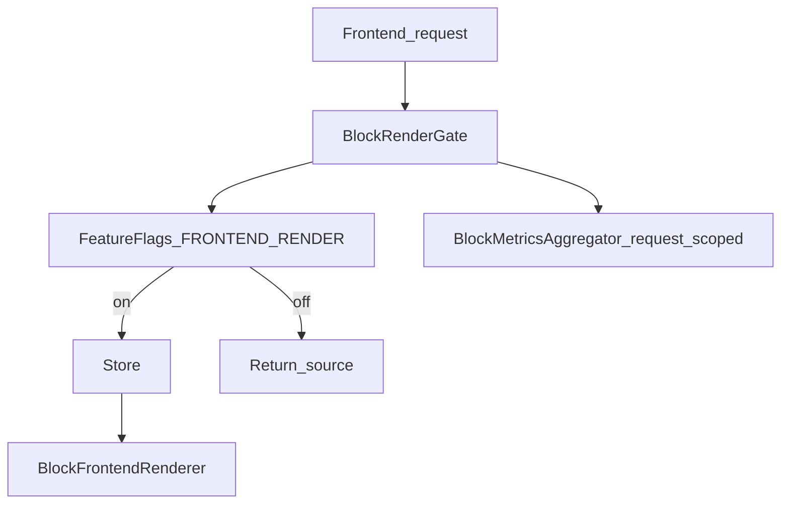
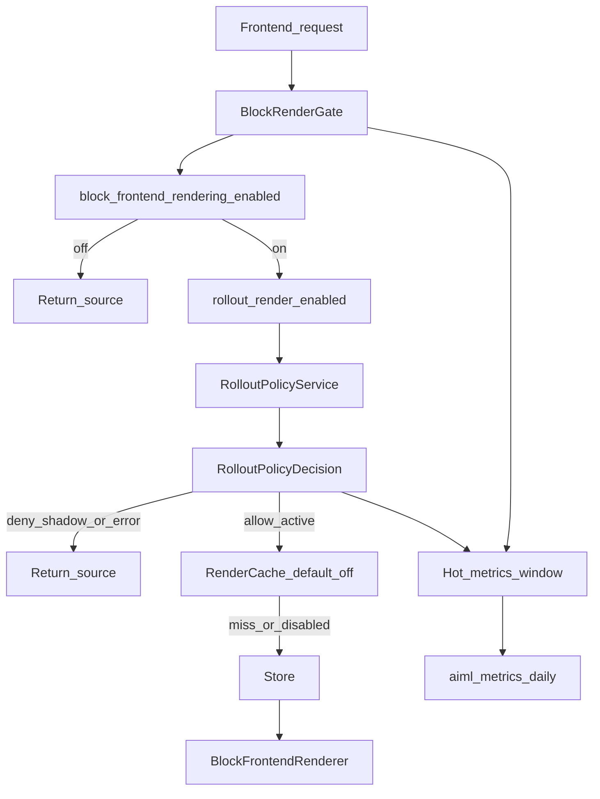
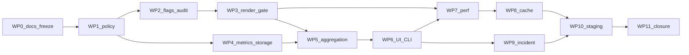

# F12 — Limited Rollout Plan

**Status:** **Complete** — merged to `main`; production observation Day-0 PASS (2026-08-05)
**Architecture:** Includes approved architecture-refinement passes: canonical FeatureFlags→Gate→Policy→(Cache)→Store→Renderer pipeline, two-level render control, frozen immutable `RolloutPolicyDecision`, pure `RolloutPolicyService`, configuration versioning/compatibility (`schema_version` / `policy_version`), append-only `metrics_registry_version`, reserved `CohortProvider` expansion, centralized cache key + `RenderCacheInvalidationService` ownership, shadow evaluation, Stages 0–5, two-tier metrics, concrete cache identity (Store translation-hash aggregate), operator capabilities, audit events, failure-mode matrix, observation checklist, strengthened F13 entry gate (reason-code stability + rollback rehearsal)
**Governance:** Changes that affect architecture, public contracts, milestone scope, service boundaries, or operational workflows require an ADR or an explicit architecture revision of this document. Implementation details, bug fixes, tests, and internal refactoring may proceed without modifying the architecture.
**Depends on:** F1–F9 complete; F10 Translator Workspace complete; F11 Translation Memory & AI Assistance complete ([STRATEGY_F_F11_TRANSLATION_MEMORY_AND_AI_ASSISTANCE.md](STRATEGY_F_F11_TRANSLATION_MEMORY_AND_AI_ASSISTANCE.md))
**ADR-0013:** Proposed — not Accepted; F12 does not promote ADR-0013
**Canonical doc:** This file. Master plan cross-ref: [STRATEGY_F_PRODUCTION_IMPLEMENTATION.md](STRATEGY_F_PRODUCTION_IMPLEMENTATION.md)
**Prior milestone:** [STRATEGY_F_F11_TRANSLATION_MEMORY_AND_AI_ASSISTANCE.md](STRATEGY_F_F11_TRANSLATION_MEMORY_AND_AI_ASSISTANCE.md)
**Validation log (reserved):** [F12_LIMITED_ROLLOUT_VALIDATION_LOG.md](F12_LIMITED_ROLLOUT_VALIDATION_LOG.md) — reserved path; **not created** until F12 implementation begins

---

## Document governance

| Fact | State |
|---|---|
| F12 planning | **This document** — architecture **frozen** for implementation |
| F12 production implementation | **Not started** |
| F12 nature | **Operational rollout only** — not translator product development |
| F13 | Remains **general rollout** + ADR acceptance |
| F11 | Remains **complete** |
| Architecture-changing deviations | Require an **ADR** or **approved plan revision** |

---

## Architecture Freeze

F12 architecture is **frozen**. Implementation must not change the following without an architectural change process:

| Frozen surface | Rule |
|---|---|
| Two-level render control | Global `block_frontend_rendering_enabled` master switch; `rollout_render_enabled` enables cohort evaluation only; stage/cohort never override the master kill switch |
| Canonical render pipeline | Sole supported path: FeatureFlags → BlockRenderGate → RolloutPolicyService → (optional Render Cache) → Store → BlockFrontendRenderer (§1); no bypass of policy |
| `RolloutPolicyService` purity | Pure decision engine only (§3); no persistence, audit, metrics, cache, logging, or config mutation |
| `RolloutPolicyDecision` DTO | Immutable value object; new instance per evaluation; fields and reason-code catalog in §3 |
| Configuration versioning | `schema_version` vs `policy_version` lifecycle in §4; legacy config migrated before runtime; policy evaluates current schema only |
| Rollout configuration schema | Option object fields and validation rules in §4 |
| Cohort model | Explicit post-ID allowlist in F12; future mechanisms via reserved `CohortProvider` only (§3) |
| Stages 0–5 | Canonical stage table in §5; no automatic promotion; promotion/rollback affect runtime only via `RolloutPolicyDecision` |
| Metrics model | Two-tier hot window + `aiml_metrics_daily`; append-only registry keys; independent `metrics_registry_version` (§7) |
| Cache identity | Components in §11; fingerprint = Store translation-hash aggregate; no undefined `translation_revision`; keys built only by cache services |
| Cache invalidation ownership | Canonical `RenderCacheInvalidationService` (§13); no independent ad-hoc invalidation; all reads/writes via cache abstraction |
| Cache activation | Separate from WP8 implementation; default off |
| Capability catalog | §14 additive capabilities |
| Audit-event catalog | §15 additive-only event names |
| Failure-mode contracts | §16 |
| F13 entry gate | §20 — includes reason-code distribution stability; F13 does not start because F12 code is complete |

**Architectural changes require:**

- an ADR, **or**
- an approved revision of this document

**Still allowed without architecture revision:** implementation details, tests, bug fixes, and internal refactoring that do not alter the frozen surfaces above.

### No speculative optimization

F12 must not introduce performance optimizations that are not justified by measured evidence against [F11_PERFORMANCE_BASELINE.md](F11_PERFORMANCE_BASELINE.md) and F12 measurement procedures (§17). Cache may be **implemented** default-off; **activation** requires a measured GO.

---

## Implementation invariants

1. Denied, failed, shadow, or kill-switched frontend paths **always return source content**.
2. Registration is **not** an emergency kill switch; retain UUID attribute registration under ordered rollback.
3. Never delete UUIDs, Store translations, or TM rows during emergency rollback.
4. Workspace edit access (`aiml_translate` + `edit_post`) is **independent** of render cohort eligibility.
5. Metrics failure never alters frontend rendering.
6. Cache failure never forces translated render; bypass or source fallback only.
7. No percentage/hash cohorts in F12.
8. No translator-facing product features in F12.
9. No synchronous persistent metric writes on every frontend render.
10. No long-term metric dimensions containing post IDs, segment keys, UUIDs, text, prompts, emails, API keys, or raw provider errors.
11. Direct WordPress option editing is **not** the normal operator workflow.
12. Stage promotion is **never** automatic.
13. `RolloutPolicyService` is a **pure** decision engine (no side effects).
14. Runtime metrics, cache contents, and telemetry **never** modify `schema_version` or `policy_version`.
15. Cache invalidation is owned by **`RenderCacheInvalidationService`** (or equivalent); other services must not invalidate independently.
16. The only supported frontend translated-render path is the **canonical pipeline** in §1; no alternate path may bypass `RolloutPolicyService`.
17. Promotion or rollback may change runtime behavior **only** through subsequent `RolloutPolicyDecision` evaluation — no silent side-channel behavior changes.

---

## Evidence taxonomy (read first)

| Layer | What it proved | What it did **not** prove |
|---|---|---|
| **F1–F8 engine** | UUID identity, extraction, Store, render gate, migration, flags, CLI ops | Production cohort safety |
| **F9 browser** | Production Gutenberg + frontend on adapter allowlist | Limited production cohort operation |
| **F10–F11** | Translator workspace, TM, AI suggestions, QA | Operational rollout, persistent metrics, render cache |
| **F12 (this plan)** | Limited cohort, flags, telemetry, monitoring, performance evidence, optional cache, diagnostics, rollback | General production approval (F13) |

**Reuse mandate:** F12 extends [`BlockRenderGate`](../../src/Translation/BlockRenderGate.php), [`FeatureFlags`](../../src/Block/FeatureFlags.php), [`BlockMetricsAggregator`](../../src/Block/BlockMetricsAggregator.php), [`Store`](../../src/Translation/Store.php), and existing CLI/settings patterns. **No** new translator UI product surface. **No** parallel render pipeline.

---

## Purpose and success definition

| Milestone | Role |
|---|---|
| **F11** | Translator productivity complete |
| **F12** | Operate a **limited production cohort** with kill switches, telemetry, metrics, diagnostics, performance budgets, optional cache, and proven rollback |
| **F13** | General rollout + ADR-0013 acceptance path |

**F12 success** means operators can promote/rollback stages safely, observe bounded metrics, and keep public visitors on source when policy denies or systems fail — without adding translator features.

---

## Current and target architecture

### Today (post-F11, pre-F12)



### F12 target



---

## 1. Two-level render control

### Canonical frontend render pipeline (frozen)

The **only** supported frontend translated-render path is:

```text
FeatureFlags
    →
BlockRenderGate
    →
RolloutPolicyService
    →
(optional Render Cache)
    →
Store
    →
BlockFrontendRenderer
```

| Rule | Requirement |
|---|---|
| Sole path | No alternate rendering path may produce translated frontend output |
| No policy bypass | No path may skip `RolloutPolicyService` evaluation for translated frontend render |
| Cache optional | Render cache sits **after** a positive active policy decision (and kill-switch checks); it never substitutes for policy |
| Invariant | This pipeline is a **frozen architectural invariant** |

### Hierarchy (evaluate in order)

1. Existing Strategy F dependency chain must pass (`registration` → `injection` → `extraction` → `frontend_render` per [`FeatureFlags`](../../src/Block/FeatureFlags.php)).
2. `block_frontend_rendering_enabled` is the **global master render switch**.
3. `rollout_render_enabled` enables **cohort-policy evaluation** (and active allow when policy permits).
4. `RolloutPolicyService` must allow the request (`RolloutPolicyDecision.allowed === true`) for **active** translated rendering.

**Neither rollout stage nor cohort membership may override the global frontend-render kill switch.**

### Truth table

| deps_ok | frontend_render | rollout_render | policy outcome | Mode | Final visitor result |
|---|---|---|---|---|---|
| F | * | * | * | — | **Source** (dependency/flag deny) |
| T | F | * | * | — | **Source** (`frontend_rendering_disabled`) |
| T | T | F | * | — | **Source** (`rollout_disabled`); policy may still shadow-eval for metrics when stage requires shadow |
| T | T | T | `allowed=false` (e.g. not allowlisted) | Active | **Source** (stable reason_code) |
| T | T | T | `allowed=true` | Active | **Translated path** (Store/cache/render) |
| T | T | T | would allow | **Shadow** (Stage 1) | **Source** (decision recorded only) |
| T | T | * | malformed config | — | **Source** (`invalid_configuration`) |
| T | T | * | policy exception/failure | — | **Source** (`policy_error`) |

All denied or failed cases return **source content**.

---

## 2. Workspace vs render access

| Concern | Gate |
|---|---|
| Workspace edit | Capability `aiml_translate` + `edit_post` (existing F10/F11) |
| Frontend translated render | Two-level render control + `RolloutPolicyDecision` |

Translators may prepare content **outside** the render cohort. Render eligibility does **not** grant workspace access and vice versa.

---

## 3. Rollout policy contract

### Ownership and purity

- **`RolloutPolicyService`** owns all cohort/stage/language/post-type policy **evaluation**.
- **`BlockRenderGate`** (and other orchestrators) only consume `RolloutPolicyDecision` after flag checks.
- Planned path (implementation later): `src/Rollout/RolloutPolicyService.php`, `src/Rollout/RolloutPolicyDecision.php`.

**`RolloutPolicyService` is a pure decision engine.** It evaluates policy and returns a `RolloutPolicyDecision`. It **MUST NOT**:

- persist data
- write audit events
- emit metrics
- invalidate cache
- perform logging
- mutate configuration

Persistence, audit, metrics, logging, and cache invalidation occur only in **higher orchestration layers** (e.g. render-gate wrapper, promotion service, metrics aggregator, `RenderCacheInvalidationService`).

### Frozen DTO: `RolloutPolicyDecision`

`RolloutPolicyDecision` is an **immutable value object**.

| Rule | Requirement |
|---|---|
| Immutability | After construction it **must never** be modified |
| Construction | Every evaluation returns a **newly created** decision object |
| Determinism | Same inputs + same config version → same field values across frontend, CLI, diagnostics, tests, and future services |

Required fields:

| Field | Type | Meaning |
|---|---|---|
| `allowed` | `bool` | Whether **active** translated render is permitted |
| `reason_code` | `string` | From frozen catalog below |
| `stage` | `int` | Current `rollout_stage` (0–5) |
| `policy_version` | `int` | Config `policy_version` that produced the decision |
| `cohort_match` | `bool` | Post ID allowlist match |
| `language_match` | `bool` | Language allowlist match |
| `post_type_match` | `bool` | Post-type allowlist match |

**Forbidden in the DTO:** post body, translation text, UUID, segment key, prompt, secret, email, API key.

### Frozen reason-code catalog (additive-only after F12)

| Code | Meaning |
|---|---|
| `rollout_disabled` | `rollout_render_enabled` is false (or equivalent) |
| `stage_disabled` | Stage does not permit active/shadow evaluation as configured |
| `post_not_allowlisted` | Post ID not in `allowed_post_ids` |
| `post_type_not_allowed` | Post type not in `allowed_post_types` |
| `language_not_allowed` | Language not in `allowed_language_codes` |
| `unsupported_request` | Non-frontend or unsupported request class |
| `invalid_configuration` | Config failed validation / fail-closed |
| `policy_error` | Unexpected policy failure |
| `allowed` | Policy allows active translated render |

Reason codes are **stable diagnostics contracts**. New codes after F12 are **additive only**.

### Reason-code purpose (frozen)

`reason_code` values are **operator diagnostics only**.

| Rule | Requirement |
|---|---|
| Audience | Operators, metrics, CLI, audit/diagnostics — not public visitors |
| Contract | Stable machine-readable codes (additive-only catalog) |
| Not localization | Codes are **not** localization strings |
| Not user-facing copy | Codes are **not** end-user messages |
| UI wording | Any human-readable UI text is produced **separately** (mapped from codes in presentation layer) |

### Cohort model (F12)

| Control | Rule |
|---|---|
| Primary key | Explicit **post ID allowlist** |
| Secondary filters | AND: `post_type ∈ approved set`, language code ∈ configured Languages |
| Approved post types | `{post, page}` only |
| Percentage / hash cohort | **Rejected** during F12 |

### Reserved future cohort providers (architectural reservation only)

F12 does **not** introduce percentage, visitor, tenant, or organization rollout strategies.

Future rollout mechanisms (examples only — **not in F12 scope**):

- percentage rollout
- visitor cohorts
- tenant cohorts
- organization cohorts

**must** be introduced through separate **`CohortProvider`** implementations (or equivalent) plugged into the policy evaluation path.

| Constraint | Rule |
|---|---|
| F12 strategy | Post-ID allowlist (+ post type / language filters) only |
| Decision DTO | `RolloutPolicyDecision` fields remain **unchanged** |
| Reason codes | Additive only if a new deny class is truly required |
| This section | Reservation only — **no** F12 implementation of alternate providers |

---

## 4. Configuration schema

Canonical WordPress option object (exact option key chosen at WP1; single atomic value):

| Field | Type | Rules |
|---|---|---|
| `schema_version` | `int` | Configuration **structure** version (see versioning policy) |
| `policy_version` | `int` | Operator-visible policy revision (see versioning policy) |
| `rollout_stage` | `int` | 0–5 |
| `rollout_render_enabled` | `bool` | Enables cohort-policy evaluation path |
| `allowed_post_ids` | `int[]` | Normalized, unique, positive integers |
| `allowed_post_types` | `string[]` | Subset of `{post, page}` only |
| `allowed_language_codes` | `string[]` | Must exist in configured Languages |
| `render_cache_enabled` | `bool` | Default **false** |
| `block_diagnostics_enabled` | `bool` | Operator diagnostics verbosity (WP placement unresolved — see §24) |
| `updated_at` | `string` | GMT/ISO timestamp |
| `updated_by` | `int` | Acting user ID |

### Validation and write rules

1. Updates are **validated** and written **atomically**.
2. Post IDs: positive integers only; deduplicated; normalized.
3. Language codes must exist in configured Languages; unknown codes rejected.
4. Post types outside `{post, page}` rejected.
5. Empty `allowed_post_ids` in limited-rollout stages **denies all** frontend translated rendering (fail closed).
6. Malformed configuration **fails closed** (source render; `invalid_configuration`).
7. Every successful **operator-visible policy** change increments `policy_version` (see versioning policy).
8. Prior sanitized snapshot retained for rollback/restore.
9. Percentage/hash cohort fields are **not accepted**.
10. Direct `update_option` editing is **not** the normal operator workflow — use config/promotion services (UI/CLI).

### Configuration versioning policy (frozen)

| Version | Changes when | Does **not** change when |
|---|---|---|
| `schema_version` | The rollout configuration **structure** changes (fields added/removed/renamed, type changes, validation shape changes) | Operator edits stage, allowlists, or flags that fit the existing structure |
| `policy_version` | Any **operator-visible** rollout policy change: stage, allowlists, `rollout_render_enabled`, `render_cache_enabled`, `block_diagnostics_enabled`, and equivalent policy fields; also on **restore** of a previous snapshot | Runtime metrics, observations, counters, cache contents, telemetry, or read-only diagnostics |

Additional frozen rules:

1. Restoring a previous rollout snapshot **also increments** `policy_version` (restore is a new policy revision that happens to match prior values).
2. Runtime metrics, observations, counters, cache contents, and telemetry **never** modify `schema_version` or `policy_version`.
3. `metrics_registry_version` (§7) is **independent** of both versions and must not be conflated with them.

### Configuration compatibility (frozen)

| Rule | Requirement |
|---|---|
| Migrate before use | Legacy / older `schema_version` rollout configuration **must be migrated** to the current schema **before** runtime use |
| Current schema only | `RolloutPolicyService` evaluates **only** the current schema |
| No runtime compat shims | Runtime policy evaluation **never** contains compatibility logic for historical schemas |
| Determinism | Compatibility work belongs in load/migrate/validate paths — not inside the pure decision engine |

This keeps the policy engine deterministic and free of historical branching.

### Snapshot / restore

Before every rollout-stage or cohort mutation, preserve a **sanitized** snapshot (no secrets).

Operator functions (shared service):

- export current rollout configuration;
- validate configuration;
- compare proposed vs current;
- restore previous version;
- list recent `policy_version` values.

Restore applies atomically and increments `policy_version`.

---

## 5. Shadow mode and Stages 0–5

### Shadow evaluation (one policy engine)

Shadow mode:

- Orchestration asks `RolloutPolicyService` to **evaluate** the request (pure; returns a new `RolloutPolicyDecision`);
- **Higher layers** record bounded decision metrics from that decision;
- frontend **always** receives **source** content;
- **never** enables translated frontend output.

Stage 1 defaults to shadow. Stages 2–4 use **active** evaluation when master render + `rollout_render_enabled` are on. There is **no** second policy engine.

### Observation window

Recommended default: **14 days**.

**Unresolved product-owner decision** until approved — do not treat 14 days as a frozen production value.

### Canonical stage table

| Stage | Cohort shape | Policy mode | Translated render | Min observation | Promotion criteria | Rollback criteria | Operator sign-off | Evidence required |
|---|---|---|---|---|---|---|---|---|
| **0** | Empty / N/A | Off | Never | — | Deps validated; config schema live; services deployed disabled | N/A | Ops + eng | WP0–WP2 green; smoke source OK |
| **1** | Internal test post IDs (PO-chosen) | **Shadow** | Never (always source) | PO-approved window (propose 14d) | Shadow metrics stable; denial reasons expected; no SEV-1 | Any SEV-1; restore prior policy | Ops | Shadow allow/deny distribution; incident log empty SEV-1 |
| **2** | Selected pages + one language (PO) | Active | Allowed if policy allows | PO-approved window | Zero rendered FP; latency within approved budgets; no SEV-1; SEV-2 under threshold | SEV-1 or SEV-2 over threshold; FP &gt; 0 | Ops + PO | Metrics snapshot; browser smoke; perf evidence |
| **3** | Selected content cohort (PO) | Active | Allowed if policy allows | PO-approved window | Same as Stage 2 for broader cohort | Same | Ops + PO | Observation checklist PASS |
| **4** | Broader limited cohort (PO) | Active | Allowed if policy allows | PO-approved window | F13 readiness evidence nearly complete | Same | Ops + PO | Full observation + rollback drill |
| **5** | F13 readiness freeze | Active | Allowed if policy allows | Closure checklist | F13 entry gate (§20) PASS | Emergency stop | Ops + PO + eng | F12 DoD + §20 checklist |

**No automatic promotion.**

---

## 6. Promotion and rollback operations

### Shared promotion service

UI and CLI **must** call the same promotion service (planned name: `RolloutPromotionService`). Direct option editing is not the normal path.

### Promotion / rollback behavioral invariant (frozen)

Promotion or rollback may only change runtime visitor behavior through subsequent **`RolloutPolicyDecision` evaluation** (after the updated config is active).

| Rule | Requirement |
|---|---|
| Sole behavior channel | Stage/cohort/flag changes take effect only via the canonical pipeline + policy decision |
| No silent side effects | No other runtime behavior may **silently** change during stage promotion (e.g. hidden renderer forks, ad-hoc allowlists, bypass flags) |
| Cache / metrics | Cache enablement and metrics remain separately gated; they do not invent alternate render paths |

### Pre-promotion checklist

1. Pre-promotion checklist completed
2. Metrics snapshot captured
3. Open-incident review (no blocking SEV-1; SEV-2 under threshold)
4. Configuration snapshot saved
5. Required capability present (`aiml_promote_rollout`)
6. Explicit confirmation prompt
7. Audit event emitted
8. Post-promotion smoke validation
9. Defined rollback window communicated

### Rollback

- Restore a prior **validated** policy snapshot **atomically**.
- Increment `policy_version`.
- Emit `rollout_stage_rolled_back` (or emergency event).

### Emergency rollback order

1. Disable rollout rendering (`rollout_render_enabled` / emergency stop).
2. Disable cache (`render_cache_enabled`).
3. Disable extraction if needed.
4. Disable UUID injection only if operationally safe.
5. **Retain** attribute registration.
6. **Retain** UUID metadata.
7. **Retain** Store and TM rows.
8. Validate source frontend.
9. Preserve evidence.
10. Investigate offline.

**Never delete** UUIDs, translations, or TM rows during emergency rollback.

Aligns with and extends master plan [§15.4](STRATEGY_F_PRODUCTION_IMPLEMENTATION.md) rollback.

### Incident severity (operational)

| SEV | Examples | Response |
|---|---|---|
| SEV-1 | Rendered false positive; mass wrong-language; public fatal | Immediate emergency rollback |
| SEV-2 | Elevated fallback/failure rates; cohort misconfig | Freeze promotion; consider stage rollback |
| SEV-3 | Diagnostics/metrics gaps; non-visitor impact | Fix forward; no auto-rollback |

---

## 7. Metrics architecture

### Two-tier model

#### Hot operational window

Purpose: recent incidents, policy denials, render failures, current-stage health.

| Characteristic | Rule |
|---|---|
| Retention | Short (implementation chooses hours/days; document in WP4) |
| Storage | WordPress-native (options/transients or bounded ring) |
| Dimensions | Bounded registry dimensions only |
| Cardinality | Hard caps; no post IDs / UUIDs |

#### Daily aggregate table: `aiml_metrics_daily`

Aggregate storage — **not** an event log.

Suggested columns / fields:

| Field | Purpose |
|---|---|
| `day` | UTC date key |
| `metric_key` | Registry key only |
| `dimension_hash` or bounded dimension columns | Canonical bounded dimensions only |
| `count` | Event/sample count |
| `sum` | For latency/usage totals |
| `min` / `max` | Latency extremes |
| `completeness` / error state | Telemetry incomplete flag where needed |

| Rule | Requirement |
|---|---|
| Registry | Canonical metric registry; no free-form names |
| Registry version | Independent `metrics_registry_version` (see below) |
| Dimensions | Allowed set **per metric**; no caller-defined labels |
| Cardinality | Hard maximum per dimension set |
| Concurrency | Safe increments under concurrent requests |
| Retention | Documented retention + cleanup job |
| Failure | Graceful; never break frontend |

### Metrics registry version (frozen concept)

Reserve an independent **`metrics_registry_version`** (documentation / code constant; not a rollout config field).

| Rule | Requirement |
|---|---|
| Independence | Unrelated to `schema_version` and `policy_version` |
| Append-only keys | Metric **keys** are **append-only** after publish; do not reuse a key for a different meaning |
| Semantic change | Any semantic change to an existing metric (meaning, unit, dimension set, aggregation semantics) **requires** a `metrics_registry_version` bump |
| Evolution | Adding keys/dimensions or changing aggregation shape bumps `metrics_registry_version` as documented in the registry changelog |
| Policy isolation | Metric registry evolution does **not** imply a rollout policy change and must **not** increment `policy_version` |
| Consumers | Dashboards and exports rely on registry compatibility via `metrics_registry_version` |
| F12 scope | Document and implement as a frozen constant/registry metadata — **no** new product surface |

---

## 8. Non-blocking metric flow

Persistent DB writes must **not** run synchronously on every frontend render.

```text
request-scoped BlockMetricsAggregator
    →
bounded short-lived buffer
    →
non-blocking flush
    →
scheduled daily rollup
```

**Scheduling:** Prefer WordPress cron via the host’s existing real cron that invokes `wp-cron.php` (Biopentra VPS already runs this on a short interval). Action Scheduler is **not** present in this plugin — do **not** introduce it as a mandatory new dependency for F12.

**Metrics failure:** mark telemetry incomplete; **never** break or alter frontend rendering; never expose exceptions to visitors.

---

## 9. Privacy and cardinality

### Prohibited long-term dimensions

- post IDs
- segment keys
- UUIDs
- source text
- translated text
- prompts
- emails
- API keys
- raw provider error bodies

### Allowed bounded dimensions

- rollout stage
- configured language code
- approved post type
- policy reason_code
- provider ID (from registry)
- result class
- cache outcome

### Per-post diagnostics

Require all of:

- explicit operator trigger;
- access control (`aiml_view_rollout` / `aiml_manage_rollout_metrics`);
- short expiration;
- no body content.

---

## 10. Telemetry catalog

Bounded operational metrics only. **Never** log translation bodies or prompts.

### Rendering

- attempts · allowed · denied by stable reason · completed · failed · fallback · latency · rendered false positives

### Identity and extraction

- UUID events · repair failures · extracted segments · extraction failures · stale/orphaned counts

### Workspace

- loads · saves · 409 conflicts · partial batches · QA-blocked saves

### TM

- exact/fuzzy hits · accepted suggestions · write-backs · usage records · lookup latency

### AI

- translate/suggest requests · capability rejection · provider errors · latency · bounded usage/cost where provider reports

---

## 11. Cache architecture

### Backend

- Primary abstraction: WordPress **object cache API**.
- WordPress-native fallback (e.g. transient-compatible) only if necessary.
- **No** new external caching dependency.

### Cache identity (frozen)

| Component | Owner / source |
|---|---|
| Source post ID | Queried post |
| Source content hash | Deterministic hash of normalized `post_content` (same hashing family as Store) |
| Target language ID | Resolved target language |
| Deterministic translation fingerprint | Aggregate of renderable persisted Store rows for `(post_id, language_id)`, ordered by `segment_key`, using existing per-row [`Store::translation_hash()`](../../src/Translation/Store.php) values, then hashed once |
| Policy version | Rollout config `policy_version` |
| Renderer contract version | Frozen constant on frontend renderer |

**Do not use** an undefined `translation_revision` field.

### Cache service ownership (frozen)

| Rule | Requirement |
|---|---|
| Key construction | **Only** cache services construct cache keys / identities |
| No manual identities | Callers **never** manually build cache identities |
| Read/write path | All cache reads and writes go through the cache abstraction |
| Invalidation | Remains owned exclusively by `RenderCacheInvalidationService` (§13) |

### Cache behavior

- Miss / disabled / failure → normal Store + render path.
- Never bypasses global or rollout kill switches.
- Source fallback if renderer fails.

---

## 12. Cache implementation vs activation

### WP8 Definition of Done (implementation)

- Cache service implemented
- Key construction implemented
- Invalidation implemented
- Independent default-**off** flag (`render_cache_enabled`) implemented
- Kill-switch precedence tested
- Post/language isolation tested
- Measured activation decision **documented**

**F12 may close with cache implemented but disabled.**

### Activation

Requires a separate explicit **measured GO** decision (technical + product owner as appropriate). Not implied by WP8 completion.

---

## 13. Cache invalidation

### Ownership (frozen)

Reserve **`RenderCacheInvalidationService`** (or equivalent application service) as the **canonical owner** of render-cache invalidation.

| Rule | Requirement |
|---|---|
| Single owner | All invalidation paths call this service |
| Exclusive invalidation | Invalidation remains owned **exclusively** by `RenderCacheInvalidationService` |
| No ad-hoc invalidation | Future/other services must **not** invalidate the render cache independently |
| Orchestration | Store saves, migrations, flag/stage changes, and operator purge invoke this service |
| Kill switch | Emergency render disable bypasses cache read path immediately; purge may still be coordinated through this service when needed |
| Key construction | Callers never invent keys; invalidation uses the same cache-service identity contract (§11) |

### Triggers

Invalidate on:

| Trigger | Invalidate? |
|---|---|
| Source content save | Yes |
| Single translation save | Yes |
| Batch translation save | Yes |
| Stale/orphan reconciliation | Yes |
| Migration | Yes |
| Language configuration change | Yes |
| Global frontend-render flag change | Yes |
| Rollout-stage change | Yes |
| Cohort change | Yes |
| `policy_version` change | Yes |
| Renderer-contract-version change | Yes |
| Explicit operator purge | Yes |
| TM suggestion-only change (no persisted translation) | **No** |
| AI provider configuration change alone | **No** (until persisted translation changes) |

**Emergency kill switch** bypasses cache immediately **without** requiring purge.

---

## 14. Capabilities

Do **not** rely solely on `manage_options` for rollout operations without documenting the decision. F12 introduces explicit capabilities:

| Capability | Purpose |
|---|---|
| `aiml_view_rollout` | Read status, metrics, snapshots |
| `aiml_manage_rollout` | Edit cohort/config (not promote) |
| `aiml_promote_rollout` | Stage promotion |
| `aiml_emergency_rollback` | Emergency stop / restore |
| `aiml_manage_rollout_metrics` | Metrics reset / diagnostics reports |

### Initial assignment

Recommend granting all five to the **Administrator** role initially.

**Exact capability → role mapping remains an unresolved PO decision** (§24). Until approved, implementation defaults to Administrator-only grants.

### Authorization surfaces

| Surface | Rule |
|---|---|
| CLI | Require `--user` with the capability for the mutation; fail closed without it |
| REST / admin AJAX | Capability check + WordPress nonce / REST permission_callback |
| Config mutation | `aiml_manage_rollout` |
| Promote | `aiml_promote_rollout` |
| Emergency | `aiml_emergency_rollback` |
| Metrics reset / per-post report | `aiml_manage_rollout_metrics` |
| Workspace edit | Existing `aiml_translate` (unchanged) |

`manage_options` may remain for unrelated plugin settings pages; rollout mutations must check the explicit `aiml_*` capabilities above.

---

## 15. Audit events

Frozen additive-only event names:

| Event | When |
|---|---|
| `rollout_configuration_changed` | Cohort/config mutation |
| `rollout_stage_promoted` | Successful promotion |
| `rollout_stage_rolled_back` | Stage rollback / restore |
| `rollout_render_enabled` | Rollout render turned on |
| `rollout_render_disabled` | Rollout render turned off |
| `rollout_cache_enabled` | Cache flag on |
| `rollout_cache_disabled` | Cache flag off |
| `rollout_emergency_stop` | Emergency stop |
| `rollout_policy_evaluated` | Aggregate / diagnostics — **not** unbounded per-request persistence |
| `rollout_metrics_reset` | Metrics reset |
| `rollout_cache_purged` | Operator purge |

### Stable payload fields

`event` · `old_stage` · `new_stage` · `policy_version` · `user_id` · `timestamp` · `source` · `reason`

**No** content, prompt, or secret payloads.

`rollout_policy_evaluated` should normally be **aggregated** (hot window / daily metrics), not emitted as unbounded per-request persistent audit rows.

---

## 16. Failure-mode matrix

| Service | Fail-safe |
|---|---|
| Rollout policy failure | Deny translated render; return source; `reason_code = policy_error` |
| Metrics failure | Rendering continues; telemetry marked incomplete |
| Cache failure | Bypass cache; use normal renderer; source fallback if renderer fails |
| Diagnostics failure | No frontend effect |
| Configuration validation failure | Reject mutation; preserve active policy |
| Snapshot restore failure | Retain current validated policy; report operator error; **do not** partially apply |
| Provider / AI failure | Frontend rendering unaffected; workspace receives normalized provider error only |

---

## 17. Performance measurement

Consume [F11_PERFORMANCE_BASELINE.md](F11_PERFORMANCE_BASELINE.md).

**Do not invent current measurements.** Thresholds are approved after measurement.

For every measured surface, record:

| Field | Required |
|---|---|
| Cold median | Yes |
| Warm median | Yes |
| p95 | Yes |
| Database query count | Yes |
| PHP memory delta | Yes |
| Sample size | Yes |
| Content size | Yes |
| Acceptable regression percentage | Yes (owner-approved) |
| Evidence location | F12 validation log (reserved) |
| Technical-owner approval | Yes |
| Product-owner approval | Where appropriate |

### Surfaces (minimum)

- Frontend cold/warm render (cohort allow)
- Frontend deny/fallback path
- Policy evaluation overhead
- Metrics flush/rollup cost
- Cache hit vs miss (only if activation GO)
- Workspace load/save (regression vs F11 baseline)

Reserve performance evidence sections in the F12 validation log when that file is created during implementation.

---

## 18. AI cost guardrails

Operational controls only — **no** billing analytics, **no** provider architecture change.

| Control | Plan |
|---|---|
| Request counts | Track bounded |
| Provider errors | Track bounded |
| Token/usage totals | Where provider reports |
| Daily warning threshold | Unresolved PO value |
| Optional hard operational limit | Unresolved PO value |
| Safe failure | Workspace normalized error; no frontend impact |
| Frontend dependency on AI | **None** |
| Prompt/body logging | **Forbidden** |

---

## 19. Observation checklist

During limited-rollout stages, require scheduled review of:

- rendered false positives
- render failures
- policy denials (by reason)
- reason-code distribution stability (watch for `policy_error` / `invalid_configuration` spikes)
- source fallback rate
- cache behavior (if enabled)
- workspace errors
- 409 conflicts
- TM write-back health
- provider failures / cost
- QA-blocked saves
- open incidents

| Item | Rule |
|---|---|
| Responsible operator | Named ops owner (site-specific) |
| Review cadence | Daily or scheduled per stage (PO/ops) |
| Evidence location | F12 validation log + metrics export |
| Sign-off | Required before each promotion |
| Escalation | SEV-1 → emergency rollback; SEV-2 → freeze promotion |

---

## 20. F13 entry gate

F13 must **not** begin merely because F12 code is complete.

Require **all** of:

1. Approved limited cohort operated for the approved observation window
2. Zero unresolved SEV-1 incidents
3. SEV-2 below approved threshold
4. Rendered false positives = **0**
5. Rollback drill **PASS** — evidence of at least one successful **rollback rehearsal** using the **documented operator workflow** (UI and/or CLI shared services)
6. Config export/restore **PASS**
7. Cache kill-switch **PASS** if cache implemented
8. Metrics retention/cleanup validated
9. Human operator sign-off
10. ADR-0013 status **explicitly reviewed** (may remain **Proposed**)
11. **Reason-code distribution remains operationally stable** throughout the observation window

### Reason-code stability (operational requirement)

Operators must review denial/`reason_code` distributions before F13. Without inventing numeric thresholds:

- no sustained `policy_error` spikes
- no sustained `invalid_configuration` spikes
- unexpected deny reasons investigated and resolved or accepted before promotion

Evidence is recorded in the F12 validation log / observation checklist. Threshold values, if any, remain a **PO/ops decision** — this gate only requires the stability review.

### Rollback rehearsal (operational requirement)

Before F13 there must be evidence of **at least one successful rollback rehearsal** executed through the documented operator workflow (shared promotion/rollback services — not ad-hoc option edits).

| Rule | Requirement |
|---|---|
| Evidence | Recorded in the F12 validation log |
| Workflow | Uses documented CLI/UI paths and capabilities |
| Thresholds | None invented here — success means the documented restore/emergency path returned the site to the expected policy state and source/translated behavior matched expectation |
| Scope | Does **not** redesign the rollout process |

---

## 21. Work packages (WP0–WP11)

### Dependency diagram



### WP0 — Documentation freeze

| | |
|---|---|
| **Objective** | Freeze this plan; reserve validation log |
| **Deliverables** | This document; ROADMAP/master cross-refs |
| **Dependencies** | F11 complete |
| **Expected files** | `docs/plans/STRATEGY_F_F12_LIMITED_ROLLOUT.md` |
| **Acceptance** | Architecture freeze accepted; unresolved PO list explicit |
| **Validation** | Link check; no `src/` changes in this WP |
| **Rollback** | Revert docs commit |
| **Stop conditions** | Scope creep into translator features |
| **Commit boundary** | Docs-only |

### WP1 — Policy / cohort

| | |
|---|---|
| **Objective** | `RolloutPolicyService` (pure), immutable `RolloutPolicyDecision`, config schema + versioning policy, snapshots |
| **Deliverables** | Policy service; config repository; validation; snapshot store; versioning rules |
| **Dependencies** | WP0 |
| **Expected files** | `src/Rollout/*` (planned); options schema; unit tests |
| **Acceptance** | AC-1–AC-8, AC-27–AC-28; empty allowlist denies; fail closed; pure service |
| **Validation** | Tier 0 PHPUnit |
| **Rollback** | Disable rollout flag; retain prior option |
| **Stop conditions** | Hash/% cohort introduced |
| **Commit boundary** | Policy + schema only |

### WP2 — Flags and audit

| | |
|---|---|
| **Objective** | Rollout flags, capabilities, audit catalog wiring |
| **Deliverables** | Flag integration; capability registration; audit writer |
| **Dependencies** | WP1 |
| **Expected files** | Settings/FeatureFlags extensions; capability bootstrap; audit helper |
| **Acceptance** | AC-6–AC-8; master kill switch precedence |
| **Validation** | Tier 0 |
| **Rollback** | Capabilities unused if flags off |
| **Stop conditions** | Registration used as kill switch |
| **Commit boundary** | Flags + audit + caps |

### WP3 — Render-gate integration

| | |
|---|---|
| **Objective** | Wire two-level control + policy into `BlockRenderGate` |
| **Deliverables** | Gate consumes decision; shadow returns source; metrics hooks |
| **Dependencies** | WP2 |
| **Expected files** | `BlockRenderGate.php` (consume only); integration tests |
| **Acceptance** | Truth table ACs; shadow never translates |
| **Validation** | Tier 0 + targeted smoke when approved |
| **Rollback** | `rollout_render_enabled=false` |
| **Stop conditions** | Gate owns policy logic |
| **Commit boundary** | Gate integration |

### WP4 — Metrics storage

| | |
|---|---|
| **Objective** | Hot window + `aiml_metrics_daily` schema/migration + registry version |
| **Deliverables** | Table migration; registry; `metrics_registry_version`; concurrency-safe writers |
| **Dependencies** | WP1 |
| **Expected files** | Schema/migration; metrics repository |
| **Acceptance** | AC-9–AC-11; no prohibited dimensions |
| **Validation** | Tier 0 |
| **Rollback** | Drop unused table only with ops approval; never affect render |
| **Stop conditions** | Sync DB write on every render |
| **Commit boundary** | Metrics storage |

### WP5 — Aggregation and diagnostics

| | |
|---|---|
| **Objective** | Non-blocking flush + daily rollup + diagnostics surfaces |
| **Deliverables** | Aggregator flush; cron rollup; incomplete telemetry flag |
| **Dependencies** | WP3, WP4 |
| **Expected files** | Aggregator extensions; cron hook; diagnostics readers |
| **Acceptance** | AC-12–AC-13 |
| **Validation** | Tier 0 |
| **Rollback** | Disable diagnostics flag |
| **Stop conditions** | New mandatory Action Scheduler dependency |
| **Commit boundary** | Aggregation |

### WP6 — UI and CLI

| | |
|---|---|
| **Objective** | Operator UI + CLI sharing promotion/config services |
| **Deliverables** | Admin screens; `wp aiml rollout …` commands; confirmation prompts |
| **Dependencies** | WP5 |
| **Expected files** | Admin JS/PHP; CLI commands; shared services |
| **Acceptance** | AC-14–AC-16; CLI/UI parity |
| **Validation** | Tier 0; TS/Jest if UI touched |
| **Rollback** | Hide UI; CLI remains gated by caps |
| **Stop conditions** | Direct option edit as primary UX |
| **Commit boundary** | Operator surfaces |

### WP7 — Performance budgets

| | |
|---|---|
| **Objective** | Measure vs F11 baseline; record approval fields |
| **Deliverables** | Measurement runs; validation-log evidence sections |
| **Dependencies** | WP6 |
| **Expected files** | Validation log entries (when log created); docs evidence |
| **Acceptance** | AC-17; owner approvals recorded or explicitly deferred |
| **Validation** | Measurement procedures |
| **Rollback** | N/A (docs/evidence) |
| **Stop conditions** | Invented thresholds treated as SLOs |
| **Commit boundary** | Evidence docs |

### WP8 — Cache (default off)

| | |
|---|---|
| **Objective** | Implement safe cache + `RenderCacheInvalidationService`; leave disabled unless measured GO |
| **Deliverables** | Cache service; keys; invalidation service; default-off flag; tests |
| **Dependencies** | WP7 |
| **Expected files** | `src/Rollout/` or `src/Block/` cache collaborator; tests |
| **Acceptance** | AC-18–AC-19; WP8 DoD (§12) |
| **Validation** | Tier 0; smoke if enabled |
| **Rollback** | Keep `render_cache_enabled=false` |
| **Stop conditions** | Activation without measured GO |
| **Commit boundary** | Cache implementation |

### WP9 — Incident and rollback tooling

| | |
|---|---|
| **Objective** | Emergency stop, restore, observation checklist tooling |
| **Deliverables** | Emergency CLI/UI; restore; drill script/runbook |
| **Dependencies** | WP6 |
| **Expected files** | Promotion/rollback services; runbook docs |
| **Acceptance** | AC-20; rollback drill runnable |
| **Validation** | Staging drill |
| **Rollback** | N/A |
| **Stop conditions** | Destructive UUID/Store/TM deletes in emergency path |
| **Commit boundary** | Incident tooling |

### WP10 — Staging validation

| | |
|---|---|
| **Objective** | Staging cohort operation; observation checklist |
| **Deliverables** | Staging sign-off; metrics review |
| **Dependencies** | WP8, WP9 |
| **Expected files** | Validation log entries |
| **Acceptance** | Stage 1–2 criteria on staging |
| **Validation** | Targeted F12 browser smoke |
| **Rollback** | Stage 0 / emergency stop |
| **Stop conditions** | Rendered FP &gt; 0 |
| **Commit boundary** | Validation evidence |

### WP11 — Production runbook and closure

| | |
|---|---|
| **Objective** | Production runbook; F12 DoD; F13 gate checklist |
| **Deliverables** | Runbook; closure report; F13 entry checklist filled |
| **Dependencies** | WP10 |
| **Expected files** | Docs; validation log PASS |
| **Acceptance** | Definition of Done (§22) |
| **Validation** | Full Tier 0; operator sign-off |
| **Rollback** | Remain at limited stage |
| **Stop conditions** | F13 started without §20 |
| **Commit boundary** | Closure docs |

---

## 22. Acceptance criteria

| ID | Criterion |
|---|---|
| AC-1 | Two-level render control enforced; global kill switch cannot be overridden by stage/cohort |
| AC-2 | Truth table cases return source on deny/fail/shadow |
| AC-3 | `RolloutPolicyDecision` is an immutable value object; new instance per evaluation; fields match §3; no forbidden payloads |
| AC-4 | Reason-code catalog frozen; codes are operator diagnostics only (not localization or user-facing copy); unknown codes rejected or mapped to `policy_error` |
| AC-5 | Config schema validates atomically; empty post allowlist denies limited-rollout render |
| AC-6 | Malformed config fails closed; previous policy retained on rejected update |
| AC-7 | Successful operator-visible policy change increments `policy_version` and retains sanitized snapshot; restore also increments `policy_version` |
| AC-8 | Percentage/hash cohort configuration rejected |
| AC-9 | Shadow mode evaluates via pure policy service; orchestration records metrics; never translates |
| AC-10 | Stage promotion never automatic; shared UI/CLI promotion service |
| AC-11 | Promotion checklist + audit event required; promotion/rollback change visitor behavior only via `RolloutPolicyDecision` |
| AC-12 | Metrics two-tier model present; append-only registry keys; independent `metrics_registry_version`; semantic changes bump registry version |
| AC-13 | No synchronous persistent metric write on every frontend render |
| AC-14 | Metrics failure marks incomplete; frontend unaffected |
| AC-15 | Privacy: no prohibited long-term dimensions |
| AC-16 | Operator capabilities enforced on mutations; CLI `--user` required |
| AC-17 | Audit events use frozen names/payload fields; no secrets/content |
| AC-18 | Cache identity uses Store translation-hash aggregate; no `translation_revision`; only cache services construct keys |
| AC-19 | WP8 cache default off; activation requires measured GO |
| AC-20 | Invalidation contract §13 honored exclusively via `RenderCacheInvalidationService`; all cache I/O via abstraction; emergency bypass without purge |
| AC-21 | Failure-mode matrix §16 behaviors verified by tests/smoke |
| AC-22 | Emergency rollback never deletes UUIDs, Store rows, or TM rows |
| AC-23 | Observation checklist completed for operated stages |
| AC-24 | F13 entry gate §20 documented and not auto-satisfied by code complete |
| AC-25 | No translator-facing product features shipped in F12 |
| AC-26 | Performance evidence fields recorded without invented baseline numbers |
| AC-27 | `RolloutPolicyService` performs no persistence, audit, metrics, cache invalidation, logging, or config mutation |
| AC-28 | `schema_version` changes only on configuration structure change; metrics/cache/telemetry never bump either version; legacy config migrated before runtime; policy evaluates current schema only |
| AC-29 | F13 reason-code stability review completed (no invented thresholds required) |
| AC-30 | Canonical render pipeline enforced; no alternate path bypasses `RolloutPolicyService` |
| AC-31 | F13 rollback rehearsal evidence recorded using documented operator workflow |

**Acceptance-criteria count: 31**

---

## 23. Definition of Done

F12 is done only when:

1. WP0–WP11 complete
2. All ACs (AC-1–AC-31) satisfied
3. Quality gates green (Tier 0)
4. F12-specific browser smoke complete (operator-approved)
5. Validation log committed with **PASS** (created during implementation — reserved now)
6. Architecture-freeze review complete
7. Limited observation period complete (PO-approved duration)
8. Rollback drill complete
9. Documentation aligned (this plan, ROADMAP, master plan)
10. Merge-ready branch

---

## 24. Testing policy

### Tier 0 (after every WP)

- PHPUnit unit
- PHPUnit integration
- PHPCS
- TypeScript / Jest / webpack build when UI/assets affected
- `git diff --check`

### Targeted F12 browser smoke (only)

- Inside-cohort translated render
- Outside-cohort source fallback
- Shadow mode
- Emergency kill switch
- Cache invalidation **if** cache enabled
- Operator rollout UI
- Provider outage does **not** affect public frontend

### Explicit exclusions

- Do **not** run the F9 35-test suite during ordinary F12 work.
- Full browser execution requires **explicit operator approval**.

---

## 25. Out of scope / deferred

| Deferred | Owner milestone |
|---|---|
| General production approval | F13 |
| ADR-0013 acceptance | F13 + human checklist |
| Percentage/hash cohorts | Post-F12 if ever |
| New translator features (glossary, review workflow, job queues) | Later milestones / ADR-0011 |
| Billing analytics | Out of scope |
| New external cache/queue dependencies | Out of scope for F12 |
| Invented performance SLOs | Forbidden |

---

## 26. Unresolved human decisions

Do **not** invent production values:

1. Stage 1–3 post IDs
2. Stage 1–3 languages
3. Observation-window duration (plan proposes 14 days)
4. Whether `block_diagnostics_enabled` ships in WP2 or WP5
5. Whether render cache is **activated** during F12
6. AI cost warning / hard-limit values
7. Exact capability → role mapping (Administrator-only is the interim recommendation)

---

## 27. Security and privacy summary

- Bounded metrics only
- Sanitized config snapshots
- Capability-gated mutations
- No prompt/body logging
- Secrets never in audit or metrics
- Fail closed on policy/config errors

---

## 28. Related documents

- Master plan: [STRATEGY_F_PRODUCTION_IMPLEMENTATION.md](STRATEGY_F_PRODUCTION_IMPLEMENTATION.md)
- Roadmap: [../ROADMAP.md](../ROADMAP.md)
- F11 plan: [STRATEGY_F_F11_TRANSLATION_MEMORY_AND_AI_ASSISTANCE.md](STRATEGY_F_F11_TRANSLATION_MEMORY_AND_AI_ASSISTANCE.md)
- F11 performance baseline: [F11_PERFORMANCE_BASELINE.md](F11_PERFORMANCE_BASELINE.md)
- F8 operations: [STRATEGY_F_F8_OPERATIONS_AND_OBSERVABILITY.md](STRATEGY_F_F8_OPERATIONS_AND_OBSERVABILITY.md)
- F9 browser: [STRATEGY_F_F9_BROWSER_ACCEPTANCE.md](STRATEGY_F_F9_BROWSER_ACCEPTANCE.md)
- ADR-0013: [../adr/0013-gutenberg-segment-identity.md](../adr/0013-gutenberg-segment-identity.md) (**Proposed**)
- Validation log (reserved): [F12_LIMITED_ROLLOUT_VALIDATION_LOG.md](F12_LIMITED_ROLLOUT_VALIDATION_LOG.md) — **do not create until implementation**

---

## Exact next step (post-plan)

**F12 architecture is frozen and implementation can begin.**

Resolve remaining PO operational values (cohort posts/languages, observation window, cost limits, capability mapping, diagnostics WP placement, cache activation GO) as they become needed during WP execution; then proceed with sequential WP0→WP11 implementation.

**Do not treat unresolved PO values as license to redesign architecture.**

---

## Implementation baseline (WP0)

| Item | State |
|---|---|
| Planning HEAD | `7d6e6c8084775e495916a92793e94874fa133666` |
| Branch | `feature/f12-limited-rollout` |
| Architecture | **Frozen** — see Architecture Freeze |
| Validation log | Reserved at [F12_LIMITED_ROLLOUT_VALIDATION_LOG.md](F12_LIMITED_ROLLOUT_VALIDATION_LOG.md) — not created until WP7 |
| Rollout option key | `aiml_rollout_config` (current policy); `aiml_rollout_snapshots` (sanitized history) |
| Unresolved PO values | §26 — staging-only values permitted during WP10 |
| Implementation | **Complete** — merged; observation Day-0 PASS |
