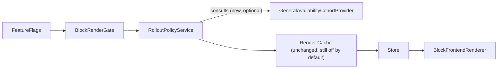

# F13 — General Availability + ADR-0013 Acceptance

**Status:** **Complete** — merged to `main`; GA-only implementation + Tier 0–3 validation PASS; observation window closed.  
**Architecture:** Strategy F unchanged. F13 introduces **one** major architectural variable: general availability via the F12-reserved `CohortProviderInterface` seam. Feature coverage (supported Gutenberg blocks) is **intentionally frozen** at the F12-proven set.  
**Depends on:** F1–F12 complete and merged; F12 §20 entry gate PASS; observation window closed.  
**ADR-0013:** **Accepted** (2026-08-05) — [F13_ADR_DISPOSITION.md](F13_ADR_DISPOSITION.md).  
**Canonical doc:** This file. Master plan: [STRATEGY_F_PRODUCTION_IMPLEMENTATION.md](STRATEGY_F_PRODUCTION_IMPLEMENTATION.md) §19.  
**Prior milestone:** [STRATEGY_F_F12_LIMITED_ROLLOUT.md](STRATEGY_F_F12_LIMITED_ROLLOUT.md)  
**Validation log:** [F13_GENERAL_AVAILABILITY_VALIDATION_LOG.md](F13_GENERAL_AVAILABILITY_VALIDATION_LOG.md) — **PASS**.  
**Tags:** `strategy-f-f13-general-availability-merged` / `strategy-f-f13-general-availability-complete`  
**Next milestone:** F14 — Supported Gutenberg Block Expansion (see §12).

---

## Freeze statement

This document is the **frozen canonical implementation specification** for F13.

- No further architectural changes under this plan number without an explicit amendment.
- No code changes are authorized by this freeze itself.
- Implementation of F13.1–F13.5 remains blocked until F13.0 PASS and the F13.1 ADR gate PASS.
- The Definition of Done in §8 is the sole criterion for declaring F13 complete.
- Adapter expansion is **not** F13 — ownership moved to F14 (§12).

---

## 0. Purpose — what F13 validates

F13 is exclusively the **General Availability** milestone.

It validates that Strategy F is production-ready at full rollout using **exactly the same supported Gutenberg block set** already proven during F12:

- `core/paragraph`
- `core/heading`
- `core/button`

F13 validates:

- general availability (approved post types × languages, no per-post allowlist required);
- production-scale rollout;
- operational procedures;
- rollback;
- rollout governance;
- production safety.

**Feature coverage is intentionally frozen during F13.** No additional supported block adapters are introduced. General Availability is the only major architectural variable in this milestone. Separating rollout from feature expansion reduces operational risk: a GA incident cannot be confounded with a new-adapter defect.

---

## 1. Status and baseline

- F1–F12 merged to `main` (tag `strategy-f-f12-limited-rollout-merged` / `-complete`, commit `e0d4faafc`).
- [F12_LIMITED_ROLLOUT_VALIDATION_LOG.md](F12_LIMITED_ROLLOUT_VALIDATION_LOG.md): Day-0 PASS; observation window `2026-08-05 → 2026-08-12`; ADR-0013 review pending; `F13-ready: No` until §20 clears.
- F12 §20 ([STRATEGY_F_F12_LIMITED_ROLLOUT.md](STRATEGY_F_F12_LIMITED_ROLLOUT.md) §20) is the hard entry gate.
- Supported blocks remain `BlockRegistry::SUPPORTED_BLOCKS` = `{core/paragraph, core/heading, core/button}` for the entire F13 milestone.

---

## 2. Milestone objectives

1. **ADR-0013 disposition.** Drive the ADR-0013 human approval checklist (10 items, `docs/adr/0013-gutenberg-segment-identity.md`) to a final, explicit decision — **Accepted**, or an **explicit documented decision to proceed despite Proposed status** — never left ambiguous, never continued silently.
2. **General availability.** Move the approved language/post-type scope from an explicit per-post allowlist (F12 limited cohort) to a durable "on for all approved content" posture, without introducing percentage/hash cohorts (still explicitly rejected) and without bypassing the two-level kill switch.
3. **Operational closure.** Produce F13-specific runbooks/checklists (reusing F12's templates and mechanisms verbatim) and a validation log proving general-availability behavior is safe before declaring Strategy F production-approved at the F12 feature set.

Explicitly **not** F13 objectives:

- no new block adapters / no `SUPPORTED_BLOCKS` expansion (deferred to **F14**);
- no Workspace / TM / AI / QA changes (frozen per [F11_FROZEN_API.md](F11_FROZEN_API.md));
- no new translator features;
- no percentage/hash cohorts;
- no container-block identity support;
- no Elementor coverage;
- no redesign of UUID, Store, rendering pipeline, `RolloutPolicyService`, metrics, cache, REST, or diagnostics.

---

## 3. Architectural overview

F13 changes **zero** frozen pipeline stages. It only populates the F12-reserved cohort seam and extends the versioned rollout configuration schema designed for this purpose.

Invariants:

- `RolloutPolicyService` remains pure and stateless; it gains an **optional** constructor dependency on `CohortProviderInterface` (`src/Rollout/CohortProviderInterface.php`). Default `null` preserves F12 allowlist-only behavior byte-for-byte.
- `RolloutPolicyDecision` gains no new fields.
- `RolloutConfiguration::SCHEMA_VERSION` moves `1 → 2` via `RolloutConfigurationMigrator::migrate_v1_to_v2`. `REJECTED_COHORT_KEYS` (percentage/hash/visitor/tenant/organization) stays unchanged and still rejected.
- `BlockRegistry::SUPPORTED_BLOCKS` is **unchanged** for the duration of F13.
- Store, TM, AI providers, REST `aiml/v1`, metrics registry, audit log, capabilities, and cache are reused as-is — **no duplicate storage, rendering, or translation pipeline**.

---

## 4. Major components (new, all additive)

| Component | Type | Seam it fills |
|---|---|---|
| `GeneralAvailabilityCohortProvider` | New class implementing `CohortProviderInterface` | First real implementation of the F12-reserved cohort seam; matches on `post_type` + `language_code` only when `general_rollout_enabled` is true, ignoring `allowed_post_ids` |
| `RolloutConfiguration` v2 field `general_rollout_enabled: bool` (default `false`) | Additive schema field | New boolean cohort mode, distinct from percentage/hash (still rejected) |
| `RolloutConfigurationMigrator::migrate_v1_to_v2` | New migrator method | Legacy configs default `general_rollout_enabled=false` |
| Stage 6 "General production" | Extends F12 stages 0–5 | Bounds updated in validator and `RolloutPromotionService` (`> 5` → `> 6`) |
| `F13_GENERAL_AVAILABILITY_RUNBOOK.md`, promotion/rollback checklists, PO decision sheet | Docs, reusing F12 templates | Operational parity with F12, no new mechanism |

Explicitly **not** built in F13: any new `AbstractBlockAdapter`; any change to `SUPPORTED_BLOCKS`; any new field beyond `Contract::FIELD_CONTENT`; any Elementor adapter; any percentage/hash math.

---

## 5. Work-package breakdown

### F13.0 — Entry-gate verification (no code) — HARD GATE

Confirm F12 §20's 11 items all PASS (SEV review, FP=0, rollback drill, config export/restore, reason-code stability through the full observation window ending 2026-08-12) and record human operator sign-off.

**Hard rule:**

> If F13.0 fails, implementation of F13.1–F13.5 must not begin.
> Planning may exist. Implementation may not.

F13.0 failure leaves this frozen plan intact as a planning artifact. It does not authorize any code, schema, or operational change under F13 numbering.

### F13.1 — ADR-0013 disposition — SEPARATE GATE FROM IMPLEMENTATION

Walk the 10-item human approval checklist against merged F1–F12 evidence; produce a written decision in the ADR itself; fix the stale "F1–F11 prerequisites" reference to F1–F12; explicitly record Elementor coverage and cross-site paste as carried-forward open questions that do **not** block acceptance.

**ADR disposition is separated from implementation.** Implementation of F13.2–F13.5 begins only after **one** of the following is recorded in writing:

1. ADR-0013 receives an explicit **Accepted** disposition; **or**
2. an explicit documented decision to proceed despite **Proposed** status (dated, named decision-maker, residual-risk statement).

Silent continuation is forbidden. An unresolved or implied ADR status is not a gate pass.

### F13.2 — General-availability cohort model

Schema v2 field + migrator; `GeneralAvailabilityCohortProvider`; optional-dependency wiring into `RolloutPolicyService`; stage-6 bound updates in validator and promotion service; unit tests proving legacy (v1, no provider) behavior is byte-identical and the new branch only activates when `general_rollout_enabled=true`.

Blocked until F13.0 PASS and F13.1 ADR gate PASS.

### F13.3 — Operational readiness

F13 runbook, promotion checklist, rollback checklist, PO decision sheet (approved post types/languages for general availability; explicit go/no-go on render-cache activation — not defaulted to "yes"). Reuses `RolloutPromotionService`, `RolloutEmergencyService`, `RolloutSnapshotStore`, `RolloutAuditLogger`, `RolloutMetricsRegistry` unchanged.

Blocked until F13.0 PASS and F13.1 ADR gate PASS.

### F13.4 — Validation (Tier 0–3)

Tier 0 PHPUnit/PHPCS for all new classes; Tier 1 `RolloutPolicyService` unit tests (both cohort branches); Tier 2 staging script on `dev.biopentra.eu` exercising stage 6 across multiple non-allowlisted posts/languages confirming zero false positives, no regression to stages 1–5, and **unchanged** supported-block set; Tier 3 targeted browser smoke on the F12-proven blocks only (`paragraph` / `heading` / `button`) under general availability.

Blocked until F13.0 PASS and F13.1 ADR gate PASS.

### F13.5 — Documentation and closure

Update this plan's status on completion; create `F13_GENERAL_AVAILABILITY_VALIDATION_LOG.md`; refresh ROADMAP / master-plan status; update ADR-0013 disposition record. Satisfies the Definition of Done in §8.

---

## 6. Acceptance criteria

- **AC-1:** `RolloutPolicyDecision` gains no new fields; existing reason codes unchanged (additive only, per `RolloutReasonCodes`).
- **AC-2:** With `general_rollout_enabled=false` (default), policy evaluation is byte-identical to pre-F13 behavior for all existing test fixtures.
- **AC-3:** With `general_rollout_enabled=true`, allowed posts are exactly `{post_type ∈ allowed_post_types} ∩ {language ∈ allowed_language_codes}`, independent of `allowed_post_ids`.
- **AC-4:** Percentage/hash/visitor/tenant/organization cohort keys remain rejected by the validator (`REJECTED_COHORT_KEYS` unchanged).
- **AC-5:** Master render flag and `rollout_render_enabled` still dominate stage/cohort in all cases (two-level kill switch preserved).
- **AC-6:** Legacy `schema_version=1` configs migrate to v2 with `general_rollout_enabled=false` with no data loss.
- **AC-7:** No new REST route, DTO shape, TM/AI/QA contract, or Workspace service signature changes (verified against `F11_FROZEN_API.md`).
- **AC-8:** No new external cache or queue dependency is introduced; render cache stays WordPress-object-cache-only and defaults to off.
- **AC-9:** ADR-0013 carries an explicit, dated disposition (Accepted **or** documented proceed-despite-Proposed) — not left silently unresolved.
- **AC-10:** Stage-6 promotion is never automatic (`RolloutPromotionService` remains an explicit operator action).
- **AC-11:** Rollback to any prior stage/policy version (including pre-F13 v1 configs) succeeds via existing `RolloutConfigurationRepository::restore`.
- **AC-12:** Metrics dimension cardinality stays bounded at general-availability traffic volume (no per-post-ID dimension introduced).
- **AC-13:** Feature coverage is frozen — `BlockRegistry::SUPPORTED_BLOCKS` remains exactly `{core/paragraph, core/heading, core/button}` for the entire F13 milestone; no new adapters ship under F13.

---

## 7. Validation strategy

Mirrors F12's tiering (no new validation mechanism):

- **Tier 0** (every commit): PHPUnit + PHPCS + static analysis; `PluginGuardTest` structural invariants re-run unchanged.
- **Tier 1:** service-level tests for `RolloutPolicyService` + `GeneralAvailabilityCohortProvider` + migrator, both cohort branches; assert `SUPPORTED_BLOCKS` unchanged.
- **Tier 2:** `dev.biopentra.eu` staging script (same pattern as `acceptance/f12-staging/wp10-staging.sh`) exercising stage 6 across a small multi-post/multi-language matrix, confirming FP=0 and no regression to F12's limited cohort.
- **Tier 3:** targeted Playwright smoke on F12-proven blocks under general availability (not a full 35/35 re-run — TID-1 remains F9 debt).
- Final gate: `F13_GENERAL_AVAILABILITY_VALIDATION_LOG.md`.

---

## 8. Definition of Done and closure gates

### Definition of Done

F13 is complete **only** when **all** of the following are true:

1. F13.0 PASS (F12 §20 entry gate + observation window + operator sign-off).
2. ADR disposition recorded (Accepted **or** explicit proceed-despite-Proposed decision).
3. AC-1 through AC-13 PASS.
4. Tier 0–3 PASS.
5. Rollback rehearsal PASS (stage 6 → prior stage, documented).
6. Operational runbook approved.
7. Cache activation decision recorded (activated or deliberately deferred — not left implicit).
8. Roadmap updated (`docs/ROADMAP.md`).
9. Strategy F production status updated (`STRATEGY_F_PRODUCTION_IMPLEMENTATION.md` and related status pointers).

Any incomplete item means F13 is **not** complete, regardless of code merge state.

### Closure gates (mapped to DoD)

- **G1:** F13.0 PASS, dated.
- **G2:** ADR disposition recorded with checklist evidence (Accepted or proceed-despite-Proposed).
- **G3:** AC-1 through AC-13 all PASS.
- **G4:** Tier 0–3 validation log PASS, zero unresolved SEV-1/2.
- **G5:** Rollback rehearsal for stage 6 → prior stage documented PASS.
- **G6:** Operational runbook approved; cache-activation decision explicitly recorded.
- **G7:** ROADMAP.md, STRATEGY_F_PRODUCTION_IMPLEMENTATION.md, and F12 doc's F13 pointer all updated to reflect closure.

---

## 9. Operational considerations

- Reuse F12's capability model unchanged (`aiml_view_rollout`, `aiml_manage_rollout`, `aiml_promote_rollout`, `aiml_emergency_rollback`, `aiml_manage_rollout_metrics`).
- Reuse existing audit events — stage promotion to 6 and cohort-flag changes flow through `RolloutConfigurationRepository::apply_change`.
- Performance: re-capture F12 WP7-style baselines at general-availability traffic volume before stage-6 promotion; do not invent new SLOs.
- Cache stays off by default; F13.3 must record an explicit PO/tech GO or deferral decision.
- Supported-block inventory is frozen; operators need not re-certify new adapters during GA.

---

## 10. Risks

| Risk | Mitigation |
|---|---|
| Schema v1→v2 migration bug corrupts existing production config | Migrator unit tests + staging dry-run against real exported F12 config before promoting |
| `CohortProviderInterface`'s first real implementation leaks scope beyond intent (e.g., silently ignoring master kill switch) | AC-5 regression test asserting two-level kill switch still dominates |
| General-availability traffic volume regresses latency vs F12 baselines | Re-run WP7-style performance capture at scale before stage-6 promotion |
| ADR-0013 Elementor/cross-site-paste gaps mistaken for "resolved" | Explicit written carry-forward note distinguishing "open question" (non-blocking) from "approval checklist" (blocking) |
| Starting F13 implementation before F13.0 or F13.1 gates pass | Hard gates: F13.0 failure blocks F13.1–F13.5; ADR unresolved blocks F13.2–F13.5; silent continuation forbidden |
| Declaring F13 complete while DoD items remain open | Definition of Done is conjunctive — any missing item means incomplete |
| Confounding GA defects with new-adapter defects | **Eliminated for F13** by freezing feature coverage; adapter expansion owned by F14 |

---

## 11. Deferred-item disposition (F10–F12 → F13 / F14 / later)

| Deferred item | Source | Disposition |
|---|---|---|
| General production approval | F12 §25 | **F13** (this plan) |
| ADR-0013 acceptance | F12 §25, ADR checklist | **F13** (F13.1) |
| Adapter allowlist expansion | Former F13 / master-plan stage 8 | **F14** — Supported Gutenberg Block Expansion (§12) |
| Percentage/hash cohorts | F12 §25 | Later, if ever — not F13 |
| Glossary, review workflow, job queues, version history | F11 §19, ADR-0011 | Later (M3+) — not F13 |
| Productivity metrics implementation | F11 §18 (spec only) | Later, optional — not F13 |
| Billing analytics | F12 §25 | Out of scope, not any milestone |
| New external cache/queue dependency | F12 §25 | Out of scope, not F13 |
| Render-cache activation GO | F12 §12 (implemented, disabled) | Candidate F13 decision point (F13.3), not a committed default |
| Elementor segment-identity coverage | ADR-0013 open question | Later — needs its own spike/ADR |

---

## 12. F14 — Supported Gutenberg Block Expansion (deferred)

F14 owns **supported Gutenberg block expansion**. It does **not** change rollout, policy, renderer architecture, UUID identity, or Store.

### Purpose

Expand the Strategy F allowlist one adapter at a time after F13 has proven general availability on the F12-proven set.

### F14 owns

- new `AbstractBlockAdapter` implementations;
- `BlockRegistry::SUPPORTED_BLOCKS` expansion;
- the adapter admission process (unchanged — only ownership moves from earlier F13 drafts to F14);
- render-safety validation;
- PHPUnit validation;
- browser validation;
- documentation updates;
- validation-log evidence;
- per-adapter acceptance gates.

### F14 must not change

- rollout configuration / stages / cohort model (post-F13 GA);
- `RolloutPolicyService` or policy decision fields;
- renderer redesign;
- UUID architecture;
- Store;
- Translation Memory / AI provider architecture;
- Workspace;
- REST API contracts;
- metrics / cache / diagnostics / security model.

### Admission process (unchanged; ownership = F14)

No adapter may enter `SUPPORTED_BLOCKS` until **all** of the following are complete for that adapter:

1. render-safety proof (`rendered_false_positive == 0` on the adapter's fixture corpus);
2. PHPUnit coverage (unit and/or integration) green;
3. targeted browser validation PASS;
4. documentation updated (adapter list, supported-blocks inventory, plan/validation notes);
5. validation log updated with the adapter's admission evidence.

Candidates (illustrative, not committed): leaf blocks such as `core/list-item`, `core/preformatted`, `core/verse`, `core/code`. Blocks with non-empty `innerBlocks` (`core/list`, `core/quote`, `core/columns`, `core/group`) remain a later architecture extension, not automatic F14 scope.

F14 planning may begin after F13 closes; F14 implementation must not begin until F13 Definition of Done is complete.

---

## 13. Future extension points (explicitly NOT F13)

- **F14** supported Gutenberg block expansion (§12).
- Percentage/hash/visitor/tenant/organization cohorts — post-F13 if ever.
- Container/nested-block identity — needs a real architecture extension (recursive identity).
- New translatable fields beyond `Contract::FIELD_CONTENT`.
- Elementor-authored content segment identity — own spike/ADR.
- Glossary, review/approval workflow, job queues, translation version history — ADR-0011 / M3.
- Billing/usage analytics — out of product scope.

---

## 14. Related documents

| Document | Role |
|---|---|
| [STRATEGY_F_PRODUCTION_IMPLEMENTATION.md](STRATEGY_F_PRODUCTION_IMPLEMENTATION.md) | Master plan §19 milestone table |
| [STRATEGY_F_F12_LIMITED_ROLLOUT.md](STRATEGY_F_F12_LIMITED_ROLLOUT.md) | F12 plan + §20 entry gate |
| [F12_LIMITED_ROLLOUT_VALIDATION_LOG.md](F12_LIMITED_ROLLOUT_VALIDATION_LOG.md) | F12 evidence |
| [F11_FROZEN_API.md](F11_FROZEN_API.md) | Frozen translator/TM/AI contracts |
| [docs/adr/0013-gutenberg-segment-identity.md](../adr/0013-gutenberg-segment-identity.md) | ADR disposition target |
| [docs/ROADMAP.md](../ROADMAP.md) | Strategy F track status |
