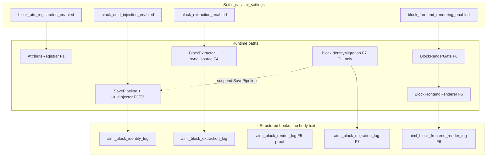

# F8 — Operational Controls and Observability Plan

**Status:** Canonical operations plan (WP0 committed; F8 implementation pending)  
**Depends on:** F1–F7 complete (`a33219e` … `7c733bb`)  
**ADR-0013:** Proposed (unchanged)  
**Canonical doc:** This file. Master plan cross-ref: [STRATEGY_F_PRODUCTION_IMPLEMENTATION.md](STRATEGY_F_PRODUCTION_IMPLEMENTATION.md) §19.  


---

## Current operational architecture



**Key code facts (F1–F7):**
- Four production flags in [`src/Settings.php`](../../src/Settings.php) — all default `false`.
- Dependency enforcement in [`src/Block/FeatureFlags.php`](../../src/Block/FeatureFlags.php) via `Settings::sanitize()`.
- No Strategy F controls in [`src/Admin/SettingsPage.php`](../../src/Admin/SettingsPage.php) yet (switcher/uninstall only).
- Migration is CLI-only ([`src/Cli.php`](../../src/Cli.php) `wp aiml block migrate`); **not** gated by `block_migration_enabled` (constant exists but unwired).
- F6 render flag is `block_frontend_rendering_enabled`, not master-plan `block_render_enabled`.
- No metrics persistence, no `wp aiml block status`. Flag-change audit hook `aiml_settings_flag_changed` added in F8 WP1.

---

## 1. Feature-flag operating model

### 1.1 Production flags (Settings-backed)

| Flag | Purpose | Default | Kill switch after UUID rollout? |
|---|---|---|---|
| `block_attr_registration_enabled` | Register `aimlBlockId` in block metadata | off | **No** — compatibility requirement once UUIDs exist in content |
| `block_uuid_injection_enabled` | Save-time UUID inject + duplicate repair on canonical saves | off | Yes (rollback step 3) |
| `block_extraction_enabled` | Block-level extraction + `Store::sync_source()` reconciliation | off | Yes (rollback step 2) |
| `block_frontend_rendering_enabled` | Gated `the_content` block translation overlay (F6) | off | **Yes — primary emergency kill switch** (rollback step 1) |

### 1.2 Reserved flags (FeatureFlags only — not Settings UI in F8 impl)

| Flag | Purpose | F8 treatment |
|---|---|---|
| `block_uuid_analysis_enabled` | Parse/report without mutation | Document only; wire in F10 if needed |
| `block_uuid_repair_enabled` | Subordinate repair toggle | Always follows injection today; defer separate UI |
| `block_uuid_autosave_inject_enabled` | Autosave inject | Defer to F10 |
| `block_render_enabled` | F5 proof overlay flag | **Rename doc references to F5 internal / proof mode**; superseded by `block_frontend_rendering_enabled` for F6+ |
| `block_renderer_proof_mode` | Verbose F5 proof logging | Staging-only; defer UI |
| `block_migration_enabled` | Backfill writes | **Do not add** — migration is explicit CLI with capability gates (F7 design) |
| `block_diagnostics_enabled` | Verbose structured logs | Add in F8 impl as read-only toggle or WP-CLI `--verbose` only |

### 1.3 Dependency order

```
registration → injection → extraction → frontend_rendering
```

Enforced in [`FeatureFlags::validate_dependencies()`](../../src/Block/FeatureFlags.php) and mirrored at runtime by [`BlockRenderGate`](../../src/Translation/BlockRenderGate.php).

### 1.4 Allowed combinations

| registration | injection | extraction | frontend_rendering | Valid? | Use case |
|:---:|:---:|:---:|:---:|---|---|
| off | off | off | off | Yes | Production default / safe deploy |
| on | off | off | off | Yes | Pre-rollout registration smoke test |
| on | on | off | off | Yes | UUID rollout without Store sync |
| on | on | on | off | Yes | **Recommended pre-render state**: identity + Store reconciliation, zero frontend risk |
| on | on | on | on | Yes | Full Strategy F frontend (staging/pilot only) |
| on | off | on | * | **No** | Auto-corrected to extraction off |
| * | * | off | on | **No** | Auto-corrected to render off |
| off | on | * | * | **No** | Auto-corrected |

**Migration:** May run via CLI in any flag state. Recommended: registration + injection on; rendering off. Migration does not require extraction flag (uses migration-scoped extractor internally).

**Extraction without rendering:** Explicitly allowed and recommended during rollout stages 4–5.

### 1.5 Enable sequence (staging/production)

1. Enable `block_attr_registration_enabled` → verify editor preserves `aimlBlockId` on proof blocks.
2. Enable `block_uuid_injection_enabled` → save canonical posts; verify idempotent inject.
3. Run `wp aiml block migrate` dry-run + bounded live batches (rendering still off).
4. Enable `block_extraction_enabled` → verify `sync_source` on save; no frontend change.
5. Enable `block_frontend_rendering_enabled` **only after F9 browser sign-off** on staging pilot cohort.

Each step requires admin confirmation + health check green (§5).

### 1.6 Disable sequence (rollback)

1. **Immediately** disable `block_frontend_rendering_enabled` (kill switch — no content mutation).
2. Disable `block_extraction_enabled` (stops new sync_source reconciliation).
3. Disable `block_uuid_injection_enabled` (stops new UUID mutation; repair stops with injection).
4. **Do not** disable `block_attr_registration_enabled` after UUIDs exist in production content.
5. Stop migration CLI operations (operational halt, not a flag).

### 1.7 Emergency kill-switch

- **Control:** `block_frontend_rendering_enabled = false`
- **Effect:** [`BlockRenderGate`](../../src/Translation/BlockRenderGate.php) denies with `frontend_rendering_disabled`; source `post_content` returned unchanged.
- **Latency:** Next request (settings cached in `Settings` instance per request).
- **Verification:** F8 impl must include integration test toggling flag mid-request cycle.

### 1.8 Registration permanence

Per [`Settings.php`](../../src/Settings.php) comments and ADR-0013 Phase 3 evidence: disabling registration after UUID rollout causes Gutenberg to strip `aimlBlockId` on edit. **Post-rollout registration is a compatibility lock, not a kill switch.**

---

## 2. Settings and administrative UX

### 2.1 Recommendation: **Both Settings UI and WP-CLI**

| Surface | Controls | Rationale |
|---|---|---|
| **Settings UI** | 4 production flags, read-only diagnostics panel, dependency warnings | Operators need visibility without SSH; matches existing [`SettingsPage`](../../src/Admin/SettingsPage.php) pattern (`manage_options`) |
| **WP-CLI** | `wp aiml block migrate`, `wp aiml block status` (new), flag read via `wp option get aiml_settings --format=json` | Migration already CLI-only; health/batch ops belong in CLI for automation |

**Do not** implement WP-CLI-only for flags — risks opaque production state.

### 2.2 Settings UI design (F8 implementation)

- **Location:** New section on existing Settings screen (`Multilingual → Settings`) — subsection **“Strategy F — Block Identity (Pre-rollout)”**.
- **Capability:** `manage_options` (existing).
- **Controls:** Four checkboxes in dependency order; disabled/greyed when prerequisite off.
- **No “Enable all Strategy F” button.**
- **Confirmation prompts:**
  - Enabling `block_frontend_rendering_enabled`: modal — “This activates frontend translation overlay. Confirm staging sign-off reference and ADR-0013 status.”
  - Disabling `block_attr_registration_enabled` when any post has UUIDs: blocking warning (query sample via health service).
- **Dependency warnings:** Inline notice when sanitized save would drop dependent flags (`FeatureFlags::has_prohibited_combination()`).
- **Read-only diagnostics panel:** Flag effective state, dependency validity, supported post types, supported blocks, link to runbook, last migration batch summary (from option/transient if available).
- **Migration visibility:** Display exact CLI commands (copy-paste); no migrate button in UI (avoid accidental production writes).
- **Nonce:** Standard Settings API (`settings_fields`) — already nonce-protected.

### 2.3 Deferred UX (F9/F10)

- Cohort selection UI
- Metrics dashboards
- `block_diagnostics_enabled` admin toggle (use CLI `--verbose` first)

---

## 3. Observability model — event inventory

All events emit via `do_action` hooks; **never log body text, translated text, or `post_content`.**

### 3.1 `aiml_block_identity_log` — [`BlockIdentityLogger`](../../src/Block/BlockIdentityLogger.php)

| Event | Severity | When | Required fields | Optional fields | Sampling | Retention |
|---|---|---|---|---|---|---|
| `uuid_created` | info | New UUID assigned | `block_name` | — | 100% in diagnostics; 1% prod | 30d aggregated |
| `uuid_preserved` | debug | Valid UUID kept | `block_name` | `uuid` | **Debug-only**; sample 0.1% prod | 7d |
| `uuid_replaced_invalid` | warn | Malformed UUID replaced | `block_name` | — | 100% | 90d |
| `uuid_duplicate_detected` | warn | Same-post duplicate | `block_name`, `duplicate_uuid` | — | 100% | 90d |
| `uuid_duplicate_repaired` | info | Duplicate repaired | `block_name`, `duplicate_uuid`, `replacement_uuid` | — | 100% | 90d |
| `uuid_generation_collision` | warn | UUID factory collision | `block_name`, `retry_count` | — | 100% | 90d |
| `uuid_repair_failed` | error | Inject aborted | `failure_reason` | — | 100% | 90d |
| `uuid_repair_complete` | info | Post-repair summary | `repaired_count` | — | 100% | 30d |

**Privacy:** `uuid`, `duplicate_uuid`, `replacement_uuid` — allowed in structured logs for forensics; **never metric labels**.

### 3.2 `aiml_block_extraction_log` — [`BlockExtractionLogger`](../../src/Block/BlockExtractionLogger.php)

| Event | Severity | When | Required | Optional | Sampling |
|---|---|---|---|---|---|
| `block_extracted` | debug | Segment extracted | `block_name`, `field` | `segment_key` | Debug-only / 1% |
| `adapter_missing` | error | Supported block, no adapter | `block_name` | — | 100% |
| `field_skipped` | info | Field not extracted | `block_name`, `reason` | `field`, `duplicate_uuid` | 100% for `adapter`-class reasons |

### 3.3 `aiml_block_render_log` — F5 proof [`BlockRenderLogger`](../../src/Block/BlockRenderLogger.php)

| Event | Severity | When | Required | Optional |
|---|---|---|---|---|
| `block_rendered` | debug | Proof render applied | `block_name` | counts |
| `translation_missing` | info | No translation for block | `block_name` | — |
| `unsupported_block` | info | Block not in allowlist | `block_name` | — |

**Policy:** Remain debug/staging-only unless `block_renderer_proof_mode` enabled.

### 3.4 `aiml_block_frontend_render_log` — F6 [`BlockFrontendRenderLogger`](../../src/Translation/BlockFrontendRenderLogger.php)

| Event | Severity | When | Required | Optional |
|---|---|---|---|---|
| `block_render_gate_denied` | debug | Gate deny | `post_id`, `post_type`, `denial_reason` | `target_language` | 
| `block_render_gate_allowed` | info | Gate allow | `post_id`, `post_type` | `target_language` |
| `block_translation_lookup_complete` | info | Store load ok | `post_id`, `segment_count`, `translated_count`, `fallback_count` | `target_language` |
| `block_translation_lookup_failed` | error | Store load fail | `post_id`, `failure_reason` | `segment_count` |
| `block_translation_rejected` | warn | Sanitizer reject | `post_id`, `reason` | `segment_key` |
| `block_frontend_render_complete` | info | Render succeeded | `post_id`, `translated_count` | `target_language` |
| `block_frontend_render_failed` | error | Render failed | `post_id`, `failure_reason` | — |

**Gate denial reasons** (from [`BlockRenderGate`](../../src/Translation/BlockRenderGate.php)): `frontend_rendering_disabled`, `extraction_disabled`, `uuid_registration_disabled`, `uuid_injection_disabled`, `admin_request`, `block_editor_request`, `rest_request`, `ajax_request`, `cron_request`, `feed_request`, `preview_request`, `unsupported_post_type`, `elementor_body`, `non_block_content`, `missing_source_post`, `source_language`, `unresolved_target_language`, `unsupported_language`, `rendering_recursion`, `incomplete_identity_continuity`.

### 3.5 `aiml_block_migration_log` — F7 [`BlockMigrationLogger`](../../src/Block/BlockMigrationLogger.php)

| Event | Severity | When | Required | Optional |
|---|---|---|---|---|
| `block_migration_started` | info | Post/batch begin | `post_id` or batch meta | `dry_run` |
| `block_migration_skipped` | info | Ineligible post | `post_id`, `post_type` | `skip_reason` |
| `block_migration_dry_run` | info | Dry-run complete | `post_id`, counts, hashes | `elapsed_ms` |
| `block_migration_post_complete` | info | Live success | `post_id`, `content_changed`, counts, hashes | `elapsed_ms` |
| `block_migration_post_failed` | error | Failure | `post_id`, `failure_reason` | hashes |
| `block_migration_concurrent_modification` | warn | Optimistic lock fail | `post_id`, `post_type` | — |
| `block_migration_batch_complete` | info | Batch done | `post_type`, `batch_size`, `offset`, `next_offset`, `has_more` | `elapsed_ms`, failure counts |

### 3.6 Gaps and inconsistencies (doc vs code)

| Issue | Resolution in F8 plan |
|---|---|
| Master plan §14 lists `uuid_generated` | Code uses `uuid_created` — **standardize on code names** |
| No `flag_combo_rejected` event | **Add in F8 impl** on `Settings::save()` when `has_prohibited_combination()` |
| No `registration_compat_mode` event | Defer; health check covers state |
| No render latency field | **Add `elapsed_ms` to render_complete/failed** in F8 impl |
| No cross-post leakage event | Lookup rejects wrong `source_id` silently (`++$rejected`); **add `cross_post_row_rejected` counter** in metrics aggregator |
| `segment_key` in extraction/sanitizer logs | OK in logs with sampling; **never metric label** |
| `duplicate_uuid` in field_skipped | Log field name says duplicate_uuid but holds segment key collision — **rename to `duplicate_segment_key` in F8 impl** (minor) |

---

## 4. Metrics

**F8 implementation:** Hook-based in-process aggregator (`BlockMetricsAggregator`) listening to the five log hooks. Expose totals via `wp aiml block status` and optional admin diagnostics panel. **No DB persistence, no external TSDB in F8** (defer F10).

| Metric | Type | Source events | Labels (low cardinality) | Alert threshold (staging) |
|---|---|---|---|---|
| `aiml_block_migration_posts_scanned` | counter | batch_complete | `post_type`, `dry_run` | — |
| `aiml_block_migration_posts_complete` | counter | post_complete | `post_type` | — |
| `aiml_block_migration_posts_failed` | counter | post_failed | `post_type`, `failure_reason` | >5% of batch |
| `aiml_block_migration_concurrent_skips` | counter | concurrent_modification | `post_type` | >10/hour during batch |
| `aiml_block_uuid_created_total` | counter | uuid_created | — | — |
| `aiml_block_uuid_malformed_replaced_total` | counter | uuid_replaced_invalid | — | spike > baseline 3x |
| `aiml_block_uuid_duplicate_repaired_total` | counter | uuid_duplicate_repaired | — | — |
| `aiml_block_extraction_segments_total` | counter | block_extracted | `block_name` | — |
| `aiml_block_lookup_success_total` | counter | lookup_complete | `post_type` | — |
| `aiml_block_lookup_failure_total` | counter | lookup_failed | `failure_reason` | >1% of lookups |
| `aiml_block_render_gate_allowed_total` | counter | gate_allowed | `post_type` | — |
| `aiml_block_render_gate_denied_total` | counter | gate_denied | `denial_reason` | — |
| `aiml_block_render_complete_total` | counter | render_complete | `post_type` | — |
| `aiml_block_render_failed_total` | counter | render_failed | `failure_reason` | **>0.1% of allowed** |
| `aiml_block_translation_rejected_total` | counter | translation_rejected | `reason` | spike > baseline 3x |
| `aiml_block_cross_post_rejection_total` | counter | derived from lookup rejected rows | — | **>0 alarm** |
| `aiml_block_render_latency_ms` | histogram | render_complete | `post_type` | p95 > 50ms |
| `aiml_block_migration_batch_duration_ms` | histogram | batch_complete | `post_type` | p95 > 30s for batch-size=20 |
| `aiml_block_source_fallback_ratio` | derived | `fallback_count / segment_count` from lookup_complete | `post_type` | >50% sustained |

**Cardinality limits:** Max ~20 label values per dimension; no `post_id`, `uuid`, or `segment_key` labels.

---

## 5. Health diagnostics — `wp aiml block status`

### 5.1 Command spec (F8 implementation)

```
wp aiml block status [--format=table|json] [--post-type=page] [--sample-size=20]
```

**Capability:** `manage_options`

### 5.2 Output fields

| Field | Source | Cost |
|---|---|---|
| `plugin_version` | `ai-multilingual.php` header | O(1) |
| `settings_schema_version` | `Settings::SCHEMA_VERSION` | O(1) |
| `adr_0013_status` | Constant/filter `aiml_adr_0013_status` default `proposed` | O(1) |
| `flags` | `Settings::get()` four booleans | O(1) |
| `dependency_valid` | `!FeatureFlags::has_prohibited_combination()` | O(1) |
| `supported_post_types` | `RenderGateContext::SUPPORTED_POST_TYPES` | O(1) |
| `supported_blocks` | `BlockRegistry::SUPPORTED_BLOCKS` | O(1) |
| `eligible_post_count` | `WP_Query` count for post type, eligibility pre-filter | O(n) — cache 5min transient |
| `compliant_post_count` | Sample or full scan using migration eligibility + UUID presence | O(sample) default |
| `posts_requiring_migration` | eligible - compliant | derived |
| `failed_migration_count` | From metrics aggregator / last batch option | O(1) |
| `stale_block_segment_count` | `Store` query `is_stale=1` AND `segment_kind=block` | O(1) count query |
| `orphaned_block_segment_count` | Store rows where source post missing/trashed | O(n) — sample in default mode |
| `renderable_translation_count` | Store rows block kind + renderable status | O(1) count |
| `recent_render_failures` | Aggregator window (last 1h) | O(1) |
| `metrics_snapshot` | Aggregator totals | O(1) |

**Default mode:** Cheap counts + `--sample-size=20` compliance estimate. `--full-scan` flag for migration planning (explicit, slow).

**Implementation note:** [`Store.php`](../../src/Translation/Store.php) exposes read-only health count helpers consumed by `BlockHealthService` (WP2). Duplicate segment identity rows are not detectable at runtime because `segment_identity` is UNIQUE.

### 5.3 BlockHealthSnapshot fields (WP2)

`BlockHealthService::scan()` returns `BlockHealthSnapshot` with:

| Field | Meaning |
|---|---|
| `generated_at` | ISO-8601 UTC timestamp |
| `scan_mode` | `sample` (default) or `full` |
| `requested_sample_size` | Normalized sample size (default **100**, max **1000**) |
| `scanned_post_count` | Posts inspected in this scan |
| `eligible_post_count` | Structural population count (`WP_Query` + allowed statuses) |
| `compliant_post_count` | Scanned posts with valid document-unique UUIDs on eligible blocks |
| `non_compliant_post_count` | Scanned eligible posts failing UUID compliance |
| `skipped_post_count` | Scanned posts skipped by `BlockMigrationEligibility` |
| `skip_reason_counts` | Tallies keyed by eligibility reason |
| `posts_with_missing_uuids` | Posts with eligible blocks lacking UUIDs |
| `posts_with_malformed_uuids` | Posts with invalid UUID values |
| `posts_with_duplicate_uuids` | Posts with duplicate UUIDs among eligible blocks |
| `total_block_segments` | Store `count_block_segments()` |
| `translated_block_segments` | Store `count_translated_block_segments()` |
| `renderable_block_segments` | Store `count_renderable_block_segments()` (aligned with `BlockTranslationLookup`) |
| `stale_block_segments` | Store `count_stale_block_segments()` |
| `orphaned_block_segments` | Store rows with `status=ignored` and `error_code=orphaned` |
| `duplicate_segment_rows` | `null` — not detectable (`segment_identity` UNIQUE) |
| `duplicate_segment_rows_detectable` | Always `false` with current schema |
| `errors` | Stable codes (`translations_table_missing`, `store_count_failed`, `post_scan_failed`, …) |
| `limitations` | e.g. `sample_incomplete`, `duplicate_segment_rows_not_detectable` |
| `incomplete` | `true` when scan or store counts are partial |
| `sampled` | `true` when post compliance scan is sample-bounded |
| `elapsed_ms` | Wall-clock milliseconds for the scan |

**Caching:** eligible-post count transient (5 min) deferred to WP3/WP4 — WP2 performs live queries only.

**Default mode:** Sample size **100**, full scan opt-in only. WP3 CLI may expose a smaller default (`--sample-size=20`) atop the same service.

---

## 6. Migration runbook

### 6.1 Environment

**Target:** `https://dev.biopentra.eu` — plugin mounted at `/opt/biopentra/dev/ai-multilingual` via `/opt/biopentra/apps/wordpress/compose.yml` (dev VPS; outside this repository).

### 6.2 Operational sequence

**0. Preconditions**
- Flags: registration on, injection on, extraction optional, **frontend rendering off**
- ADR-0013 still Proposed is OK for staging migration
- Editor quiesce recommended for production batches

**1. Backup**
```bash
cd /opt/biopentra/apps/wordpress
docker compose run --rm wpcli wp db export /tmp/aiml-pre-migration-$(date +%Y%m%d).sql
```

**2. Staging dry-run**
```bash
docker compose run --rm wpcli wp aiml block status --format=json
docker compose run --rm wpcli wp aiml block migrate \
  --post-type=page --dry-run --format=json --batch-size=20 --offset=0
```

**3. Inspect JSON report** — check `skip_reason`, `created_count`, `duplicate_repaired_count`, `segment_count`, `failure_reason`.

**4. Bounded live batch**
```bash
docker compose run --rm wpcli wp aiml block migrate \
  --post-type=page --format=json --batch-size=20 --offset=0
```

**5. Rerun same batch (idempotence)**
```bash
docker compose run --rm wpcli wp aiml block migrate \
  --post-type=page --format=json --batch-size=20 --offset=0
```
Expect: `content_changed=false`, `skip_reason=already_compliant` or zero creates.

**6. Verify Store rows**
```bash
docker compose run --rm wpcli wp db query \
  "SELECT COUNT(*) FROM wp_aiml_segments WHERE segment_kind='block'"
```

**7. Verify no translations created** — block migration uses `sync_source` only; confirm no new target-language translated_text beyond existing.

**8. Verify source hashes** — compare `original_hash`/`migrated_hash` in JSON; audit meta in migration result.

**9. Continue with cursor**
```bash
# Use next_offset from batch_complete output
docker compose run --rm wpcli wp aiml block migrate \
  --post-type=page --format=json --batch-size=20 --offset=20
```

**Single post:**
```bash
docker compose run --rm wpcli wp aiml block migrate --post-id=123 --format=json
```

### 6.3 Live WP-CLI validation gap (blocking before F9)

| Gap | Remediation |
|---|---|
| PHPUnit container: `'aiml' is not a registered wp command` | Expected — test suite uses direct PHP, not live WP-CLI |
| **Required before F9:** Execute steps 1–6 above on dev.biopentra.eu | Record command output + JSON artifacts in `docs/plans/F8_CLI_VALIDATION_LOG.md` (ops deliverable, not code) |
| Acceptance | Dry-run + live batch + idempotent rerun + zero PHPUnit regression |

---

## 7. Rollback model

| Layer | Mechanism | Data impact | Dedicated CLI? |
|---|---|---|---|
| Frontend rendering | `block_frontend_rendering_enabled=false` | None | No |
| Extraction | `block_extraction_enabled=false` | Stale segments accumulate; no new sync | No |
| UUID injection | `block_uuid_injection_enabled=false` | Existing UUIDs remain in content | No |
| Attribute registration | **Avoid disabling post-rollout** | Gutenberg strips UUIDs on edit | No |
| Migration changes | DB restore from backup OR manual `post_content` revert using `original_hash` audit | Destructive if live writes occurred | **No auto-rollback command** |

**UUID-bearing markup when plugin disabled:** Inert JSON attribute in block comments; safe for display; registration loss on re-enable+edit is the risk.

**Audit data available today:** Migration JSON (`original_hash`, `migrated_hash`, counts), migration log events, DB backup.

**F8 impl adds:** `aiml_settings_flag_changed` action logging `{flag, old, new, user_id, timestamp, source}` — no content. Implemented in WP1 (`Settings::emit_flag_change_audit()` on admin settings save).

**Audit payload contract (`aiml_settings_flag_changed`):**

| Field | Type | Description |
|---|---|---|
| `flag` | string | Production flag key (`block_*_enabled`) |
| `old` | bool | Previous sanitized value |
| `new` | bool | New sanitized value |
| `user_id` | int | Current user ID at save time (0 if unavailable) |
| `timestamp` | int | Unix timestamp from `current_time( 'timestamp' )` |
| `source` | string | Change origin; admin saves use `admin_settings` |

One action fires per changed production flag. No persistence in WP1. The `flag_combo_rejected` structured log event remains deferred to WP5.

---

## 8. Failure scenarios

| Scenario | Detection | Containment | Diagnostics | Rollback | Escalate when |
|---|---|---|---|---|---|
| Frontend render exception | `render_failed`, PHP error log | Kill switch render flag | Stack in debug log (no body); post_id only | Disable rendering | Any uncaught exception in prod |
| Sanitization rejection spike | `translation_rejected` rate | Disable rendering | Inspect segment statuses | Disable rendering | >3x baseline 15min |
| Store lookup failure | `lookup_failed` | Source fallback automatic | `failure_reason`, DB connectivity | Disable rendering if widespread | >5% requests |
| Migration collision exhaustion | `post_failed` `uuid_claim_exhausted` | Stop batch | Post ID, retry | Fix post manually | Any in prod batch |
| Concurrent editor activity | `concurrent_modification` | Skip post, continue batch | Post ID | Retry post later | >10% batch |
| Malformed Gutenberg serialization | `post_failed`, inject fail | Skip post | `failure_reason` | Manual content fix | — |
| Partial rollout issue | Metrics mismatch across posts | Disable rendering | Cohort post list | Rollback step 1–2 | User-visible wrong language |
| Unexpected unsupported block | `unsupported_block` / source fallback | Gate should deny render for unknown | block_name | None if gate works | FP render detected |
| DB latency increase | `render_latency_ms` p95 | Disable rendering | Query monitor | Disable rendering | p95 > 100ms |
| Flag dependency corruption | `dependency_valid=false` on status | Settings sanitize on save | `wp option get aiml_settings` | Fix flags manually | Invalid combo in prod |
| Cross-post leakage alarm | `cross_post_rejection_total > 0` | Disable rendering immediately | Store row scope audit | Disable rendering | **Any non-zero** |

---

## 9. Security and privacy

| Area | Current state | F8 requirement |
|---|---|---|
| Settings capability | `manage_options` | Keep |
| Migration single post | `edit_post` | Keep |
| Migration batch | `manage_options` | Keep |
| WP-CLI | Runs as WP user with capabilities | Document `--user=admin` for scripts |
| Nonce | Settings API | Keep for UI |
| Log redaction | Loggers document no body text | Add PHPUnit invariant test |
| UUID in logs | Present in identity/extraction debug | Sample/limit in prod; never in metrics labels |
| Safe error display | Admin sees generic messages | No translated text in admin notices |
| HTML safety | `wp_kses_post` reject | Already in sanitizer |
| Flag audit | Missing | Add `aiml_settings_flag_changed` hook |

---

## 10. Performance budget

| Operation | Budget (p95) | Notes |
|---|---|---|
| Frontend render overhead | ≤50ms added to `the_content` per page | 3 allowlisted blocks typical |
| Store lookups per page | 1 (`load_object`) | No per-block queries |
| Block parse + serialize | ≤20ms | Allowlist only |
| Migration batch (20 posts) | ≤30s | Sequential post processing |
| Memory per migration post | ≤32MB peak | Large posts may exceed — batch size tuning |
| Log volume | ≤100 structured events/page render | Gate denials sampled in prod |

**Caching:** **Explicitly deferred to F10.** F8 may document transient cache for health counts (5min TTL) only.

---

## 11. F8 implementation scope

### WP0 — Documentation alignment (complete)
- This document committed to `docs/plans/STRATEGY_F_F8_OPERATIONS_AND_OBSERVABILITY.md`
- Master plan §15 flag names and §19 F8 cross-reference updated

### Required for F8 implementation (single milestone — **no split recommended**)

Estimated ~1 reviewable PR:

1. **Settings UI** — 4 flags + dependency UI + confirmations
2. **`wp aiml block status`** command + `BlockHealthService`
3. **`BlockMetricsAggregator`** — hook listener, in-memory counters
4. **`aiml_settings_flag_changed`** audit action
5. **`flag_combo_rejected` log** on prohibited save attempt
6. **Render `elapsed_ms`** in frontend logger
7. **Integration tests** — settings dependency UI, status command, kill switch, metrics hook
8. **Ops:** Execute live CLI validation on dev.biopentra.eu; log in `F8_CLI_VALIDATION_LOG.md`

### Deferred to F9
- Browser sign-off (Playwright)
- Pilot render enable on staging

### Deferred to F10
- Persistent metrics storage / dashboards
- Cohort flags
- `block_diagnostics_enabled` admin toggle
- Render result caching

### Out of scope
- ADR-0013 acceptance
- Production rollout
- Automatic rollback commands
- New adapter blocks

**Split assessment:** F8 implementation fits one milestone (~8 files, ~15 tests). Split into F8a/F8b **not recommended** unless review bandwidth requires it (F8a=UI+status, F8b=metrics+runbook automation).

---

## 12. F8 acceptance criteria

- [ ] All four flags visible in Settings with dependency-safe save
- [ ] Emergency frontend kill switch verified by test + manual checklist
- [ ] `wp aiml block status` returns all §5.2 fields
- [ ] Live CLI dry-run completed on dev.biopentra.eu
- [ ] Bounded live migration test completed (≥1 batch)
- [ ] Idempotent rerun verified
- [ ] Structured event catalog documented (§3) matches code
- [ ] No content/translated-body logging verified
- [ ] Rollback runbook (§7) reviewed by operator
- [ ] All flags default off; frontend rendering not enabled in prod
- [ ] PHPUnit 0 failures; PHPCS 0/0
- [ ] Master plan cross-refs updated

---

## 13. F9 entry gate

Before browser sign-off (F9) begins:

| Gate | Required state |
|---|---|
| PHPUnit | 0 failures |
| PHPCS | 0 errors, 0 warnings |
| Live CLI verification | §6.3 complete with artifacts |
| Operational health | `wp aiml block status` green (`dependency_valid=true`) |
| Staging backup | Confirmed ≤24h |
| Flags | All default off in prod; staging has registration+injection+extraction on, rendering off |
| Migration sample | ≥1 post type batch migrated on staging; idempotent |
| Render failure telemetry | `render_failed` events wired to aggregator |
| Rollback tested | Kill switch disables overlay on staging within 1 request |
| Unsupported blocks | Documented: only `core/paragraph`, `core/heading`, `core/button` |
| F5 proof | Formally accepted in master plan / ADR checklist |
| ADR-0013 | May remain Proposed; browser sign-off informs acceptance |

---

## Documentation/code discrepancies to record

1. **`block_render_enabled` vs `block_frontend_rendering_enabled`** — F6 renamed; master plan §15 updated in WP0.
2. **`block_migration_enabled`** — in FeatureFlags, unwired; F7 uses CLI capability gates instead.
3. **Settings UI** — master plan F8 says "Settings UI" but none exists yet.
4. **Event names** — master plan §14 uses different names than code constants.
5. **`BlockExtractionLogger` field_skipped** — uses key `duplicate_uuid` for segment key collision (misnamed).
6. **No metrics layer** — master plan §14 implies counters; only hooks exist today.
7. **Cross-post rejection** — silent increment in lookup; no dedicated log event yet.

---

## Related documents and implementation files

| Document | Path |
|---|---|
| Master implementation plan | [STRATEGY_F_PRODUCTION_IMPLEMENTATION.md](STRATEGY_F_PRODUCTION_IMPLEMENTATION.md) |
| CLI validation log (ops, F8 exit) | `docs/plans/F8_CLI_VALIDATION_LOG.md` (created during F8 validation) |

**Implementation files (F8 code — subsequent work packages):**
- `src/Admin/SettingsPage.php` — Strategy F section
- `src/Block/BlockHealthService.php` — new
- `src/Block/BlockMetricsAggregator.php` — new
- `src/Cli.php` — `block status` command
- `src/Plugin.php` — wire aggregator + health
- Tests: `tests/integration/BlockHealthTest.php`, `tests/unit/Admin/StrategyFSettingsTest.php`
