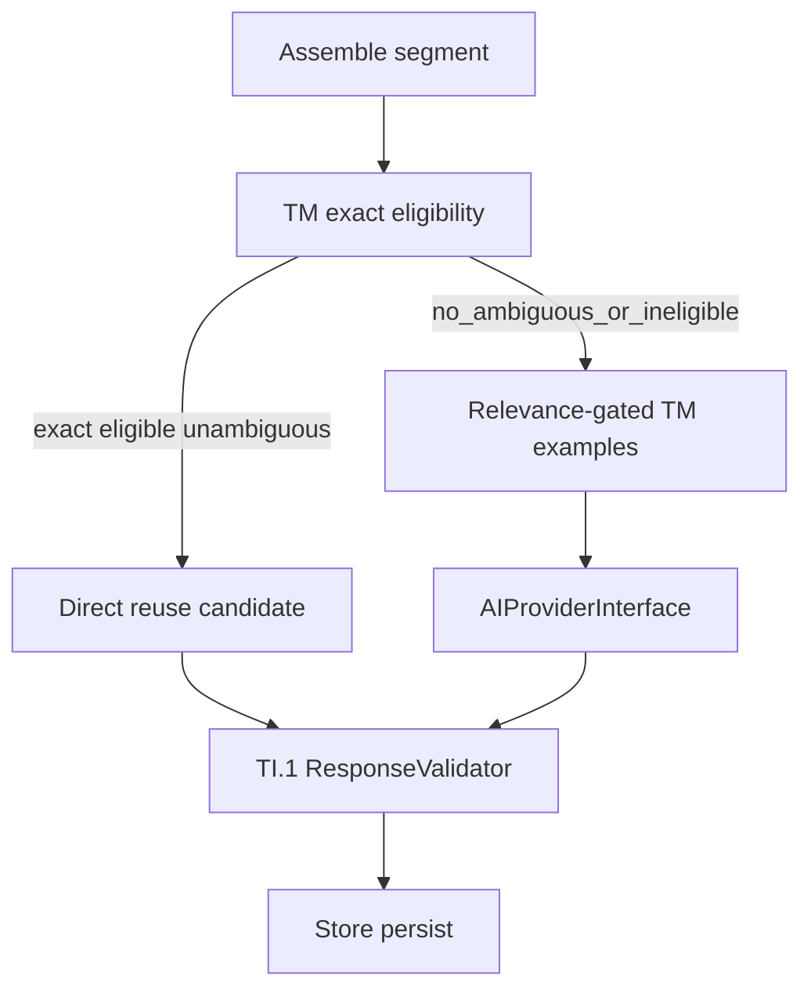

# TI.3 — Translation Memory Intelligence — Implementation Plan

**Status:** **Architecture Frozen** on `main` — **implementation not started**
**Milestone:** TI.3 — Translation Memory Intelligence (TIQ program)
**Kind:** Milestone implementation plan (authoritative on `main`)
**Parent:** [TIQ_PARENT_IMPLEMENTATION_PLAN.md](TIQ_PARENT_IMPLEMENTATION_PLAN.md)
**Prerequisites:** TQ.0 **Complete**; TI.1 **Complete**; TI.2 **Complete** on `main` @ `80e72ce65d29ea103ef2f714e8764518bcf799ca`
**Official pack:** `tests/quality/baselines/baseline-v1.1.0/` · C1.0 · H1.0 (immutable)
**Schema:** Migrator `TARGET` = **6** (unchanged)
**ADR:** Focused **ADR-0010 amendment** — optional relevance-gated `tm_example` `ContextItem` within existing `TranslationContext`; examples are not Store identity / `source_hash`
**Related ADRs (unchanged):** [0009](../adr/0009-translation-memory-table.md), [0014](../adr/0014-glossary-platform-lexicon.md), [0015](../adr/0015-review-workflow-and-tm-approval-policy.md)
**Planning branch:** `docs/ti3-translation-memory-intelligence-plan` (merged)
**Independent review (planning):** **PASS** (2026-08-10)
**Freeze merge:** `5d870db44749c36b2c4d45b1182d31e08c07de3d`
**Implementation branch:** `feature/ti3-translation-memory-intelligence` — **not created**; create only after this freeze on `main`

**Operational success:** On the shared translation brain, exact eligible human-approved TM hits can short-circuit the provider; otherwise relevance-gated prior translations may assist AI within TI.2 budgets—both measured separately from AI quality aggregates—without a second Store/TM, vector retrieval, Store identity redesign, or bypass of TI.1.

**Hard boundary:** TI.3 is **Translation Memory Intelligence** on the existing generation path. It is not vector TM, fuzzy auto-reuse, general glossary intelligence redesign, QA block/warn (TI.4), Jobs redesign, provider expansion, auto-publication (TI.7), or context-aware Store staleness.

---

## 1. Executive summary

TI.3 wires existing `aiml_tm` + `TranslationMemoryService` into `TranslationService` **before** `translate_batch`:

```text
assemble → TM eligibility / exact reuse OR relevance-gated tm_example items
  → (optional) TI.2 TranslationContext + glossary fragment + AI
  → TI.1 ResponseValidator (always before Store) → Store
```

**One brain:** TM policy lives inside `TranslationService`. No `TMTranslationService`. No OpenAI calls from the TM layer. Sync and Jobs inherit the same path.

**Four mandatory refinements (frozen as planning constraints):**

1. Structural-validation failure disposition after a TM match is **evidence-gated in TI3.3**, not pre-frozen as “AI once.”
2. TM9 examples require **deterministic relevance**; same-language + `human_approved` alone is forbidden.
3. `translations.tm_id` remains **Candidate / evidence-gated** (TM21).
4. Glossary scope is **TM-safety compatibility only**, not general non-TM glossary enforcement.

---

## 2. Preconditions (verified at planning freeze)

| Check | Evidence |
|---|---|
| Working tree clean; branch from `main == origin/main` | `80e72ce65d29ea103ef2f714e8764518bcf799ca` |
| TARGET = 6 | [`Migrator::TARGET`](../../src/Database/Migrator.php) |
| TQ.0 / TI.1 / TI.2 Complete | TIQ parent; PRODUCT_PRIORITIES; TI1/TI2 plans Complete on `main` |
| TIQ parent frozen | [TIQ_PARENT_IMPLEMENTATION_PLAN.md](TIQ_PARENT_IMPLEMENTATION_PLAN.md) |
| No TI.3 implementation branch/work | No `feature/ti3*` / production TM-in-generation |
| TI.4–TI.7 not started | TIQ parent status |
| Parent TI.3 role | Exact TM short-circuit + assisted generation; TM metrics separate from AI quality |

---

## 3. Repository evidence (binding)

### 3.1 Existing TM (reuse — do not invent a second Store)

| Fact | Evidence |
|---|---|
| Table `aiml_tm` | [`Schema::create_tm`](../../src/Database/Schema.php); [ADR-0009](../adr/0009-translation-memory-table.md) |
| Lookup identity | `(source_hash, source_lang_id, target_lang_id, context)` |
| Exact lookup + empty-context ambiguity gate | [`TranslationMemoryService::lookup_exact`](../../src/Translation/Memory/TranslationMemoryService.php) (≥25 chars + space for empty-context) |
| Context derivation | `derive_context`: `block:{name}` / `field:{key}` / `''` |
| Write-back approval-gated | [ADR-0015](../adr/0015-review-workflow-and-tm-approval-policy.md); machine save origin excluded |
| Fuzzy | Suggestions only (`lookup_fuzzy`); **not** auto direct reuse |
| Store `aiml_translations` | Object-keyed; **no** `source_hash` index — cross-object reuse **must** use `aiml_tm` |
| `translations.tm_id` column | Exists in DDL; [`Store`](../../src/Translation/Store.php) never reads/writes it → **Candidate** |

### 3.2 Generation gap (primary TI.3 work)

[`TranslationService`](../../src/Workspace/TranslationService.php) never calls TM. Jobs inherit via `translate_segment()` only. F11 planned “TM exact before provider”; **not implemented**.

### 3.3 Frozen upstream seams (must remain intact)

```text
assemble → glossary fragment + TI.2 TranslationContext → translate_batch
  → TI.1 persist_provider_result (ResponseValidator) → Store
```

Jobs add conflict/stale gates **before** `translate_segment`; must not get a separate TM engine.

---

## 4. Architecture decision (frozen strategies)

| Strategy | Disposition |
|---|---|
| **A — Exact approved reuse via `aiml_tm`** | **Primary Supported** |
| **B — Exact source across contexts** | **Partial** — only ADR-0009 empty-context + ambiguity gate; no free cross-semantic reuse |
| **C — Retrieval-assisted AI** | **Supported (bounded)** — relevance-gated TM examples when no TM8 |
| **D — Fuzzy direct reuse** | **Unsupported** on auto path; fuzzy remains suggestions-only / Deferred for generation |
| **E — Vector TM** | **Deferred** (program invariant) |



---

## 5. Candidate matrix TM1–TM21 (final dispositions)

| ID | Candidate | Disposition | Rationale |
|---|---|---|---|
| TM1 | Exact same-source lookup | **Supported** | `lookup_exact` + `Store::source_hash` |
| TM2 | Target-locale isolation | **Supported** | In TM identity |
| TM3 | Human-approved priority | **Supported** | ADR-0009; write-back quality `human_approved` |
| TM4 | Reviewed / high-quality MT eligibility | **Partial** | Direct reuse only from `aiml_tm` rows; Store `review_status` is not a TM substitute |
| TM5 | Raw/unreviewed machine reuse | **Unsupported** | Machine never write-backs; do not scan Store MT |
| TM6 | FieldSemantic compatibility | **Partial** | Do **not** change TM identity keys; map via existing `derive_context`; cross-field ≠ automatic direct reuse |
| TM7 | TI.2 context compatibility | **Partial** | Direct reuse keyed by TM `context`, not full TranslationContext body; no context-in-`source_hash` |
| TM8 | Direct exact reuse (skip AI) | **Supported** | Short-circuit in TranslationService |
| TM9 | Prior translations as AI examples | **Supported** | Relevance-gated bounded `tm_example`s only (not same-lang dump) |
| TM10 | Cross-object reuse | **Supported** | Purpose of `aiml_tm` (not Store scans) |
| TM11 | Woo product/category/attribute | **Supported** | Public catalog domains eligible |
| TM12 | SEO field reuse | **Partial** | Same `field:` context rules; Rank Math ownership unchanged |
| TM13 | Fuzzy lexical on auto path | **Deferred** | Exists for suggestions; not auto direct reuse |
| TM14 | Vector/embedding retrieval | **Deferred** | Parent invariant |
| TM15 | Provenance/diagnostics | **Supported** | Machine-readable outcome codes (Store `tm_id` not required) |
| TM16 | Quality/cost/latency metrics | **Supported** | Separate from AI quality aggregates |
| TM17 | Invalidation/staleness | **Partial** | Candidate-local eligibility; **no** Store `source_hash` redesign |
| TM18 | Jobs/sync parity | **Supported** | Shared TranslationService seam |
| TM19 | Structural validation of reused output | **Supported** | **Always** TI.1 before Store; post-fail disposition **evidence-gated in TI3.3** |
| TM20 | Glossary / context interaction | **Partial** | Minimum TM-eligibility/safety gates only; not general AI glossary rewrite |
| TM21 | Persist `translations.tm_id` | **Candidate** | Dormant column; wire only after semantics proof (§8a) |

Do not widen this matrix during implementation without a plan amendment.

---

## 6. Authority hierarchy (fail-safe)

Highest → lowest:

1. **Current source text / identity** (must hash-match for TM8)
2. **TI.1 structural validator** (always before persist; origin-agnostic)
3. **Currently applicable glossary constraints relevant to TM eligibility** (minimum TM-safety — §11)
4. **Exact eligible high-authority `aiml_tm` candidate** (`human_approved`, compatible context, matching `norm_version`)
5. **Bounded relevance-gated TM examples** (AI assist only — §10)
6. **TI.2 TranslationContext + glossary fragment + normal AI path**
7. **Raw Store machine rows** — never direct reuse authority

**Ambiguity policy:** If eligible exact rows conflict (specific-context miss + multiple globals, glossary-incompatible hit, conflicting targets), outcome = `tm_ambiguous` / `tm_ineligible` → **no TM8**; may supply ≤N **relevance-qualified** examples or fall through to AI. **Never “first row wins.”**

**Glossary vs TM (minimum for TM safety):** Current glossary outranks TM text for **eligibility of TM8**. If glossary_version behind **and** source contains affected terms → skip TM8 (force AI). Do **not** expand TI.3 into a general post-AI glossary enforcement product unless evidence proves TM reuse cannot be correct without it (§11).

---

## 7. Identity / staleness (frozen)

| Concept | Rule |
|---|---|
| Store segment identity | Unchanged `(source_type, source_id, segment_hash, language_id)` |
| TM lookup identity | Unchanged `(source_hash, langs, context)` on `aiml_tm` |
| `source_hash` | Unchanged `sha1(normalize(text, format))` — **not** context-aware |
| `is_stale` | Unchanged (source-text freshness only) |
| Context / FieldSemantic / prompt version change | Does **not** auto-stale Store rows; may affect TM8 eligibility only |
| Whitespace-only source change | Same hash → still eligible if TM row exists |
| Cross-object reuse | Via `aiml_tm` only; **does not merge** Store object identities |
| Provenance of reuse | Outcome codes / match ids in diagnostics; **do not** require writing `translations.tm_id` unless TM21 Admitted |

**Do not invent context-aware staleness. Do not scan `aiml_translations` for cross-object TM.**

---

## 8. Storage decision

**Preferred and frozen:** reuse `aiml_tm` + `TranslationMemoryService` / `TMRepository`.

- No new TM table, vector DB, embedding table, or parallel repository
- No TARGET / schema migration in TI.3
- Do **not** implement cross-object reuse by scanning `aiml_translations`
- **`translations.tm_id` wiring is Candidate / evidence-gated** (§8a) — diagnostics may carry TM provenance without that column

### 8a. Candidate: `translations.tm_id` (TM21 — not frozen)

Evidence today:

- Column exists on `aiml_translations` DDL
- F11 docs planned “set `tm_id` on TM hit”
- Runtime `Store` has **zero** read/write of segment `tm_id`
- Workspace suggestion accept tracks `tm_id` in memory/meta and calls `record_usage`, but does not persist FK onto the segment row via Store

**Before any production write of this column, a TI3.x work package must prove:**

1. Intended semantics (FK to `aiml_tm.tm_id`? audit-only? soft link?)
2. Whether historical migrations/contracts assign meaning that would break if first writes appear
3. Whether diagnostics-only provenance is sufficient for TI.3 acceptance
4. Safe provenance semantics under sync + Jobs

**Default until proven:** leave column dormant; use outcome codes + `aiml_tm.tm_id` in metrics/diagnostics payloads only.

---

## 9. Direct reuse gate (TM8)

All must hold before a TM candidate may be treated as direct-reuse:

1. Exact `Store::source_hash` match
2. Same source/target language ids
3. Compatible TM `context` (exact, or empty-context + ADR-0009 ambiguity gate)
4. `norm_version === Store::NORM_VERSION`
5. `quality === human_approved` (eligible write-back lineage)
6. Format plain/html only
7. Domain allowlist: public `post` / `page` / `product` / public taxonomy labels — **exclude** customer/order/private surfaces
8. Single unambiguous winner
9. Minimum glossary compatibility for TM eligibility (stamp / affected-term check — §11)
10. **Pass `ResponseValidator` with persist constraints** before Store write
11. Deterministic provenance: `tm_direct_reuse` (+ match identity for diagnostics; Store `tm_id` only if §8a / TM21 later Admitted)

**Hard invariants:** Direct reuse must not bypass the shared persist safety contract (TI.1). Invalid TM output never persists.

### 9a. Structurally invalid TM8 hit — **not frozen** (TI3.3 investigation)

**Do not freeze** unconditional `validator fail → AI once`.

TI3.3 must investigate and **evidence-gate** a single repository-consistent disposition among:

| Option | Behavior |
|---|---|
| **Terminal fail** | TM8 selected → TI.1 fail → return error (no Store write; no automatic AI) |
| **AI fallthrough once** | TM8 selected → TI.1 fail → mark path `tm_rejected_structural` → single AI translate → TI.1 → Store |
| **Pre-selection ineligible** | Run structural checks (or cheaper proxies) **before** committing to TM8; failing candidates become `tm_ineligible` and never enter the persist path as TM8 |

**Working preference (not a freeze):** AI fallthrough once — only if TI3.3 proves it does not create unsafe retry loops, hide bad TM corpus indefinitely, or diverge sync/Jobs semantics.

**Frozen regardless of option chosen:**

- Invalid TM output never persists
- TI.1 is never bypassed
- No retry loop (at most one bounded fallthrough if that option is Admitted)
- Sync/Jobs parity
- Transport retries remain separate from TM structural disposition

---

## 10. Retrieval-assisted path (TM9)

When TM8 is not taken:

### 10.1 Relevance rule (frozen)

An `aiml_tm` row may become a TM9 example only if it passes a **deterministic relevance gate**.

**Explicitly forbidden:** `same language pair + human_approved = eligible example`.

**Admitted relevance classes (closed freeze set — expanding requires a plan amendment):**

1. **Exact-hash, exact-context** (same as TM8 identity, but TM8 not taken — e.g. glossary-blocked or structural-ineligible)
2. **Exact-hash, empty-context** when ADR-0009 ambiguity gate passes
3. **Exact-hash, same `derive_context` key** (`field:{key}` or `block:{name}` identical) — not “related fields,” not cross-key

**Explicitly forbidden as TM9 sole criteria:** any approved row in the language pair; fuzzy similarity; vector similarity; “top use_count globally”; unbounded scans; arbitrary approved translation injection.

### 10.2 Ordering and caps

**Ordering (among relevance-qualified rows only):** exact context → empty-context (if gated) → deterministic tie-break (`use_count DESC`, `updated_at DESC`, `tm_id ASC`).

| Limit | Value |
|---|---|
| Max examples | **3** |
| Per-example character bound | **400** |
| Shared TI.2 optional context pool | **1200** (TM examples compete with categories/attributes) |
| Drop priority | Drop TM examples before `field_semantic`; **never truncate source** to preserve TM examples |

### 10.3 Carrier and packaging

**Carrier (frozen):** extend allowlisted [`ContextItem`](../../src/Translation/AI/ContextItem.php) with type `tm_example`; document in ADR-0010 amendment. Do **not** add a parallel examples list on `TranslationBatch`. Do **not** create a second examples pipeline.

**Packaging:** provider renders as instruction-only examples (do-not-copy), after locales/role, before glossary, source last (preserve TI.2 packaging). Still one `translate_batch` → TI.1 → Store.

**Absent examples remain safe** — providers ignore unknown/empty context items.

---

## 11. Glossary ownership (TI.3 scope — TM-safety only)

### In scope (Supported for TM reuse safety)

- Determine whether a TM direct-reuse candidate conflicts with **currently applicable** glossary requirements that exist in the repository
- Make incompatible TM candidates **ineligible** for TM8
- Glossary-version-aware TM8 skip when source contains terms affected since the TM row’s stamped version (ADR-0009 selective check), using the existing `glossary_version` stamp + current lexicon version option
- Where ADR-0009’s post-reuse `forced` / `never_translate` intent can be applied using **existing** glossary data contracts, apply a minimum post-TM8 safety check so TM cannot launder those rules for terms present in the **current source**
- Preserve TI.2 packaging (do-not-copy / source boundary)

**Repository note (binding):** today’s `aiml_glossary` schema is term→target (no mode/`forced`/`never_translate` columns). TI.3 must **not** invent glossary mode schema, TARGET bumps, or a second glossary product to satisfy ADR-0009’s aspirational wording. Enforce only what current contracts support; remaining ADR-0009 glossary-mode gaps stay Partial / out of TI.3 unless a later non-TI.3 glossary milestone productizes them.

### Out of scope unless absolutely required for TM correctness

- General non-TM AI glossary enforcement redesign
- Glossary matching/priority product redesign
- Inventing glossary mode columns / second glossary system
- gut_01 phrase-specific logic
- Automatic glossary↔TM coupling ([ADR-0014](../adr/0014-glossary-platform-lexicon.md) forbidden)

**Partial / evidence-gated:** if repository proof shows TI.3 TM8 cannot be correct without a small shared glossary helper also used by AI persist, document that helper as shared infrastructure with **TM-path tests first**; do not expand into a glossary milestone.

**Deferred:** gut_01 phrase-regex; TI.4 publication policy; wholesale glossary intelligence rewrite.

---

## 12. Privacy / domains

**Eligible** TM write/read domains for auto path: public catalog/content (posts, pages, products, public terms).

**Ineligible:** customer emails, order-only strings, credentials, admin-private notes. If such content was ever written to TM, generation eligibility must deny by source_subtype / integration allowlist.

Diagnostics: outcome codes + ids; **no** full source/target/context body dumps in audits.

---

## 13. Diagnostics / provenance

Conceptual outcome codes (exact string names follow repo conventions at implement time):

`tm_no_match` · `tm_exact_match` · `tm_exact_global` · `tm_ambiguous` · `tm_ineligible` · `tm_direct_reuse` · `tm_context_supplied` · `tm_rejected_structural` · `tm_glossary_blocked`

Provenance may include `aiml_tm.tm_id` in diagnostics payloads **without** writing `translations.tm_id`.

---

## 14. TQ.0 / corpus / metrics

- **Immutable:** C1.0, H1.0, `baseline-v1.1.0`
- **Additive:** **C1.2** TM corpus (identical source same/different semantics; cross-product; conflict; approved vs machine; glossary change; placeholders/HTML/URL; ambiguity; no-match; relevance-gated examples; structural reject paths)
- Candidate vs baseline: **0 new Class A critical**
- Report **separately:** TM hit rate, direct reuse count, AI-assisted TM count, ambiguous/rejected, AI requests avoided, token deltas, latency buckets
- **Never** blend hit rate / cost / latency into translation quality scores

---

## 15. Work packages TI3.0–TI3.8

### TI3.0 — Baseline / evidence lock

| | |
|---|---|
| **Objective** | Lock planning freeze baseline SHAs, TARGET 6, TM evidence; start validation log |
| **Scope** | Docs / admission only |
| **Dependencies** | This plan Architecture Frozen on `main` |
| **Likely production files** | None |
| **Tests** | None |
| **Evidence** | Validation log records baseline SHAs; TARGET 6 |
| **Rollback** | N/A (docs) |
| **STOP** | Any production code; starting TI.4+ |
| **Completion gate** | Log records `80e72ce65…` (or compatible main) + TARGET 6 |

### TI3.1 — TM authority / eligibility

| | |
|---|---|
| **Objective** | Encode authority hierarchy, domain allowlist, quality/provenance eligibility, ambiguity fail-safe |
| **Scope** | Policy module / service methods over existing TM rows; no lookup redesign |
| **Dependencies** | TI3.0 |
| **Likely production files** | `src/Translation/Memory/*` (thin policy), possibly helpers used by `TranslationService` |
| **Tests** | Unit: approved vs machine; domain deny; ambiguity; glossary-ineligible |
| **Evidence** | Tests green; disposition table matches §5–§6 |
| **Rollback** | Revert commits; no schema |
| **STOP** | LLM confidence as reuse authority; scanning Store MT as authority |
| **Completion gate** | Eligibility API deterministic and documented |

### TI3.2 — Bounded `aiml_tm` retrieval contract

| | |
|---|---|
| **Objective** | Thin adapter over `TranslationMemoryService` for generation-path exact lookup + metrics hooks; bounded result sets |
| **Scope** | Exact / empty-context paths only; no vector; no unbounded fuzzy for generation |
| **Dependencies** | TI3.1 |
| **Likely production files** | Adapter over [`TranslationMemoryService`](../../src/Translation/Memory/TranslationMemoryService.php) / `TMRepository` |
| **Tests** | Bounded lookup; no Store scan; performance bound fixtures |
| **Evidence** | Lookup uses `aiml_tm` only |
| **Rollback** | Revert adapter |
| **STOP** | New TM table; unbounded scans; Store `source_hash` index redesign for cross-object |
| **Completion gate** | Contract tests green |

### TI3.3 — Exact direct reuse + structural-safety integration

| | |
|---|---|
| **Objective** | TM8 short-circuit in `TranslationService`; always TI.1 before Store; **evidence-gate** structural-fail disposition |
| **Scope** | Direct reuse path; choose and freeze one of: terminal fail / AI-once / pre-selection ineligible — with written evidence |
| **Dependencies** | TI3.2; TI.1 validator contract |
| **Likely production files** | [`TranslationService`](../../src/Workspace/TranslationService.php); persist path shared with TI.1 |
| **Tests** | Happy TM8; ambiguous; glossary-blocked; structural fail for each disposition candidate under investigation; sync path |
| **Evidence** | Written disposition decision in validation log; no silent persist of invalid TM |
| **Rollback** | Disable short-circuit; fall back to AI-only |
| **STOP** | Bypass TI.1; freeze AI-fallback without proof; retry loops |
| **Completion gate** | Disposition Admitted with evidence; TM8 + TI.1 tests green |

### TI3.4 — Relevance-gated TM-assisted examples

| | |
|---|---|
| **Objective** | TM9 `tm_example` ContextItems; ADR-0010 amendment live; provider packaging; budgets |
| **Scope** | Closed relevance classes only; share TI.2 1200 pool |
| **Dependencies** | TI3.2; ADR-0010 TI.3 amendment Accepted on main (planning); TI.2 context intact |
| **Likely production files** | `ContextItem`, context builder, `OpenAIProvider` render |
| **Tests** | Relevance gate rejects same-lang dump; caps; drop priority; source never truncated |
| **Evidence** | Prompt fixtures show examples as instruction-only |
| **Rollback** | Omit `tm_example` items (null-safe) |
| **STOP** | Same-lang dump; parallel examples pipeline; vector/fuzzy examples |
| **Completion gate** | Relevance + budget tests green |

### TI3.5 — Sync / Jobs parity

| | |
|---|---|
| **Objective** | Prove Jobs inherits same TM policy via `translate_segment`; preserve Jobs conflict/stale gates |
| **Scope** | Parity tests; no Jobs redesign |
| **Dependencies** | TI3.3 (and TI3.4 if examples on path) |
| **Likely production files** | None expected beyond shared path; [`BackgroundTranslationItemProcessor`](../../src/Jobs/BackgroundTranslationItemProcessor.php) call site unchanged in role |
| **Tests** | Jobs integration: TM8 / TM9 / no-match parity with sync |
| **Evidence** | Same outcome codes on both paths |
| **Rollback** | Shared-path revert |
| **STOP** | Jobs-specific TM engine |
| **Completion gate** | Parity tests green |

### TI3.6 — Diagnostics / glossary compatibility / boundedness

| | |
|---|---|
| **Objective** | Outcome codes; minimum TM glossary-safety gates; performance bounds; TM21 only if Admitted |
| **Scope** | Diagnostics without requiring Store `tm_id`; TM-path glossary checks only |
| **Dependencies** | TI3.3–TI3.5 |
| **Likely production files** | Metrics/diagnostics hooks; optional Store FK **only if TM21 Admitted** |
| **Tests** | Glossary-blocked TM8; privacy deny; no full-body audit dumps; optional tm_id evidence package if pursued |
| **Evidence** | Metrics separate from quality scores |
| **Rollback** | Disable optional FK; keep diagnostics codes |
| **STOP** | Schema/TARGET bump; general non-TM glossary rewrite; wiring `tm_id` without §8a proof |
| **Completion gate** | Diagnostics + TM glossary-safety tests green |

### TI3.7 — TQ.0 / C1.2 quality + cost/latency validation

| | |
|---|---|
| **Objective** | Additive C1.2 TM corpus; candidate compare; separate TM hit/cost/latency reporting |
| **Scope** | Quality harness / acceptance notes; live AI optional outside normal CI |
| **Dependencies** | TI3.3–TI3.6 |
| **Likely production files** | Quality harness / fixtures only (not translator redesign) |
| **Tests** | quality validate/verify/compare; 0 new Class A critical |
| **Evidence** | Separate TM metrics report; C1.0/H1.0/`baseline-v1.1.0` untouched |
| **Rollback** | Drop candidate pack; keep baseline |
| **STOP** | Mutate C1.0/H1.0/baseline; blend TM hit into quality score; live AI in normal CI |
| **Completion gate** | Compare recorded; Class A gate held |

### TI3.8 — Documentation closure

| | |
|---|---|
| **Objective** | Mark TI.3 Complete after implementation merge; next = TI.4 planning gate |
| **Scope** | Docs only |
| **Dependencies** | TI3.0–TI3.7 + independent review PASS + merge |
| **Likely production files** | None |
| **Tests** | None |
| **Evidence** | Validation log Complete; roadmap pointers |
| **Rollback** | N/A |
| **STOP** | Start TI.4 implementation in same milestone; combine with planning freeze |
| **Completion gate** | Closure docs on main |

**Global rollback posture:** revert feature commits; TM short-circuit and examples are additive; no migration required for default path; TARGET remains 6.

---

## 16. Acceptance criteria (numbered)

1. One shared brain: TM policy in `TranslationService` before `translate_batch`; no `TMTranslationService`.
2. Existing `aiml_tm` + `TranslationMemoryService` reused; no second TM/Store/glossary.
3. TM1 Supported — exact same-source lookup via `Store::source_hash`.
4. TM2 Supported — target-locale isolation in TM identity.
5. TM3 Supported — human-approved priority for direct reuse.
6. TM4 Partial — Store `review_status` is not a TM substitute.
7. TM5 Unsupported — raw/unreviewed machine rows are never reuse authority; no Store MT scan.
8. TM6 Partial — FieldSemantic does not alter TM identity keys; map via `derive_context`.
9. TM7 Partial — direct reuse keyed by TM `context`, not full TranslationContext body.
10. TM8 Supported — exact eligible direct reuse short-circuits AI when gate passes.
11. TM9 Supported — prior translations as AI examples only when relevance-gated.
12. TM10 Supported — cross-object reuse via `aiml_tm` only.
13. TM11 Supported — public Woo/catalog domains eligible under domain allowlist.
14. TM12 Partial — SEO field reuse uses same `field:` rules; Rank Math ownership unchanged.
15. TM13 Deferred — fuzzy lexical not used for auto direct reuse.
16. TM14 Deferred — no vector/embedding TM.
17. TM15 Supported — machine-readable TM outcome codes / diagnostics.
18. TM16 Supported — TM hit/cost/latency metrics reported separately from AI quality.
19. TM17 Partial — eligibility-local invalidation only; no Store `source_hash` redesign.
20. TM18 Supported — sync and Jobs share the same TM seam.
21. TM19 Supported — TI.1 structural validation always runs before Store persist of TM reuse.
22. TM20 Partial — glossary interaction limited to TM-safety eligibility/compatibility.
23. TM21 Candidate — `translations.tm_id` not required; wiring needs §8a proof before Admit.
24. Authority hierarchy §6 is enforced; higher layers outrank lower.
25. Ambiguity fails safe: no TM8 on conflict; never “first row wins.”
26. Store segment identity unchanged.
27. `aiml_tm` lookup identity unchanged.
28. `source_hash` algorithm unchanged and not context-aware.
29. `is_stale` unchanged (source-text freshness only).
30. Context / FieldSemantic / prompt version changes do not auto-stale Store rows.
31. Cross-object reuse does not merge Store object identities.
32. Direct-reuse gate requires exact hash, langs, compatible context, norm_version, human_approved, format, domain, unambiguous winner, glossary compatibility, and TI.1 pass.
33. Invalid TM output never persists.
34. TI.1 is never bypassed on TM or AI paths.
35. Structural-fail disposition after TM match is **evidence-gated in TI3.3** (terminal / AI-once / pre-ineligible); not pre-frozen as AI-once.
36. No TM structural retry loop; transport retries remain separate.
37. Sync/Jobs structural disposition parity.
38. TM9 forbids same-language-pair + human_approved as sole example eligibility.
39. TM9 admitted relevance classes are exactly the closed set in §10.1.
40. No vector search for examples.
41. No unbounded TM scans for generation.
42. No arbitrary approved translation injection into prompts.
43. Max 3 TM examples; max 400 chars each; share TI.2 1200 optional context pool.
44. Drop TM examples before dropping `field_semantic`; never truncate source for examples.
45. Carrier is `ContextItem` type `tm_example`; no parallel TranslationBatch examples pipeline.
46. Providers render TM examples as instruction/example context, not as source content.
47. Absent context/examples remain safe.
48. Glossary-version-aware TM8 skip when source hits affected terms (using existing `glossary_version` stamps).
49. Post-TM8 glossary safety limited to **existing** lexicon contracts; do **not** invent `forced`/`never_translate` mode schema in TI.3.
50. No general non-TM AI glossary enforcement redesign in TI.3 unless evidence proves TM cannot be correct without a shared helper.
51. No automatic glossary↔TM coupling (ADR-0014).
52. No gut_01 phrase-regex in TI.3.
53. Domain allowlist excludes customer/order/private surfaces.
54. Diagnostics do not dump full source/target/context bodies.
55. Provenance may use diagnostic `aiml_tm.tm_id` without Store `tm_id`.
56. AI requests avoided / token / latency metrics recorded for TM paths.
57. TM metrics never blended into translation quality scores.
58. C1.0 immutable.
59. H1.0 immutable.
60. `baseline-v1.1.0` immutable.
61. Additive C1.2 only for TM scenarios.
62. Zero new Class A critical regressions vs baseline on candidate compare.
63. No TARGET / schema migration in TI.3.
64. No Integration API v1 change.
65. CI remains network-free (no live AI in normal CI).
66. ADR-0010 TI.3 amendment Accepted for optional relevance-gated `tm_example`.
67. TI.1 persist-path structural safety remains intact.
68. TI.2 bounded context contract remains intact.
69. No second translator / provider-specific TM path.
70. No fuzzy direct auto-reuse.
71. No vector TM architecture.
72. Write-back remains approval-gated (ADR-0015); TI.3 does not weaken it.
73. F11-style “TM before provider” is realized on the shared path without Store scans.
74. Performance: generation-path TM lookups remain bounded (no full-table scans).
75. Privacy: ineligible domains cannot TM8/TM9 on auto path.
76. TI.4–TI.7 not started by this milestone’s planning or implementation work packages.
77. Implementation branch `feature/ti3-translation-memory-intelligence` created only after this plan is Architecture Frozen on `main`.
78. Validation log records TI3.3 structural-disposition evidence before TI3.3 completion.
79. Rollback does not require schema down-migration for default dormant-`tm_id` path.
80. Planning freeze status remains “implementation not started” until feature work begins after merge.

---

## 17. ADR assessment

| Topic | Decision |
|---|---|
| Write-back / approval | **No new ADR** — ADR-0015 / 0009 / 0014 stand |
| TM examples on TranslationContext | **Focused ADR-0010 amendment** (TI.3) — optional `tm_example` ContextItem |
| Vector TM / Store redesign / context-in-hash | **STOP** — out of TI.3 |
| `translations.tm_id` | **No ADR required** until TM21 evidence package Admits wiring |

---

## 18. STOP conditions

STOP or defer if TI.3 requires any of:

- Second Store / TM / glossary
- Vector / embeddings
- Unbounded scans
- Provider logic / OpenAI formatting inside TranslationService
- Second translator
- Integration API v1 change
- `source_hash` / Store identity redesign
- TARGET / schema bump (including casual `tm_id` semantics invention)
- LLM confidence as reuse authority
- Auto-publish / TI.4+ policy
- Live AI in normal CI
- Mutating C1.0 / H1.0 / `baseline-v1.1.0`
- Freezing structural-fail → AI-once without TI3.3 evidence
- Same-lang dump as TM9 eligibility
- General non-TM glossary rewrite without necessity proof
- Starting TI.4–TI.7 implementation

---

## 19. Roadmap pointers (minimal)

After this planning freeze lands on `main`:

- TQ.0 **Complete**
- TI.1 **Complete**
- TI.2 **Complete**
- TI.3 **Architecture Frozen (planning)**
- TI.3 **implementation not started**
- TI.4–TI.7 **not started**

**Exact next step after independent review PASS and merge:** create `feature/ti3-translation-memory-intelligence` and execute TI3.0–TI3.8. Do not create that feature branch on this planning branch.

---

## 20. Planning workflow

1. Branch `docs/ti3-translation-memory-intelligence-plan` from main (this document)
2. ADR-0010 TI.3 amendment for `tm_example`
3. Minimal TIQ parent / PRODUCT_PRIORITIES pointers
4. Docs-only validate → commit/push → **independent review** → `--no-ff` merge → planning closure
5. **Only then** create `feature/ti3-translation-memory-intelligence`

**Do not** combine planning freeze with production implementation.

---

## Document control

| Item | Value |
|---|---|
| Canonical path | `docs/plans/TI3_TRANSLATION_MEMORY_INTELLIGENCE_IMPLEMENTATION_PLAN.md` |
| Kind | Milestone implementation plan |
| Parent | `docs/plans/TIQ_PARENT_IMPLEMENTATION_PLAN.md` |
| Baseline SHA | `80e72ce65d29ea103ef2f714e8764518bcf799ca` |
| Acceptance criteria count | **80** |
| Revision | 1.0 — 2026-08-10 — Architecture Frozen on `main` (planning freeze merge `5d870db44…`); independent review PASS; implementation not started |
