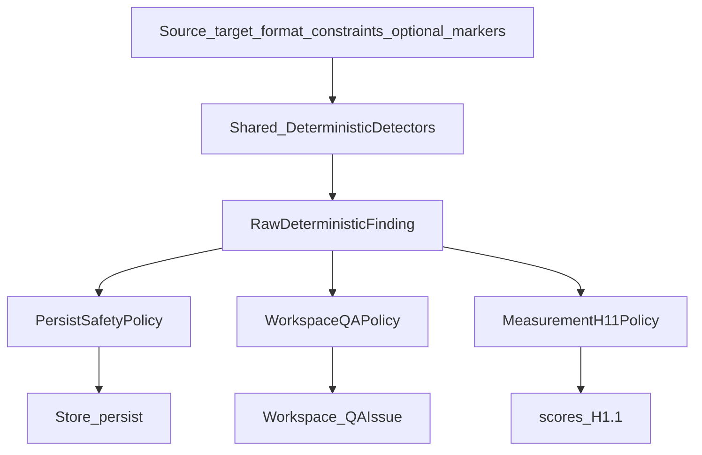

# TI.4 — Deterministic QA Hardening — Implementation Plan

**Status:** **Architecture Frozen (planning)** — implementation not started  
**Milestone:** TI.4 — Deterministic QA Hardening (TIQ program)  
**Kind:** Milestone implementation plan (authoritative when frozen on `main`)  
**Parent:** [TIQ_PARENT_IMPLEMENTATION_PLAN.md](TIQ_PARENT_IMPLEMENTATION_PLAN.md)  
**Prerequisites:** TQ.0 **Complete**; TI.1 **Complete**; TI.2 **Complete**; TI.3 **Complete** on `main` @ `72a41c6b08751f4415f46a87ac9b40ba78b65e79`  
**Official pack:** `tests/quality/baselines/baseline-v1.1.0/` · C1.0 · H1.0 (immutable)  
**Additive methodology (planned):** H1.1 · C1.3  
**Schema:** Migrator `TARGET` = **6** (unchanged)  
**ADR:** **No ADR required** for the default shared-detector + policy-adapter scope. **Conditional ADR-0010 amendment** only if TI4.3 proves a durable change to [`AIProviderInterface`](../../src/Translation/AI/AIProviderInterface.php) is required for bounded scaffolding-marker export (see §4.4 / §30). Integration API v1, Store identity, TARGET, and publication semantics are **STOP** if they appear required.  
**Planning branch:** `docs/ti4-deterministic-qa-hardening-plan`  
**Implementation branch:** **not created** until this plan is independently reviewed and Architecture Frozen on `main`  
**Related (unchanged ownership):** [ADR-0010](../adr/0010-provider-agnostic-interface.md), [ADR-0014](../adr/0014-glossary-platform-lexicon.md), [ADR-0015](../adr/0015-review-workflow-and-tm-approval-policy.md); TI.1 persist safety; TI.7 publication policy

**Operational success:** One shared deterministic **detection** core emits policy-neutral raw findings; layer-specific policy maps those findings to TI.1 persist safety, Workspace review UX, and TQ.0 H1.1 measurement—without LLM confidence, auto-publish, H1.0 mutation, fabricating historical marker evidence, or a second translator.

**Hard boundary:** TI.4 strengthens the deterministic quality signal and explicit block/warn policy. It is not TI.5 risk scoring, TI.7 publication, semantic judging, spell-check product, glossary-mode redesign, TM redesign, provider expansion, or human-review replacement.

**Two mandatory architecture refinements (frozen):**

1. **Raw findings are policy-neutral.** Shared detectors emit detected facts only. Severity, owner, and blocking class are applied exclusively by consumer policies.
2. **Historical leakage rescoring is evidence-gated.** Request-scoped scaffolding markers for `baseline-v1.1.0` are **Outcome C — NOT RETROSPECTIVELY SCORABLE** (see §8 / §22). Do not fabricate markers; do not convert “evidence unavailable” into PASS.

---

## 1. Executive summary

Repository evidence shows **three parallel deterministic QA systems** with overlapping intent and divergent severities:

| Layer | Owner today | Role |
|---|---|---|
| Persist / suggest | [`ResponseValidator`](../../src/Translation/AI/ResponseValidator.php) + [`SegmentConstraintAnalyzer`](../../src/Translation/AI/SegmentConstraintAnalyzer.php) | Binary fail-closed before Store (TI.1) |
| Workspace | [`QAEngine`](../../src/Workspace/QA/QAEngine.php) + `src/Workspace/QA/Checks/` | Save / approve UX (`error` / `warning` / `info`) |
| Measurement | TQ.0 [`DeterministicScorer`](../../tests/quality/src/DeterministicScorer.php) **H1.0** | Benchmark Class A; critical-only pass |

TI.1 froze **Option A** (validator canonical for persist; QAEngine UX; H1.0 measure). That was correct for TI.1 safety. TI.4’s parent exit gate—“deterministic blocking vs warning policy explicit and tested”—requires ending divergent rule copies.

**TI.4 freezes Option B:** a small shared deterministic QA **detection** layer, consumed by layer-specific **policy adapters**.

```text
Shared detector
    ↓
Raw deterministic finding  (facts only — no severity / owner / blocking_class)
    ↓
consumer policy
    ├── PersistSafetyPolicy     → TI.1 admitted BLOCK / non-block
    ├── WorkspaceQAPolicy       → ERROR / WARNING / INFO → QAIssue
    └── MeasurementH11Policy    → H1.1 critical / error / warning
```



**Default for newly admitted detectors:** QA-only (Workspace + H1.1). New TI.1 persist blockers require explicit high-confidence FP evidence and a recorded admit decision.

---

## 2. Preconditions (verified at planning freeze)

| Check | Evidence |
|---|---|
| Working tree clean; branch from `main == origin/main` | `72a41c6b08751f4415f46a87ac9b40ba78b65e79` |
| TARGET = 6 | [`Migrator::TARGET`](../../src/Database/Migrator.php) |
| TQ.0 / TI.1 / TI.2 / TI.3 Complete | TIQ parent; PRODUCT_PRIORITIES; milestone plans Complete on `main` |
| TIQ parent frozen | [TIQ_PARENT_IMPLEMENTATION_PLAN.md](TIQ_PARENT_IMPLEMENTATION_PLAN.md) |
| No TI.4 implementation branch | No `feature/ti4*` |
| TI.5–TI.7 not started | TIQ parent status |
| Parent TI.4 role | Explicit block vs warn; deterministic failures not overridable by LLM judge |
| H1.0 / C1.0 / baseline immutable | `DeterministicScorer::VERSION = 'H1.0'`; `baseline-v1.1.0/` |

---

## 3. Repository evidence (binding)

### 3.1 Three QA layers (divergence)

Shared today: **inventory only** via `SegmentConstraintAnalyzer`.

Not shared: scoring orchestration, severities, rule IDs, block policy, glossary source, URL coverage in Workspace, number persist policy.

Jobs: **no separate QA engine** — `BackgroundTranslationItemProcessor` → `TranslationService` → `ResponseValidator`. Review/publish: ADR-0015; save/approve QA via Workspace; auto-publish = TI.7 only.

### 3.2 TQ.0–TI.3 debt that drives TI.4

| Evidence | Binding consequence |
|---|---|
| `gut_01` Class B critical; H1.0 blind (`length_ratio` only) | Detection/policy owed; **no phrase-regex** (TI.1 TS14) |
| TI.2 packaging fixed glossary-scaffold **transport root** | Root cause largely mitigated; TI.4 owns observability/policy |
| TS7 Narrowed — persist omits numbers after SV FP | Do **not** re-admit literal number persist BLOCK |
| TS6 URL BLOCK Supported; SKU Deferred | Align Workspace URL; keep SKU heuristic Deferred |
| TS8 Unicode Deferred observe | Soft only; no persist BLOCK |
| Glossary DDL has no `forced` / `never_translate` | QD17 Unsupported; do not invent modes |
| No language-detection dependency | QD1 Deferred |
| Official pack `prompt_version: "1"`, `field_semantics_in_prompt: false` | Pre-TI.2 generation provenance; see §8 |

### 3.3 Official baseline generation shape (marker audit)

`tests/quality/baselines/baseline-v1.1.0/generations.jsonl` keys per case:

`case_id`, `category`, `case_class`, `text_format`, `field_semantics`, `source_text`, `translated_text`, `glossary_fragment`, `model`, `input_tokens`, `output_tokens`

Manifest also records: `provider_id=openai`, `prompt_profile=translate`, `prompt_version=1`, `glossary_fixture_version=G1.0`, subject SHA `d9c2336182fa2e0ae0582ead78cc0a346670c92a`.

**Absent:** request-scoped scaffolding marker inventory; full prompt body; TranslationContext item list; TM example markers.

`gut_01` frozen hypothesis contains Swedish instruction-like lines (`Ordlista över terminologi…`) while subject-SHA OpenAI framing was English (`Glossary terminology (use consistently):`). Exact marker reconstruction from subject provider code therefore **does not** honestly match the leaked Swedish scaffold without translation-aware guessing.

**Frozen historical gate:** Outcome **C — NOT RETROSPECTIVELY SCORABLE** for QD3/QD4/QD18/QD19 request-scoped scaffolding markers on `baseline-v1.1.0` (details §8 / §22).

---

## 4. Canonical ownership — Option B (frozen)

### 4.1 Shared detection core

Introduce `src/Translation/QA/` (exact package name may refine at implementation; ownership does not):

- **Detectors** — pure, local, network-free: inputs → list of **raw findings**
- **`SegmentConstraintAnalyzer`** — remains shared inventory primitive under detectors
- **No Store I/O, no provider HTTP, no policy decisions inside detectors**

### 4.2 Policy adapters (only place severity / blocking live)

| Adapter | Consumer | Maps raw finding to |
|---|---|---|
| `PersistSafetyPolicy` | TI.1 persist / suggest seam | Admitted **BLOCK** or non-block (preserve TI.1 set unless separately admitted) |
| `WorkspaceQAPolicy` | `QAEngine` / save / approve | `QAIssue` severities ERROR / WARNING / INFO |
| `MeasurementH11Policy` | TQ.0 H1.1 | critical / error / warning (+ N/A when evidence unavailable) |

### 4.3 Rejected alternatives

- **Option A forever** — continues divergent copies; fails TI.4 parent exit.
- Second Jobs QA engine.
- Workspace-only regex stack parallel to detectors.
- Promoting test-only logic without production ownership.
- Embedding Workspace/H1.1/TI.1 severity inside raw detector output.

### 4.4 Provider marker contract (planning realism)

[`AIProviderInterface`](../../src/Translation/AI/AIProviderInterface.php) today: `get_id`, `get_capabilities`, `test_connection`, `list_models`, `translate_batch` — **no marker API**.

Frozen constraints:

- Provider-specific rendered prompt text stays in provider ownership.
- Core QA **must not** hard-code OpenAI system/user prompt paragraphs.
- QA receives only a **bounded** marker list (short strings), never a full prompt dump.
- Null/Scripted providers safely supply **empty** marker lists.
- Prefer assembling markers in the request pipeline (`TranslationService` / batch sidecar) from known injected instruction fragments.

**If** TI4.3 proves a durable change to `AIProviderInterface` (or another frozen public contract) is required for marker export → **focused ADR-0010 amendment** before that wiring ships. **If** Integration API v1 expansion appears required → **STOP**. Do not hide an interface break inside “implementation detail.”

---

## 5. Raw finding vs policy-applied result (mandatory refinement)

### 5.1 Raw deterministic finding (shared; policy-neutral)

Conceptual fields (exact PHP names follow repository conventions at implementation):

| Field | Purpose |
|---|---|
| `check_id` | Stable detector / QD id |
| `check_version` | Detector revision for reproducibility |
| `dimension` / category | e.g. structural, terminology, leakage, soft |
| `message` or message key | Explainable, i18n-friendly description of the **fact** |
| `evidence` | Bounded: token / tag / URL / marker / numeric pair / short excerpt ≤N chars |
| `detector_meta` | Optional reproducibility aids (e.g. threshold used, locale pair, format) — **not** severity |

**Intrinsically forbidden on raw findings:**

- `severity` as consumer policy
- `owner` (`persist` / `workspace` / `measurement`)
- `blocking_class` (`persist_block` / `workspace_error` / …)
- TI.1 BLOCK decisions
- H1.1 criticality decisions

### 5.2 Policy-applied result (consumer-facing)

After policy application, consumer DTOs **may** carry severity / owner / blocking classification:

- Persist → existing `ResponseValidationResult` / `WP_Error` codes
- Workspace → `QAIssue` (`error` / `warning` / `info`)
- H1.1 → finding arrays with methodology severity + optional `applicability` (`applicable` \| `not_applicable`)

### 5.3 Runtime / measurement consistency

Same inputs + same raw detectors ⇒ same **raw** findings.

Policies may differ **explicitly** (documented asymmetries only), e.g.:

- Numbers: persist omit vs H1.1/Workspace warn-or-error
- Empty clear-on-save: Workspace soft vs persist/H1.1 hard for generation scoring
- Placeholder addition: H1.1 critical vs persist OBSERVE (no new persist BLOCK without proof)
- Leakage on historical packs: H1.1 `not_applicable` vs live TI.4-era applicable scoring

Forbidden: silent PASS/FAIL contradiction without a documented reason.  
Forbidden: treating `not_applicable` as PASS.

---

## 6. Current detector inventory (condensed)

**Analyzer:** placeholders, HTML tags, numbers, absolute URLs, `non_empty`, `DANGEROUS_TAGS`.

**ResponseValidator:** `empty_target`, `placeholder_mismatch`, `html_structure_mismatch`, `forbidden_markup`, `url_mismatch`, `number_mismatch` (suggest; persist omits numbers).

**QAEngine:** Placeholder, HTML, Empty, Variable, Whitespace, Number, Punctuation, UnsupportedMarkup, LengthRatio, GlossaryTerm.

**H1.0:** empty, source==target, placeholder loss/addition, html_tag_loss, forbidden_markup, broken_html, number_corruption, url_corruption, sku_corruption, entity_damage, whitespace, length_ratio, glossary_compliance, unicode_damage.

---

## 7. QD candidate matrix (frozen dispositions)

| ID | Candidate | Disposition | Notes |
|---|---|---|---|
| QD1 | Wrong-language | **Deferred** | No detector lib; short-text FP; Class B human flag remains |
| QD2 | Source==target | **Partially Supported** | Workspace + H1.1 WARNING above length threshold; not persist BLOCK |
| QD3 | Glossary-instruction leakage | **Partially Supported** | Request-scoped scaffolding markers only; no `gut_01` phrase rule; historical baseline = Outcome C |
| QD4 | Forbidden/system-instruction leakage | **Partially Supported** | Same marker mechanism as QD3; historical = Outcome C |
| QD5 | Placeholder loss/addition | **Supported** | Shared; addition = QA/H1.1; persist addition remains OBSERVE unless separately admitted |
| QD6 | HTML/tag structure | **Supported** | Shared; align Workspace ERROR for HTML inventory loss |
| QD7 | Dangerous markup | **Supported** | Shared; Workspace ERROR for invented dangerous tags |
| QD8 | URL preservation | **Supported** | Shared absolute URL loss; add Workspace URL check (ERROR); persist BLOCK unchanged |
| QD9 | Number preservation | **Partially Supported** | Locale-normalized for H1.1 ERROR + Workspace WARNING; **persist remains omit** |
| QD10 | Unit preservation | **Deferred** | No conversion engine |
| QD11 | SKU/identifier heuristic | **Deferred** | Fixture SKUs measurement-only; no broad prose-as-ID regex |
| QD12 | Unicode/entity | **Partially Supported** | OBSERVE / H1.1 soft; no persist BLOCK (TS8) |
| QD13 | Length ratio | **Supported** | WARNING; unify thresholds (document H1.0-compatible `mb_strlen` bounds) |
| QD14 | Duplicate/repeated sentence | **Partially Supported** | Exact consecutive duplicate WARNING only |
| QD15 | Hallucinated preamble/postamble | **Partially Supported** | Scaffolding-marker leak only; general hallucination Deferred |
| QD16 | Glossary required-term compliance | **Partially Supported** | Preferred-term presence on existing lexicon; no mode schema |
| QD17 | Never-translate compliance | **Unsupported** | Schema does not express it |
| QD18 | TranslationContext leakage | **Partially Supported** | Request-scoped markers; historical = Outcome C |
| QD19 | TM-example leakage | **Partially Supported** | Request-scoped markers; historical = Outcome C |
| QD20 | SEO-length advisory | **Deferred** | Not TI.4 core |
| QD21 | Empty/whitespace-only | **Supported** | Persist BLOCK unchanged; H1.1 critical; Workspace clear-on-save soft path documented |
| QD22 | Result evidence model | **Supported** | Raw finding + policy-applied consumer DTOs |

---

## 8. `gut_01` / QD3 disposition (frozen)

### 8.1 Product rule

- **Root cause:** largely mitigated by TI.2 packaging (scaffold separation).
- **Detection class:** request-scoped **scaffolding marker** leak (markers actually injected for *this* request; absent from source; present in target).
- **Forbidden:** hard-coding the exact `gut_01` Swedish glossary sentence or any one-off phrase rule as “deterministic QA.”

### 8.2 Live / TI.4-era severity (policy-applied)

| Consumer | Policy (after raw finding) |
|---|---|
| H1.1 | critical when applicable |
| Workspace | ERROR when applicable |
| Persist (wave-1) | **not** auto-BLOCK; optional later admit only after FP proof |

### 8.3 Historical `baseline-v1.1.0` leakage gate — **Outcome C**

Planning audit finding (binding):

1. No immutable artifact captures the request-scoped marker set (**not Outcome B**).
2. Deterministic reconstruction from subject SHA + `prompt_version=1` yields English OpenAI framing, which does **not** match the Swedish leaked scaffold in `gut_01` without translation-aware guessing (**not honest Outcome A** for QD3 as designed).
3. Therefore **Outcome C — NOT RETROSPECTIVELY SCORABLE** for QD3/QD4/QD18/QD19 on official `baseline-v1.1.0` generations.

Required methodology behavior:

- Do **not** fabricate historical markers.
- Do **not** claim H1.1 mechanically detected historical `gut_01` via QD3.
- Report leakage checks as **`not_applicable` / evidence unavailable** for that pack.
- Retain original Class B `gut_01` evidence (`invented_claims`, `unusable_for_publish`).
- For **new** TI.4-era generations, capture request-marker provenance so H1.1 can score leakage deterministically.

H1.1 must distinguish at least:

- clean **PASS** (applicable, no finding)
- **finding** (applicable, defect detected)
- **not_applicable** (evidence unavailable) — **must not** be scored as PASS

---

## 9. Wrong-language disposition — **Deferred**

No library; short ecommerce strings unreliable; mixed Latin/brand/chemical content common. Keep Class B `wrong_language`. Revisit only with proven bounded heuristic + dependency/ADR if needed (out of TI.4 default).

---

## 10. Number / unit disposition

- **Numbers (QD9):** Partial — normalized digit/separator comparison for measurement + Workspace warning; persist omit stays (TS7). `NumberLocalizationProofTest` remains binding negative-control suite.
- **Units (QD10):** Deferred — no conversion/translation engine.

---

## 11. Identifier policy

- Absolute URLs: Supported (shared).
- Placeholders: Supported (shared).
- SKU/product-code heuristics: Deferred (TS6 FP).
- Fixture SKUs: measurement-only via `expected_invariants`.
- Emails/chemical IDs: only when source evidence / invariants supply them — no broad regex classifying prose as IDs.

---

## 12. Leakage policy

Provider-agnostic via **request-scoped markers** assembled for the request under test.

- Live path: markers available → detectors applicable.
- Historical `baseline-v1.1.0`: Outcome C → detectors **not_applicable**.
- Null/Scripted: empty markers → no false leakage findings from absent inventory (and no fabricated markers).

---

## 13. Glossary QA boundary

- In-scope: preferred-term presence using existing lexicon (Workspace live glossary; H1.1 fixtures).
- Out-of-scope: inventing `forced`/`never_translate`; gut_01 phrase special-case; second glossary system.
- TI.3 glossary-safety for TM eligibility remains intact and separate from TI.4 QA policy.

---

## 14. Severity model (policy-applied only)

Conceptual consumer levels:

| Level | Meaning |
|---|---|
| BLOCK | Fail-closed before Store (TI.1 persist only) |
| ERROR | Workspace may block save/approve when `qa_block_on_error` |
| WARNING | Never Workspace-blocks; H1.1 non-failing unless policy marks critical |
| OBSERVE / INFO | Diagnostics / soft measurement |
| not_applicable | Evidence unavailable — not PASS |

Detection never chooses these; **policies** do.

---

## 15. TI.1 persist blocking boundary

Preserve TI.1 admitted persist BLOCKs: empty, placeholder loss, HTML structure (HTML format), forbidden invented dangerous tags, absolute URL loss when constrained.

**Do not casually add:** numbers, SKU heuristics, wrong-language, length, source==target, leakage (wave-1), glossary preferred-term, unicode.

Any new persist BLOCK requires written FP evidence + validation-log admit.

---

## 16. TI.7 publication boundary

TI.4 emits findings suitable for later consumption. **No** auto-publish, score thresholds as publish authority, or LLM confidence. TI.7 owns publication policy.

---

## 17. Machine-readable models

### 17.1 Raw finding

See §5.1 — facts only.

### 17.2 Policy-applied

Reuse/extend existing consumer DTOs (`ResponseValidationResult`, `QAIssue`/`QAResult`, H1.1 finding arrays). No second diagnostics product. No schema/TARGET bump. No new persisted QA table unless STOP→ADR (not planned).

---

## 18. H1.1 design

- New methodology version **H1.1** alongside immutable **H1.0**.
- Write `scores.H1.1.json` **alongside** `scores.H1.0.json` — never overwrite.
- Candidate comparisons **must declare** scorer version.
- Official reports may show both; H1.0 remains historical authority for baseline-v1.1.0’s original pass claim.
- Pass rule when all applicable checks run: `critical_count === 0` among **applicable** findings.
- **Applicability:** leakage (and any other evidence-gated check) may return `not_applicable` without counting as PASS or as a defect finding.
- Raw H1.1 vs H1.0 critical counts are **not** equivalent methodology — do not treat deltas as translation regressions.

---

## 19. C1.3 design

Additive corpus `tests/quality/corpus/C1.3/` — detector cases **and negative controls**:

- scaffolding / context / TM leakage positives **with captured markers**
- clean controls (no markers leaked)
- localized number true-corrupt vs legitimate SV forms
- URL / HTML / placeholder / forbidden-markup
- source==target brand controls
- glossary preferred-term miss/hit
- duplicate paragraph
- empty / whitespace
- explicit “evidence unavailable” methodology fixtures if needed for harness honesty

Do **not** mutate C1.0 / C1.1 / C1.2.

---

## 20. False-positive methodology

Per Supported/Partial detector: positive fixtures, negative controls, edge cases, policy severity, thresholds, minimum evidence. Report **per-detector** outcomes — not one opaque accuracy %.

---

## 21. Baseline rescore model

| Artifact | Rule |
|---|---|
| `scores.H1.0.json` | Untouched |
| Frozen `generations.jsonl` | Untouched — **no inferred historical markers appended** |
| `scores.H1.1.json` | Additive rescore |
| QD3/QD4/QD18/QD19 on this pack | **`not_applicable`** (Outcome C) |
| Class B `gut_01` | Retained as human evidence |
| New TI.4-era packs | Must include marker provenance for applicable leakage scoring |

Separate reporting lanes:

1. **Translation candidate quality** (generation better/worse)
2. **QA observability** (detector surfaces previously invisible defects on applicable evidence)
3. **Detector quality** (C1.3 defect vs control discrimination)

---

## 22. Historical marker-evidence decision (TI4.4 / TI4.6 gate)

Allowed outcomes (exactly one per pack × leakage check family):

| Outcome | Meaning |
|---|---|
| **A — RECONSTRUCTABLE** | Exact markers deterministically rebuildable from immutable provenance without guessing |
| **B — ALREADY CAPTURED** | Immutable artifact already stores the marker set |
| **C — NOT RETROSPECTIVELY SCORABLE** | Evidence missing; cannot reconstruct honestly |

**Official `baseline-v1.1.0`:** **C** for request-scoped scaffolding leakage (QD3/QD4/QD18/QD19).

Implementation must **prove** this gate in TI4.4/TI4.6 (documented reconstruction attempt + negative proof that fabricating Swedish markers / equating English reconstruction to Swedish leak would be dishonest). If future packs capture markers (B) or prove honest reconstruction (A), those packs may score leakage as applicable.

---

## 23. Sync / Jobs / Workspace integration

```text
generate (sync|Jobs)
  → shared detectors (optional for persist hot path: only TI.1-admitted checks)
  → PersistSafetyPolicy → Store

Workspace save/approve / meta
  → shared detectors → WorkspaceQAPolicy → QAIssue

TQ.0 score
  → shared detectors → MeasurementH11Policy → scores.H1.1
```

Do not force every QA detector onto the persist hot path. Jobs inherit persist policy only.

---

## 24. Provider-agnostic boundary

Detectors consume source/target/format/constraints + optional marker inventory. No OpenAI essays in core QA. Marker export constraints: §4.4.

---

## 25. Privacy / security

Bounded evidence only; no full private bodies; no API keys; no full prompt dumps as QA evidence.

---

## 26. Performance / boundedness

Local CPU; no AI/vector/network; O(n) over text length; reuse analyzer inventories; bounded substring marker scans. Benchmark if HTML cost rises. Normal CI network-free.

---

## 27. Work packages TI4.0–TI4.8

### TI4.0 — Baseline / admissions lock

| | |
|---|---|
| **Objective** | Lock QD dispositions, Option B, raw-vs-policy split, historical Outcome C, TI.1/TI.7 boundaries, immutables |
| **Scope** | Docs / validation log skeleton; no production code |
| **Dependencies** | This plan Architecture Frozen on `main` |
| **STOP** | Implementing detectors early; mutating H1.0; fabricating baseline markers |
| **Completion** | Admissions recorded; TARGET 6 confirmed |

### TI4.1 — Canonical deterministic QA rule model

| | |
|---|---|
| **Objective** | Raw finding type + detector interface + policy adapter seams (severity only in adapters) |
| **Likely files** | `src/Translation/QA/*`; thin adapters toward ResponseValidator / QAEngine; unit tests |
| **Validation** | Unit: raw finding has no severity/owner/blocking_class; policies map explicitly |
| **Rollback** | Unused package until wired |
| **STOP** | Schema bump; second Jobs QA; policy fields on raw DTO |

### TI4.2 — High-confidence detector hardening

| | |
|---|---|
| **Objective** | Unify empty/placeholder/HTML/forbidden/URL/length/whitespace via shared detectors; align Workspace URL + dangerous-markup ERROR |
| **Preserve** | TI.1 admitted persist BLOCK set |
| **Validation** | Unit + integration parity; TI.1 regression |
| **STOP** | Re-admit literal number persist BLOCK |

### TI4.3 — Leakage / glossary / identifier QA

| | |
|---|---|
| **Objective** | Request-scoped scaffolding leak (QD3/4/18/19); glossary preferred-term Partial; identifiers per §11; marker provenance on new generations |
| **Provider** | Bounded markers; Null/Scripted empty; ADR-0010 amendment **only if** interface change required |
| **STOP** | gut_01 phrase regex; never_translate schema; full prompt as evidence; Integration API change |

### TI4.4 — H1.1 + C1.3 methodology

| | |
|---|---|
| **Objective** | H1.1 scorer with applicability states; C1.3 corpus; compare-by-scorer-version protocol; prove historical marker gate (Outcome C for baseline-v1.1.0) |
| **Likely files** | `tests/quality/src/*`, `tests/quality/corpus/C1.3/`, quality CLIs |
| **STOP** | Mutating H1.0/C1.0/baseline generations; treating not_applicable as PASS |

### TI4.5 — Workspace / Jobs diagnostics integration

| | |
|---|---|
| **Objective** | Workspace checks call shared detectors + WorkspaceQAPolicy; Jobs unchanged except shared persist adapters; bounded diagnostics |
| **STOP** | Auto-publish; review workflow redesign |

### TI4.6 — Baseline rescore + false-positive evaluation

| | |
|---|---|
| **Objective** | Additive `scores.H1.1.json`; leakage checks N/A on baseline-v1.1.0; detector FP reports; number localization controls; no fabricated gut_01 QD3 claim |
| **STOP** | Treating new H1.1 criticals as translation regressions; rewriting generations.jsonl |

### TI4.7 — Acceptance / performance / regression

| | |
|---|---|
| **Objective** | Full gates; TI.1/TI.2/TI.3 intact; TARGET 6; CI green; perf bounds |
| **STOP** | Live AI in normal CI |

### TI4.8 — Documentation closure

| | |
|---|---|
| **Objective** | Mark TI.4 Complete after merge + green main; next = TI.5 **planning only** |
| **STOP** | Starting TI.5 implementation |

---

## 28. Acceptance criteria (78)

### Ownership and result model

1. Option B shared detection layer is the sole source of truth for admitted shared checks’ **detection**.
2. Raw deterministic findings are policy-neutral: no intrinsic severity, owner, or blocking_class.
3. PersistSafetyPolicy alone maps raw findings to TI.1 BLOCK / non-block.
4. WorkspaceQAPolicy alone maps raw findings to QAIssue severities.
5. MeasurementH11Policy alone maps raw findings to H1.1 severities / applicability.
6. Consumer-facing DTOs may carry severity only **after** policy application.

### Immutability and methodology

7. H1.0 immutable; `scores.H1.0.json` never overwritten.
8. H1.1 coexists; comparisons declare scorer version.
9. C1.0 / C1.1 / C1.2 / baseline-v1.1.0 original evidence immutable.
10. Frozen `generations.jsonl` is not mutated to add inferred historical markers.
11. C1.3 additive with positives and negative controls.
12. H1.1 distinguishes PASS, finding, and `not_applicable` where required.
13. `not_applicable` is never treated as PASS.

### QD dispositions

14. QD1 Deferred — not implemented as runtime/H1.1 BLOCK.
15. QD2 Partially Supported — warning only; not persist BLOCK.
16. QD3 Partially Supported — request-scoped markers; no gut_01 phrase rule.
17. QD4 Partially Supported — same marker mechanism.
18. QD5 Supported — shared placeholder detection; addition not new persist BLOCK without proof.
19. QD6 Supported — shared HTML structure detection.
20. QD7 Supported — shared dangerous markup; Workspace ERROR for invented dangerous tags.
21. QD8 Supported — shared absolute URL loss; Workspace URL check present.
22. QD9 Partially Supported — normalized comparison for H1.1/Workspace; persist omit retained.
23. QD10 Deferred.
24. QD11 heuristic Deferred; fixture SKUs measurement-only.
25. QD12 Partially Supported — observe/soft; no persist BLOCK.
26. QD13 Supported — warning; thresholds documented/unified.
27. QD14 Partially Supported — exact consecutive duplicate warning only.
28. QD15 Partially Supported — marker leak only; general hallucination Deferred.
29. QD16 Partially Supported — preferred-term presence only.
30. QD17 Unsupported — no never_translate schema invention.
31. QD18 Partially Supported — request-scoped context markers.
32. QD19 Partially Supported — request-scoped TM-example markers.
33. QD20 Deferred.
34. QD21 Supported — empty handling asymmetries documented.
35. QD22 Supported — raw + policy-applied models implemented as planned.

### gut_01 / historical leakage

36. No brittle gut_01 phrase-special-case rule.
37. Official baseline-v1.1.0 scaffolding-leakage checks are Outcome C / not_applicable.
38. No claim that H1.1 mechanically detected historical gut_01 via QD3.
39. Original Class B gut_01 evidence retained.
40. New TI.4-era generations capture request-marker provenance for applicable leakage scoring.
41. TI4.4/TI4.6 record the historical marker-evidence gate outcome with proof.

### Boundaries

42. TI.1 admitted persist BLOCKs preserved.
43. New persist BLOCKs require explicit admit evidence.
44. Numbers are not re-admitted as TI.1 persist BLOCK in this milestone.
45. No TI.7 auto-publish / score-threshold publish authority.
46. No LLM judge as deterministic authority.
47. No LLM confidence.
48. No second Store / TM / glossary / translator / Jobs QA engine.
49. No TARGET / schema / Store identity / Integration API v2 change.
50. Sync and Jobs share persist policy via TranslationService.
51. Workspace save/approve consume shared detectors via WorkspaceQAPolicy.
52. Documented intentional asymmetries only.
53. Provider-agnostic core QA; markers bounded; no full prompt dump evidence.
54. Null/Scripted providers remain compatible (empty markers safe).
55. If AIProviderInterface must change for markers, ADR-0010 amendment precedes that change.
56. Glossary preferred-term only; no mode schema.
57. TI.3 TM metrics remain separate from QA scores.
58. TI.2 context contract intact.
59. TI.1 structural regression green.
60. Review≠published preserved (ADR-0015).
61. `qa_block_on_error` still ignores warnings.

### Quality / FP / rescore

62. Detector FP methodology recorded per admitted rule.
63. Baseline H1.1 rescore is additive.
64. H1.1 vs H1.0 critical counts are not treated as equivalent methodology.
65. Translation-quality vs QA-observability vs detector-quality lanes are reported separately.

### Performance / privacy / CI

66. No AI / vector / network in QA path.
67. Privacy: bounded evidence only.
68. Performance bounded; complexity documented.
69. Normal CI network-free.
70. PHPCS / unit / integration / quality / build green on implementation branch before merge.
71. PluginGuard intact.
72. ZIP audit passes.

### Process

73. Validation log records all QD dispositions and the historical marker gate.
74. Planning freeze precedes implementation branch creation.
75. No TI.5–TI.7 implementation in TI.4.
76. TARGET remains 6 through TI.4 closure.
77. Rollback does not require schema down-migration.
78. STOP conditions respected; acceptance criteria independently re-scorable.

---

## 29. Validation strategy

- **Unit:** each detector; raw finding shape (no policy fields); policy maps; FP controls; number localization suite; marker presence/absence.
- **Integration:** TI.1 persist admitted BLOCKs unchanged; Workspace URL/markup; live leakage with markers; Jobs terminal codes for TI.1 set.
- **Quality:** H1.0 verify unchanged; H1.1 on C1.3; baseline H1.1 rescore with leakage N/A; applicability states tested.
- **Historical gate proof:** documented attempt + Outcome C rationale for baseline-v1.1.0 (English reconstruction ≠ Swedish leak; no marker artifact).
- **Compare protocol:** separate translation quality / observability / detector quality.
- Full CI gates as prior TI milestones.

---

## 30. ADR assessment

| Topic | Decision |
|---|---|
| Shared detectors + policy adapters | **No ADR** — internal architecture |
| H1.1 / C1.3 methodology versioning | **No ADR** — TQ.0 already allows non-destructive scorer versions |
| Marker export without interface change | **No ADR** |
| Marker export requiring `AIProviderInterface` change | **Conditional focused ADR-0010 amendment** before that wiring |
| Persisted QA store / Integration API QA / publish-state coupling | **STOP** — out of TI.4; escalate |

---

## 31. STOP conditions

STOP/defer if TI.4 requires: LLM semantic judge; LLM confidence; vector detectors; second QA engine; new Store; schema/TARGET bump; identity redesign; auto-publication; review workflow redesign; glossary mode schema; full spell-check product; live AI in normal CI; mutation of H1.0/C1.0/baseline evidence; brittle gut_01 phrase rule; fabricating historical markers; treating not_applicable as PASS; literal number persist BLOCK without new proof; Integration API v2; hard-coding OpenAI prompt paragraphs into core QA.

---

## 32. Expected files / components (implementation later)

- New: `src/Translation/QA/` (detectors, raw finding type, policies)
- Touch: `ResponseValidator.php` (adapter), `QAEngine` + Checks, possibly `TranslationService` / OpenAIProvider for bounded markers, `Plugin.php` wiring
- Tests: unit QA; integration Workspace/persist; `tests/quality` H1.1 + C1.3
- Docs: this plan; validation log; TIQ parent / PRODUCT_PRIORITIES pointers; conditional ADR-0010 amendment only if required

**This planning freeze touches docs only.**

---

## 33. Limitations / deferred items

QD1, QD10, QD11 heuristic, QD17, QD20; general hallucination beyond markers; language ID; unit conversion; wave-1 persist BLOCK for leakage/numbers; publication policy; retrospective scaffolding scoring of `baseline-v1.1.0`.

---

## 34. Rollback

Disable Workspace/H1.1 adapter wiring; leave TI.1 persist behavior; no schema migration to reverse. H1.1 artifacts are additive and can be ignored.

---

## 35. Roadmap pointers

### At this planning freeze (materialization)

- TQ.0 **Complete**
- TI.1 **Complete**
- TI.2 **Complete**
- TI.3 **Complete**
- TI.4 **Architecture Frozen (planning)** — implementation **not started**
- TI.5–TI.7 **not started**

**Exact next step after independent review PASS and merge:** create `feature/ti4-deterministic-qa-hardening` and execute TI4.0–TI4.8. Do not create that feature branch on this planning branch.

### After implementation closure (later milestone)

- TI.4 **Complete**
- Next = definitive TI.5 planning only

---

## 36. Planning workflow

1. Branch `docs/ti4-deterministic-qa-hardening-plan` from main (this document)
2. Minimal TIQ parent / PRODUCT_PRIORITIES pointers
3. Docs-only validate → commit/push → **independent review** → `--no-ff` merge → planning closure
4. **Only then** create `feature/ti4-deterministic-qa-hardening`

**Do not** combine planning freeze with production implementation.

---

## 37. TI.4 FREEZE RECOMMENDATION

**STATE A — FREEZE**

Evidence is sufficient; Option B, raw-vs-policy split, QD dispositions, and historical Outcome C are decidable without architectural contradiction to TQ.0–TI.3.

---

## Document control

| Item | Value |
|---|---|
| Canonical path | `docs/plans/TI4_DETERMINISTIC_QA_HARDENING_IMPLEMENTATION_PLAN.md` |
| Kind | Milestone implementation plan |
| Parent | `docs/plans/TIQ_PARENT_IMPLEMENTATION_PLAN.md` |
| Baseline SHA | `72a41c6b08751f4415f46a87ac9b40ba78b65e79` |
| Acceptance criteria count | **78** |
| Historical leakage gate | Outcome **C** for `baseline-v1.1.0` scaffolding markers |
| Revision | 1.0 — 2026-08-10 — Architecture Frozen (planning); raw-finding neutrality + historical marker gate frozen; implementation not started |
