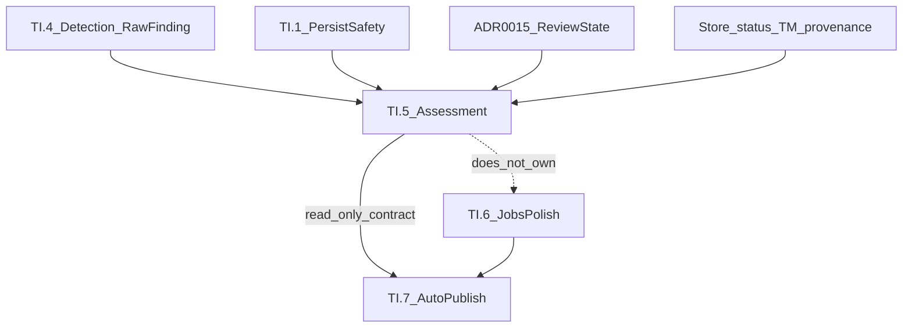

# TI.5 — Evidence-based Review / Risk Signals — Implementation Plan

**Status:** **Complete** on `main`
**Milestone:** TI.5 — Evidence-based review / risk signals (TIQ program)
**Kind:** Milestone implementation plan (authoritative on `main`)
**Parent:** [TIQ_PARENT_IMPLEMENTATION_PLAN.md](TIQ_PARENT_IMPLEMENTATION_PLAN.md)
**Prerequisites:** TQ.0 **Complete**; TI.1 **Complete**; TI.2 **Complete**; TI.3 **Complete**; TI.4 **Complete**
**Official pack (immutable):** `tests/quality/baselines/baseline-v1.1.0/` · C1.0 · H1.0; additive H1.1 · C1.3 unchanged by TI.5
**Schema:** Migrator `TARGET` = **6** (unchanged)
**ADR:** **ADR-0019** — [Evidence-based risk assessment contract](../adr/0019-evidence-based-risk-assessment.md) (Accepted)
**Assessment version:** `R1.0`
**Planning branch:** `docs/ti5-evidence-based-review-risk-signals-plan`
**Independent review (planning):** **PASS** (2026-08-10)
**Freeze merge:** `f193bc3681731ef320a75141158c855df71e5998`
**Implementation branch:** `feature/ti5-evidence-based-review-risk-signals` @ `d48a5496f6e16658aa822f59b3b4a7bcb4064382`
**Independent review (implementation):** **PASS** (2026-08-10)
**Merge commit:** `279ea0f22752141465d6cd3f42823f21d52e2f6b`
**Validation log:** [TI5_EVIDENCE_BASED_REVIEW_RISK_SIGNALS_VALIDATION_LOG.md](TI5_EVIDENCE_BASED_REVIEW_RISK_SIGNALS_VALIDATION_LOG.md)
**Next:** TI.6 **planning only** — do not implement TI.6 until its plan is Architecture Frozen on `main`
**Related (unchanged ownership):** [ADR-0010](../adr/0010-provider-agnostic-interface.md), [ADR-0014](../adr/0014-glossary-platform-lexicon.md), [ADR-0015](../adr/0015-review-workflow-and-tm-approval-policy.md); TI.1 persist safety; TI.4 shared QA; TI.6 Jobs polish; TI.7 publication policy

**Operational success:** One computed assessment core aggregates observable TI.1–TI.4 / review / provenance evidence into a versioned, explainable risk/readiness signal that Workspace (and later TI.7) can consume—without LLM confidence, opaque sole scores, persisted canonical quality state, publication mutation, or a second detector/translator.

**Hard boundary:** TI.5 is **assessment**, not detection, not translation, not review redesign, not Jobs polish, and not auto-publication.

---

## 1. Executive summary

The TIQ parent freezes TI.5 as **Evidence-based review / risk signals**: derive review/risk decisions from **observable evidence only**, not model self-confidence percentages ([parent §4 invariant 7](TIQ_PARENT_IMPLEMENTATION_PLAN.md), §9, §11).

TI.4 already provides shared deterministic **detection** (`DeterministicQA` → policy-neutral `RawFinding` → Persist / Workspace / H1.1 policies). ADR-0015 already owns review workflow. Store already holds content provenance and generation metadata. What is missing is a single **assessment** layer that:

1. aggregates hard structural, deterministic QA, human review, provenance, and evidence-completeness facts;
2. applies explicit hard/soft/human precedence;
3. emits a closed readiness category plus visible facets/reasons;
4. remains recomputed current-state (no stale score store);
5. is TI.7-consumable without circular dependency.

```text
Existing evidence
  TI.1 structural / ResponseValidator codes
  TI.4 DeterministicQA → RawFinding → policies
  ADR-0015 review_status
  Store status + generation metadata
  optional in-request TMGenerationOutcome
        ↓
  AssessmentAssembler (one pass)
        ↓
  RiskAssessmentPolicy
        ↓
  TranslationAssessment (versioned, read-only)
        ↓
  Workspace ViewModel / diagnostics (thin)
        ↓ (later, not TI.5)
  TI.7 publication policy
```



---

## 2. Authoritative TI.5 parent contract

| Axis | Frozen meaning |
|---|---|
| **Official name** | TI.5 — Evidence-based review / risk signals |
| **Objective** | Observable-evidence review/risk signals — not LLM confidence % |
| **Dependencies** | TI.4 + TI.3 (parent graph); consumes TI.1/TI.2/TQ.0 contracts |
| **Inputs** | Deterministic QA findings, structural validation, Store translation/review metadata, TM outcome when available, bounded generation provenance |
| **Outputs** | Versioned machine-readable assessment (category + facets + reasons) — **not** publication |
| **Quality gate** | No LLM self-confidence percentage as publication authority; no opaque sole score |
| **ADR** | ADR-0019 (this freeze) |
| **Out of scope** | Auto-publish, translator redesign, second QA engine, schema/TARGET, Integration API v2, opaque sole score, LLM judge authority |

Historical Program B.5 “Confidence / quality scoring” language in [POST_V1_PLATFORM_ROADMAP.md](POST_V1_PLATFORM_ROADMAP.md) is **superseded** by TIQ: TI.5 replaces LLM-confidence publish authority with observable risk signals.

---

## 3. Repository baseline (planning freeze)

| Check | Value |
|---|---|
| Planning baseline `main` | `4a0fceab913c4af8c7dc07fd3be997fe89a66494` |
| `Migrator::TARGET` | **6** |
| TQ.0–TI.4 | **Complete** |
| TI.5–TI.7 implementation | **Not started** |
| Production / test changes in this freeze | **None** (docs + ADR only) |

---

## 4. Existing architecture findings

### Present and reusable

- Store two-axis model: content `status` + `review_status` — [Store.php](../../src/Translation/Store.php), [ADR-0015](../adr/0015-review-workflow-and-tm-approval-policy.md)
- Workspace QA: [QAEngine](../../src/Workspace/QA/QAEngine.php), [QAResult](../../src/Workspace/QA/QAResult.php); `qa_block_on_error`
- TI.4: [DeterministicQA](../../src/Translation/QA/DeterministicQA.php), [RawFinding](../../src/Translation/QA/RawFinding.php), Persist/Workspace/H1.1 policies
- TI.1: [ResponseValidator](../../src/Translation/AI/ResponseValidator.php) (persist omits numbers)
- TI.2: [FieldSemantic](../../src/Translation/AI/FieldSemantic.php) closed enum + mapper
- TI.3: [TMGenerationOutcome](../../src/Translation/Memory/TMGenerationOutcome.php); TM `confidence` = retrieval similarity **only**
- Generation metadata: `provider`, `model`, `prompt_profile`, `prompt_version`, `glossary_version`, dormant `tm_id`
- Page coverage: [TranslationStatusCalculator](../../src/Workspace/TranslationStatusCalculator.php) — **not** quality risk

### Gap (TI.5 owns)

- No unified assessment DTO / `assessment_version`
- No risk/readiness category with hard/soft precedence
- No runtime evidence-completeness facet
- No TI.7-ready read-only contract
- Suggestion ranking `confidence` must **not** become TI.5 authority

---

## 5. Milestone boundaries

| Milestone | Owns | Must not own |
|---|---|---|
| **TI.4** | Shared detection; policy-neutral findings; Persist/Workspace/H1.1 maps | Risk aggregation; publish |
| **TI.5** | Evidence aggregation → explainable assessment; category; Workspace/diagnostics read surfacing; TI.7-consumable read-only contract | Detectors; LLM confidence; auto-publish; review redesign; Jobs lifecycle mutation |
| **TI.6** | Jobs scale/safety polish: token budgets, `Retry-After`, identical-segment TM reuse | Risk model redesign; publication policy |
| **TI.7** | Controlled auto-publication policy (separate ADR later); consumes TI.5 | Second assessment core |

**Human review:** TI.5 **consumes** ADR-0015; does not redesign it. `approved ≠ published` remains binding.

---

## 6. Evidence authority hierarchy

| Rank | Class | Sources | TI.5 role |
|---|---|---|---|
| **A HARD** | Structural safety | TI.1 BLOCK set / PersistSafetyPolicy / empty, placeholder loss, HTML loss, forbidden markup, URL loss | Forces `blocked`; cannot be cancelled |
| **B DET QA** | Policy-applied TI.4 | One `DeterministicQA` pass; Workspace ERROR / H1.1 error|critical maps | Errors escalate; warnings soft |
| **C HUMAN** | Review axis | `review_status` + submit/approve metadata | Facet + reasons; never erases A/B |
| **D PROVENANCE** | Content/generation | Store `status`, provider/model/prompt; in-request TM outcome | Facet only |
| **E COMPLETENESS** | Evidence gate | markers_applicable / N/A; missing texts | unavailable ≠ PASS |
| **F SOFT** | Warnings | length, source==target, numbers, glossary preferred-term, unicode/entity | Listed; never cancel hard |

**Forbidden authorities:** LLM self-confidence; suggestion ranking confidence; TM retrieval confidence as quality; TQ.0 Class C as runtime gate; opaque aggregate score.

**TQ.0 fixtures:** benchmark only — not a production dependency for live segment assessment.

---

## 7. RA candidate matrix (frozen dispositions)

| ID | Candidate | Disposition | Rationale |
|---|---|---|---|
| RA1 | Machine-readable translation assessment | **Supported** | Parent TI.5 role |
| RA2 | Hard-blocker aggregation | **Supported** | TI.1 BLOCK + critical structural |
| RA3 | Deterministic QA error aggregation | **Supported** | Workspace ERROR / H1.1 error |
| RA4 | Warning/advisory aggregation | **Supported** | Soft lane |
| RA5 | Evidence-completeness state | **Supported** | TI.4 N/A precedent |
| RA6 | Human-review state integration | **Supported** | Consume ADR-0015 |
| RA7 | Translation provenance integration | **Supported** | Store status + generation fields |
| RA8 | TM provenance integration | **Partially Supported** | In-request outcome; stored metadata only; TM confidence ≠ quality |
| RA9 | FieldSemantic-aware assessment | **Partially Supported** | Narrow exceptions only; no large matrix |
| RA10 | Glossary/terminology facet | **Partially Supported** | Preferred-term TI.4 only |
| RA11 | Structural-integrity facet | **Supported** | Markup/placeholder/URL/empty |
| RA12 | Leakage-safety facet | **Supported** | Applicable vs N/A |
| RA13 | Risk/readiness category | **Supported** | Closed taxonomy |
| RA14 | Convenience aggregate score | **Deferred** | No product need; false precision risk |
| RA15 | LLM confidence | **Unsupported** | Parent invariant |
| RA16 | Persisted assessment state | **Unsupported** | Staleness + TARGET risk |
| RA17 | Workspace/admin surfacing | **Supported** | Thin ViewModel |
| RA18 | CLI/diagnostics surfacing | **Partially Supported** | Low-cost existing patterns only |
| RA19 | Jobs surfacing | **Deferred** | TI.6 owns Jobs polish |
| RA20 | Assessment versioning | **Supported** | `assessment_version` |
| RA21 | Reassessment after methodology change | **Supported** | Recompute on read |
| RA22 | TI.7-consumable read-only contract | **Supported** | Internal DTO; no API v2; no TI.7 import |

Do not widen Partial/Deferred/Unsupported merely for convenience.

---

## 8. Machine-readable assessment model

**Decision:** read-only **computed** assessment; recompute on demand; **no** new tables/columns; **no** TARGET bump.

Conceptual contract fields (PHP names may use a readonly class such as `TranslationAssessment`):

| Field | Notes |
|---|---|
| `assessment_version` | Initial conceptual **`R1.0`** |
| `qa_methodology_ref` | Detector suite + policy versions |
| `overall_category` | Closed taxonomy §9 |
| `facets` | `structural`, `deterministic_qa`, `leakage`, `terminology`, `review`, `provenance`, `evidence_completeness` |
| facet shape | `{ state, severity_or_applicability, reason_codes[], finding_refs[] }` |
| `hard_blockers[]` | Bounded: check_id + reason + capped evidence |
| `errors[]` / `warnings[]` | Same bounding rules |
| `review_status` | Copied ADR-0015 fact |
| `provenance_class` | Closed §11 |
| `conflicts[]` | e.g. `approved_with_hard_findings` |
| `dimensions_visible` | Always true (invariant) |
| **Forbidden** | `publish_decision`; authoritative sole `score` |

**Staleness model:** operational **current-state** assessment only. Not historical certification. TQ.0 packs remain separate.

---

## 9. Risk / readiness taxonomy

`overall_category` ∈:

| Value | Meaning |
|---|---|
| `blocked` | ≥1 hard structural / critical **applicable** finding (TI.1 BLOCK class or H1.1-critical structural/leakage when applicable) |
| `needs_review` | Deterministic **errors** present; or pending review with material findings; or approved+hard conflict |
| `review_recommended` | No hard/errors among applicable checks; warnings and/or unreviewed `machine_translated` / incomplete review |
| `structurally_clean` | No hard/errors among **applicable** checks; soft warnings may still be listed |

### Explicit non-claims

- `structurally_clean` ≠ semantically publication-quality
- `structurally_clean` ≠ safe to auto-publish
- `review_status=approved` ≠ published; does **not** clear hard findings
- Soft warning counts cannot improve category past a hard blocker

### Evidence-completeness facet (independent)

`complete` | `partial` | `unavailable`

Missing leakage marker inventory → leakage facet `not_applicable` / completeness `unavailable` for that facet — **never** “no leakage.”

---

## 10. Hard / soft / human precedence

1. HARD present → category ≤ `blocked`
2. Else DET errors → ≤ `needs_review`
3. Else soft warnings and/or unreviewed machine content → ≤ `review_recommended`
4. Else → `structurally_clean`
5. Human `approved` is a **facet**; if approved **and** hard findings remain → emit conflict; category stays `needs_review`/`blocked` (never greenwashed)

`not_applicable` / `evidence_unavailable` are excluded from PASS counting (TI.4 carry-forward). No averaging may cancel a hard blocker.

---

## 11. Provenance / TM / FieldSemantic / glossary

### Provenance class (closed, best-effort)

`missing` | `ai_generated` | `tm_direct_reuse` | `manually_edited` | `legacy_reviewed_status` | `unknown`

- TM direct reuse is **provenance**, not automatic semantic quality authority
- TM hit rate and retrieval confidence are **excluded** from quality authority
- Assisted-TM after the fact: only when in-request outcome/context provenance exists; otherwise do not invent (`unknown`)

### FieldSemantic (RA9 Partial)

Narrow exceptions only, justified by existing TI.4 spirit:

- Tolerate source==target warnings for short brand-like / `ui_label` contexts where TI.4 already treats them as soft
- SEO length remains warning-class
- Unknown / unmapped → `generic` behavior
- **No** large per-field policy matrix

### Glossary (RA10 Partial)

Preferred-term presence findings from TI.4 only. No `forced`, `never_translate`, glossary confidence, or mode redesign.

---

## 12. Aggregate score / LLM / persistence / versioning

| Topic | Decision |
|---|---|
| Aggregate number (RA14) | **Deferred** |
| LLM confidence (RA15) | **Unsupported** |
| Persisted assessment (RA16) | **Unsupported**; request-scoped memo only if non-canonical |
| Versioning (RA20/21) | `assessment_version` independent of H1.x; bump + recompute on methodology change |
| Historical certification | **Out of scope** |

---

## 13. TI.7 reusable contract (RA22)

- Versioned internal assessment object + documented JSON ViewModel shape
- TI.7 may later map categories/facets to publish policy **without** re-running detectors
- TI.5 ships with **no** TI.7 code and must not import TI.7 types
- **Not** Integration API v2; **not** public cross-plugin API; **not** publish hooks
- Dependency: TI.1–TI.4 → TI.5 → TI.7 (later only)

Governed by [ADR-0019](../adr/0019-evidence-based-risk-assessment.md).

---

## 14. Surface dispositions

| Surface | Disposition |
|---|---|
| Workspace | **Supported** — thin summary (category + reasons + completeness) over same core; no presentation-owned policy |
| Jobs | **Deferred** — no item status mutation; no retry-from-soft-QA |
| CLI / diagnostics | **Partially Supported** — reuse existing low-cost patterns; otherwise Workspace ViewModel suffices |
| REST | Additive Workspace ViewModel fields under existing `aiml/v1/workspace` only; no Integration API v1 break |

Preserve: `qa_block_on_error` still ignores warnings; warnings never Workspace-block.

---

## 15. Privacy / performance / security

- Bounded evidence only (reuse TI.4 caps; check_ids + reason codes + counts)
- No full source/target/prompt bodies; no API keys
- No reviewer PII beyond existing authorized ViewModel norms
- One shared `DeterministicQA` pass per assessment where detectors are needed
- Local CPU only; no AI / network / vector / full-site background rescoring
- Expected complexity: O(n) over text length + bounded marker/glossary scans
- Normal CI network-free; no live OpenAI required (TI.5 does not change generation)

---

## 16. Evaluation methodology (assessment correctness)

TI.5 does **not** change translator quality. Distinguish:

1. **Assessment correctness** — additive fixtures (e.g. `tests/assessment/` or corpus `C1.4`)
2. **Translation quality** — unchanged; TQ.0 / H1.0 / H1.1 regressions remain green

**Do not mutate** C1.0–C1.3, baseline generations, H1.0, or H1.1.

### Minimum fixture cases

- hard structural blocker
- deterministic error
- warning only
- clean applicable evidence
- evidence unavailable
- leakage applicable critical
- leakage N/A
- approved + warning
- approved + hard conflict
- unreviewed clean machine translation
- direct TM reuse (in-request)
- glossary warning
- provenance unknown

### Mandatory false-authority tests

- warning ≠ blocker
- N/A ≠ PASS
- approval cannot erase hard blocker
- multiple warnings cannot cancel hard blocker
- TM reuse ≠ publishable
- `structurally_clean` ≠ semantic perfection
- no aggregate score becomes authority

---

## 17. Work packages TI5.0–TI5.8

### TI5.0 — Baseline / admissions lock

| | |
|---|---|
| **Objective** | Lock RA dispositions, taxonomy, ADR-0019, immutables, TARGET 6 |
| **Scope** | Docs / validation log; no production code |
| **Dependencies** | This plan Architecture Frozen on `main` |
| **Likely files** | Validation log updates |
| **Tests** | N/A |
| **Evidence** | Dispositions recorded |
| **Rollback** | Docs revert |
| **STOP** | Coding detectors/publish; TARGET change |
| **Completion** | Admissions locked |

### TI5.1 — Assessment domain model + ADR

| | |
|---|---|
| **Objective** | `TranslationAssessment` (or equivalent) + version constants + category/facet enums |
| **Scope** | Domain types; ADR already Accepted |
| **Dependencies** | TI5.0 |
| **Likely files** | `src/Translation/Assessment/*` |
| **Tests** | Unit: shape, version, no publish_decision/score authority fields |
| **Evidence** | Types match §8 |
| **Rollback** | Remove types; leave TI.1–TI.4 intact |
| **STOP** | Persistence columns; Integration API v2 |
| **Completion** | Domain model green |

### TI5.2 — Evidence aggregation

| | |
|---|---|
| **Objective** | Assembler: Store segment + optional TM outcome + one `DeterministicQA` + policy maps → evidence bags |
| **Scope** | No second detector engine |
| **Dependencies** | TI5.1 |
| **Likely files** | `AssessmentAssembler` (name may vary) |
| **Tests** | Unit: single detector pass; evidence bag contents |
| **Evidence** | Reuses TI.4/TI.1 |
| **Rollback** | Disable assembler |
| **STOP** | Forking detectors |
| **Completion** | Assembler green |

### TI5.3 — Risk/readiness policy

| | |
|---|---|
| **Objective** | `RiskAssessmentPolicy`: hard/soft/human precedence; completeness; conflicts; narrow FieldSemantic table |
| **Scope** | Category assignment only |
| **Dependencies** | TI5.2 |
| **Likely files** | `RiskAssessmentPolicy` |
| **Tests** | Full category matrix + false-authority cases |
| **Evidence** | Precedence §10 |
| **Rollback** | Disable policy |
| **STOP** | Averaging / score authority |
| **Completion** | Policy matrix green |

### TI5.4 — Workspace / ViewModel exposure

| | |
|---|---|
| **Objective** | Additive segment/meta assessment fields; UI consumes ViewModel only |
| **Scope** | Thin presentation |
| **Dependencies** | TI5.3 |
| **Likely files** | Workspace ViewModels / REST under `aiml/v1/workspace` |
| **Tests** | Integration: segment assessment present; QA issues unchanged |
| **Evidence** | Same core as unit |
| **Rollback** | Hide fields / feature flag |
| **STOP** | Presentation-owned policy; Integration API break |
| **Completion** | Workspace surfaces assessment |

### TI5.5 — Provenance / TM / glossary / FieldSemantic parity

| | |
|---|---|
| **Objective** | Wire RA7–RA10 Partial rules; honest `unknown` |
| **Scope** | Facet population |
| **Dependencies** | TI5.3 |
| **Likely files** | Assembler / policy helpers |
| **Tests** | Provenance classes; TM in-request; glossary preferred-term; generic FieldSemantic |
| **Evidence** | §11 |
| **Rollback** | Facets degrade to unknown/generic |
| **STOP** | Inventing assisted-TM after the fact |
| **Completion** | Partial rules evidenced |

### TI5.6 — Assessment evaluation suite

| | |
|---|---|
| **Objective** | Additive fixtures + false-authority suite |
| **Scope** | Assessment correctness only |
| **Dependencies** | TI5.3–TI5.5 |
| **Likely files** | `tests/assessment/` or `tests/quality/corpus/C1.4/` (additive) |
| **Tests** | All minimum cases §16 |
| **Evidence** | Fixture list |
| **Rollback** | Remove additive fixtures |
| **STOP** | Mutating C1.0–C1.3 / baseline / H1.0 / H1.1 |
| **Completion** | Suite green |

### TI5.7 — Acceptance / performance / regression

| | |
|---|---|
| **Objective** | Full gates + TI.1–TI.4 / TQ.0 regressions + complexity note |
| **Scope** | PHPCS, unit, integration, PluginGuard, quality, build/ZIP |
| **Dependencies** | TI5.0–TI5.6 |
| **Likely files** | Docs notes only if needed |
| **Tests** | Full local + CI |
| **Evidence** | Validation log |
| **Rollback** | Feature flag off |
| **STOP** | Live AI in normal CI |
| **Completion** | All gates green on feature branch |

### TI5.8 — Documentation closure

| | |
|---|---|
| **Objective** | Mark TI.5 Complete after merge + green main; next = **TI.6 planning only** |
| **Scope** | Docs lifecycle only |
| **Dependencies** | TI5.7 + merge |
| **Likely files** | TIQ parent, PRODUCT_PRIORITIES, this plan, validation log |
| **Tests** | N/A |
| **Evidence** | Closure commit |
| **Rollback** | Docs revert |
| **STOP** | Starting TI.6/TI.7 implementation in this WP |
| **Completion** | TI.5 Complete; TI.6 planning next |

---

## 18. Acceptance criteria (65)

### Ownership and boundaries

1. Official milestone name remains **TI.5 — Evidence-based review / risk signals** per TIQ parent.
2. TI.5 aggregates observable evidence into explainable review/risk signals; it does not detect as a second QA engine.
3. TI.4 remains sole shared detection source for admitted deterministic checks consumed by assessment.
4. TI.6 boundary respected: Jobs scale/safety polish not implemented in TI.5.
5. TI.7 boundary respected: no publication mutation, auto-publish, or publish_decision.
6. One assessment core serves all admitted surfaces.
7. No second translator, Store, TM, glossary, or review workflow is created.
8. `approved ≠ published` remains explicit; ADR-0015 owns review state.

### RA dispositions

9. RA1 Supported — machine-readable assessment exists.
10. RA2 Supported — hard-blocker aggregation.
11. RA3 Supported — deterministic QA error aggregation.
12. RA4 Supported — warning/advisory aggregation.
13. RA5 Supported — evidence-completeness state.
14. RA6 Supported — human-review integration (consume-only).
15. RA7 Supported — translation provenance integration.
16. RA8 Partially Supported — TM provenance without retrieval-confidence authority.
17. RA9 Partially Supported — narrow FieldSemantic exceptions only.
18. RA10 Partially Supported — preferred-term facet only; no glossary redesign.
19. RA11 Supported — structural-integrity facet.
20. RA12 Supported — leakage-safety facet with N/A honesty.

### Precedence and honesty

21. Hard structural evidence forces `blocked` (or keeps category from rising above blocked).
22. Deterministic errors dominate soft warnings.
23. Soft warnings remain advisory and never Workspace-block solely via TI.5.
24. Multiple warnings cannot cancel a hard blocker.
25. Human approval cannot erase hard findings.
26. Approved + hard findings emit an explicit conflict.
27. `not_applicable` / evidence unavailable is never treated as PASS.
28. Missing leakage markers never become “no leakage.”
29. Evidence-completeness facet distinguishes complete / partial / unavailable.
30. Incomplete evidence cannot silently improve readiness.

### Provenance / TM / FieldSemantic / glossary

31. Provenance classes are closed and best-effort.
32. Unknown provenance fails honestly (`unknown`) rather than inventing strength.
33. TM direct reuse is provenance, not semantic perfection authority.
34. TM hit rate is not a TI.5 quality authority.
35. TM retrieval confidence is not a TI.5 quality authority.
36. Assisted-TM is not fabricated after the fact without in-request evidence.
37. FieldSemantic unknown maps to generic behavior.
38. Glossary facet uses preferred-term evidence only (no forced/never_translate).

### Taxonomy and non-claims

39. Closed taxonomy `{blocked, needs_review, review_recommended, structurally_clean}` is implemented.
40. `structurally_clean` does not claim semantic perfection.
41. `structurally_clean` does not claim safe auto-publish.
42. `review_recommended` covers warning-only and/or unreviewed machine content paths as frozen.
43. `needs_review` covers deterministic errors and approved+hard conflicts as frozen.
44. Facets remain independently visible (no opaque sole dimension collapse).
45. Reason/finding references remain explainable and bounded.

### Score / LLM / persistence / versioning / API

46. RA14 Deferred — no convenience aggregate score as authority in TI.5.
47. RA15 Unsupported — no LLM confidence / LLM judge / Class C runtime authority.
48. Suggestion ranking confidence is not TI.5 authority.
49. RA16 Unsupported — no persisted canonical assessment state / table / TARGET bump.
50. Assessment is recomputed from current evidence (request-scoped memo non-canonical only).
51. `assessment_version` present (conceptual start `R1.0`) and independent of H1.x.
52. No Integration API v2; no public cross-plugin assessment API; Workspace ViewModel additive only if needed.

### Surfaces / privacy / performance / CI

53. Workspace is a thin consumer of the same assessment core.
54. Jobs surfacing / lifecycle mutation is Deferred (RA19).
55. CLI/diagnostics remain Partial and must not invent a large diagnostics product.
56. Privacy: bounded evidence; no full bodies/prompts; no API keys; no reviewer PII expansion.
57. Performance: one shared DeterministicQA pass where required; local CPU; no network/AI/vector; no full-site rescoring.
58. Normal CI remains network-free; no live OpenAI required for TI.5 gates.

### Contract / ADR / evaluation / regressions / STOP

59. RA22 Supported — TI.7-consumable read-only internal contract with no TI.7 dependency in TI.5.
60. ADR-0019 Accepted and scoped to assessment contract only (no publication policy).
61. Additive assessment evaluation suite covers minimum cases and false-authority tests.
62. C1.0–C1.3 / baseline generations / H1.0 / H1.1 are not mutated.
63. TI.1 structural, TI.2 context, TI.3 TM, TI.4 QA, and TQ.0 baseline regressions remain green.
64. STOP conditions in §20 are respected; no TI.6/TI.7 implementation in TI.5.
65. Acceptance criteria remain independently re-scorable from repository evidence.

---

## 19. Validation strategy

### Unit

- Assessment shape / version
- Hard/soft/human precedence
- Evidence completeness
- Provenance classes
- Conflicts (approved + hard)
- Category matrix
- No score/publish_decision authority fields

### Integration

- Workspace segment assessment alongside existing QA issues
- Reviewed / unreviewed / approved+conflict
- In-request TM direct reuse provenance
- No Jobs status mutation

### Regression

- TI.1 persist admitted BLOCKs
- TI.2 context contract
- TI.3 TM outcomes
- TI.4 shared detectors + H1.1 / C1.3
- TQ.0 baseline H1.0 verify

### CI

Network-free only.

---

## 20. STOP conditions

STOP/defer rather than redesign if TI.5 appears to require:

- translator / prompt changes
- new AI provider
- LLM confidence or LLM judge as runtime authority
- second QA engine
- new Store / schema / TARGET bump
- source_hash / identity redesign
- vector embeddings / semantic TM
- review-state redesign
- auto-publish / publication state mutation
- opaque sole score as authority
- full-site background rescoring system
- normal-CI live AI
- mutation of TQ.0 historical evidence
- TI.6 or TI.7 implementation

---

## 21. Expected production components (implementation phase only)

- `src/Translation/Assessment/*` (assembler, policy, DTO, version)
- Thin Workspace ViewModel / REST additive fields
- Optional diagnostics/CLI adapter
- [ADR-0019](../adr/0019-evidence-based-risk-assessment.md) (already landed at planning freeze)
- Additive assessment fixtures/tests

**Not:** Migrator/TARGET, Integration API v2, Jobs processors, publish hooks, detector suite fork.

**Rollback:** disable ViewModel fields / feature flag; leave TI.1–TI.4 intact; no schema down-migration.

---

## 22. Roadmap updates

### Planning freeze (historical)

- TIQ parent + PRODUCT_PRIORITIES: TI.5 **Architecture Frozen (planning)**; then implemented on feature branch.

### Implementation closure

- TI.5 **Complete** on `main` @ `279ea0f22752141465d6cd3f42823f21d52e2f6b`
- Next = **TI.6 planning only**
- TI.6–TI.7 implementation **not started**

---

## 23. Closure

**TI.5 IMPLEMENTATION: COMPLETE**

Evidence-based risk/readiness assessment (`R1.0`) is merged and closed on `main`.

**Exact next action:** Begin definitive TI.6 planning from this closed TI.5 main baseline. Do not implement TI.6 until its plan has been independently reviewed and frozen on `main`.
