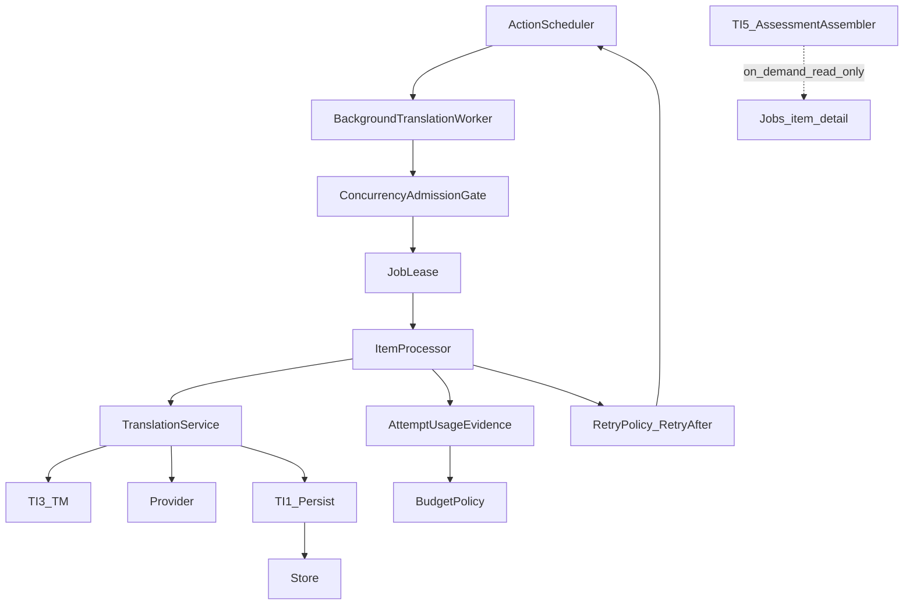

# TI.6 — Jobs scale / safety polish — Implementation Plan

**Status:** Implementation complete — **review-ready** on `feature/ti6-jobs-scale-safety-polish` (not merged)
**Milestone:** TI.6 — Jobs scale / safety polish (TIQ program)
**Kind:** Milestone implementation plan (authoritative on `main` for planning; implementation on feature branch)
**Parent:** [TIQ_PARENT_IMPLEMENTATION_PLAN.md](TIQ_PARENT_IMPLEMENTATION_PLAN.md)
**Prerequisites:** TQ.0 **Complete**; TI.1 **Complete**; TI.2 **Complete**; TI.3 **Complete**; TI.4 **Complete**; TI.5 **Complete**
**Official pack (immutable):** `tests/quality/baselines/baseline-v1.1.0/` · C1.0 · H1.0; additive packs unchanged by TI.6
**Schema:** Migrator `TARGET` = **6** (unchanged)
**ADR:** **No new ADR** — ADR-0011 remains Jobs SoT; ADR-0015 TM write-back unchanged; ADR-0019 assessment read-only unchanged
**Planning branch:** `docs/ti6-jobs-scale-safety-polish-plan`
**Independent review (planning):** **PASS** (2026-08-10)
**Freeze merge:** `c6b4564032bbd3d6e402c1564906077b27eb1fcc`
**Implementation branch:** `feature/ti6-jobs-scale-safety-polish`
**Validation log:** [TI6_JOBS_SCALE_SAFETY_POLISH_VALIDATION_LOG.md](TI6_JOBS_SCALE_SAFETY_POLISH_VALIDATION_LOG.md)
**Implementation merge:** 
**Reviewed feature HEAD:** 
**Next:** TI.7 **planning only**. Do **not** start TI.7 implementation until its plan is independently reviewed and frozen on .

**Related (unchanged ownership):** [ADR-0011](../adr/0011-resumable-job-pipeline.md), [ADR-0015](../adr/0015-review-workflow-and-tm-approval-policy.md), [ADR-0019](../adr/0019-evidence-based-risk-assessment.md), [ADR-0010](../adr/0010-provider-agnostic-interface.md), [ADR-0009](../adr/0009-translation-memory-table.md); [BACKGROUND_TRANSLATION_JOBS_IMPLEMENTATION_PLAN.md](BACKGROUND_TRANSLATION_JOBS_IMPLEMENTATION_PLAN.md); TI.1–TI.5 plans; TI.7 publication later.

**Operational success:** Background Jobs run at WooCommerce-meaningful scale with **truthful token/request budgets**, **Retry-After-honoring backoff**, and **identical-segment reuse via TI.3 TM** that is operationally visible and budget-honest — without a second translator, second queue, publication policy, or TARGET bump.

**Hard boundary:** TI.6 is Jobs **scale / safety polish** on the existing ADR-0011 pipeline. It is not TI.7 auto-publication, not Jobs redesign, not a second TM/QA/assessment engine, and not exactly-once provider billing.

---

## 1. Executive summary

The TIQ parent freezes TI.6 as **Jobs scale / safety polish** with Role:

> **Token budgets, Retry-After, identical-segment reuse via TM**

([parent §9](TIQ_PARENT_IMPLEMENTATION_PLAN.md))

Jobs already orchestrate through:

```text
Action Scheduler (aiml_run_job / aiml_jobs_sweep)
  → BackgroundTranslationWorker
  → BackgroundTranslationItemProcessor
  → TranslationService (TI.2 context, TI.3 TM, provider, TI.1 persist)
  → Store
```

TI.1–TI.5 already sit on that shared brain. Gaps vs the parent Role:

| Pillar | Today | TI.6 |
|---|---|---|
| Token budgets | Counters exist; every completion records **1 request / 0 tokens**; TM hits charged as provider requests | Carry **attempt usage evidence** from TM/provider path; BudgetPolicy consumes evidence |
| Retry-After | Policy honors hint; OpenAI transport never supplies it | Parse headers → error metadata → delayed AS wake |
| Identical-segment via TM | TI.3 exact reuse on shared path; Jobs metrics blind; budget lies | Worker-path proof + TM vs provider metrics + zero-charge TM reuse |

Supporting safety (admitted only as necessary for the Role):

- **One canonical site concurrency admission gate** (`MAX_CONCURRENT_RUNNING = 20`)
- Terminal `retry-failed` repair (BACKGROUND §14 intent)
- Resume → AS wake
- Honest crash-after-Store-write guarantee (**Outcome B**)
- TI.5 on-demand Jobs assessment surfacing (RA19) without lifecycle mutation
- Scale + failure-injection proof



---

## 2. Authoritative parent contract

| Axis | Frozen meaning |
|---|---|
| **Official name** | Jobs scale / safety polish |
| **Objective / Role** | Token budgets, Retry-After, identical-segment reuse via TM |
| **Size / risk / ADR likely** | M / Medium / **No** |
| **Dependencies** | TI.5 Complete; this plan Architecture Frozen on `main` before coding |
| **Inputs** | Existing `aiml_jobs` / `aiml_job_items`; TranslationService + TI.3 `TMGenerationOutcome`; provider transport; TI.5 `AssessmentAssembler` `R1.0` |
| **Outputs** | Truthful budgets; Retry-After delays; TM operational metrics; concurrency gate; safe retry/resume; thin Jobs assessment surfacing |
| **Quality gate** | Pillar proofs + concurrency/usage/crash honesty + scale/failure-injection + TI.1–TI.5/TQ.0 regression; no publication |
| **Feeds** | TI.7 (Jobs reliability + TI.5 assessment); does **not** implement TI.7 |
| **TI.5** | RA19 Jobs surfacing Deferred → TI.6; no assessment→Jobs status mutation |
| **Must not own** | Publication; review redesign; second queue/translator/TM/QA/assessment; TARGET/schema; site billing |

**Discrepancy vs vague “ops polish”:** Parent Role is pillar-specific. Historical B.8 batching that is **not** via TM is **Deferred**.

---

## 3. Repository baseline (planning)

| Check | Value |
|---|---|
| Planning baseline HEAD | `cd1a96eb2139bfac2c4dc8bb12605f079c25b2bb` |
| Branch at authoring | `main` clean, `main == origin/main` |
| TARGET | **6** |
| TQ.0–TI.5 | Complete |
| TI.6 / TI.7 implementation | Not started |

---

## 4. Current Jobs architecture (evidence)

| Piece | Path / behavior |
|---|---|
| Job aggregate | [`BackgroundTranslationJobRepository`](../../src/Jobs/BackgroundTranslationJobRepository.php) / [`BackgroundTranslationJobService`](../../src/Jobs/BackgroundTranslationJobService.php) |
| Items | [`BackgroundTranslationItemRepository`](../../src/Jobs/BackgroundTranslationItemRepository.php) |
| Worker | [`BackgroundTranslationWorker`](../../src/Jobs/BackgroundTranslationWorker.php) — `MAX_ITEMS_PER_WAKE = 10` |
| Domain boundary | [`BackgroundTranslationItemProcessor`](../../src/Jobs/BackgroundTranslationItemProcessor.php) → `TranslationService::translate_segment` |
| AS | [`BackgroundTranslationScheduler`](../../src/Jobs/BackgroundTranslationScheduler.php) — `aiml_run_job`, `aiml_jobs_sweep`; **create does not auto-wake** |
| Lease / claim | [`JobLeaseService`](../../src/Jobs/JobLeaseService.php); item `claim_next` |
| Bounds | [`JobBounds`](../../src/Jobs/JobBounds.php) — `MAX_CONCURRENT_RUNNING = 20` **declared, not enforced** |
| Budget | [`BackgroundTranslationBudgetPolicy`](../../src/Jobs/BackgroundTranslationBudgetPolicy.php) — records on **completed** only today |
| Retry | [`BackgroundTranslationRetryPolicy`](../../src/Jobs/BackgroundTranslationRetryPolicy.php) — honors `retry_after` when present |
| Assessment | **None** in `src/Jobs` (TI.5 RA19 Deferred) |

**Flow:** create → materialize items → operator `/run` or CLI → AS wake → lease → claim item → conflict/stale → TranslationService → Store → record item → reconcile/finalize.

---

## 5. State machine decision

**Retain** existing job/item/requested-action catalogs ([`JobStatuses`](../../src/Jobs/JobStatuses.php), [`ItemStatuses`](../../src/Jobs/ItemStatuses.php), [`RequestedActions`](../../src/Jobs/RequestedActions.php)).

**No new statuses.**

**Repair only:** operator `retry-failed` must work for terminal `failed` and `completed_with_errors` (BACKGROUND §14; today rejected by `is_terminal` early return while `FAILED→QUEUED` is dead code). Reset eligible `failed` items → `queued` (preserve `last_error_*`), transition job → `queued`, clear finished markers as needed, **enqueue wake**.

**Transition-policy exceptions (explicit):** [`JobTransitionPolicy`](../../src/Jobs/JobTransitionPolicy.php) today treats all terminals as non-transitionable before any `FAILED→QUEUED` branch, and does **not** list `completed_with_errors→queued`. TI.6 must admit **operator-only** exceptions:

| From | To | When |
|---|---|---|
| `failed` | `queued` | `retry-failed` only |
| `completed_with_errors` | `queued` | `retry-failed` only |

This is an intentional exception to BACKGROUND “terminal immutable” for **operator requeue**, not a silent general reopen of terminals. Auto-finalize and cancel remain terminal.

---

## 6. Failure taxonomy

| Family | Examples | Retryable? |
|---|---|---|
| Transport / network | `http_request_failed`, `network` | Yes |
| Provider 5xx | HTTP 5xx / `provider_5xx` | Yes |
| Rate limit | HTTP 429 / `rate_limit` / `aiml_rate_limited`; today OpenAI often emits `aiml_ai_http_error` + HTTP `status` only — classify via status backup and align codes in TI6.2 | Yes (+ Retry-After) |
| Lease contention | `lease_contention`, `job_lease_claim_failed` | Yes |
| TI.1 structural | `empty_target`, placeholder/HTML/URL/forbidden, `aiml_ai_invalid_response` | Terminal |
| Validation / config | `invalid_language`, `unsupported_provider`, `validation` | Terminal |
| Conflict / stale / skip | `stale_source`, `skipped_conflict`, review lock | Terminal item outcome |
| Budget / provider unavailable | orchestration pause | Terminal class for pause |
| Cancel | `cancelled` | Terminal |
| Unknown | default | **Terminal** (fail closed) |

Align provider transport codes so 429 surfaces as rate-limit family where practical; HTTP status classification remains backup.

---

## 7. Retry taxonomy

| Kind | Rule |
|---|---|
| **Automatic retry** | Retryable class; `attempt_count < 5`; item → `retry_wait`; delayed AS wake |
| **Backoff** | Exp base 30s, max 900s, jitter; `delay = min(max(exp+jitter, retry_after), 900)` |
| **Manual requeue** | Operator `retry-failed` on eligible terminal/non-terminal jobs; resets `failed` → `queued`; does not bypass conflict/stale/TI.1 |
| **No infinite loop** | Attempt counter increments on claim; exhaustion → `failed` |
| **Assessment** | Never drives retry or failure |

---

## 8. Idempotency model

| Mechanism | Role |
|---|---|
| Create idempotency key | Dedup create |
| `active_lock_key` | One active job per object+language |
| Job lease | Duplicate AS wakes no-op |
| Item `claim_next` | Conditional status transition |
| Store upsert | Persistence-safe replay |

**Exactly-once provider execution is not claimed** (see §18).

---

## 9. Canonical concurrency admission gate (Refinement 1)

### 9.1 Authority

Freeze **one** service-level policy, e.g. `BackgroundTranslationConcurrencyPolicy` (name may vary), owned by Jobs domain — **not** the worker lease, **not** AS, **not** duplicated ifs in REST/CLI.

```text
BackgroundTranslationConcurrencyPolicy::admit_running( ?int $excluding_job_id = null ): true|WP_Error
```

All entry paths that intend to move work into **site-active running** must call this gate **before** any partial transition:

| Entry | Must call gate |
|---|---|
| REST `/jobs/{id}/run` | Yes (before enqueue / sync run) |
| CLI `jobs run` | Yes |
| Resume (when it enqueues wake) | Yes before enqueue |
| `retry-failed` (when it enqueues wake) | Yes before enqueue |
| Scheduler / worker wake admission | Yes at start of `Worker::run` **before** lease claim that transitions job → `running` |
| Delayed Retry-After re-wake | Yes (same worker admission) |

Lease/item claim remain **duplicate-execution** safety only — not the site-cap authority.

### 9.2 What counts toward the cap

| Counts toward `MAX_CONCURRENT_RUNNING` (20)? | Status |
|---|---|
| **Yes** | Job `status = running` |
| **No** | `queued`, `paused`, `retry_wait`, all terminal statuses |

**Rationale:** BACKGROUND plan §5 “Max concurrent **running** jobs”; `retry_wait` is backoff, not active provider work. A job in `retry_wait` must pass the gate again when a wake would move it to `running`.

### 9.3 Atomic / race behavior

Without new schema/TARGET:

1. Gate performs a **single authoritative count** of jobs with `status = running` (repository method).
2. Admission is granted only if `count < 20` (or `< 20` excluding self when already `running` for heartbeat/continuation).
3. Prefer **atomic compare**: conditional transition/`SELECT … FOR UPDATE` in one DB transaction with the status flip to `running`, **or** equivalent repository primitive that cannot admit two jobs past 20 under concurrent PHP workers.
4. If saturated: return `WP_Error` code **`concurrency_limit_exceeded`** (stable); **no** status change, **no** AS enqueue, **no** lease claim for a new running admission.
5. Already-`running` holder continuing the same leased wake is not a new admission (exclude self / continuation path).

**Deterministic tests required:** two concurrent admissions at the boundary (count = 19 and count = 20) — exactly one success when one slot remains; both fail when full; no 21st `running` row.

### 9.4 Failure semantics

| Code | HTTP (REST) | Behavior |
|---|---|---|
| `concurrency_limit_exceeded` | **409** (conflict; operator may retry later) | Reject; job stays prior status |

No second queue. No distributed lock product.

---

## 10. Provider usage evidence contract (Refinement 2)

### 10.1 Principle

**Usage is attempt evidence from the translation/provider path — not inference from final item status.**

Do **not** infer requests from:

- item `completed`
- “one segment = one request”
- success/failure alone

### 10.2 Bounded integer fields

Carry on the Jobs orchestration DTO (evolve [`ItemResult`](../../src/Jobs/ItemResult.php); align with [`ProviderResult`](../../src/Translation/AI/ProviderResult.php)):

| Field | Meaning |
|---|---|
| `provider_requests` | Integer provider HTTP/call units actually performed for this attempt |
| `input_tokens` | Provider-reported input tokens when known; else 0 with availability flag |
| `output_tokens` | Provider-reported output tokens when known; else 0 with availability flag |
| `usage_known` | Boolean (or equivalent): whether provider usage evidence is known for this attempt |

Legacy `usage_requests` / `usage_tokens` may map as: requests ← `provider_requests`; tokens ← `input_tokens + output_tokens` when known.

### 10.3 Hard semantics

| Path | `provider_requests` | `input_tokens` / `output_tokens` | `usage_known` |
|---|---|---|---|
| **TM `DIRECT_REUSE`** (`tm_direct_reuse`) | **0** | **0 / 0** | **true** (known zero) |
| **Provider generation success** | Actual call count (typically 1) | From `ProviderResult` when present | **true** when provider reported usage; tokens may be 0 if provider omitted |
| **Provider attempt failure** after a real call | **Do not erase** known request usage merely because item did not complete | Tokens if known; else 0 | **true** if request occurred; token fields may be unknown |
| **Skip / conflict / stale / no provider** | **0** | **0 / 0** | **true** (known zero) |
| **Failure before provider** (assemble/validate) | **0** | **0 / 0** | **true** |
| **Usage unavailable** on a path that may have called provider | Do **not** fabricate token counts; do not invent requests | 0 | **false** — BudgetPolicy must not pretend precision |

### 10.4 TranslationService seam

Additive, no schema: surface last-attempt usage + `last_tm_outcome()` (already exists) so ItemProcessor can populate evidence after `translate_segment` without a second translator.

### 10.5 BudgetPolicy

[`BackgroundTranslationBudgetPolicy`](../../src/Jobs/BackgroundTranslationBudgetPolicy.php) **consumes usage evidence** on each attempt that has `usage_known` (including failed attempts with known requests) — **not** only on item `completed`.

**Current defect (must fix in TI6.1):** Worker records usage only when item status is `completed`, and `record_usage` coerces `requests <= 0` → **1**. Combined with `ItemResult::completed()` defaulting to 0/0, **every completion including TM `DIRECT_REUSE` is charged as one provider request**. TI6.1 must:

1. stop inferring requests from completion;
2. pass known-zero TM evidence through without 0→1 coercion when `usage_known === true` and `provider_requests === 0`;
3. retain fail-safe coercion **only** when usage is unknown (`usage_known === false`) and policy requires a conservative charge — document that path; prefer not charging when skip/TM known-zero.

| Rule | Behavior |
|---|---|
| TM zero usage (`usage_known`, requests=0) | Does **not** increment request/token budgets |
| Known provider requests | Atomic increment |
| Hard limit | Stop before next claim (`budget_exceeded` pause) |
| Never discard persisted success solely for estimate overrun | Preserve BACKGROUND §13 |
| No billing / currency / site-wide spend product | Deferred |

Preflight may keep integer limits; remove naive “item_count > budget_max_tokens” as a pretend token estimate or replace with request-oriented preflight only.

---

## 11. Action Scheduler ownership

Preserve AS as sole trigger. Group `aiml-jobs`. Duplicate callbacks no-op via lease. TI.6 may schedule delayed wakes for Retry-After. **No parallel queue.**

Create **does not** auto-wake (preserve `aiml_run_translation_jobs` capability gate). **Resume** and **retry-failed** **do** enqueue wake after successful gate.

---

## 12. TranslationService boundary

Mandatory:

`Jobs → ItemProcessor → TranslationService → TI.2 / TI.3 / provider → TI.1 → Store`

Forbidden: JobTranslationService; Jobs-specific prompt/context/TM/QA/assessment engines; worker TM write-back (ADR-0015 / ADR-0011).

---

## 13. TI.5 assessment boundary

| Decision | Frozen |
|---|---|
| Surfacing | **On-demand** recompute via [`AssessmentAssembler`](../../src/Translation/Assessment/AssessmentAssembler.php) on job **item detail** (REST/CLI); optional Workspace link |
| Persist assessment | **No** |
| Mutate job/item status from category | **No** (JO17 **Unsupported**) |
| Compute on every success | **No** |
| Job success meaning | Translation/persistence contract completed — **not** `structurally_clean` |

`review_recommended` / `needs_review` must not become item `failed`.

---

## 14. TI.7 publication boundary

TI.6 implements **no** publication decision, auto-publish, review auto-approval, threshold publishing, or language publication mutation.

---

## 15. JO candidate matrix

| ID | Candidate | Disposition | Notes |
|----|-----------|-------------|-------|
| JO1 | Failure taxonomy | **Supported** | Align codes; document |
| JO2 | Retryability classification | **Supported** | Preserve + rate-limit wiring |
| JO3 | Atomic item claiming | **Partially Supported** | Exists; unchanged role |
| JO4 | Duplicate execution protection | **Partially Supported** | Lease/idempotency; prove |
| JO5 | Crash/idempotency recovery | **Partially Supported** | Outcome B (§18); metrics/tests |
| JO6 | Bounded concurrency | **Supported** | Canonical gate §9 |
| JO7 | Provider-capacity bounds | **Partially Supported** | Retry-After + gate + budgets |
| JO8 | Item-level manual retry | **Supported** | Via retry-failed eligibility |
| JO9 | Bulk retry eligible failures | **Supported** | Terminal repair |
| JO10 | Job cancellation | **Partially Supported** | Exists |
| JO11 | Pause/resume | **Partially Supported** | Resume enqueues wake |
| JO12 | Stuck-item recovery | **Partially Supported** | Sweep exists |
| JO13 | Progress accuracy | **Partially Supported** | Reconciler regression |
| JO14 | Operational metrics | **Supported** | Diagnostics counters |
| JO15 | TI.3 TM operational metrics | **Supported** | TM vs provider |
| JO16 | TI.5 assessment surfacing | **Supported** | On-demand detail |
| JO17 | Assessment-driven status mutation | **Unsupported** | Hard |
| JO18 | Operator failure detail | **Supported** | Bounded |
| JO19 | CLI recovery/inspection | **Partially Supported** | Extend existing |
| JO20 | Admin Jobs polish | **Partially Supported** | Budget + assessment + retry UX only |
| JO21 | AS health/cooperation | **Partially Supported** | Retain + delayed wakes |
| JO22 | Large-job performance proof | **Supported** | Fake provider |
| JO23 | Cleanup/retention | **Deferred** | 30/90 exists |
| JO24 | Multi-job fairness | **Deferred** | — |

**Additional explicit Deferred (not JO-numbered):**

| Item | Disposition |
|---|---|
| Non-TM intra-job identical coalescing | **Deferred** (outside “via TM”) |
| Site-wide daily spend / billing | **Deferred** |
| Create auto-wake | **Deferred** (capability gate) |
| Checkpoint writer activation | **Deferred** |
| Exactly-once provider ledger / new tables | **Unsupported** for TI.6 |

---

## 16. Operator controls

- REST/CLI/UI: budgets truthful; concurrency rejection visible
- `retry-failed` on `failed` / `completed_with_errors`
- Cancel/pause unchanged semantics
- Resume → concurrency gate → enqueue
- Item detail: on-demand assessment category + Workspace link
- Diagnostics: TM direct reuse, provider calls, tokens, retries, Retry-After honors, concurrency rejects, duplicate-provider-spend exposures

---

## 17. Progress / metrics

Keep reconciled item-derived counters. Extend diagnostics option counters (fixed keyset):

- `tm_direct_reuse`
- `provider_calls` / `provider_requests`
- `provider_input_tokens` / `provider_output_tokens` (or combined)
- `concurrency_rejects`
- `retry_after_honors`
- `crash_recovery_provider_repeat_risk` (or equivalent) for Outcome B exposure

No separate telemetry platform.

---

## 18. Crash-after-Store-write guarantee (Refinement 3)

### 18.1 Scenario

```text
provider generates valid result
→ TI.1 passes
→ Store write succeeds
→ worker/process crashes before item completion recorded
→ lease expires → reset_running_to_queued
→ item retried
```

### 18.2 Evidence from current contracts

[`BackgroundTranslationItemProcessor::evaluate_conflict`](../../src/Jobs/BackgroundTranslationItemProcessor.php):

- After successful persist, Store row is typically `machine_translated` with new `translation_hash`.
- Job types that **disallow** retranslate (`translate_missing`, `bulk_translate`): retry → **`skipped_conflict`** — **no** second provider call, but item is **not** marked `completed`.
- Job types that **allow** retranslate (`translate_selected`, `retranslate_stale`): if captured translation hash differs → skip; if captured was empty/missing at create → **`translate_segment` may run again** → **provider may repeat**.
- There is **no** durable attempt ledger proving “this item attempt already paid for this persist.”
- Store upsert + conflict/review gates make **persistence** safe against corrupt double-write in normal paths; they do **not** prove exactly-once provider spend.

### 18.3 Frozen outcome

**Outcome B — PERSISTENCE-SAFE BUT PROVIDER MAY REPEAT**

| Claim | Verdict |
|---|---|
| Persistence remains safe (no corrupt duplicate Store identity) | **Yes** under existing upsert/conflict policy |
| Retry can always complete item as success without provider | **No** (not proven; often `skipped_conflict` instead) |
| Exactly-once provider execution | **Not claimed** |
| New attempt ledger / schema for exactly-once | **Forbidden** in TI.6 |

### 18.4 TI.6 obligations under Outcome B

1. Document Outcome B in ops runbook + plan.
2. Add **failure-injection** test for crash-after-Store-write across job types.
3. Add **operational metric** when a recovery path invokes provider again for a segment whose Store already holds MT for the same `source_hash` (duplicate-spend exposure) — best-effort, bounded.
4. Do **not** advertise exactly-once.

Optional future (out of TI.6 unless cheap and schema-free): soft “already current” completion — **not** required to freeze; must not silently become Outcome A without proof.

---

## 19. Scale / performance

| Workload | Gate |
|---|---|
| 100 items | Single job; fake provider; bounded create/progress |
| 500 items | Max single-job (`MAX_ITEMS_PER_JOB`) |
| 1000 items | ≥2 jobs; list/progress/claim costs documented |

Network-free. Scripted/fake provider. No live OpenAI in CI.

---

## 20. Privacy / security

No prompts, API keys, raw provider bodies, or private order payloads in job tables/diagnostics. Existing capabilities: `aiml_view_translation_jobs`, `aiml_manage_translation_jobs`, `aiml_run_translation_jobs`, `aiml_cancel_translation_jobs`. Assessment payloads bounded like Workspace.

---

## 21. Persistence / schema

**TARGET = 6. No schema bump.** Budget columns already on `aiml_jobs`. Usage evidence is in-process → existing integer counters. Assessment not persisted.

Schema need → **STOP** / architecture review.

---

## 22. ADR assessment

**No new ADR.** Enforcing documented `MAX_CONCURRENT_RUNNING`, usage plumbing, and Retry-After parsing do not create a new durable lease/state contract beyond ADR-0011. If implementation invents a new lease table or public breaking API → STOP and ADR.

---

## 23. Work packages TI6.0–TI6.8

### TI6.0 — Baseline / operational evidence lock

| | |
|---|---|
| **Objective** | Lock pillar gaps, crash Outcome B, concurrency gate contract, usage contract |
| **Dependencies** | None |
| **Code scope** | Docs/tests inventory only during planning; implementation starts later |
| **Tests** | N/A at planning; implementation verifies inventory |
| **Evidence** | This plan §§4–18 |
| **Rollback** | N/A |
| **STOP** | Second queue / TARGET / publication discovered as required |
| **Completion** | Implementers can execute without rediscovering architecture |

### TI6.1 — Provider usage evidence + token budget truthfulness

| | |
|---|---|
| **Objective** | Plumb attempt usage; TM 0/0/0; BudgetPolicy consumes evidence including failed known attempts |
| **Dependencies** | TI6.0 |
| **Code** | `TranslationService` usage surface; `ItemProcessor`; `ItemResult`; `BudgetPolicy`; Worker recording path; REST/UI budget fields |
| **Tests** | Unit mapping; TM reuse 0 requests; provider success tokens; failed-attempt known request; skip zero; budget hard-stop |
| **Evidence** | Counters match fixtures |
| **Rollback** | Revert plumbing |
| **STOP** | Billing platform; fabricate tokens when unknown |
| **Completion** | ACs for usage + budget green |

### TI6.2 — Retry-After end-to-end

| | |
|---|---|
| **Objective** | OpenAI (and shared transport mapping) supplies `retry_after` → ItemResult → delayed AS wake; cap 900s |
| **Dependencies** | TI6.0 |
| **Code** | `OpenAIProvider` header parse; error data; RetryPolicy/Worker (honor path exists) |
| **Tests** | Unit header parse; integration 429 → delayed enqueue ≥ hint (capped) |
| **STOP** | Provider-specific worker pipeline |
| **Completion** | Retry-After ACs green |

### TI6.3 — Identical-segment TM reuse at Jobs scale

| | |
|---|---|
| **Objective** | Full worker-path TM short-circuit proof; JO15 metrics; budget honesty from TI6.1 |
| **Dependencies** | TI6.1 |
| **Code** | Diagnostics; parity/integration via Worker/ItemProcessor; no Jobs TM engine |
| **Tests** | Jobs worker TM direct reuse; metrics increment; zero budget charge |
| **STOP** | Non-TM coalescing; worker TM write |
| **Completion** | TM pillar ACs green |

### TI6.4 — Concurrency gate + retry/resume + crash honesty

| | |
|---|---|
| **Objective** | Canonical concurrency policy; all entry paths; terminal retry-failed; resume wake; Outcome B tests/metrics |
| **Dependencies** | TI6.0 |
| **Code** | New policy class; JobService/Worker/Scheduler/Controller/CLI; diagnostics |
| **Tests** | Cap boundary races; saturated reject no partial state; retry-failed terminal; resume enqueue; crash-after-Store injection |
| **STOP** | New queue; new schema for exactly-once; claiming exactly-once |
| **Completion** | Safety ACs green |

### TI6.5 — TI.5 assessment + operator surfacing

| | |
|---|---|
| **Objective** | On-demand assessment on item detail; budget UI; failure detail; no status mutation |
| **Dependencies** | TI6.1, TI6.4 |
| **Code** | Jobs ViewModel/REST/CLI/UI → `AssessmentAssembler` |
| **Tests** | Assessment present on detail; category does not change item status; caps |
| **STOP** | JO17; persist assessment; publish hooks |
| **Completion** | Surfacing ACs green |

### TI6.6 — Scale / performance hardening

| | |
|---|---|
| **Objective** | 100 / 500 / multi-job 1000 fake-provider proofs |
| **Dependencies** | TI6.1–TI6.4 |
| **Tests** | Creation, query, memory, progress, claim, duplicate prevention |
| **STOP** | Live provider CI; silent MAX_ITEMS raise |
| **Completion** | Scale ACs + recorded bounds |

### TI6.7 — Failure-injection / live-like acceptance

| | |
|---|---|
| **Objective** | Inject timeout, 429/5xx, invalid response, TI.1 reject, Store conflict, approved lock, stale, duplicate wake, crash-after-Store, usage-on-failure |
| **Dependencies** | TI6.2–TI6.5 |
| **Completion** | All injected outcomes safe/explainable |

### TI6.8 — Documentation closure

| | |
|---|---|
| **Objective** | Validation log; update TIQ parent / PRODUCT_PRIORITIES / ops runbook; next = TI.7 **planning only** |
| **Dependencies** | TI6.7 PASS |
| **STOP** | Starting TI.7 implementation in this WP |
| **Completion** | TI.6 Complete on `main`; TI.7 not started |

---

## 24. Acceptance criteria

1. Parent official name is **Jobs scale / safety polish**.
2. Parent Role pillars are token budgets, Retry-After, identical-segment reuse via TM.
3. JO1 Supported — failure taxonomy documented and aligned.
4. JO2 Supported — retryability classification preserved and tested.
5. JO3 Partially Supported — item claim remains atomic; not replaced by site-cap gate.
6. JO4 Partially Supported — duplicate AS wake is no-op via lease.
7. JO5 Partially Supported — crash-after-Store Outcome B documented and tested.
8. JO6 Supported — `MAX_CONCURRENT_RUNNING = 20` enforced.
9. JO7 Partially Supported — capacity via Retry-After + gate + budgets only.
10. JO8 Supported — eligible failed items can be manually requeued.
11. JO9 Supported — bulk retry-failed works including terminal jobs.
12. JO10 Partially Supported — cancel semantics unchanged and regression-tested.
13. JO11 Partially Supported — pause unchanged; resume enqueues wake after gate.
14. JO12 Partially Supported — stale lease sweep still recovers running items.
15. JO13 Partially Supported — reconciled progress matches item counts.
16. JO14 Supported — operational diagnostics counters extended.
17. JO15 Supported — TM direct reuse vs provider call metrics exist.
18. JO16 Supported — on-demand TI.5 assessment on job item detail.
19. JO17 Unsupported — assessment never mutates job/item success/failure.
20. JO18 Supported — bounded operator-visible failure codes/messages.
21. JO19 Partially Supported — CLI can inspect/run/retry/cancel without new app.
22. JO20 Partially Supported — admin shows budgets/assessment/retry without redesign.
23. JO21 Partially Supported — Action Scheduler remains sole queue trigger.
24. JO22 Supported — scale tests at 100/500/1000-multi-job with fake provider.
25. JO23 Deferred — no new retention policy in TI.6.
26. JO24 Deferred — no multi-job fairness scheduler.
27. Non-TM identical coalescing remains Deferred.
28. Site-wide billing/spend remains Deferred.
29. Create auto-wake remains Deferred.
30. Single Jobs framework: AS → Worker → ItemProcessor → TranslationService.
31. No second translator, TM, QA, or assessment engine.
32. No Action Scheduler replacement / parallel queue.
33. Job/item state catalogs unchanged (no new statuses).
34. Automatic retry distinct from manual requeue.
35. Max attempts 5; exhaustion terminal.
36. Retry-After parsed from provider transport into error/result metadata.
37. Retry-After flows to delayed AS wake.
38. Retry-After delays capped at 900 seconds.
39. Canonical concurrency policy is the sole site-cap authority.
40. REST run, CLI run, resume wake, retry-failed wake, and worker wake admission all use the same gate.
41. Cap counts only jobs with `status = running`.
42. `retry_wait` does **not** count toward the running cap.
43. Saturated admission returns `concurrency_limit_exceeded` with **no** partial status/enqueue/lease side effects.
44. Concurrent boundary tests: one slot left → exactly one admission; zero slots → both rejected; never 21 running.
45. Already-running continuation of the same wake is not double-charged against the cap.
46. Usage evidence includes `provider_requests`, `input_tokens`, `output_tokens` (or documented aliases).
47. TM `DIRECT_REUSE` records `provider_requests = 0` and zero tokens with known usage.
48. Provider generation success records actual provider_requests and provider-reported tokens when available.
49. Provider attempt failure does not silently erase known request usage.
50. Skip/conflict/stale/no-provider paths record zero provider usage.
51. Usage is not inferred merely from item completed/failed status.
52. When usage is unavailable, tokens are not fabricated; `usage_known` (or equivalent) is false.
53. BudgetPolicy increments from usage evidence, including known failed attempts.
54. Budget hard limit pauses before next claim; does not delete already-persisted translations.
55. TM reuse does not consume provider request budget.
56. Crash-after-Store-write is frozen as Outcome B.
57. Plan/tests do **not** claim exactly-once provider execution.
58. No attempt ledger / new table / TARGET bump introduced for exactly-once.
59. Failure-injection covers crash-after-Store-write for representative job types.
60. Operational metric exists for duplicate-provider-spend exposure on recovery (best-effort).
61. `retry-failed` repairs terminal `failed` and `completed_with_errors` per BACKGROUND intent.
62. Manual retry preserves prior error evidence until a new attempt starts.
63. Manual retry cannot bypass conflict, stale, or TI.1 gates.
64. Resume enqueues AS wake after passing concurrency gate.
65. TI.5 assessment on Jobs is read-only/on-demand.
66. Job item success remains translation/persistence success, not assessment readiness.
67. `review_recommended` / `needs_review` do not mark items failed.
68. Workers never write TM (ADR-0015/0011 preserved).
69. TARGET remains 6 throughout TI.6.
70. No publication / auto-publish / TI.7 implementation in TI.6.
71. Normal CI remains network-free (no live OpenAI).
72. TQ.0 deterministic + TI.1–TI.5 regressions remain green.
73. Validation log records PASS with evidence pointers before Complete.
74. After implementation closure, next milestone is TI.7 **planning only**.

**Verified AC count: 74.**

---

## 25. Validation strategy

### Unit
Concurrency policy; usage mapping (TM/provider/skip/failure); Retry-After delay; budget consume-from-evidence; retry-failed transition guards; assessment non-mutation helpers.

### Integration
Duplicate wake; 429 delayed enqueue; TI.1 terminal; approved conflict; stale; TM worker path; provider fake success; usage on failed attempt; terminal retry-failed; resume wake; concurrency saturation; on-demand assessment detail.

### Scale
100 / 500 / 1000-multi-job fake provider.

### Failure-injection
Timeout; 429/5xx; invalid response; TI.1 reject; Store conflict; approved lock; stale; duplicate AS; crash-after-Store; unknown usage path.

### Regression
TI.1–TI.5; TQ.0 harness.

### CI
Network-free.

---

## 26. STOP conditions

STOP/defer if TI.6 requires: second queue; AS replacement; second TranslationService/prompt/TM/QA/assessment; publication; assessment as success authority; new Store; source_hash redesign; vector TM; live-AI CI; TARGET/schema bump without architecture review; attempt ledger solely for exactly-once; non-TM coalescing promotion without parent amendment; TI.7 implementation.

---

## 27. Rollback

Per-WP git revert. AS hook names unchanged. Budget under-count if plumbing reverted is safe when limits unset. Concurrency gate removal returns to unbounded running (pre-TI.6). No data migration.

---

## 28. Expected production components

| Area | Components |
|---|---|
| Concurrency | `BackgroundTranslationConcurrencyPolicy` (canonical); Job repository count; wire JobService/Worker/REST/CLI |
| Usage | TranslationService last-usage surface; ItemResult fields; ItemProcessor; Worker→BudgetPolicy |
| Retry-After | OpenAIProvider header parse; error metadata; existing RetryPolicy/Worker delay |
| TM metrics | Diagnostics counters; worker-path tests |
| Assessment | Thin Jobs detail → AssessmentAssembler |
| UI | Budget fields; concurrency error; assessment badge; retry on terminal |
| Tests | Unit/integration/scale/failure-injection under `tests/` |
| Docs | This plan; validation log; ops runbook; TIQ/PRODUCT_PRIORITIES at closure |

---

## 29. Roadmap updates

**At planning freeze (this task):** pointer that TI.6 plan is Architecture Frozen (planning); implementation not started.

**At implementation Complete (later):** TIQ parent TI.6 Complete; PRODUCT_PRIORITIES next = TI.7 planning; B.8 note under TI.6 Supported set (TM reuse + cost controls; non-TM batching still Deferred).

---

## 30. Freeze recommendation

**TI.6 FREEZE RECOMMENDATION: STATE A — FREEZE**

---

## 31. Exact next action after this planning freeze

Create `feature/ti6-jobs-scale-safety-polish` from the frozen `main` baseline and implement TI6.0–TI6.8 strictly according to this document.

**Do not create that branch in the planning-freeze task.**

---

## Document control

| Item | Value |
|---|---|
| Canonical path | `docs/plans/TI6_JOBS_SCALE_SAFETY_POLISH_IMPLEMENTATION_PLAN.md` |
| Kind | Milestone implementation plan (planning freeze) |
| Parent | [TIQ_PARENT_IMPLEMENTATION_PLAN.md](TIQ_PARENT_IMPLEMENTATION_PLAN.md) |
| Tag for planning freeze | **Not required** |
| Revision | 1.0 — 2026-08-10 — Architecture Frozen on `main` (merge `c6b456403…`) |
