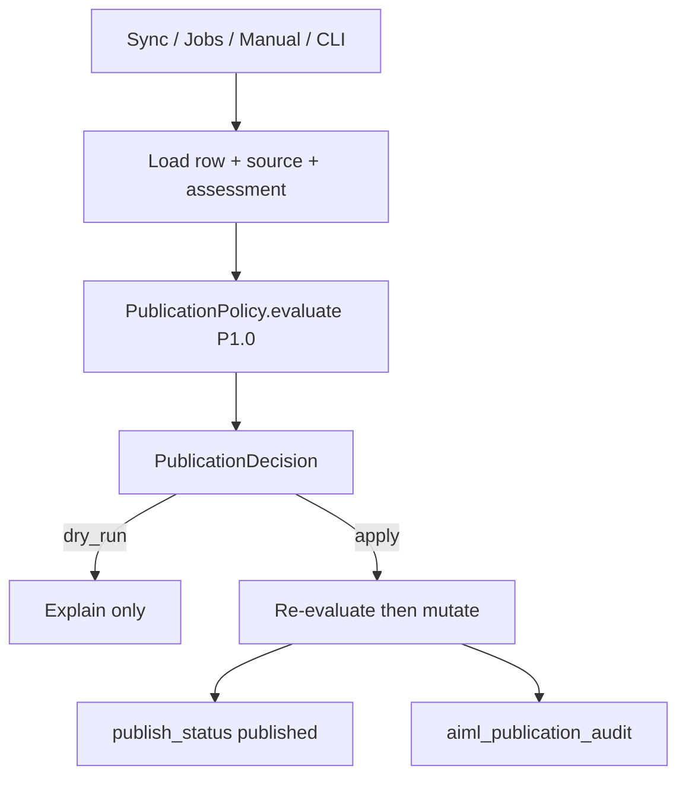

# TI.7 — Controlled Auto-Publication Policy — Implementation Plan

**Status:** **Implementation complete — ready for independent review** on `feature/ti7-controlled-auto-publication-policy`
**Milestone:** TI.7 — Controlled auto-publication policy (TIQ program)
**Kind:** Milestone implementation plan (authoritative Architecture Frozen on `main`)
**Parent:** [TIQ_PARENT_IMPLEMENTATION_PLAN.md](TIQ_PARENT_IMPLEMENTATION_PLAN.md)
**Prerequisites:** TQ.0 **Complete**; TI.1–TI.6 **Complete**
**Official pack (immutable):** `tests/quality/baselines/baseline-v1.1.0/` — TI.7 must not change generation quality claims
**Schema:** Migrator `TARGET` **7** (additive publication columns; ADR-0020)
**ADR:** [ADR-0020 — Controlled auto-publication and frontend publication gate](../adr/0020-controlled-auto-publication-and-frontend-gate.md) (**Accepted** 2026-08-10)
**Policy version:** `P1.0`
**Assessment consumption:** TI.5 `TranslationAssessment` **R1.0** read-only
**Planning branch:** `docs/ti7-controlled-auto-publication-policy-plan`
**Independent review (planning):** **PASS** (2026-08-10)
**Freeze merge:** `fdf313500764014ebcedd25c99b393c1679ebd3e`
**Implementation branch:** `feature/ti7-controlled-auto-publication-policy`
**Validation log:** [TI7_CONTROLLED_AUTO_PUBLICATION_POLICY_VALIDATION_LOG.md](TI7_CONTROLLED_AUTO_PUBLICATION_POLICY_VALIDATION_LOG.md)
**Next:** Independent implementation review → merge to main → TIQ closure. Do **not** self-merge.

**Related:** [ADR-0008](../adr/0008-language-state-model.md), [ADR-0015](../adr/0015-review-workflow-and-tm-approval-policy.md), [ADR-0019](../adr/0019-evidence-based-risk-assessment.md), [ADR-0011](../adr/0011-resumable-job-pipeline.md); TI.4–TI.6 plans; A.SEO ownership unchanged.

**Operational success:** Operators can opt into a durable segment publication gate and, under explicit closed policy modes, automatically publish translations using TI.5 observable evidence — without LLM confidence, opaque scores, second QA/assessment, Jobs-owned policy, or silent upgrade auto-publish.

**Hard boundary:** TI.7 owns **publication policy and publication state transitions**. It does not redesign translation generation, review workflow vocabulary, TI.5 assessment, TM, glossary, Router, LanguageContext, or A.SEO emitters.

**TI.7 PLANNING FREEZE REVIEW: PASS**

---

## 1. Executive summary

Parent ladder name: **Controlled auto-publication policy** (L / High / ADR yes; last TIQ milestone).

TI.7 answers:

> Under explicitly configured policy, may this translation be automatically published?

TI.5 answers observable risk/readiness. TI.7 **must not** reimplement detectors, invent a second assessment, or use LLM/score authority.

**Repository fact (pre-TI.7):** there is no segment `publish_status`. Public overlay is emergent from language routability + `RENDERABLE_STATUSES` + non-empty text. `review_status` is never consulted on render paths. Therefore TI.7 requires ADR-0020’s third axis + frontend gate — not policy-over-`approved`.

```text
TI.1–TI.4 evidence
        ↓
TI.5 TranslationAssessment R1.0 (read-only)
        ↓
TI.7 PublicationPolicy P1.0 → PublicationDecision
        ↓
PublicationService.apply → publish_status
        ↓
Frontend overlays (when gate enabled)
```

---

## 2. Exact TIQ parent contract

| Axis | Parent text / meaning |
|---|---|
| **Name** | Controlled auto-publication policy |
| **Dependencies** | TI.5 and TI.6; TI.7 last |
| **Gate** | Prior reliability (TI.1–TI.6) demonstrated |
| **Invariant** | No LLM self-confidence % as publication authority |
| **ADR** | Required before TI.7 for controlled auto-publication / frontend gate change |
| **Deferred** | Automatic publication before TI.7 prerequisites |

Parent does not define detailed inputs/outputs; this plan + ADR-0020 supply them.

---

## 3. Repository baseline (planning authoring)

| Check | Value |
|---|---|
| Authoring main | `63b1d20e7efde7eb8124db1e0ff99d9b9b9d95df` |
| TARGET (runtime) | **6** |
| TQ.0–TI.6 | Complete |
| TI.7 implementation | not started |

---

## 4. Current publication architecture (audit)

Three layers today:

1. **Language publication (ADR-0008)** — `disabled` \| `preview` \| `published` on `aiml_languages`. Controls routes and public SEO language set.
2. **WP source visibility** — canonical `post_status` / product visibility. AIML overlays do not re-check post_status; WP hides drafts from anonymous users.
3. **Segment overlay eligibility** — `Store::RENDERABLE_STATUSES` = `machine_translated` \| `manually_edited` \| `reviewed`; plus non-empty text; blocks also require not stale in lookup. **No publish column. No review_status check.**

Workspace `is_published` means source post is `publish` — not translation publication.

---

## 5. Review vs publication

ADR-0015: **Approved ≠ published**; rendering independent of review (until this gate ADR).

ADR-0020: publication is a **third axis**. Approval does not publish. Gate (when enabled) depends on `publish_status`, not `review_status`.

---

## 6. Publication-state decision

| Outcome | Verdict |
|---|---|
| A — existing state enough | **Rejected** |
| B — overload `approved` | **Rejected** (ADR-0015) |
| **C — new durable `publish_status`** | **Required** (ADR-0020) |

Vocabulary: `unpublished` \| `published`.

Columns: `publish_status`, `published_at`, `published_by`.

---

## 7. Schema / TARGET

- Planned: **TARGET 7** additive migration (ADR-0020 authorized)
- Runtime during this docs freeze: **TARGET 6**
- STOP if implementation attempts TARGET bump without Accepted ADR-0020

### Backfill

Existing rows with **non-empty** `translated_text` and `status ∉ {ignored, missing}` → `publish_status=published`.

This matches the **most permissive** pre-TI.7 public path (`Store::translated_value()` / `IntegrationFrontendBridge`), which does **not** require `RENDERABLE_STATUSES`. Block/Elementor remain stricter on provenance; backfill must not regress classic/integration overlays.

New persists → `unpublished` until PublicationService publishes.

---

## 8. Frontend gate architecture

### Compatibility switch vs steady-state truth

| Setting | Default | Meaning |
|---|---|---|
| `segment_publication_gate_enabled` | `false` | Rollout control. **false** = legacy overlay rules (ignore publish_status for visitors). **true** = `publish_status` is canonical segment publication authority. |

**Canonical long-term publication truth (steady-state):** gate **enabled**; `publish_status` alone authorizes segment overlay (with RENDERABLE prerequisites).

The switch does **not** create two permanent equal authorities — it selects whether the new axis is active yet. Intended product steady-state is gate on.

### Authoritative gating seams (implementation must cover all)

| Seam | Path | Notes |
|---|---|---|
| Classic Store read | `Store::translated_value()` | Today: any non-empty non-ignored/missing; Rank Math also calls this |
| Classic Renderer | `Renderer` `the_title` / `the_content` / `get_the_excerpt` | Must not bypass Store eligibility |
| Blocks | `BlockTranslationLookup` (+ `BlockRenderGate` request gates) | Uses `RENDERABLE_STATUSES` + non-stale |
| Elementor | `ElementorOverlayResolver` | Uses `RENDERABLE_STATUSES` |
| **Integration bridge** | **`IntegrationFrontendBridge` resolve** | Today: `Store::get()` + non-empty only — **feeds Woo/Rank Math/Integration API overlays**; mandatory gate consumer |
| Woo / taxonomy / SEO overlays | Via bridge `$resolve` or `translated_value` | Must not introduce a third read path |

**Partial rollout is a STOP condition** (unpublished leak via IntegrationFrontendBridge is the highest risk).

Centralize: e.g. `Store::is_publicly_overlay_eligible( $row )` honoring gate setting + publish_status + shared content prerequisites.

---

## 9. TI.5 consumption

Read-only recompute of R1.0:

- categories: `blocked` \| `needs_review` \| `review_recommended` \| `structurally_clean`
- `evidence_completeness`, `provenance_class`, `review_status`, conflicts, facets

No `publish_decision` on assessment. No second detector engine.

---

## 10. PublicationPolicy + PublicationService



Decision fields (bounded): `policy_version`, `eligible`, `reason_codes`, `assessment_version`, `overall_category`, `mode`, source/stale/review/evidence/provenance/publish_status results. **No score. No LLM confidence. No mutation in evaluate.**

---

## 11. AP1–AP30 dispositions

| ID | Candidate | Disposition |
|---|---|---|
| AP1 | Global automation enable/disable | **Supported** (`manual` mode) |
| AP2 | Canonical PublicationPolicy | **Supported** |
| AP3 | Canonical PublicationService | **Supported** |
| AP4 | TI.5 assessment consumption | **Supported** |
| AP5 | `blocked` always ineligible | **Supported** |
| AP6 | `needs_review` auto-publication | **Unsupported** |
| AP7 | `review_recommended` auto-publication | **Unsupported** |
| AP8 | `structurally_clean` eligibility | **Supported** (necessary, not sufficient) |
| AP9 | Evidence completeness | **Supported** (`complete` for auto) |
| AP10 | Human-approved-only mode | **Supported** (`approved_only`) |
| AP11 | Controlled machine auto mode | **Supported** (`controlled_auto`) |
| AP12 | Provenance policy | **Partially Supported** |
| AP13 | FieldSemantic policy | **Deferred** |
| AP14 | Content-type policy | **Deferred** |
| AP15 | Language-pair policy | **Deferred** |
| AP16 | Source-publication guard | **Supported** |
| AP17 | Publication idempotency | **Supported** |
| AP18 | Dry-run/explain | **Supported** |
| AP19 | Manual publish | **Supported** |
| AP20 | Force-publish hard blocker | **Unsupported** |
| AP21 | Sync trigger | **Supported** |
| AP22 | Jobs trigger | **Supported** |
| AP23 | Audit trail | **Supported** |
| AP24 | CLI controls | **Supported** |
| AP25 | Workspace controls | **Supported** |
| AP26 | Unpublish | **Partially Supported** (manual yes; automatic no) |
| AP27 | Bulk publication | **Deferred** |
| AP28 | Scheduled publication | **Deferred** |
| AP29 | Confidence score | **Unsupported** |
| AP30 | LLM publication judge | **Unsupported** |

Do not widen Deferred items in TI.7.

---

## 12. Safe defaults and modes

| Setting | Default |
|---|---|
| `segment_publication_gate_enabled` | `false` |
| `auto_publication_mode` | `manual` |

Modes:

| Mode | Semantics |
|---|---|
| `manual` | No automatic publication |
| `approved_only` | Auto only if `approved` + all guards |
| `controlled_auto` | Auto without approval if `structurally_clean` + evidence `complete` + provenance/source/stale/review guards |

Upgrade must not auto-publish.

---

## 13. Evidence completeness

Auto paths require `evidence_completeness=complete`.

`partial` / `unavailable` block auto. `not_applicable` ≠ PASS.

Manual publish still blocked by assessment `blocked` (hard). Soft incompleteness may surface as reasons/warnings but hard blockers cannot be forced.

---

## 14. Review-state policy

- `rejected` → blocks auto and manual publish
- `approved_only` → requires `approved` for auto
- `controlled_auto` → non-`rejected` + category/guards
- Soft categories (`needs_review`, `review_recommended`) → **never auto**; manual allowed only if not `blocked` / not `rejected` / other guards

---

## 15. Provenance policy

- `controlled_auto`: block `missing` / `unknown`
- `tm_direct_reuse` ≠ automatic pass
- No TM/LLM confidence

---

## 16. FieldSemantic / content-type

**Deferred.** Global policy only. Reuse TI.2 `FieldSemantic` later if product reopens.

---

## 17. Source-publication guard

Source must be publicly visible class. Never mutate Woo commerce object economics/status via publication.

---

## 18. Staleness and edit invalidation

| Event | Publication effect |
|---|---|
| **Target translation edit** (translated content changes) | **YES** → `publish_status=unpublished`; clear publication metadata |
| **Source change / stale** | **NO** automatic unpublish; `is_stale` blocks **new** publish; report stale published |
| `source_hash` | Unchanged (ADR-0007) |

Do not conflate these cases.

---

## 19–20. Sync and Jobs triggers

Both call the **same** PublicationService after successful persist when mode permits automation.

Callers must not own policy.

---

## 21. Publication failure semantics

Translation success ≠ publication success.

- Jobs item remains completed on translation success
- Record publication skipped/failed separately
- No automatic retry storm; operator retry via Workspace/CLI

---

## 22. Idempotency and concurrency

- Already published → success/no-op
- Re-evaluate immediately before mutate
- Race between sync/Jobs/manual → last write must still satisfy policy on current row

---

## 23. Audit model

`aiml_publication_audit` events: manual publish, automatic publish, skipped, failed, manual unpublish.

Allowlisted metadata only (no bodies).

---

## 24. Settings

`aiml_settings` keys; capability-protected; sanitize; diagnostics Saved vs Effective; no secrets; no hidden activation during migration.

---

## 25. Workspace

Thin UI: publish_status, eligibility/reasons (from Policy explain), manual publish/unpublish. No UI-owned policy.

---

## 26. CLI

Explain / publish / unpublish / status using same Policy/Service.

---

## 27. Diagnostics

Expose gate + mode effective values. No second diagnostics product.

---

## 28. SEO consequences (honest)

| Concern | Owner | Segment unpublished effect |
|---|---|---|
| Language routes / hreflang set / sitemap language inclusion | A.SEO + ADR-0008 | **Unchanged** — language-level |
| Overlay text in document / OG when emitters read translated fields | Existing overlays | Falls back to source segment text when gate on + unpublished |
| Canonical / robots | A.SEO | Unchanged ownership |

TI.7 does **not** claim segment unpublish removes whole-language SEO relationships.

---

## 29. Woo consequences

Translation overlay publication only. No stock/price/catalog visibility/product status/purchasability/inventory/order mutation.

---

## 30. Privacy / security

Bounded reason codes; no prompt/API keys in audit; capability checks on mutate endpoints.

---

## 31. Policy versioning

`P1.0` on decisions. Independent of `R1.0`, `H1.x`, TARGET.

---

## 32. Work packages TI7.0–TI7.8

### TI7.0 — Baseline / publication-contract evidence lock

- **Objective:** Lock pre-TI.7 publication facts and ADR dependency
- **Dependencies:** Frozen main; ADR-0020 Proposed/Accepted path
- **Scope:** docs evidence only (this plan)
- **Tests:** n/a
- **Evidence:** code cites for render seams; ADR-0015/0019/0008
- **Rollback:** n/a
- **STOP:** inventing publish without ADR
- **Done:** evidence locked on frozen plan

### TI7.1 — ADR-0020 + TARGET 7 schema contract

- **Objective:** Accepted ADR; schema contract frozen
- **Dependencies:** TI7.0
- **Scope:** ADR docs; migrator design in plan (no runtime bump in planning)
- **Tests:** n/a at planning; implementation tests later
- **Evidence:** ADR Accepted status
- **Rollback:** revert ADR acceptance docs
- **STOP:** TARGET without ADR
- **Done:** ADR Accepted; plan Architecture Frozen

### TI7.2 — Store publication state + render gate + Policy/Service

- **Objective:** Columns, TARGET 7, backfill, central eligibility, Policy, Service
- **Dependencies:** TI7.1
- **Scope:** `Migrator`, `Schema`, `Store`, render seams listed §8, `PublicationPolicy`, `PublicationService`, `PublicationDecision`
- **Tests:** unit eligibility/idempotency; integ backfill; gate on/off
- **Evidence:** all seams share helper
- **Rollback:** gate default false; columns retained
- **STOP:** partial gate; overload approved
- **Done:** gate + service green

### TI7.3 — Settings / safe defaults

- **Objective:** Gate + mode defaults; sanitize; diagnostics
- **Dependencies:** TI7.2
- **Scope:** `Settings`, SettingsPage diagnostics
- **Tests:** defaults; sanitize; kill via `manual`
- **Evidence:** upgrade does not auto-publish
- **Rollback:** force defaults
- **STOP:** default auto-on
- **Done:** defaults proven

### TI7.4 — Sync + Jobs integration

- **Objective:** Post-success invoke; failure separation
- **Dependencies:** TI7.2–TI7.3
- **Scope:** TranslationService persist tail; Jobs item processor invoke only
- **Tests:** sync/Jobs auto off/on; publication fail ≠ item fail
- **Evidence:** no policy in Jobs
- **Rollback:** mode manual
- **STOP:** Jobs owns policy; conflate failures
- **Done:** both paths share service

### TI7.5 — Workspace / CLI / explain

- **Objective:** Operator surfaces
- **Dependencies:** TI7.2–TI7.3
- **Scope:** Workspace ViewModel/REST additive; Cli commands
- **Tests:** explain parity; capability checks
- **Evidence:** dry-run = Policy
- **Rollback:** hide actions
- **STOP:** UI policy fork
- **Done:** explain/publish/unpublish work

### TI7.6 — False-authority / publication-safety suite

- **Objective:** Mandatory negative tests
- **Dependencies:** TI7.2–TI7.5
- **Scope:** tests only
- **Tests:** see §33 false-authority list
- **Evidence:** CI network-free
- **Rollback:** n/a
- **STOP:** score/LLM creep
- **Done:** suite green

### TI7.7 — SEO / Woo / live-like acceptance

- **Objective:** Prove overlay vs language SEO honesty; Woo non-mutation
- **Dependencies:** TI7.2
- **Scope:** acceptance tests
- **Tests:** gate on unpublished fallback; Woo fields unchanged
- **Evidence:** A.SEO ownership intact
- **Rollback:** gate off
- **STOP:** second SEO pipeline
- **Done:** AC pass

### TI7.8 — TIQ program closure

- **Objective:** Close TIQ after implementation review
- **Dependencies:** TI7.0–TI7.7 Complete
- **Scope:** validation log; parent; PRODUCT_PRIORITIES; release notes
- **Tests:** n/a
- **Evidence:** closure log
- **Rollback:** n/a
- **STOP:** incomplete ACs; false Complete early
- **Done:** TIQ Complete **only** after this WP on main

---

## 33. Acceptance criteria (82)

### Parent / authority (1–12)

1. Official milestone name is Controlled auto-publication policy.
2. Prerequisites are TI.5 and TI.6 Complete; TI.7 is last.
3. No LLM confidence as publication authority.
4. No opaque aggregate quality score as publication authority.
5. No second QA / detector engine for publication.
6. No second assessment core.
7. No translator redesign.
8. No prompt redesign.
9. Consumes TI.5 R1.0 read-only.
10. ADR-0020 Accepted before implementation coding.
11. Frontend gate is in ADR/plan scope.
12. `approved ≠ published` remains true.

### State / schema (13–22)

13. Durable `publish_status` ∈ {unpublished, published} exists after TI.7 implementation.
14. Publication is not overloaded onto `review_status`.
15. TARGET moves 6→7 only under ADR-0020; additive columns only.
16. Migration backfill marks pre-TI.7 publicly overlayable rows `published` (non-empty text; status not ignored/missing).
17. New translation persists default to `unpublished`.
18. `segment_publication_gate_enabled` defaults false.
19. `auto_publication_mode` defaults `manual`.
20. Setting mode to `manual` disables future automation without mass-unpublish.
21. Successful translated-content edit sets `publish_status=unpublished`.
22. Publishing an already-published row is idempotent success/no-op.

### Policy (23–40)

23. Exactly one PublicationPolicy core.
24. Exactly one PublicationService mutator.
25. Evaluate does not mutate; apply re-evaluates before write.
26. Decisions carry `policy_version=P1.0` (or successor).
27. Decisions expose machine-readable reason codes.
28. Category `blocked` never auto-publishes.
29. Category `needs_review` never auto-publishes.
30. Category `review_recommended` never auto-publishes.
31. `structurally_clean` alone is insufficient for auto-publish.
32. Auto paths require evidence_completeness=`complete`.
33. `not_applicable` / unavailable evidence does not count as PASS.
34. Modes are exactly `manual` \| `approved_only` \| `controlled_auto`.
35. `controlled_auto` blocks provenance `missing`/`unknown`.
36. TM direct reuse is not an automatic publish pass.
37. `rejected` blocks auto and manual publish.
38. Non-public source blocks publish.
39. `is_stale` blocks new publish.
40. FieldSemantic/content-type/language-pair matrices remain Deferred.

### Triggers / safety (41–50)

41. Sync success uses canonical PublicationService when automation eligible.
42. Jobs success uses the same PublicationService.
43. Publication failure does not mark Jobs translation item failed.
44. Jobs/REST/UI do not own policy rules.
45. Apply rechecks eligibility immediately before mutation.
46. Concurrent publish paths remain idempotent / race-safe by recheck.
47. Dry-run/explain is non-mutating and uses the same Policy.
48. Manual publish is Supported under guards.
49. Force-publish of hard `blocked` is Unsupported.
50. Automatic unpublish is Deferred; manual unpublish Supported.

### Surfaces (51–60)

51. Workspace surfaces publish_status and eligibility reasons.
52. Manual publish/unpublish are capability-protected.
53. CLI can explain eligibility.
54. CLI can publish/unpublish (guarded).
55. Publication audit events fire for manual/auto/skip/fail/unpublish.
56. Audit payloads contain no translation/prompt bodies.
57. Diagnostics expose gate and mode Saved vs Effective.
58. Settings sanitize invalid modes/flags.
59. Settings/diagnostics expose no secrets.
60. Workspace UI does not invent policy.

### SEO / Woo / privacy (61–70)

61. TI.7 does not add a second SEO emitter pipeline.
62. With gate on, unpublished segment does not overlay translated text.
63. With gate on, published eligible segment overlays.
64. Hreflang language set remains language-published ownership (A.SEO/ADR-0008).
65. Sitemap language inclusion remains language-level ownership.
66. Woo stock unchanged by publication actions.
67. Woo price unchanged.
68. Catalog visibility unchanged.
69. Source product/post status unchanged by publication actions.
70. Evidence/audit remain bounded (no full bodies).

### Program / CI (71–82)

71. Normal CI remains network-free for TI.7 tests.
72. No live OpenAI required for TI.7 CI.
73. TQ.0 candidate generation quality unchanged by TI.7.
74. TI.1–TI.6 regression suites remain green.
75. AP29 Unsupported (confidence score).
76. AP30 Unsupported (LLM judge).
77. AP27 Deferred (bulk).
78. AP28 Deferred (scheduled).
79. Release notes document gate + automation defaults + behavior change for new unpublished rows when gate enabled.
80. PRODUCT_PRIORITIES updated on TI.7 **implementation** closure (not this planning freeze).
81. Parent marks TI.7 Complete only after implementation validation.
82. Independent implementation review PASS required before merge to main.

**Verified AC count: 82.**

---

## 34. Validation strategy

### Unit

Policy eligibility; modes; category guards; evidence; provenance; source; stale; edit invalidation; settings defaults; idempotency; reason codes.

### Integration

Sync auto off/on; Jobs auto off/on; publication fail ≠ item fail; blocked/stale/draft; race recheck; duplicate publish; gate on/off overlay.

### SEO / Woo

Gate-on unpublished fallback; language SEO unchanged ownership; Woo non-mutation.

### Regression

TQ.0 harness; TI.1–TI.6.

### CI

Network-free; no live OpenAI.

---

## 35. Rollback

1. `auto_publication_mode=manual`
2. Optionally `segment_publication_gate_enabled=false`
3. Retain columns/data; no mass unpublish; no delete

---

## 36. STOP conditions

STOP/defer if TI.7 requires: LLM/score authority; second QA/assessment; overload approved=published; TARGET without ADR; automation enabled by default; force-publish hard blockers; Jobs-owned policy; conflating publication failure with translation failure; second SEO pipeline; partial overlay gate (**including leaving `IntegrationFrontendBridge` ungated**); translator/prompt/TM/`source_hash` redesign; live-AI normal CI; widening Deferred matrices without parent amendment.

---

## 37. Roadmap / release / program closure

After **implementation** independently reviewed, merged, validated:

- Validation log
- Parent TI.7 Complete
- PRODUCT_PRIORITIES next program
- Release notes
- **Then** TIQ Complete

This planning freeze does **not** mark TIQ Complete.

---

## 38. Freeze recommendation

**Architecture Frozen (planning)** after:

1. ADR-0020 **Accepted**
2. Independent planning review **PASS**
3. Merged to `main` via `--no-ff`

Implementation remains **not started**.

---

## 39. Exact next action after Architecture Freeze

Create `feature/ti7-controlled-auto-publication-policy` from frozen `main` and implement TI7.0–TI7.8 strictly per this plan and Accepted ADR-0020.

**Do not create that branch during planning freeze.**

---

## Production-code confirmation (planning)

This document is docs-only until Architecture Frozen and a separate implementation branch begins.

Runtime `Migrator::TARGET` remains **6** during planning freeze.
