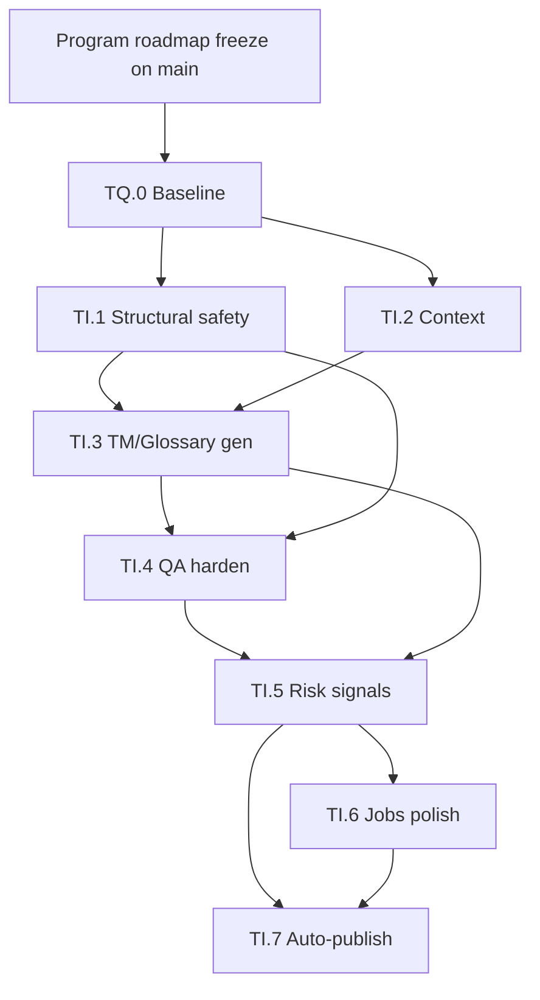

# Translation Intelligence & Quality (TIQ) — Parent Program Architecture Plan

**Status:** **Complete** on `main`
**Program:** Translation Intelligence & Quality (TIQ)
**Plan freeze:** Canonical program architecture for milestones **TQ.0** and **TI.1–TI.7**; measurement first; one shared translation brain; quality gates; Deferred boundaries
**ADR assessment:** **No ADR blocker** for this program freeze. TQ.0 methodology may be plan-locked unless a later investigation proves a cross-cutting ADR is necessary. ADR-0010 likely requires extension/review around TI.2/TI.3. Controlled auto-publication requires an ADR before TI.7. Store / identity / TARGET / Integration API conflicts are **STOP** conditions — not casually redesigned contracts.
**Roadmap parent:** [POST_V1_PLATFORM_ROADMAP.md](POST_V1_PLATFORM_ROADMAP.md) — Program B catalog (historical B.1–B.8) retained; **post-v1.1 sequencing for intelligence/quality work is governed by this TIQ parent**, not by early B.1-first ordering
**Implementation priority:** [PRODUCT_PRIORITIES.md](../PRODUCT_PRIORITIES.md)
**Planning branch:** `docs/tiq-program-roadmap-freeze` (merged)
**Freeze merge:** `main` @ `452a46c1b3f68dae2c01ddbd8d762aef21152617` (`merge: freeze Translation Intelligence & Quality program roadmap`)
**TQ.0:** **Complete** on `main` — [TQ0_TRANSLATION_QUALITY_BASELINE_IMPLEMENTATION_PLAN.md](TQ0_TRANSLATION_QUALITY_BASELINE_IMPLEMENTATION_PLAN.md); official pack `tests/quality/baselines/baseline-v1.1.0/`
**TI.1:** **Complete** on `main` — [TI1_PERSIST_PATH_STRUCTURAL_SAFETY_IMPLEMENTATION_PLAN.md](TI1_PERSIST_PATH_STRUCTURAL_SAFETY_IMPLEMENTATION_PLAN.md); canonical persist-path structural gate active on sync + Jobs; TS7 narrowed (numbers non-blocking on persist)
**TI.2:** **Complete** on `main` — [TI2_BOUNDED_TRANSLATION_CONTEXT_IMPLEMENTATION_PLAN.md](TI2_BOUNDED_TRANSLATION_CONTEXT_IMPLEMENTATION_PLAN.md); [validation log](TI2_BOUNDED_TRANSLATION_CONTEXT_VALIDATION_LOG.md); merge `80dfdcf18a93f168370aa1bb6a03d7c6dd8376fa`
**TI.3:** **Complete** on `main` — [TI3_TRANSLATION_MEMORY_INTELLIGENCE_IMPLEMENTATION_PLAN.md](TI3_TRANSLATION_MEMORY_INTELLIGENCE_IMPLEMENTATION_PLAN.md); [validation log](TI3_TRANSLATION_MEMORY_INTELLIGENCE_VALIDATION_LOG.md); merge `95839113ba47bed80f781db238ce038c8d9b973d`
**TI.4:** **Complete** on `main` — [TI4_DETERMINISTIC_QA_HARDENING_IMPLEMENTATION_PLAN.md](TI4_DETERMINISTIC_QA_HARDENING_IMPLEMENTATION_PLAN.md); [validation log](TI4_DETERMINISTIC_QA_HARDENING_VALIDATION_LOG.md); merge `e88def1ab2b1778595119e16684b37742cb4d839`
**TI.5:** **Complete** on `main` — [TI5_EVIDENCE_BASED_REVIEW_RISK_SIGNALS_IMPLEMENTATION_PLAN.md](TI5_EVIDENCE_BASED_REVIEW_RISK_SIGNALS_IMPLEMENTATION_PLAN.md); [ADR-0019](../adr/0019-evidence-based-risk-assessment.md); [validation log](TI5_EVIDENCE_BASED_REVIEW_RISK_SIGNALS_VALIDATION_LOG.md); merge `279ea0f22752141465d6cd3f42823f21d52e2f6b`; assessment `R1.0` (no aggregate score / LLM confidence / persisted assessment / publication decision)
**TI.6:** **Complete** on `main` — [plan](TI6_JOBS_SCALE_SAFETY_POLISH_IMPLEMENTATION_PLAN.md); [validation](TI6_JOBS_SCALE_SAFETY_POLISH_VALIDATION_LOG.md); merge `7286156ed977200907f9416d6af9022517291e76`
**TI.7:** **Complete** on `main` — [plan](TI7_CONTROLLED_AUTO_PUBLICATION_POLICY_IMPLEMENTATION_PLAN.md); [ADR-0020](../adr/0020-controlled-auto-publication-and-frontend-gate.md) **Accepted** / implemented; [validation](TI7_CONTROLLED_AUTO_PUBLICATION_POLICY_VALIDATION_LOG.md); merge `25fee160f323dd33b7f73d432f446caca6a72075`; runtime `TARGET` **7**; policy `P1.0`
**Program verdict:** Translation Intelligence & Quality (**TIQ**) is **COMPLETE**
**Frozen program architecture:** measurement → structural safety → bounded context → TM intelligence → deterministic QA → explainable risk assessment → operational Jobs hardening → controlled publication
**Next:** Explicit release/version decision from the closed TIQ main baseline. Do **not** begin another product milestone before that decision. Do **not** tag/release as part of TIQ closure.
**Implementation branches:** create **per milestone** only after that milestone’s definitive plan is Architecture Frozen on `main`
**Baseline (plan authoring):** `main` @ `394e154079598b04d441a741568538af1d609939`
**Behavior reference (released translator):** tag `v1.1.0` @ `d9c2336182fa2e0ae0582ead78cc0a346670c92a`
**Depends on:** AI Multilingual **v1.1.0** released; A.SEOa–A.SEOf complete; CI/release baseline green; Migrator `TARGET` **6** at program start (now **7** after TI.7); Integration API v1 unchanged
**Related:** [adr/0010-provider-agnostic-interface.md](../adr/0010-provider-agnostic-interface.md); [adr/0009-translation-memory-table.md](../adr/0009-translation-memory-table.md); [adr/0014-glossary-platform-lexicon.md](../adr/0014-glossary-platform-lexicon.md); [adr/0015-review-workflow-and-tm-approval-policy.md](../adr/0015-review-workflow-and-tm-approval-policy.md); [adr/0019-evidence-based-risk-assessment.md](../adr/0019-evidence-based-risk-assessment.md); [adr/0020-controlled-auto-publication-and-frontend-gate.md](../adr/0020-controlled-auto-publication-and-frontend-gate.md); [INTEGRATION_API_V1.md](../INTEGRATION_API_V1.md); [docs/releases/v1.1.0.md](../releases/v1.1.0.md)

**Operational success:** The platform can improve translation quality in a **measurable** way along a single shared intelligence path, toward publication-quality WooCommerce-scale translations with minimal human intervention — without inventing a second translator, Store, TM, or glossary.

**This plan is the program architecture contract for TIQ (TQ.0–TI.7).** Do not implement production code on the planning branch. Do not begin TQ.0 definitive planning until this document is Architecture Frozen on `main`. Each milestone receives its own definitive planning freeze before implementation. This document freezes program boundaries, invariants, gates, and Deferred items — not detailed TQ.0 corpus or harness work packages.

---

## 1. Purpose

Define the **canonical Translation Intelligence & Quality architecture** that every later TIQ milestone must follow.

TIQ does **not**:

- redesign Integration API v1, Store, PluginIdentity, Router, LanguageContext, SB11, or TARGET
- invent parallel Woo / SEO / Jobs translators
- invent a second TM, glossary, or translation Store
- start with additional AI providers or semantic/vector TM
- make ordinary CI depend on live OpenAI
- implement TQ.0 or TI.1–TI.7 in this freeze

TIQ **does**:

- freeze measurement-first sequencing (TQ.0 before intelligence claims)
- freeze one shared `TranslationService` / `AIProviderInterface` intelligence path
- freeze baseline/harness distinction and comparison protocol requirements
- freeze quality dimensions, evaluation classes, and advancement gates
- freeze Deferred / out-of-scope boundaries for the program
- supersede post-v1.1 “early B.1 / C-before-B” sequencing for intelligence and quality work

---

## 2. Preconditions (verified at plan authoring)

| Precondition | Status |
|---|---|
| `main == origin/main` @ `394e154079598b04d441a741568538af1d609939` | **Pass** |
| Working tree clean | **Pass** |
| Tag `v1.1.0` exists @ `d9c2336182fa2e0ae0582ead78cc0a346670c92a` | **Pass** |
| GitHub Release `v1.1.0` published | **Pass** |
| A.SEOa–A.SEOf complete | **Pass** |
| CI / release baseline recovered and green | **Pass** |
| Migrator `TARGET` = **6** | **Pass** |
| Integration API v1 unchanged | **Pass** |
| No subsequent product milestone started | **Pass** |
| No existing `docs/plans/TIQ_PARENT_IMPLEMENTATION_PLAN.md` | **Pass** |

### Tag → main behavioral-equivalence audit (at authoring)

| Item | Result |
|---|---|
| Commits `v1.1.0..394e15407` | `394e15407` — `docs(release): close AI Multilingual v1.1.0` only |
| Paths changed | `docs/releases/v1.1.0.md`, `docs/releases/V1_1_0_RELEASE_SCOPE.md` |
| Translation-affecting paths (`src/`, `bin/`, `assets/`, plugin bootstrap, Composer, workflows, `tests/`) | **None** |
| Verdict at authoring | Current `main` is **behavior-equivalent** to released `v1.1.0` for translation output |

**Rule:** Behavioral equivalence must be **demonstrated**, not assumed. Re-audit whenever `main` moves before a labeled `baseline-v1.1.0` result set is frozen. If translation-affecting paths diverge, generate baseline results against translator subject `v1.1.0` (or document intentional non-equivalence).

If any precondition regresses before a milestone starts coding: **STOP**.

---

## 3. Program objective

Produce **publication-quality, measurable translation intelligence** for WooCommerce-scale workloads using **one shared translation brain**.

**Measurement first, then intelligence improvements.**

Conceptual pipeline (reuse existing subsystems; do not invent duplicates):

```text
SOURCE CONTENT
    → content / field understanding
    → translation memory retrieval
    → terminology / glossary constraints
    → relevant bounded contextual information
    → AI translation
    → deterministic validation
    → translation-quality evaluation
    → review / publish decision
    → approved translation
    → reuse as future translation knowledge
```

v1.1.0 already provides Store overlays, OpenAI behind `AIProviderInterface`, glossary-in-prompt, TM suggestions with approval-gated write-back, Workspace QA, Review, and Background Jobs. It does **not** yet provide a quality baseline, rich bounded context in generation, TM-assisted automatic generation, persist-path structural gates on all translate paths, or evidence-based automatic publication.

---

## 4. Program invariants

These govern **TQ.0–TI.7** unless a later ADR overturns them:

1. **Quality claims require TQ.0 comparison.** No TI.* milestone may claim improved translation quality without comparison against the frozen TQ.0 methodology (same corpus and scoring methodology version, or documented intentional methodology bump with re-baseline).
2. **Benchmark before intelligence changes.** Do not begin prompt redesign, richer field/object/site context, TM-assisted generation, glossary enforcement redesign, additional providers, semantic/vector TM, LLM confidence/risk scoring, or automatic publication until TQ.0 establishes the measurement system. **TI.1** may introduce deterministic structural safety independently of semantic-quality improvement claims, but must preserve the TQ.0 benchmark and rerun applicable deterministic checks.
3. **One shared intelligence path.** Intelligence orchestration remains around existing `TranslationService` / `AIProviderInterface`. Do not create a Woo translator, SEO translator, Jobs-specific translator, second TM, second glossary, or second translation Store. Surface-specific extraction, identity, and rendering remain separate concerns.
4. **TQ.0 is the ruler, not a translator redesign.** TQ.0 must not rewrite OpenAI prompts, add translation context, wire TM into automatic generation, redesign glossary behavior, add providers, alter Store identity, change Integration API v1, change Router/LanguageContext, change SEO/Woo/Rank Math ownership, change automatic publication, or bump TARGET/schema. If a schema bump appears unavoidable: **STOP** and surface for architectural review.
5. **Preserve frozen platform contracts.** Integration API v1; Store; PluginIdentity; TARGET **6**; Router; LanguageContext; SB11; A.SEO ownership; WooCommerce ownership boundaries; Rank Math ownership boundaries; existing TranslationService / AIProviderInterface path.
6. **No opaque sole quality score.** Dimensioned evaluation is required. An aggregate summary may exist for convenience but must never replace individual dimension results.
7. **No LLM self-confidence percentage as publication authority.** TI.5 / TI.7 must derive risk/publish decisions from observable evidence.
8. **Additional AI providers remain Deferred** until measurement shows a product reason to add them.
9. **Semantic / vector TM remains Deferred** until exact/fuzzy TM reuse has been exploited and measured.
10. **Normal CI does not depend on live OpenAI** (paid / non-deterministic calls) unless an exceptional, documented reason appears later.

---

## 5. Baseline / harness contract

| Concept | Meaning | Authority |
|---|---|---|
| **Behavior reference** | Released v1.1.0 translation behavior | Tag `v1.1.0` @ `d9c2336182fa2e0ae0582ead78cc0a346670c92a` |
| **Permanent quality harness** | Corpus, scorers, runners, fixtures, docs | Developed and retained on green `main` (not a permanent branch from the tag) |
| **Candidate translator** | TI.* (or other) translator under evaluation | Feature branch / `main@SHA` after merge |
| **Comparison results** | Dimensioned scores + run metadata | Versioned artifacts; never secrets / API keys / sensitive prompt bodies |

### Comparison method (TQ.0 must implement; parent freezes the requirement)

Subjects under evaluation are distinguished as:

1. `v1.1.0` behavior baseline
2. `current-main` harness (and optionally `main@SHA` as translator subject when equivalence is proven)
3. future `TI.*` candidate
4. comparison results between them

Required versioning axes:

- Corpus version `C`
- Harness / scoring methodology version `H`
- Translator subject `S` ∈ {`v1.1.0`, `main@SHA`, `candidate@SHA`}

Compare subjects only when `C` and scoring methodology version match (or document intentional methodology bumps with re-baseline).

**Never silently treat current `main` and released `v1.1.0` as identical.** Equivalence requires evidence (no translation-affecting diff, or isolated run against the tag).

---

## 6. Quality methodology boundaries

### Evaluation classes

| Class | Role | Authority |
|---|---|---|
| **A. Deterministic** | Placeholders, markup, numbers, protected tokens, mechanically verifiable glossary, empty output, format invariants | CI-primary; **cannot** be overridden by an LLM judge |
| **B. Semantic / human** | Meaning preservation, fluency, terminology appropriateness, tone, hallucination, omission | Explicit human / reference protocol |
| **C. Optional model-assisted** | Advisory semantic judgments | Record evaluator model/version/configuration; reproducible enough for comparison; **never** sole authority; document evaluator drift handling |

### Required dimensions (minimum)

Raw dimension results must remain visible. Aggregate score optional for convenience only.

1. Semantic completeness / meaning preservation
2. Terminology correctness
3. Glossary compliance
4. Hallucination / unsupported additions
5. Omission
6. HTML / markup preservation
7. Placeholder / token preservation
8. Numbers / units preservation
9. URLs / identifiers / SKU-like protected values
10. Language correctness
11. Field-appropriate style
12. Field-appropriate length / conciseness where relevant

Detailed TQ.0 scoring algorithms belong in the TQ.0 plan — not here.

---

## 7. Corpus principles

Freeze product-level corpus principles only. **Do not** design the detailed TQ.0 case list in this parent freeze.

- Product-representative of AI Multilingual workloads (not a generic MT benchmark)
- EN→SV as the first frozen baseline pair; architecture remains multilingual-ready
- Repository-owned sanitized fixtures; safe to commit
- No customer PII; no credentials / secrets
- No live-site dependency for the benchmark
- Explicit corpus versioning; historical cases not silently rewritten
- Intentional extensions only (additions bump version; methodology-breaking changes require re-baseline)
- Case classes must be distinguishable: freely translatable; terminology-sensitive; structurally sensitive; protected / non-translatable
- Representative categories must eventually include (at TQ.0 planning): Woo titles / short / long descriptions; scientific/technical terminology; marketing; navigation/UI; taxonomy; SEO title/description; Gutenberg/plain; HTML-rich; placeholder/token-sensitive; deliberately difficult examples

---

## 8. CI / live-provider boundary

| Path | Allowed contents |
|---|---|
| **Normal CI** | Corpus validation; harness tests; deterministic scoring; replay / fixture evaluation; scorer regression |
| **Explicit / manual** | Live OpenAI generation; provider-dependent measurements; optional model-assisted evaluation |

Live runs must capture enough metadata to compare results (where available): provider, model, prompt/profile version, source/target locale, relevant translation configuration, timestamp, token usage, corpus version, translator subject SHA/tag.

**Committed result artifacts must not contain API keys or sensitive prompt material.**

---

## 9. Milestone ladder

Authoritative sequence:

| ID | Name | Relative size | Risk | ADR likely? | Role |
|---|---|---|---|---|---|
| **TQ.0** | Translation Quality Baseline | M | Low | Methodology may be plan-locked | Measurement infrastructure (the ruler) |
| **TI.1** | Persist-path structural safety | S | Low | No | Deterministic structural gate on sync + Jobs translate paths |
| **TI.2** | Bounded translation context contract | M | Medium | Likely extend ADR-0010 | Field / object bounded context into shared batch/prompt path |
| **TI.3** | TM exact reuse + glossary-assisted generation | M | Medium | Maybe | Exact TM short-circuit + assisted generation on shared path |
| **TI.4** | Deterministic QA hardening | M | Medium | Maybe | Explicit block vs warn policy |
| **TI.5** | Evidence-based review / risk signals | M | Medium–High | Yes | Observable evidence only — not LLM confidence % |
| **TI.6** | Jobs scale / safety polish | M | Medium | No | Token budgets, Retry-After, identical-segment reuse via TM |
| **TI.7** | Controlled auto-publication policy | L | High | Yes | Only after prior reliability evidence |

This ladder is **not** permission to start parallel implementation. Each milestone requires its own definitive planning freeze on `main` before coding.

---

## 10. Dependency graph

```text
PROGRAM FREEZE (this document on main)
        ↓
      TQ.0
        ↓
   TI.1  ∥  TI.2
        ↓
      TI.3
        ↓
      TI.4
        ↓
      TI.5
        ↓
   TI.6  /  TI.7 dependency path
        ↓
      TI.7 (last)
```



TQ.0 gates claims of improvement for TI.2+. TI.1 may proceed for structural safety without a semantic-quality claim, still preserving TQ.0 deterministic regressions.

---

## 11. Advancement gates

### TQ.0 exit

- Frozen corpus + versioning rules
- Reproducible harness on `main`
- Documented dimensions (no opaque sole score)
- Documented v1.1.0 baseline results (with equivalence evidence if generated via main)
- Rerun / comparison protocol for `v1.1.0` vs `main@SHA` vs `candidate@SHA`
- Deterministic harness tests green in normal CI
- Live OpenAI path documented as manual / explicit

### TI.1 exit

- Machine translation cannot persist structurally invalid admitted content
- Jobs and synchronous translation use the same safety path
- TQ.0 deterministic regression green
- No semantic-quality improvement claim required (and none claimed without TQ.0 compare)

### TI.2+

- Any claimed quality improvement **must** include TQ.0 comparison results (same corpus / methodology version)

### TI.3

- Report **TM hit / reuse** metrics separately from AI generation quality

### TI.4

- Deterministic blocking vs warning policy explicit and tested
- Deterministic failures cannot be overridden by an LLM judge

### TI.5

- No LLM self-confidence percentage as publication authority

### TI.7

- Cannot start until risk evidence, QA behavior, TM / glossary behavior, and Jobs path are demonstrated sufficiently reliable in prior milestones (TI.1–TI.6 as applicable)

---

## 12. Deferred / out of scope

Retain Deferred status (do not promote into TQ.0 or TI.1):

- Additional AI providers (historical B.1) until measurement shows product need
- Semantic / vector TM until exact / fuzzy TM reuse exploited and measured
- Parallel translators (Woo / SEO / Jobs-specific)
- Second Store; second TM; second glossary
- Coverage-Deferred platform surfaces (translated leaf slugs; social images; SE10/SE11; nested identity research leftovers; full Elementor; render-cache-on; Deferred chrome/email/body work) unless a later product decision reopens them **outside** TIQ
- TARGET / schema changes
- Normal-CI live OpenAI dependency
- Billing platform
- GSC / Search Console API automation
- Automatic publication before TI.7 prerequisites
- Program C Workspace polish as a substitute for quality architecture
- Program E ecosystem expansion

---

## 13. Preserved platform contracts

| Contract | Rule |
|---|---|
| Integration API v1 | Unchanged |
| Store architecture | Unchanged overlay Store |
| PluginIdentity | Unchanged |
| Migrator `TARGET` | **6** — no bump for TIQ parent |
| Router | Unchanged |
| LanguageContext | Unchanged |
| SB11 | Unchanged |
| A.SEO ownership | Unchanged |
| WooCommerce ownership boundaries | Unchanged |
| Rank Math ownership boundaries | Unchanged |
| `TranslationService` / `AIProviderInterface` | Shared intelligence path — extend, do not fork |

Conflict with these contracts: **STOP** and open architectural review / ADR as required. Do not silently redesign.

---

## 14. ADR assessment

| Topic | Position |
|---|---|
| TIQ program freeze | **No ADR blocker** — program invariants and ladder locked here |
| TQ.0 methodology | Initially **plan-locked** in the TQ.0 definitive plan; open a light ADR only if methodology becomes a cross-cutting product contract beyond TIQ |
| Extending `TranslationBatch` / context / TM examples | **ADR-0010 amended** for TI.2 context and TI.3 `tm_example` (planning); implementation of TM examples awaits TI.3 feature work |
| Controlled auto-publication / frontend gate change | **ADR required before TI.7** |
| Store / identity / TARGET / Integration API | Expect **no change**; conflict = STOP |

Do not create or modify ADRs in the TIQ parent freeze task.

---

## 15. Roadmap authority

| Concern | Authoritative document |
|---|---|
| TIQ program architecture, ladder, invariants, gates, Deferred, baseline/harness | **This file** — authoritative for **TQ.0–TI.7** |
| Long-term program catalog (historical B.1–B.8 IDs) | [POST_V1_PLATFORM_ROADMAP.md](POST_V1_PLATFORM_ROADMAP.md) — retained; post-v1.1 intelligence/quality sequencing defers to TIQ |
| Implementation priority / next program | [PRODUCT_PRIORITIES.md](../PRODUCT_PRIORITIES.md) |
| Classic M0–M7 / A.SEO status (historical) | [ROADMAP.md](../ROADMAP.md) |

**Next program after v1.1.0 / A.SEO complete:** Translation Intelligence & Quality.
**Next milestone after this program freeze lands on `main`:** TQ.0 definitive planning (Architecture Frozen planning for TQ.0 — separate task).

Historical Program B tables are **not** renumbered or rewritten wholesale by this freeze.

---

## 16. Explicit non-goals of this freeze

- TQ.0 detailed corpus design
- TQ.0 harness implementation
- TQ.0 implementation planning branch
- TI.1–TI.7 design packages beyond ladder / gates
- Production code, tests, schema, TARGET, providers, prompts, TM, glossary, Jobs changes

---

## 17. When child work may begin

| Activity | Gate |
|---|---|
| TQ.0 definitive planning | **Complete** — [TQ0_TRANSLATION_QUALITY_BASELINE_IMPLEMENTATION_PLAN.md](TQ0_TRANSLATION_QUALITY_BASELINE_IMPLEMENTATION_PLAN.md) Architecture Frozen on `main` |
| TQ.0 implementation | **Complete** — merged `a602c4465…`; official `baseline-v1.1.0` on `main` |
| TI.1 / TI.2 | **Complete** on `main` |
| TI.3 planning | **Complete** — Architecture Frozen then implemented — [TI3_TRANSLATION_MEMORY_INTELLIGENCE_IMPLEMENTATION_PLAN.md](TI3_TRANSLATION_MEMORY_INTELLIGENCE_IMPLEMENTATION_PLAN.md) |
| TI.3 implementation | **Complete** — merge `95839113ba47bed80f781db238ce038c8d9b973d`; exact approved TM reuse + relevance-gated assisted context; TARGET 6 |
| TI.4 planning | **Complete** — Architecture Frozen on `main` — [TI4_DETERMINISTIC_QA_HARDENING_IMPLEMENTATION_PLAN.md](TI4_DETERMINISTIC_QA_HARDENING_IMPLEMENTATION_PLAN.md); freeze merge `b1023570e…` |
| TI.4 implementation | **Complete** — merge `e88def1ab2b1778595119e16684b37742cb4d839`; shared detectors → RawFinding → policy adapters; H1.1 + C1.3; TARGET 6 |
| TI.5 planning | **Complete** — Architecture Frozen then implemented — [TI5_EVIDENCE_BASED_REVIEW_RISK_SIGNALS_IMPLEMENTATION_PLAN.md](TI5_EVIDENCE_BASED_REVIEW_RISK_SIGNALS_IMPLEMENTATION_PLAN.md); ADR-0019 |
| TI.5 implementation | **Complete** — merge `279ea0f22752141465d6cd3f42823f21d52e2f6b`; assessment `R1.0`; TARGET 6; Jobs Deferred to TI.6 |
| TI.6 planning | **Complete** — [TI6_JOBS_SCALE_SAFETY_POLISH_IMPLEMENTATION_PLAN.md](TI6_JOBS_SCALE_SAFETY_POLISH_IMPLEMENTATION_PLAN.md) Architecture Frozen on `main`; freeze merge `c6b456403…` |
| TI.6 implementation | **Complete** on `main` — [validation](TI6_JOBS_SCALE_SAFETY_POLISH_VALIDATION_LOG.md) |
| TI.7 planning | **Complete** — [TI7_CONTROLLED_AUTO_PUBLICATION_POLICY_IMPLEMENTATION_PLAN.md](TI7_CONTROLLED_AUTO_PUBLICATION_POLICY_IMPLEMENTATION_PLAN.md); ADR-0020 Accepted |
| TI.7 implementation | **Complete** — merge `25fee160f323dd33b7f73d432f446caca6a72075`; TARGET **7**; [validation](TI7_CONTROLLED_AUTO_PUBLICATION_POLICY_VALIDATION_LOG.md) |
| TIQ program | **COMPLETE** — measurement → structural safety → bounded context → TM → QA → risk assessment → Jobs → controlled publication |
| Next | Explicit **release/version** decision from closed TIQ main. Do not start another product milestone first. |

---

## Document control

| Item | Value |
|---|---|
| Canonical path | `docs/plans/TIQ_PARENT_IMPLEMENTATION_PLAN.md` |
| Kind | Program architecture / planning freeze (parent) |
| Analog | [ASEO_PARENT_IMPLEMENTATION_PLAN.md](ASEO_PARENT_IMPLEMENTATION_PLAN.md) |
| Tag for this freeze | **Not required** |
| Revision | 1.0 — 2026-08-09 — Architecture Frozen on `main` (merge `452a46c1b…`) |
