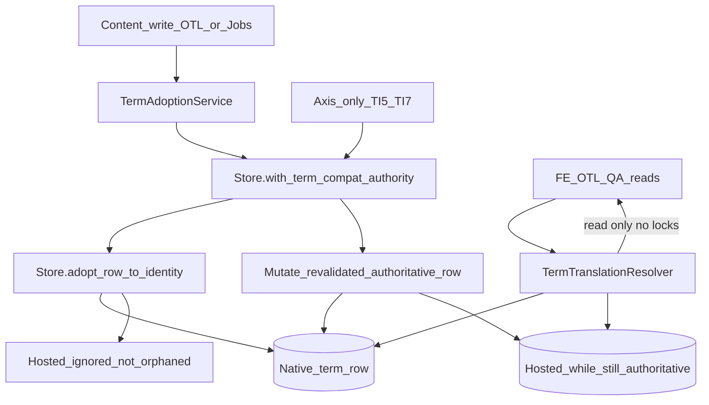

# TSC.1 — First-Class Taxonomy Terms Implementation Plan

**Status:** **Architecture Frozen** on `main` — production implementation **NOT STARTED**
**Milestone:** TSC.1 First-Class Taxonomy Terms
**Parent:** [TSC_PARENT_IMPLEMENTATION_PLAN.md](TSC_PARENT_IMPLEMENTATION_PLAN.md) (Architecture Frozen on `main`)
**External review:** **FREEZE** (eight amendments incorporated) · **STATE A** · **TARGET 7**
**Independent planning review:** **PASS** — [TSC1_PLANNING_VALIDATION_LOG.md](TSC1_PLANNING_VALIDATION_LOG.md)
**ADR:** [0021-first-class-taxonomy-term-identity-and-lazy-adoption.md](../adr/0021-first-class-taxonomy-term-identity-and-lazy-adoption.md) (**Accepted** with this freeze)
**Freeze merge:** `1fcf8d2e3088b09174526643e13a2d8ccf5cb2d4`
**Depends on:** AI Multilingual **v1.3.0**; TIQ Complete; OTL Complete; TSC Parent Frozen; **TSC.0 COMPLETE**; `Migrator::TARGET` **7**
**Related:** ADR-0001 overlay; ADR-0005 Store; ADR-0007 hashes; ADR-0015 Review; ADR-0017 Integration; ADR-0020 Publication; [TSC0_INTERNAL_SURFACE_CAPABILITY_FOUNDATION_IMPLEMENTATION_PLAN.md](TSC0_INTERNAL_SURFACE_CAPABILITY_FOUNDATION_IMPLEMENTATION_PLAN.md)

**This document is the authoritative implementation specification for TSC.1.** Do not implement from Cursor plans or chat summaries.

**Production implementation status:** **NOT STARTED.**
**TSC.2–TSC.6 implementation status:** **NOT STARTED.**

**Exact next step:** Open `feature/tsc1-first-class-taxonomy-terms` and execute TSC1.0→TSC1.8 per this plan when an implementation task is authorized. Do not bump version/TARGET, tag, release, or deploy as part of planning closure.

---

## 1. Baseline

| Field | Value |
|---|---|
| Planning baseline main HEAD | `56eff6aa172e1dd8b4f9267a11bc53afa0508f1d` |
| `main` == `origin/main` | Yes (at branch creation) |
| Version | **1.3.0** |
| Tag `v1.3.0` | Unchanged |
| `Migrator::TARGET` | **7** |
| Schema | STATE A — no migration |
| TSC.0 | COMPLETE (`6ee696cff…`) |
| TSC.1–TSC.6 implementation | Not started |
| Highest ADR before this freeze | **0020** → this milestone creates **0021** |

### Repository spine (pre-TSC.1)

| Concern | Reality |
|---|---|
| Store unique key | `(source_type, source_id, segment_hash, language_id)` — `source_type` VARCHAR(20), `source_id` BIGINT, `source_subtype` VARCHAR(32) **not** in uniqueness ([Schema::create_translations](../src/Database/Schema.php)). VARCHAR(32) matches WordPress `wp_term_taxonomy.taxonomy` width, so any WP-storable taxonomy slug fits. |
| `Store::SOURCE_*` | Only `SOURCE_POST` today |
| `save_translation` | Recomputes hashes; on text change clears review + publish axes — **unsafe for adopt** |
| `update_review_metadata` / `update_publish_metadata` | get → update by `translation_id`; **no** row locks / authority re-check |
| Orphan semantics | `ignored` + `error_code=orphaned` = missing extract unit in `sync_source` |
| Overlay eligibility | `ignored` / `missing` excluded ([Store::is_publicly_overlay_eligible](../src/Translation/Store.php)) |
| SurfaceCapability | Source-type-generic; coordinator `sync_identity` still **post-only** |
| Hosted Woo terms | `post` + shop page; keys `p:woocommerce:{tax}:{term_id}:name\|description` |
| Rank Math term SEO | Hosted on shop / `page_for_posts`; keys `p:rankmath:term:{term_id}:*` |
| FE overlays today | Woo: `single_term_title`, `woocommerce_page_title`, `term_description` — no `get_term` mutation. Current bridge primarily skips `is_admin()`; TSC.1 hard guards for REST/AJAX/cron/feed/embed on `term_description` are **additive**. |
| OTL classic REST | `post_id` routes stay post-only; terms use `translation_id` routes |
| Jobs | Create registry-ready; execution/auth still post-shaped (non-post auth skip hole) |

### Parent supersession note

Parent §6 still says retire hosted as `ignored`/`orphaned`. **TSC.1 freezes honest retirement:** `status=ignored`, `error_code=''` (not `orphaned`). Orphan remains reserved for missing extract / deleted source. This plan + ADR-0021 supersede the parent wording for adopt retirement only.

---

## 2. Objective

Admit taxonomy terms as first-class Store identities (`SOURCE_TERM` / TERM_ID) on the TSC.0 SurfaceCapability spine **without** redesigning Store, Jobs, OTL policy, or TI.7.

Deliver:

- `SOURCE_TERM` + `TermSurfaceAdapter` + internal `AdmittedTaxonomies`
- `TermExtractor` + registry-driven coordinator flush for terms
- Lazy hosted→native adoption with lifecycle-preserving Store primitive
- Store-owned authority serialization for adopt vs axis mutations
- Read-only `TermTranslationResolver` (native-first, hosted fallback)
- Exact visitor-only overlay seams
- OTL / Jobs / TI.7 term paths (no second UIs/engines/policies)
- Rank Math term SEO sibling adopt (retain integration keys)
- `pa_*` **term values** only (attribute taxonomy labels → TSC.3)

---

## 3. Ownership boundaries

| Owner | Domain |
|---|---|
| **TermSurfaceAdapter / AdmittedTaxonomies** | Facts, supports, invalidation event mapping, extract entry |
| **TermExtractor** | name/description extraction |
| **Store** | Persistence; `adopt_row_to_identity`; `with_term_compat_authority`; sync/orphan |
| **TermAdoptionService** | Orchestrates adopt (not a second Store) |
| **TermTranslationResolver** | **Read-only** native→hosted resolve + provenance |
| **TI.5 / ReviewWorkflowService** | Review legality (unchanged policy) |
| **TI.7 / PublicationService** | Publication legality (unchanged policy) |
| **OTL** | Allowed actions / Operations UX over `translation_id` |
| **TI.6 Jobs** | Job admission/execution; adopt-before provider persist |
| **Frontend integrations** | Visitor overlay hooks only via resolver + eligibility |

Architecture tests must prove: resolver never writes/locks; Store owns identity serialization; no dual Store/Jobs/publication policy.

---

## 4. Frozen identity (TERM_ID)

```text
Store::SOURCE_TERM = 'term'
source_type    = term
source_id      = term_id          // BIGINT UNSIGNED
source_subtype = taxonomy slug    // VARCHAR(32); e.g. product_cat, category, pa_color
```

Native fields (`field_key` = `segment_key`):

- `name`
- `description`

Term **slug** translation: **UNSUPPORTED** in TSC.1.

`source_subtype` is a fact column only — **not** part of uniqueness. Unique identity remains `(source_type, source_id, segment_hash, language_id)`.

---

## 5. Admitted taxonomies (internal)

Code-owned `AdmittedTaxonomies` (parallel to `AdmittedPostTypes`). **No** public filter. **No** Biopentra literals. **No** all-taxonomies auto-admit.

| Class | Members | Notes |
|---|---|---|
| Core | `category`, `post_tag` | Always |
| Woo catalog | `product_cat`, `product_tag` | When Woo present |
| Global attribute **term values** | Public registered taxonomies matching `^pa_` **and** reported by Woo as attribute taxonomies | Values only (e.g. Red under `pa_color`) |

### `pa_*` boundary (frozen)

| Concern | TSC.1 |
|---|---|
| **A.** Global attribute **term values** (`pa_color:red`) | **Admitted** as SOURCE_TERM when taxonomy qualifies |
| **B.** Global attribute **taxonomy labels/names** (“Color”) via `woocommerce_attribute_label` / product `attribute_name` keys | **OUT** — **TSC.3** |
| Product-local / custom attribute text | **OUT** — TSC.3 / Deferred |

---

## 6. Hosted retirement (honest)

After successful adopt:

| Field | Value |
|---|---|
| `status` | `ignored` |
| `error_code` | `''` (**not** `orphaned`) |
| `error_message` | `''` |
| Row | Retained (historical/compatibility evidence) |

Supersession = native row existence + resolver precedence — **no** new schema enum.

True orphan (`ignored`+`orphaned`) only for deleted term / empty extract / missing unit.

---

## 7. Adoption persistence primitive

**Forbidden:** `Store::save_translation` for adopt (clears review/publish on text-hash change).

**Required Store APIs** (illustrative names):

1. `Store::with_term_compat_authority( TermCompatRef $ref, callable $fn )`
2. `Store::adopt_row_to_identity( … ): object|WP_Error`

Orchestrator: `TermAdoptionService`. **Store remains persistence owner.** No second Store.

### Authority lock

| Rule | Freeze |
|---|---|
| Owner | Store only |
| Lock order | (1) native candidate key, (2) hosted key — same for adopt and axis |
| Mechanism | Transaction + `SELECT … FOR UPDATE` (InnoDB); **new** in TSC.1 (absent today). Absent native is locked via unique-key `SELECT … FOR UPDATE` (InnoDB gap/next-key). Callers must **not** take a hosted `translation_id` row lock before entering this helper. |
| Re-validate | Native exists → native authoritative; else active hosted → hosted; else miss |
| Defense | Refuse axis write to hosted when native exists or hosted already `ignored` |

### Adopt steps

1. Enter authority lock (native then hosted).
2. If native present → retire hosted if active → return native (no overwrite).
3. Else confirm hosted authoritative → recompute native `segment_hash`.
4. Copy columns per §8 matrix (no `review_clear_fields` / `publish_clear_fields`).
5. Insert native; unique race → re-read native → retire hosted.
6. Retire hosted (`ignored`, empty error_code).
7. Invalidate both identities; commit.
8. Failure → rollback; one coherent prior authority.

Must not fire `aiml_review_invalidated_by_edit` / publish-invalidated-by-edit.

---

## 8. Store-column semantic validity matrix

**Rule:** Copy a value only if it remains semantically valid under the new native identity and hash contract. Lifecycle preservation ≠ invalid evidence preservation.

| Column | Disposition | Notes |
|---|---|---|
| `translation_id` | New | New row |
| `source_type` / `source_id` / `source_subtype` | **Recompute** | TERM_ID |
| `language_id` | **Preserve** | |
| `field_key` / `segment_key` | **Recompute** for `name`/`description`; **Preserve** Rank Math `p:rankmath:term:…` | |
| `segment_hash` | **Recompute** | Always when keys change |
| `segment_kind` / `segment_order` | Preserve or defaults | |
| `text_format` | Preserve if matches TermExtractor; else recompute | name=plain, desc=html |
| `source_text` | Preserve then verify vs extract; diverge → extract + stale honesty | |
| `source_hash` | Preserve iff text+format valid under NORM; else recompute | |
| `norm_version` | Preserve if NORM unchanged; else current | |
| `translated_text` | **Preserve** | |
| `translation_hash` | Preserve iff text unchanged; else recompute | |
| `status` | **Preserve** | |
| `is_stale` | Preserve; may set if extract ≠ source_text | |
| Provider/TM/`translated_by` | **Preserve** | |
| Review axis + `submitted_translation_hash` | Preserve iff submitted hash still equals `translation_hash` (or empty); else **honest reset** | |
| Publish axis | **Preserve** | |
| `error_*` on native | Clear unless intentionally keeping failed | |
| Hosted retire `error_*` | Clear (not orphaned) | |
| `created_at` | Preserve from hosted | |
| `updated_at` | Now | |

---

## 9. Adoption triggers + axis serialization

| Trigger | Adopt? | Serialization |
|---|---|---|
| Manual target save | **YES** | Adopt lock |
| Synchronous retranslate persist | **YES** | Adopt lock |
| Jobs/provider persist | **YES** | Adopt lock |
| Review submit / approve / reject | **NO** | `with_term_compat_authority` then mutate authoritative row |
| Publish / unpublish | **NO** | Same |
| GET / FE / OTL inspect / QA read | **NO** | Resolver read-only |
| Term invalidation flush | **NO** | Sync native if exists |
| Maintenance CLI | Optional YES | Adopt lock |

**Rejected fallback:** adopt-before-any-hosted-mutation (unnecessary once Store serialization exists).

### Axis contract

1. Identify logical term translation.
2. TI.5/TI.7 decide legality (unchanged).
3. Persist under Store authority lock: remap to native if present; else mutate hosted while locked; never write retired H when N exists.
4. Successful axis always on authoritative row.

---

## 10. TermTranslationResolver (read-only)

```text
resolve(term_id, taxonomy, logical_field, language_id)
  → { row, identity: native|compatibility, source_type, source_id, segment_key }
```

| Rule | Behavior |
|---|---|
| Precedence | Native first; else deterministic hosted |
| After native | Never return hosted as active |
| Write / lock | **Forbidden** |
| Policy | Never decides publish; callers apply TI.7 / overlay eligibility |
| Hosted lookup | Shop page for product_cat/tag; posts page for category/post_tag; exact segment key |

Sole read alias implementation. Architecture tests ban duplicates and write/lock APIs on resolver.

---

## 11. Visitor overlay seam matrix

| Hook / filter | Content | Taxonomies | Disposition |
|---|---|---|---|
| `single_term_title` | Name | All admitted | **SUPPORTED** (+ visitor guard) |
| `term_description` | Description | All admitted | **SUPPORTED** (hard visitor guards: skip admin, REST, AJAX, cron, feed, embed) |
| `woocommerce_page_title` | Title | `product_cat`, `product_tag` | **SUPPORTED** |
| `get_the_archive_title` | Archive title | Broad | **DEFERRED** |
| Extra category/tag title filters | Name | — | **DEFERRED** (`single_term_title` covers) |
| Breadcrumbs | Name | — | **DEFERRED** |
| Widgets / block term titles | Name | — | **UNSUPPORTED** |
| Admin / list-table / REST term | — | — | **UNSUPPORTED** |
| Broad `get_term` filter | Object | — | **UNSUPPORTED** |
| `woocommerce_attribute_label` | Taxonomy label | — | **UNSUPPORTED** (TSC.3) |

Hard invariants: no canonical `WP_Term` mutation; no term table writes; no admin/internal overlay.

Resolve: `TermTranslationResolver` → then `is_publicly_overlay_eligible` / TI.7 gate on returned row.

---

## 12. TermSurfaceAdapter facts

| Fact | Implementation |
|---|---|
| exists | `get_term` OK |
| subtype | taxonomy slug |
| auth | `current_user_can( 'edit_term', term_id )` (correct WP cap) |
| visitor_public | exists ∧ taxonomy public / publicly_queryable as applicable ∧ not deleted |
| supports | inspect, translate, mutate, jobs, publish_inputs, overlay, stale_observe |
| invalidation | `created_term` / `edited_term` / `delete_term` + Rank Math allowlisted term meta → mark dirty `(term, term_id)` |
| extract | `TermExtractor` → name/description |

Interface add: `SurfaceCapability::extract_segments( int $source_id ): array` — Post→Extractor; Term→TermExtractor. Coordinator flush becomes registry-driven (not `SOURCE_POST`-hardcoded).

Never: QA/Jobs/review/publication/OTL policy.

---

## 13. OTL / Jobs / Publication / Concurrency

| Area | Plan |
|---|---|
| OTL inspect | `translation_id` + `source_type=term`; labels/links via surface; resolver for logical fields; provenance marker; O(1) registry |
| OTL content save | Adopt then write native |
| OTL axis | Authority gate + TI.5/TI.7; may remain on hosted until content adopt |
| Classic `post_id` REST | Remains post-only |
| Jobs | Fix non-post auth skip; term assemble via surface+TermExtractor; adopt-before provider persist; no second engine |
| Publication | TI.7 unchanged; `is_source_public` already registry-delegated; eligibility on actual row |
| Concurrency | Existing `translation_hash` / `source_hash`; no term-specific mechanism |

---

## 14. Rank Math term SEO

**In TSC.1 (TSC1.7):** sibling adopt of hosted Rank Math rows to `source_type=term` **keeping** `p:rankmath:term:{term_id}:*` keys; content-write / meta-invalidation triggers; same retirement and authority locks; FE via existing Rank Math hooks + resolver-backed reads. No duplicate Rank Math path.

---

## 15. Deletion / orphan

`delete_term` → mark dirty → flush with empty extract → true orphan (`ignored`+`orphaned`); overlay suppressed; Jobs short-circuit (TSC.0); TI.7 not public. Hosted-only before adopt: retire hosted on detectable delete, else leave until next touch finds missing term.

---

## 16. Race / failure matrix (required evidence)

| # | Scenario | Outcome |
|---|---|---|
| 1 | Hosted only → adopt | Native active; H `ignored` empty error |
| 2 | Native only | No-op; resolver→N |
| 3 | Both, native newer | N wins; retire H; no overwrite |
| 4 | Both, hosted newer | N still wins; retire H; optional stale |
| 5 | Dual simultaneous adopt | Lock/unique; idempotent |
| 6 | Jobs vs operator content | Shared adopt service |
| 7–10 | Fail/retry/rollback paths | Coherent single authority |
| 11–15 | Approved/rejected/published/unpublished/stale hosted | Per column matrix |
| 16–17 | Source/target change mid-adopt | Isolation / retry |
| 18 | Term deleted mid-adopt | Abort or orphan path |
| 19 | Alias read mid-txn | Uncommitted N invisible |
| 20 | Different languages | Independent |
| 21 | Rank Math sibling | Per segment_key |
| 22 | product_cat/tag | Shop host |
| 23 | pa_* value | Not attribute label |
| 24–28 | Axis vs adopt (approve/reject/submit/publish/unpublish) | Mutation on authoritative row only |
| 29 | Axis resolved H; N appears | Remap to N under lock |
| 30 | Adopt behind axis | Axis on H then adopt copies |
| 31 | Axis after adopt | Targets N |
| 32 | No success only on retired H | Invariant |
| 33 | Failed txn | Coherent state; no dual-write |

Exactly-once **not** claimed beyond InnoDB transaction + idempotent retry.

---

## 17. Performance / security / neutrality

- No all-term runtime scans; no catalog-wide eager adopt
- Term invalidation O(1) per term; coordinator coalesce
- Hosted alias lookup deterministic and bounded
- OTL list: O(1) registry only (no N+1 surface discovery)
- Provider payload: admitted visitor text only
- PluginGuard: no Biopentra taxonomy literals; no public taxonomy admission API; ban duplicated alias logic; ban resolver write/lock

---

## 18. TT matrix (TT1–TT40)

| ID | Requirement |
|---|---|
| TT1 | `SOURCE_TERM = 'term'` |
| TT2 | `source_id = term_id`; subtype = taxonomy slug |
| TT3 | AdmittedTaxonomies code-owned only |
| TT4 | Native fields `name`, `description` |
| TT5 | Term slug unsupported |
| TT6 | Lazy adoption (no eager catalog) |
| TT7 | Content writes adopt |
| TT8 | Axis-only does not adopt; Store-serialized |
| TT9 | Column validity matrix applied |
| TT10 | `segment_hash` recomputed on key change |
| TT11 | Review evidence hash-consistent or reset |
| TT12 | Publish axis preserved on adopt |
| TT13 | Single authoritative writer after adopt |
| TT14 | Native precedence |
| TT15 | Hosted retire `ignored` not `orphaned` |
| TT16 | Sole `TermTranslationResolver` |
| TT17 | Alias never writes / locks |
| TT18 | `adopt_row_to_identity` not `save_translation` |
| TT19 | Shared lock order adopt↔axis |
| TT20 | Term invalidation via coordinator |
| TT21 | Delete → true orphan |
| TT22 | Rank Math sibling adopt keep keys |
| TT23 | Visibility facts via TermSurfaceAdapter |
| TT24 | Auth `edit_term` |
| TT25 | OTL inspect terms |
| TT26 | OTL mutate terms (content adopt; axis gate) |
| TT27 | Jobs term path + adopt-before-persist |
| TT28 | Concurrency via existing hashes |
| TT29 | TI.7 on actual row |
| TT30 | Overlay seam table only |
| TT31 | No `get_term` mutation |
| TT32 | `pa_*` values admitted |
| TT33 | Attribute labels out (TSC.3) |
| TT34 | Performance bounds |
| TT35 | Security / capability |
| TT36 | ADR-0021 + STATE A |
| TT37 | Axis remaps to native under lock |
| TT38 | No late authoritative write to retired H |
| TT39 | Adopt serializes behind hosted axis |
| TT40 | TI.5/TI.7 policy unchanged |

---

## 19. Acceptance criteria (AC1–AC58)

| ID | Criterion |
|---|---|
| AC1 | `SOURCE_TERM` constant + rows persist under unique key |
| AC2 | Taxonomy subtype stored; not required for uniqueness |
| AC3 | Admitted set = core + Woo catalog + qualifying `pa_*` |
| AC4 | Forbidden taxonomies never extract/adopt |
| AC5 | Native name/description extract + sync |
| AC6 | Slug never a Store field in TSC.1 |
| AC7 | Hosted-only adopt creates native with preserved lifecycle per matrix |
| AC8 | Native-only adopt is no-op |
| AC9 | Both exist → native wins; hosted retired; no overwrite |
| AC10 | Dual adopt idempotent under lock/unique |
| AC11 | Adopt does not call `save_translation` review/publish clear |
| AC12 | `segment_hash` matches native keys |
| AC13 | Approved hosted → honest review on native |
| AC14 | Published hosted → publish axis on native |
| AC15 | Rejected hosted → rejection evidence rules |
| AC16 | Stale hosted → stale honesty vs extract |
| AC17 | Hosted retire status ignored, error_code empty |
| AC18 | Content save adopts before persist |
| AC19 | Jobs provider persist adopts first when hosted-only |
| AC20 | Retranslate persist adopts |
| AC21 | Submit/approve/reject/publish/unpublish do not adopt |
| AC22 | Axis under authority lock |
| AC23 | Approve vs adopt race → mutation on authoritative row |
| AC24 | Reject vs adopt race |
| AC25 | Submit vs adopt race |
| AC26 | Publish vs adopt race |
| AC27 | Unpublish vs adopt race |
| AC28 | Axis remaps when native appears before write |
| AC29 | Adopt waits behind hosted axis; copies post-axis state |
| AC30 | Post-adopt axis targets native |
| AC31 | No successful mutation only on retired H |
| AC32 | Failed adopt txn leaves coherent authority |
| AC33 | Resolver native-first |
| AC34 | Resolver hosted fallback when no native |
| AC35 | Resolver never writes |
| AC36 | Architecture test bans duplicate alias |
| AC37 | FE `single_term_title` visitor-only |
| AC38 | FE `term_description` with hard guards |
| AC39 | FE `woocommerce_page_title` product taxonomies |
| AC40 | No `get_term` mutation anywhere |
| AC41 | Admin/REST/feed skip overlays |
| AC42 | TI.7 / overlay eligibility on resolved row |
| AC43 | OTL list/detail for term rows |
| AC44 | OTL edit/save/discard/dirty for terms |
| AC45 | OTL review + publication for terms |
| AC46 | OTL bulk only where frozen-supported |
| AC47 | Jobs create/materialize/auth for terms |
| AC48 | Jobs stale_source / skipped_conflict / resume |
| AC49 | Jobs orphan short-circuit on deleted term |
| AC50 | Rank Math adopt + retain keys + meta invalidation |
| AC51 | `pa_*` values work; labels not claimed |
| AC52 | PluginGuard neutrality |
| AC53 | No all-term scan / no eager migrate |
| AC54 | TARGET remains 7; no schema migration |
| AC55 | TSC.0 regression green |
| AC56 | Bounded browser acceptance suite |
| AC57 | Classic Workspace `post_id` REST still post-only |
| AC58 | No TSC.2+ surfaces implemented |

---

## 20. Work packages (TSC1.0–TSC1.8)

| WP | Objective |
|---|---|
| **TSC1.0** | Characterization tests + hosted fixtures + race harness |
| **TSC1.1** | `SOURCE_TERM` + TermSurfaceAdapter + AdmittedTaxonomies + `extract_segments` + registry |
| **TSC1.2** | TermExtractor + coordinator term flush + delete orphan |
| **TSC1.3** | `with_term_compat_authority` + `adopt_row_to_identity` + TermAdoptionService + retirement + TermTranslationResolver |
| **TSC1.4** | OTL inspect/mutate; content adopt; axis authority gate |
| **TSC1.5** | Jobs term path + adopt-on-persist + concurrency |
| **TSC1.6** | Publication facts + exact overlay seams + FE resolver |
| **TSC1.7** | Rank Math term SEO + `pa_*` values |
| **TSC1.8** | PluginGuard / alias-dupe ban / perf / docs / browser |

Browser: bounded local/non-CI `acceptance/tsc1-browser/` (OTL pattern). Not default main CI gate.

---

## 21. STOP conditions

STOP and re-plan (do not silently amend in code) if:

- Schema / TARGET bump required
- Adoption cannot be transactional
- Lifecycle cannot be preserved safely per matrix
- Axis/adopt race unsolvable without redesign
- Broad `get_term` mutation becomes necessary
- Second Store / policy engine / public surface API required
- Permanent dual-write or unbounded catalog migration required
- Attribute labels claimed as SOURCE_TERM
- Resolver gains write/lock responsibilities

---

## 22. Explicit non-goals

SOURCE_TERM production until freeze closes; eager wipe/backfill required for correctness; second Store; TARGET bump; public Surface/taxonomy API; product-local attributes; Elementor/Woo config observers (TSC.3/5); TSC.2+; version bump/tag/release/deploy in this planning wave.

---

## 23. Architecture diagram



---

## 24. Limitations / debt

- Alias sunset / optional CLI backfill not required for correctness
- `get_the_archive_title` / breadcrumbs Deferred
- Attribute taxonomy labels remain TSC.3
- Classic Workspace `post_id` REST stays post-only
- Exactly-once not stronger than DB transaction + idempotent retry
- Store locking is new infrastructure (no schema) — first use in TSC.1
- Parent orphaned retirement wording superseded here
