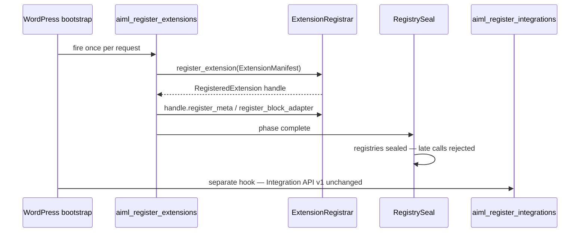

# TSC.6 — Public Extension / SEO Stabilization Implementation Plan

**Status:** **COMPLETE** on `main` @ `059c957b8eed0604082e3a899a6e2d2f94e8819a`
**Milestone:** TSC.6 Public Extension / SEO Stabilization
**Parent:** [TSC_PARENT_IMPLEMENTATION_PLAN.md](TSC_PARENT_IMPLEMENTATION_PLAN.md) (Architecture Frozen on `main`) §20, TS23
**External review:** **FREEZE** (seven amendments A1–A7 incorporated) · **STATE A** · **TARGET 7**
**Independent planning review:** [TSC6_PUBLIC_EXTENSION_SEO_STABILIZATION_PLANNING_VALIDATION_LOG.md](TSC6_PUBLIC_EXTENSION_SEO_STABILIZATION_PLANNING_VALIDATION_LOG.md)
**ADR:** [0022-public-extension-boundary-and-registration-lifecycle.md](../adr/0022-public-extension-boundary-and-registration-lifecycle.md) — **Required**
**Planning baseline:** `main` @ `7193d115af3cacf4c2053e51ec4399c27a505267`
**Depends on:** AI Multilingual **v1.3.0**; TIQ Complete; OTL Complete; TSC Parent Frozen; **TSC.0–TSC.5 COMPLETE**; `Migrator::TARGET` **7**; Integration API v1 (ADR-0017) proven in production
**Related:** [INTEGRATION_API_V1.md](../INTEGRATION_API_V1.md); ADR-0017; ADR-0013; ADR-0016; ADR-0021; ADR-0020; [TSC5 plan](TSC5_ELEMENTOR_COVERAGE_EXPANSION_IMPLEMENTATION_PLAN.md)
**Schema:** **STATE A** / TARGET **7** — no migration

**This document is the authoritative implementation specification for TSC.6.** Work packages TSC6.0–TSC6.7 are **COMPLETE**.

**Production implementation status:** **COMPLETE** — `TSC.6 IMPLEMENTATION REVIEW: PASS`
**TSC program status:** **TSC PROGRAM COMPLETE — TSC.0–TSC.6**

**Exact next step:** Recommend **v1.4.0** release as a separate authorized task. Do **not** bump version/TARGET, tag, release, or deploy without separate authorization.

**Prior review history:** Initial proposal → external review **AMEND** → seven refinements (A1–A7) → revalidation **PASS** → **TSC.6 PLAN REVIEW: FREEZE**

---

## Amendment response summary (external review)

| # | Topic | Decision |
|---|---|---|
| A1 | Resolver source identity | **`SourceSegmentReference` + `LanguageReference` (code, not DB ID).** Segment key alone insufficient. |
| A2 | Root extension ownership | **`ExtensionRegistrar` + `ExtensionManifest` + `RegisteredExtension` handle.** Registration phase + registry sealing. Integration API v1 remains separate. |
| A3 | Block public contract | **Decision B — narrow `ExtensionBlockAdapter`.** Internal `TranslatableBlockAdapter` not public. Internal bridge owns UUID/validation/sanitization. |
| A4 | Failure isolation | **Three honest tiers A/B/C.** Do not claim hook-level Throwable isolation outside AIML method invocations. |
| A5 | Diagnostics / Yoast | **WP-CLI committed** (`wp aiml extensions list/status`). Site Health **Deferred**. Yoast **Deferred — zero TSC.6 implementation**. |
| A6 | CPT/taxonomy admission | **Deferred.** Slug-only filters unsafe; PluginGuard forbids `aiml_admitted_*` filters today. |
| A7 | Public meta v1 | **Minimal DTO — no `overlay_capable` / overlay ownership token.** ACTIVE/INACTIVE/REMOVED + uninstall limitation documented. No durable registry table. |

---

## 1. Baseline audit

| Field | Value |
|---|---|
| Planning baseline main HEAD | `7193d115af3cacf4c2053e51ec4399c27a505267` |
| Version / TARGET | **1.3.0** / **7** |
| TSC.0–TSC.5 | **COMPLETE** |
| TSC.6 | **NOT STARTED** |
| Existing public contract | **Integration API v1** (ADR-0017, INTEGRATION_API_V1.md) |
| Internal registries (proven) | `SurfaceRegistry`, `RegisteredMetaRegistry`, `AdapterRegistry`, `ElementorControlRegistry`, `IntegrationRegistry` |
| PluginGuard | Already forbids `register_translatable_meta`, public Elementor symbols, `aiml_admitted_post_types`, `aiml_admitted_taxonomies` |

**Core finding:** TSC.6 extends proven TSC.0–TSC.5 internals with a **bounded, deny-by-default Extension API v1**. It does not expose Store, policy engines, or internal registries wholesale.

---

## 2. Milestone objective

TSC.6 is the **last TSC milestone**. It must:

1. Stabilize a **bounded public extension boundary** for third-party/first-party code-owned registrations.
2. Close **SEO integration consistency gaps** (Rank Math regression, documentation) without expanding Rank Math scope or implementing Yoast.
3. **Close the TSC program** upon implementation completion with explicit Supported/Deferred/Unsupported backlog and versioning policy.

TSC.6 must **not** become a generic translation API, public Store API, policy engine, or runtime field-configuration UI.

---

## 3. Public extension boundary (frozen)

### Remains internal (locked)

| Internal system | Disposition |
|---|---|
| `Store` / Extractor / SegmentAssembler | **Internal** — no public row access or writes |
| `SurfaceRegistry` / `SurfaceCapability` | **Internal** — too policy-adjacent |
| `RegisteredMetaRegistry` | **Internal** — public facade delegates here |
| `AdapterRegistry` | **Internal** — public facade delegates via bridge |
| `ElementorControlRegistry` | **Internal** — Elementor public registration **Deferred** |
| TI.6 Jobs policy | **Internal** |
| TI.7 PublicationPolicy | **Internal** — enforced inside resolver |
| OTL internals | **Internal** |

### Retained public (unchanged)

| Mechanism | Disposition |
|---|---|
| Integration API v1 (`aiml_register_integrations`) | **PUBLIC / stable** — authoritative for `p:` integrations |
| `PluginIdentity` / `p:` grammar | **PUBLIC / stable** |
| `aiml_switcher_in_menu` | **PUBLIC / stable** |

### New public (Extension API v1 — additive)

| API | Namespace / hook |
|---|---|
| `aiml_register_extensions` | hook |
| `ExtensionRegistrar` | `AIMultilingual\Extension\` |
| `ExtensionManifest` | `AIMultilingual\Extension\` |
| `RegisteredExtension` | `AIMultilingual\Extension\` |
| `ExtensionMetaDefinition` | `AIMultilingual\Extension\` |
| `ExtensionBlockAdapter` | `AIMultilingual\Extension\Block\` |
| `VisitorTranslationResolver` | `AIMultilingual\Extension\` |
| `SourceSegmentReference` | `AIMultilingual\Extension\` |
| `LanguageReference` | `AIMultilingual\Extension\` |
| `ResolvedTranslation` | `AIMultilingual\Extension\` |
| `aiml_mark_source_dirty()` | global function |

**Callable product (not extension API):** Workspace/Jobs/Glossary REST, existing `wp aiml *` commands, audit hooks.

---

## 4. Root extension ownership (frozen — A2)

### Registration lifecycle



### `ExtensionManifest` (public, immutable)

- `extension_id` — stable lowercase `[a-z0-9_]+`, max 32
- `version` — semver string
- `owned_namespaces` — list of `m:` namespace tokens this extension may register
- Optional `requires_plugins` map (slug → min version) for diagnostics only

### `RegisteredExtension` handle

- `register_meta(ExtensionMetaDefinition $def): void`
- `register_block_adapter(ExtensionBlockAdapter $adapter): void`
- All nested registrations inherit `extension_id` for diagnostics/collision attribution

### Hard rules

- Duplicate `extension_id` → reject entire extension (no partial)
- Extension cannot register meta under another extension's namespace
- One `(source_type, meta_key)` / one `m:` key / one block name → fail closed
- Activation/compatibility evaluated **once** when registries seal; result cached per request
- Registrations only during frozen phase; after seal → reject
- **No late mutation** after seal

### Integration API v1 relation

Remains **separate and authoritative** for `p:` integrations via `aiml_register_integrations` + `IntegrationRegistry`. Do **not** force `PluginIntegrationInterface` through `ExtensionRegistrar`.

---

## 5. Public meta v1 (frozen — A7)

### `ExtensionMetaDefinition`

- Inherited `extension_id` from parent registration (not repeated in DTO)
- `namespace`, `source_type` (`post`\|`term`), `meta_key` (exact string only)
- `label`, `text_format` (`plain`\|`html`)
- `admitted_subtypes` optional refine list
- `provider_allowed` default **false**
- Optional `activation` callable (fail closed)

### Not in public v1

- `overlay_capable`, `overlay_resolver_ownership`
- `extract_store_capable` (implicit true for registered meta)
- `external_p` mode (Integration API v1 only)
- Generic output filter registration
- Wildcard meta, serialized/object traversal
- `options` / `usermeta` / `theme_mods` surfaces

### Identity

`m:{namespace}:{meta_key}` — no new grammar; collision with existing keys → bootstrap reject.

### Visitor rendering pattern

1. Extension registers meta + owns official output hook
2. Calls `VisitorTranslationResolver::resolve(SourceSegmentReference, LanguageReference)`
3. Applies in-memory only; never persists canonical source

### Activation states

| State | Behavior |
|---|---|
| **ACTIVE** | Normal extract/provider/resolver |
| **INACTIVE** | Definition registered but inactive; **CASE B retain** existing Store rows; no provider/resolver overlay |
| **REMOVED** | Definition absent from registration → next-sync orphan/retirement semantics |

**Evaluation:** Once per request at registry seal; cached; `Throwable` → INACTIVE/fail closed; no repeated activation in OTL/render hot paths.

**Uninstall limitation:** If the owning plugin is **uninstalled**, AIML has no durable registration history and cannot distinguish temporary vs permanent removal. Retain-on-dependency-loss requires the extension plugin to remain loaded and register an **INACTIVE stub definition**. **No durable registry table.**

---

## 6. Public resolver (frozen — A1)

### Public DTOs

| DTO | Fields |
|---|---|
| **`SourceSegmentReference`** | `source_type` (`post`\|`term`), `source_id` (int), `segment_key` (string) |
| **`LanguageReference`** | `code` (string, e.g. `sv`, `pt-br`) — **not DB language ID** |
| **`ResolvedTranslation`** | `text`, `format` (`plain`\|`html`), `available` (bool) |

### Public API

```php
VisitorTranslationResolver::resolve(
    SourceSegmentReference $source,
    LanguageReference $language
): ?ResolvedTranslation;
```

### Internal behavior (fail closed)

- Validate `source_type` ∈ `{post, term}`
- Validate segment key grammar (`m:`, `p:`, `b:` only)
- Confirm source exists and is admitted via internal `SurfaceCapability` / admission checks
- Confirm registered definition/integration is **ACTIVE**
- Enforce TI.7 via internal `Store::is_publicly_overlay_eligible()` — no `force` option
- **Source/default language → `null`**
- Unknown/inactive/unadmitted identity → `null` + bounded diagnostic counter
- **No Store row exposure; no `translation_id` requirement**

---

## 7. Public block contract (frozen — A3, Decision B)

### Public: `AIMultilingual\Extension\Block\ExtensionBlockAdapter`

```php
interface ExtensionBlockAdapter {
    public function get_block_names(): array;
    public function get_supported_fields(): array;
    public function is_translatable_instance( array $block ): bool;
    public function extract_field( array $block, string $field_id ): ?string;
    public function apply_field( array $block, string $field_id, string $translated_text ): array;
    public function get_text_format( string $field_id ): string; // plain|html
}
```

### Internal bridge

`ExtensionBlockAdapterBridge implements TranslatableBlockAdapter` — owns:

- `b:` UUID identity (core-owned, ADR-0013)
- `ValidationResult`, `SanitizationSpec`
- `StructuralAttributeGuard`
- `AdapterRegistry` integration

**Do not expose** internal `TranslatableBlockAdapter`, `AdapterRegistry`, or `AIMultilingual\Block\*` as public API.

### Hard invariants

- Explicit block names and supported fields only
- No arbitrary JSON-path API
- No canonical `post_content` mutation
- No core block override/collision
- HTML fields → structural guard
- Feature flags not bypassed (`block_extraction_enabled`, `block_frontend_rendering_enabled`)

---

## 8. Public Elementor verdict

**Deferred.** No Elementor public registration API in TSC.6.

Third-party Elementor support continues via Integration API v1 (`p:` on owned post contexts) until a dedicated public DTO + strategy binding is designed.

---

## 9. Overlay extension verdict

**Unsupported:** No generic AIML overlay registration API.

Pattern: register source → own output hooks → resolve via `VisitorTranslationResolver` → in-memory apply only.

---

## 10. Invalidation API (frozen)

```php
function aiml_mark_source_dirty( string $source_type, int $source_id ): bool;
```

- Thin wrapper over `RequestLocalInvalidationCoordinator::mark_dirty()`
- Validates admitted `source_type` + registered/admitted source
- Marks dirty only; coalesces; **no immediate sync**
- **No** provider or extraction in callback
- Shutdown @ 20 remains sole sync authority (TSC.5 contract preserved)

---

## 11. Public write API verdict

**Unsupported.** No public translation target write, review mutation, publication mutation, direct provider invocation, or Store mutation.

---

## 12. Failure isolation (frozen — A4)

| Tier | Scope | AIML guarantee |
|---|---|---|
| **A — Registrar validation failure** | Malformed DTO passed to public registrar | Catch/validate; reject definition or extension; bounded diagnostic; **no partial registration** |
| **B — AIML-invoked callback** | `activation` and other callbacks AIML calls directly | Catch `Throwable`; fail closed; isolate affected extension/unit; bounded diagnostic; never log source body/secrets |
| **C — Third-party hook callback** | Code on `aiml_register_extensions` throws outside AIML method | **Normal WordPress/PHP hook semantics** — AIML does **not** claim isolation |

**Design mitigation:** Prefer declarative DTOs; only `activation` callable permitted in v1 meta manifest.

---

## 13. Diagnostics (frozen — A5)

### Supported (committed)

- WP-CLI: `wp aiml extensions list`
- WP-CLI: `wp aiml extensions status <extension_id>`

**Safe output only:** extension ID, version, active/inactive, definition counts, provider allowed/denied counts, bounded registration failure reason.

**Never expose:** callbacks, source values, targets, secrets, Store rows.

### Deferred

- Site Health diagnostics
- New admin diagnostics UI

---

## 14. CPT / taxonomy public admission (frozen — A6)

**Deferred.** Do not add slug-only public admission filters.

**Audit basis:**

- `AdmittedPostTypes` forbids public WP filter; context-specific sets
- `AdmittedTaxonomies` is code-owned with WooCommerce attribute pattern matching
- `PluginGuardTest` forbids `aiml_admitted_post_types` and `aiml_admitted_taxonomies`
- Slug-only filter cannot supply `SurfaceCapability` facts without bypassing TSC.0 source authority

**Future path:** Bounded `SourceSurfaceAdapter` contract — post-TSC.6.

---

## 15. SEO scope (frozen)

| Surface | TSC.6 action |
|---|---|
| Rank Math 6 literal post/term meta (SC1–6) | Regression tests only |
| OG/Twitter via official Rank Math hooks | Regression + HOOKS.md |
| Sitemap xhtml alternates | Regression + doc |
| Canonical/hreflang | Regression |
| Template/token fields (`%var%`) | Verify literal gate tests |
| Schema textual overlay (SC9) | Characterization only |
| Translated leaf slugs (A.SEOa) | **Deferred** |
| SE11 SitemapDiscovery | **Deferred** |
| **Yoast adapter** | **Deferred — no TSC.6 implementation** |
| Generic SEO HTML rewrite | **Unsupported** |

**No separate SEO public API.** Rank Math remains on existing `p:rankmath:*` identities — do **not** migrate to `m:`.

---

## 16. Supported public use cases (frozen)

| Use case | Verdict |
|---|---|
| A. Plugin-level integration (`p:` + output hooks) | **Supported** (Integration API v1) |
| B. Register exact-key visitor meta (`m:`) | **Supported** |
| C. Register custom Gutenberg block adapter | **Supported (narrow)** |
| D. Register custom Elementor widget/control | **Deferred** |
| E. Generic overlay/filter registration | **Unsupported** |
| F. Register SEO plugin via Integration API | **Supported** (Yoast **Deferred**) |
| G. Custom surface facts (CPT/taxonomy admission) | **Deferred** |
| H. Read translated value for custom render | **Supported** (resolver) |
| I. Notify source mutation | **Supported** (`aiml_mark_source_dirty`) |
| J. Direct translation writes / review / publish | **Unsupported** |

---

## 17. Identity namespace (frozen)

| Family | Grammar | Public extension use |
|---|---|---|
| Integration | `p:{integration_id}:…` | Integration API v1 only |
| Registered meta | `m:{namespace}:{meta_key}` | Public meta registration |
| Gutenberg | `b:{uuid}:{field}` | Core-owned UUID pipeline |
| Elementor | `e:d:…` | Code-owned only (ADR-0016) |
| Term native | `name`, `description` | Not registrable |

**No new public grammar in TSC.6.**

---

## 18. Collision / ownership rules (frozen)

Registration **must fail closed** on:

- Duplicate `(source_type, meta_key)` or duplicate `m:` segment key
- Duplicate block adapter for same `blockName`
- Duplicate `extension_id` or namespace collision across vendors
- Attempt to register core-owned surfaces (post title, term name, Rank Math six keys, TSC.3 Woo labels, existing core block adapters, Elementor eight-widget pairs)

**No last-registration-wins.**

---

## 19. Public documentation (TSC.6 deliverable — implementation)

Create during TSC6.6:

- `docs/EXTENSION_API_V1.md` — registration hook, DTO reference, examples, anti-patterns
- Refresh [INTEGRATION_API_V1.md](../INTEGRATION_API_V1.md) cross-links
- Update [HOOKS.md](../HOOKS.md) Rank Math overlay completeness

---

## 20. Reference test extension (frozen)

Synthetic fixture under `tests/fixtures/reference-extension/` (not shipped in production ZIP):

- One public `m:` meta field on `post`
- One public custom block adapter via `ExtensionBlockAdapter`
- Uses **only** `AIMultilingual\Extension\*` + Integration API v1
- **No** internal registry/service imports

---

## 21. Performance

Characterization targets:

- 25 extensions / 100 definitions registered
- Registry lookup O(1) per key
- No all-post/all-meta scans introduced
- Extension callbacks not invoked per OTL list row
- Activation evaluated once at seal — not in render hot paths

---

## 22. Backward compatibility

**Zero behavior change** for existing internal integrations (Rank Math, Woo, Gutenberg core 15, Elementor eight-widget, TSC.2 catalog). They remain code-owned bootstrap registrations — **not** forced through public registrar at TSC.6.

Public API is **additive**.

---

## 23. Schema / TARGET / release

| Field | Verdict |
|---|---|
| Schema | **STATE A** — runtime/code-owned registration; no new tables |
| TARGET | **7** — unchanged |
| Migration | **None** |
| Release recommendation | Complete TSC program → recommend **v1.4.0** (additive public API); separate authorization |

---

## 24. PX requirement matrix (PX1–PX31)

| ID | Requirement | Disposition |
|---|---|---|
| PX1 | Public API audit complete | Supported |
| PX2 | Supported use cases frozen | Supported |
| PX3 | Public/private boundary documented | Supported |
| PX4 | Registration lifecycle ACTIVE/INACTIVE/REMOVED | Supported |
| PX5 | Integration API v1 stabilization | Supported |
| PX6 | Root extension ownership registration | Supported |
| PX7 | Registration phase sealing / late reject | Supported |
| PX8 | Public meta registration simplified v1 | Supported |
| PX9 | Narrow public block adapter (Decision B) | Supported |
| PX10 | Public Elementor registration | **Deferred** |
| PX11 | Generic overlay registration | Unsupported |
| PX12 | Resolver with source segment identity + language code | Supported |
| PX13 | Public invalidation helper | Supported |
| PX14 | No public write API | Supported |
| PX15 | Provider default deny | Supported |
| PX16 | Identity namespace rules | Supported |
| PX17 | Collision/ownership fail-closed | Supported |
| PX18 | Authorization facts not policy bypass | Supported |
| PX19 | Honest failure isolation tiers A/B/C | Supported |
| PX20 | Activation once-at-seal + uninstall limitation doc | Supported |
| PX21 | WP-CLI extension diagnostics (committed) | Supported |
| PX22 | SEO Rank Math regression | Supported |
| PX23 | SEO template/literal gate preserved | Supported |
| PX24 | SEO docs/HOOKS completeness | Supported |
| PX25 | Yoast adapter | **Deferred (no TSC.6 impl)** |
| PX26 | CPT/taxonomy public admission | **Deferred** |
| PX27 | Public developer documentation | Supported |
| PX28 | Black-box reference extension tests | Supported |
| PX29 | PluginGuard public whitelist | Supported |
| PX30 | Performance characterization | Supported |
| PX31 | TSC program closure docs | Supported |

**Count: PX1–PX31**

---

## 25. Work package ladder (TSC6.0–TSC6.7)

| WP | Scope |
|---|---|
| **TSC6.0** | Audit freeze; ADR-0022; PX/AC freeze; falsification checklist |
| **TSC6.1** | `ExtensionRegistrar` + manifest/handle + sealing + `ExtensionMetaDefinition` + collision guards |
| **TSC6.2** | `ExtensionBlockAdapter` + internal bridge + reference fixture |
| **TSC6.3** | `SourceSegmentReference` + `LanguageReference` + `VisitorTranslationResolver` + `aiml_mark_source_dirty()` |
| **TSC6.4** | WP-CLI `wp aiml extensions list/status` (committed — no Site Health) |
| **TSC6.5** | SEO stabilization: Rank Math regression, HOOKS.md, template-gate tests |
| **TSC6.6** | `EXTENSION_API_V1.md`, examples, Integration API v1 cross-link refresh |
| **TSC6.7** | PluginGuard `assert_tsc6_invariants()`, black-box tests, evidence, TSC program closure |

---

## 26. Acceptance criteria (AC1–AC37)

| ID | Criterion |
|---|---|
| AC1 | Valid meta registers via `RegisteredExtension` handle only |
| AC2 | Duplicate meta key / `m:` identity rejected |
| AC3 | Wildcard/serialized/object meta rejected |
| AC4 | `provider_allowed` defaults false |
| AC5 | Valid block via `ExtensionBlockAdapter`; core collision rejected |
| AC6 | HTML block fields routed through internal structural guard bridge |
| AC7 | Resolver requires complete `SourceSegmentReference` (type + id + segment_key) |
| AC8 | Resolver rejects unknown/inactive/unadmitted source identity |
| AC9 | Resolver enforces TI.7; source/default language returns null |
| AC10 | Resolver exposes no Store row or internal IDs |
| AC11 | Resolver accepts `LanguageReference` code, not raw language DB ID |
| AC12 | `aiml_mark_source_dirty` coalesces; no immediate sync |
| AC13 | Invalidation rejects unregistered/unadmitted sources |
| AC14 | Duplicate `extension_id` rejected; namespace ownership enforced |
| AC15 | Late registration after seal rejected |
| AC16 | INACTIVE stub retains Store rows (CASE B) |
| AC17 | Uninstall limitation documented (no magic retain without stub) |
| AC18 | Tier A: malformed registrar input rejects without partial catalog |
| AC19 | Tier B: AIML-invoked callback Throwable isolated per extension/unit |
| AC20 | Tier C documented: hook-level throws not claimed isolated |
| AC21 | No public direct translation writes |
| AC22 | No public TI.6/TI.7 policy mutation |
| AC23 | Rank Math six-field behavior unchanged |
| AC24 | Template-only SEO meta not extracted as literal |
| AC25 | OG/sitemap/canonical regression pass |
| AC26 | Integration API v1 integrations unchanged |
| AC27 | Internal Rank Math/Woo/Gutenberg/Elementor bootstrap unchanged |
| AC28 | PluginGuard TSC.6 whitelist enforced |
| AC29 | Black-box reference extension uses only `AIMultilingual\Extension\*` + Integration v1 |
| AC30 | `wp aiml extensions list/status` returns bounded safe facts only |
| AC31 | `EXTENSION_API_V1.md` complete |
| AC32 | No REST registration endpoints |
| AC33 | No generic admin field UI |
| AC34 | TARGET 7 / no migration |
| AC35 | TSC.0–TSC.5 regression green |
| AC36 | Site Health diagnostics not shipped (Deferred verified) |
| AC37 | TSC program closure documented |

**Count: AC1–AC37**

---

## 27. Test strategy

- **Unit:** DTO validation, identity/collision, namespace rules, registrar sealing
- **Integration:** reference extension (meta + block), resolver, invalidation, OTL/Jobs/TI.7 interaction
- **Black-box:** reference fixture uses **only** `AIMultilingual\Extension\*` + Integration API v1
- **Security:** wildcard denial, provider default deny, Store inaccessible from public API
- **SEO regression:** Rank Math literal/template/sitemap/OG suite
- **Architecture:** `PluginGuardTest::assert_tsc6_invariants()`
- **Performance:** 25 extensions / 100 definitions fixture
- **Browser:** Not required (Site Health Deferred)

---

## 28. Public contract falsification checklist

| # | Claim | Result |
|---|---|---|
| 1 | Resolver uniqueness | **PASS** |
| 2 | Language identity stability | **PASS** |
| 3 | Extension ownership | **PASS** |
| 4 | Namespace ownership | **PASS** |
| 5 | Registration sealing | **PASS** |
| 6 | Block API compatibility burden | **PASS** |
| 7 | Failure-isolation honesty | **PASS** |
| 8 | Inactive/removal semantics | **PASS** |
| 9 | Meta overlay model | **PASS** |
| 10 | CPT/taxonomy admission safety | **PASS** (Deferred) |
| 11 | Provider default deny | **PASS** |
| 12 | No public Store leakage | **PASS** |
| 13 | No public write/policy mutation | **PASS** |
| 14 | Rank Math compatibility | **PASS** |
| 15 | No Yoast scope creep | **PASS** |
| 16 | Deterministic diagnostics | **PASS** |
| 17 | Performance | **PASS** |
| 18 | TSC.0–TSC.5 backwards compatibility | **PASS** |
| 19 | STATE A | **PASS** |
| 20 | ADR-0022 sufficiency | **PASS** |

---

## 29. Explicit non-goals

Runtime admin field UI · public Store mutation · public provider invocation · public review/publication APIs · arbitrary SQL · wildcard postmeta · options/usermeta surfaces · arbitrary JSON/HTML engines · dynamic customer/order data · site-specific integrations · forced internal adapter migration · durable registration table · Elementor public widget API v1 · Yoast implementation · Site Health diagnostics · CPT/taxonomy slug-only admission filters

---

## 30. STOP audit

| Trigger | Result |
|---|---|
| Durable registration schema | Not required |
| Public Store row exposure | Rejected |
| Resolver without full source identity | Rejected — A1 fix |
| Resolver without TI.7 | Rejected — internal enforcement |
| Unsafe CPT slug-only admission | Rejected — Deferred (A6) |
| Public block API exposing Strategy F internals | Rejected — Decision B |
| Overclaimed hook Throwable isolation | Rejected — Tier C honest (A4) |
| Undefined overlay ownership token in public v1 | Rejected — removed (A7) |
| Optional TSC.6 product scope | Rejected — committed diagnostics only (A5) |
| Backward compatibility break | Rejected — additive only |

**STATE A holds. ADR-0022 required.**

---

## 31. Final verdict

**`TSC.6 IMPLEMENTATION REVIEW: PASS`**

**TSC.6 Public Extension / SEO Stabilization COMPLETE**

**TSC PROGRAM COMPLETE — TSC.0–TSC.6**
