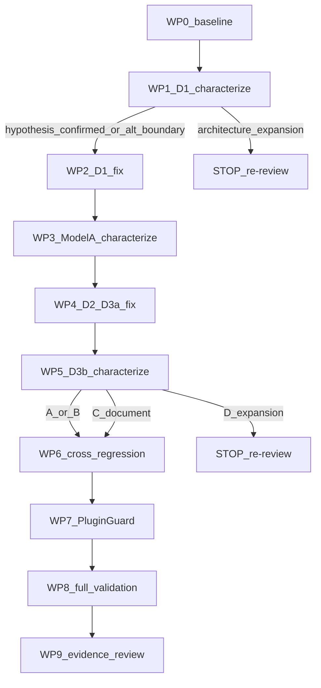

# v1.5.1 Localized URL Correctness / SEO Stabilization — Implementation Plan

**Status:** **Architecture Frozen** — authoritative specification for v1.5.1 corrective implementation  
**Milestone:** v1.5.1 Localized URL Correctness / SEO Stabilization  
**Kind:** Bounded corrective milestone (not MSEO.6 / Program B / SEO redesign)  
**ADR:** [0023-localized-url-overlay-architecture.md](../adr/0023-localized-url-overlay-architecture.md) (**Accepted**)  
**Evidence:** [V1_5_0_PREPRODUCTION_GATE_B_DOGFOOD.md](../validation/V1_5_0_PREPRODUCTION_GATE_B_DOGFOOD.md)  
**Decision record:** Post-MSEO Reprioritization A1–A5 (accepted) · Final freeze amendments A1–A3 (applied)  
**STATE:** A · **TARGET 8** (no migration) · **Implementation version remains:** 1.5.0  
**Expected release version:** 1.5.1 (release-prep only; not authorized by this implementation phase)  
**Planning materialization:** docs-only freeze on `main`  
**Implementation branch:** `feature/v151-localized-url-correctness-stabilization`  
**Baseline at freeze:** `main` @ `82a0346d207f5be54cc91a39bb1c682f1de0f64e`  
**Depends on:** MSEO.0–MSEO.5 COMPLETE; ADR-0023 Accepted; Gate B dogfood evidence  

**This document is the authoritative implementation specification for v1.5.1 corrective work.**  
PRODUCTION DEPLOYMENT is forbidden. DEV published-artifact acceptance is a **separate** post-release phase.  
Release preparation (version bump / tag / GitHub Release) is **not** authorized by the implementation phase.

**Acceptance:** V151AC1–V151AC22 · **Work packages:** WP0–WP9  
**Artifact stages:** (1) implementation package audit at 1.5.0 · (2) release-prep `ai-multilingual-1.5.1.zip` · (3) published GitHub Release DEV acceptance

---

## 1. Milestone identity

| Item | Value |
|---|---|
| Name | v1.5.1 Localized URL Correctness / SEO Stabilization |
| Kind | Bounded **corrective milestone** (not MSEO.6 / Program B / SEO redesign) |
| Expected release | **1.5.1** at release-prep only (A4 — no early bump) |
| Goal | Restore Supported contracts broken under LU ON (completion + Model A EffectiveUrl agreement) |

### Explicit exclusions

Program B UX; taxonomy publish REST/UI; Jobs/stale/Strategy F UX; CLI convenience unless correctness-required; translated bases/endpoints/variations/layered-nav; Ext API 1.1; TARGET 9; sitemap primary `/sv` `<loc>` redesign; speculative SEO hooks; new URL authorities; production deploy.

---

## 2. Architectural boundary (frozen)

- EffectiveUrl = sole outbound localized URL authority  
- Router = inbound recognition authority  
- Model A = SEO/discovery (default-language sitemap locs + xhtml alternates)  
- TARGET 8; no public API expansion expected  
- No competing SEO URL authority; no route mutation from SEO consumers  
- LU OFF remains inert; source URLs remain healthy  
- Existing route/history rows remain valid  

**Data compatibility (verified expectation):** no changes required to `aiml_slug_routes` / history / frontier / slug_origin schema; no forced rematerialization. If a fix unexpectedly requires deterministic rematerialization, document why and keep TARGET 8 — else **STOP**.

---

## 3. Defect package map

| ID | Class | Planning authority |
|---|---|---|
| **D1** | PRODUCT DEFECT HIGH | Characterization-first; hypothesis not frozen as fix (A1) |
| **D2** | PRODUCT DEFECT HIGH | hreflang proven DIVERGES; other consumers classified separately (A2) |
| **D3a** | Likely D2/SB11 family | Characterize og:url → DIVERGES or ALREADY CORRECT |
| **D3b** | Independent render health | Characterize independently (A3); four dispositions |

**Leading D1 hypothesis (investigative only):** [`Router::filter_term_link`](../../src/Routing/Router.php) (~629–662) ↔ [`HierarchyPathBuilder::source_path_for_term`](../../src/Routing/HierarchyPathBuilder.php) (~78–99) ↔ `get_term_link`, when no stored term `source_path`. Rank Math breadcrumbs often initiate `get_term_link` in head — **trigger, not presumed owner**.

**home_url anti-recursion pattern to emulate if hypothesis confirmed:** already-prefixed / denylist / active localized_path short-circuit in `filter_home_url` / `admit_localized_path` — **not** a preselected production patch.

---

## 4. Work-package ladder

### WP0 — Preflight / baseline / evidence capture

- **Objective:** Lock HEAD, version 1.5.0, TARGET 8, Gate B fixtures/IDs, fail-reproduction notes (GET not HEAD).  
- **Files:** none production. Docs notes under implementation evidence only after auth.  
- **Contract:** planning continuity.  
- **Exclusions:** no version bump; no DEV mutation in planning; no prod.  
- **STOP:** unexpected TARGET/schema drift on main.

### WP1 — D1 characterization + failing regression (SAFE / BOUNDED)

- **Objective:** Prove the **actual defective call/re-entry chain** before any production fix is selected.  
- **Likely production (read):** [Router.php](../../src/Routing/Router.php), [HierarchyPathBuilder.php](../../src/Routing/HierarchyPathBuilder.php).  
- **Tests (new/extend):** prefer new `tests/integration/V151D1TermLinkRecursionTest.php` (or extend [Mseo3HierarchyTermsTest.php](../../tests/integration/Mseo3HierarchyTermsTest.php)).  
- **Safety rule (frozen):** Characterization **MUST NOT** deliberately trigger uncontrolled infinite recursion, PHP max-execution timeout, or resource exhaustion inside automated tests/CI.  
- **Required proof shape:** deterministic **bounded** evidence of the defective re-entry chain. Acceptable forms include: controlled call-count instrumentation; explicit re-entry detection; bounded hook/filter invocation tracing; a deliberately capped characterization harness; or another deterministic test that proves the same defective cycle without hanging the runner.  
- **Runtime evidence (separate):** Gate B GET timeout/500 on `/sv/gate-b-dogfood-sida/` remains the user-visible failure proof; HEAD≠GET remains a known false-healthy probe. Automated WP1 does not replace that runtime evidence.  
- **Must establish before WP2:** initiating hook/filter; repeated component(s); object/conditions; stored vs unstored `source_path` effect; whether Rank Math is trigger-only; which of home_url / redirect_canonical / hierarchy / Woo paths participate or not.  
- **Contract:** characterization evidence establishes the defective chain **before** fix selection; test fails on unfixed tree in a **bounded** way (e.g. asserts re-entry count exceeded a safe cap / detects nested `filter_term_link` while resolving source path).  
- **STOP:** root requires new path/SEO authority, Rank Math fork, or TARGET change.

### WP2 — D1 bounded corrective fix (NO PREFERRED MECHANISM)

- **Prerequisite:** WP1 has established the defective chain with bounded characterization evidence.  
- **Objective:** Apply the **smallest architecture-consistent correction** that eliminates the established re-entry/correctness defect while preserving existing routing, EffectiveUrl, source URL, history, and Model A authorities.  
- **Likely production:** only components proven by WP1 (commonly `Router::filter_term_link` and/or `HierarchyPathBuilder::source_path_for_term` if hypothesis confirmed).  
- **Implementation mechanisms:** **NON-AUTHORITATIVE EXAMPLES ONLY. WP1 CHARACTERIZATION DETERMINES THE FIX.** Do not freeze preference among reentrancy flags, temporary `remove_filter`, stored `source_path` preference, parsing incoming `$url`, or any other tactic.  
- **Outcomes required:** CURRENT_LOCALIZED GET completes; no max-exec timeout; term_link/`get_term_link` interaction bounded; source term URL correct; EffectiveUrl sole outbound authority; no new router/path authority.  
- **Exclusions:** Rank Math clone; breadcrumb rewrite; architecture expansion; Program B.  
- **STOP:** characterization requires architecture expansion, or the smallest fix cannot preserve frozen authorities.

### WP3 — Model A consumer characterization (D2 / D3a graph)

Characterize **each** consumer under CURRENT_LOCALIZED + discoverable + active route (flat + hierarchical; product for og:url):

| Consumer | Owner | Classify |
|---|---|---|
| hreflang | [DocumentSeoHead](../../src/Seo/DocumentSeoHead.php) → [LanguageRelationshipService](../../src/Seo/LanguageRelationshipService.php) | expect **DIVERGES** (Gate B) |
| canonical | `DocumentSeoHead` → `current_canonical_url` | DIVERGES or ALREADY CORRECT |
| og:url | [RankMathIntegration::reinforce_og_url](../../src/Integration/RankMath/RankMathIntegration.php) via `current_public()` | DIVERGES or ALREADY CORRECT (D3a) |
| switcher | [Switcher::links](../../src/Frontend/Switcher.php) | DIVERGES or ALREADY CORRECT (note intentional SA7 when !discoverable) |
| sitemap xhtml | [RankMathSitemapOverlay](../../src/Integration/RankMath/RankMathSitemapOverlay.php) | DIVERGES or ALREADY CORRECT; **do not** change Model A primary locs |

- **Tests:** extend [AseobCanonicalHreflangTest](../../tests/integration/), [AseodOpenGraphTest](../../tests/integration/), [AseoeSitemapTest](../../tests/integration/), [SwitcherTest](../../tests/), [Mseo2PublicRoutingTest](../../tests/integration/Mseo2PublicRoutingTest.php) — **must include CURRENT_LOCALIZED + discoverable + active route** (gap today: mostly SA7/OFF).  
- **Focus mechanism:** SB11 does not use `RouteRecognitionContext`; resolves via `url_to_postid` on rewritten source path — prove whether resolve miss causes SA7.  
- **Invariant:** Supported consumers for same discoverable object/language agree on EffectiveUrl.  
- **Exclusions:** new SEO authorities; speculative hooks; sitemap redesign.

### WP4 — Proven D2/D3a consumer corrections only

- **Prerequisite:** WP3 classifications.  
- **Objective:** Smallest fix for **DIVERGES** only; ALREADY CORRECT → regression only.  
- **Likely production:** `LanguageRelationshipService` object resolution / `url_for_language` / `for_public_request` / `current_public`; possibly `DocumentSeoHead` only if emit-side bug proven. Prefer fix shared SB11 resolution over per-consumer forks.  
- **Contract:** hreflang (and any other DIVERGES) == EffectiveUrl on CURRENT_LOCALIZED when discoverable.  
- **STOP:** requires second URL authority or Model A redesign.

### WP5 — D3b Woo render-health characterization + disposition

- **Objective:** Independent of D1 “adjacency.” Compare localized Woo GET vs source vs LU OFF; status; completeness; fatals; recursion; path builders.  
- **Likely read:** [WooProductPathBuilder](../../src/Routing/WooProductPathBuilder.php), Router, Rank Math head; [Mseo4WooProductPermalinkTest](../../tests/integration/Mseo4WooProductPermalinkTest.php).  
- **Dispositions:** (A) same as D1 → reuse fix + Woo regression; (B) distinct bounded AIML → smallest fix in v1.5.1; (C) env/theme/plugin → document only; (D) architecture expansion → **STOP**.  
- **Exclusions:** Woo endpoint localization; variation routes.

### WP6 — Cross-surface regression hardening

- Flat/hierarchical/history/source/OFF matrix; collision unchanged; hierarchy rematerialization unchanged; one-hop history; no loops.  
- Tests: Mseo1–4 suites + new V151 tests.

### WP7 — PluginGuard / architecture guards

Extend [PluginGuardTest.php](../../tests/integration/PluginGuardTest.php) with durable boundaries:

- TARGET remains 8; no `step_9_` / new migration  
- No new SEO hook surface without plan authority  
- No second EffectiveUrl / route authority symbols  
- Prefer behavior tests over brittle ROADMAP prose  

### WP8 — Implementation-phase validation (packageable tree; NOT release artifact)

**Stage 1 — Implementation build/package audit (version remains 1.5.0):**

- PHPCS PASS  
- unit PASS  
- integration PASS (incl. V151)  
- PluginGuard PASS  
- quality/baseline PASS  
- build/package audit PASS (`bin/build-zip.sh` + `bin/audit-zip.sh` against the **1.5.0-labeled** corrective tree)

This proves the corrective tree remains packageable. It is **NOT** the eventual `ai-multilingual-1.5.1.zip` release artifact.

**Stage 2 — Release-preparation (separate phase after merge/closure):** version 1.5.0 → **1.5.1**; release metadata; build actual `ai-multilingual-1.5.1.zip`; release ZIP audit PASS.

**Stage 3 — Published-artifact DEV acceptance (separate):** GitHub Release ZIP only; independent SHA-256; deploy/test on **dev.biopentra.eu** only.

Do not blur these three stages.

### WP9 — Implementation evidence / review prep

Evidence doc + PR description mapping V151AC*; characterization results; DIVERGES table; D3b disposition; STOP log if any.

---

## 5. Numbered acceptance criteria (V151AC)

**D1**  
- **V151AC1** Before the production fix is selected, deterministic **bounded** characterization evidence establishes the actual defective re-entry/call chain (controlled call-count, explicit re-entry detection, capped harness, or equivalent). The characterization **must not** require uncontrolled infinite recursion, PHP max-execution timeout, or resource exhaustion in automated tests. Gate B runtime GET timeout/500 remains separate user-visible evidence.  
- **V151AC2** After fix, the same bounded characterization/regression assertion passes (no defective re-entry; call depth within safe bound).  
- **V151AC3** CURRENT_LOCALIZED GET for Gate B–class page completes (no max-exec / AIML 500) — proven in DEV published-artifact acceptance (GET, not HEAD).  
- **V151AC4** Source `get_term_link` / canonical source term URL remains correct.  
- **V151AC5** Localized term URLs remain correct where Supported.  
- **V151AC6** No new URL/path authority introduced.

**D2 / Model A**  
- **V151AC7** For discoverable hierarchical parent with active route, hreflang target language URL **equals** EffectiveUrl absolute.  
- **V151AC8** Same agreement for flat discoverable page with active route.  
- **V151AC9** Source-request and CURRENT_LOCALIZED yield consistent hreflang set for same object (or documented intentional asymmetry with test).  
- **V151AC10** Each of canonical, og:url, switcher, sitemap xhtml classified DIVERGES or ALREADY CORRECT with evidence.  
- **V151AC11** Every DIVERGES consumer corrected to EffectiveUrl agreement; ALREADY CORRECT unchanged except regression tests.

**D3a**  
- **V151AC12** Woo/product og:url classification recorded; if DIVERGES, reinforced URL equals EffectiveUrl when discoverable; if ALREADY CORRECT, regression only.

**D3b**  
- **V151AC13** Root-cause disposition A/B/C/D recorded with evidence.  
- **V151AC14** If A or B: localized Woo GET complete (no AIML timeout/fatal/truncation). If C: AIML unchanged + doc. If D: STOP (milestone incomplete until re-review).

**Routing / data / OFF**  
- **V151AC15** Source URLs healthy under ON.  
- **V151AC16** Current localized URLs resolve; history remains one-hop; no loops/chains.  
- **V151AC17** Collision and hierarchy semantics unchanged.  
- **V151AC18** LU OFF remains inert (SA7 / frozen OFF behavior).  
- **V151AC19** TARGET === 8; no migration; existing routes/history valid without forced rematerialization (unless proven + documented).

**Quality / artifact stages**  
- **V151AC20 (implementation phase):** PHPCS, unit, integration, PluginGuard, quality/baseline, and **implementation** build/package audit PASS while plugin version remains **1.5.0**. This is not the v1.5.1 release artifact.  
- **V151AC21 (release-prep phase):** After authorized version bump, build `ai-multilingual-1.5.1.zip` and release ZIP audit PASS.  
- **V151AC22 (published-artifact DEV acceptance):** Independently verify GitHub Release ZIP SHA-256; accept on **dev.biopentra.eu** only (GET proofs for D1/D2/D3 as applicable).

---

## 6. Regression matrix (focused Supported)

| Objects | States | Consumers / behavior |
|---|---|---|
| Flat page/post, hierarchical parent/child, term (term_link path), product | Source, CURRENT_LOCALIZED, HISTORY, LU OFF | GET completion; canonical; hreflang; x-default; og:url; switcher; sitemap xhtml |
| | | no recursion; no loop; one-hop history; EffectiveUrl agreement when discoverable; SA7/omit per frozen policy when !discoverable |

Do not expand Supported scope.

---

## 7. Release sequencing (three artifact stages; A4)

### Stage 1 — Implementation (version stays 1.5.0)

1. Branch from current main  
2. WP1–WP9 on branch (**no version bump**)  
3. Independent implementation review  
4. Feature PR → green CI → merge  
5. Fresh main CI  
6. Corrective implementation closure  
7. Implementation build/package audit PASS (packageable tree; **not** release ZIP)

### Stage 2 — Release preparation (separate authorization)

8. Version **1.5.0 → 1.5.1**; changelog / release notes  
9. Build actual `ai-multilingual-1.5.1.zip`  
10. Release ZIP audit PASS  
11. Release review PR → green main  
12. Annotated tag `v1.5.1` + GitHub Release (**separate auth**)

### Stage 3 — Published-artifact DEV acceptance (separate authorization)

13. Download published GitHub Release `ai-multilingual-1.5.1.zip`  
14. Independently verify SHA-256  
15. Deploy/test on **dev.biopentra.eu** only (not git mount; not production)  
16. Fresh roadmap prioritization — Program B not automatic  

---

## 8. DEV published-artifact re-acceptance contract (define now; execute later)

- Environment: **dev.biopentra.eu only**; **biopentra.eu forbidden**  
- Artifact: published GitHub Release `ai-multilingual-1.5.1.zip` only (not git mount; not Stage 1 audit ZIP); independent SHA-256  
- Before/after vs Gate B: D1 GET `/sv/gate-b-dogfood-sida/` **completes** (no timeout/500); D2 parent hreflang==EffectiveUrl; D3a og:url; D3b complete Woo HTML if A/B  
- Also: source routes; flat/hierarchy; history one-hop; canonical; hreflang; x-default; switcher; sitemap xhtml Model A; LU OFF; no loops; no new AIML fatals  
- Prefer **GET** over HEAD for completion health  

---

## 9. Program B / post-gate

Program B remains **DEMOTED**. After published 1.5.1 + DEV re-acceptance → evidence review → **fresh prioritization** before any feature program.

---

## 10. Architecture-expansion STOP conditions

STOP for re-review if implementation would require: new router/path/SEO authority; Model A primary-loc redesign; TARGET/migration without proof; Rank Math fork / breadcrumb clone; Program B surfaces; fixing D3b via architecture expansion (disposition D); contradiction with A1–A5 that cannot be resolved inside this plan.

---

## 11. Unresolved planning questions

**None blocking freeze.** Open items are **implementation characterization outputs** (exact D1 chain confirmation; per-consumer DIVERGES table; D3b A/B/C/D), not planning gaps.

---

## 12. Required output checklist

1. HEAD `82a0346d2` · 2. matches origin · 3. 1.5.0 · 4. TARGET 8 · 5. tag `03a3a09a7` · 6. Gate B reviewed · 7. ADR-0023 Accepted · 8. STATE A · 9. Migration NONE · 10. branch `feature/v151-localized-url-correctness-stabilization` · 11–13. D1 **safe bounded** char / hypothesis / STOP · 14–16. D2 map / D3a / D3b · 17. Sitemap Model A preserved · 18. Taxonomy GAP out of scope · 19–20. Data OK / no API expansion · 21. WP0–WP9 · 22–23. Router/HierarchyPathBuilder/SB11/DocumentSeoHead/RankMath*/Switcher + V151/Mseo/Aseo* tests · 24. PluginGuard TARGET/no new authority · 25. V151AC1–22 · 26–27. matrices · 28. independent review · 29. **three artifact stages** (impl audit ≠ release ZIP ≠ DEV accept) · 30. DEV re-accept · 31. prod forbidden · 32. Program B demoted · 33. exclusions · 34. STOP conditions · 35. no blocking questions · 36. WP2 **no preferred mechanism** · 37. FROZEN · 38. next = implement on feature branch; hard-stop before release-prep  

---

## Final freeze amendments applied

- **A1:** Safe D1 characterization — bounded deterministic proof; no uncontrolled recursion/timeout/exhaustion in CI; Gate B remains runtime evidence; DEV GET still required after fix.  
- **A2:** WP2 — no frozen preferred fix mechanism; smallest architecture-consistent correction; WP1 determines the fix; STOP if expansion needed.  
- **A3:** Three artifact stages separated — impl package audit at 1.5.0; release-prep 1.5.1 ZIP; published-artifact DEV acceptance.

All other frozen decisions preserved (STATE A, TARGET 8, no migration, no public API expansion, D1-first, D2/D3a per-consumer, D3b independent, Model A, Program B demoted, no early version bump, production forbidden, DEV published-artifact mandatory, architecture-expansion STOP).

---

V1.5.1 CORRECTIVE IMPLEMENTATION PLAN: ARCHITECTURE FROZEN

STATE: A  
TARGET: 8  
MIGRATION: NONE  
VERSION (implementation): 1.5.0  

IMPLEMENTATION: AUTHORIZED ON FEATURE BRANCH AFTER THIS FREEZE  
RELEASE PREPARATION: NOT AUTHORIZED BY THIS PHASE  
PRODUCTION biopentra.eu: FORBIDDEN  

STOP (after freeze materialization): begin implementation on `feature/v151-localized-url-correctness-stabilization`.
